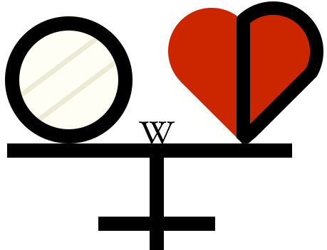

#   FreeODwiki 

FreeODwiki是一个由社群维护的百科全书，主题是OD/药物滥用/毒品/精神活性物质等，条目涵盖各个[具体药物的信息](药物/index.md)、药物产生的各类[主观效应](药效/index.md)、使用药物的[体验心得](报告/index.md)、药物相关的[文档和资料](文档/index.md)、精神药理学等[科学知识](文档/科学信息索引页.md)、药物[减害指南](文档/负责任的用药索引页.md)、药物相关的[技术与教学](文档/教学索引页.md)、药物与[社会的联系](文档/社会学/index.md)、药物相关的[观点与讨论](文档/观点讨论/index.md)。截至2026年5月，FreeODwiki的文档总数近2000篇，且仍在继续增加中。

FreeODwiki的目标是：为所有感兴趣的人提供一个共享知识、讨论药物议题的平台；从基于事实的视角出发，记录药物使用的各方各面；提供科普知识和可行方案，倡导以负责任的方式使用药物；保障就对意识与身体的探索方面做出知情的决定所需要的信息，并以此弘扬世俗主义、自由思想和个体自主权的理念，改变固有的某些观念。 <!-- 模仿psywiki的  -->

无论你是有经验的开源项目合作者，还是从未接触过开源项目的新手；无论你是有经验的药物使用者，还是只是对药物话题感兴趣的读者，我们都欢迎你加入我们社区哦~

本README仍在施工中......

网站主页链接：[网站主页](index.md)

贡献指南：[贡献指南](CONTRIBUTING.md)

行为准则：[行为准则](CODE_OF_CONDUCT.md)

|  | 我们的Github仓库收获的stars |
| --------------------------------------------------------------------------------- | --------------------------- |

除非另有说明，本站的页面采用[CC-BY-SA 4.0](LICENSE)许可协议。

