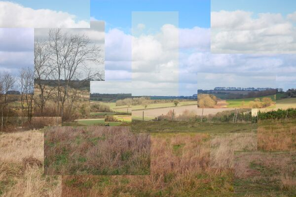
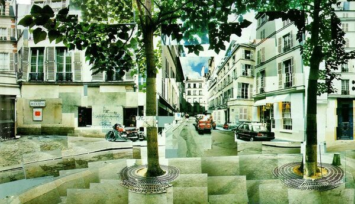

[◀返回](./home.html)

# 环境立体主义

[//gfycat.com/ifr/RectangularYellowKingbird](/FreeODwiki//gfycat.com/ifr/RectangularYellowKingbird)

**公园里的环境立体主义** by **StasConstantine** \- 这张图像准确地描绘了一种常见的[分离](../药效/分离效应.md "分离")效应，也就是在公园里看到的环境立体主义喵。

**环境立体主义**是被定义为一种将外部环境视觉分割成数量和大小不一的方块和立方体的现象哦。[\[1\]](#cite_note-1) 一旦这种分割形成了，这些部分就会开始慢慢地从原来的位置飘走，而且经常会改变大小，导致它们之间出现缝隙呢。这些缝隙里的空间可能是完全黑暗的，也可能由紧密结合的视觉[几何](../药效/几何.md "几何")组成。值得注意的是嘛，这种效果在外观上与立体主义摄影和艺术作品非常相似呢。

这种黑暗的空间最终可能会变大，逐渐减小立方体的大小，直到人发现自己被一个[分离空洞](../药效/视觉断连.html#孔洞、空间和空虚 "视觉断连")包围。能天生地感觉并探测到扭曲的不同部分以及它们之间缝隙的细节和布局，这并不罕见哦。

环境立体主义通常伴随着其他同时发生的效应，比如[环境球体化](../药效/环境球体化.md "环境球体化")和[视觉断连](../药效/视觉断连.md "视觉断连")。它通常是在[严重](../文档/给药剂量.html#heavy "剂量") [剂量](../文档/给药剂量.md "剂量")的[解离剂](../文档/药物分类/解离剂.md "解离剂")类化合物影响下产生的，比如[氯胺酮](../药物/氯胺酮.md "氯胺酮")、[PCP](../药物/PCP.md "PCP")和[右美沙芬](../药物/右美沙芬.md "右美沙芬")。

## 目录

* [1 图像示例](#图像示例)
* [2 精神活性物质](#精神活性物质)
* [3 体验报告](#体验报告)
* [4 另见](#另见)
* [5 外部链接](#外部链接)
* [6 参考文献](#参考文献)

#### 图像示例

|  | [标题](../药效/属性:标题.md "属性:标题") |
| --- | --- |
|  | **霍克尼的母亲** by **[大卫·霍克尼](http://www.hockneypictures.com/home.php)** |
|  | **立体主义树林** by **Chelsea Morgan** |
|  | **立体主义田野** by **Chelsea Morgan** |
|  | **照片蒙太奇** by **[大卫·霍克尼](http://www.bideford.devon.sch.uk/art/gcse07/viewpoints/slides/photo%20montage%20by%20david%20hockney.html)** |
|  | **时空立体主义者** by **[Diego Kuffer](http://diegokuffer.com/)** |

<!-- 请勿删除或修改，这是一个标记，待识别并填坑（药效索引） -->

### 体验报告

在我们的[体验索引](../文档/教学索引页.md "体验索引")中描述这种效应的轶事报告包括：

* [Experience:2mg 25C-NBOMe - Experimental trip to test personal limits of NBOMes](../报告/psychounautwiki/Experience:2mg_25C-NBOMe_-_Experimental_trip_to_test_personal_limits_of_NBOMes.md "Experience:2mg 25C-NBOMe - Experimental trip to test personal limits of NBOMes")
* [Experience:700mg - To the dextroverse.](../报告/psychounautwiki/Experience:700mg_-_To_the_dextroverse..md "Experience:700mg - To the dextroverse.")
* [Experience:Unknown Dosages: 1 psilocin chocolate, 1 hit LSD; Lawing the Mown](../报告/psychounautwiki/Experience:Unknown_Dosages:_1_psilocin_chocolate,_1_hit_LSD;_Lawing_the_Mown.md "Experience:Unknown Dosages: 1 psilocin chocolate, 1 hit LSD; Lawing the Mown")

### 另见

* [负责任的用药](../文档/负责任的用药索引页.md "负责任的用药")
* [主观效应索引](../药效/home.md "主观效应索引")
* [迷幻剂 - 主观效应](../文档/药物分类/迷幻剂.html#主观效应 "迷幻剂")
* [解离剂 - 主观效应](../文档/药物分类/解离剂.html#主观效应 "解离剂")
* [谵妄剂 - 主观效应](../文档/药物分类/谵妄剂.html#主观效应 "谵妄剂")

### 外部链接

* [立体主义 (维基百科)](https://en.wikipedia.org/wiki/Cubism)

### 参考文献

1. [↑](#cite_ref-1) Huxley, A. (1954). [*The Doors of Perception*](https://en.wikiquote.org/wiki/Aldous_Huxley#The_Doors_of_Perception_(1954)). p. 22. [ISBN](http://en.wikipedia.org/wiki/International_Standard_Book_Number "wikipedia:International Standard Book Number") [9781907590092](http://en.wikipedia.org/wiki/Special:BookSources/9781907590092 "wikipedia:Special:BookSources/9781907590092").

---
