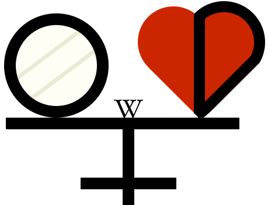

# FreeODwiki引论(进站必看)

<mark> 施工中 </mark>

*嫌太长了可以[点此](#为什么要选择支持freeodwiki呢)跳到最后哦*

<!-----这篇引论仓促写于2026年1月1日。我原本想写一篇“OD引论”，详细地描述这个被称为OD的事物的或好或坏一切。但是OD毕竟是“懂的都懂，不懂的都不懂，水很深，利益牵扯很大”的事物，所以谁都难以使用文字对其进行描述。既然这样，我只好写一篇“FreeODwiki引论”，不讲OD，只讲FreeODwiki。

(注：虽然本篇引论是专门为FreeODwiki而写，但本篇引论中表达的精神并非是它的专属，任何人和项目都可以采纳或改进这个精神。)

我们直接切入正题，对“FreeODwiki”进行拆词法理解：“wiki”来源于“Wikipedia”，是名词“维基百科”的意思；而“Free”一词对应维基百科的口号：“人人都可以编辑的自由的百科全书”；“OD”一词表明百科全书的内容是有关于OD的。

由此可见，所谓“FreeODwiki”，就是一个将关于OD的知识，以人人都可以编辑的方式，归档的网络百科全书。

这就引发了三个问题，以一个递进的顺序排序就是——为什么关于OD的知识会存在?为什么它们需要被归档成一个网络百科全书?而且为什么要以人人都可以编辑的方式?

分别用两个英文单词概括一下上述三个问题，就是Why OD?Why Wiki?Why Free?

第一个问题，为什么会有有关OD的知识?Why OD?

懂OD的人肯定不会提出这个问题，所以这个答案是专门给不懂OD的人写的。OD的字面意思就是overdose，过量用药，显然是一个很危险的行为，随意过量用药会导致严重后果，甚至致死。(注：英美等国家的overdose与中日等国家的overdose的语义不同，英美的overdose大多指的是以自杀为目的过量用药或意外过量服用危险药物，而中日指的是以非自杀为目的过量用药，切记区分。)因此，为了避免受到伤害，从事OD活动的人必须具有知道哪些药物可以OD、各种可以OD的药物的剂量范围、各种OD用药物的禁忌症等等知识。无论是通过网络上其他人的言辞、利用已有知识的推断、还是从自身的惨痛教训中学习，从事OD活动的人都必须积累有关OD活动的知识，以避免自身受到伤害。

第二个问题，为什么有关OD的知识需要被归档成一个网络百科全书?Why Wiki?

第三个问题，为什么这个百科全书要采取人人都可以编辑的方式?Why Free?

目前，有很多具有上述特点的百科全书性质的网站。然而，正如上文所言，它们采取的编辑形式是编辑组具有编辑权。其他OD者最多参与投稿，编辑的权限只掌握在编辑组成员手里。这就导致了以下的问题：
其一，OD者们的关于OD的最新知识会改进，而由少数OD者组成的编辑组的更新速度有限，因此百科全书里的内容往往无法追赶上OD学的前沿知识。同理，由少数编辑组组成的百科全书难以追赶上OD者对于OD知识的最新需求。因此，此类百科全书未能充分减少OD者们受到的伤害。
第二个问题则涉及这个百科全书是否能够持续存在，同时长远地减少OD者受到的伤害了。由特定的编辑组成员组成TBD

只有通过采取人人都可以编辑的方式，一个网络百科全书才能走得更远。

通过采取人人都可以编辑的方式，FreeODwiki确保它的编辑者处于最高的创作热情中(换句话说，只有具有最高的创作热情的人才会编辑)，且通过公约确保整个项目是用爱发电(而不是用钱发电)。
实施上，FreeODwiki是一个Github项目。Github的工作流确保了这些愿景的落实。Pull Request可以让人人都能提交编辑申请，让FreeODwiki成为众多OD者们知识的结晶；Issue功能使得人人都能讨论FreeODwiki，而不受特定社交媒体的限制；整个项目还是开源的，如果事情出现重大变故(或者你看FreeODwiki不顺眼)，人人都可以Fork整个FreeODwiki，让FreeODwiki在自己的名下继续存在。
(这里叉开一下，上一段中提到的“Wikipedia”本身又来源于“Encyclopedia”，“百科全书”的意思。从这里可以看出，“Wikipedia”之所以能被称作“Wikipedia”而不是“Encyclopedia”就是“Wikipedia”符合人人都可以编辑的条件。也就是说，只有符合“人人都可以编辑”这一要求的百科全书能被称为“wiki”，其他只有某些人能够编辑的百科全书是不配把“wiki”放在其的名字里的。) --->

FreeOD引论(进站必看)

我们必须把[OD](/文档/od.md)有关的资料、文档、知识等信息归档并整理到wiki上，原因/目的分别是，以及为何FreeODwiki能够达成这些目的的原因...

## FreeODwiki是一个发布在Github上的开源协作Wiki，意味着什么呢？

这意味着任何人都可以参与FreeODwiki。通过Github工作流，任何人都可以修改FreeODwiki的内容、任何人都可以Fork FreeODwiki来创建一个新的FreeODwiki。也就是说，FreeODwiki是一个完全开放的Wiki，任何人都可以参与到它的编辑和维护中。

## 为什么“OD”要有“wiki”

<mark> 施工中 </mark>

在OD者中，有已经积累大量知识的经验丰富的OD者。已经具有关于OD活动的知识的OD者为了避免其他OD者受到伤害，可能会将自己的知识分享给他们。然而，过去的实践表明，其他知识分享的形式(如组建群聊、发问答贴)往往效率不高，例如分享出来的知识无法被大家记忆下来，或者分享范围受到限制等。
与之相比，对于富有经验的OD者来说，将打算分享的知识编成一个网络百科全书，让所有人都可以随时随地查阅则是一个更高效的选择。这些百科全书性质的网站便于用户访问，并且可以有效地将累积过去的知识。有关OD的百科全书性质的网站通常由一个人发起，然后由一个编辑组共同撰写，其中这些人大多是经验丰富的OD者，可以为百科全书提供有价值的OD知识。而这些网站也确实为OD者们减少了因OD造成的伤害。

## 目前药圈存在什么问题，而FreeODwiki又该如何解决它们呢?

| 问题现状 | 解决方案 | 
| ---------- | ------------- | 
| 有不少ODer不知道如何安全OD，导致身心健康受损 |  我们以[伤害减少](/文档/负责任的用药索引页.md)的精神，通过wiki收集、编写并发布不当OD造成的后果，警示其危险性，唤醒他们的安全OD意识，并提供有价值的信息 |
| 有不少ODer不知执法部门的行为，导致自身遭受了不利的法律后果 | 我们通过 |
| 目前部分wiki页面陈旧 | 我们需要一个能够持久并广泛且墙内可访问的平台，用于发布信息，确保我们的劳动成果能可靠地传播到ODer们，才能造成积极影响 | Github目前没有被防火长城完全屏蔽，我们的劳动成果可以可靠地传播 |
| 《主播女孩重度依赖》动漫即将在4月上映，届时必定会有大量新ODer涌入 | 我们需要一个能够快速响应新需求的wiki平台 | FreeODwiki的开源和社区协作模式，能够快速响应新用户的需求，及时更新内容 |

## 为什么要选择支持FreeODwiki呢？

| | |
|--|--|
|时效性⏰| 只要FOW接到投稿，发现了新的OD药物，FOW就会立即上线相关内容！|
|长远性⌛| FOW条目由社区贡献者即时更新，只要还有一名贡献者愿意向FOW投稿，FOW就不会陷入停滞！|
|开放性🚪| 任何人随时随地都可以编辑FOW，错误能够得到迅速修正，妈妈再也不怕我OD联用错药了！|
|自由性✈|  FOW的所有文件文档都可以自由访问和下载，并按照CC协议可以自用|
|社区性🫂| FOW属于所有参与OD活动的人，不搞小团体、wiki大战等危害社区的事|