# 中推od圈的历史

*<sup>by@Salviaswc和[FreeODwiki](https://github.com/SalviaSWC/FreeODwiki/tree/main)参与者们 </sup>*

## 前言

<ruby>罄<rt>pí</rt>竹<rt>shì</rt>难<rt>zhēn</rt>书<rt>duō</rt></ruby>......

od是什么？一个我们没资格、也无法回答的问题，不过我们可以尝试回答。本文并不是某些社交媒体上利用od圈制作的所谓“纪实片”，那类作品诚然是新闻传播学利用常人无法接触到的资料制作的杰作，但它们的内核是“懂的都懂”的“新闻传播学”，价值也就止于那了。相反，本文通过详尽的历史事实，意图展现一个更全面、更深入的od圈的历史。

<font color="red"> 为防止本文档被别有用心的人利用，本文档及其所有历史版本采用CC BY-ND 4.0 即 CC 署名—禁止演绎 4.0 协议国际版许可，侵权必究，敬请谅解。详见[这里](/LICENSE2) </font>。

<mark>施工中</mark> 我觉得所有呼应后文的文本需要使用斜体，或其他字体表示。

注：本文中所有事件来自[鼠尾草](x.com/salviaswc)及其他推特网友们的个人叙述。如果你知道某些事情的隐情，但是史书中未能提及，欢迎提出疑问并上报；本历史是基于活跃在推特的od圈，因此可能出现缺乏其他平台上的oder的情况，如果你有资料，欢迎补充；本文可能出现语言不通顺的情况，因为笔者精神状态不佳，后续会修复，敬请谅解。

为了便于读者理解，文中加入了大量超链接，读者可以选择性的阅读。

目录是编写后加入的，因此插入位置和分段可能并不完全合适。

## 主播女孩重度依赖

||《主播女孩重度依赖》的宣传图。<br>此游戏被广泛视为是OD行为的主要源头。|
|-|-|

> 我没玩过，只看过视频，所以我只是在乱猜 --Salvia

2022年1月，一款名为《<ruby>主播女孩重度依赖<rt>**N**eedy **G**irl **O**ver**d**ose</ruby>》<sup>[steam链接](https://store.steampowered.com/app/1451940/NEEDY_STREAMER_OVERLOAD/)</sup>的养成游戏在Steam平台上发布。这款游戏的核心玩法是玩家需要规划一名艺名叫“超天酱”，真实名字是“糖糖”的所谓“地雷系”的主播的每日行程。在游戏中，玩家需要平衡糖糖的四项属性：粉丝数、压力值、好感度和阴暗度，以达成各种结局。

在游戏中，大量事件与行动会增加糖糖的压力值。为了缓解这些压力，玩家可以指示糖糖过量服用各种药物来有效地缓解压力。游戏中，一共有5种药物，这5种药物按糖糖的阴暗度属性的提高依次解锁。它们，分别对应现实中的[唑吡坦](/药物/唑吡坦.md),[二氢可待因](/药物/二氢可待因.md)<sup>或在美国版中，[右美沙芬](/药物/右美沙芬.md)，因为美国没有那种二氢可待因制剂</sup>，[依替唑仑](/药物/依替唑仑.md)<sup>或美国版中，[阿普唑仑](/药物/阿普唑仑.md)，因为美国没有依替唑仑制剂</sup>，[大麻](/药物/大麻.md)和[LSD](/药物/LSD.md)。

游戏中，过量服用这些药物的降低糖糖压力的效力会随着糖糖的阴暗度的增加而降低。

此外，过量服用这些药物后，游戏画面和声音会迅速呈现出特殊的效果，用于表明药物的致幻或抑制效果已经起效了。


然而，游戏作者可能并没有料到，这个游戏会在中国掀起怎样的风波。

毕竟，在当时2022年，在NGOD的原产国日本，<ruby>过量服用<rt>**o**ver**d**ose</ruby>（即OD）医用药物来改变精神状态已是旧闻，NGOD中涉及过量服用药物的游戏玩法只不过是因为日本的OD圈的存在应运而生的产物。在美国等英文国家，这些内容则更是被不少游戏点评员指责为<ruby>博眼球<rt>Shock Value<ruby>。

相反，在中国，这一切却一直以来是最敏感的禁忌之一。一切涉及精神状态的改变的东西、还有涉及[娱乐性用药](/文档/娱乐性用药.md)的东西，在当局的宣传与政策的强力镇压下，都被视为禁忌的苹果，谁都想尝一尝，却不敢完全摘下送入口中。而这个游戏则为这些胆怯的人们启了蒙。


在正式发布后，NGOD并未在中国大陆受到任何审查，影片也可以在视频平台正常放映。

可以想象，在当时人气爆棚的直播中，现实世界中的主播们给糖糖过量服用各种药物，并不是出于自身的好奇或满足观众的好奇，仅仅是因为一个残忍的事实：

>如果现在不让糖糖过量服用药物，糖糖就会在第二天割腕自残；如果现在不点击过量服药的按钮，糖糖就会在第二天伸出手腕，整个游戏画面中能操作的只有让她割开手腕的按钮。

主播点下过量服药的按钮，只见糖糖拿起药物，放入口中。药物被吞下的那一瞬间，直播画面渐变成五彩斑斓的迷幻颜色，背景音乐逐渐扭曲。直到几秒后，一切才恢复正常。稍稍缓解的压力、增加的阴暗值，以及糖糖在游戏中发布的推博，都在确认她过量服药的事实。

而在现实中，风波正在酝酿。

<mark> 然而，鉴于早在2021年，当局就发文宣布单方右美沙芬将被列为处方药管制；很多证据证明OD行为早已存在，而NGOD只是一切的导火索而已。</mark>

## 关于术语

2022年正是疫情当头之年，大量人被封锁在家，心情郁闷至极，他们通过打游戏或看视频消遣度日。这时候恰逢NGOD发售，不出意料地，NGOD受到了社会各界——尤其是潜在或已确诊的各种心理疾病患者的广泛关注。

其中，不少人特别地关注了其中与药物有关的部分。通过查阅资料，有人发掘出了各种能让精神状态改变的药物，特别是那些不受当局管制而容易获得的[药物](/药物/home.md)，并发布在社交媒体上。

通常，服用医用剂量的药物就能让精神状态改变的药物，如[哌甲酯](/药物/哌甲酯.md)，都遭到当局的管控，无法随意获得。反之，如果要利用这些非当局管制的药物来达成精神状态的改变，就需要服用超出医用剂量范围的药物。

因此，这种行为有获得了一个统一的名字：<ruby>OverDose<rt>过量服药</ruby>，从事OD行为的人被称为ODer，具有这种性质的药物被称为OD药物，过量服用OD药物的行为被称为o，指片剂的量词“片”被简写为“t”，这个圈子被称为od圈(或药圈)。

与当局宣传机构和自媒体所暗示的不同的是，ODer发明这些术语的目的，并非是为了向别人或当局隐藏什么秘密信息，也不是为了规避任何审查机制，更不是为了显得自己很独特，而**仅仅是为了通过术语缩写简化沟通的实用目的**(虽然这种“暗语”确实对于建立圈子的认同感起到了重要的作用)。这种目的类似于游戏赛事主播们用<ruby>*ob*<rt>**Ob**server</ruby>指代一场游戏战局中的观察者或裁判，绘圈的大佬们用<ruby>*oc*<rt>**O**riginal **C**haracter</ruby>指代自己的自设，并没有什么特别的。

> *后来，这里提到的专有名词，以及下文将要介绍的，一些指代特定药物的专有名词，成为了当局宣传媒体和某些自媒体指控od圈是一个“充满黑话”的黑圈子的证据。然而，事实是ODer发明这些术语的目的，从来不是利用所谓“黑话”隐藏信息，而仅仅是为了促进同好之间的方便交流。请不要让自己剖析这种叙事如何运作：从心理学角度看这种媒体叙事常常利用“<ruby>污名化<rt>stigmatization</ruby>”的心理机制，将社区内部的实用术语（如“o”或“t”）重新诠释为“黑话”，暗示一种隐秘或危险的亚文化。这是一种常见的“<ruby>他者化<rt>othering</ruby>”策略：通过突出“不同”来制造心理距离，让<ruby>普通人<rt>normies</ruby>感到社区是“外人”或“威胁”，从而减少同理心和对话机会。研究显示，这种叙事会激发负面情绪，如恐惧或厌恶，导致公众更倾向于支持严格管制，而忽略社区的实际目标——如安全使用和<ruby>伤害<rt>harm</rt>减少<rt>reduction</rt></ruby>。例如，当术语被孤立呈现时，它们被剥离了上下文（本意是简化讨论以分享知识），变成证据来强化“<ruby>道德<rt>moral</rt>恐慌<rt>panic</rt></ruby>”，类似于历史中对某些亚文化的误解。在现实中，这些术语类似于医疗或科学领域的缩写（如“NMDA”代表N-甲基-D-天冬氨酸受体），旨在高效沟通而非隐藏信息。通过理解这种心理动态，我们可以看到：这些叙事并非故意针对社区，而是源于对药物议题的普遍误解。社区可以通过透明分享（如公开解释术语）来桥接这一鸿沟，促进更广泛的公共健康对话。 

> 風衣葉綾  
> @Fu1ba_Ling  
> 印象中od这个概念一直都有，16年到19年都是比较小众的圈子，到了19年和文中写的一样因为居家导致圈子快速扩张然后21年直线飙升从幕后走到台前
非常大的工程量，辛苦了  
> 12:55 AM · Feb 23, 2026

## 关于药物

想要了解od圈的历史，就需要了解一个贯穿od圈始终的元素——OD药物，以及理解ODer们为何坚持不懈地追求OD药物们；最典型的OD药物是[右美沙芬](/药物/右美沙芬.md)。

---

|右美沙芬的结构式。注意这种[吗啡喃](/文档/药物分类.md)的立体异构状态并非天然存在，而是人工合成才有的。||
|-|-|

右美沙芬的医用剂量是15mg到30mg，对应1<ruby>t<rt>片</ruby>到2t氢溴酸右美沙芬片或[愈美片](/药物/愈美片.md)。而当剂量达到至少100mg(即7t左右)甚至更高时，服用者会产生[欣快感](/药效/认知欣快.md)和[解离幻觉](/药效/分离效应.md)。

这种现象发生的原因是，右美沙芬具有透过[血脑屏障](/文档/血脑屏障.md)的能力(正所谓“中枢镇咳药嘛)，其[咳嗽抑制](/药效/咳嗽抑制.md)的作用据推测来源于它对于Sigma受体的激动作用，然而，它的作用靶点远远不止这一个受体，正是它后来才被发现的对于另一个受体的作用，让它作为OD药物被过量服用时能有效地改变精神状态，还让它在世界的某些地区被誉为“穷人的[K粉](/药物/氯胺酮.md)”，

右美沙芬的娱乐性使用的历史漫长而曲折，它的起源是在美国。上个世纪，右美沙芬被美国医药企业研制出来，作为“无滥用潜力”的镇咳药进入市场，目的是用于替代[可待因](/药物/可待因.md)，一种被广泛[娱乐性使用](/文档/娱乐性用药.md)的[阿片类](/文档/药物分类/阿片类药物.md)止咳药。

右美沙芬的止咳效果很有效，而且美国当局的公共健康部门的最初的评估并未发现右美沙芬有任何娱乐性使用的价值，因此被大量推广。曾经装着可待因的非处方止咳糖浆被换成了装着右美沙芬的非处方止咳糖浆，而含可待因的制剂则需处方才能购得。似乎右美沙芬成功解决了此类非处方感冒药的娱乐性使用问题。

很快，故事迎来了转折。右美沙芬被美国人发掘出了娱乐性使用的价值。

不知是出于无聊，还是出于再也没法随便搞到可待因的愤怒，美国人民间自发地发现，当服用超过医用剂量的右美沙芬时，精神状态就会被改变，且这种效应通常持续约7个小时，产生的效应接近[解离剂](/文档/药物分类/解离剂.md)——一种最典型的药物是<ruby>氯胺酮<rt>K粉</ruby>的精神活性药物类别。

随后的科学研究表明，正是因为右美沙芬具有能够[拮抗](/文档/受体拮抗剂.md)[NMDA](/文档/药物分类/NMDA受体拮抗剂类药物.md)受体的能力，才导致了这种现象的发生。虽然它与NMDA受体的亲和力较低，在右美沙芬浓度很高时NMDA受体仍然能被有效地阻断，导致人体产生典型的解离性幻觉。此外，右美沙芬的一种经由CYP3A4代谢酶所产生的去甲代谢产物也与它的高剂量下的解离作用有关。

然而，右美沙芬的作用位点远远不止这些。它对于[血清素](/文档/血清素.md)的和[去甲肾上腺素](/文档/去甲肾上腺素.md)的转运蛋白还具有显著的亲和力，效果是抑制血清素和去甲肾上腺素的[再摄取](/文档/神经递质再摄取抑制剂.md)，这种效应类似于文拉法辛等SNRI类抗抑郁药。而这个亲和力远大于右美沙芬及其代谢产物与NMDA受体的亲和力。正是这两个作用位点导致娱乐性使用右美沙芬的风险很大，例如，过量服用右美沙芬容易意外导致[血清素综合征](/文档/血清素综合征.md)，一种极为痛苦的状态。最终服药者只得拨打急救电话，把自己送进医院，甚至经抢救无效死亡。

无论后果如何，一旦被送进医院，这桩事就免不了被当地的公共卫生部门记录在案。美国当局也会监控这些统计数字。终于，美国当局发现了因过量服用右美沙芬而被送进医院的人数的统计数字暴涨，决定采取行动。他们想必对相关企业单位进行了施压，要求他们为这些事情负起责任。

于是，美国医药企业为了遏制民间娱乐性使用，“自愿”撤下了仅含氢溴酸右美沙芬的制剂，并将右美沙芬混合上愈创甘油醚销售——后者是一种过量服用后会导致难以忍受的恶心感，甚至导致呕吐的祛痰药。有些医药企业甚至将右美沙芬和氯苯那敏混合——后者是一种有[血清素](/文档/血清素.md)[再摄取抑制剂](/文档/神经递质再摄取抑制剂.md)性质的[抗组胺药](/文档/抗组胺药.md)，在过量服用的情形下，这种制剂极易引发血清素综合征。不知情人的认为因为这种制剂不含愈创甘油醚，所以自己不会呕吐，便抓起一把把胶囊，大口吞下，却经历了严重的副作用。而更多人并没有因为禁令而退缩，而是直面现实，选择忍受愈创甘油醚的恶心感咽下复方糖浆。美国当局的禁令和施压并未取得成功的结果。

不过，随着嬉皮士年代到来，越来越多的美国人开始从事制毒于贩毒，导致[LSD](/药物/LSD.md)、[PCP](/药物/PCP.md)、[氯胺酮](/药物/氯胺酮.md)等副作用比右美沙芬更小的致幻剂在美国越来越容易获得了，更多人转向了它们，抛弃了右美沙芬。于是，右美沙芬似乎在美国不那么流行了。

事情迎来转机是在20世纪末，当时美国互联网迅速兴起，右美沙芬作为一种无法律风险的改变精神状态的方式，在互联网上引起了剧烈的讨论。之后，一位匿名人士总结的一份文档——[右美沙芬常见问题解答](/文档/右美沙芬FAQ/dxm_faq.md)，被认为开启了右美沙芬的娱乐性使用的一个崭新的时代。如果说互联网时代之前，右美沙芬的娱乐性使用只是一个内行人口口相传的秘密，那么互联网则让这个秘密被暴露在所有人的视野之下。右美沙芬被娱乐性使用的人数暴增。2010年，调查数据显示美国有约2%的12岁-17岁的青少年曾娱乐性使用过右美沙芬。

在那一年，美国食药监[召开决定右美沙芬是否会被列管的听证会](/https://www.erowid.org/chemicals/dxm/dxm_article3.shtml)，最终以6：9否决，右美沙芬未能被列管。

今天的美国，甚至有美国医药企业在生产一种一片仅含30mg右美沙芬*游离碱*(30mg相当于39mg*氢溴酸*右美沙芬)的片剂，右美沙芬的娱乐性使用似乎已被正常化~~，毕竟美国当局也不想让急于改变精神状态的人们诉诸于街头掺了不知多少[芬太尼](/药物/芬太尼.md)的毒品~~。

然而，在其他国家或地区，当地政府对待右美沙芬的法律状态各异，例如，2013年的中国，尽管当时氢溴酸右美沙芬片是非处方药，在药店中购买氢溴酸右美沙芬必须出示身份证[^1]；印度尼西亚当局则将右美沙芬视为毒品，没有任何许可的医疗用途。

---

上面讲述的有关右美沙芬的历史虽然发生在美国，却像一面镜子，处处都能映照出中国OD圈历史的影子。

> 我tm写的什么鬼 
> 这里稍微扯开一下，来讲一个许多读者都好奇，而且与本文主体的关联性很强的问题。既然你都有耐心读到这儿了，我相信，你很想知道这个问题的答案。这个问题就是：我国很多人对于毒品和精神活性药物相关的信息充满好奇。为什么？
>
> 众所周知，我国当局正在实行一种严格的信息审查政策。其引发的下游效应，导致国内搜索引擎和其他网站，不得不对于出现在他们网站上的涉毒信息采取严格的限制措施。而且，为了预防执行不到位，引来有关部门的直接突然介入的情况的发生，这些网站通常过度执行这些条款。简而言之，这些网站的目的是利益最大化、风险最小化，然而涉毒
>
> 这一系列的反应所导致的一个最直观的现象，就是搜索引擎上搜不到不受当局宣传机构控制的
>
> 这就导致我国很多人能够接触到的涉毒信息非常有限，而这些信息来源一致地都源于当局宣传。他们虽然被当局的宣传机构(如各大禁毒媒体、执法部门等有关部门)告知千万不要对毒品产生任何好奇贯穿始终的一个问题是：这些OD药物究竟有多大的成瘾性，沾上了究竟能不能戒掉？当局宣传可以这么概括：“这些毒品已被列管，那些是‘未列管成瘾性物质’”

而右美沙芬那种令人陶醉的解离的药效，也注定让它成为每一名oder的白月光，让它们即便冒着极大的健康风险，也要享受它赋予的禁忌的解离迷醉，并让它成为od圈中不可或缺的最重要的od药物。其他[OD药物](/药物/home.md)虽然有不同的效果，却远不如右美沙芬那样震撼人心。

2022年正值疫情时代，一切能够用来消遣的东西都受到极大的欢迎。三年疫情导致的经济下行创造了一大批失业失学的青少年和年轻人，他们正是OD圈能在中国扎根并在不远的未来茁壮成长的丰厚土壤。也许这就是大势所趋......

而对于更久远的历史，很多证据支持OD并不完全源于NGOD的走红，而是一个早已出现的行为。

有传言称，过量使用右美沙芬等药物以改变精神状态的行为在当时以前就早已广泛存在，只是在2022年出现了井喷式增长。虽然笔者不知道他们当时是否使用“OD”这种提法，但是可以确定的是，“OD”提供了一面旗帜，让他们可以在这面旗帜底下团结起来。

笔者在为了撰写本文而进行调查时，有推特网友告知笔者，使用[药物](/药物/home.md)以改变精神状态在几年前就在男同性恋圈流行过，虽然并非“过量服用不受当局管控的药物”。


> **蓝狗🏳️‍⚧️🍥二代目** @DXMDusk  
> 在18年前我在淘宝上买过[rush](/药物/亚硝酸酯.md)，犀牛，0号胶囊，均价不超过100，普遍在50~80，  
> 如果这也算在OD里面的话，更早的还有大力哥等老资历
>
> **鼠尾草～🌿** @SalviaSWC  
> 18年还有零号胶囊卖？[5-MeO-DiPT](/药物/5-MeO-DiPT.md)在15年就列管了欸，窝好奇里面装的是啥👀
>
> **蓝狗🏳️‍⚧️🍥二代目** @DXMDusk  
> 在18年底我最后一次购买0号胶囊的时候，给我发的是rush，说是没货了，而且发的这个rush更贵，  
> 据我了解说法是，这些都是武汉那边统一生产的，然后发往全国，就是垄断的那种，但是被管制后，买到的不一定是真的，很可能掺了别的成分，所以那几年的gay圈是一度叫停，直到渐渐的把这个淡忘，  
> 6:56 PM · Feb 22, 2026 · 161 Views
>
> **鼠尾草～🌿** @SalviaSWC  
> 这样啊…… rush不就是化工原料嘛（小声）
>
> **蓝狗🏳️‍⚧️🍥二代目** @DXMDusk  
>对呀，但那时候太小了，就不知道嘛，而且当时在处在gay圈里，了解到的出名的也就是0号胶囊，也是好奇买的玩，不过做起来确实很爽，现在形容的话，已经忘记那种感觉了，久远的回忆，
>rush的记忆倒是比较深刻，因随身带着时它渗出来了，以至于长达一两个星期自己身上都有这个味道，但是我完全没感觉到
>
>蓝狗🏳️‍⚧️🍥二代目（互关喵 @DXMDusk   
>21年，就我知道的我所居住的不远处就有3到4名od右美沙芬的MTF，可谓是流传得非常广泛，
>再早就是16，17年淘宝上rush，犀牛，0号胶囊什么的都可以直接购买，直到18年底，这些从淘宝上消失，
>渐渐地18年开始在贴吧看到右美沙芬片之类的，
>一个物质的管制只会造成另一个物质的泛滥，直到重复这个结局，   
>7:06 PM · Feb 22, 2026

甚至“OD”的提法也不是最近才有的：

> 鼠尾草～🌿 @SalviaSWC  
> 话说当时的提法是"OD"嘛（  
> 4:06 AM · Feb 23, 2026 · 14 Views
>
> 蓝狗🏳️‍⚧️🍥二代目（互关喵 @DXMDusk · 1m  
> od一直有的

还有人这么说：

>風衣葉綾 @Fu1ba_Ling    
>印象中od这个概念一直都有，16年到19年都是比较小众的圈子，到了19年和文中写的一样因为居家导致圈子快速扩张然后21年直线飙升从幕后走到台前    
>12:55 AM · Feb 23, 2026   

由此可见，OD圈是一个成分复杂的圈子，其参与者的出身背景极为广泛，而其真正起源尚属一个待考证的点。

随着对OD感兴趣的人越来越多，有人将零零散散的被发掘出来的OD药物汇编起来，编成OD指南，在网上传播。这就是OD知识公开化的一个雏形。*而此时，距离OD知识真正具有公开化大量传播的潜力，还有2年。*

尽管如此，在2022年上半年，OD行为尚属零星，大多数人只是在与涉NGOD贴子中讨论OD，自己并不从事OD。当时，专门针对OD的审查并不如现在严格，各种OD指南在QQ群、微博、知乎等社交媒体上流传。百度贴吧上，好奇的新晋ODer们谨慎地观察着当时并未被封的右美沙芬吧，观看着老食客们的说辞。

据了解，当时许多人并不是出于刺激或快感而从事OD，而是出于自残。他们将OD药物视为美工刀的替代品。这种说法是否只是为了合理化他们的从事OD的行为，我们暂且不得而知。

不幸的是，现实中的过量服药显然比游戏中刻画的更加残酷。即便抛开真正的恶性不良反应不提，许多人并按照OD指南初次尝试OD，却被强烈的精神状态的改变吓得措手不及，打120住院。而像右美沙芬这种高风险OD药物，联用多种药物，例如心理疾病患者常用的处方[SSRI类抗抑郁药](/文档/SSRI.md)，都会导致发生严重的不良反应的风险猛增。而医院和执法部门也注意到了越来越多的人因为此类非自杀性过量服用药物而住院，逐渐意识到了一个公共卫生危机正在扩散。

在那时，小股的药物探索者们已经离开审查逐渐变得严格的国内平台，在推特上开始聚集。

## “彩霞”与“Spring风”

在他们之中，最值得注意的是一位名叫[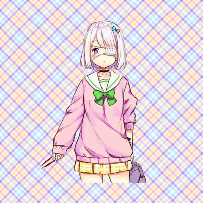彩霞](x.com/yukiukoori)的跨性别人士，她是一名热情的药物研究者，声称在自己的知乎账号被封后转移到推特。她从事许多涉跨性别的活动，还自称“OD奠基者”。据她的朋友在知乎上的声称，她是一个“想建立乌托邦的理想主义者”。她“很享受一切钻研和应用的过程。生活娱乐和学术都如此。一种科研精神贯彻了她的一切行动”。

没有人能够料到，她会落得这个下场。

根据公开资料，[彩霞](x.com/yukiukoori)的活动最早可以追溯到2019年。等到2022年的时候，她已向几位濒临自杀的跨性别朋友们介绍了OD药物，把她们从绝望与自杀的线上拉了回来。受到了彩霞的恩惠，她们成为了彩霞的挚友，却无法摆脱药物。

不可否认的是，根据观察，跨性别圈与OD圈的相互联系非常紧密。这根本上来源于跨性别者与ODer一样，通常不追求一般大众所遵守的社会常规。虽然彩霞的无心之举确实在一定程度上促进了这一点，但那只是直接原因，并非根本原因。而在后来，甚至连我国当局的举措都促进了这一点。

> 🏳‍⚧雪雨氷織🍥 @yukiukoori
> 
> 毒品对我真的没有什么吸引力比较我发明的东西可一点也不比这些赖呢，今天整的感觉成瘾风险好高，真的不想这样搞了。但是考虑到其实好大一部分精神因素没办法复刻其实也无所谓了，就慢慢享受到不知不觉睡着为止吧。
>
> 4:45 AM · Aug 30, 2022

彩霞自称自己“发明了OD”。正是她定义了OD究竟是什么，这就是我们说自己没有资格回答“OD是什么”的原因。

|彩霞在推特上发布的自己的知乎账号被封的截图。<br>可以从截图中看出，在她在2022年1月9日就已经在知乎上公开活动，当时NGOD还未发售。|||
|-|-|-|

在她的其他的推文中，她介绍了自己对于苯乙胺、水合氯醛、[安非他酮](/药物/安非他酮.md)的研究，这里不再详细表述。

>🏳‍⚧雪雨氷織🍥 @yukiukoori 3:25 AM · Aug 14, 2022
>
>另外这不是纯药推ggl，所以推接合作，平时会发色图，可以发日常吐槽，也接客出来和人贴贴，偶尔自己拍色图，照片。只不过作为od圈奠基者我也要产写粮的。

或许，正是这些危险的“接客”行为为某些怀有恶意的人，提供了渠道。

> 🏳‍⚧雪雨氷織🍥 @yukiukoori   5:24 AM · Sep 4, 2022
> 药娘圈热知识：如果后悔了，任何钡盐以及其他重金属离子中毒的解药是EDTA（乙二胺四乙酸二钠）以及硫代硫酸钠，当然其他金属离子螯合剂都是可以的，可以大量服用，最多丢失一点钙。平时可以在采血管中找到这种物质的单质，快转给准备重开的姐妹吧~  
> 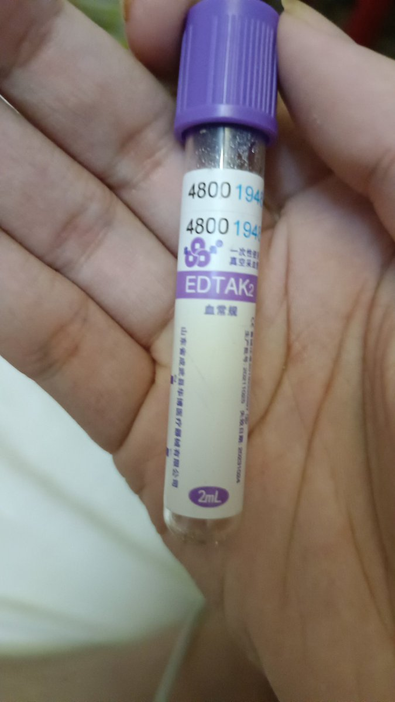

她是一个善良的人，多次帮助濒临自杀的跨性别人士走出困境。却因“发明OD”和“将OD引入跨圈”饱受骂名......

>🏳‍⚧雪雨氷織🍥 @yukiukoori
>
>摸摸，适度过量，请勿成瘾哦，有不舒服及时咨询哦。 
>
>12:18 PM · Oct 10, 2022

如其所言，她**从事OD是为了不OD**。据称，她“发明OD”的初心，是为了让那些深陷抑郁、被无法改变的苦难折磨着、濒临自杀的人们一点活下去的念想，最终目的是不依赖药物就能正常生活下去。有传言说，她通过OD[右美沙芬](/药物/右美沙芬.md)，解决了困扰自己许久的抑郁，从此不再需要依赖药物。知乎上有人替她辩护：她只向那些精神即将崩溃，只剩自杀一条路走的人另辟[药物](/药物/home.md)这条蹊径。

她以为自己的善意能够被大家理解，却最终落得这个下场，令人遗憾。而她落得的此等下场，将令药圈内另一名大佬深受折磨。

不过，在了解她的最终下场是什么之前，我们不得不先把其他情况介绍一下。

2022年10月是彩霞的最后一个推文的发布日期。此时，当局实行的“动态清零”政策仍然没有放松，对于身处中国大陆的人来说，这种人人自危已经成为了常态：每个人每天早上起来第一件事就是看看自己所居住的小区是否被封控了。一旦小区被封控，整个小区的居民就无法上学或上班，甚至网购的商品都难以送达。

这种严格的政策已经持续了两年半，没有任何缓解的迹象。对于不少人来说，这种压力愈发难以忍受，他们的心理健康状态严重恶化，濒临崩溃。更广泛地，大多数人都在提前寻找消遣的方式以应对封控的无聊，研究如何OD恰恰是一种很有趣又略带禁忌感的消遣方式。很多人就是在此时接触了OD。回忆起当时，笔者也有一位同学在朋友圈里晒出了OD药物的照片。可想而知，

然而，对于ODer们来说，尽管他们的肉体仍然受到被封控政策禁锢的威胁，那些能够改变精神状态的[药物](/药物/home.md)却能让他们的灵魂遨游在[幻觉](/药效/幻觉状态.md)的海洋中，无人能够限制他们；所以，只要他们手上还有一盒OD药物，他们的灵魂就能拥有免受封控的自由(虽然并不是以一种常规的形式)。

或许正是因此，越来越多对OD感兴趣的人不再将OD行为停留于纸面上的研究学习，而是从事真正的OD行为。每一位打算或已经初尝改变的精神状态的禁果的的ODer们的心情是可想而知的：他们既急切又担忧，第二天自己买的OD药物的快递包裹是否会由于“疫情原因”无法送达，于是他们疯狂囤够OD药物。一旦OD药物送到了他们手上，就像没了命一样吞服，却把自己的安全忽略了。

随后，许多人因药物引发的各种不良反应进了医院、落了残疾、甚至丧了命。那会儿，越来越多的推特网友发布推文，晒出自己从事OD行为后，因不良反应住进医院的诊断单。

随着住进医院的人数越来越多，OD行为也愈发进入当局的视野中。<!-- TBD待补充图片-->2022年11月，当局显然已经发现了民间从事的OD活动愈发明显，并采取手段尝试遏制。

当局决定先拿右美沙芬开刀。至于为什么第一个挨刀的是右美沙芬，可能是因为娱乐性使用右美沙芬自身的风险就很大，因OD右美沙芬住院的人的数字飞涨；或许是因为右美沙芬的娱乐性使用的历史在中国早已非常久远了；也许是因为单方右美沙芬制剂的适应症并不多，而且几乎完全可以被不适合娱乐性使用的[愈美片](/药物/愈美片.md)替代，导致当局对右美沙芬“动刀”的社会影响较小。鉴于当局在国家层面上的任何举动都是经过慎重考虑的，有关部门很可能综合了各个因素，于是就决定管管右美沙芬了。

|2022年11月，右美沙芬被当局要求禁止在网络上销售。它正式打响了这一场残酷的不对称斗争的第一枪。<br>然而，实行上，直到<ruby>本段编写时<rt>2026-2-26</ruby>，只有单方右美沙芬被限制网购，[愈美片](/药物/愈美片.md)等复方制剂并未被限制。| |
|-|-|

<!---这条禁令带来的后果是，如果当时的ODer想要购买单方氢溴酸右美沙芬片，那么愈发严峻的政策环境影响着每一位ODer，尤其是那条对于右美沙芬网络销售的禁令在OD圈导致了严重的风波。--->

2022年的右美沙芬网络禁售之后，如果当时的ODer想要购买单方氢溴酸右美沙芬片，必须线下持有处方亲自前往药房购买。而这当然不是每一个人都敢的，而对于跨性别群体，这却是一个非常熟悉的事情，因为跨性别用的激素药物，如补佳乐（戊酸雌二醇片）也被同等处理。因此，她们想必经常同时购买右美沙芬和补佳乐，而把它们放到互联网上售卖。如此严峻的政策环境影响着每一位ODer，也促成了跨性别圈子于OD圈子的高度交织现象。

在一个相近的时间点，[推特的一个贴子](https://x.com/mengqintiancai2/status/1593158796905676800)得到了广泛关注，收获了大量点赞和转发。虽然该推文的推主似乎不再从事OD，但他发的这个贴子收获的浏览量堪称OD圈史上的最辉煌的成就之一。有人将这一OD指南归于上文提到的[彩霞](x.com/yukiukoori)所作，因为在她的一个推文中曾提到她要制作“第二版OD指南”。这个贴子有12张图片，号称是“科学OD指南”。以下12张图片是贴子的内容： ~~推主似乎是男娘 ，不知是否有关~~


| | | | |
|--|--|--|--|
|||||
|||||
|||||

这份指南中并未详细解释各种药物如何o、o了有什么效果、以及怎么较安全地o，而仅仅是粗略地一笔带过各个药物能o的事实。从这份指南中，可以看出以下药物在当时已经成为了o圈关注热点：[右美沙芬](/药物/右美沙芬.md), [美金刚](/药物/美金刚.md), [苯海索](/药物/苯海索.md), [金刚烷胺](/药物/金刚烷胺.md), [司来吉兰+苯乙胺](/药物/司来吉兰+苯乙胺.md), [1,4-丁二醇](/药物/1,4-丁二醇.md)。

这一个贴子被当时的另一位重要角色转发——[Spring风](/文档/补档/Overdosewiki/Report/RP-74.md)。他早已加入OD圈，是一位活跃的参与者。

他是一个好奇的年轻人，将探索的视野从od药物本身转移到更一般的精神活性物质。他钻研过药物的化学结构特点，探讨过药物的机理，研究过[冰毒](/药物/甲基苯丙胺.md)的制取。他深受oder们的尊敬，被称为“药师”，死后还被后世称为“第一代od引路人”。在他的推文下，第一批扎根推特的ODer们聚集了起来。

通过他的推文不难发现，他是一个对于当局充满不满的人。他高调地支持一些激进地反对当局的推文。然而，即便是当时最激进的此类推文，也远远比现在的推文更容易接受、更关乎事实、更接近现实，令人怀念。

他的推文激进地反对当局实行的言论审查，并主张自由的互联网访问。他与推特上一名“支持高福利社会+毒品合法化+自由开明独裁”的博主，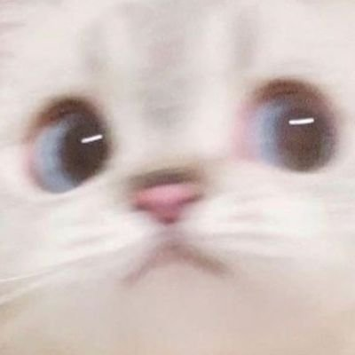🍐老师经常互相在推文下评论留言。他转发或发布的反对当局的推文并不仅仅是发泄情绪，而是对于崇尚开放和自由的呼吁。


值得注意的，是他从事OD的目的。看看下面的推文，也许[Spring风](/文档/补档/Overdosewiki/Report/RP-74.md)通过从事OD和探索药物，既不是为了快感，也不是为了自残。他从事OD目的，可能存在不少拯救自己于抑郁中的成分，不过，笔者认为，他在通过OD圈中探索那些被列为禁忌的知识并将其分享出来，是为了反抗当局的信息审查吧......下面这条推文很能佐证这一推测。

>山中的旅人 @yang38432408  
>Jan 2, 2023   
>在此条推文的评论写下你的16词核心价值观    
>  
>Spring风#参宿四 @Spr1ngW1nd   
>自由 进步 平等 人权   
>解放 公正 法治 博爱   
>反修 反极权 反威权 嗑药   
>(引用上一个推文)   
>2:49 PM · Jan 3, 2023


不幸的是，他虽然有建设性的思想(相比自残式OD者来说)，却既缺少足够的知识，又没找到研究方法，甚至未能保护自己。最终，他败给了一碗[相思汤](/药物/相思汤.md)(一说“[死藤水](/药物/死藤水.md)”，总之都是含有[DMT](/药物/DMT.md)的植物提取品)或其中的[单胺氧化酶抑制剂](/文档/单胺氧化酶抑制剂.md)，成为od圈内的可惜之人，沦为路人的笑柄，令人叹息......


|在2022年10月7日，他发布了有关[唑吡坦](/药物/唑吡坦.md)致幻药效的评论，如右图| |
|-|-|


> Spring风#参宿四 @Spr1ngW1nd  
> 右美沙芬 24×15mg 测试  
> 1:54 PM · Oct 15, 2022
>
> Spring风#参宿四 @Spr1ngW1nd · Oct 15, 2022  
> 13:53服用  
> 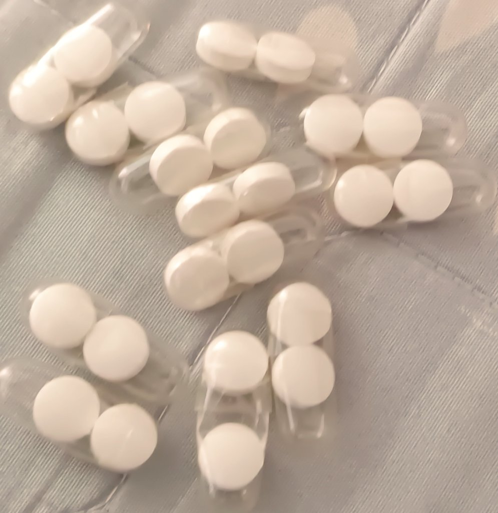
>
> Spring风#参宿四 @Spr1ngW1nd · Oct 15, 2022  
> 14:36 第一轮呕吐感 猜测是非选择性血清素再摄取抑制造成的 血清素2C受体被过度激活 导致恶心感
>
> Spring风#参宿四 @Spr1ngW1nd · Oct 15, 2022  
> 14:43 声音变远 声音变小
>
> Spring风#参宿四 @Spr1ngW1nd · Oct 15, 2022  
> 14:45 视觉形态改变 思维改变 音乐欣赏程度增高 头晕感(鼻梁骨)
>
> Spring风#参宿四 @Spr1ngW1nd · Oct 15, 2022  
> 14:53 瞳孔扩散 头皮发麻 音乐欣赏程度增高 体温生高
>
> Spring风#参宿四 @Spr1ngW1nd · Oct 15, 2022  
> 15:02 意志力实在是顶不住这个药 肌无力 视觉色彩增强 视觉形状增强
>
> Spring风#参宿四 @Spr1ngW1nd · Oct 15, 2022  
> 16:46 药效结束
>
> Spring风#参宿四 @Spr1ngW1nd · Oct 15, 2022  
> 警惕右美OD后吃饭 恶心死我了 一定要空腹！
>
> Spring风#参宿四 @Spr1ngW1nd · Oct 15, 2022  
> 右美沙芬我怀疑是不是在里面加了催吐药
>
> Spring风#参宿四 @Spr1ngW1nd · Oct 15, 2022  
> 我要失去控制了
>
> いくら @88BExUpvIQ7sOC8 · Oct 15, 2022  
> 喜欢，听起来好专业的样子，虽然我听不懂，我只会哇我在飞诶
>
> Spring风#参宿四 @Spr1ngW1nd · Oct 15, 2022  
> 实际上我也只是记录了大体 进药效了我都没办法理智

他还将自己od[右美沙芬](/药物/右美沙芬.md)的过程直播记录下来，发布在推特上。


>Spring风#参宿四 @Spr1ngW1nd 
>
>在今天下午右美沙芬药效过去后 产生的右美沙芬戒断反应
> 
>轻微程度 类SSRI戒断反应(非选择性血清素再摄取抑制剂):流感样症状、平衡不佳
>
>中等程度 类氯胺酮(NMDA拮抗剂)戒断反应:烦躁不安、抑郁、精神差、疲乏无力、心悸、手震颤
>
>疲乏无力 手震颤 在停药后表现最为明显
>大约经历1.5小时后减轻
>
>12:03 AM · Oct 16, 2022

他如实记录了发生在自己身上的“[右美沙芬](/药物/右美沙芬.md)戒断”。

|2022年10月23日，他达成了700fo<sub>(推特上称“粉丝”为“fo”)</sub>。这个数字远远小于如今od圈大佬的粉丝数字，说明当时od并未流行，或od圈影响力的重心并未转移到推特上来||
|--|--|


> Spring风#参宿四 @Spr1ngW1nd  
> AXS-05组合我的一些看法  
> Nov 12, 2022
>
> Spring风#参宿四 @Spr1ngW1nd · Nov 12, 2022  
> 右美沙芬经过CYP2D6酶转换为NMDA非竞争性拮抗剂 科研思路可能就是:利用DXM的SRI+NRI特性 并且安非他酮已经是一款在市面上的NDRI 并且具有CYP2D6酶的抑制特性 为什么不选用同样有这个特性的苯海拉明 一方面可能是制药厂考虑到抗胆碱剂 可能会造成副作用 另一方面也有可能考虑到这个组合可能不受人待见
>
> Spring风#参宿四 @Spr1ngW1nd · Nov 12, 2022  
> 因为这个药物组合就是因为它有CYP2D6抑制的特性 曾经有人也对其进行过药物滥用 并且制药厂怎么使用合法的理由 去申请这个药通过临床测试 这个时候药厂想到了有CYP2D6抑制特性的安非他酮 并且又是合法的抗抑郁药物 实际上药厂就是为了用右美沙芬的SRI和NRI的效果 这个效果在一部分药物滥用人群中表现
>
> Spring风#参宿四 @Spr1ngW1nd · Nov 12, 2022  
> 的抗抑郁效果十分客观 并且药厂也不要人“嗨”了 嗨了就通不过临床测试了 这个时候又是要CYP2D6抑制了 不让它转换成DXO 不让它产生“解离感” 通俗点来说就是人飘起来走路轻飘飘的感觉 并且从一定角度上来说 两款XRI不应该同时出现(例如两款不同的SSRI联用可能导致血清素综合症) 并且NDRI的DRI效果也有可能
>
> Spring风#参宿四 @Spr1ngW1nd · Nov 12, 2022  
> 导致一定的副作用 在单独用右美沙芬来说 它的抗抑郁效果十分优秀 并且Sigma1效果也有可能促智
>
> Spring风#参宿四 @Spr1ngW1nd · Nov 12, 2022  
> 这种选择性 σ1 激动剂最近引起了我的兴趣  
> PRE-084 增加 GDNF 的表达  
> 如果我没记错的话 这将支持你的假设即 sigma 受体激动剂可以永久增加多巴胺受体，并解释所谓的“促智和抗抑郁作用”
>
> Spring风#参宿四 @Spr1ngW1nd · Nov 12, 2022  
> 我想了一下，如果你想一想，导致“余辉”的大量药物是 σ 受体配体 因此，σ受体在多巴胺受体表达中的作用可能与此有关

以上是他对于药理学探讨的一点摘录，也许他有成为一名[益智药](/文档/药物分类/益智药.md)爱好者<sup>biohacker</sup>的潜力的......

> Spring风#参宿四 @Spr1ngW1nd  
>
> 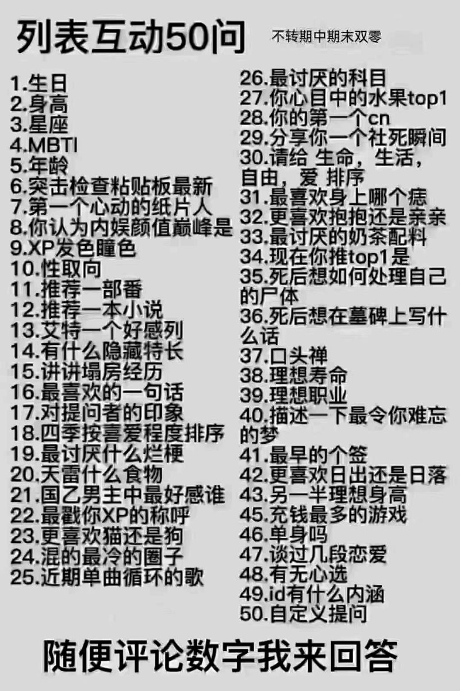
>
> 2:50 AM · Nov 13, 2022  
>
> L @sequoiacandy · Nov 13, 2022  
> 10
>
> Spring风#参宿四 @Spr1ngW1nd · Nov 13, 2022  
> 双性

Spring风是双性恋哦~


> Spring风#参宿四 @Spr1ngW1nd  
> 阿片类药物 测试  
> 6:32 PM · Nov 19, 2022  
>
> Spring风#参宿四 @Spr1ngW1nd · Nov 19, 2022  
> 18:29服用
>
> Spring风#参宿四 @Spr1ngW1nd · Nov 19, 2022  
> 20:08 肠道感觉很奇怪 感觉有点像是便秘上厕所的感觉
>
> Spring风#参宿四 @Spr1ngW1nd · Nov 19, 2022  
> 21:14 有点困 头顶有点发晕
>
> Spring风#参宿四 @Spr1ngW1nd · Nov 20, 2022  
> 感觉做事情没有动力 人很木纳
>
> 猫屎bot @wind_dmr · Nov 19, 2022  
> 啥药啊
>
> Spring风#参宿四 @Spr1ngW1nd · Nov 19, 2022  
> 氢可酮

2022年11月19日，Spring风首次接触了阿片类药物，氢可酮。这也许为他接触哮喘片，后不幸离世埋下了伏笔......

>Spring风#参宿四 @Spr1ngW1nd
>
>50mg粉末大概是多少
>
>12:53 PM · Nov 20, 2022

反面教材哦！根据上下文推断，这里Spring风指的粉末的“多少”是显然体积。请不要目测粉末，因为粉末的颗粒密度有疏有密，如果要准确量取粉末，一定要用称。详见[药物剂量量取](/文档/药物剂量量取.md)。如此逐渐鲁莽的行为，正是他的最终结局的铺垫。

> Spring风#参宿四 @Spr1ngW1nd  
> 麻黄碱合成甲基苯丙胺  
> https://bbgate.com/threads/methamphetamine-from-ephedrine-tablets.302/  
> 7:37 PM · Nov 26, 2022  
>
> Spring风#参宿四 @Spr1ngW1nd · Nov 26, 2022  
> 将盐酸伪麻黄碱（2.0 g）与红磷（0.6 g）、碘（4.0 g）和蒸馏水（2 mL）在圆底烧瓶（100 mL）中混合，并连接冷凝器。将混合物回流 24 小时，然后冷却。冷却后，将混合物用等体积的水稀释并滤出红磷。将几克硫代硫酸钠放入烧杯中，加入氢氧化钠溶液 (25% wt/vol, 8 mL) 以碱化溶液。
>
> Spring风#参宿四 @Spr1ngW1nd · Nov 26, 2022  
> 然后将其添加到过滤后的反应混合物中，并旋转以显示甲基苯丙胺游离碱  
> 呈油状，浮于水溶液之上。添加甲苯(20mL)以萃取甲基苯丙胺游离碱。甲苯提取物澄清至淡黄色。通入无水氯化氢气体以显露白色沉淀物，将其用甲苯洗涤。固体在高真空下干燥。

Spring风对于[冰毒](/药物/甲基苯丙胺.md)制取的讨论......

|2022年11月26日，Spring风达成了1000fo，也许当时的od圈影响力重心正在快速向墙外平台转移||
|-|-|

> Spring风#参宿四 @Spr1ngW1nd  
> 右美沙芬 24×15mg 测试  
> 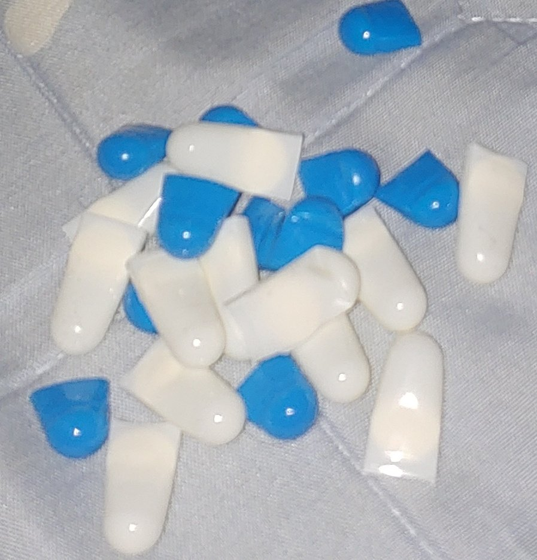  
> 7:56 PM · Dec 16, 2022  
> 21.8K Views  
>
> Spring风#参宿四 @Spr1ngW1nd · Dec 16, 2022  
> 20:24 服用
>
> Spring风#参宿四 @Spr1ngW1nd · Dec 16, 2022  
> 21:31 我的脑子想让我吐
>
> Spring风#参宿四 @Spr1ngW1nd · Dec 16, 2022  
> 21:55 轻微痛觉消失 走路轻盈感
>
> Spring风#参宿四 @Spr1ngW1nd · Dec 16, 2022  
> 21:59 险些 呕吐
>
> Spring风#参宿四 @Spr1ngW1nd · Dec 16, 2022  
> 22:02 呕了

Spring风购买了[右美沙芬](/药物/右美沙芬.md)原粉，并将其装入胶囊，却无法避免呕吐......

> Spring风#参宿四 @Spr1ngW1nd · Dec 17, 2022  
> 昨晚的事情基本都忘完了 第一次接触那么高的解离(720mg) 只能说感觉有点像是急性精神病 幻觉 精神错乱  
> 貌似我嗑右美沙芬从上一周就只是有解离了 几乎没有那种起效时昏头的欣快感

> Spring风#参宿四 @Spr1ngW1nd · Dec 16, 2022  
> 右美沙芬 24×15mg 再给药（20点给药 21:40呕吐）  

> Spring风#参宿四 @Spr1ngW1nd · Dec 17, 2022  
> 1:59 高解离

> Spring风#参宿四 @Spr1ngW1nd · Dec 17, 2022  
> 2:54 中解离

> Spring风#参宿四 @Spr1ngW1nd · Dec 17, 2022  
> 路上很困差点被车创

> Spring风#参宿四 @Spr1ngW1nd · Dec 17, 2022  
> 会不会因为肝脏衰竭死掉

> Spring风#参宿四 @Spr1ngW1nd · Dec 17, 2022  
> 高解离真感觉自己不是自己

> Spring风#参宿四 @Spr1ngW1nd · Dec 17, 2022  
> 高解离差点没给我橄榄 很想睡觉

> Spring风#参宿四 @Spr1ngW1nd · Dec 17, 2022  
> 那些真的是我干过的事情？

> Spring风#参宿四 @Spr1ngW1nd · Dec 17, 2022  
> 我感觉我今天出去毒驾的不是我驾的

> Spring风#参宿四 @Spr1ngW1nd · Dec 17, 2022  
> 意识恢复了些

> Spring风#参宿四 @Spr1ngW1nd · Dec 17, 2022  
> 48t应该对肝没什么影响吧

> Spring风#参宿四 @Spr1ngW1nd · Dec 17, 2022  
> 飞得最高的一次解离

> Spring风#参宿四 @Spr1ngW1nd · Dec 17, 2022  
> 解离太高了 我肾脏有点痛 现在能思考一点了

> Spring风#参宿四 @Spr1ngW1nd · Dec 17, 2022  
> 一切都是虚假的

> Spring风#参宿四 @Spr1ngW1nd · Dec 17, 2022  
> 1:18 精神状态有点不太稳 很晕

> Spring风#参宿四 @Spr1ngW1nd · Dec 17, 2022  
> 1:25 疼痛消失

> Spring风#参宿四 @Spr1ngW1nd · Dec 17, 2022  
> 我到底在哪

> Spring风#参宿四 @Spr1ngW1nd · Dec 17, 2022  
> 一切都不真实 想呕

> Spring风#参宿四 @Spr1ngW1nd · Dec 16, 2022  
> 有点怕等会前面24直接开始生效 后面叠加24直接bad trip进急救室

> Spring风#参宿四 @Spr1ngW1nd · Dec 16, 2022  
> 无所谓了 加

这就是Spring风最习惯的撰写的药物报告的方式——通过推文连载。Spring风声称这是他经历过的最高的一次解离——*区区*48t右美沙芬的记录。然而，对如今的ODer们来说，服用这么高的剂量的右美沙芬似乎已经成为日常了......那么高的剂量，真的有必要嘛？

---

> 距离当局正式宣布放弃疫情的封控政策已经过了，然而全国人民并未沉浸在欣喜中。因为，在短短几个月前，当局的宣传机构还在鼓吹新冠后遗症的严重性，还向全国人民真心诚意地许下诺言，说我国将会与疫情抗争到底，绝对不会企图与病毒共存。

2022年末，异变还是发生了。Spring风此前与上文提到的[彩霞](x.com/yukiukoori)交往非常密切，原因想必是因为两者都是热爱探索的“药师”——那时，ChatGPT才出来不久，AI远远没有普及，并不是所有人都能轻易获取信息的，只有那些既热爱探索，又懂得途径的人才能被称为这个称号。
<!-- 补一个佐证 -->
然而，当时彩霞已经消失了一个多月，到了2022年12月，终于有人放出有关彩霞的消息。而Spring风发布的推文当即引起了大家广泛的注意。

> Spring风#参宿四 @Spr1ngW1nd  
> 跨性别人士 彩霞@yukiukoori  
> 因帮助未成年跨性别人士逃离原生家庭被其父母以及社群内成员恶意举报 于11月6日被上海警方以“聚众淫乱”污蔑逮捕 至今未能放出 如果“罪名”成立 将会面临五年以下有期徒刑  
> 1:24 AM · Dec 21, 2022  
> 313K Views  
> Spring风#参宿四 @Spr1ngW1nd · Dec 21, 2022  
> 相关内容  
>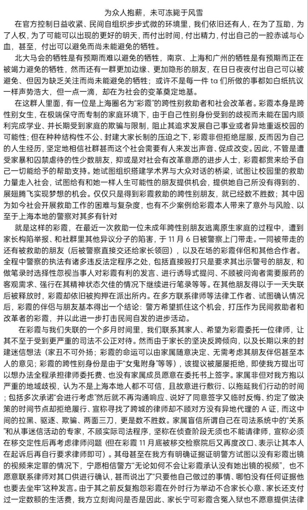 
>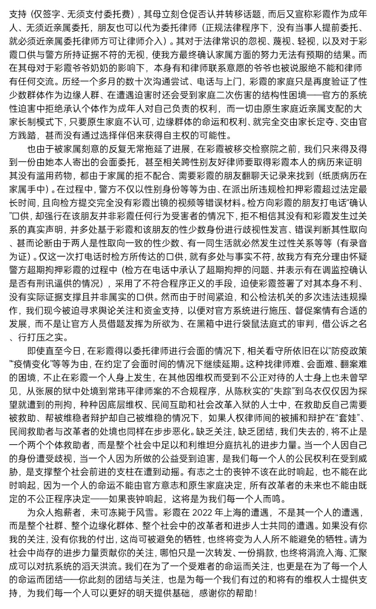
>
> Spring风#参宿四 @Spr1ngW1nd · Dec 21, 2022  
> 被捕当天没有聚众淫乱 但是当天被捕的四个人 其中一个人的手机里查到了淫乱的视频 尽管视频里的人不是彩霞 警方依然把案件定为“聚众淫乱”  给彩霞以“聚众淫乱”定罪
>
> Spring风#参宿四 @Spr1ngW1nd · Dec 21, 2022  
> 警察的诱导式提问分明就是想要冲业绩做出的表现 这类案件定性本身就没那么严重 却非要以其他人手机的淫乱视频给彩霞定罪 这不是冲业绩是什么
>
> Spring风#参宿四 @Spr1ngW1nd · Dec 21, 2022  
> 警方超期扣押 刑讯逼供 执法不当 诬告陷害 完完全全的官僚主义
>
> Spring风#参宿四 @Spr1ngW1nd · Dec 21, 2022  
> 我很愤怒 莫须有的罪名套在了自己的身上 这种无力回天的感觉 真是令人恶心

据称，[彩霞](x.com/yukiukoori)被自己帮助过的人所陷害。可以肯定的是，彩霞的被捕严重恶化了Spring风的精神状态。


这便是[彩霞](x.com/yukiukoori)的下场，“聚众淫乱罪”、“五年以下有期徒刑”。此后，彩霞再也没有在公开场合抛头露面过。

之后的很久一段时间内，彩霞音讯全无。

跳到后来，2023年3月，[寒涟漪](x.com/HANLIANYI331)，一位仍然活跃的跨性别著名活动家，在推特[发文](https://x.com/HANLIANYI331/status/1638083781327474689)，为彩霞的律师费募捐。在推文中，寒涟漪声称：

> 2022年11月，上海一位名为“彩霞”的跨性别女性被警方带走调查，同时一同被带走调查的还有当时住在彩霞家中的其他三名跨女。除了以上四位，被各地警方安排到公安局问审的同时还有4名跨女（当时不在彩霞家住但和彩霞有联系的）。
>
> 几天后，被调查的其他三名跨女被警方联系家长领回家，彩霞被继续关押调查，一直到今天。
>
> 事件的起因是彩霞在尝试帮助家暴跨女的过程中，收留了三名跨女（其中包含两个未成年，以下称已成年的为A，未成年的为B和C）在自己的家中（彩霞家中除了彩霞以外，还有她的爷爷奶奶居住），其中A和B在彩霞家中发生边缘性行为（互相帮助使用成人用品）时，C在一旁参与拍摄并且录制了视频，此时彩霞并不在自己的家中。
>
> 后来C离开彩霞家回原生家庭以后，C删除了自己手机上录制的视频，但是忘记清空回收站。于是在C的家长在C不知情的情况下偷偷翻阅手机时，被找到了拍摄的视频，随后C的家长报了警。
>
> 上海警方接到报警，查看了视频以后，认定这属于一场聚众淫乱（视频中的两人外加拍摄的一人），且参与这场聚众淫乱的三人有二人是未成年，需要当做“典型”从严从重处罚。经过调查后，警方认为彩霞是这场聚众淫乱的主要组织者（通过视频证据和四人社交关系的摸查），因此决定以“聚众淫乱罪”对彩霞发起公诉，此时彩霞将面临3到5年的刑期。
>
> 在这次刑事案件中主要出现的问题有：
>
> 1.警察在闯入彩霞家抓人的时候，态度非常粗暴，调查程序和审讯过程也严重不合规范，在警察的恶意引导下，彩霞最终签下了和事实严重不符的口供。检方还打电话诱供其中一位参加审讯的跨女 ，希望她能作证彩霞组织了八次聚众淫乱且有她参与，但实际上并没有。同时警察获取的视频证据，获取的手段本身也是非法的。
>
> 警察在现场的粗暴行为严重刺激到了现场所有人脆弱的精神状态，在彩霞被关押后，彩霞社交圈的十几名跨女在之后数个月的时间也受到了频繁调查，彩霞社交圈内出现了新一轮的自杀高峰，已有2名原彩霞社交圈内的跨女因自杀而死亡。
>
> 2.在审讯的过程中，彩霞的家人拒绝为彩霞提供任何的帮助和资金支持，也拒绝关注这个案件。且警察长时间阻止彩霞和她的朋友见面。一直发展到案件快进入一审阶段的时候，和彩霞关系亲密的跨女才通过各种艰难的方式成功和律师一起见到彩霞，并且让彩霞成功签下委托律师书（但律师坦言，这时候签已经太迟了，错过了太多机会）。
>
> 3.严重的资金压力：目前因为彩霞的原生家庭拒绝为彩霞提供任何资金支持，也不愿意进行任何程序上和言语上的配合，对彩霞的事情直接一概不管，也拉黑了所有彩霞朋友的联系方式。
>
> 目前彩霞的律师费用完全为彩霞的一个对象（也是一名跨女）和彩霞的亲密朋友在承担，她们目前已经掏空了所有的存款且借了大量的贷款同时在竭尽所能的募捐。但律师费用仍然有缺额，且最多只能支撑到一审结束。
>
> 4.彩霞的法律性别为男性，这意味着彩霞在监狱里必须住在男监里且必须剃光头，同时无法得到激素类药物的治疗。
>
> 关于彩霞本人的争议：
>
> 彩霞本人具有od（药物滥用）成瘾。
>
> 尽管彩霞有过进行具有家庭暴力，自杀危机的跨女救助；但是彩霞曾经有过在对面临家庭暴力，自杀危机的未成年跨女进行自杀干预的过程中，通过引导当事人进行od的方式来让当事人减轻自杀想法的做法，最终导致当事人因此产生了药物依赖，od成瘾。
>
> 在这里需要注意的是：彩霞具有专科的医学背景，同时一直有在自学精神病学。通过短期内服用一定剂量的精神类药物来减轻抑郁症患者自杀想法这种医疗方法，在某些医院已经进入临床试验阶段。但是这种方法在任何一家正规的医院都有非常复杂并且严格的限制。
>
> 而彩霞通过这种做法去进行自杀干预的时候并没有条件去遵循这些限制，因此导致了恶劣的后果；一位曾被彩霞自杀干预过的未成年跨女od成瘾，她在离开了彩霞家一段时间以后，因药物自杀被送进了ICU急救。（急救费还是琴春承担的）
>
> 当然，即使我本人（寒涟漪）也必须承认：对于国内未成年家暴且自杀倾向严重的抑郁跨女现状来说，实际上并没有完美的自杀干预方法，在原生家庭拒绝提供资金支持和医保支持的情况下，且国内相当部分的精神科都要求未成年住院需家长签字和陪同（尤其是在自杀情况危急需要非自愿住院的情况下）。让案主去走正规精神科住院途径对一般的干预者和救助者来说非常困难。
>
> 这种情况下干预者面临的往往是二选一的局面：在无法成功将案主转介给能解决问题的人的情况下，要么看着当事人死，要么通过不合规且有极大风险和后患的手段去先把眼前的危机解决掉。而更好的方法，要么是难度更大，要么是超出了干预者的能力范围。
>
> 关于本篇文章的目的：
>
> 由彩霞的一个对象发起的募捐，但是你在决定捐款前，请知悉以下几点
>
> 1.本次募捐仅用于彩霞的律师费用，最终这些金钱实际能达成的成果仅在于尽可能的去减轻彩霞被判决的刑期
>
> 2.对于这次刑事案件，寒涟漪不会进行任何金额的支持。因为尽管寒涟漪也希望这个案件尽可能的轻判，但是寒涟漪认为这个案件需要的律师费用，可以给予更多的人更多的帮助。

不知道[寒涟漪](x.com/HANLIANYI331)等人最后能否帮到她。

[彩霞](x.com/yukiukoori)被捕当时在场的另外三人，随后全部相继自杀离世。

再后来就是2023年11月了，跨性别圈似乎接受了在彩霞被捕这件事上达成一个较好的结果是不可能的这一事实，并把彩霞案被作为一个跨性别圈的例子，警示其他跨性别人士如何妥善地应对执法部门，以免陷入执法部门设下的圈套，详见这一脚注[^2]。~~虽然但是，直接这么说执法部门好吗？~~

尽管她的善意动机，的饱受争议的行为让她成为了后世的批判的靶子。

近期，某些跨性别反od人士如全然不顾历史事实，将彩霞和她的朋友们视为OD行为被引入跨性别圈子的罪魁祸首，毫不留情地批判。毕竟，在监狱里的人不能反驳，她的朋友们也相继自杀，ODer们的腰杆也没有直到能为OD辩护。所以这种批判行为完全是单边的，十分安全，因此这种批判饱受某些跨性别反od人士的欢迎。

她们每隔一段时间就写一篇反od小作文刷存在感，怒斥overdose如何地坏，彩霞如何地罪该万死，仿佛这样就能让彩霞的入狱合理化了，尽管彩霞的入狱与OD并没有直接关联。大家看了后，就把它当玩笑话吧，毕竟这些跨性别反od人士也有难处啊。

## “剧烈变形”

说起OD圈历史上最臭名昭著的药物致死事件有哪些，截至笔者撰写本文的2026年2月23日，前三是几乎毫无争议的。那一年即将发生的Spring风之死，即`剧烈变形`事件，是所有人心中的榜首，这一点没有任何争议；一年后将要发生的彩加之死也可确定入围前三；而另一个前三恶劣事件的死者居然是笔者加入od圈以来合作最密切的一位，令笔者大受震惊。

另外两个事件将在之后提到，现在先按时间顺序叙述最接近的`剧烈变形`事件。此事的上文，最好从事故发生的前几天开始讲起。当时正是2022年末，2023年初的时候。

正值寒冬之际，一则意外的消息令Spring风的精神状态进一步恶化，那是一名推特网友离世的消息。

>鈴木真依MissSuzuki @MissSuzuki23    
>我現在需要告訴你們一個很殘忍的消息… @Aniloviraw  
>永遠的離開了我們…  
>「願您的星空旅行愉快，我們終將相見」  
>今年我們見證了太多悲劇…  
>我希望各位可以知道這個消息…因為失去了沒人知道也是很可憐的一件事…  
>11:19 AM · Dec 30, 2022

死者的推特名叫Anilovr，生前与Spring风的关系很好，似乎是他的相当重要的人物。据称，在生命的最后时刻，Anilovr在推特用户名后面加了一个后缀，“```#参宿四```”，那一颗现在也许已经不再存在的星星。

>Spring风#参宿四 @Spr1ngW1nd  
>Dec 30, 2022  
>听到这个信息的时候 感觉没有情绪 不是悲伤也不是任何 感觉有些虚假 就如同家里人突然与世长辞的感觉 太突然了 以至于让我觉得这都是虚假的 解离的感觉 理应我是应该感受到悲伤   
>(引用该推文)

Spring风发表了一个悼念的推文，随后在自己的用户名后也加上了一个“```#参宿四```”以纪念这位推特网友。**悲伤的是，当时没有人能料到，他的账号将永远带着这个```#参宿四```。**此后，Spring风再次多次发推文哀悼Anilovr。

>Spring风#参宿四 @Spr1ngW1nd  
>梦到Ani回我信息了   
>10:21 AM · Dec 31, 2022   
>
>Spring风#参宿四 @Spr1ngW1nd   
>Dec 31, 2022   
>好像是梦到发信息给我说被救回来了 大概好像是说好苦什么的   

>Spring风#参宿四 @Spr1ngW1nd   
>现在翻了翻聊天记录 才忽然明白是什么意思了...今天上推看到信息说昨晚上Ani火化了...昨晚梦到她被急救过来了QQ发信息说口干 嘴巴苦......   
>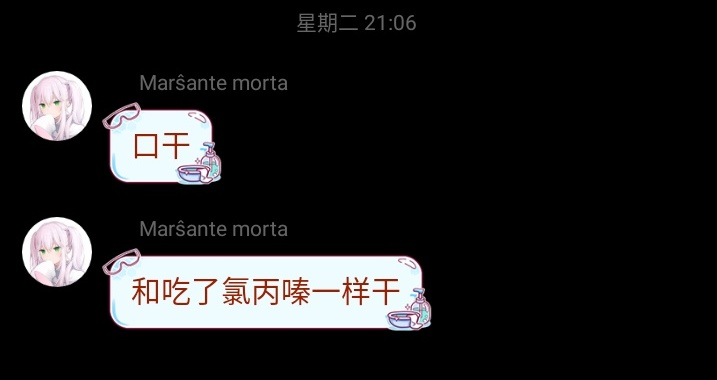    
>1:30 PM · Dec 31, 2022

>Spring风#参宿四 @Spr1ngW1nd   
>还是不能接受 如果说是有一天突然回我信息了说自己没大事呢   
>4:46 PM · Jan 1, 2023   

>Spring风#参宿四 @Spr1ngW1nd   
>还是不能接受啊 还是不能接受啊 万一只是暂时退推一段时间呢 万一只是暂时不想接触互联网这种呢 还是没办法接受还是没办法接受啊 越来越多的信息指向她已经离开了   
>11:18 PM · Jan 3, 2023

>Spring风#参宿四 @Spr1ngW1nd   
>参宿四以不稳定著称 远在640光年外的它或许早就消失 但是人们依然可以仰望星空看到它 即便参宿四早已消失 而人们依然可以仰望着你 你说是吗
抬头 便能看到在星空中的你   
>1:40 AM · Jan 4, 2023

任何人都能看出，他的精神状态正在迅速恶化。短短10天内，Spring风接连失去了两名挚友。挫折、无奈、绝望、痛苦......这些词汇极为适合用来形容他的精神状态。然而，他可是“药师”，他可背负了<!-- 过于夸张？ -->药圈探索新药物的希望。药圈的绝望者们、抑郁者们、痛苦者们、悲痛者们的眼睛直勾勾地盯在他的身上，所以他必须回应他们，他必须展现出自己拥有应对他们的期望的能力，即便是在这样的危机之下。

而为了应对他们期望，他必须测试并发推文报告一些未经公开测试的药物，比如[相思汤](/药物/相思汤.md)(一说[死藤水](/药物/死藤水.md)，总之都是含有[DMT](/药物/DMT.md)的植物提取品)、[哮喘片](/药物/哮喘片.md)、[司来吉兰+苯乙胺](/药物/司来吉兰+苯乙胺.md)。

可想而知，正是恶劣的精神状态让他使用药物的行为变得更加鲁莽。他在2023年1月上旬的几个推文中，多次声称自己测试了[司来吉兰+苯乙胺](/药物/司来吉兰+苯乙胺.md)，一种当时正处于药圈研究焦点的[兴奋剂](/文档/药物分类/兴奋剂.md)。

而这一篇记录推文所反应的问题尤为突出：

>Spring风#参宿四 @Spr1ngW1nd  
>
>司来吉兰+苯乙胺组合 测试  
>2:25 PM · Jan 4, 2023  
>62.7K Views
>
>Spring风#参宿四 @Spr1ngW1nd  
>· Jan 4, 2023  
>司来吉兰 2×5mg 14:28 服用
>
>Spring风#参宿四 @Spr1ngW1nd  
>· Jan 4, 2023  
>16:33 服用苯乙胺 约500mg
>
>Spring风#参宿四 @Spr1ngW1nd  
>· Jan 4, 2023  
>16:44 脑袋莫名开始有些轻盈 身体开始发轻 手开始不痛
>
>Spring风#参宿四 @Spr1ngW1nd  
>· Jan 4, 2023  
>16:45 不再焦虑烦躁 感觉手臂变轻了 心脏跳的更快
>
>Spring风#参宿四 @Spr1ngW1nd  
>· Jan 4, 2023  
>16:46 手臂酸痛消失 烦躁情绪消失 心跳加快
>
>Spring风#参宿四 @Spr1ngW1nd  
>· Jan 4, 2023  
>16:47 脑袋有轻微电流穿过 好震撼的感觉 清醒的感觉 活着的感觉
>
>Spring风#参宿四 @Spr1ngW1nd  
>· Jan 4, 2023  
>16:47 进入很专注的状态
>
>Spring风#参宿四 @Spr1ngW1nd  
>· Jan 4, 2023  
>16:48 视线开始轻微有些异常 脑袋有轻微电流 身体在变轻
>
>Spring风#参宿四 @Spr1ngW1nd  
>· Jan 4, 2023  
>16:50 人变得非常清醒 比其他什么时候都清醒 清晰的能感受到自己的心跳
>
>Spring风#参宿四 @Spr1ngW1nd  
>· Jan 4, 2023  
>16:51 时间不再像刚才那样漫长煎熬
>
>Spring风#参宿四 @Spr1ngW1nd  
>· Jan 4, 2023  
>16:54 心跳113
>
>Spring风#参宿四 @Spr1ngW1nd  
>· Jan 4, 2023  
>16:55 刚开始来的感觉特别强烈 后面适应过后貌似还好？ 心跳102
>
>Spring风#参宿四 @Spr1ngW1nd  
>· Jan 4, 2023  
>16:56 心跳125
>
>Spring风#参宿四 @Spr1ngW1nd  
>· Jan 4, 2023  
>16:57 胃部强烈 刺激 想呕吐
>
>Spring风#参宿四 @Spr1ngW1nd  
>· Jan 4, 2023  
>17:01 刚进入状态会有强烈的刺激感 后随着适应刺激刺激变得不那么强烈（？）
>
>Spring风#参宿四 @Spr1ngW1nd  
>· Jan 4, 2023  
>17:05 我猜测胃部的一些还没有吸收 有些只是通过舌下到达了脑内 有可能之后在胃部吸收的还会产生第二轮高峰
>
>Spring风#参宿四 @Spr1ngW1nd  
>· Jan 4, 2023  
>17:09 困意
>
>Spring风#参宿四 @Spr1ngW1nd  
>· Jan 4, 2023  
>17:10 嗜睡 手机信息有点乱点 看不清什么的 判断有些问题
>
>Spring风#参宿四 @Spr1ngW1nd  
>· Jan 4, 2023  
>17:30 吸入了 1×75mg 安非他酮
>
>Spring风#参宿四 @Spr1ngW1nd  
>· Jan 4, 2023  
>17:41 头皮有发麻感觉
>
>Spring风#参宿四 @Spr1ngW1nd  
>· Jan 4, 2023  
>17:44 心跳 76 明明很低 但是还是能清晰听到 希望别因为心肌膜炎给我寄了就行
>
>Spring风#参宿四 @Spr1ngW1nd  
>· Jan 4, 2023  
>17:57 心跳 100 貌似没有药效 或者说是没有那种刚开始特别的感觉了
>
>Spring风#参宿四 @Spr1ngW1nd  
>· Jan 4, 2023  
>21:54 不想动 不想上网不想碰手机不想接触任何东西

在这个长达3小时的药物报告连载中，Spring风记录了自己的心率，以增加安全性。这种[减少伤害](/文档/负责任的用药索引页.md)的方法诚然值得肯定，但是Spring风却展现出了一些令人担忧的鲁莽的用药方式。例如，他在药效结束后未能抵制自己陷入[强迫性补量](/药效/强迫性补量.md)状态，一种典型由兴奋剂产生的[药效](/药效/home.md)。他[鼻吸](/文档/给药途径.md)了[安非他酮](/药物/安非他酮.md)，可想而知是为了缓解[兴奋剂](/文档/药物分类/兴奋剂.md)的难受的[退效](/文档/药效下降期.md)反应。

|2023年1月7日Spring风在推特上发表的两张图片，配文“武器展示”。<br>图片中，可见Spring风囤积了大量药物，如[洛哌丁胺](/药物/洛哌丁胺.md)、[右美沙芬](/药物/右美沙芬.md)、[普瑞巴林](/药物/普瑞巴林.md)和一些胶囊。<br>可想而知，这些胶囊肯定是空胶囊，用于装填药片或粉末如苯乙胺试剂，以缓解吞服大量药物时的苦味和消化道刺激。| ||
|-|-|-|

悲剧发生在2023年1月8日。那天早些时候，Spring风发推文，声称自己服用了一种药物——[哮喘片](/药物/哮喘片.md)。后来，很多人怀疑，正是这个药物导致了这场悲剧。

这篇药物记录，便是Spring风生前最后一篇完整的药物记录了。

>Spring风#参宿四 @Spr1ngW1nd    
>罂粟壳药物 24片 测试   
>每片约含有0.5mg[吗啡](/药物/吗啡.md) 2.5mg[麻黄碱](/药物/麻黄碱.md)
>共计12mg吗啡 60mg麻黄碱
>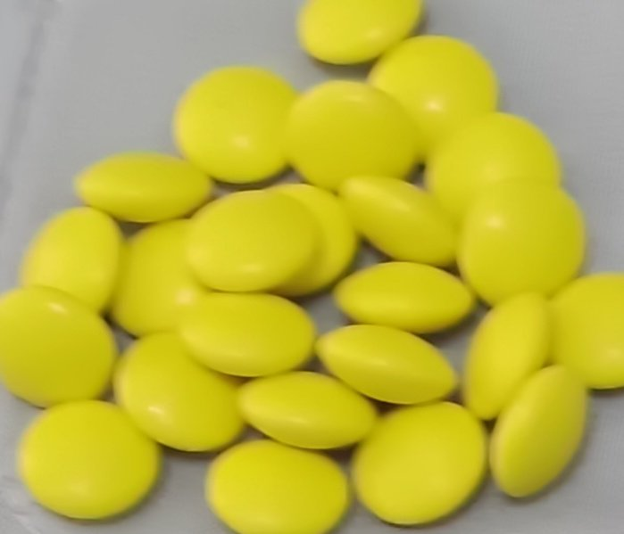  
>2:31 PM  Jan 8, 2023   
>
>Spring风#参宿四 @Spr1ngW1nd  
>· Jan 8, 2023  
>14:33 服用
>
>Spring风#参宿四 @Spr1ngW1nd  
>· Jan 8, 2023  
>15:39 身体有些发轻了 镇痛
>
>Spring风#参宿四 @Spr1ngW1nd  
>· Jan 8, 2023  
>15:43 感觉有些镇咳的感觉 咳嗽相对来说不会那么痛
>
>Spring风#参宿四 @Spr1ngW1nd  
>· Jan 8, 2023  
>15:51 呼吸抑制（呼吸深度变浅）
>
>Spring风#参宿四 @Spr1ngW1nd  
>· Jan 8, 2023  
>15:34 头发晕
>
>Spring风#参宿四 @Spr1ngW1nd  
>· Jan 8, 2023  
>16:22 欣快感刚才时候可能有一点 偏向于比较自信？ 有一点镇痛效果 我再等等看
>
>Spring风#参宿四 @Spr1ngW1nd  
>· Jan 8, 2023  
>16:31 音乐更像是从远处一些地方飘过来  
>4:32 PM · Jan 8, 2023  
>·  
>87.9K Views
>
>Spring风#参宿四 @Spr1ngW1nd  
>· Jan 8, 2023  
>16:38 阿片类的口干？还是什么

Spring风吞下24t哮喘片时，是当天下午2时31分。而那时，距离那臭名昭著的“`剧烈变形`”，仅剩不到6个小时。在这一种制剂所含的两种成分中，[吗啡](/药物/吗啡.md)才是真正有娱乐价值的。

然而，吗啡并不能轻易大量获得。而能够比较容易获得的，只有复方了[麻黄碱](/药物/麻黄碱.md)的药物。这些药物的适应症通常为哮喘——前者属于[抑制剂](/文档/药物分类/抑制剂.md)，可以抑制呼吸神经中枢，缓解哮喘患者的呼吸急促问题，后者扩张支气管，缓解哮喘导致的支气管痉挛。

在我国，哮喘是一个常见疾病，且难以根治，所以患者必须定期服药才能缓解。虽然这种药物早已被禁止在网络上销售，只能在线下购买，且需要凭处方和身份证，但是仍然有娱乐性使用的可能性。

虽然Spring风在第一个推文中提到过，自己知道那些药片里有麻黄碱，但在他的药物记录中，他似乎只着重于记录吗啡作为[阿片类药物](/文档/药物分类/阿片类药物.md)的药效。这也许表明，他放松了对于麻黄碱的警惕，酿成了悲剧......

[麻黄碱](/药物/麻黄碱.md)是一种[兴奋剂](/文档/药物分类/兴奋剂.md)，[Drugbank](https://go.drugbank.com/drugs/DB01364)的数据表明，[麻黄碱](/药物/麻黄碱.md)的代谢半衰期约为6小时，也就意味着，在那天晚些时候，服用致幻剂时，Spring风的体内很可能仍然残留着至少一半的麻黄碱。作用机理上，麻黄碱所影响的神经递质系统主要是[去甲肾上腺素](/文档/去甲肾上腺素.md)，次要是[多巴胺](/文档/多巴胺.md)，二者都是兴奋性神经递质。麻黄碱由神经递质转运蛋白介导，[促进神经递质的释放](/文档/神经递质释放剂.md)。这意味着，它还会同时竞争性抑制神经递质由转运蛋白介导的[再摄取](/文档/神经递质再摄取抑制剂.md)。这些效应导致[突触](/文档/突触.md)间隙的去甲肾上腺素和多巴胺的浓度提高，达成其兴奋效应。

正是因为这种机理，当[麻黄碱](/药物/麻黄碱.md)与[单胺氧化酶抑制剂](/文档/单胺氧化酶抑制剂.md)共同存在于人体内时，会发生异常恶劣的[药物相互作用](/文档/危险药物联用.md)。这种效应类似于头孢配[酒](/药物/酒精.md)，却远远比它恶劣。

这是因为，在人体中，[单胺](/文档/单胺.md)类[神经递质](/文档/神经递质.md)(去甲肾上腺素和多巴胺都属于单胺类神经递质)在被突触前膜释放后，主要存在两种途径降解。

其一是通过单胺氧化酶被转化为醛类代谢产物，无法正常[激动](/文档/受体激动剂.md)[受体](/文档/受体.md)，而这种降解途径在这个条件下已经被单胺氧化酶抑制剂抑制了；

第二是通过相应的转运蛋白再摄取回收至突触前膜，但在这条件下，这种途径也已经被麻黄碱抑制了。

综合两种条件都被抑制的情况，单胺类神经递质无法被高效地降解，突触间隙的去甲肾上腺素和多巴胺的浓度超过安全水平，突触后膜的受体以极高的频率被激活，[神经元](/文档/神经元.md)以一种错乱的频率发出神经冲动，极有可能会导致[惊恐发作](/药效/惊恐发作.md)、[精神病发作](/药效/精神病发作.md)。而那些负责调节血压、心率的神经元也是如此。<!-- 需要验证-->后果便是[高血压](/药效/血压升高.md)、[心动过速](/药效/心率增快.md)，最终可能导致死亡。

以上还是不考虑致幻剂的幻觉效应的结果......

据传言称，他当时服用的，是一种植源致幻剂——[相思汤](/药物/相思汤.md)[^3]。这种植源致幻剂含有两种活性成分：[二甲基色胺(DMT)](/药物/DMT.md)，以及在这种情况下会导致悲剧的[单胺氧化酶抑制剂](/文档/单胺氧化酶抑制剂.md)，分别来自两种不同的植物。之所以在相思汤中，DMT必须与单胺氧化酶抑制剂配合服用，是因为胃肠道中含有的单胺氧化酶会分解DMT，生成无效的代谢产物。

<!-- 这里的顺序很怪，以后再说吧 -->

即便传言有误，spring风服用的并不是相思汤，而只是普通的某个[色胺类](/文档/药物分类/色胺类物质.md)[迷幻剂](/文档/药物分类/迷幻剂.md)，残留在其体内的[兴奋剂](/文档/药物分类/兴奋剂.md)与任何迷幻剂都会产生恶劣的药物相互作用。

也不知道，他是不懂；还是说，他抱有侥幸心理；或者是，他明知山有虎、偏向虎山行......Spring风早已预定好了新一轮的测试。他终究还是在未等麻黄碱被完全排出体内的情况下，仓促地决定开始了新一轮的测试。

既然那一天的[致幻剂](/文档/药物分类/致幻剂.md)测试是他早就计划好的，当时也没有发现这一重大隐患的人劝阻他，他就按原计划去做了。

>Spring风#参宿四 @Spr1ngW1nd   
>6:07 PM · Jan 8, 2023   
>在思考致幻剂没有人陪是不是有点危险 我等会把刀子那些收了和大门口给锁了先

仿佛是预感到了危机的到来，Spring风排查发现了三个安全隐患，也不知道他是否采取了有效的措施解除这些隐患。

无论如何，它们并未影响结局。

接下来，你将要目睹的，是药圈历史上最臭名昭著的悲剧。

>Spring风#参宿四 @Spr1ngW1nd  
>· Jan 8, 2023  
>致幻剂 测试  
>7:49 PM · Jan 8, 2023
>
>Spring风#参宿四 @Spr1ngW1nd  
>· Jan 8, 2023  
>19:47服用
>
>Spring风#参宿四 @Spr1ngW1nd  
>· Jan 8, 2023  
>19:55 轻微恶心感  
>

>Spring风#参宿四 @Spr1ngW1nd   
>8:04 PM · Jan 8, 2023   
>色胺  
>
(同一个推文下，但在串外的一个回复)

这条推文是他生前倒数第三条推文，看上去似乎特别仓促。也许这表明，他此时就已经陷入迷乱的状态了。

现在，距离他发出那最后一条臭名昭著的推文仅剩7分钟。


>
>Spring风#参宿四 @Spr1ngW1nd  
>· Jan 8, 2023  
>20:10 视觉开始变形
>
>Spring风#参宿四 @Spr1ngW1nd  
>· Jan 8, 2023  
>20:11 剧烈变形

当看到这一个令人迷惑的推文时，很多药圈内外的人士们都在好奇：在发送出“[剧烈变形](/药效/几何.md)”的那一刻，Spring风到底正在经历什么呢？以及，在他“剧烈变形”之后呢？

<!-- 此处的笔者指鼠尾草

笔者对此深有体会，虽然笔者并非与Spring风通过服用相思汤达到过这一状态，而是通过[某种](/药物/DPT.md)据说更阴暗的[研究用](/文档/研究用化学品.md)的[色胺类物质](/文档/药物分类/色胺类物质.md)。而那是两年以后，药圈已沧海桑田了。

*这一段挪到以后再讲，暂时放在这*

---

笔者第一次服用任何种类的[迷幻剂](/文档/药物分类/迷幻剂.md)。当时，笔者的电子天平坏了，但是仍然打算尝试一下。于是，笔者仅凭直觉，从包装袋中倒出了貌似差不多有50mg(50mg约为此物质的[中等剂量](/文档/药物剂量分类.md))的该物质，便拿起吸管，通过[鼻吸](/文档/给药途径.md)摄入。

当时，笔者[心境](/文档/情景与心境.md)良好，戴着耳机，听着提前准备好用于[幻觉体验](/药效/幻觉状态.md)的歌单。

鼻吸药物15分钟过去，笔者突然感到 剧烈变形。以后再写吧

--- -->

最后一条不明不白的推文发布后，[Spring风](/文档/补档/Overdosewiki/Report/RP-74.md)，这名OD圈早期药物探索者的故事到此结束了。但是，据传言称，他并没有立即丧命，而是被其家属发现，送医后抢救了四天，直到1月11日才死。

然而，也许是根本没有人在线下与他有接触，并没有人像<ruby>上个月<rt>2022-12</ruby>推友Anilovr逝世一样，立即公布了他的死讯。ODer们对此一直不知情，而是焦急地等待他再次发布推文，来宣布自己在消失期间到底发生了什么。

令ODer们的希望破灭的是，随着时间逐渐流逝，Spring风账号再也没了动静。他们认定了他已经死亡这一事实，以及，这名药师再也不会出现了，连同那些仍有待探索的药物们。

Spring风之死在OD圈引起了巨大的反响。最直观的是，它带来了第一波ODer们对于探索[娱乐性用药](/文档/娱乐性用药.md)的反思，毕竟，即便是身为经验丰富的“药师”的Spring风也难逃一死。此事所有ODer们亲眼证明，药物是能造成严重的伤害的。

常用的OD药物的种类有限，但那些尚未探索的药物种类有千千万万种，能够造成的伤害更是罄竹难书，且神秘莫测。即便有侥幸逃脱的可能，也是“逃得了初一逃不过十五”。为了防止自己受到*真正的*伤害，许多人不敢测试新药。

这，大概是OD圈暂时停止了探索新药的脚步的一个原因。而当一年后，另一个更重要的一个原因不再成立后，药圈对于新药的探索将迎来另一个巨大的爆发。~~先问是不是，再问为什么。~~

*最后他是怎么被证明死了的呢？如果你有材料，请帮笔者补充。*

## 请输入文本

<!-- 得赶紧写了!!! -->

所有上过网的人都知道，自媒体就得靠流量吃饭。不论到底是好是坏，总有愿意涉足灰产话题的自媒体们。


<!-- 这一段不知道加到哪里好-->


早在2022年，OD圈尚未进入主流。而他们便开始利用OD圈作为炒作的对象。更准确地来说，是OD药物，例如[右美沙芬](/药物/右美沙芬.md)。他们既利用人们的好奇心，又同时激起了人们的好奇心，包括下文即将提到的一位将会改变od圈的人物。


>超级后后后藤 @Overdose_DBD    
>2022年08月09日，你是励志要当化学工程师的落榜中考生，平日里最大的爱好是作曲，最爱的偶像是超天酱。这天你打了一下午的彩虹六号，正在刷视频，偶然间看到了一个叫“圈内师老师”的UP发了一个视频，说有些青少年拿一种叫“右美沙芬”的止咳药来磕  
>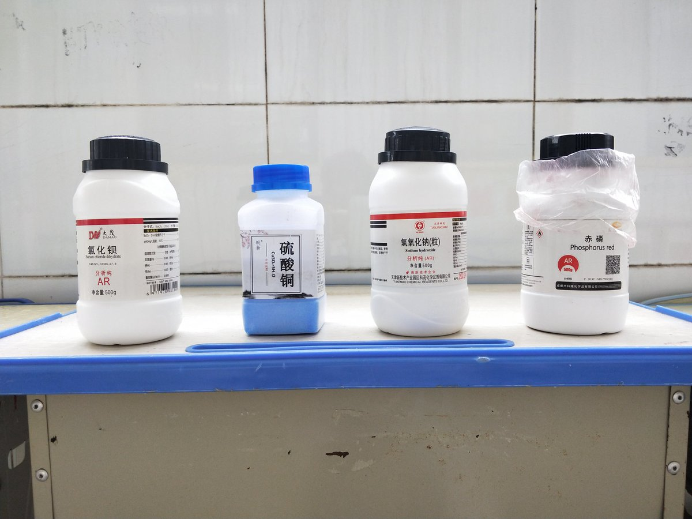    
>6:27 PM · Aug 9, 2024

这，便是后藤老师OD之梦开始的地方。*谁还不是这样开始的呢?*


接下来，让我们一起探究超级后后后藤这一人物吧。

后藤在接触od后，在2022年8月29日首次开始od，见[odwiki RP-7](/文档/补档/Overdosewiki/Report/RP-7.md)

>超级后后后藤 @Overdose_DBD  
> Aug 9, 2024  
>2023.03，我看着吧里乱传什么“愈美有甘油”的史诗级胡话，便发了个“愈创甘油醚≠甘油”。那时我略知一二，经常掺和吧里解疑答惑。慢慢找我问的人多了，我当时就目的着减害了，剂量压低，宣传危害。我至少掺和宣传了“不得pr+晚安”“美金刚大脑空洞”。2023.08，我加入了很多od群，包括欧d群
>
>超级后后后藤 @Overdose_DBD  
> Aug 9, 2024  
>各种群，我待欧d群里最得好。当时我微信正好叫“后藤一里”，大伙们在群里问，我答几句。答得多了，大伙们都认得我“后藤”了  
>那时我就琢磨着减害。压剂量，说危害。那张白兔指南，当年真的劝退了几个人；为什么odw引论注意事项第一句“舍曲林不能o”？当年真的好多人问这个！
>
>超级后后后藤 @Overdose_DBD  
> Aug 9, 2024  
>注册这个号，后来欧d群解体，我加入余下成员自发零散的群。2024.01，有一个贴吧来加我的人，邀请我写他的网站“overdosewiki”。我当时想，一个个答太浪费时间了，就这样一个站点，大伙们一看就好了，多方便啊！更能减害了不是嘛？于是我加入了……  
>狗官走上了不归路！  
>8:03 PM · Aug 9, 2024  

看来，在2023年od还要火未火的时候，后藤已经加入了百度贴吧，为ODer们答疑。当时，许多人听到了“过量服药”的传言，看着各种手边的药物，主要是[SSRI](/文档/SSRI.md)类药物和[抗精神病](/文档/抗精神病药.md)药物，就想是否能够使用这些药物改变意识状态。答案当然是否定的，而且，过量服用这些药物还会导致严重的健康风险，包括[血清素综合征](/文档/血清素综合征.md)。

但是此类问题居然是群中的主要问题。这让后藤意识到了，ODer们面临着有待减少的伤害，一个个答这些问题来减少这些伤害太浪费时间了，将它们编写成网站，开设一个网站则是最佳选择。

终于，后藤与另外一位将来将被称为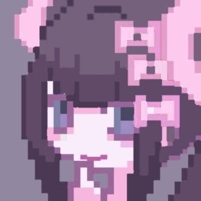鸡哥，另一位传奇级人物，开办了[odwiki](overdose.wiki)，od圈第一个百科。就此，OD百科化的序幕被拉开。此百科的重要意义有多大，无需多言。

为了撰写odwiki，后藤可谓费尽心机。他拉了一大群人测试新OD药物，撰写报告等等。

加入一大堆药物测试的摘录

然而，后藤本人精神状态不是很稳定，经常说一些莫名其妙的话。而后来，发生的三个事件可谓彻底让他崩溃。


>桜崎彩加🍥（右美贩售版） @hulicaijia   
>这里彩加    
>白云山右美沙芬    
>宛衡右美沙芬都有售ing    
>都是15元/盒    
>欢迎找我买药扩列互关谢谢😪    
>10:06 PM · Apr 30, 2024   
 


首先就是，2024年5月4日，彩加，一名跨性别ODer，因过量服用[金刚烷胺](/药物/金刚烷胺.md)导致精神分裂发作，[死了](/文档/补档/Overdosewiki/Report/RP-49.md)。之后，此人的死亡被指责与后藤有关，至于关联程度究竟多大有待考证。

紧接着，可能是因为OD已经传播得过于广泛的缘故，2024年5月7日，右美沙芬宣布被列管。

>超级后后后藤 @Overdose_DBD   
>你知道我要骂什么    
>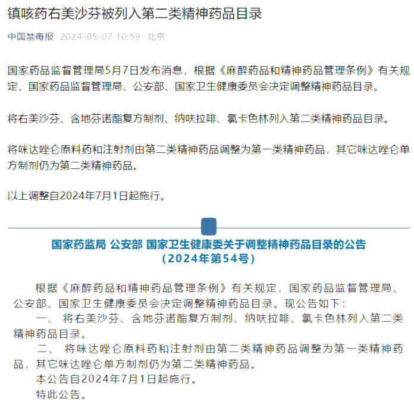      
>1:53 PM · May 7, 2024

>超级后后后藤 @Overdose_DBD   
>今天我们迎来了对优米精二管控最好的解释
>我不带任何政治思考，我本人不了解任何政治内容，我本人没有任何政治立场，我的描述仅限现象   
>“就跟疫情爆发的时候拉隔离区一样，隔离区里的人死活不管”    
>2:24 PM · May 27, 2024

此次事件让大量ODer们感到震惊，而恐慌，因为其他任何OD药物都可能面临管制的威胁。这也让之后很多ODer们转向[策划药](/文档/研究用化学品.md)，也是后来很大一段时间内探索的主要对象，等到那时，我们会详尽说明。

然后，鸡哥，一名odwiki参与者，分裂出了另一个与

最终，将后藤拉向


>超级后后后藤 @Overdose_DBD   
>减害我减你妈了个大鸡吧，不是我就减个危害你至于拿核弹强奸我吗，不是被鸡哥抓就是被你们强。来来来既然这么喜欢玩那么我来陪你们玩，直接高原起纯精分我来陪你们玩他妈的。收了一硬盘音乐准备欣赏直接被没收，真的是给我两颗睾丸都气得原地爆炸。整理完材料直接上高原抓人一个都不放过   
>5:30 PM · Aug 31, 2024   


他终究还是抛弃他的wiki而去。但他的故事，将在一次长达约一年的停顿之后，重新开始。

2025年1月，odwiki发推声称，后藤已经被他们优化掉了。

---

>超级后后后藤 @Overdose_DBD    
>我本早就离开了这地方，但今天我被某几位神明气急逼疯了，倒好像越不管越让各个Kaisers得寸进尺蹬鼻子上脸。打扰到圈外我这啮齿科的生活了
现在我は，只要保卫我平静的日子，不稀罕你们传的鬼王位，也不想管啥事，更懒得辟谣或减害
>只是为了保卫退圈生活，希望你们能明白，谢谢   
6:43 PM · Sep 21, 2025

不过，在此之间，od圈果然还是发生了重大的变化。

药物百科

沐雨，月尘

3-MeO-PCE

55555,一名

由于odwiki的推特账号由于年久失修，被冻结，也不得而知。

于是，他被推特封号了。

那是2026年2月2日，一场悲剧将要发生在春节之前。

## Conversation
```
超级后后后藤 @Overdose_DBD
故事1
我最开始了解到茶苯海明时。那时我问别人，有什么药物能止优米吐，别人告诉我说茶苯海明，顺便说茶苯海明也可以o。于是我买了茶苯海明，我去搜索副作用，那帮子医生写的好像也没什么大不了，于是我开始od茶苯海明。直到谵妄出现的那一刻，我才明白，茶苯海明不好玩，可惜晚了
12:29 PM  May 28, 2024
10.1K Views

超级后后后藤 @Overdose_DBD May 28, 2024
故事2
我最开始了解od，也是因为右美沙芬。2022.08，那时候啥都没有，没有人告诉我副作用是什么，没有人告诉我右美有什么药效，有的只是那帮子医生含糊奇异的回答，以及指南上如同RP-76的描述。于是我开始od了
直到现在，我才明白一切都晚了。要是那时候也有一个后藤告诉我那些，那该多好！

超级后后后藤 @Overdose_DBD May 28, 2024
故事3
我最开始了解晚安时，哪有我们这帮子验证副作用的，哪有人会写什么副作用出来给我们听，只有一些人说“这个也能o！还有幻觉”以及指南。那时正是晚安美金刚扩散的时候，于是我开始od晚安了（甚至一开始是复方晚安）
现在我什么都知道了，但是晚了

超级后后后藤 @Overdose_DBD May 28, 2024
故事4
我当年进过一个od群，里边有一个人拿着我在贴吧写的东西，自称是自己一颗一颗吃出来的内容。我细看，这家伙还加上了自己的理解，什么右美沙芬是伪麻黄碱、有美、扑尔敏，什么愈美是右美沙芬加麻黄碱。说他几句直接破防，直接惭愧认错

超级后后后藤 @Overdose_DBD May 28, 2024
故事5
我在od群里待着观察见过：
一些啥都不知道的餐券女问苯海索怎么o怎么样，谁都答不上来！
好，一去o又回来抱怨怎么这么恶心，问怎么缓解，谁都答不上来！
把美金刚、晚安换上去同理

超级后后后藤 @Overdose_DBD May 29, 2024
🥺

🐾 @WangBai_LFYP May 31, 2024
爱波奇老师🥹❤️

超级后后后藤 @Overdose_DBD May 31, 2024
🥺
```

```
超级后后后藤 @Overdose_DBD
请直接说出我的错误，否则我怎么可能改正。。
9:57 PM Jun 3, 2024
12.5K Views

超级后后后藤 @Overdose_DBD Jun 3, 2024
有些事情，你不提醒我，我这辈子都察觉不出来有问题。。
你瞒着我不说，只觉得你不去解决问题，你就围着我的问题骂我发泄情绪，这有什么用处与意义。。

超级后后后藤 @Overdose_DBD Jun 3, 2024
所以不告诉我我的问题是什么的人，反而才是在害我咔？
既然你觉得我有那样的问题，那么请你直接对我说出口，否则要么你在乱说话，要么你就是忍气吞声自找苦吃。。

超级后后后藤 @Overdose_DBD Jun 3, 2024
开着嫌传播药物滥用，关了嫌没得参考减害；右边的家伙嫌写得太保守，左边的家伙嫌写得诱导人。最后问题在哪？没有人告诉我，简直是乱开口

虹夏🖤胺樂天使 @Nijika_overdose Jun 4, 2024
我觉得这问题就没法两全
像之前你分享贴吧号被疑似晶哥的人物私信叨扰的时候，就应该知道或许在普罗大众眼里科普这些也是种错误吧
儒儒有言“得志，与民由之；不得志，独行其道”
虹夏酱会一直守护最好的后藤酱的😘

超级后后后藤 @Overdose_DBD Jun 4, 2024
是如此，然后虹夏你可以叫凉还我钱吗

雨夜空 @RAlNY_NlGHT Jun 4, 2024
于oder而言，wiki带来的是帮助，知识普及和药物减害
于健全人，wiki则是向他们介绍何种药物可以滥用，并且有部分人因此变成oder
wiki若是产生社会问题，也是因为宣传药物滥用内容，不应是科普药物减害
（1/n）

超级后后后藤 @Overdose_DBD Jun 4, 2024
odwiki还是欠改了，要是这无法拦截健全人的话那肯定是我的毛病

chrorinEVE @chrorine_17 Jun 5, 2024
祝你顺利

超级后后后藤 @Overdose_DBD Jun 5, 2024
🥺

虚拟粘同学会梦到一般通过赛博溺水态李颖吗☆ @Chunliang2nd Jun 3, 2024
新开个页面多汉化点psywiki

超级后后后藤 @Overdose_DBD Jun 3, 2024
已经有其他组织在干咯！

虚拟粘同学会梦到一般通过赛博溺水态李颖吗☆ @Chunliang2nd Jun 3, 2024
哪里

超级后后后藤 @Overdose_DBD Jun 3, 2024
忘啦！

菌菌 @JunJun31246 Jun 4, 2024
守护最好的后藤酱~！

超级后后后藤 @Overdose_DBD Jun 4, 2024
我好集贸

林 @ln9814003229572 Jun 4, 2024
守護我們最好的後藤醬，你可是傳奇電視台牢書啊😿不能沒有你

超级后后后藤 @Overdose_DBD Jun 4, 2024
我好集贸，但是我确实是电视台超级芝加哥

时棠 未眠 @DaleWesley17 Jun 5, 2024
守护最好的后藤……刚开始我是o摄取林喹硫平的后面才知道别哦这种真的救了我ww

koishi！🏳️‍⚧️🍥 @KoishinFlandre Jun 4, 2024
抱抱qwq

🐾 @WangBai_LFYP Jun 4, 2024
抱抱波奇

✟ @slivernightFez Jun 4, 2024
啊啊为什么打不开wiki网站了
```


[^1]:   As of June, 2013, it appears that Chinese pharmacies require purchasers of DXM-containing products present ID and the products are almost always behind the counter, but no prescription is required. Many pharmacies record the identity of purchaser along with amount purchased. Previously, DXM-containing products were sold over-the-counter in pills and cough syrups in China. Rules tend to be laxer in rural areas. (thanks am) (last updated Sep 2013) -- erowid.org

<!--脚注不太会用欸，暂时这样应付一下 -->

[^2]: 推文如下：
    > Emma Shi @Emma20131621  
    > （文字版  
    >     彩霞案是在2022年11月初于上海发生的针对跨性别女性彩霞的拘捕审讯案件，由于来自警方和家属的双重妨碍，最后由我方在非常规情况下为彩霞签出委托书，并于12月对外众筹律师费；由于该案件涉及的细节复杂、人数众多，其中涉及当事人安全隐私等诸多问题，在经过与律师和其伴侣的沟通之后，  
    > 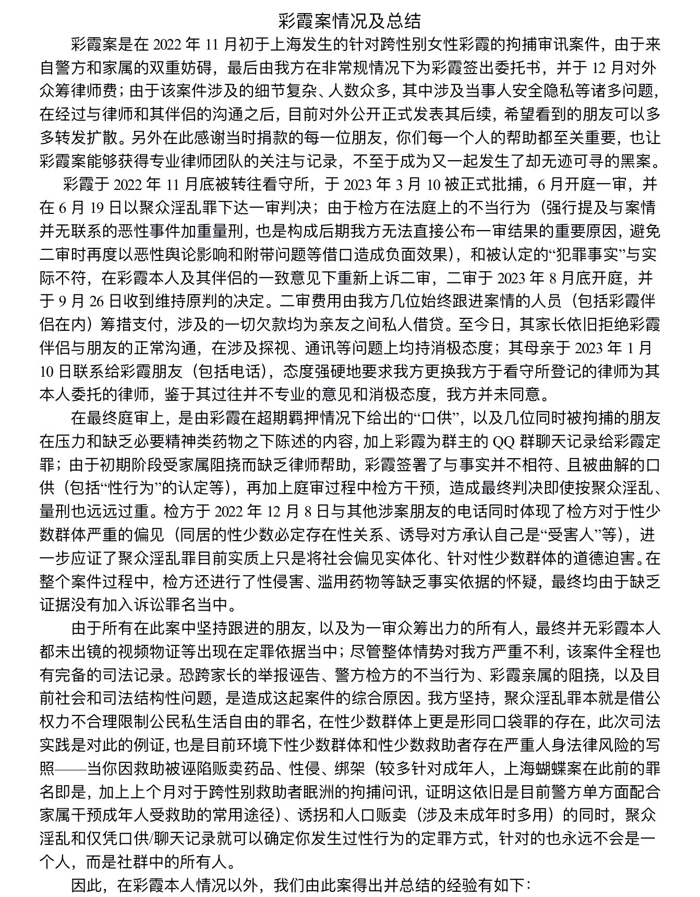  
    > 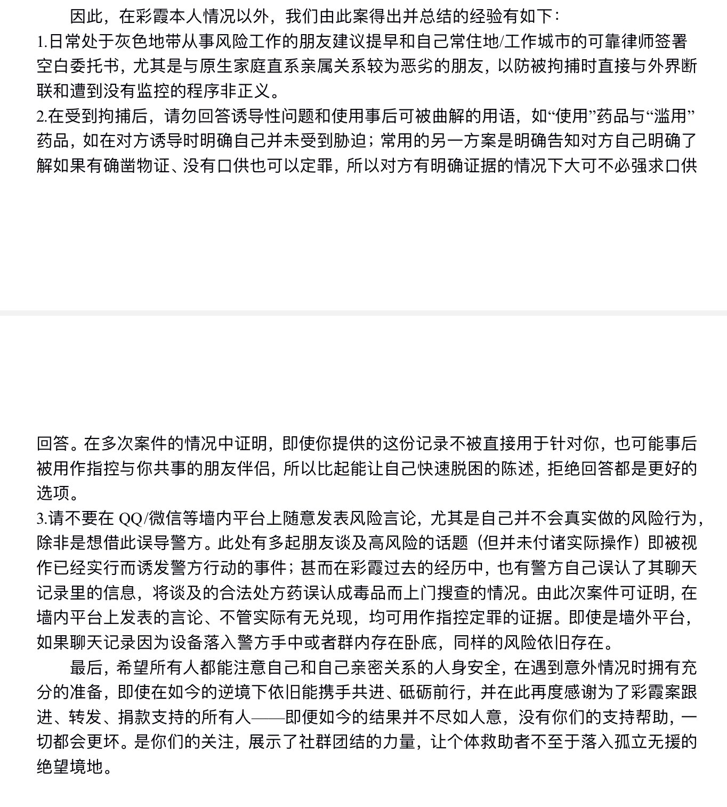  
    > 7:05 PM · Nov 10, 2023 · 59.4K Views

    > Emma Shi @Emma20131621 · Nov 10, 2023  
    > 目前对外公开正式发表其后续，希望看到的朋友可以多多转发扩散。另外在此感谢当时捐款的每一位朋友，你们每一个人的帮助都至关重要，也让彩霞案能够获得专业律师团队的关注与记录，不至于成为又一起发生了却无迹可寻的黑案。  
    >    彩霞于2022年11月底被转往看守所，于2023年3月10被正式批捕，

    > Emma Shi @Emma20131621 · Nov 10, 2023  
    > 6月开庭一审，并在6月19日以聚众淫乱罪下达一审判决；由于检方在法庭上的不当行为（强行提及与案情并无联系的恶性事件加重量刑，也是构成后期我方无法直接公布一审结果的重要原因，避免二审时再度以恶性舆论影响和附带问题等借口造成负面效果），和被认定的“犯罪事实”与实际不符，

    > Emma Shi @Emma20131621 · Nov 10, 2023  
    > 在彩霞本人及其伴侣的一致意见下重新上诉二审，二审于2023年8月底开庭，并于9月26日收到维持原判的决定。二审费用由我方几位始终跟进案情的人员（包括彩霞伴侣在内）筹措支付，涉及的一切欠款均为亲友之间私人借贷。

    > Emma Shi @Emma20131621 · Nov 10, 2023  
    > 至今日，其家长依旧拒绝彩霞伴侣与朋友的正常沟通，在涉及探视、通讯等问题上均持消极态度；其母亲于2023年1月10日联系给彩霞朋友（包括电话），态度强硬地要求我方更换我方于看守所登记的律师为其本人委托的律师，鉴于其过往并不专业的意见和消极态度，我方并未同意。

    > Emma Shi @Emma20131621 · Nov 10, 2023  
    > 在最终庭审上，是由彩霞在超期羁押情况下给出的“口供”，以及几位同时被拘捕的朋友在压力和缺乏必要精神类药物之下陈述的内容，加上彩霞为群主的QQ群聊天记录给彩霞定罪；由于初期阶段受家属阻挠而缺乏律师帮助，彩霞签署了与事实并不相符、且被曲解的口供（包括“性行为”的认定等），

    > Emma Shi @Emma20131621 · Nov 10, 2023  
    > 再加上庭审过程中检方干预，造成最终判决即使按聚众淫乱、量刑也远远过重。检方于2022年12月8日与其他涉案朋友的电话同时体现了检方对于性少数群体严重的偏见（同居的性少数必定存在性关系、诱导对方承认自己是“受害人”等），进一步应证了聚众淫乱罪目前实质上只是将社会偏见实体化、

    > Emma Shi @Emma20131621 · Nov 10, 2023  
    > 针对性少数群体的道德迫害。在整个案件过程中，检方还进行了性侵害、滥用药物等缺乏事实依据的怀疑，最终均由于缺乏证据没有加入诉讼罪名当中。  
    >     由于所有在此案中坚持跟进的朋友，以及为一审众筹出力的所有人，最终并无彩霞本人都未出镜的视频物证等出现在定罪依据当中；

    > Emma Shi @Emma20131621 · Nov 10, 2023  
    > 尽管整体情势对我方严重不利，该案件全程也有完备的司法记录。恐跨家长的举报诬告、警方检方的不当行为、彩霞亲属的阻挠，以及目前社会和司法结构性问题，是造成这起案件的综合原因。我方坚持，聚众淫乱罪本就是借公权力不合理限制公民私生活自由的罪名，在性少数群体上更是形同口袋罪的存在，

    > Emma Shi @Emma20131621 · Nov 10, 2023  
    > 此次司法实践是对此的例证，也是目前环境下性少数群体和性少数救助者存在严重人身法律风险的写照——当你因救助被诬陷贩卖药品、性侵、绑架（较多针对成年人，上海蝴蝶案在此前的罪名即是，加上上个月对于跨性别救助者眠洲的拘捕问讯，证明这依旧是目前警方单方面配合家属干预成年人受救助的常用途径）、

    > Emma Shi @Emma20131621 · Nov 10, 2023  
    > 诱拐和人口贩卖（涉及未成年时多用）的同时，聚众淫乱和仅凭口供/聊天记录就可以确定你发生过性行为的定罪方式，针对的也永远不会是一个人，而是社群中的所有人。  
    >    因此，在彩霞本人情况以外，我们由此案得出并总结的经验有如下：

    > Emma Shi @Emma20131621 · Nov 10, 2023  
    > 1.日常处于灰色地带从事风险工作的朋友建议提早和自己常住地/工作城市的可靠律师签署空白委托书，尤其是与原生家庭直系亲属关系较为恶劣的朋友，以防被拘捕时直接与外界断联和遭到没有监控的程序非正义。

    > Emma Shi @Emma20131621 · Nov 10, 2023  
    > 2.在受到拘捕后，请勿回答诱导性问题和使用事后可被曲解的用语，如“使用”药品与“滥用”药品，如在对方诱导时明确自己并未受到胁迫；常用的另一方案是明确告知对方自己明确了解如果有确凿物证、没有口供也可以定罪，所以对方有明确证据的情况下大可不必强求口供回答。

    > Emma Shi @Emma20131621 · Nov 10, 2023  
    > 在多次案件的情况中证明，即使你提供的这份记录不被直接用于针对你，也可能事后被用作指控与你共事的朋友伴侣，所以比起能让自己快速脱困的陈述，拒绝回答都是更好的选项。

    > Emma Shi @Emma20131621 · Nov 10, 2023  
    > 3.请不要在QQ/微信等墙内平台上随意发表风险言论，尤其是自己并不会真实做的风险行为，除非是想借此误导警方。

    > Emma Shi @Emma20131621 · Nov 10, 2023  
    > 此处有多起朋友谈及高风险的话题（但并未付诸实际操作）即被视作已经实行而诱发警方行动的事件；甚而在彩霞过去的经历中，也有警方自己误认了其聊天记录里的信息，将谈及的合法处方药误认成毒品而上门搜查的情况。由此次案件可证明，

    > Emma Shi @Emma20131621 · Nov 10, 2023  
    > 在墙内平台上发表的言论、不管实际有无兑现，均可用作指控定罪的证据。即使是墙外平台，如果聊天记录因为设备落入警方手中或者群内存在卧底，同样的风险依旧存在。  
    >     最后，希望所有人都能注意自己和自己亲密关系的人身安全，在遇到意外情况时拥有充分的准备，

    > Emma Shi @Emma20131621 · Nov 10, 2023  
    > 即使在如今的逆境下依旧能携手共进、砥砺前行，并在此再度感谢为了彩霞案跟进、转发、捐款支持的所有人——即便如今的结果并不尽如人意，没有你们的支持帮助，一切都会更坏。是你们的关注，展示了社群团结的力量，让个体救助者不至于落入孤立无援的绝望境地。

[^3]: 一说，[死藤水](/药物/死藤水.md)，但两者的唯一差异只是制作用的植物不同，因此不加细究