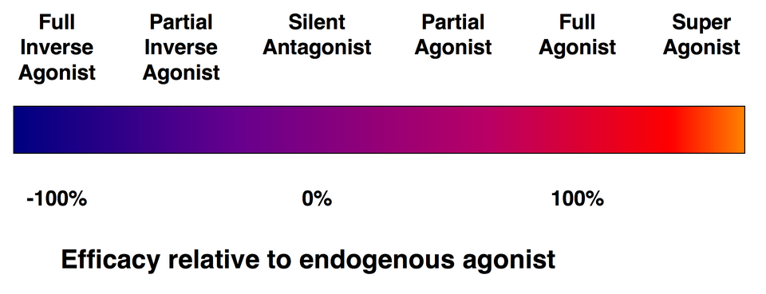

[◀返回](./home.md)

# 激动剂

上图展示了激动剂与[拮抗剂](../文档/受体拮抗剂)的区别。

受体配体的功效谱

受体配体的剂量反应曲线

**激动剂**（Agonist）是一种结合到细胞[受体](../文档/受体.md)上并激活该受体以引起生理反应的化学物质。激动剂引发的反应通常与内源性配体（如激素或神经递质）与受体结合时产生的反应相同。[1] 一种物质影响特定受体的能力取决于该物质对该受体的亲和力和内在功效。物质的亲和力描述了它与特定受体之间的吸引力强度，从而决定了它结合该受体的能力。对受体具有高亲和力的物质结合的可能性高，而亲和力低的物质对受体的吸引程度较低。

这与物质的功效形成对比，功效描述了物质在结合受体后产生反应的能力。与占据相同数量受体的低功效物质相比，高功效物质将产生按比例更强的效应。一种物质的最大功效反映了该物质在受体组上可达到的最大反应，而无论剂量如何。具有高功效的物质可能只需占据较少的受体即可产生最大效应，这意味着超过一定剂量后它不会产生更强的效应。

与激动剂相反，[拮抗剂](../文档/受体拮抗剂)是一种结合到细胞受体但不引起生理反应的化学物质。受体拮抗剂通过阻断或减弱由内源性或外源性物质引起的受体激动效应来发挥作用。

## 激动剂的类型

[受体](../文档/受体.md)可以被身体产生的化学物质（内源性）或体外来源的化学物质（外源性）激活。因此，特定受体的内源性激动剂是指体内产生的、能够结合并激活该受体的化学物质。例如，[血清素](../文档/血清素.md)是血清素受体的内源性激动剂。

### 激动剂

激动剂有几种类型：

*   **超级激动剂**（Superagonist）是一种能产生比内源性激动剂更强受体效应的激动剂，因此其功效超过 100%。
*   **完全激动剂**（Full agonist）结合并激活受体，其功效等同于内源性激动剂。例如，[海洛因](../药物/海洛因.md)模仿内啡肽在神经系统 μ-阿片受体上的作用。
*   **部分激动剂**（Partial agonist）结合并激活受体，但其功效低于内源性激动剂。例如，[赛洛辛](../药物/赛洛辛.md)是 5-HT2A 受体的部分激动剂。

### 逆向激动剂

[逆向激动剂](../文档/逆向受体激动剂)是一种结合到与激动剂相同受体上的药物，但会触发与受体激动剂相反的药理作用。逆向激动剂只能作用于具有固有活性（constitutive activity）的受体；这些受体在没有激动剂存在的情况下也会产生生物反应。激动剂将受体活性增加到基线以上，而逆向激动剂将受体活性降低到基线以下。例如，纳洛酮是 μ-阿片受体的部分逆向激动剂。

### 变构调节剂

变构调节剂（Allosteric modulators）是一种在靶蛋白（例如受体）处间接影响（调节）激动剂或逆向激动剂效应的物质。变构调节剂结合的位点与激动剂结合位点不同。通常它们会引起蛋白质结构的改变。[正向变构调节剂](../文档/受体正向变构调节剂.md)会引起效应的放大，而[负向变构调节剂](../文档/受体负向变构调节剂.md)会引起配体效应的减弱，而在没有配体的情况下，它们自身不会触发功能活性。

### 部分激动剂

部分激动剂是一种可以激活受体，但与完全激动剂相比仅具有部分功效的物质。因此，部分激动剂可能具有完全激动剂或逆向激动剂所缺乏的独特属性。一些部分激动剂，如[丁丙诺啡](../药物/丁丙诺啡.md)，具有天花板效应，即药物的主观效应在超过一定剂量后不会变得更强。在完全激动剂存在的情况下，部分激动剂也可能表现为拮抗剂。丁丙诺啡是 μ-阿片受体的部分激动剂，在其他阿片类药物（如[海洛因](../药物/海洛因.md)）存在时表现为拮抗剂。如果阿片类药物成瘾者在阿片类药物仍在体内时服用丁丙诺啡，由于丁丙诺啡的拮抗作用，他们将进入戒断状态。

## 另见

*   [负责任的用药](../文档/负责任的用药索引页.md)
*   [科学信息](../文档/科学信息索引页.md)
*   [拮抗剂](../文档/受体拮抗剂)
*   [再摄取抑制剂](../文档/神经递质再摄取抑制剂.md)
*   [释放剂](../文档/神经递质释放剂.md)

## 外部链接

*   [Agonist (Wikipedia)](https://en.wikipedia.org/wiki/Agonist)

## 参考文献

1.  [↑](#cite_ref-1) [*Definition of AGONIST*](https://www.merriam-webster.com/dictionary/agonist)