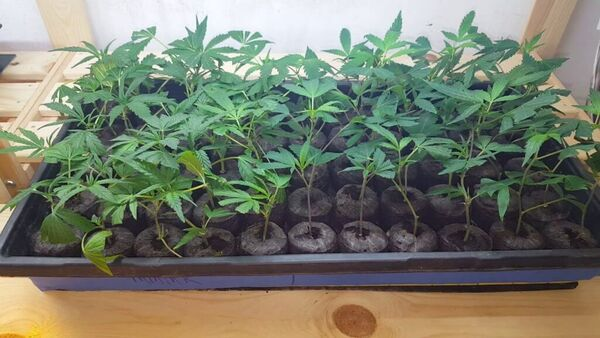
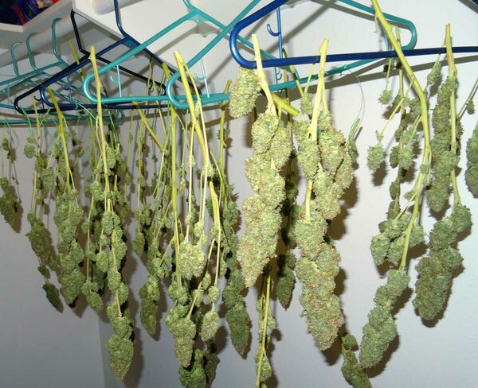

[◀返回](./home.md)

# 大麻种植术

<mark>嗯，还行<mark>

>  **提示**
>
> [使用柠檬酸和水萃取法将CBD转化为THC](使用柠檬酸和水萃取法将CBD转化为THC.md) 是一种相对较新发现的方法。这是生产THC最快，可能也是最便宜的方法。

>  **免责声明**
>
> *本指南仅供信息参考和教育目的。我们要不鼓励你触犯法律，也不能对你的行为承担任何责任。*

本文将介绍如何在室内环境中种植大麻。

## 目录

* [1 建立种植环境](#建立种植环境)
* [2 获取种子](#获取种子)
* [3 发芽](#发芽)
* [4 种植](#种植)
* [5 修剪](#修剪)
* [6 花期](#花期)
* [7 冲洗](#冲洗)
* [8 确定何时收割](#确定何时收割)
* [9 收割](#收割)
* [10 干燥](#干燥)
* [11 醇化](#醇化)
* [12 参考文献](#参考文献)

### 建立种植环境

为了节省电力，请使用 [可调光谱LED灯列表](可调光谱LED灯列表.md)。

建立环境的最佳方式是使用 [一体化种植帐篷](https://duckduckgo.com/?q=All+in+one+grow+tent&ia=web)。这应该包括你种植所需的一切：灯光、过滤器、风扇、定时器、温度/湿度计、管道等。你所需要的只是一个放置它的地方和水源。

### 获取种子

如果你已经在购买大麻，你可以购买仍然混有种子的花蕾。询问你的经销商或从 [在线购买药物](在线购买药物.md) 购买种子。如果是邮寄给你，不要使用你的真实地址！使用不在你名下的邮政信箱或附近的待售房屋地址。
注意你要买什么样的种子！不同的品系是**不同的种子**，它们的生长方式也不同。籼大麻（Indicas）和苜蓿大麻（Sativas）在高度上有所不同，有些种子是自动开花的。这是一个通用指南，适用于所有品系，但请对你将使用的种子做一点研究，以便在空间/高度/水需求成为问题之前考虑到它们。

### 发芽

1.  选择最大的种子，将它们放在平底锅中的两张重型餐巾纸或吸墨纸之间。
2.  用水浸泡餐巾纸，直到完全饱和。
3.  盖上平底锅的顶部或将其放在黑暗的壁橱里三天，或者直到大多数种子出现大约半英寸长的芽。

在此期间，你可以准备育苗床：

1.  使用一个低矮的木箱，如番茄育苗盘，并在里面填上一英寸的砾石。
2.  用混合了少量肥料的土壤填满盒子的其余部分。
3.  润湿土壤，直到水从盒子底部渗出，然后平整土壤，形成一个平坦的表面。
4.  用铅笔，以两英寸的间隔成排打孔。你可以在一个番茄育苗盘里打大约24个孔。

 植物几乎准备好移入盆中

当发芽期结束后，取出那些有足够芽的种子，并在每个孔里种一颗。芽朝下，种子部分应略高于地面。当你插入芽时，将每株植物周围的土壤压实（不要压得太紧）。在此期间，它们应获得足够的水分以保持土壤湿润。当它们准备好进入地面时，植物应高约六到八英寸。[\[1\]](#cite_note-1)

### 种植

在你的植物完成孵化后，是时候将它们转移到全尺寸的盆中了。
对于初学者来说，在3-5加仑的水桶中混合简单的松散透气土壤是非常棒的，并且比任何水培系统都更宽容。务必在桶底切孔，并在下面使用托盘以接住任何溢出物。你需要购买养分（营养液）来喂养你生长的植物，还需要一个喷壶。

1.  降低你的反射器，使其更靠近植物，而不是让它们伸长去寻找光线。随着植物的生长提高照明系统。
2.  将你的灯光定时器设置为每天开启18小时，关闭6小时。
3.  继续给你的植物浇水和施肥。

不惜一切代价避免过度施肥和过度浇水。宁可谨慎一点，因为添加更多的养分或水总是比去除它们更容易。大麻的根喜欢干/湿循环，所以提起你的水桶，通过重量你会更好地了解它们是否需要浇水。植物过度施肥的第一个迹象是叶尖烧焦。[\[2\]](#cite_note-2)

### 修剪

修剪信息图

修剪你的植物是可选的，但如果你花时间去做，你将生产出更高产量的花蕾。

修剪时，要尽早并经常开始。在两个新芽将出现的节点上方切断或掐断树枝。如果你坚持这个过程，你将拥有看起来像盆景灌木的植物，有大量的结蕾点，而不是大量的伸长和节点之间的大间隙。这是从小空间获得更大产量的有效方法，但你的营养生长期会增加，所以要将其计入你的时间表中。

一旦植物开始开花，就根本不要修剪或掐断植物——那样只会减少你的收成。如果树枝威胁要接触到灯光，弯曲它们或把它们绑下来以防止它们燃烧。在树冠水平由鸡丝网构成的棚架系统（即ScrOG或绿屏系统），将进一步分散结蕾点并大大增加你的产量。只需训练生长的嫩芽沿着屏幕底部水平生长以填补空白点。

### 花期

由于你在室内种植，何时诱导植物开花的决定权完全在于你。如果你想学习如何种植大麻，重要的是要确定你有多少空间，并考虑到你的植物在诱导开花后至少会伸长几周这一事实。一个好的经验法则是每加仑容器一周，所以一个在五加仑桶里的植物在诱导开花前应该有大约五周的营养生长期。

当你准备开始开花阶段时，将你的定时器切换到12小时开启/12小时关闭的光照循环。务必不要用**任何**光线打断12小时的黑暗期。这会迷惑你的植物并导致严重的问题。

将你的喂养方案更改为适合开花的方案。植物养分通常有营养生长期或开花期配方，所以切换到“开花（blooming）”溶液。根据你品系的花期，确定你还剩两周左右的时间，并开始 [冲洗过程](https://www.growweedeasy.com/flushing)。如果你正在种植一个60天花期的品系，在第46天左右开始只用清水冲洗你的作物。

### 冲洗

无论它们是在土壤中生长还是在水培介质中生长，大麻植物都可能遭受盐分或养分残留物的积聚。许多种植者在整个生长过程中每10天用清水冲洗一次植物，以帮助清除这种积聚。当你喂养你的植物时，它们不会立即使用你给它们的所有养分。有些被储存并在以后使用。但是，如果你继续喂养，而你的植物永远不必用完这些储备，它们就会积累并停留在叶子、茎和花蕾中。如果你使用的营养混合物没有完美平衡你植物的需求，它们可能会遭受一种称为“养分锁死（nutrient lockout）”的状况。养分中的不同分子协同工作。如果一种太多而另一种不够，植物可能无法使用任何养分或矿物质。当养分锁死发生时，植物可能会表现出缺乏症状，即使补充额外的养分也不会消失。

何时冲洗？

*   当你切换养分时（例如在开花开始时）
*   每10-14天一次，以防止养分锁死
*   收割前

如何冲洗：
要冲洗土壤中生长的大麻，你需要让大量的清水流过系统。许多种植者使用雨水。如果你愿意，你可以添加像Clearex这样的冲洗剂，尽管这不是必须的。将你的水pH值调至6.2左右，并让其流过容器，直到你有大约80% - 90%的流出液（Run off）。实际量将取决于你的土壤有多干以及排水情况如何，但你应该通过的水量大约等于你的容器体积。[\[3\]](#cite_note-3)

### 确定何时收割

乳白色的毛状体

知道何时以及如何收割你的花蕾与知道如何种植大麻一样重要。

使用放大镜或强力放大镜非常仔细地观察毛状体（trichomes）；微小的腺体茎和头部有时被称为“晶体”。近距离看，它们像小玻璃蘑菇，有一个茎，形成一个球形的圆形透明顶部。在这个腺体头内驻留着精神活性化合物（THC，CBD等）。当大多数腺体头开始变混浊白色且在它们完全变成琥珀色之前收割。如果你渴望更昏昏欲睡的药效（stone），你可以在它们大部分是琥珀色时收割。

### 收割

修剪前后

你的收割环境应包括良好的空气循环，用于修剪和干燥室。因为你会发现这个阶段的气味可能相当强烈。保持房间在华氏70度左右，这个阶段不需要加热，只会增加气味。温度超过86度（华氏）以及过多的水分和粗暴的处理实际上会降低你的THC效力。从修剪到干燥，对你的花蕾要温柔。

有些种植者在基部切断植物，并将整株植物倒挂干燥。其他人会切断树枝并挂起来干燥。还有其他人会切断单个花蕾，以便将它们铺在网筛或架子上干燥。选择你想要的任何方法。务必修剪掉尽可能多的叶子，至少修剪掉大的扇叶。[\[4\]](#cite_note-4)

### 干燥

树枝被挂在壁橱里干燥

干燥你的花蕾是醇化（Curing）过程的第一部分，也是最重要的部分。当快速干燥时，花蕾的味道会变差，闻起来不好，并给你留下偏头痛或偏执，不要急于求成。
你可以使用传统方法干燥，取整个茎并将其倒挂干燥，你可以使用衣架、绳子或任何你可能有的方便的东西。
当倒挂干燥你的花蕾时，当所有花蕾的外部摸起来完全干燥，但不脆时，你的花蕾就准备好放入罐子里了。较大的茎仍然会弯曲，但当花蕾准备好取下时，较小的茎会折断。你应该能够用手指折断最小的花蕾，而不会留下植物的“丝”。“拉丝”意味着里面还有太多的水分。

### 醇化

一旦干燥过程完成，将花蕾从植物上取下并放入罐子中。储存大麻花蕾的理想容器是广口玻璃梅森罐（Mason jars）。这些可以在大型杂货店、大多数工艺品店、网上以及像沃尔玛这样的超市很容易找到。

醇化指南图解

你需要容纳1夸脱的梅森罐（标有“Quart jars”或有时是32盎司罐）。这些罐子中的每一个大约能容纳一盎司的干花蕾（通常一个罐子里能装大约0.75-1.25盎司的花蕾，但这可能取决于你花蕾的密度）。一夸脱的玻璃梅森罐已被证明是适当醇化的最佳尺寸。更大的罐子更有可能助长霉菌，所以坚持使用经过验证的夸脱罐。

你要将每个罐子装满75%的花蕾，所以顶部还有一点空气。如果你摇晃罐子，你希望花蕾能够移动。如果它们粘在一起，这意味着它们仍然太湿，你应该打开盖子一段时间以帮助它们干燥。

定期打开所有的罐子检查并给你的花蕾放气（air out）。在开始阶段，至少每24小时检查一次你的花蕾是很重要的。如果你闻到氨气味或花蕾外部感觉潮湿，这意味着花蕾太湿，需要在再次关闭罐子之前放气。如果它每天闻起来更像大麻，这意味着你做对了。在醇化过程中，请随意通过抽吸来“检查”你的花蕾。当你的花蕾持续处于“醇化区（Cure Zone）”时，它可以被储存或抽吸。

### 参考文献

1. [↑](#cite_ref-1) \[<https://ia802703.us.archive.org/13/items/pdfy-TNlDHryRIk4DXKAU/Steal%20This%20Book.pdf>
2. [↑](#cite_ref-2) [\[1\]](https://hightimes.com/grow/grow-weed-guide-beginners/)
3. [↑](#cite_ref-3) [\[2\]](https://howtogrowmarijuana.com/harvesting-marijuana-head-body-stone/?__cf_chl_captcha_tk__=aa2e179874ecb167237d0bbbdb61e61d81647fc1-1590112515-0-Aa3-xlZFJZK1mWwkFL4IcUVuMNIhRZ0duSUvulvjbhL4HIHiNhbeas-zpeZCzdfuieeFucYxSqWDaIXViC64d1paI0_Hm3j0gXpPPrFv18_qtpH_6mbkqzUuDX_fwmMGynfgI3jCg0-CIZOBF5UBq4EvWh8i3Q0vbfO5l4zTBH5dH7Z6Z7Uu5hsUVHlc106y82JaCilSkyo-hDut1nnC-m232Ue_VCfxvRTyhZBfDINhdOlHvnxftEOew6ta7j70Gpy3eMJ-kEPIS9wnK-oNfiwIdqVyXXuQ4w0IFd-pL1A677Yi3jEvvkwqdEi7HFkK1Ibr61IWKIN_9Jo1XeD0jnPHOYAc7HOAeBSyeK65vnqSKvDoRRA8ExesKwGPkpPBLVL4EmpSpuOBeZSNjqmbnxZHdB3kOkJ-Riy6XfnOWy9YlpS1tsfJbLSx0JgxGpvzrd-uq1SZdTQ234nq3GAR9Sr__Fh9KXUisTjUTwxvtDhMOuLioiUfg-RbLX49gkldBhIkXheHrqvwUF9yL15G1lsRZxBvvx3bG4TkexY1-rSQJaZQDbJRztuXgyda6C7wJg)
4. [↑](#cite_ref-4) [\[3\]](https://www.growweedeasy.com/drying-curing#step-1-cut-down-plant)