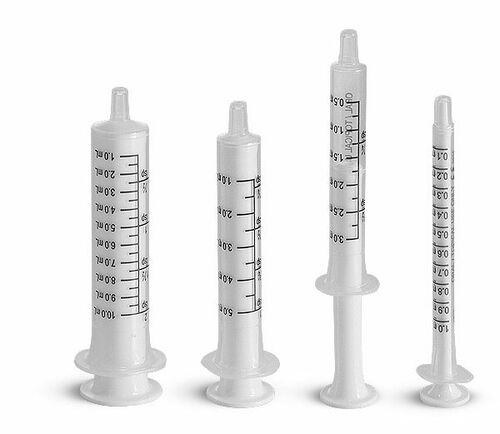

[◀返回](./home.md)

# 液体容量给药法

<mark> 不错啊，翻译得越来越好了</mark>

|  | **[免责声明](../关于本站/观前提醒.md)：** *本指南仅供参考和教育之用。我们不鼓励你触犯法律，也不能对你的行为承担任何责任。* |
| --- | --- |

**液体容量给药法**（Volumetric dosing）是将化合物溶解在液体中以便于测量的过程。出于[伤害减少措施](./负责任的用药.md)的考虑，对于某些药效过强而无法使用传统称重天平测量的化合物，使用液体容量给药法至关重要。这种技术使得使用廉价的 30 美元天平仍能精确测量到几毫克的精度。[\[1\]](#cite_note-1)

许多精神活性物质，包括[苯二氮卓类物质](./药物分类/苯二氮卓类物质.md)和某些[迷幻剂](./药物分类/迷幻剂.md)，其活性剂量不到 1 毫克。如此微小的量无法用普通的数字天平准确测量，因此必须通过称量较大数量的化合物并将其溶解在计算好体积的合适液体中，来进行液体容量给药。

这里有一个液体容量给药计算器：[http://volume.tripsit.me/](http://volume.tripsit.me/)，它可以确定所需的物质和溶剂的量，以及浓度。

## 目录

* [1 材料](#材料)
* [2 溶剂](#溶剂)
* [3 测量](#测量)
    * [3.1 液体](#液体)
    * [3.2 粉末](#粉末)
* [4 溶解](#溶解)
* [5 储存](#储存)
* [6 另见](#另见)
* [7 外部链接](#外部链接)
* [8 参考文献](#参考文献)

## 材料

* **溶剂**，如酒精（伏特加或高度谷酒效果最好）、**水、[丙二醇](http://www.amazon.com/s/ref=nb_sb_noss_2?url=search-alias%3Daps&field-keywords=Propylene+glycol)或[甘油](http://www.amazon.com/s/ref=nb_sb_noss_2?url=search-alias%3Daps&field-keywords=glycerine&rh=i%3Aaps%2Ck%3Aglycerine)**（取决于物质）。
    * 注意：请[搜索互联网](http://www.google.com)以确定使用哪种溶剂。有些物质不溶于水。
* **液体测量设备**，如**注射器**（可以是口服注射器或带针头的注射器）、**量筒、滴管、测量移液管或量杯**（茶匙、汤匙等）。
* **[毫克称](./毫克称.md)**。
* **密封的储存瓶或容器** - 注意：溶液可能会因光照而降解。有深色的 15ml 瓶子 [\[1\]](https://www.amazon.com/Amber-Glass-Bottles-Eye-Droppers/dp/B00SS1SNOS/ref=sr_1_1?ie=UTF8&qid=1484789688&sr=8-1&keywords=15+ml+bottle+with+dropper) 可以最大限度地减少这种暴露。
* **纸、胶带和书写工具**，用于标记瓶子。

## 溶剂

某些精神活性物质（特别是[苯二氮卓类物质](./药物分类/苯二氮卓类物质.md)）几乎不溶于水，但可以在不同浓度下溶解于其他易于获得的溶剂中，如酒精、[丙二醇](http://www.amazon.com/s/ref=nb_sb_noss_2?url=search-alias%3Daps&field-keywords=Propylene+glycol)或[甘油](http://www.amazon.com/s/ref=nb_sb_noss_2?url=search-alias%3Daps&field-keywords=glycerine&rh=i%3Aaps%2Ck%3Aglycerine)。然而，即使加入到正确的溶剂类型中，溶液可能仍需要温和的热水浴或搅拌（摇晃或搅动）才能获得均匀的溶液。热水浴包括将盛有物质的容器放入一个盛有热水的更大容器中。这会加热容器中的溶液，使其更好地溶解。物质可能会从溶液中析出，可能需要再次重复轻度加热/搅拌的过程。在使用前务必检查溶液是否有沉淀物。

首先要考虑的重要因素是所选溶剂能溶解产品的最大浓度。这个数值通常可以通过互联网搜索轻松找到，搜索词如 "*\<物质名称\> \<溶剂\> solubility*"。

特别是酒精，可与大多数溶剂混溶；即使以水为主要成分，通常只需几滴酒精就足以显著提高最大溶解浓度。

向某些溶液中加入少量的酸（柠檬汁、醋等）也可以增加溶质在溶剂中的溶解度。

## 测量

这里有一个液体容量给药计算器：[http://volume.tripsit.me/](http://volume.tripsit.me/)，它可以确定所需的物质和溶剂的量，以及浓度。

### 液体

口服注射器是测量少量液体的理想选择。它们通常在药店出售，也可以在 [Amazon](http://www.amazon.com/s/ref=nb_sb_noss_2?url=search-alias%3Dhpc&field-keywords=oral+syringe) 上买到。

为了获得最佳精度，应使用口服注射器测量计算出的液体体积。你也可以使用其他测量工具，如带针头的注射器、量筒、滴管、测量移液管或量杯。

量杯的换算如下：

* 1/4 茶匙 (TSP) = 1.25ml
* 1/2 茶匙 (TSP) = 2.5ml
* 1 茶匙 (TSP) = 5ml
* 1 汤匙 (TSB) = 15ml

如果使用胰岛素注射器，1cc = 1mL。

为了高效给药，可以使用带有 0.1ml刻度的 1ml 注射器，配合浓度为 10mg/1ml 的溶液；这提供了 1mg/0.1ml 的刻度精度。如果你通常的剂量低于 1mg，最好使用更低的浓度。

### 粉末

首先用[毫克称](./毫克称.md)称量你想用于液体容量给药的粉末量是至关重要的。即使袋子上标明了重量，也不要假设供应商给你的物质数量是确定的；供应商给的产品多于标示量并不罕见。如果一个人认为自己收到了 500mg，但实际上收到了 1000mg，那么溶液的强度将是预期的两倍。

将袋子里的物质倒入装有溶剂的容器中可能会在袋子里留下少量残留。为了解决这个问题，首先称量装有物质的袋子并记下读数，将内容物转移到你的溶液中，然后再次称量袋子。这两个重量之间的差值就是你放入溶液中的物质的量。例如，如果你的初始重量是 2000mg，转移物质后袋子的重量是 750mg，那么你已经转移了 1250mg 的物质。

为了达到 10mg/1ml 的浓度，测量材料的重量（以毫克为单位），然后将该值除以 10。因此，对于 1000mg 的材料，需要 100ml 的溶剂。最安全的做法是尽可能使用最低浓度，对于在 1mg 范围内有效的非常强效的物质，最好使用 1mg/1mL 或更低的浓度。

## 溶解

称量材料、计算浓度并测量所需体积的溶剂后，将液体加入合适的容器中，然后小心地混入化合物。密封严实，然后用力摇晃容器以彻底混合。

为了帮助溶解，可以将容器放入热水浴中加热。过一会儿，溶剂的粘度会降低，可以混合得更彻底。在热水浴中要注意热量，因为沸水可能会破坏某些化合物的化学结构。

有些化学物质需要酸的帮助才能溶于水。弱酸如白醋甚至柠檬酸都是有效的选择，但食品级乙酸（醋）是将酸加入溶液中最卫生的方式。

## 储存

* 避免直接暴露在阳光或高温下。
* 在容器上标明内容物和浓度。
* 存放在儿童接触不到的安全地方。
* 定期检查溶液的均一性；瓶底不应有颗粒物析出。溶液应混合均匀且均一。

## 另见

* [负责任的用药](./负责任的用药.md)
* [药物剂量量取](./药物剂量量取.md)

## 外部链接

* [Liquid measurement guide (Erowid)](https://www.erowid.org/psychoactives/dose/dose_info1.shtml)
* [Guide to volumetric dosing (Reddit)](https://www.reddit.com/r/Borax/comments/16dey0/guide_to_volumetric_dosing/)
* [Volumetric dosing tool (TripSit)](http://volume.tripsit.me/)

## 参考文献

1. [↑](#cite_ref-1) [*Erowid Psychoactive Vaults : Liquid Measurement Technique*](https://www.erowid.org/psychoactives/dose/dose_info1.shtml)

**[负责任的用药索引](./负责任的用药.md)**

