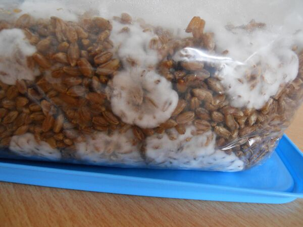
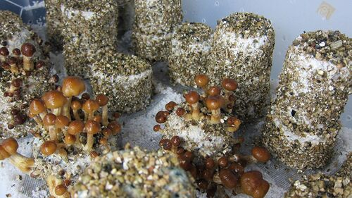
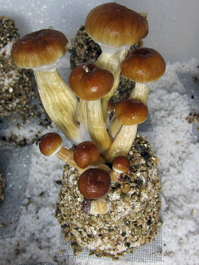

[◀返回](./home.md)

<mark> 行</mark>

# 糙米粉赛洛西宾蘑菇种植法 (BRF Tek)

|  | **[免责声明](./关于本站/观前提醒.md)：** *本指南仅供信息和教育用途。我们要不鼓励你触犯法律，也不对你的行为承担任何责任。* |
| --- | --- |

**本文介绍的是 BRF（Brown Rice Flour，糙米粉）种植法，也称为 PF Tek。该方法专为种植[古巴裸盖菇](../药物/赛洛西宾蘑菇.md)（Psilocybe cubensis）而设计，但也可能适用于[裸盖菇属](../药物/赛洛西宾蘑菇.md)中的类似蘑菇，如[墨西哥裸盖菇](../药物/赛洛西宾蘑菇.md)。此外，制作多个菌饼可以最大限度地降低污染风险，如果你更喜欢本指南中描述的[散装种植](#用散装基质稀释可选)，可以将成功的菌饼在后期进行稀释扩繁。**

| 赛洛辛 (Psilocin) 物质信息 | |
| --- | --- |
|  | |
| **通用名称** | *赛洛辛 (Psilocin), 4-HO-DMT, 4-OH-DMT* |
| **取代名称** | *4-Hydroxy-N,N-dimethyltryptamine* |
| **系统名称** | *3-[2-(Dimethylamino)ethyl]-1H-indol-4-ol* |
| **精神药效分类** | *[迷幻剂](./药物分类/迷幻剂.md)* |
| **化学分类** | *[色胺类物质](./药物分类/色胺类物质.md)* |

### 赛洛辛给药数据 (纯化学物质)

**警告：** 由于个体体重、耐受性、新陈代谢和个人敏感度的差异，请始终从低剂量开始。[参见负责任的用药部分](./负责任的用药索引页.md)。

**[给药途径](./给药途径.md)：[口服](./给药途径.md)**

| [剂量](./给药剂量.md) | |
| --- | --- |
| [阈值](./药物剂量分类.md#Threshold) | 5 mg |
| [轻微](./药物剂量分类.md#Light) | 10 - 15 mg |
| [中等](./药物剂量分类.md#Common) | 15 - 25 mg |
| [强烈](./药物剂量分类.md#Strong) | 25 - 40 mg |
| [严重](./药物剂量分类.md#Heavy) | 40 mg + |

| [时长](./药效时长.md) | |
| --- | --- |
| [总时长](./药效时长.md#Total) | 4 - 6 小时 |
| [药效发作](./药效时长.md#Onset) | 20 - 45 分钟 |
| [药效上升](./药效时长.md#Come_up) | 1.5 - 3 小时 |
| [药效达峰](./药效时长.md#Peak) | 2 - 3 小时 |
| [药效褪去](./药效时长.md#Offset) | 1.5 - 2 小时 |
| [药效残余](./药效时长.md#After_effects) | 4 - 24 小时 |

---

## 目录

* [1 材料和设备](#材料和设备)
* [2 步骤流程](#步骤流程)
    * [2.1 消毒](#消毒)
    * [2.2 制作菌饼](#制作菌饼)
    * [2.3 接种](#接种)
    * [2.4 培养](#培养)
    * [2.5 菌丝定植](#菌丝定植)
    * [2.6 用散装基质稀释（可选）](#用散装基质稀释可选)
    * [2.7 结原基/出菇蕾](#结原基出菇蕾)
    * [2.8 浸泡和滚涂](#浸泡和滚涂)
    * [2.9 出菇](#出菇)
    * [2.10 采摘](#采摘)
* [3 剂量、起效和持续时间](#剂量起效和持续时间)
* [4 准备工作](#准备工作)
* [5 另见](#另见)
* [6 外部链接](#外部链接)

### 材料和设备

* 蛭石 (Vermiculite)
* 珍珠岩 (Perlite)
* 水
* 糙米粉/黑麦粉
* 矮胖的广口玻璃罐
* 大碗
* 勺子
* 锡箔纸
* 压力锅 (高压锅)
* 孢子印
* 注射器
* 2个塑料储物箱
* 一个水族箱加热器
* 2个额外的备用罐子
* 毛巾
* 滤锅
* 1个带盖的大整理箱
* 电钻
* 喷雾瓶

用于散装基质（可选）

* 蛭石
* 椰糠 (Coco coir)
* 石膏 (Gypsum)

### 步骤流程

#### 消毒

在开始 BRF 种植法之前，需要采取灭菌措施。
操作台面以及设备和工具应尽可能保持无菌。

如果可能的话，应保持窗户打开，这有助于保持空气流通和相对清洁（译者注：原文如此，但在高污染环境下通常建议在静止空气箱或超净台中操作）。

应经常在操作区域喷洒消毒清洁喷雾，以确保没有灰尘或细菌污染罐子。
采取无菌操作至关重要，因为罐子非常容易被污染。

#### 制作菌饼

要知道需要多少蛭石、水和糙米粉，需要进行一点数学计算（但这并不复杂）。

填充一个 240ml 的罐子需要以下成分：

* 140ml 蛭石
* 40ml 糙米粉
* 20-30ml 水

要计算出所需的这些成分的总量，取决于罐子的数量以及罐子的容量。
例如，如果我们想使用 6 个 240ml 的罐子，每种成分都需要乘以 6。

污染是很常见的，所以如果你打算稍后用[散装基质稀释](#用散装基质稀释可选)你的 BRF 菌饼，而不是直接作为菌饼生长，明智的做法是制作至少 4 个菌饼。这样如果你有 50% 的罐子失败了，你仍然有 2 个罐子（400克），这足以在稍后用 800-1200 克散装基质稀释它们。

计算出每种成分的用量后，需要将蛭石和水混合，直到碗向一侧倾斜时水开始积聚。

然后，加入糙米粉。
混合物随后需要装入罐子中，顶部留出约半英寸（约1.3厘米）的空间，然后用干蛭石填满这部分空间（作为隔离层）。

需要在罐子顶部紧紧盖上 2 层锡箔纸，以免脱落。然后在上面非常松地盖上第 3 层锡箔纸。

罐子需要进一步灭菌，所以需要将它们放入压力锅中蒸煮约 20-30 分钟。罐子的盖子（或备用金属片）可以放在压力锅底部，以确保压力锅底部的罐子不会过热破裂。

孢子注射器

#### 接种

罐子冷却后，需要接种孢子。
使用注射器进行此操作，且注射器必须是无菌的。应使用手术刀将孢子印轻轻刮入无菌罐子或杯子中，然后加入 10ml 水。

使用注射器将水和孢子的混合物吸入注射器。如果孢子粘在罐底，请反复排空并重新填充注射器几次。这也有助于确保孢子与水充分混合。

取下罐子顶部的第 3 层锡箔纸，然后用注射器刺穿第 2 层锡箔纸的四个侧面。注入罐子的孢子数量并不太重要，但通常多一点更好，以确保罐子成功接种。一旦所有罐子都接种完毕，需要将第 3 层锡箔纸紧紧地盖回罐子上。

#### 培养

其中一个储物箱底部应放置一个水族箱加热器，然后加水至 1/3 高度。
水族箱加热器应设置为 27°C。
然后将第二个储物箱放入其中，使用备用罐子支撑第二个储物箱，使水族箱加热器不接触顶部储物箱的底部（制成一个恒温水浴箱）。
然后将接种好的罐子放入上层储物箱内。如果需要堆叠罐子，应使用硬纸板将它们隔开，因为罐子的底部不应直接压在下层罐子的锡箔纸上，这可能会导致锡箔纸松动，从而容易受到污染。
然后在箱子顶部盖上一条干净的毛巾以保持热量。

蓝以赛亚裸盖菇（Psilocybe cyanescens）的定植。

一个被污染的罐子。

#### 菌丝定植

3-5 天后，应该会出现定植的迹象。罐子里应该有白色的小斑点生长；这就是菌丝体，它最终将定植整个罐子。
如果在罐子里看到除白色（和棕色蛭石）以外的任何其他颜色，这意味着罐子已被污染并长了霉菌。下次进行此操作时需要采取更严格的无菌措施。

如果罐子已开始正常定植，则完全定植需要 2 到 6 周。
根据具体情况，定植时间可能从几天到一两个月不等。

影响定植速度的因素有：

* 室温
* 空气湿度
* 孢子的菌株
* 这一步需要耐心，但如果显示出定植迹象，整个罐子最终很可能会被定植。

#### 用散装基质稀释（可选）

将定植好的基质稀释到更大体积的散装基质中，可以显著增加后期的蘑菇产量。

准备散装基质。对于 2 个罐子（400克）的定植基质，按照 2:1 或 3:1 的比例添加目前的定植基质，混合：

| 定植基质:散装基质 比例 | 基质配方 | 水 |
| --- | --- | --- |
| 2:1 | 400克 蛭石 : 400克 椰糠 : 88克 石膏 | 2.9 升 |
| 3:1 | 540克 蛭石 : 540克 椰糠 : 120克 石膏 | 4.4 升 |

* 混合散装基质并将其放入塑料桶中。
* 烧开水。
* 将开水倒入桶中，并盖上盖子。
* 让混合物冷却至室温。如果还很热，**不要**进行下一步，因为这会杀死菌丝。
* 将定植好的基质与散装基质混合。
* 重新开始所有的[菌丝定植](#菌丝定植)过程。

#### 结原基/出菇蕾

当罐子完全定植后，应将其从培养箱中取出，置于室温下的直射阳光中（译者注：通常建议散射光，避免直射）。
5 天后应该开始在罐子里看到原基（Pins），但有时结原基可能发生在第 8 步期间。
（Pinning 是第一次看到蘑菇时的名称，因为它们非常非常小且细，像大头针一样。）

#### 浸泡和滚涂

5 天结束后，应将菌饼从罐子中取出，并在水龙头下冲洗，去掉任何多余的干蛭石。
然后将菌饼完全浸没（Dunk）在一大锅水中 24 小时。
24 小时后，需要将菌饼从水中取出，并在干蛭石中滚动（Roll），这有助于保持水分。
（Cakes/菌饼是蛭石和菌丝混合物离开罐子后的名称。）

#### 出菇

需要一个出菇室（Fruiting chamber），制作方法是在整理箱的所有 4 个侧面和盖子上钻多个孔（这有助于箱内的空气流动）。
将珍珠岩倒入滤锅中，用水彻底浸泡。珍珠岩浸泡后，应放入出菇室（大约需要 5-7 升，但根据整理箱的大小，珍珠岩的高度应约为 2-4 英寸）。

然后将菌饼放在出菇室内的珍珠岩上，下面垫一小块方形锡箔纸，以确保菌丝不会长入珍珠岩中。我不完全确定那样做是否是一件坏事（目前）……
当所有菌饼都放入后，应每天**至少**向箱内喷水三次。

如果在第 6 步期间没有发生结原基，它们应该在此步骤期间开始结原基，但这同样需要耐心，因为结原基有时需要一段时间。

现在它们已经完全长成并准备好采摘了。

#### 采摘

你应该在一两周内看到进展，甚至可能更短。
采摘的最佳时机通常是在菌幕破裂后（菌幕是连接菌柄和菌盖的薄膜）。
如果你看到菌饼上有一些变黑的原基，这些被称为流产菇（aborts）。它们仍然可以食用。它们只是没能长得足够快，但它们里面仍然含有赛洛西宾 ;)

### 剂量、起效和持续时间

*(注：以下数据适用于干燥的赛洛西宾蘑菇)*

* [阈值](./药物剂量分类.md#Threshold)：0.25 g
* [轻微](./药物剂量分类.md#Light)：0.25 – 2.5 g
* [中等](./药物剂量分类.md#Common)：2.5 - 5 g
* [强烈](./药物剂量分类.md#Strong)：5 g +
* [药效发作](./药效时长.md#Onset)：10 - 40 分钟

* [药效发作](./药效时长.md#Onset)：20 - 60 分钟（空腹吞服时）
* [总时长](./药效时长.md#Total)：2 - 6 小时
* [药效残余](./药效时长.md#After_effects)：长达 8 小时

### 准备工作

消除恶心和味道的最简单制备方法是将蘑菇制成巧克力棒。
这可以通过融化一小块标准尺寸的巧克力棒来完成。在巧克力融化时，需要将干蘑菇搅拌成细粉。
然后将蘑菇粉混入融化的巧克力中，混合物应留在模具中凝固并放入冰箱，以便巧克力定型。一旦巧克力定型，就可以享用美味的迷幻食品了。

更快的技术是将混合的蘑菇粉放入巧克力酱或果酱三明治中，因为这完全掩盖了味道，并大大减少了恶心感。

### 另见

* [负责任的用药索引页](./负责任的用药索引页.md)
* [赛洛西宾蘑菇](../药物/赛洛西宾蘑菇.md)
* [4-AcO-DMT](../药物/4-AcO-DMT.md)
* [教学索引页](./教学索引页.md)

### 外部链接

* [Enteogenic Mushrooms - philosophy of cultivation](http://www.en.psilosophy.info/psilosopedium)