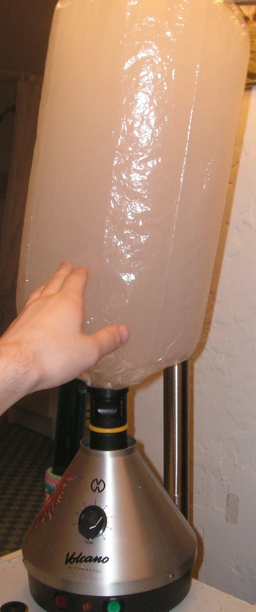
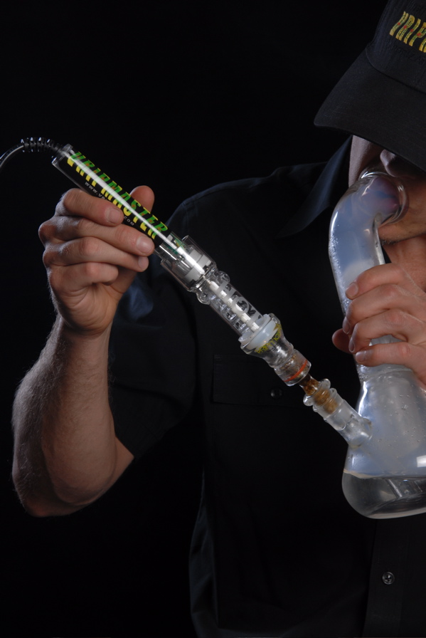
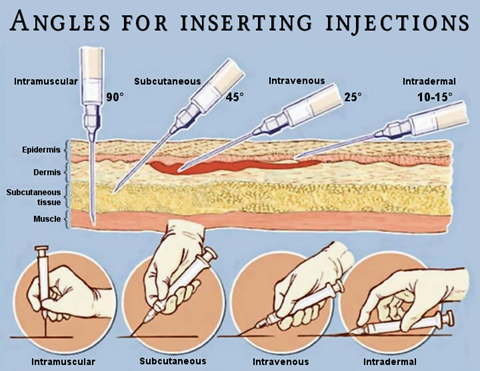
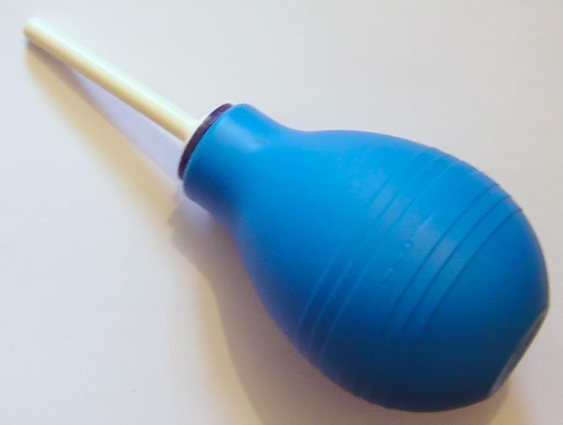
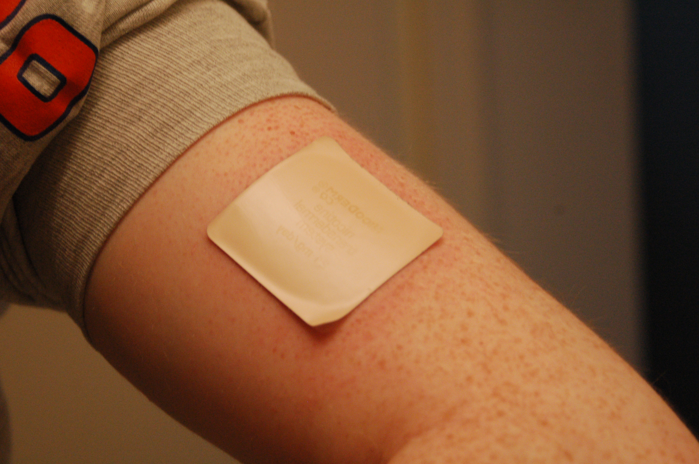

# 给药途径

[◀返回](index.md)

另见：[给药剂量](给药剂量.md)

**给药途径**（**Route of administration**）是将[精神活性物质](药物分类/index.md)输送到体内的方法。

物质给药的途径会极大地影响其效力、持续时间和[主观效应](../药效/index.md)。例如，许多物质在使用特定给药途径时更有效，而某些物质在特定途径下完全无效。

确定最佳给药途径高度依赖于所消耗的物质、其期望的持续时间和效力、副作用以及个人的舒适度。

静脉注射是最快的给药途径，导致血液浓度上升最快，其次是[抽吸](#抽吸)、栓剂（肛门或阴道插入）、[鼻吸](#鼻吸)和[口服](#口服)。[^1] 浓度的快速上升可以触发许多物质的强烈效应爆发。浓度的快速上升可以触发许多物质的快速[冲激感（Rush）](<https://en.wikipedia.org/wiki/Rush_(psychology)>)。

## 多途径危害物质

### 口服无效的色胺类物质

- 物质：[5-MeO-DMT](../药物/5-MeO-DMT.md)、[DMT](../药物/DMT.md)。
- 给药途径：
    - 口服：当这些物质被口服时，它们是无效的，因为被称为单胺氧化酶（MAO）的胃酶会分解它们。为了在口服时体验到效果，它们经常与[单胺氧化酶抑制剂](../酶抑制剂.md)（MAOIs）结合使用，后者可以防止这种分解。对于 [DMT](../药物/DMT.md)（或 [5-MeO-DMT](../药物/5-MeO-DMT.md)），这种组合被称为[药物死藤水](../药物/死藤水.md)（Pharmahuasca）。当MAOIs和DMT来自植物提取物时，它被称为[死藤水](../药物/死藤水.md)（Ayahuasca）。然而，重要的是要注意，MAOIs需要仔细考虑，因为当与某些药物类别结合时，它们可能是危险的，如果使用不当可能会导致危及生命的后果。
- 作为非预期的第二途径口服摄入：任何被吞咽的量都会在胃中经历快速的酶降解，使其失去活性。这可能会导致使用者之间的效应强度出现差异。由于被吞咽的物质导致的体验不明确可能会导致一种虚假的安全感，可能会导致使用者在随后的给药中增加剂量。然而，由于唾液分泌或鼻后滴漏的不可预测性，如果较少的物质在胃中被代谢，这可能导致意想不到的强效剂量。
    - 在口腔中（颊黏膜（唇下），舌下）：将物质含在口中会增加唾液分泌，导致其被吞咽并被胃酶失活。此外，许多生物碱具有苦味，使其难以保持在口中，引发吞咽反射。为了提高该途径的耐受性，建议使用安全的掩味剂。
    - [鼻吸](#鼻吸)：当这些物质经鼻给药时，它们可能沉积在鼻道上并滴入胃肠道。

## 口腔

_值得注意的是，据报道大多数物质通过舌下或颊黏膜途径给药时都非常苦且令人不快。_

### 口服

口服给药是大多数物质类别最常见的给药途径。这种途径允许物质通过胃和肠道内壁的血管吸收。起效通常比其他摄入方法慢，因为它必须经过肝脏的首过代谢（不同物质之间差异很大）。[^2] 此外，吸收和总持续时间通常也较长。

#### 风险

这种方法也更容易引起[恶心](../药效/恶心.md)和胃肠道不适。[^3] [^4]

广泛传闻 [25I-NBOMe](../药物/25I-NBOMe.md) 口服无效；然而，已经发生过通过口服给药导致的明显过量服用。

### 口腔黏膜

#### 颊黏膜

颊黏膜给药是指通过脸颊和牙龈吸收。

这种途径通常用于摄入强效迷幻剂，如 [25I-NBOMe](../药物/25I-NBOMe.md)、[DOM](../药物/DOM.md)、[LSD](../药物/LSD.md) 和其他分布在吸墨纸上的物质。强效的地下制造[苯二氮卓类物质](药物分类/苯二氮卓类物质.md)如[阿普唑仑](../药物/阿普唑仑.md)和[依替唑仑](../药物/依替唑仑.md)有时也分布在吸墨纸上。

像舌下吸收一样，该物质主要通过舌动脉吸收，但也通过牙龈内衬吸收。这种方法用于咀嚼植物叶子，如[恰特草](../药物/恰特草.md)、[卡痛](../药物/卡痛.md)、[致幻鼠尾草](../药物/鼠尾草.md)，有时还有[烟草](../药物/烟草.md)（鼻烟）。

|  |
| :--------------------------------------------------------: |
|   [蘸烟（Dipping tobacco）](../药物/蘸烟.md)直接放在口中   |

#### 舌下

舌下给药是指在舌头下吸收。[^5] 它是[麦角酰胺类](药物分类/迷幻剂.md)物质如 [LSD](../药物/LSD.md) 的常见给药途径。

这种途径导致物质通过位于舌头下的大舌动脉吸收，通常导致比口服给药更快的吸收。

它还规避了某些物质的首过代谢，这些物质可以通过舌下和颊黏膜给药吸收，但不能通过口服给药吸收（例如 [25x-NBOMe](药物分类/N-苄基苯乙胺类物质.md)、[25x-NBOH](../药物/25x-NBOH.md)）。

##### 风险

腐蚀性化合物，如含胺物质的游离碱形式，不应舌下使用，因为它们会严重灼伤口腔内部。

## 鼻腔

|                                                                                         |                                                                                                                               |
| --------------------------------------------------------------------------------------- | ----------------------------------------------------------------------------------------------------------------------------- |
|  | **[SARS-CoV-2：药物使用安全注意事项](https://auto.psy.is/cov19-safety/)** 避免共用鼻吸药物用具（吸管、纸币、「Kuripe」等）。 |

### 鼻喷雾

|                                                                                    |                                      |
| ---------------------------------------------------------------------------------- | ------------------------------------ |
|  | 鼻喷雾瓶的操作，用于通过鼻孔输送药物 |

「与液体喷雾相比，鼻粉制剂的给药与更大的感觉刺激有关。」[^6]

### 鼻吸

鼻吸（Insufflation，也称为「吸入」和「snorting」）是指通过鼻孔将物质引入鼻窦，规避首过代谢。

这是粉末形式物质非常常用的使用方法，特别是所谓的「街头毒品」，如[可卡因](../药物/可卡因.md)、[海洛因](../药物/海洛因.md)和[甲基苯丙胺](../药物/甲基苯丙胺.md)。一些使用者发现这种途径痛苦且不舒服，尽管某些物质比其他物质更容易鼻吸。

这种方法能够通过鼻窦中的黏膜和血管快速吸收。吸收和起效通常比口服快得多，因此，物质的感觉比口服强烈得多，通常作用时间更短。

鼻吸常见于[可卡因](../药物/可卡因.md)和[氯胺酮](../药物/氯胺酮.md)等物质。它也用于 Yopo 仪式，自行施用的管子被称为「Kuripe」，而吹管在巴西传统中被称为「Tepi」。鼻吸鼻烟形式的[烟草](../药物/烟草.md)直到 20 世纪初都是一种常见做法。

### 风险

> **警告：鼻腔给药**
>
> 鼻吸会导致鼻损伤、出血，并且——随着长期重复使用——对鼻子和周围组织造成不可逆转的损害。共用鼻吸设备（包括纸币）会增加传播血源性疾病（如丙型肝炎和艾滋病毒）的风险。
>
> **为了安全：** 使用前将物质制备成细粉，并始终使用自己干净的鼻吸工具。限制每次疗程中每个鼻孔的使用量，并在使用后30-60分钟内（在药效达峰后）用生理盐水冲洗鼻子，以清除任何残留物质并减少刺激。如果与他人在一起，不要让任何人强迫你使用。
>
> **或者：** 颊黏膜给药可用作伤害减少的选项。这包括将粉末（例如，包裹在一小块卫生纸中）放在嘴唇下，使其通过脸颊或牙龈吸收。这种方法避免了鼻损伤，尽管它可能有不同的效果和风险，例如对口腔或牙龈的刺激。
>
> 了解更多关于[鼻腔给药风险](#鼻吸)的信息。

鼻吸的短期副作用包括鼻塞，可能持续 24 小时。

频繁鼻吸某些物质会损害黏膜，引起出血，损害鼻孔的软骨和内衬，灼伤喉咙，并对鼻道和鼻窦区域造成其他创伤。[^7] [鼻中隔穿孔](https://en.wikipedia.org/wiki/Nasal_septum_perforation)是一种医疗状况，其中鼻中隔（分隔鼻腔的骨/软骨壁）出现孔洞或裂缝。

此外，共用鼻吸设备（鼻喷雾瓶、吸管、纸币、子弹等）与丙型肝炎的传播有关。（Bonkovsky 和 Mehta）在一项研究中，田纳西大学医学中心的研究人员警告说，其他血源性疾病，如艾滋病毒（HIV），也可能被传播。[^8] 饮酒会使人更难抵抗压力，并模糊做出安全选择的能力。你不仅可能会错过危险的迹象，如共用设备上的血迹，而且酒精会削弱你的免疫系统，使你更容易感染和传播病毒。

## 呼吸道

|                                                                                         |                                                                                                                             |
| --------------------------------------------------------------------------------------- | --------------------------------------------------------------------------------------------------------------------------- |
|  | **[SARS-CoV-2：药物使用安全注意事项](https://auto.psy.is/cov19-safety/)** 避免共用吸入药物用具（电子烟、卷烟、烟斗等）。 |

### 吸入剂

|  |  |
| ----------------------------------------------------------------------- | -------------------------------------------- |
| 食品级氧化亚氮气弹（右下），开气器（右上）和气球                        | 精选 Poppers                                 |

[吸入剂](../药物/吸入剂.md)可以通过两种主要方式通过呼吸系统输送：

- 口吸：这种方法涉及通过嘴吸入气体或蒸气。[氧化亚氮](../药物/氧化亚氮.md)是一个常见的例子。
- 鼻吸：这种方法涉及通过鼻子吸入气体、蒸气或挥发性液体。像 Poppers 这样的挥发性粘稠化合物通常以这种方式吸入。

吸入剂不需要外部热源来产生可以通过各种方法吸入的精神活性蒸气，具体取决于所使用的物质。吸入的物质吸收非常迅速，导致物质几乎瞬间吸收并通过血脑屏障。[^9]

#### 风险

[酒精吸入](https://en.wikipedia.org/wiki/Alcohol_inhalation)比饮酒更容易过量。

许多物质可以被吸入以达到意识改变的状态，然而，一些用于此目的的物质会产生高度负面的身体和神经毒性作用，包括经常在胶水中发现的溶剂如甲苯（见[甲苯毒性](https://en.wikipedia.org/wiki/Toluene_toxicity)），经常在指甲油中发现的丙酮，和汽油。[^10] 以及许多用于家庭或工业用途的气体，包括作为打火机气体补充剂出售的[丁烷](https://en.wikipedia.org/wiki/Butane)气。

直接从罐子或罐中吸入液化气会冻伤喉咙。

### 加热

为了将可卡因（底部塑料袋中）转化为快克（Crack），需要几种用品。图为小苏打（制作快克时常用的碱）、金属勺、茶蜡和打火机。勺子被放在热源上方，以便将可卡因「煮」成快克。

盐酸盐（HCl）形式的物质可以通过调节pH值转化为游离碱。例如，[可卡因](../药物/可卡因.md)在强烈加热时会分解，因此当物质被雾化时，通常使用可卡因的游离碱和碳酸氢盐，它们与盐酸盐相比沸点低得多，分别被称为可卡因碱和「快克」。

其他物质甚至在低热下也会分解，因此由于这个原因它们甚至不能被雾化。这些物质的例子包括[苯丙胺](../药物/苯丙胺.md)、[咖啡因](../药物/咖啡因.md)、[LSD](../药物/LSD.md) 和[赛洛西宾](../药物/赛洛西宾蘑菇.md)。此外，在[PiHKAL](PiHKAL.md)（_「我所认识和喜爱的苯乙胺」_）中没有一份报告是受试者抽吸或雾化苯乙胺化合物的。PiHKAL中值得注意的化合物包括 [MDMA](../药物/MDMA.md)，和「_神奇半打_」（[麦斯卡林](../药物/麦斯卡林.md)、[DOM](../药物/DOM.md)、[2C-B](../药物/2C-B.md)、[2C-E](../药物/2C-E.md)、[2C-T-2](../药物/2C-T-2.md)、[2C-T-7](../药物/2C-T-7.md)）。然而，一种在 PiHKAL 发布后合成的[取代苯乙胺](药物分类/苯乙胺类物质.md)，尽管非常有毒，[25I-NBOMe](../药物/25I-NBOMe.md)，已经被抽吸过。[^11]

#### 抽吸

|     |  |
| --------------------------------------------------- | -------------------------------------- |
| 卷制前的关节/大麻烟卷，左侧有一个手工制作的纸过滤嘴 | 一个Bong（水烟壶）                     |

抽吸物质是一种常见的消费方法，最常见的例子包括[大麻](../药物/四氢大麻酚（THC）.md)和[烟草](../药物/烟草.md)。抽吸产生的生物利用度较低，特别是如果物质被缓慢抽吸。

为了抽吸一种物质，直接热源（通常是火焰）直接施加到物质上，热源和物质之间没有屏障。物质的抽吸会导致物质几乎瞬间吸收并通过血脑屏障。[^2]

当物质被抽吸时，物质通过肺内支气管中的血管吸收。像鼻吸一样，持续时间减少，而其强度与口服吸收相比增加。

大麻通常通过呼吸道消费。关节、水烟壶和雾化器的平均THC转移率分别为 20 \~ 26%，[^12] 40%，[^12] 和 55 \~ 83%。[^13] 为了适当的气体或烟雾沉积，建议深吸一口气，然后保持 10 秒钟，以便气体或烟雾在肺部完全吸收（事实并非如此）。在研究中，受试者经常被指示遵循「10 秒规则」。[^14] [^15] 长时间屏气并不会显着增强吸入大麻烟雾的效果。[^16] [^17]

定期清洁的水烟壶可以消除可能导致从过敏到肺部感染等多种症状的酵母、真菌、细菌和病原体。[^18] [^19] [^20]

##### 重力烟枪

由大PET瓶和水桶制成的重力烟枪。

另见[重力烟枪（维基百科）](https://en.wikipedia.org/wiki/Gravity_bong)

##### 热刀

[Spots](<https://en.wikipedia.org/wiki/Spots_(cannabis)>)（也称为spotting, knifers, knife hits, knife tokes, dots, hot knives, kitchen tracking blades, 或 bladers）是指一种抽吸大麻的方法。[^21] 小块大麻被卷起（或简单地从较大的花蕾上撕下）形成spot。

**风险：** 使用热刀抽吸大麻的使用者比使用其他方法抽吸大麻更容易受到健康风险的影响。使用热刀抽吸大麻油或树脂被认为对肺部特别有害，因为烟雾是在如此高的温度下从油中出来的。[^22]

#### 雾化

|                      |        |
| ------------------------------------------------------ | ------------------------------------------ |
| 强制空气雾化器。可拆卸的气球（顶部）充满蒸气，然后吸入 | 用于通过水管输送蒸气的雾化加热棒和雾化室碗 |

雾化物质是一种常见的消费方法，最常见的例子包括[大麻](../药物/四氢大麻酚（THC）.md)和[尼古丁](../药物/尼古丁.md)，但也包括[海洛因](../药物/海洛因.md)和[快克-可卡因](../药物/可卡因.md)。雾化一种物质，特别是使用数字温控设备，允许更多的温度控制，因为火焰或热源不直接接触物质。

尽管许多药物，如[海洛因](../药物/海洛因.md)和[羟考酮](../药物/羟考酮.md)药丸俗称「抽吸」，但用于消费它们的过程是雾化。雾化物质会导致物质几乎瞬间吸收并通过血脑屏障。[^2]

当物质被雾化时，物质通过肺内支气管中的血管吸收。像鼻吸一样，持续时间减少，而其强度与口服吸收相比增加。

雾化通常与过去十年中流行的雾化笔有关，但不仅限于摄入来自电子热源的蒸气。

##### 风险

抽吸一种本应雾化的物质会导致热量爆发，可能会烧掉活性成分或点燃物质本身，这两者都是浪费和不正确的，这可能会导致剂量判断受损。

民族植物学家 Daniel Siebert 警告说，吸入热空气可能会刺激肺部并可能对肺部造成损害。热风枪产生的蒸气需要在吸入前通过水管或冷却室进行冷却。[^23]

重复使用未清洁的电子烟和共用电子烟可能会导致细菌性肺炎，[^24] [^25] 真菌性肺炎，[^26] 和病毒性肺炎。[^24]

##### 电子烟

| _(retouched).jpg>) |
| ----------------------------------------------------------------------------------------- |
| 第一代类似于烟草卷烟的电子烟，电池部分可以断开并使用USB充电器充电                         |

电子烟是一种模拟吸烟的电子设备。它由雾化器、电源（如电池）和容器（如烟弹或油仓）组成。使用者吸入的是蒸气而不是烟雾。因此，使用电子烟通常被称为「vaping」。雾化器是加热元件，将称为电子液体的液体溶液雾化。最常见的电子液体载体包括甘油（通常称为植物甘油或 VG）和丙二醇（通常称为 PG）。

###### 风险

[电子烟相关肺损伤](https://en.wikipedia.org/wiki/Vaping-associated_pulmonary_injury)（VAPI）是一个总称，用于描述与使用雾化产品有关的肺部疾病，可能是严重和危及生命的。

甘油长期以来被认为是一种安全的选择。然而，致癌物甲醛是已知的丙二醇和甘油蒸气降解产物。[^27]

##### The Machine

[The Machine (DMT专用烟具)](https://wiki.dmt-nexus.me/The_Machine)，利用一个有孔的玻璃瓶和瓶颈处的铝箔。The Machine 是为了更方便地抽吸 [DMT](../药物/DMT.md)而发明的，但它可以用于任何物质。

##### 追龙

追龙（Chasing the dragon），又名 foily，由于其不可预测的性质，可被认为是不负责任的药物使用。

[海洛因](../药物/海洛因.md)俗称「抽吸」，但实际上是雾化，通常使用锡箔纸作为物质和火源之间的屏障。热源可以保持在不同的距离作为温度控制。另一种版本是使用「不锈钢四分之一茶匙并在打火机上雾化，在倒置的漏斗中收集烟雾」。[^28]

###### 风险

通过「追龙」方法吸入雾化药物过量极难预测。这种技术不允许控制、标准化的剂量。即使是经验丰富的使用者也无法准确衡量有多少物质已被雾化、燃烧并最终吸入体内。

这种消费方法的不一致和不受监管的性质造成了一种虚假的安全感。一次看起来无害的剂量下次可能会致命，因为各种随机因素会影响实际摄入的药物量。

此外，使用像水烟壶这样专为更有效吸入而设计的专用抽吸设备，与简陋的铝箔方法相比，会显着增加消费量。当通过优化的设备完全雾化并吸入同样数量的药物时，原本在铝箔上抽吸可能耐受的量很容易变成过量。

缺乏剂量控制和低估效力的可能性使追龙成为一种本质上危险和不可预测的药物使用方式，始终存在意外过量的危险。

[\#The Machine](#The_Machine) 比「追龙」安全得多。

## 注射

[有些药物**不应**通过注射服用](安全注射指南.md#禁止注射的物质)：例如，注射用[可待因](../药物/可待因.md)仅可用于皮下或肌肉注射；静脉注射是禁忌的，因为这可能导致非免疫性肥大细胞脱颗粒并导致类过敏反应。

大约 0.1 mL 的溶液会在传统注射器的[鲁尔接头](https://en.wikipedia.org/wiki/Luer_taper)尖端和皮下注射针头的鲁尔接头适配器中损失。这可以通过在 1 mL 或 2 mL 注射器中分别额外添加10%或5%的物质来补偿，或者通过使用[低死腔注射器](https://en.wikipedia.org/wiki/Low_dead_space_syringe)。

|  |
| -------------------------------------- |
| 显示不同类型注射所需不同角度的图解     |

### 静脉注射

主条目：[安全注射指南 § 静脉注射](安全注射指南.md#IV_injection)

静脉注射（Intravenous administration）是指使用皮下注射针头将药物直接引入血液。这种方法具有起效非常短的好处，并且通过直接进入血液消除了吸收过程。[^2]: 然而，与其他给药方法相比，必须更加小心。

需要消毒的、未使用的针头和几乎没有掺假的高纯度物质，以避免损害循环系统。[^29]

在释放柱塞之前，确保储液槽中没有气泡。垂直握住注射器并用手指轻弹以将气泡释放到针头适配器，然后轻轻推动柱塞。不要担心[空气栓塞](https://en.wikipedia.org/wiki/Air_embolism)，据估计，以快速速率注入 50 \~ 500 mL 或更大体积的空气才可能致命。[^30] [^31]

这种途径与口服生物利用度差的物质密切相关，如[海洛因](../药物/海洛因.md)和[可卡因](../药物/可卡因.md)，但几乎可以用于任何纯物质。

### 肌肉注射

主条目：[安全注射指南 § 肌肉注射](安全注射指南.md#IM_injection)

肌肉注射（Intramuscular administration）是指使用皮下注射针头将药物注射到肌肉组织中。这种方法与静脉注射途径非常相似，但通常更痛苦，起效和吸收较慢。一些药物（如口服生物利用度低且静脉注射危险的[氯胺酮](../药物/氯胺酮.md)）通常通过这种途径给药。[^32] 像静脉注射一样，肌肉注射必须谨慎进行，使用消毒的未使用针头。

### 皮下注射

主条目：[安全注射指南 § 皮下注射](安全注射指南.md#SC_injection)

皮下注射（Subcutaneous administration，也称为 [skin popping](https://en.wikipedia.org/wiki/Skin_popping)）是指将药物注射到皮下组织，即真皮和表皮正下方的皮肤层。皮下给药在精神探索者中相对不常见，因为许多人没有接受过如何操作的培训，或者宁愿使用他们更熟悉的其他给药途径。

## 直肠给药

直肠给药，通常也称为 Boofing 或 Plugging，是许多物质最有效的给药方法之一。[^33] [^5] 与其他方法相比，吸收率非常高，起效通常非常短，通常强度更高，持续时间更短。

这是由于直肠中有大量动脉；因此，尽管存在社会耻辱感，直肠给药通常优于其他方法。

直肠给药可以涉及使用注射器或移液管将少量溶液插入直肠，或通过放置含有活性物质的药丸或明胶胶囊。后一种形式称为栓剂，当胃肠道不能支持口服药物时，这在医学中很常见。

|      |
| :--------------------------------------: |
| 用于将少量液体引入直肠的直肠「球形」注射器 |

### 风险

腐蚀性物质如 [4-FA](../药物/4-FA.md) 或[菲尼布特](../药物/菲尼布特.md)盐酸盐不应直肠给药，因为它们会灼伤直肠内部，导致相当大的胃肠道不适。

## 经皮给药

经皮给药通过皮肤输送活性成分以产生全身作用。这种方法用于各种药物，包括：

- **透皮贴剂：** 这些贴剂提供受控剂量的某些[兴奋剂](药物分类/兴奋剂.md)，如[尼古丁贴片](https://en.wikipedia.org/wiki/Nicotine_patch)和[咖啡因贴片](https://en.wikipedia.org/wiki/Caffeine_patch)。也存在用于[阿片类药物](药物分类/吗啡喃类物质.md)如[芬太尼](../药物/芬太尼.md)的贴剂。[^34]
- **皮下植入物：** 用于医疗或麻醉目的。

由于制造要求，这种途径通常不在非医疗或娱乐环境中观察到。

|                                                          |
| :-------------------------------------------------------------------------------: |
| 贴在左臂上的 21 mg 剂量[尼古丁贴片](https://en.wikipedia.org/wiki/Nicotine_patch) |

## 眼部给药

- **经结膜：** 最常见于医疗观察（例如滴眼液），但在药物滥用中很少发生，例如[LSD](../药物/LSD.md)和[海洛因](../药物/海洛因.md)。
- **眼内：** 由于眼睛结构脆弱且复杂，这种途径在非眼科医疗或娱乐环境中很少观察到。

### 风险

经结膜药物给药与角膜和结膜擦伤和出血有关。[^35]

## 另见

- [负责任的使用](../CONTRIBUTING.md) (Contextual link)
- [精神活性物质索引](药物分类/药物全索引.md)
- [药效时长](药效时长.md)
- [给药剂量](给药剂量.md)

## 外部链接

- [给药途径 (维基百科)](http://en.wikipedia.org/wiki/Route_of_administration 'wikipedia:Route of administration')

## 参考资料

[^1]: Goeders, Nicholas E. (2017). ["Intravenous and smoked methamphetamine produce different subjective and physiological effects in women"](https://www.researchgate.net/publication/312678025). _Drug and Alcohol Dependence_. **171**: e73. [doi](http://en.wikipedia.org/wiki/Digital_object_identifier 'wikipedia:Digital object identifier'):[10.1016/j.drugalcdep.2016.08.210](..//doi.org/10.1016%2Fj.drugalcdep.2016.08.210).

[^2]: Ohlsson, A., Lindgren, J.-E., Wahlen, A., Agurell, S., Hollister, L. E., Gillespie, H. K. (September 1980). ["Plasma delta-9-tetrahydrocannabinol concentrations and clinical effects after oral and intravenous administration and smoking"](http://doi.wiley.com/10.1038/clpt.1980.181). _Clinical Pharmacology and Therapeutics_. **28** (3): 409–416. [doi](http://en.wikipedia.org/wiki/Digital_object_identifier 'wikipedia:Digital object identifier'):[10.1038/clpt.1980.181](..//doi.org/10.1038%2Fclpt.1980.181). [ISSN](http://en.wikipedia.org/wiki/International_Standard_Serial_Number 'wikipedia:International Standard Serial Number') [0009-9236](..//www.worldcat.org/issn/0009-9236).

[^3]: Niv, D., Davidovich, S., Geller, E., Urca, G. (December 1988). "Analgesic and hyperalgesic effects of midazolam: dependence on route of administration". _Anesthesia and Analgesia_. **67** (12): 1169–1173. [ISSN](http://en.wikipedia.org/wiki/International_Standard_Serial_Number 'wikipedia:International Standard Serial Number') [0003-2999](..//www.worldcat.org/issn/0003-2999).

[^4]: Porter, W. R., [_Intraoral methods of using benzodiazepines_](https://patents.google.com/patent/US4229447/en)

[^5]: De Boer, A. G., De Leede, L. G. J., Breimer, D. D. (January 1984). ["DRUG ABSORPTION BY SUBLINGUAL AND RECTAL ROUTES"](https://linkinghub.elsevier.com/retrieve/pii/S000709121742397X). _British Journal of Anaesthesia_. **56** (1): 69–82. [doi](http://en.wikipedia.org/wiki/Digital_object_identifier 'wikipedia:Digital object identifier'):[10.1093/bja/56.1.69](..//doi.org/10.1093%2Fbja%2F56.1.69). [ISSN](http://en.wikipedia.org/wiki/International_Standard_Serial_Number 'wikipedia:International Standard Serial Number') [0007-0912](..//www.worldcat.org/issn/0007-0912).

[^6]: <https://pubmed.ncbi.nlm.nih.gov/35386013/>

[^7]: [_Ask Erowid : ID 41 : Is snorting MDMA worse for you than taking it orally?_](https://www.erowid.org/ask/ask.php?ID=41)

[^8]: [_Sharing Drug “Snorting Straws” Spreads Hepatitis C_](https://consumer.healthday.com/infectious-disease-information-21/hepatitis-news-373/sharing-drug-snorting-straws-spreads-hepatitis-c-713114.html), 2016

[^9]: <http://www.ct.gov/dds/lib/dds/edsupp/medadmin_recert_part_ii.pdf>

[^10]: Burbacher, T. M. (December 1993). ["Neurotoxic effects of gasoline and gasoline constituents"](https://www.ncbi.nlm.nih.gov/pmc/articles/PMC1520019/). _Environmental Health Perspectives_. **101** (Suppl 6): 133–141. [ISSN](http://en.wikipedia.org/wiki/International_Standard_Serial_Number 'wikipedia:International Standard Serial Number') [0091-6765](..//www.worldcat.org/issn/0091-6765).

[^11]: ["2C-I-NBOMe (25I) Effects"](https://www.erowid.org/chemicals/2ci_nbome/2ci_nbome_effects.shtml). Erowid.

[^12]: <https://www.ukcia.org/research/FactorsThatInfluenceBioavailability.pdf>

[^13]: Lanz, C., Mattsson, J., Soydaner, U., Brenneisen, R. (19 January 2016). ["Medicinal Cannabis: In Vitro Validation of Vaporizers for the Smoke-Free Inhalation of Cannabis"](https://www.ncbi.nlm.nih.gov/pmc/articles/PMC4718604/). _PLoS ONE_. **11** (1): e0147286. [doi](http://en.wikipedia.org/wiki/Digital_object_identifier 'wikipedia:Digital object identifier'):[10.1371/journal.pone.0147286](..//doi.org/10.1371%2Fjournal.pone.0147286). [ISSN](http://en.wikipedia.org/wiki/International_Standard_Serial_Number 'wikipedia:International Standard Serial Number') [1932-6203](..//www.worldcat.org/issn/1932-6203).

[^14]: Wallace, M. S., Marcotte, T. D., Umlauf, A., Gouaux, B., Atkinson, J. H. (July 2015). ["Efficacy of Inhaled Cannabis on Painful Diabetic Neuropathy"](https://www.ncbi.nlm.nih.gov/pmc/articles/PMC5152762/). _The journal of pain : official journal of the American Pain Society_. **16** (7): 616–627. [doi](http://en.wikipedia.org/wiki/Digital_object_identifier 'wikipedia:Digital object identifier'):[10.1016/j.jpain.2015.03.008](..//doi.org/10.1016%2Fj.jpain.2015.03.008). [ISSN](http://en.wikipedia.org/wiki/International_Standard_Serial_Number 'wikipedia:International Standard Serial Number') [1526-5900](..//www.worldcat.org/issn/1526-5900).

[^15]: Wilsey, B., Marcotte, T., Tsodikov, A., Millman, J., Bentley, H., Gouaux, B., Fishman, S. (June 2008). ["A Randomized, Placebo-Controlled, Crossover Trial of Cannabis Cigarettes in Neuropathic Pain"](https://www.ncbi.nlm.nih.gov/pmc/articles/PMC4968043/). _The journal of pain : official journal of the American Pain Society_. **9** (6): 506–521. [doi](http://en.wikipedia.org/wiki/Digital_object_identifier 'wikipedia:Digital object identifier'):[10.1016/j.jpain.2007.12.010](..//doi.org/10.1016%2Fj.jpain.2007.12.010). [ISSN](http://en.wikipedia.org/wiki/International_Standard_Serial_Number 'wikipedia:International Standard Serial Number') [1526-5900](..//www.worldcat.org/issn/1526-5900).

[^16]: Zacny, J. P., Chait, L. D. (1991). "Response to marijuana as a function of potency and breathhold duration". _Psychopharmacology_. **103** (2): 223–226. [doi](http://en.wikipedia.org/wiki/Digital_object_identifier 'wikipedia:Digital object identifier'):[10.1007/BF02244207](..//doi.org/10.1007%2FBF02244207). [ISSN](http://en.wikipedia.org/wiki/International_Standard_Serial_Number 'wikipedia:International Standard Serial Number') [0033-3158](..//www.worldcat.org/issn/0033-3158).

[^17]: Zacny, J. P., Chait, L. D. (June 1989). "Breathhold duration and response to marijuana smoke". _Pharmacology, Biochemistry, and Behavior_. **33** (2): 481–484. [doi](http://en.wikipedia.org/wiki/Digital_object_identifier 'wikipedia:Digital object identifier'):[10.1016/0091-3057(89)90534-0](..//doi.org/10.1016%2F0091-3057%2889%2990534-0). [ISSN](http://en.wikipedia.org/wiki/International_Standard_Serial_Number 'wikipedia:International Standard Serial Number') [0091-3057](..//www.worldcat.org/issn/0091-3057).

[^18]: [_Can You Get Sick From Dirty Bong Water?_](https://herb.co/learn/sick-dirty-bong-water/)

[^19]: <https://www.maryjanetokes.com/dirty-bong-the-dangers-of-using-one/>

[^20]: [_The Dangers of a Dirty Bong_](https://www.leafscience.com/2018/07/16/dangers-dirty-bong/), 2018

[^21]: Handbook of Pharmacy Education, Harmen R.J., 2001, Pg 169

[^22]: [Dope Tips II dope tips, reducing cannabis related harms, tips for safer use of cannabis use in nz, using marijuana](https://web.archive.org/web/20071027140016/http://www.healthaction.org.nz/Dope_Tips_II.htm)

[^23]: [_Ask Erowid : ID 3139 : Do vaporizers work with Salvia divinorum?_](https://www.erowid.org/ask/ask.php?ID=3139)

[^24]: Kooragayalu, S; El-Zarif, S; Jariwala, S. [doi](http://en.wikipedia.org/wiki/Digital_object_identifier 'wikipedia:Digital object identifier'):[10.1016/j.rmcr.2020.100997](..//doi.org/10.1016%2Fj.rmcr.2020.100997). [PMC](http://en.wikipedia.org/wiki/PubMed_Central 'wikipedia:PubMed Central') [6997893](..//www.ncbi.nlm.nih.gov/pmc/articles/PMC6997893) [PMID](http://en.wikipedia.org/wiki/PubMed_Identifier 'wikipedia:PubMed Identifier') [32042584](..//www.ncbi.nlm.nih.gov/pubmed/32042584) <//www.ncbi.nlm.nih.gov/pmc/articles/PMC6997893>. Missing or empty `|title=`

[^25]: ["Vaping changes oral microbiome and raises infection risk"](https://www.medicalnewstoday.com/articles/vaping-changes-oral-microbiome-and-raises-infection-risk). *www.medicalnewstoday.com* (in English). 14 March 2020.

[^26]: Mughal, Mohsin Sheraz; Dalmacion, Denise Lauren V.; Mirza, Hasan Mahmood; Kaur, Ikwinder Preet; Dela Cruz, Maria Amanda; Kramer, Violet E. (1 January 2020). ["E-cigarette or vaping product use associated lung injury, (EVALI) - A diagnosis of exclusion"](https://www.sciencedirect.com/science/article/pii/S2213007120303889). _Respiratory Medicine Case Reports_ (in English). p. 101174. [doi](http://en.wikipedia.org/wiki/Digital_object_identifier 'wikipedia:Digital object identifier'):[10.1016/j.rmcr.2020.101174](..//doi.org/10.1016%2Fj.rmcr.2020.101174).

[^27]: Lestari, Kusuma S.; Humairo, Mika Vernicia; Agustina, Ukik (July 11, 2018). ["Formaldehyde Vapor Concentration in Electronic Cigarettes and Health Complaints of Electronic Cigarettes Smokers in Indonesia"](..//www.ncbi.nlm.nih.gov/pmc/articles/PMC6076960). _Journal of Environmental and Public Health_. **2018**: 1–6. [doi](http://en.wikipedia.org/wiki/Digital_object_identifier 'wikipedia:Digital object identifier'):[10.1155/2018/9013430](..//doi.org/10.1155%2F2018%2F9013430). [ISSN](http://en.wikipedia.org/wiki/International_Standard_Serial_Number 'wikipedia:International Standard Serial Number') [1687-9805](..//www.worldcat.org/issn/1687-9805). [PMC](http://en.wikipedia.org/wiki/PubMed_Central 'wikipedia:PubMed Central') [6076960](..//www.ncbi.nlm.nih.gov/pmc/articles/PMC6076960). [PMID](http://en.wikipedia.org/wiki/PubMed_Identifier 'wikipedia:PubMed Identifier') [30105059](..//www.ncbi.nlm.nih.gov/pubmed/30105059).

[^28]: ["Erowid Online Books : "TIHKAL" - #38 5-MEO-DMT"](http://www.erowid.org/library/books_online/tihkal/tihkal38.shtml). *www.erowid.org*.

[^29]: Evans, S. M., Cone, E. J., Henningfield, J. E. (1 December 1996). ["Arterial and venous cocaine plasma concentrations in humans: relationship to route of administration, cardiovascular effects and subjective effects"](https://jpet.aspetjournals.org/content/279/3/1345). _Journal of Pharmacology and Experimental Therapeutics_. **279** (3): 1345–1356. [ISSN](http://en.wikipedia.org/wiki/International_Standard_Serial_Number 'wikipedia:International Standard Serial Number') [0022-3565](..//www.worldcat.org/issn/0022-3565).

[^30]: <http://www.ajol.info/index.php/sajr/article/viewFile/34461/6388>. Missing or empty `|title=`

[^31]: Gordy S, Rowell S (January 2013). ["Vascular air embolism"](..//www.ncbi.nlm.nih.gov/pmc/articles/PMC3665124). _International Journal of Critical Illness and Injury Science_. **3** (1): 73–76. [doi](http://en.wikipedia.org/wiki/Digital_object_identifier 'wikipedia:Digital object identifier'):[10.4103/2229-5151.109428](..//doi.org/10.4103%2F2229-5151.109428). [PMC](http://en.wikipedia.org/wiki/PubMed_Central 'wikipedia:PubMed Central') [3665124](..//www.ncbi.nlm.nih.gov/pmc/articles/PMC3665124). [PMID](http://en.wikipedia.org/wiki/PubMed_Identifier 'wikipedia:PubMed Identifier') [23724390](..//www.ncbi.nlm.nih.gov/pubmed/23724390).

[^32]: Craven, R. (December 2007). ["Ketamine"](https://onlinelibrary.wiley.com/doi/10.1111/j.1365-2044.2007.05298.x). _Anaesthesia_. **62** (s1): 48–53. [doi](http://en.wikipedia.org/wiki/Digital_object_identifier 'wikipedia:Digital object identifier'):[10.1111/j.1365-2044.2007.05298.x](..//doi.org/10.1111%2Fj.1365-2044.2007.05298.x). [ISSN](http://en.wikipedia.org/wiki/International_Standard_Serial_Number 'wikipedia:International Standard Serial Number') [0003-2409](..//www.worldcat.org/issn/0003-2409).

[^33]: Aungst, B. J., Rogers, N. J., Shefter, E. (1 January 1988). ["Comparison of nasal, rectal, buccal, sublingual and intramuscular insulin efficacy and the effects of a bile salt absorption promoter"](https://jpet.aspetjournals.org/content/244/1/23). _Journal of Pharmacology and Experimental Therapeutics_. **244** (1): 23–27. [ISSN](http://en.wikipedia.org/wiki/International_Standard_Serial_Number 'wikipedia:International Standard Serial Number') [0022-3565](..//www.worldcat.org/issn/0022-3565).

[^34]: [_Fentanyl Transdermal Patch: MedlinePlus Drug Information_](https://medlineplus.gov/druginfo/meds/a601202.html)

[^35]: Lo D, Cobbs L, Chua M, Young J, Haberman ID, Modi Y. "Eye Dropping"-A Case Report of Transconjunctival Lysergic Acid Diethylamide Drug Abuse. Cornea. 2018 Oct;37(10):1324-1325. PMID: 30004961. doi: 10.1097/ICO.0000000000001692.
