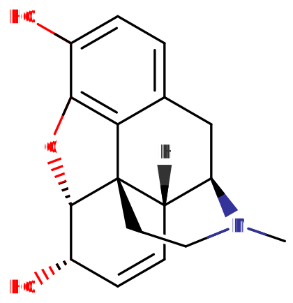

[◀返回](./home.md)

# 取代吗啡喃类物质

<mark> 不错哦，但是有一个错误的链接，此外链接有误，不过是prompt的问题，我应该告知ai它翻译的篇目所处的位置的</mark>

吗啡喃分子的通用结构

|  | **这是一篇[小作品](../../文档/关于本站/FOW规划及规范.md)。** *因此，它可能包含不完整或错误的信息。您可以协助[扩充它](https://psychonautwiki.org/w/index.php?title=Substituted_morphinans&action=edit)。* |
| --- | --- |

**吗啡喃类物质（Morphinans）** 是一类[精神活性药物](../文档/药物分类/home.md)，其中包括[阿片类](../文档/药物分类/抑制剂.md)[镇痛药](../../药效/镇痛.md)、镇咳药和[解离性](../文档/药物分类/解离剂.md)[致幻剂](../文档/药物分类/致幻剂.md)等。

## 化学

吗啡喃类物质由吗啡喃分子构成，其编号的碳原子上连接有不同的官能团。吗啡喃由一个 1-苄基异喹啉骨架和两个额外的闭环组成。它具有三个苯环（其中两个部分不饱和）以及一个哌啶环。它可以在 R3 和 R6 位置进行各种取代，通常在 RN 位置被甲基取代，在 R4 和 R5 位置通过醚键连接，从而形成具有不同效力、亲和力、功效和半衰期的产物。这是一个非常灵活的分子，具有五个手性中心，导致键的配置有很多种可能性。

## 药理学

吗啡喃类是一个庞大的化学类别，其中的化合物具有不同的药理作用。具有活性的吗啡喃衍生物通常作用于 [NMDA 受体](../../精神药理学/谷氨酸.md)、[μ-阿片受体](../../精神药理学/受体蛋白.md)以及 σ1 和 σ2 西格玛受体。

## 取代吗啡喃类物质列表

| **化合物** | **R3** | **R4** | **R5** | **R6** | **R7** | **R8** | **R14** | **R17** | **结构** |
| --- | --- | --- | --- | --- | --- | --- | --- | --- | --- |
| 吗啡喃 | H | H | H | H | H | H | H | H |  |
| [吗啡](../../药物/吗啡.md) | OH | O- | - | OH | - | - | H | CH3 |  |
| [可待因](../../药物/可待因.md) | OCH3 | O- | - | OH | - | - | H | CH3 |  |
| [乙基吗啡](../../药物/乙基吗啡.md) | OCH2CH3 | O- | - | OH | - | - | H | CH3 |  |
| [海洛因](../../药物/海洛因.md) | OCOCH3 | O- | - | OCOCH3 | - | - | H | CH3 |  |
| [纳洛酮](../../药物/纳洛酮.md) | OH | O- | - | =O | - | - | OH | CH2CH=CH2 |  |
| [二氢脱氧吗啡](../../药物/二氢脱氧吗啡.md) | OH | O- | - | H | H | H | H | CH3 |  |
| [氢吗啡酮](../../药物/氢吗啡酮.md) | OH | O- | - | =O | H | H | H | CH3 |  |
| [氢可酮](../../药物/氢可酮.md) | OCH3 | O- | - | =O | H | H | H | CH3 |  |
| [二氢可待因](../../药物/二氢可待因.md) | OCH3 | O- | - | OH | H | H | H | CH3 |  |
| [羟考酮](../../药物/羟考酮.md) | OCH3 | O- | - | =O | H | H | OH | CH3 |  |
| [羟吗啡酮](../../药物/羟吗啡酮.md) | OH | O- | - | =O | H | H | OH | CH3 |  |
| [丁丙诺啡](../../药物/丁丙诺啡.md) | OH | O- | - | (CH2-)OCH3 | C(OH)(CH3)C(CH3)3 | H | CH2- | CH2C3H5 |  |
| [右羟吗喃](../../药物/右羟吗喃.md) | OH | H | H | H | H | H | H | CH3 |  |
| [右美沙芬](../../药物/右美沙芬.md) | OCH3 | H | H | H | H | H | H | CH3 |  |

## 另见

*   [伤害减少措施](../../文档/关于本站/观前提醒.md)
*   [阿片类药物](../../药物分类/抑制剂.md)
*   [解离剂](../../药物分类/解离剂.md)

## 外部链接

*   [Morphinan (Wikipedia)](https://en.wikipedia.org/wiki/Morphinan)

## 参考文献

|  | **本文引用了不足的参考文献。** *您可以协助[添加一些](https://psychonautwiki.org/w/index.php?title=Substituted_morphinans&action=edit)。* |
| --- | --- |