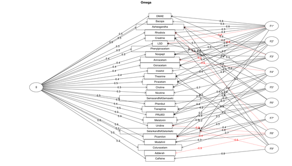

[◀返回](./home.md)

# 益智药

<mark> 不错，整个链接符合规范，章节的链接也翻译正确了。</mark>

[2016年调查](http://slatestarcodex.com/2016/03/01/2016-nootropics-survey-results/)中益智药评级的[因子分析](https://en.wikipedia.org/wiki/Factor_analysis)

**益智药**（Nootropics，也称为**聪明药**、**神经增强剂**和**认知增强剂**）是据称可以改善健康个体的认知功能（如记忆力、动力、注意力集中）的物质。[\[1\]](#cite_note-1)[\[2\]](#cite_note-2) 益智药被认为通过改变大脑神经化学物质（即神经递质、酶和激素）的可用性、改善大脑的氧气供应或刺激神经生长来起作用。\[*[来源请求]*\]

*nootropic* 一词是由罗马尼亚心理学家和化学家 Corneliu E. Giurgea 在1972年创造的，[\[3\]](#cite_note-isbn0-06-088473-8-3)[\[4\]](#cite_note-pmid4541214-4) 源自希腊语 νοῦς (*nous*)，意为“心智”，和 τρέπειν (*trepein*)，意为弯曲或转向。[\[5\]](#cite_note-5) Giurgea 博士提出了以下标准来确定一种物质是否符合“益智药”的描述：

*   增强学习和记忆功能
*   当旨在破坏习得行为的条件（例如施用遗忘剂）出现时，能改善习得行为
*   必须具有神经保护作用
*   必须具有极低的毒性，几乎没有副作用

然而，该术语现在已经获得了一种通俗的含义，并不一定要求满足所有这些标准。

## 目录

* [1 类别](#类别)
* [2 主观效应](#主观效应)
* [3 例子](#例子)
    + [3.1 拉西坦类](#拉西坦类)
    + [3.2 莫达菲尼类](#莫达菲尼类)
    + [3.3 营养补剂](#营养补剂)
    + [3.4 安帕金类](#安帕金类)
    + [3.5 其他](#其他)
* [4 另见](#另见)
* [5 外部链接](#外部链接)
    + [5.1 讨论](#讨论)
* [6 参考文献](#参考文献)

## 类别

Noopept 分子结构

吡拉西坦化学结构

益智药有几个类别，也有不符合特定分类的化合物。其中最著名和最常用的是拉西坦类（racetams），其原型是[吡拉西坦](../../药物/吡拉西坦.md)（piracetam），它是1964年被认可的第一种益智药。拉西坦类药物都共享一个2-吡咯烷酮环。其他拉西坦类益智药包括[阿尼西坦](../../药物/阿尼西坦.md)（aniracetam）、[奥拉西坦](../../药物/奥拉西坦.md)（oxiracetam）、[苯基吡拉西坦](../../药物/苯基吡拉西坦.md)（phenylpiracetam）和[考拉西坦](../../药物/考拉西坦.md)（coluracetam）。

第二类益智化合物是合成肽，最常见的例子是[Noopept](../../药物/Noopept.md)。虽然不是拉西坦类，但由于作用模式相似，Noopept 通常与拉西坦类归为一组。

由于益智药科学尚处于起步阶段，还有一些新合成的化合物，如 IDRA-21、PRL-8-53、unifiram、sunifiram 等，它们并不完全符合某个结构类别。此外，其中一些化合物的副作用、剂量、危险相互作用等实际上是未知的。

## 主观效应

***免责声明：**下列效应引用自[***主观效应索引***](../../关于本站/科学信息索引页.md) (**SEI**)，这是一个基于传闻中的用户报告和 PsychonautWiki 贡献者个人分析的开放研究文献。因此，应以健康的怀疑态度看待这些内容。*

*同样值得注意的是，这些效应并不一定会以可预测或可靠的方式发生，尽管较高的剂量更可能诱发全方位的效应。同样，**不良反应**随着剂量的增加而变得越来越可能，可能包括**成瘾、严重伤害或死亡*** ☠。这些效应在下面有单独的条目进行列出和定义：

*   **[思维加速](../../药效/认知效应.md)**
*   **[思维连通性](../../药效/认知效应.md)**
*   **[专注度增强](../../药效/认知效应.md)**
*   **[动力增强](../../药效/认知效应.md)**
*   **[记忆力增强](../../药效/认知效应.md)**
*   **[刺激](../../药效/刺激.md)**
*   **[焦虑抑制](../../药效/认知效应.md)**
*   **[清醒度](../../药效/刺激.md)**

## 例子

### [拉西坦类](../../药物分类/益智药.md)

*   [阿尼西坦](../../药物/阿尼西坦.md)
*   [考拉西坦](../../药物/考拉西坦.md)
*   Fasoracetam
*   Nefiracetam
*   [奥拉西坦](../../药物/奥拉西坦.md)
*   [苯基吡拉西坦](../../药物/苯基吡拉西坦.md)
*   [吡拉西坦](../../药物/吡拉西坦.md)
*   [普拉西坦](../../药物/普拉西坦.md)

### 莫达菲尼类

*   [阿德拉菲尼](../../药物/阿德拉菲尼.md)
*   [阿莫达菲尼](../../药物/阿莫达菲尼.md)
*   [N-甲基双氟莫达菲尼](../../药物/N-甲基双氟莫达菲尼.md)
*   [莫达菲尼](../../药物/莫达菲尼.md)

### 营养补剂

*   [甘油磷酸胆碱 (Alpha-GPC)](../../药物/甘油磷酸胆碱.md)
*   [酒石酸胆碱](../../药物/酒石酸胆碱.md)
*   [胞二磷胆碱](../../药物/胞二磷胆碱.md)
*   [肌酸](../../药物/肌酸.md)
*   [S-腺苷蛋氨酸 (SAM-e)](../../药物/S-腺苷蛋氨酸.md)
*   [酪氨酸](../../药物/酪氨酸.md)

### 安帕金类

*   IDRA-21

### 其他

*   [5-羟色氨酸 (5-HTP)](../../药物/5-羟色氨酸.md)
*   槟榔碱 (Arecoline)
*   南非醉伽 (Ashwagandha)
*   [溴曼烷](../../药物/溴曼烷.md)
*   [咖啡因](../../药物/咖啡因.md)
*   可替宁 (Cotinine)
*   [加兰他敏](../../药物/加兰他敏.md)
*   石杉碱甲 (Huperzine A)
*   [L-茶氨酸](../../药物/L-茶氨酸.md)
*   [美金刚](../../药物/美金刚.md)
*   [N-乙酰半胱氨酸](../../药物/N-乙酰半胱氨酸.md)
*   [尼古丁](../../药物/烟草.md)
*   [Noopept](../../药物/Noopept.md)
*   [普罗林烷](../../药物/普罗林烷.md)
*   [苦茶碱](../../药物/苦茶碱.md)
*   [噻奈普汀](../../药物/噻奈普汀.md)
*   [甘油磷酸胆碱 (Alpha-GPC)](../../药物/甘油磷酸胆碱.md)

## 另见

*   [负责任的用药](../../关于本站/负责任的用药索引页.md)
*   [精神活性物质索引](../../文档/药物分类/药物全索引.md)
*   [共情剂](../../文档/药物分类/共情剂.md)
*   [兴奋剂](../../文档/药物分类/兴奋剂.md)
*   [抑制剂](../../文档/药物分类/抑制剂.md)
*   [迷幻剂](../../文档/药物分类/迷幻剂.md)

## 外部链接

*   [Nootropic (Wikipedia)](https://en.wikipedia.org/wiki/Nootropic)
*   [Nootropics / Smart Drugs (Erowid)](https://www.erowid.org/smarts/)
*   [Nootropic (Examine.com)](https://examine.com/supplements/nootropic/)

### 讨论

*   [/r/Nootropics (Reddit)](https://www.reddit.com/r/Nootropics/)

## 参考文献

1.  [↑](#cite_ref-1) Frati, P., Kyriakou, C., Rio, A. D., Marinelli, E., Vergallo, G. M., Zaami, S., Busardo, F. P. ["Smart Drugs and Synthetic Androgens for Cognitive and Physical Enhancement: Revolving Doors of Cosmetic Neurology"](https://www.eurekaselect.com/article/63921). *Current Neuropharmacology*. **13** (1\): 5–11\.
2.  [↑](#cite_ref-2) Lanni, C., Lenzken, S. C., Pascale, A., Del Vecchio, I., Racchi, M., Pistoia, F., Govoni, S. (1 March 2008\). ["Cognition enhancers between treating and doping the mind"](https://www.sciencedirect.com/science/article/pii/S1043661808000273). *Pharmacological Research*. **57** (3\): 196–213\. [doi](http://en.wikipedia.org/wiki/Digital_object_identifier "wikipedia:Digital object identifier"):[10\.1016/j.phrs.2008\.02\.004](//doi.org/10.1016%2Fj.phrs.2008.02.004). [ISSN](http://en.wikipedia.org/wiki/International_Standard_Serial_Number "wikipedia:International Standard Serial Number") [1043\-6618](//www.worldcat.org/issn/1043-6618).
3.  [↑](#cite_ref-isbn0-06-088473-8_3-0) Gazzaniga, Michael S. (2006\). *The Ethical Brain: The Science of Our Moral Dilemmas (P.S.)*. New York, N.Y: Harper Perennial. p. 184\. [ISBN](http://en.wikipedia.org/wiki/International_Standard_Book_Number "wikipedia:International Standard Book Number") [0\-06\-088473\-8](http://en.wikipedia.org/wiki/Special:BookSources/0-06-088473-8 "wikipedia:Special:BookSources/0-06-088473-8").
4.  [↑](#cite_ref-pmid4541214_4-0) Giurgea C (1972\). "\[Pharmacology of integrative activity of the brain. Attempt at nootropic concept in psychopharmacology\] ("Vers une pharmacologie de l'active integrative du cerveau: Tentative du concept nootrope en psychopharmacologie")". *Actual Pharmacol (Paris)* (in French). **25**: 115–56\. [PMID](http://en.wikipedia.org/wiki/PubMed_Identifier "wikipedia:PubMed Identifier") [4541214](//www.ncbi.nlm.nih.gov/pubmed/4541214).
5.  [↑](#cite_ref-5) ["nootropic \| Definition of nootropic in English by Oxford Dictionaries"](https://en.oxforddictionaries.com/definition/nootropic). *Oxford Dictionaries \| English*. Retrieved 2018\-07\-19.