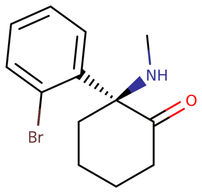
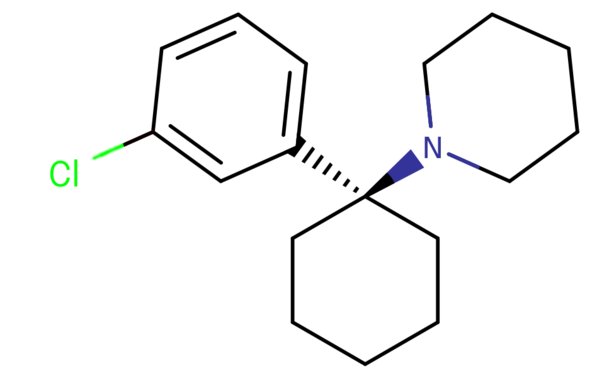
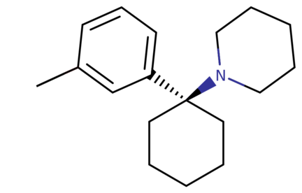

[◀返回](./home.md)

# 芳基环己胺类物质 (Arylcyclohexylamines)

<mark> 还行</mark>

芳基环己胺分子的取代结构。这里的芳基由苯环组成。

|  | **本文是[小作品](../../关于本站/小作品.md)。** 因此，它可能包含不完整或错误的信息。你可以通过[扩充它](../../关于本站/参与贡献.md)来提供帮助。 |
| --- | --- |

**芳基环己胺类物质**是指一类通常产生[解离](../../文档/药物分类/解离剂.md)、[麻醉](../../药效/镇痛.md)和[迷幻](../../文档/药物分类/迷幻剂.md)效应的化合物。

目录
--------

* [1 化学](#化学)
* [2 药理学](#药理学)
* [3 取代芳基环己胺类物质列表](#取代芳基环己胺类物质列表)
* [4 法律地位](#法律地位)
* [5 另见](#另见)
* [6 外部链接](#外部链接)
* [7 参考文献](#参考文献)

化学
---------

芳基环己胺由一个环己胺单元和一个芳基部分连接组成。芳基位于胺的同碳（双取代）位置。在最简单的情况下，芳基部分通常是一个苯环，有时带有额外的取代基。胺通常不是伯胺；仲胺（如甲胺或乙胺）或叔环烷基胺（如哌啶和吡咯烷）是最常见的 *N*-取代基。

药理学
------------

芳基环己胺类物质被认为主要通过[拮抗](../../文档/受体拮抗剂.md)[NMDA受体](../../文档/药物分类/NMDA受体拮抗剂类药物.md)来产生效应。[\[1\]](#cite_note-1) NMDA受体的拮抗作用赋予了麻醉、[抗惊厥](../../文档/药物分类/抗惊厥药.md)（预防癫痫发作）和[解离](../../文档/药物分类/解离剂.md)效应。与流行的看法相反，大多数芳基环己胺类物质并不会显著抑制[多巴胺](../../文档/多巴胺.md)的再摄取或激动 μ-阿片受体。

*氯胺酮、PCP及其类似物的代表性 pKi 值。 – pKi ± SD, (Ki, nM)[\[2\]](#cite_note-2)*

| 化合物 | NMDA[\[3\]](#cite_note-3) | SERT[\[4\]](#cite_note-4) | NET[\[5\]](#cite_note-5) | Sigma1 | Sigma2 |
| --- | --- | --- | --- | --- | --- |
| [氯胺酮](../../药物/氯胺酮.md) | 6.18±0.07 (659) | - | - | - | - |
| [苯环利定](../../药物/PCP.md) (PCP) | 7.23±0.07 (59) | 5.65±0.05 (2234) | - | - | 6.82±0.09 (136) |
| [甲氧西他明](../../药物/甲氧西他明.md) (MXE) | 6.59±0.06 (259) | 6.32±0.05 (481) | - | - | - |
| [4-MeO-PCP](../../药物/4-MeO-PCP.md) | 6.39±0.06 (404) | 6.07±0.05 (844) | 6.1±0.1 (713) | 6.5±0.1 (296) | 7.93±0.08 (143) |
| [3-MeO-PCP](../../药物/3-MeO-PCP.md) | 7.69±0.08 (20) | 6.7±0.1 (216) | - | 7.4±0.1 (42) | - |
| [3-MeO-PCE](../../药物/3-MeO-PCE.md) | 7.22±0.08 (61) | 6.9±0.06 (115) | - | 5.3±0.1 (4519) | 6.31±0.1 (525) |

取代芳基环己胺类物质列表
----------------------------------------

| **化合物** | **RN1** | **RN2** | **R2** | **R3** | **R4** | **R2'** | **结构** |
| --- | --- | --- | --- | --- | --- | --- | --- |
| 2-BDCK | Methyl | H | Br | H | H | Ketone |  |
| [2-FDCK](../../药物/2-FDCK.md) | Methyl | H | F | H | H | Ketone |  |
| 2-TFMDCK | Methyl | H | CF3 | H | H | Ketone |  |
| 3,4-MD-PCP | CH2CH2CH2- | CH2CH2- | H | OCH- | O- | H |  |
| [O-PCE](../../药物/O-PCE.md) | Ethyl | H | H | H | H | Ketone |  |
| [去氯氯胺酮](../../药物/Deschloroketamine.md) (DCK, O-PCM) | Methyl | H | H | H | H | Ketone |  |
| 3-Cl-PCP | CH2CH2CH2- | CH2CH2- | H | Cl | H | H |  |
| 3-F-PCP | CH2CH2CH2- | CH2CH2- | H | F | H | H |  |
| [3-HO-PCE](../../药物/3-HO-PCE.md) | Ethyl | H | H | Hydoxy | H | H |  |
| [3-HO-PCP](../../药物/3-HO-PCP.md) | CH2CH2CH2- | CH2CH2- | H | Hydroxy | H | H |  |
| 3-Me-PCE | Ethyl | H | H | Methyl | H | H |  |
| 3-Me-PCP | CH2CH2CH2- | CH2CH2- | H | Methyl | H | H |  |
| 3-Me-PCPy | CH2CH2- | CH2CH2- | H | Methyl | H | H |  |
| [3-MeO-PCE](../../药物/3-MeO-PCE.md) | Ethyl | H | H | Methoxy | H | H |  |
| [3-MeO-PCMo](../../药物/3-MeO-PCMo.md) | CH2CH2O- | CH2CH2- | H | Methoxy | H | H |  |
| [3-MeO-PCP](../../药物/3-MeO-PCP.md) | CH2CH2CH2- | CH2CH2- | H | Methoxy | H | H |  |
| [4-MeO-PCP](../../药物/4-MeO-PCP.md) | CH2CH2CH2- | CH2CH2- | H | H | Methoxy | H |  |
| [乙环利定](../../药物/PCE.md) (PCE) | Ethyl | H | H |