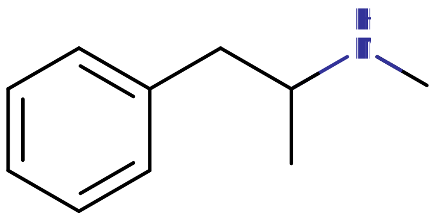

[◀返回](./home.md)

<mark> 文档又让AI傻了</mark>

# 苯丙胺类物质

来自 PsychonautWiki

一个*苯丙胺*分子的取代结构。

**苯丙胺类物质**是基于[苯丙胺](../../药物/苯丙胺.md)化学结构的有机化合物[化学分类](../../文档/化学分类.md)。该类成员涵盖多种药理学亚类，最显著的是[兴奋剂](./兴奋剂.md)和[共情剂](./home.md)，但也包括一些[迷幻剂](./迷幻剂.md)。苯丙胺类物质的例子包括[苯丙胺](../../药物/苯丙胺.md)（本身）、[甲基苯丙胺](../../药物/甲基苯丙胺.md)、[卡西酮](../../药物/卡西酮.md)、[吡咯戊酮](../../药物/吡咯戊酮.md)、[MDMA](../../药物/MDMA.md)和[DOx](./DOx.md)。

## 目录

* [1 化学](#Chemistry)
* [2 药理学](#Pharmacology)
* [3 苯丙胺类物质列表](#List_of_substituted_amphetamines)
* [4 另见](#See_also)
* [5 外部链接](#External_links)
* [6 参考文献](#References)

## 化学

一个*苯乙胺*分子的取代结构。

苯丙胺类物质是一类结构基于[苯丙胺](../../药物/苯丙胺.md)的化合物，在不同位置有不同的取代基。苯丙胺分子具有[苯乙胺](./苯乙胺类物质.md)分子的结构，并在α-碳上有一个额外的甲基。因此，苯丙胺除了是苯丙胺类物质的未取代成员外，也被视为一种[取代苯乙胺](./苯乙胺类物质.md)。

## 药理学

苯丙胺类物质的精神活性通常通过[多巴胺](../../文档/多巴胺.md)、[血清素](../../文档/血清素.md)和[肾上腺素](../../文档/肾上腺素.md)通路产生效应。迷幻效应可归因于对[5-HT2A受体](../../文档/血清素.md#The_5-HT_system)的作用。\[*[来源请求](../../文档/来源请求.md)*\] 兴奋和共情效应归因于它们作为[多巴胺](../../文档/多巴胺.md)、[血清素](../../文档/血清素.md)、[肾上腺素](../../文档/肾上腺素.md)和[去甲肾上腺素](../../文档/去甲肾上腺素.md)的[释放剂](../../文档/神经递质释放剂.md)或作为上述神经递质受体的[激动剂](../../文档/受体激动剂)的作用。\[*[来源请求](../../文档/来源请求.md)*\] 这组受体的激动导致突触后神经元放电率增加，从而引发使用者的[认知](../../药效/认知效应.md)和[身体刺激](../../药效/刺激.md)。\[*[来源请求](../../文档/来源请求.md)*\]

## 苯丙胺类物质列表

*注：此列表不包括[苄基哌啶类物质](./苄基哌啶类物质.md)、[卡西酮类物质](./卡西酮类物质.md)、[吡咯烷苯酮类物质](./吡咯烷苯酮类物质.md)、[MDxx](../../药物/MDxx.md)、[DOx](./DOx.md)、[苯并呋喃类物质](./苯并呋喃类物质.md)等其他进一步取代的苯丙胺类物质。*

| **化合物** | **R2** | **R3** | **R4** | **R5** | **R6** | **Rα** | **Rβ** | **RN1** | **RN2** | **结构** |
| --- | --- | --- | --- | --- | --- | --- | --- | --- | --- | --- |
| [苯丙胺](../../药物/苯丙胺.md) | H | H | H | H | H | H | H | H | H |  |
| [甲基苯丙胺](../../药物/甲基苯丙胺.md) | H | H | H | H | H | H | H | H | CH3 |  |
| [右旋甲基苯丙胺](../../药物/甲基苯丙胺.md) | H | H | H | H | H | H | H | H | CH3 |  |
| [左旋甲基苯丙胺](../../药物/甲基苯丙胺.md) | H | H | H | H | H | H | H | H | CH3 |  |
| [乙苯丙胺](../../药物/乙苯丙胺.md) (*Etilamfetamine*) | H | H | H | H | H | H | H | H | CH2CH3 |  |
| [丙苯丙胺](../../药物/丙苯丙胺.md) | H | H | H | H | H | H | H | H | CH2CH2CH3 |  |
| [异丙苯丙胺](../../药物/异丙苯丙胺.md) | H | H | H | H | H | H | H | H | CH(CH3)2 |  |
| [Bromo-DragonFLY](../../药物/Bromo-DragonFLY.md) | OCH\=CH\- | \- | Br | OCH\=CH\- | \- | H | H | H | H |  |
| [赖氨酸苯丙胺](../../药物/Vyvanse.md) | H | H | H | H | H | H | H | H | COCH(NH2)(CH2)4NH2 |  |
| [芬乙茶碱](../../药物/芬乙茶碱.md) | H | H | H | H | H | H | H | H | C9H12N4O2 |  |
| [氯苄雷司](../../药物/氯苄雷司.md) | H | H | H | H | H | H | H | H | CH2C6H4Cl |  |
| [二甲基苯丙胺](../../药物/二甲基苯丙胺.md) | H | H | H | H | H | H | H | CH3 | CH3 |  |
| [司来吉兰](../../药物/司来吉兰.md) | H | H | H | H | H | H | H | CH3 | CH2CCH |  |
| [苄非他明](../../药物/苄非他明.md) | H | H | H | H | H | H | H | CH3 | CH2C6H5 |  |
| [奥特他明](../../药物/奥特他明.md) | CH3 | H | H | H | H | H | H | H | H |  |
| [3-甲基苯丙胺](../../药物/3-甲基苯丙胺.md) | H | CH3 | H | H | H | H | H | H | H |  |
| [4-甲基苯丙胺](../../药物/4-甲基苯丙胺.md) | H | H | CH3 | H | H | H | H | H | H |  |
| [3-MMA](../../药物/3-MMA.md) | H | CHз | H | H | H | H | H | H | CHз |  |
| [4-MMA](../../药物/4-MMA.md) | H | H | CH3 | H | H | H | H | H | CH3 |  |
| [二甲苯丙胺](../../药物/二甲苯丙胺.md) | H | CH3 | CH3 | H | H | H | H | H | H |  |
| [β-甲基苯丙胺](../../药物/β-甲基苯丙胺.md) | H | H | H | H | H | H | CH3 | H | H |  |
| [β-苯基甲基苯丙胺](../../药物/β-苯基甲基苯丙胺.md) | H | H | H | H | H | H | C6H5 | H | CH3 |  |
| [2-FA](../../药物/2-FA.md) | F | H | H | H | H | H | H | H | H |  |
| [2-FMA](../../药物/2-FMA.md) | F | H | H | H | H | H | H | H | CH3 |  |
| [2-FEA](../../药物/2-FEA.md) | F | H | H | H | H | H | H | H | CH2CH3 |  |
| [3-FA](../../药物/3-FA.md) | H | F | H | H | H | H | H | H | H |  |
| [3-FMA](../../药物/3-FMA.md) | H | F | H | H | H | H | H | H | CH3 |  |
| [3-FEA](../../药物/3-FEA.md) | H | F | H | H | H | H | H | H | CH2CH3 |  |
| [芬氟拉明](../../药物/芬氟拉明.md) | H | CF3 | H | H | H | H | H | H | CH2CH3 |  |
| [去乙芬氟拉明](../../药物/去乙芬氟拉明.md) | H | CF3 | H | H | H | H | H | H | H |  |
| [4-FA](../../药物/4-FA.md) | H | H | F | H | H | H | H | H | H |  |
| [4-FMA](../../药物/4-FMA.md) | H | H | F | H | H | H | H | H | CH3 |  |
| [3-CMA](../../药物/3-CMA.md) | H | H | H | Cl | H | H | H | H | H |  |
| [4-CA](../../药物/4-CA.md) | H | H | Cl | H | H | H | H | H | H |  |
| [4-BA](../../药物/4-BA.md) | H | H | Br | H | H | H | H | H | H |  |
| [4-IA](../../药物/4-IA.md) | H | H | I | H | H | H | H | H | H |  |
| [DCA](../../药物/DCA.md) | H | Cl | Cl | H | H | H | H | H | H |  |
| [4-HA](../../药物/4-HA.md) | H | H | OH | H | H | H | H | H | H |  |
| [4-HMA](../../药物/4-HMA.md) | H | H | OH | H | H | H | H | H | CH3 |  |
| [3,4-DHA](../../药物/3,4-DHA.md) | H | OH | OH | H | H | H | H | H | H |  |
| [OMA](../../药物/OMA.md) | OCH3 | H | H | H | H | H | H | H | H |  |
| [3-MA](../../药物/3-MA.md) | H | OCH3 | H | H | H | H | H | H | H |  |
| [MMMA](../../药物/MMMA.md) | H | OCH3 | H | H | H | H | H | H | CH3 |  |
| [MMA](../../药物/MMA.md) | H | OCH3 | CH3 | H | H | H | H | H | H |  |
| [PMA](../../药物/PMA.md) | H | H | OCH3 | H | H | H | H | H | H |  |
| [PMMA](../../药物/PMMA.md) | H | H | OCH3 | H | H | H | H | H | CH3 |  |
| [PMEA](../../药物/PMEA.md) | H | H | OCH3 | H | H | H | H | H | CH2CH3 |  |
| [4-ETA](../../药物/4-ETA.md) | H | H | OCH2CH3 | H | H | H | H | H | H |  |
| [TMA](../../药物/TMA.md) | H | OCH3 | OCH3 | OCH3 | H | H | H | H | H |  |
| [TMA-2](../../药物/TMA-2.md) | OCH3 | H | OCH3 | OCH3 | H | H | H | H | H |  |
| [TMA-6](../../药物/TMA-6.md) | OCH3 | H | OCH3 | H | OCH3 | H | H | H | H |  |
| [4-MTA](../../药物/4-MTA.md) | H | H | SCH3 | H | H | H | H | H | H |  |
| [5-API](../../药物/5-API.md) | H | CH\=CH\- | NH\- | H | H | H | H | H | H |  |
| [去甲伪麻黄碱](../../药物/去甲伪麻黄碱.md) | H | H | H | H | H | H | OH | H | H |  |
| [伪麻黄碱](../../药物/伪麻黄碱.md) | H | H | H | H | H | H | OH | H | CH3 |  |
| [芬美曲秦](../../药物/芬美曲秦.md) | H | H | H | H | H | H | OCH2\- | CH2\- | H |  |
| [3-FPM](../../药物/3-FPM.md) | H | F | H | H | H | H | OCH2\- | CH2\- | H |  |
| [PPAP](../../药物/PPAP.md) | H | H | H | H | H | CH2CH3 | H | H | CH2CH2CH3 |  |
| [普罗林坦](../../药物/普罗林坦.md) | H | H | H | H | H | CH2CH3 | H | CH2CH2\- | CH2CH2\- |  |

## 另见

* [负责任的用药](../../文档/负责任的用药索引页.md)
* [苯乙胺类物质](./苯乙胺类物质.md)
* [兴奋剂](./兴奋剂.md)
* [共情剂](./home.md)
* [迷幻剂](./迷幻剂.md)

## 外部链接

* [Substituted amphetamine (Wikipedia)](http://en.wikipedia.org/wiki/Substituted_amphetamine)

## 参考文献