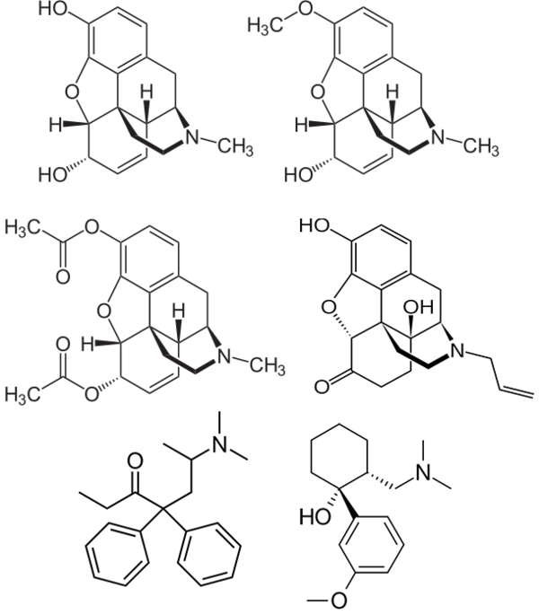

# 阿片类药物

<mark> 还行，但是为什么会有那么多没翻译的英文？</mark>

[◀返回](./home.md)

**当阿片类药物与其他[抑制剂](../../文档/药物分类/抑制剂.md)（如[苯二氮卓类物质](../../文档/药物分类/苯二氮卓类物质.md)、巴比妥类物质、[加巴喷丁类物质](../../文档/药物分类/加巴喷丁类物质.md)、噻吩二氮卓类物质、酒精或其他GABA能物质）联用时，可能会发生致命的[药物过量](../../文档/药物过量.md)。[\[1\]](#cite_note-tripsit-1)**

强烈不建议联用这些物质，特别是在[中等](../../文档/药物剂量分类.md)到[严重](../../文档/药物剂量分类.md)剂量下。

影响 μ-阿片受体的常见物质：[吗啡](../../药物/吗啡.md)、[可待因](../../药物/可待因.md)、[二乙酰吗啡](../../药物/海洛因.md)（*海洛因*）、纳洛酮（*Narcan*）、[美沙酮](../../药物/美沙酮.md)、曲马多。

割开罂粟果荚以释放鸦片乳胶

用于制备茶或生物碱溶剂提取的干燥果荚

**阿片类药物**是一类在药理作用上类似于[吗啡](../../药物/吗啡.md)或其他阿片类生物碱的[精神活性物质](../../文档/药物分类/home.md)。阿片类药物通过与阿片受体结合而起作用，这些受体存在于中枢和周围神经系统以及胃肠道中。这些器官系统中的受体介导了阿片类药物的有益效应和副作用。

虽然术语“阿片剂”（opiate）常被用作“阿片类药物”（opioid）的同义词，但“阿片剂”一词仅限于从罂粟（*Papaver somniferum*）树脂中的天然生物碱衍生的药物。[\[2\]](#cite_note-2) 而“阿片类药物”是一个更通用的术语，指主要作用于阿片受体的物质，包括天然存在的生物碱、合成物质和阿片肽。[\[3\]](#cite_note-:17-3)

随着持续给药，可能会发展出阿片类药物依赖，并在突然停药时导致[药物戒断反应](../../文档/药物戒断反应.md)。[\[4\]](#cite_note-4) 阿片类药物不仅因其成瘾性而闻名，还因其能够产生[欣快感](../../药效/躯体欣快感.md)，从而促使一些人进行娱乐性使用。

## 目录

* [1 化学](#Chemistry)
* [2 药理学](#Pharmacology)
    * [2.1 受体类型](#Receptor_types)
        * [2.1.1 **δ (Delta)**](#Delta_.28.CE.B4.29)
        * [2.1.2 **κ (Kappa)**](#Kappa_.28.CE.BA.29)
        * [2.1.3 **μ (Mu)**](#Mu_.28.CE.BC.29)
        * [2.1.4 **孤啡肽 (Nociceptin)**](#Nociceptin)
        * [2.1.5 **ζ (Zeta)**](#Zeta_.28.CE.B6.29)
* [3 主观效应](#Subjective_effects)
    * [3.1 **身体效应**](#Physical_effects)
    * [3.2 **认知效应**](#Cognitive_effects)
    * [3.3 **视觉效应**](#Visual_effects)
        * [3.3.1 视觉抑制](#Suppressions)
        * [3.3.2 幻觉状态](#Hallucinatory_states)
* [4 化学分类](#Chemical_classes)
    * [4.1 天然存在](#Naturally_occuring)
    * [4.2 半合成](#Semi-synthetic)
    * [4.3 合成](#Synthetic)
    * [4.4 尼他秦类 (Nitazenes)](#Nitazenes)
* [5 毒性与危害潜力](#Toxicity_and_harm_potential)
    * [5.1 长期效应](#Long_term_effects)
    * [5.2 耐药性与成瘾潜力](#Tolerance_and_addiction_potential)
    * [5.3 危险的相互作用](#Dangerous_interactions)
* [6 另见](#See_also)
* [7 外部链接](#External_links)
* [8 参考文献](#References)

## 化学

阿片类药物基于[吗啡](../../药物/吗啡.md)和类鸦片结构。它们通过其与体内内源性阿片类物质相似的化学结构发挥作用。吗啡衍生的阿片类药物，称为[吗啡喃类物质](../../文档/药物分类/吗啡喃类物质.md)，包含一个苯环，连接到两个部分不饱和的环己烷环（菲），以及第4个含氮环，连接到第9和第13位的碳原子上。有几类阿片类药物在结构上差异很大。例如，[芬太尼](../../药物/芬太尼.md)及其类似物在结构上与[吗啡喃类物质](../../文档/药物分类/吗啡喃类物质.md)和曲马多衍生物截然不同。

## 药理学

由[Pharmgkb.org](https://www.pharmgkb.org/pathway/PA146123006)提供的[可待因](../../药物/可待因.md)和[吗啡](../../药物/吗啡.md)的代谢途径

已知阿片类药物模仿内源性内啡肽。内啡肽负责[镇痛](../../药效/镇痛.md)（减轻疼痛）、引起嗜睡和愉悦感。它们可能因疼痛、剧烈运动、性高潮或兴奋而释放。这种对天然内啡肽的模仿导致了药物的[欣快](../../药效/躯体欣快感.md)、[镇痛](../../药效/镇痛.md)（缓解疼痛）和抗焦虑效应。[\[5\]](#cite_note-5)

### 受体类型

阿片类药物作用于神经系统中的三大类阿片受体：μ、κ、δ（Mu, Kappa, Delta）。[\[6\]](#cite_note-receptors-6) 每种阿片类药物根据其对受体的[激动](../../文档/正向变构调节剂.md)或[拮抗](../../文档/拮抗剂.md)效应来衡量，对不同受体亚型（如 μ1 和 μ2）的反应提供更多的效应差异。阿片受体主要存在于大脑中，但也存在于脊髓和消化道中。[\[7\]](#cite_note-7)

#### **δ (Delta)**

Delta 受体负责[镇痛](../../药效/镇痛.md)、抗抑郁和惊厥效应以及生理依赖。[\[6\]](#cite_note-receptors-6)

#### **κ (Kappa)**

Kappa 受体负责[镇痛](../../药效/镇痛.md)、抗惊厥、[解离](../../文档/药物分类/解离剂.md)和[谵妄](../../文档/药物分类/谵妄剂.md)效应以及烦躁、神经保护和[镇静](../../药效/镇静.md)。[\[6\]](#cite_note-receptors-6)

#### **μ (Mu)**

Mu 受体负责[镇痛](../../药效/镇痛.md)、生理依赖、[呼吸抑制](../../药效/呼吸抑制.md)、[欣快](../../药效/躯体欣快感.md)和可能的[血管扩张](../../药效/血管扩张.md)。[\[6\]](#cite_note-receptors-6)

μ-阿片受体激动剂主要通过 μ 受体与血清素、多巴胺和去甲肾上腺素的相互作用产生镇静、欣快和抗焦虑效应。μ 受体的激活通过阻断 GABA 对血清素和多巴胺神经元的抑制作用，从而解除对血清素和多巴胺神经元的抑制，进而增加血清素和多巴胺的活性和释放。[\[8\]](#cite_note-8) μ 受体还能抑制去甲肾上腺素神经元的活动，导致镇静、抗焦虑和呼吸抑制。[\[9\]](#cite_note-9)

#### **孤啡肽 (Nociceptin)**

孤啡肽受体负责[焦虑](../../药效/焦虑.md)（*注：原文链接指向 Anxiety，此处保留含义*）、抑郁、食欲以及对 μ 激动剂耐药性的发展。[\[10\]](#cite_note-pmid10742280-10)[\[11\]](#cite_note-11)

#### **ζ (Zeta)**

Zeta 阿片受体，也称为阿片生长因子受体 (OGFr)，负责组织生长、神经发育，并进一步涉及某些癌症的发展。[\[12\]](#cite_note-pmid10519055-12)[\[13\]](#cite_note-pmid12854052-13)[\[14\]](#cite_note-pmid10024694-14)[\[15\]](#cite_note-pmid10200353-15)[\[16\]](#cite_note-pmid17974995-16)[\[17\]](#cite_note-pmid19297547-17) OGFr 的内源性配体是甲硫氨酸脑啡肽，它也是一种强效的内源性 δ 阿片受体激动剂。[\[18\]](#cite_note-Stein1999-18)

## 主观效应

***免责声明：**下列效应列举参考了[***主观效应索引***](../../文档/科学信息索引页.md) (**SEI**)，这是一个基于轶事用户报告和 [PsychonautWiki](../../文档/关于本站/home.md) 贡献者个人分析的开放研究文献。因此，应带着健康的怀疑态度看待这些内容。*

*同样值得注意的是，这些效应不一定会以可预测或可靠的方式发生，尽管高剂量更可能诱发全方位的效应。同样，**不良反应**在高剂量下变得越来越可能，并且可能包括**成瘾、严重伤害或死亡*** ☠。

### **身体效应** 

*   **[刺激](../../药效/刺激.md) 或 [镇静](../../药效/镇静.md)** - 在轻微剂量下，μ-阿片受体激动剂通常会因增强多巴胺和血清素信号传导而产生轻度到中度的刺激，随着剂量增加，由于去甲肾上腺素的抑制，逐渐转变为镇静。作用于 kappa 和孤啡肽阿片受体活性更强的阿片类药物（如[芬太尼](../../药物/芬太尼.md)和[吗啡](../../药物/吗啡.md)）倾向于比主要作用于 μ 阿片受体的阿片类药物（如卡痛和[噻奈普汀](../../药物/噻奈普汀.md)）更具镇静作用。
*   **[呼吸抑制](../../药效/呼吸抑制.md)** - 在低至中等剂量下，这种效应导致呼吸轻度至中度减慢的感觉，但不会造成明显的障碍。在高剂量和过量使用时，阿片类药物诱导的呼吸抑制可能导致呼吸急促、呼吸模式异常、半清醒或意识丧失。如果不立即就医，严重过量可能导致昏迷或死亡。
*   **[镇痛](../../药效/镇痛.md)**
*   **[瘙痒感](../../药效/瘙痒感.md)**
*   **[便秘](../../药效/便秘.md)**
*   **[咳嗽抑制](../../药效/咳嗽抑制.md)**
*   **[性欲减退](../../药效/性欲减退.md)**
*   **[排尿困难](../../药效/排尿困难.md)**
*   **[恶心](../../药效/恶心.md)**
*   **[胃痉挛](../../药效/胃痉挛.md)**
*   **[瞳孔缩小](../../药效/瞳孔缩小.md)**
*   **[性高潮抑制](../../药效/性高潮抑制.md)**

### **认知效应** 

*   **[认知欣快感](../../药效/认知效应.md)** - 这可以描述为一种强大且压倒性的极乐、满足和幸福感。
*   **[动机增强](../../药效/认知效应.md)** - 一些阿片类药物（如卡痛）比其他药物更具刺激性，似乎能增强动机。
*   **[焦虑抑制](../../药效/焦虑抑制.md)**
*   **[强制性用药](../../药效/认知效应.md)**（Compulsive redosing）
*   **[梦境增强](../../文档/药物分类/促梦剂.md)**（Dream potentiation）
*   **[音乐欣赏增强](../../药效/听觉效应.md)**

### **视觉效应** 

#### 视觉抑制
*   **[复视](../../药效/复视.md)** - 在高剂量下，阿片类药物会导致眼睛无法控制地失焦和重新聚焦。这会产生模糊的效果和复视，无论视线聚焦在哪里都会出现。

#### 幻觉状态
*   **[内部幻觉](../../药效/视觉效应.md)** - 个体在“点头”（nodding，指阿片类药物引起的半睡半醒状态）状态下可能会体验到临睡幻觉（hypnagogia），通常伴随着生动的梦境般视觉。

## 化学分类

### 天然存在 

*   **[吗啡](../../药物/吗啡.md)**
*   **[可待因](../../药物/可待因.md)**
*   **卡痛** (Kratom)
*   **罂粟** (Poppy)
*   **延胡索** (Corydalis)
*   **海罂粟** (Glaucium)
*   **苦参** (Sophora)
*   **罗通定** (Rotundine)
*   **海罂粟碱** (Glaucine)
*   **苦参碱** (Matrine)

### 半合成 

*   **丁丙诺啡** (Subutex, Suboxone)
*   **[二乙酰吗啡](../../药物/海洛因.md)** (海洛因)
*   **[二氢可待因](../../药物/二氢可待因.md)**
*   **去美沙酮** (Desomorphine)
*   **[乙基吗啡](../../药物/乙基吗啡.md)**
*   **氢可酮** (Hydrocodone)
*   **氢吗啡酮** (Hydromorphone)
*   **[羟考酮](../../药物/羟考酮.md)**
*   **羟吗啡酮** (Oxymorphone)
*   **纳洛酮** (Narcan) - 这是一种强效的拮抗剂，可引发即时戒断，用于从药物过量中恢复。

### 合成 

*   **乙酰芬太尼** (Acetylfentanyl)
*   **右丙氧芬** (Dextropropoxyphene)
*   **二乙酰二氢吗啡** (Diacetyldihydromorphine)
*   **[芬太尼](../../药物/芬太尼.md)**
*   **舒芬太尼** (Sufentanil)
*   **[美沙酮](../../药物/美沙酮.md)**
*   **他喷他多** (Tapentadol)
*   **曲马多** (Tramadol)
*   **[噻奈普汀](../../药物/噻奈普汀.md)**
*   **替利定** (Tilidine)
*   **哌替啶** (Pethidine/Meperidine)
*   **O-去甲基曲马多** (O-Desmethyltramadol)
*   **U-47700**

### 尼秦类 (Nitazenes) 

*   α-carboxamido-clonitazene
*   α-methyl-metonitazene
*   Acetoxynitazene
*   Bronitazene
*   Butonitazene
*   Clonitazene
*   Dimetonitazene
*   Ethylnitazene
*   Ethylthionitazene
*   Etodesnitazene (Etazene)
*   Etoetonitazene
*   Etonitazene
*   Etonitazepipne
*   Etonitazepyne
*   Fluonitazene
*   Isotonitazene
*   Methylnitazene
*   Methylthionitazene
*   Metodesnitazene (Metazene)
*   meta-Metonitazene
*   Metonitazene
*   N-desethyl-isotonitazene
*   Nitazene
*   O-Desmethyl-etonitazene
*   Propylnitazene
*   Protodesnitazene
*   Protonitazene
*   t-Butylnitazene

## 毒性与危害潜力

 **此毒性与危害潜力部分是一个[存根](../../文档/关于本站/home.md)。**因此，它可能包含不完整甚至**极其错误**的信息！您可以通过编辑来帮助扩展或更正它。
*注意：如果使用此物质，请务必进行独立研究并采取**[伤害减少措施](../../文档/负责任的用药索引页.md)**。*

短期非长期使用阿片类药物与任何身体或神经毒性无关。

### 长期效应

长期使用阿片类药物会导致男性和女性的激素失衡。[\[19\]](#cite_note-19) 在男性中，这种阿片类药物诱导的雄激素缺乏会导致性激素水平异常低，特别是睾酮。[\[20\]](#cite_note-20)

这种男性内分泌功能的负面变化会导致：性欲降低、勃起功能障碍、疲劳、抑郁、面部和体毛减少、肌肉量减少和体重增加。

另一个常观察到的长期效应是痛觉过敏（hyperalgesia），即痛觉敏感性增加。这在高剂量阿片类药物治疗的慢性疼痛患者中尤为常见。有一些证据表明，NMDA 拮抗剂如[氯胺酮](../../药物/氯胺酮.md)以及也是弱 NMDA 拮抗剂的阿片类药物如[美沙酮](../../药物/美沙酮.md)、左啡诺（Levorphanol）和曲马多可能有助于延缓痛觉过敏的发作甚至逆转它。[\[21\]](#cite_note-21)

强烈建议在使用这类物质时采取[伤害减少措施](../../文档/负责任的用药索引页.md)。

### 耐药性与成瘾潜力

由于这些物质具有高度的欣快性质，阿片类药物的娱乐性使用和滥用具有极高的成瘾和依赖率。这与迅速建立的耐药性相结合，使得使用者必须服用越来越高的[剂量](../../文档/给药剂量.md)才能获得相同的效果。

致命的阿片类药物[过量](../../文档/药物过量.md)风险在停止使用一段时间后重新开始使用（复发）时急剧上升，这主要是因为耐药性降低。[\[22\]](#cite_note-22) 为了应对这种耐药性的缺乏，如果复发，更安全的做法是只使用平时[剂量](../../文档/给药剂量.md)的一小部分。研究还发现，所处的环境可能在阿片类药物耐药性中起作用。在一项科学研究中，具有相同海洛因给药史的大鼠在与其药物无关的环境中接受剂量后，相比在熟悉环境中，死亡的可能性显著更高。[\[23\]](#cite_note-23)

### 危险的相互作用

***警告：*** *许多在单独使用时相当安全的精神活性物质，当与某些其他物质结合使用时，可能会突然变得危险甚至危及生命。以下列表列出了一些已知的危险相互作用（尽管不保证包括所有相互作用）。*

*务必进行独立研究（例如 [Google](https://www.google.com)、[DuckDuckGo](https://www.duckduckgo.com)、[PubMed](https://pubmed.ncbi.nlm.nih.gov/)）以确保两种或多种物质的组合可以安全食用。部分列出的相互作用来源于 [TripSit](https://combo.tripsit.me)。*

*   **酒精** - 两种物质都会增强对方引起的共济失调和镇静作用，高剂量下可能导致意外的意识丧失。将受影响的患者置于恢复体位，以防止因呕吐物吸入而窒息。很可能发生记忆断片。
*   **[兴奋剂](../../文档/药物分类/兴奋剂.md)** - 兴奋剂会增加呼吸频率，这使得使用者可能会使用比通常更高的阿片类药物剂量。如果兴奋剂先失效，阿片类药物可能会压倒使用者并导致呼吸停止。
*   **[苯二氮卓类物质](../../文档/药物分类/苯二氮卓类物质.md)** - 中枢神经系统和/或呼吸抑制效应可能会叠加或协同出现。这两种物质会强烈且不可预测地相互增强，极快地导致意识丧失。在无意识状态下，如果不置于恢复体位，有呕吐物吸入的风险。很可能发生断片/记忆丧失。
*   **[右美沙芬](../../药物/右美沙芬.md)** - 通常被认为是有毒的。已观察到中枢神经系统抑制、呼吸困难、心脏问题和肝脏毒性。此外，如果服用右美沙芬，其对阿片类药物的耐受性会略微降低，从而导致额外的协同效应。
*   **GHB/GBL** - 这两种物质会强烈且不可预测地相互增强，极快地导致意识丧失。在无意识状态下，如果不置于恢复体位，有呕吐物吸入的风险。
*   **[氯胺酮](../../药物/氯胺酮.md)** - 两种物质都带来呕吐和意识丧失的风险。如果使用者在影响下失去意识，如果不置于恢复体位，有严重的呕吐物吸入风险。
*   **MAOIs** - 单胺氧化酶抑制剂 (MAOIs) 与某些阿片类药物合用与罕见的严重不良反应报告有关。似乎有两种类型的相互作用，一种是兴奋性的，一种是抑制性的。兴奋性反应的症状可能包括激越、头痛、多汗、高热、潮红、颤抖、肌阵挛、僵硬、震颤、腹泻、高血压、心动过速、癫痫发作和昏迷。在某些情况下已发生死亡。
*   **MXE** - MXE 可以增强阿片类药物的效应，但也增加了呼吸抑制和器官毒性的风险。
*   **[氧化亚氮](../../药物/氧化亚氮.md)** - 两种物质都会增强对方引起的共济失调和镇静作用，高剂量下可能导致意外的意识丧失。在无意识状态下，如果不置于恢复体位，有呕吐物吸入的风险。记忆断片很常见。
*   **[PCP](../../药物/PCP.md)** - PCP 可能会降低阿片类药物的耐药性，增加药物过量的风险。
*   **曲马多** - 增加癫痫发作的风险。曲马多本身已知会诱发癫痫发作，并且与其他阿片类药物合用可能会对癫痫阈值产生叠加效应。中枢神经系统和/或呼吸抑制效应可能会叠加或协同出现。
*   **西柚** - 虽然西柚没有精神活性，但它可能会影响某些阿片类药物的代谢。曲马多、[羟考酮](../../药物/羟考酮.md)和[芬太尼](../../药物/芬太尼.md)均主要由 CYP3A4 酶代谢，而西柚汁可强效抑制该酶[\[24\]](#cite_note-Ershad2020-24)。这可能导致药物从体内清除的时间变长，重复给药可能会增加毒性。[美沙酮](../../药物/美沙酮.md)也可能受到影响[\[24\]](#cite_note-Ershad2020-24)。[可待因](../../药物/可待因.md)和氢可酮由 CYP2D6 代谢。正在服用抑制 CYP2D6 药物的人，或因基因突变缺乏该酶的人，对可待因没有反应，因为它无法代谢成其活性产物：[吗啡](../../药物/吗啡.md)。

## 另见

*   [负责任的用药](../../文档/负责任的用药索引页.md)
*   [抑制剂](../../文档/药物分类/抑制剂.md)
*   卡痛 (Kratom)
*   [可待因](../../药物/可待因.md)
*   [羟考酮](../../药物/羟考酮.md)

## 外部链接

*   [Opioid (Wikipedia)](https://en.wikipedia.org/wiki/Opioid)
*   [Opiates (Erowid Vault)](https://erowid.org/chemicals/opiates/opiates.shtml)
*   [List of benzimidazole opioids (Wikipedia)](https://en.wikipedia.org/wiki/List_of_benzimidazole_opioids)

## 参考文献

1. [↑](#cite_ref-tripsit_1-0) [*Risks of Combining Depressants - TripSit*](https://tripsit.me/combining-depressants/) 
2. [↑](#cite_ref-2) Hemmings, Hugh C.; Egan, Talmage D. (2013). [*Pharmacology and Physiology for Anesthesia: Foundations and Clinical Application: Expert Consult - Online and Print*](https://books.google.com/books?id=s8CXrbimviMC&pg=PA268). Elsevier Health Scienc,es. p. 253. [ISBN](http://en.wikipedia.org/wiki/International_Standard_Book_Number "wikipedia:International Standard Book Number") [1437716792](http://en.wikipedia.org/wiki/Special:BookSources/1437716792 "wikipedia:Special:BookSources/1437716792"). Opiate is the older term classically used in pharmacology to mean a drug derived from opium. Opioid, a more modern term, is used to designate all substances, both natural and synthetic, that bind to opioid receptors (including antagonists). 
3. [↑](#cite_ref-:17_3-0) Hemmings, Hugh C.; Egan, Talmage D. (2013). [*Pharmacology and Physiology for Anesthesia: Foundations and Clinical Application: Expert Consult - Online and Print*](https://books.google.com/books?id=s8CXrbimviMC&pg=PA268). Elsevier Health Sciences. p. 253. [ISBN](http://en.wikipedia.org/wiki/International_Standard_Book_Number "wikipedia:International Standard Book Number") [1437716792](http://en.wikipedia.org/wiki/Special:BookSources/1437716792 "wikipedia:Special:BookSources/1437716792"). Opiate is the older term classically used in pharmacology to mean a drug derived from opium. Opioid, a more modern term, is used to designate all substances, both natural and synthetic, that bind to opioid receptors (including antagonists). 
4. [↑](#cite_ref-4) Cammarano, W. B., Pittet, J.-F., Weitz, S., Schlobohm, R. M., Marks, J. D. (April 1998). ["Acute withdrawal syndrome related to the administration of analgesic and sedative medications in adult intensive care unit patients:"](http://journals.lww.com/00003246-199804000-00015). *Critical Care Medicine*. **26** (4): 676–684. [doi](http://en.wikipedia.org/wiki/Digital_object_identifier "wikipedia:Digital object identifier"):[10.1097/00003246-199804000-00015](//doi.org/10.1097%2F00003246-199804000-00015). [ISSN](http://en.wikipedia.org/wiki/International_Standard_Serial_Number "wikipedia:International Standard Serial Number") [0090-3493](//www.worldcat.org/issn/0090-3493). 
5. [↑](#cite_ref-5) Boecker H, Sprenger T, Spilker ME, Henriksen G, Koppenhoefer M, Wagner KJ, Valet M, Berthele A, Tolle TR (November 2008). "The runner's high: opioidergic mechanisms in the human brain". *Cerebral Cortex*. **18** (11): 2523–31. [doi](http://en.wikipedia.org/wiki/Digital_object_identifier "wikipedia:Digital object identifier"):[10.1093/cercor/bhn013](//doi.org/10.1093%2Fcercor%2Fbhn013). [PMID](http://en.wikipedia.org/wiki/PubMed_Identifier "wikipedia:PubMed Identifier") [18296435](//www.ncbi.nlm.nih.gov/pubmed/18296435). 
6. ↑ [6.0](#cite_ref-receptors_6-0) [6.1](#cite_ref-receptors_6-1) [6.2](#cite_ref-receptors_6-2) [6.3](#cite_ref-receptors_6-3) Opioid - Chapter 2: The Endogeneous Opioid Systems
(<http://www.stoppain.org> / Beth Israel Medical Center's Department of Pain Medicine and Palliative Care) | <https://web.archive.org/web/20110719072413/http://www.stoppain.org/pcd/_pdf/OpioidChapter2.pdf>
7. [↑](#cite_ref-7) Holzer, P. (5 June 2009). ["Opioid receptors in the gastrointestinal tract"](https://www.ncbi.nlm.nih.gov/pmc/articles/PMC3163293/). *Regulatory peptides*. **155** (1–3): 11–17. [doi](http://en.wikipedia.org/wiki/Digital_object_identifier "wikipedia:Digital object identifier"):[10.1016/j.regpep.2009.03.012](//doi.org/10.1016%2Fj.regpep.2009.03.012). [ISSN](http://en.wikipedia.org/wiki/International_Standard_Serial_Number "wikipedia:International Standard Serial Number") [0167-0115](//www.worldcat.org/issn/0167-0115). 
8. [↑](#cite_ref-8) <https://www.sciencedirect.com/science/article/abs/pii/S1043661818306145>
9. [↑](#cite_ref-9) <https://www.ncbi.nlm.nih.gov/pmc/articles/PMC3274960/>
10. [↑](#cite_ref-pmid10742280_10-0) Calo' G, Guerrini R, Rizzi A, Salvadori S, Regoli D (April 2000). ["Pharmacology of nociceptin and its receptor: a novel therapeutic target"](//www.ncbi.nlm.nih.gov/pmc/articles/PMC1571975). *British Journal of Pharmacology*. **129** (7): 1261–83. [doi](http://en.wikipedia.org/wiki/Digital_object_identifier "wikipedia:Digital object identifier"):[10.1038/sj.bjp.0703219](//doi.org/10.1038%2Fsj.bjp.0703219). [PMC](http://en.wikipedia.org/wiki/PubMed_Central "wikipedia:PubMed Central") [1571975](//www.ncbi.nlm.nih.gov/pmc/articles/PMC1571975) . [PMID](http://en.wikipedia.org/wiki/PubMed_Identifier "wikipedia:PubMed Identifier") [10742280](//www.ncbi.nlm.nih.gov/pubmed/10742280). 
11. [↑](#cite_ref-11) Toll L, Bruchas MR, Calo' G, Cox BM, Zaveri NT (April 2016). ["Nociceptin/Orphanin FQ Receptor Structure, Signaling, Ligands, Functions, and Interactions with Opioid Systems"](http://pharmrev.aspetjournals.org/content/68/2/419). *Pharmacological Reviews*. **68** (2): 419–57. [doi](http://en.wikipedia.org/wiki/Digital_object_identifier "wikipedia:Digital object identifier"):[10.1124/pr.114.009209](//doi.org/10.1124%2Fpr.114.009209). [PMID](http://en.wikipedia.org/wiki/PubMed_Identifier "wikipedia:PubMed Identifier") [26956246](//www.ncbi.nlm.nih.gov/pubmed/26956246). 
12. [↑](#cite_ref-pmid10519055_12-0) Zagon IS, Wu Y, McLaughlin PJ (August 1999). "Opioid growth factor and organ development in rat and human embryos". *Brain Res*. **839** (2): 313–22. [doi](http://en.wikipedia.org/wiki/Digital_object_identifier "wikipedia:Digital object identifier"):[10.1016/S0006-8993(99)01753-9](//doi.org/10.1016%2FS0006-8993%2899%2901753-9). [PMID](http://en.wikipedia.org/wiki/PubMed_Identifier "wikipedia:PubMed Identifier") [10519055](//www.ncbi.nlm.nih.gov/pubmed/10519055). 
13. [↑](#cite_ref-pmid12854052_13-0) Sassani JW, Zagon IS, McLaughlin PJ (May 2003). "Opioid growth factor modulation of corneal epithelium: uppers and downers". *Curr. Eye Res*. **26** (5): 249–62. [doi](http://en.wikipedia.org/wiki/Digital_object_identifier "wikipedia:Digital object identifier"):[10.1076/ceyr.26.4.249.15427](//doi.org/10.1076%2Fceyr.26.4.249.15427). [PMID](http://en.wikipedia.org/wiki/PubMed_Identifier "wikipedia:PubMed Identifier") [12854052](//www.ncbi.nlm.nih.gov/pubmed/12854052). 
14. [↑](#cite_ref-pmid10024694_14-0) Zagon IS, Smith JP, McLaughlin PJ (March 1999). "Human pancreatic cancer cell proliferation in tissue culture is tonically inhibited by opioid growth factor". *Int. J. Oncol*. **14** (3): 577–84. [doi](http://en.wikipedia.org/wiki/Digital_object_identifier "wikipedia:Digital object identifier"):[10.3892/ijo.14.3.577](//doi.org/10.3892%2Fijo.14.3.577). [PMID](http://en.wikipedia.org/wiki/PubMed_Identifier "wikipedia:PubMed Identifier") [10024694](//www.ncbi.nlm.nih.gov/pubmed/10024694). 
15. [↑](#cite_ref-pmid10200353_15-0) McLaughlin PJ, Levin RJ, Zagon IS (May 1999). "Regulation of human head and neck squamous cell carcinoma growth in tissue culture by opioid growth factor". *Int. J. Oncol*. **14** (5): 991–8. [doi](http://en.wikipedia.org/wiki/Digital_object_identifier "wikipedia:Digital object identifier"):[10.3892/ijo.14.5.991](//doi.org/10.3892%2Fijo.14.5.991). [PMID](http://en.wikipedia.org/wiki/PubMed_Identifier "wikipedia:PubMed Identifier") [10200353](//www.ncbi.nlm.nih.gov/pubmed/10200353). 
16. [↑](#cite_ref-pmid17974995_16-0) Cheng F, Zagon IS, Verderame MF, McLaughlin PJ (November 2007). "The opioid growth factor (OGF)-OGF receptor axis uses the p16 pathway to inhibit head and neck cancer". *Cancer Research*. **67** (21): 10511–8. [doi](http://en.wikipedia.org/wiki/Digital_object_identifier "wikipedia:Digital object identifier"):[10.1158/0008-5472.CAN-07-1922](//doi.org/10.1158%2F0008-5472.CAN-07-1922). [PMID](http://en.wikipedia.org/wiki/PubMed_Identifier "wikipedia:PubMed Identifier") [17974995](//www.ncbi.nlm.nih.gov/pubmed/17974995). 
17. [↑](#cite_ref-pmid19297547_17-0) Donahue RN, McLaughlin PJ, Zagon IS (March 2009). "Cell Proliferation of Human Ovarian Cancer is Regulated by the Opioid Growth Factor - Opioid Growth Factor Receptor Axis". *American Journal of Physiology. Regulatory, Integrative and Comparative Physiology*. **296** (6): R1716–25. [doi](http://en.wikipedia.org/wiki/Digital_object_identifier "wikipedia:Digital object identifier"):[10.1152/ajpregu.00075.2009](//doi.org/10.1152%2Fajpregu.00075.2009). [PMID](http://en.wikipedia.org/wiki/PubMed_Identifier "wikipedia:PubMed Identifier") [19297547](//www.ncbi.nlm.nih.gov/pubmed/19297547). 
18. [↑](#cite_ref-Stein1999_18-0) Christoph Stein (1999). [*Opioids in pain control: basic and clinical aspects*](https://books.google.com/books?id=4Rfr8cQayvgC&pg=PA22). Cambridge University Press. pp. 22–23. [ISBN](http://en.wikipedia.org/wiki/International_Standard_Book_Number "wikipedia:International Standard Book Number") [978-0-521-62269-1](http://en.wikipedia.org/wiki/Special:BookSources/978-0-521-62269-1 "wikipedia:Special:BookSources/978-0-521-62269-1"). Retrieved 25 November 2011. 
19. [↑](#cite_ref-19) Brennan, M. J. (March 2013). "The effect of opioid therapy on endocrine function". *The American Journal of Medicine*. **126** (3 Suppl 1): S12–18. [doi](http://en.wikipedia.org/wiki/Digital_object_identifier "wikipedia:Digital object identifier"):[10.1016/j.amjmed.2012.12.001](//doi.org/10.1016%2Fj.amjmed.2012.12.001). [ISSN](http://en.wikipedia.org/wiki/International_Standard_Serial_Number "wikipedia:International Standard Serial Number") [1555-7162](//www.worldcat.org/issn/1555-7162). 
20. [↑](#cite_ref-20) Smith, H. S., Elliott, J. A. (July 2012). "Opioid-induced androgen deficiency (OPIAD)". *Pain Physician*. **15** (3 Suppl): ES145–156. [ISSN](http://en.wikipedia.org/wiki/International_Standard_Serial_Number "wikipedia:International Standard Serial Number") [2150-1149](//www.worldcat.org/issn/2150-1149). 
21. [↑](#cite_ref-21) Lee, M., Silverman, S. M., Hansen, H., Patel, V. B., Manchikanti, L. (April 2011). "A comprehensive review of opioid-induced hyperalgesia". *Pain Physician*. **14** (2): 145–161. [ISSN](http://en.wikipedia.org/wiki/International_Standard_Serial_Number "wikipedia:International Standard Serial Number") [2150-1149](//www.worldcat.org/issn/2150-1149). 
22. [↑](#cite_ref-22) Why Heroin Relapse Often Ends In Death - Lauren F Friedman (Business Insider) | <http://www.businessinsider.com.au/philip-seymour-hoffman-overdose-2014-2>
23. [↑](#cite_ref-23) Siegel, S., Hinson, R. E., Krank, M. D., McCully, J. (23 April 1982). ["Heroin "Overdose" Death: Contribution of Drug-Associated Environmental Cues"](https://www.science.org/doi/10.1126/science.7200260). *Science*. **216** (4544): 436–437. [doi](http://en.wikipedia.org/wiki/Digital_object_identifier "wikipedia:Digital object identifier"):[10.1126/science.7200260](//doi.org/10.1126%2Fscience.7200260). [ISSN](http://en.wikipedia.org/wiki/International_Standard_Serial_Number "wikipedia:International Standard Serial Number") [0036-8075](//www.worldcat.org/issn/0036-8075). 
24. ↑ [24.0](#cite_ref-Ershad2020_24-0) [24.1](#cite_ref-Ershad2020_24-1) Ershad, M., Cruz, M. D., Mostafa, A., Mckeever, R., Vearrier, D., Greenberg, M. I. (March 2020). ["Opioid Toxidrome Following Grapefruit Juice Consumption in the Setting of Methadone Maintenance"](https://journals.lww.com/10.1097/ADM.0000000000000535). *Journal of Addiction Medicine*. **14** (2): 172–174. [doi](http://en.wikipedia.org/wiki/Digital_object_identifier "wikipedia:Digital object identifier"):[10.1097/ADM.0000000000000535](//doi.org/10.1097%2FADM.0000000000000535). [ISSN](http://en.wikipedia.org/wiki/International_Standard_Serial_Number "wikipedia:International Standard Serial Number") [1932-0620](//www.worldcat.org/issn/1932-0620).