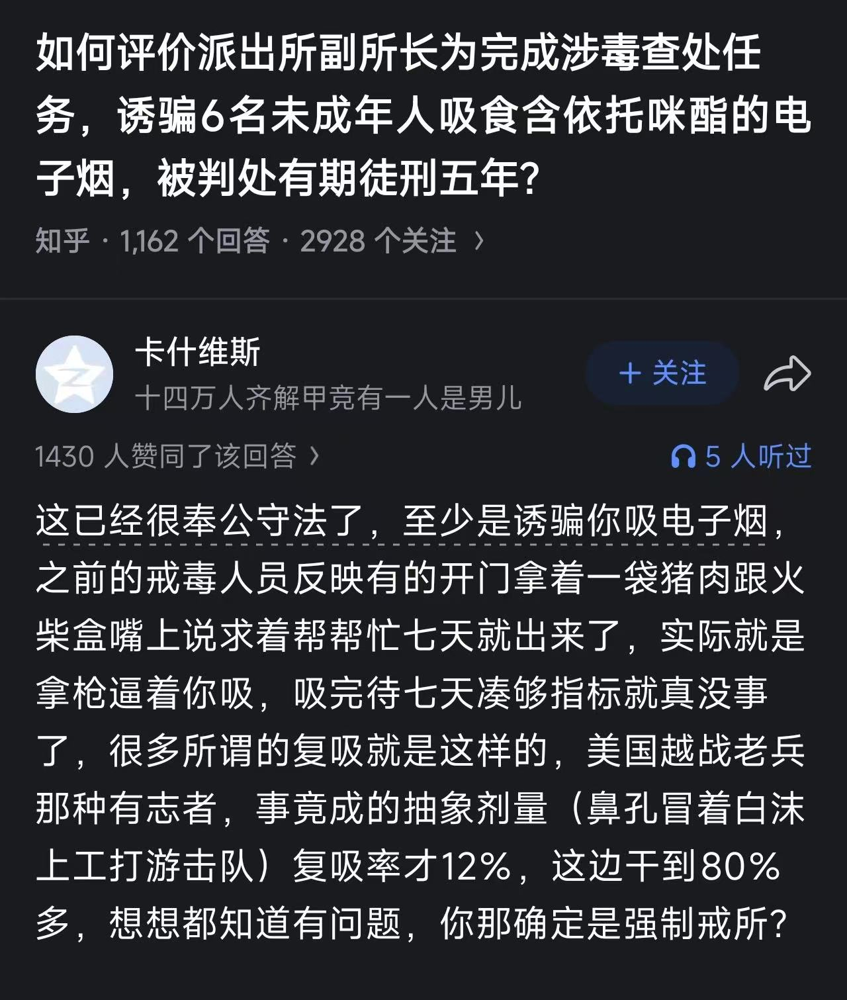

# FreeODwiki致社群和爱好者们的一封信

[◀返回](./index.md)

<i>by @SalviaSWC</i>

为防止本文档被别有用心的人利用，本文档及其所有历史版本采用 CC BY-ND 4.0 即 CC 署名—禁止演绎 4.0 协议国际版许可，侵权必究，敬请谅解。详见[这里](../LICENSE-STRICT)
。

<mark>施工中</mark>

本信的目标读者是所有FreeODwiki的访问者。

本信的主要作者是 @SalviaSWC 。其本人深入接触过OD群体，是OD群体当前最大的百科[FreeODwiki](https://github.com/SalviaSWC/FreeODwiki/tree/main)的创立者和最大编辑。

可以说，此人是还活着的人中最了解OD社群的人之一，之前编写过[OD史](../od.md)(虽然未完成)。因此，请信任本文档中作者所做出的论断的正确性。如果你有疑问，欢迎你找ta交流，联系方式将在文档末给出。

## 前言

在正式开始之前，我先回答事关该文档本身的一些问题。

### 为什么要写本文档?

我写下本文档时，整个OD社群处于一个关键时刻。

### 既然本文档的意义如此重大，为什么不早点写呢?

有一群sb拦着我，叫我别写，说这是没有用的。说实话，我怀疑警察，ODer，毒贩，记者，都不希望任何人写出这些文档，好让他们自己在乱局中得利。我真是疯了！！！

### 你写本文档的动机是什么?

目前，很多人不愿愿意提起OD问题，不仅是因为这被视为一个禁忌

## 背景

下面介绍本文档的背景，使得对OD认知水平较低的路人也能读懂整个文档。

### OD药物

OD药物是贯穿整个群体始终的话题。

#### 几个典型

### ODer

ODer指的是单个从事OD行为的人。

#### ODer的心路历程

一个路人从完全不知道OD开始，到初窥门槛，再到加入OD群体，成为ODer，究竟经历了什么的心路历程呢?

并不是所有人的心路历程都完全相同，然而，这里可以归纳出几个具有共性的阶段。

<i>注意，以下阶段都是文档作者便于称呼而起的名字，在社群中就此并无共识。</i>

##### 最初阶段

在最初阶段，一个人对OD是完全不知情的。虽然每个人都经受过当局的禁毒宣传，知道什么是“药物滥用”；他也许抽烟喝酒嚼槟榔。

由于当局审查了大多数有关精神活性物质的讨论和信息，处于最初阶段的人很难了解真实情况，对于精神活性物质的认知水平极其低下，并将这个话题视为禁忌。

然而，这种认知低下和文化禁忌的状态，恰恰助长了他们对精神活性物质的好奇。一旦他们接触到了一些传闻和经验丰富的其他个体，便有可能开始一段贪婪探索的启蒙阶段。

##### 启蒙阶段

此时，一个身处最初阶段的个体刚刚接触到第一条有关OD的信息，为他开辟了精神活性物质这条未曾设想的道路。于是，他被启蒙了，进入“启蒙阶段”。

讽刺的是，社群内部不乏有人的启蒙阶段是由“广州禁毒”等禁毒相关媒体在社交媒体上发布的视频所打开的。

启蒙阶段的特点是，自身

##### 前期阶段

前期阶段开始的标志是一个人首次[以非医用目的使用了精神活性物质](/文档/娱乐性用药.md)(烟酒槟榔咖啡等常见的非医用精神活性物质除外)。

##### 中期阶段

##### 后期阶段A

这个阶段只是一个猜想，目前，本人未观察到有处于后期阶段A的ODer，但可以确定的是，这些人正逐渐增多。

然而，我们可以以史为鉴。上个世纪70年代，美国曾出现过一个轰轰烈烈的反文化运动，其特点之一就在于使用[大麻](/药物/大麻.md)、[LSD](/药物/LSD.md)、[MDMA](/药物/MDMA.md)等[致幻剂](/文档/药物分类/致幻剂.md)，而这一点与当今的OD群体有着不小的神似。

尽管这场运动不出几年，美国当局便特地为此发起了“禁毒战争”，让那些曾被广泛使用的致幻剂，成为“禁毒战争”的牺牲品，而整场运动也被毫不留情地镇压了。然而，曾参与过那场运动的人、在那场运动中诞生的思想、从那场运动中留下的文化遗产却未能被抹杀。

随着时间的流逝，参与过那场运动的人年龄变大了，而他们中不少人也不再使用精神活性物质了。随着他们逐渐成熟，他们开始反思自己做过的事情。虽然有人觉得当初的自己做得太过火了，但不少人表示他们并不后悔，而更有不少人则积极推进这些精神活性物质的合法化、去罪化。

无论OD社群是否会与反文化运动殊途同归，都能以相当大的把握预言的是，在未来会出现一批的ODer，他们曾广泛使用过精神活性物质，但出于某些原因不再接触了。从外表看来，他们与其他人无异，属于“沉默的大多数”。然而，他们的内心中却充满了无奈、忿恨和怀念。最终，他们将坐上大人的位置。

##### 后期阶段B

然而，某些ODer就没有那么幸运了。由于大量滥用精神活性物质，他们的身心健康受到严重摧残，很难继续正常生活。他们要么休学、退学而失业在家。

据我个人所知，某些家长在得知自己的身处此阶段的子女因药物过量而死之后，甚至不会进行尸检，而是直接送进火葬场。这是令人目瞪口呆的。

### OD群体

#### OD群体认同感的基础

#### OD群体的重要组成成分

##### 药商

所谓“药商”，就是在社群中提供[精神活性物质](/文档/药物分类/药物全索引.md)交易(简称卖药或贩毒)的个体。“药商”词汇本身带有褒义性质，贬义性质的同义词是“药贩”或直接“毒贩”等。

药商群体是无法用一言以蔽之的。根据其运作方式与规模，可以将其分为三类。

<i>注意，以下三个名字“零售药商”、“二手药商”、“批发药商”都是文档作者便于称呼而起的名字，在社群中就此并无共识。</i>

###### 零售药商

零售药商是药商界最基层的存在，也最常见。他们通常以个人形式独立承担营销、客服、交易、发货和售后。

由于身兼多职，他们难以扩大其运营规模，其顾客以药商关系最密切的网友为主。同时，许多零售药商并不总是接受精神活性物质的订单，货源很不稳定。

其售卖目录主要取决于自己能获取到的药物，购药渠道几乎只包括从医用零售渠道中够得、从二手药商中够得这两种方式。

他们的身份一般是普通ODer，依靠药物交易赚取外快。

###### 二手药商

二手药商是药商界的中流砥柱。这类药商的规模中等，在OD社群中广泛招募发货员、客服等职位为其服务，运营规模

其售卖目录

###### 批发药商

批发药商是药商界最顶层的存在。在整个OD圈中，批发药商屈指可数。

他们通常由自己合成精神活性物质，或从其他渠道大批量购得它们，然后将其批发给二手药商们。

##### 药师

“药师”是OD群体对研究精神药理学，发掘新OD药物的人的尊称。

##### wiki主

“wiki主”是OD群体对组建有关精神活性物质的百科的人的尊称。

#### OD群体的

#### 

### ODer的

### 外界

据我观察，外界对待ODer们的态度始终是不友好的，而其中某些特定群体则对ODer极其不友好。

## ODer可能的出路？

鉴于上述问题，不少人在考虑ODer的出路。

### 继续探索其他OD药物?

### 转战[策划药](/文档/研究用化学品.md)?

为了规避层层加码的药物管制政策，许多ODer开始探索不被法律管制且无医学用途物质，即“[策划药](/文档/研究用化学品.md)”。

然而，由于以下原因，策划药绝不可能替代OD药物所占据的生态位。

#### 原因之一：

#### 原因之二：

由此可见，[策划药](/文档/研究用化学品.md)只能作为ODer的缓兵之计，并不能根本性地解决问题。

### 回归正常生活?

很多人(包括不少自媒体)认为，只要让ODer们停止OD，不再接触OD社群，回归正常生活，这些问题就能够解决。

这种说法当然有它的道理。

然而，请大家不要忘了你从小就接受的禁毒宣传中有一个说法是这么说的：

> “一日吸毒，终身戒毒。”

#### “一日吸毒，终身戒毒。”的成因

> <i>广州禁毒：OD就是滥用精麻药物，滥用精麻药物就是吸毒！</i>
>
> 所以，我不会在本章辨析两者的区别，而是认同广州禁毒的说法。

当局声称，“一日吸毒，终身戒毒。”这种现象的出现正是因为毒品的成瘾性，导致吸毒者只要沾上毒品，就会终身被毒品诱惑，不可避免地复吸。

乍一看，这种说法相当合理。毒品毒品，荼毒的正是心灵，毒性恰在于瘾啊！否则，为什么禁毒部门要采取强制隔离戒毒措施，把瘾君子从毒瘾中挽救出来呢？

然而，最近在[一个公共事件发生后](../社会学/为完成查处任务，“设计”让6名未成年人吸毒再查获，南京一派出所副所长马某犯欺骗他人吸毒罪一审被判刑5年.md)，我观察到了坊间有这样的说法：

如果此传言为真，那么就说明，当局所说的“一日吸毒，终身戒毒。”，复吸率居高不下，是有一定道理的。而且，与其说这种现象的成因是毒品药理作用带来的天灾，不如说是禁毒不力带来的人祸。

不过，我并不想把论证的正确性依赖于这种传言的真实性。我也认为，“一日吸毒，终身戒毒。”的成因是人祸，其原因恰恰在人的处境的本身。

众所周知，在接触毒品之前，一个人的生活通常已经处于非常落魄的处境了。<i>毕竟，编入一个人能通过[做题](../../药物/哌甲酯.md)、[自慰约炮](../../药效/性欲增强.md)、玩抽卡游戏、[搞男女对立](../../药效/易怒.md)、抽[烟](../../药物/尼古丁.md)喝[酒](../../药物/酒精.md)嚼槟榔等社会认可的方式获得[满足感](../../药效/认知欣快.md)和感官刺激，何必去搞嗑药之类的有的没的的事情呢?</i>

同时，我们知道，毒品通常情况下很难改善一个人的处境，反而会恶化一个人所处的处境。因此，一旦一个人戒毒归来，他要面对的是一个[缺少满足感](../../药效/认知不快.md)的精神状态，而自己的处境也因为浪费了过多时间的精力在毒品上而更加落魄，再加上自己因一时疏忽被执法部门、社会、家庭落井下石而刻下的烙印，他很难在任何地方寻找满足感了，能做的基本上只有复吸。

#### 阻止ODer回归正常生活的原因

与“一日吸毒，终身戒毒。”相似的逻辑可以应用在ODer身上：学业、事业、心理等各方面上的窘迫处境为OD行为打开了大门。你去劝他、限制OD药物的售卖、甚至把他送进强制戒毒所，都只能让他从表面上回归正常，而深层次的学业、事业、心理等各方面上“正常”状态是难以恢复的。

然而，对于ODer而言，还存在着阻止他们回归正常的独特负担。

##### 身份的负担

众所周知，目前当局的禁毒宣传以其严重的道德导向闻名，其宣传手法因对药物使用者的强烈的污名化而饱受社群内诟病与嘲笑。<i>其实谁都觉得这种宣传手法晦气，不过，对于社群外的认为自己一辈子碰不上毒的路人来说，何必去指出呢?</i>

这就导致，对打算回归正常生活的ODer们来说，由于，他们的身份与ODer是绑定在一起的，离开那个不将自己视为异类的温暖的小窝，而投向那个极力污名化自己的冰冷的硬板床，是极为困难的。

##### 知识与体验的负担

更糟糕的是，禁毒宣传的大量内容是有违客观事实的，(需要补充)虽然一眼望去，一般人是未必能找出它们得错误的。

但是ODer们的情况不同。作为一个毫不吝啬地共享知识的社群，ODer们从社群中的“药师”、百科那里通常学习了大量与药物有关的药理知识、社会知识、法律知识；而ODer们自身与药物的实践性体验和理论性的知识，却为他们回归正常生活增添了负担：

- 他们知道各种药物的[药效](/药效/index.md)，所以自然对那个永远只会重复“成瘾”的禁毒宣传自然是嗤之以鼻；
- 他们知道驱使一个人从事OD的复杂行为因素，所以自然对那个一讲到吸毒原因就张口闭口“好奇”、“追求感官刺激”、“被人诱骗”的禁毒宣传强烈抵触；
- 他们知道法律的伸张正义的局限，所以自然对那个大肆鼓吹“贩吸同罪”、“滥用就是吸毒”的禁毒宣传产生义愤之感。
- 他们知道何为[解离](/文档/药物分类/解离剂.md)、何为[迷幻](/文档/药物分类/迷幻剂.md)，所以自然感觉那个一提幻觉便添油加醋的禁毒宣传是心术不正。

##### 结论

由此可见，正是因为这些体验和知识，ODer们同时站在了理性的高地和感性的高地、法律的高地和道德的高地。要想离开这些高地而回归正常生活，只能主动压抑这些记忆。而作为一名本有能力发声的人却因为要回归正常生活、要脱离社群，而无的放矢，只能袖手旁观，眼睁睁地看着那些谎言和误导肆意传播。他会想到OD社群的成员又将因为那些错误观念而蒙受不公，甚至自己都会因过去从事过OD而被刻上烙印，郁闷感便油然而生。

经历了这些屈辱而选择不回归OD社群(从而未能回归正常生活)，对于任何有正义感的ODer来说，都是非常困难的。

即便他们成功说服自己，抑制住了为真相发声的冲动，自己也肯定是极为痛苦的。罪恶感、羞耻感等负面情绪充斥了他们的内心。而被这么多负面情绪充斥的生活，哪能谈得上是“正常生活”呢?

综上所述，ODer们是无法以真正意义上回归正常生活的。

不过，以上观点的前提是，当局仍然保持其对待ODer刻板姿态而拒绝改正。倘若当局愿意放下偏见、改变政策、调整宣传，那么我认为，这个现状是有机会改变的。

## 术语表

- <strong>OD</strong> 英文“Overdose”的全称
- <strong>ODer</strong> 从事OD行为的个体
- <strong>药商</strong> 对于社群中提供药物交易的人的尊称
- <strong></strong> 未被法律管制的精神活性物质，特点是可以产生与管制品类似的[药效](/药效/index.md)而不受法律限制。
- <strong>列管</strong> (当局)将某个物质或某类物质加入到管制目录中

## 联系方式

如果你对任何方面有疑问，或者有想交流的东西，欢迎联系本文档作者。下面给出作者的两个联系方式：

- X(原推特) <https://x.com/salviaswc> 可以私信鼠尾草，不过可能需要等一段时间ta才能看到你的问题。
- FreeODwiki在的Github仓库讨论区 <https://github.com/SalviaSWC/FreeODwiki/discussions> 可以在讨论区提问

