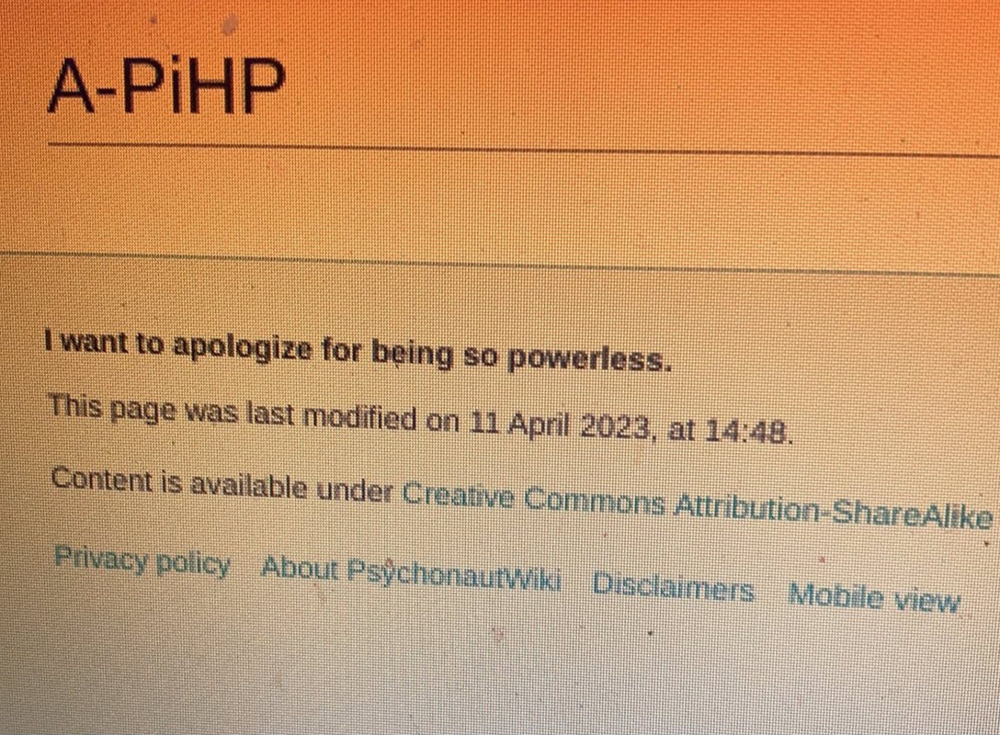
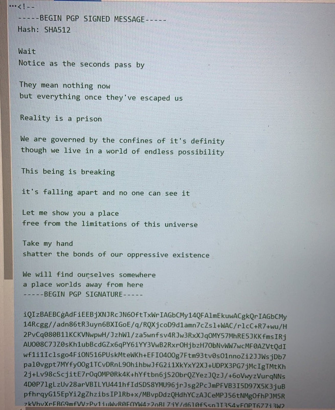
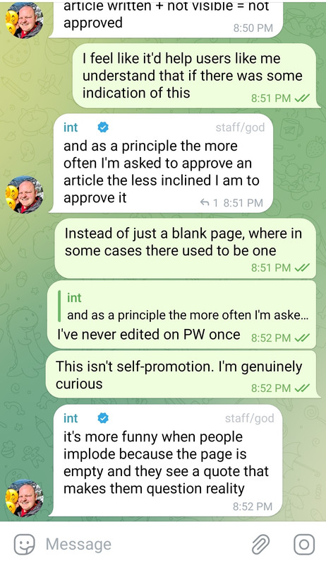
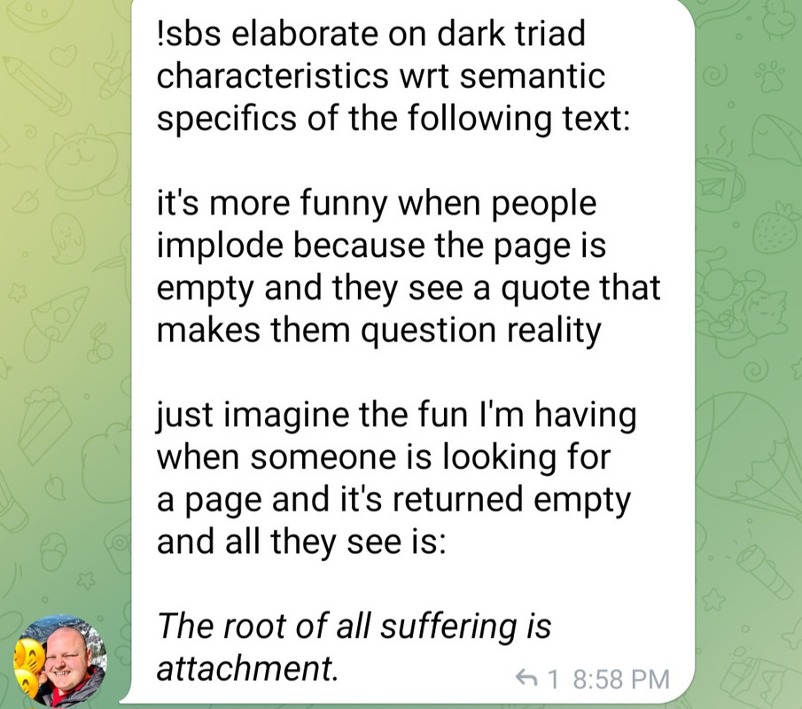
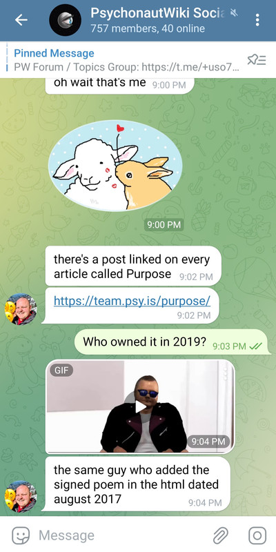

# FreeODwiki致社群和爱好者们的一封信

[◀返回](./index.md)

<i>by @SalviaSWC</i>

为防止本文档被别有用心的人利用，本文档及其所有历史版本采用 CC BY-ND 4.0 即 CC 署名—禁止演绎 4.0 协议国际版许可，侵权必究，敬请谅解。详见[这里](../LICENSE-STRICT)
。

<mark>施工中</mark>

本信的目标读者是所有FreeODwiki的访问者。

本信的主要作者是 @SalviaSWC 。其本人深入接触过OD群体，是OD群体当前最大的百科[FreeODwiki](https://github.com/SalviaSWC/FreeODwiki/tree/main)的创立者和最大编辑。

可以说，此人是还活着的人中最了解OD社群的人之一，之前编写过[OD史](../od.md)(虽然未完成)。因此，请信任本文档中作者所做出的论断的正确性。如果你有疑问，欢迎你找ta交流，联系方式将在文档末给出。

## 前言

在正式开始之前，我先回答事关该文档本身的一些问题。

### 为什么要写本文档?

我写下本文档时，整个OD社群处于一个关键时刻。

然而，即便是到了现在，还有很多人在尝试OD舍曲林、感康，以一种更严重的方式危害他们自己的健康。

我认为，不得不一五一十地写下关于我们社群的这么多事情，是非常不幸的。我们本可以继续探究药理，组织社群，和大家和谐共生。然而，某些外界别有用心的人士利用我们不善于发声的弱点，企图借我们牟取利益。他们勾结社群内部的不良分子、游说当局执法部门和政策制定者、影响普罗大众，借他们的声势散布有关我们的错误观念，并最终威胁到我们“圈地自萌”的生存状态。因此，我们不得不写下这些文档，确保真相不会被谎言埋没。

此外，目前有关OD的文档甚少。每当我需要论证一个涉及OD的议题时，我都不得不拿出来一大堆论据，从头开始论证整套逻辑，极为费时费力。因此，本文档亦旨在为社会各界提供一个讨论OD议题时可供参考的可信资料，而这个资料并不会偏袒任意一方，帮助研究者得出一个更公平的结论。

### 既然本文档的意义如此重大，为什么不早点写呢?

首先，全面地编写有关OD的文档不可避免地会出现疏漏之处，有造成严重的争议的可能。然而，如今

一个重要原因就是，OD群体不太愿意被大众认知(原因会在下文讲解)，因此编写一个全面的文档来讲解OD群体，更想必是会受到ODer全体指责，从而失去他们的支持的。笔者的深受OD群体的支持，肯定不会轻易放弃ODer的支持的。

笔者曾打算编写

有一群sb拦着我，叫我别写，说这是没有用的。说实话，我怀疑警察，ODer，毒贩，记者，都不希望任何人写出这些文档，好让他们自己在乱局中得利。我真是疯了！！！

### 你写本文档的动机是什么?

目前，很多人不愿愿意提起OD问题，不仅是因为这被视为一个禁忌

### 叠甲

### 本文档的局限性

笔者主要在推特平台活动，因此接触的主要是活跃在推特平台上的人。我对墙内平台上的OD活动虽有耳闻，我对他们的认识却远比不上我对推特ODer的认识深刻。

TBD

### 术语澄清

在本文档中，你可以看到“OD”、“精神活性物质”、“毒品”等近义词被交替使用。如果要掰扯这些术语，我可以掰扯很久，但就讨论当前问题而言，这些特定提法其实没有任何意义。如果你看到有人揪着某个术语的使用不放，那么此人肯定是想夹带他自己的私货。例如

如有疑问，请参阅文末的术语表。

## 背景

下面介绍本文档的背景，使得对OD认知水平较低的路人也能读懂整个文档。

### OD药物

OD药物是贯穿整个群体始终的话题。

#### 几个典型

### ODer

ODer指的是单个从事OD行为的人。

#### ODer的心路历程

一个路人从完全不知道OD开始，到初窥门槛，再到加入OD群体，成为ODer，究竟经历了什么的心路历程呢?

根据个人观察并不是所有人的心路历程都完全相同，然而，这里可以归纳出几个具有共性的阶段。

<i>注意，以下阶段都是文档作者便于称呼而起的名字，在社群中就此并无共识。</i>

##### 最初阶段

每一个未接触过任何大量有关精神活性物质的知识(禁毒宣传不算)的人都处于<i>最初阶段</i>。

处于最初阶段的人可能知道禁毒宣传中老生常谈的“毒品”、“药物滥用”等相关名词，却精神活性物质的真实情况毫不了解。他也许每天靠[咖啡](/药物/咖啡因.md)吊着一条命、抽[烟](/药物/尼古丁.md)喝[酒](/药物/酒精.md)嚼槟榔，却不知道这些精神活性物质与所谓“毒品”是本质上类似的。总之，他们对于精神活性物质的认知水平极其低下，并将这个话题视为禁忌。

然而，这种认知低下和文化禁忌的状态，恰恰助长了他们对精神活性物质的好奇。就像“谈性色变”一样，精神活性物质也是一个“谈药色变”的话题；就像“性压抑”一样，人们也会“药压抑”。

一个常见的例子就是一个热梗“卧槽，冰！”，它的流行程度就足以说明人们的“药压抑”程度很深了。还人将高因咖啡因饮料宣传为“毒品”，引发广泛关注。这两个例子都是身处最初阶段的人对精神活性物质的好奇心与禁忌感并存的体现。

为什么身处最初阶段的人会有这种表现呢？为了解释这个现象，窝这里引用纳粹德国宣传部长葛培尔说过的一句话：“如果你说的谎言范围够大，并且不断重复，人民最终会开始相信它。”   

<i>我这里无意将我国宣传部门比作纳粹德国宣传部门，或暗示禁毒宣传完全是谎言。然而，二者的形式是相同的，且造成的效果也是相似的。</i>

 在中国，禁毒宣传的范围是有目共睹的。<!-- TBD -->

因此，在我国，任何未能深入了解相关真相的人的独立思考能力，都会屈服于铺天盖地的宣传力量。

然而，人还有一个“逆反心理”，当宣传力量过于强大时，反而会激起人们的好奇心，想要去了解真相。

不幸的是，当局早就预料到了这一点。国内民众方便接触到的有关药物信息均被严格审查，并被以一种有利于瓦解逆反心理的方式表现出来。举个小小的例子：笔者还记得，之前在使用国产输入法打出“[冰毒](/药物/甲基苯丙胺.md)”、“[海洛因](/药物/海洛因.md)”、“[摇头丸](/药物/MDMA.md)”等词汇时，后面会紧跟着联想词“珍爱生命，远离毒品”。

在被这些反制措施制约后，人不仅未能获取到有价值的信息，他们的逆反心理更被成功暂时压制了下来，于是就出现了上述表现。然而，这些基于恐吓的反制措施是不可能从根本上压制住好奇心的，于是就出现了上述“药压抑”的表现。

就像“性压抑”一样，“药压抑”会随着一个人“初尝禁果”的经历而彻底消失。不同之处在于，对于不少准ODer来说，药物不必与他们的身体亲密接触，只需一个涉药信息源，即可让他们“初尝禁果”，从而进入启蒙阶段了。

##### 启蒙阶段

一旦一个处于最初阶段的人接触到了有关精神活性物质的[知识库](/关于本站/实用链接.md)、经验丰富的其他个体整理的资料等一些信息源，便很有可能开始一段贪婪探索的<i>启蒙阶段</i>。这个阶段以一个人首次[以非医用目的使用精神活性物质](/文档/娱乐性用药.md)结束。

身处最初阶段的人进入启蒙阶段的可能性有很多因素，下面给出几个便于解释ODer人员构成的因素：

- <strong> 一个人的“药压抑”程度</strong>：如前所述，身处最初阶段的人对精神活性物质的好奇心与禁忌感并存。一个人的“药压抑”程度与其未能被当局禁毒宣传压制住的逆反心理正相关。其“药压抑”程度越深，其“初尝禁果”的快感就越大，进入启蒙阶段的可能性就越大。
- <strong> 一个人是否属于“神经多元人士”</strong>：例如ADHD(注意力缺陷多动障碍)患者，可能天生就对任何东西有着更高的好奇心，因此他们进入启蒙阶段的可能性也更大。
- <strong> 一个人是否患有精神病</strong>：精神病患者被中国社会歧视，因此并不在意社会视为禁忌的话题。精神活性物质的禁忌状态会以比常人更低的程度阻止他们探索相关话题，因此他们进入启蒙阶段的可能性也更大。
- <strong> 一个人是否是LGBTQ+人士</strong>：同理“精神病”。
- <strong> 一个人看待<i>改变的意识状态</i>的态度</strong>：某些人对于改变意识状态并不感冒，所以对相关信息源也不屑一顾

处于启蒙阶段的人的最大特点是，此人对精神活性物质产生了浓厚的兴趣，但出于各种原因还未使用过。

如果一个人具有足够的信息检索能力知识储备，则这个人更容易独立探索；反之，则此人容易依赖于社区百科或群组作为获取信息的渠道。

于是，这位身处最初阶段的个体刚刚接触到第一条有关精神活性物质的信息，并产生了浓厚的兴趣。精神活性物质这条未曾设想的道路被开辟了。于是，他被启蒙了，进入启蒙阶段。

在启蒙阶段，一个人经常从各种渠道获取有关精神活性物质的信息。 <!-- TBD -->

启蒙阶段的人的心理，大概是掌握了一种不被社会理解的禁忌知识，感觉自己好像打开了新世界的大门，充满了期待和兴奋，同时也有些忐忑和不安。

<i>讽刺的是，社群内部不乏有人的启蒙阶段是由“广州禁毒”等禁毒相关媒体在社交媒体上发布的禁毒宣传视频所打开的。这一事实侧面反映了当局基于“禁毒叙事”所构建的宣传严重脱离群众，甚至无法意识到自己的行为属于搬起石头砸自己的脚。</i>

##### 前期阶段

由启蒙阶段进入前期阶段的标志是一个人第一次[以非医用目的使用了精神活性物质](/文档/娱乐性用药.md)。

处于前期阶段的人的最大特点是，尝试精神活性物质的欲望极其旺盛。这个阶段是一个ODer在整段心路历程中，最想尝试使用精神活性物质(特别是自己之前没有尝试过的)的一个阶段。

##### 中期阶段

在

##### 后期阶段A

这个阶段只是一个猜想，目前，本人未观察到有处于后期阶段A的ODer，但可以确定的是，这些人正逐渐增多。

然而，我们可以以史为鉴。上个世纪70年代，美国曾出现过一个轰轰烈烈的反文化运动，其特点之一就在于使用[大麻](/药物/大麻.md)、[LSD](/药物/LSD.md)、[MDMA](/药物/MDMA.md)等[致幻剂](/文档/药物分类/致幻剂.md)，而这一点与当今的OD群体有着不小的神似。

尽管这场运动不出几年，美国当局便特地为此发起了“禁毒战争”，让那些曾被广泛使用的致幻剂，成为“禁毒战争”的牺牲品，而整场运动也被毫不留情地镇压了。然而，曾参与过那场运动的人、在那场运动中诞生的思想、从那场运动中留下的文化遗产却未能被抹杀。

随着时间的流逝，参与过那场运动的人年龄变大了，而他们中不少人也不再使用精神活性物质了。随着他们逐渐成熟，他们开始反思自己做过的事情。虽然有人觉得当初的自己做得太过火了，但不少人表示他们并不后悔，而更有不少人则积极推进这些精神活性物质的合法化、去罪化。

无论OD社群是否会与反文化运动殊途同归，都能以相当大的把握预言的是，在未来会出现一批的ODer，他们曾广泛使用过精神活性物质，但出于某些原因不再接触了。从外表看来，他们与其他人无异，属于“沉默的大多数”。然而，他们的内心中却充满了无奈、忿恨和怀念。最终，他们将坐上大人的位置。

##### 后期阶段B

然而，某些ODer就没有那么幸运了。由于大量滥用精神活性物质，他们的身心健康受到严重摧残，很难继续正常生活。他们要么休学、退学而失业在家。

据我个人所知，某些家长在得知自己的身处此阶段的子女因药物过量而死之后，甚至不会进行尸检，而是直接送进火葬场。这是令人目瞪口呆的。

### OD群体

#### OD群体认同感的基础

#### OD群体的重要组成成分

##### 药商

所谓“药商”，就是在社群中提供[精神活性物质](/文档/药物分类/药物全索引.md)交易(简称卖药或贩毒)的个体。“药商”词汇本身带有褒义性质，贬义性质的同义词是“药贩”或直接“毒贩”等。

药商群体是无法用一言以蔽之的。根据其运作方式与规模，可以将其分为三类。

<i>注意，以下三个名字“零售药商”、“二手药商”、“批发药商”都是文档作者便于称呼而起的名字，在社群中就此并无共识。</i>

###### 零售药商

零售药商是药商界最基层的存在，也最常见。他们通常以个人形式独立承担营销、客服、交易、发货和售后。

由于身兼多职，他们难以扩大其运营规模，其顾客以药商关系最密切的网友为主。同时，许多零售药商并不总是接受精神活性物质的订单，货源很不稳定。

其售卖目录主要取决于自己能获取到的药物，购药渠道几乎只包括从医用零售渠道中够得、从二手药商中够得这两种方式。

他们的身份一般是普通ODer，依靠药物交易赚取外快。

###### 二手药商

二手药商是药商界的中流砥柱。这类药商的规模中等，在OD社群中广泛招募发货员、客服等职位为其服务，运营规模

其售卖目录主要包括其能从批发药商中够得的

###### 批发药商

批发药商是药商界最顶层的存在。在整个OD圈中，批发药商屈指可数。

他们通常由自己合成精神活性物质，或从其他渠道(暂且不表)大批量购得它们，然后将其批发给二手药商们。

批发药商们通常吞吐量很大，很可能是全职药商。

##### 药师

“药师”是OD群体对研究精神药理学，发掘新OD药物的人的尊称。

##### wiki主

“wiki主”是OD群体对组建有关精神活性物质的百科的人的尊称。

#### OD群体的优秀文化

在OD社群中，曾经诞生过很多

##### 药理学科普

如上所述，在OD社群中，“药师”是被ODer尊敬的。这就催生出了一种良性循环：药师们在社群中分享他们的研究成果，ODer们则以极大的热情去学习这些知识，并将它们传播给更多的人，从而不断壮大OD群体的药理学科普文化。

#### 

### ODer的

### 外界

据我观察，外界对待ODer们的态度始终是不友好的，而其中某些特定群体则对ODer极其不友好。

## ODer面临的问题

### 层层加码的药物管制

### 社群内部的分裂

### 药物使用带来的后果

OD社群的最鲜明的特点，就在于精神活性物质的使用。而恰恰是这个特点，不仅可能会为ODer个人生活带来不便，甚至明显地危害了社区发展进程。

事实上，据我观察，即便是入坑多年的ODer，因OD而受到长期损害的也不多。而这些药物对社群造成危害的主要方式，并非致死致伤等极端的方式。这些事件自身一旦被社群成员曝光，一般会广泛传播，造成恶劣影响，让ODer们迅速亮起红灯，促进减害意识的形成和减害知识的普及。由此可见，这种事件虽然严重危害了单个ODer，却走了一条曲线，反而促进了ODer社群的发展。

相反，药物危害社群发展主要是以一种温和的方式，通过在药效内[干扰社群成员的判断能力](../../药效/分析能力抑制.md)，让他们在社群内部“制造噪音”。虽然只要提前注意安全，被干扰的判断能力对受影响的个体造成的身心伤害通常较小，他们却可能会因此发表一些“不当言论”，在社群内部“制造噪音”，从而影响到整个群体。

能干扰服药者判断能力的药物有很多：[致幻剂](../药物分类/致幻剂.md)虽然会导致幻觉，包括思维幻觉。但这些幻觉对服药者而言是非常明显的，因此肯定没有人会在致幻剂的药效下参与社区讨论的；而[兴奋剂](../药物分类/兴奋剂.md)使用在OD社群中少见，且一旦兴奋剂造成不当言论的产生，产生的不当言论一般带有非常严肃的语气，并伴随着极易察觉的[妄想](../../药效/妄想.md)和[精神错乱](../../药效/精神病发作.md)行为，常人一眼就能看得出来，并引起警惕，因此难以影响其他成员。虽然上述两种药物都有危害社群发展的潜力，这里要讲的主要是在社群中被广泛使用[抑制剂](../药物分类/抑制剂.md)了。下面详细讲述它们。

抑制剂能够抑制神经兴奋，由于焦虑通常由[神经元](../神经元.md)异常兴奋造成，而社交场景通常导致神经元的兴奋，此类精神活性物质的最大通性是[抗焦虑](../../药效/焦虑抑制.md)和[降低一个人在社交场景中的抑制力](../../药效/去抑制.md)(简称“去抑制”)。虽然抗焦虑的药效为很多深受[焦虑](../../药效/焦虑.md)的ODer们提供了缓解，但是这个药效能够影响一个人对于局势的认知，从而干扰了个人的决策；而去抑制的药效虽然让患有社交恐惧症的ODer能够自由发声，但经常让一个人说话不过脑子，说一些不该说的话，且受此药效影响的人发言时，通常是以一种轻描淡写的愉快语气发言的，常人完全不会怀疑此人正受到药效的影响，让人防不胜防。

这两个药效结合在一起，很容易不仅能使一名个体产生误判，更经常造成群体性的“幻觉”。

即便你不是一个ODer，不熟悉抑制剂的药效，你也肯定喝过[酒](/药物/酒精.md)，所以你可以拿酒精的药效作类比，辅助你的理解。再想想你参加过的酒局，以及酒局上的醉汉们是多么地放荡不羁，而在酒局中，醉汉们发的酒疯是如此地摄人心魄，以至于一旦一个醉汉开始发酒疯，其他醉汉们也被调动起来，热血沸腾一起发酒疯，甚至那些没怎么喝酒的人也在一定程度上受了影响。

而OD社群中常用的抑制剂，虽然其药效温和，通常远比不上酒精。在OD用抑制剂药效内，一个人的运转能力很少受到影响，且药效持续时间比酒长得多，服用一次，药效即可持续一天；而在药效结束后，更不会出现酒精的令人头疼宿醉。但是，恰恰是这种人畜无害的精神活性物质及其优越的药效，让身处初期阶段(上文提到过“阶段”的定义)的ODer放松了警惕，促进他们培养起一个[使用药物的“日常活动”](../负责任的用药索引页.md)，使他们处于“酗酒”状态。而一旦一定数量的个体开始每日“酗酒”，这些人在药效下的行为就会开始具有群体性，而OD社群的常态便成了“酒局”，于是社区发展自然便成了不可能的事情。

然而，即便是对于笔者，这种隐秘的恶性常态直到最近才被发现。<i>笔者怀疑，社群内影响力大的人早就发现了这种现象，却出于某些原因，从不将其公之于众。</i>接下来，笔者将以具体药物为例，讨论一些这种恶性常态影响社群发展的机理。

首先，讨论OD群体中最被广泛使用的OD药物[普瑞巴林](/药物/普瑞巴林.md)。即便是在医学使用的低剂量下，普瑞巴林也会引起

最后，讨论具有极强的致[欣快](/药效/认知欣快.md)药效，因而依赖性极强的[阿片类药物](../药物分类/阿片类药物.md)。这种药物通过[激动](/文档/受体激动剂.md)μ-阿片受体，通过一定机理降低大脑对痛苦的感知能力(因而被医院用作强效止痛药)。

然而，阿片药物能够缓解的痛苦所涵盖的对象并不仅仅是生理的疼痛，更是心理上的折磨。恰恰是这一点，导致了一系列的问题。

### 社群组织建立的困难

为了确保一个e

由于各种原因。

首先，想要在OD社群建立一个组织的人，通常也是泥菩萨过河，自身难保的ODer。而且，这些社群组织者的死亡率甚至比普通ODer还高！

例如，TBD

以及，TBD

历史上，国外也存在不少与有关精神活性物质的开放知识库，其中[PsychonautWiki](https://psychonautwiki.org)(中文译名:精神探索百科)早在2013年便建立，目前已成为最大的一个知识库之一。而他们也遭遇过同样的困境。以下是[PsychonautWiki](https://psychonautwiki.org)现任站长Kenan在接受Vice采访时发表的言论：

> 整个项目中最让我担忧的一点是，一些撰稿人与药物之间存在着不健康的关系。在我加入之前，就有好几位作者因药物过量而死亡，但似乎没有人对此表示在意。他们什么药都用，比如[3-MeO-PCP](/药物/3-MeO-PCP.md)——一种会让人精神错乱的氯胺酮。有个家伙一开始为网站贡献了很多内容，但后来彻底疯了，袭击了一位老妇人。我听说他现在在监狱里。[^vicepsywiki]

> 但这还不是够。我们另一位管理员也用了同样的药物，结果变得疑神疑鬼。他开始相信我们所有的贡献者都被外星人控制了，于是把主页改造成了外星人的圣殿。在我看来，这再次表明我们的组织需要走向专业化。[^vicepsywiki]

<i>请注意文中有关所谓“专业化”的论调，后续我们还会进一步讨论</i>

> 我不想细说，但我可以告诉你，珍妮在2017年因服用苯二氮卓类药物和抗精神病药物过量去世了。这件事让我彻底醒悟。那时，乔西也已经无法工作了。所以2017年，我不得不接管网站。如果我不接手，整个项目就彻底完蛋了。如今，经过两万次编辑，我们终于步入正轨。

<i>提到的珍妮(<https://m.psychonautwiki.org/wiki/User:Oskykins>)是一位跨性别女性，而乔西<https://m.psychonautwiki.org/wiki/User:Josikins>是她的女友。这两位是PsychonautWiki的创立者和最大贡献者之二。</i>

由此可见，在国外的精神活性物质社群中，这种现象也屡见不鲜。它们严重阻碍了一个社群组织的正常运行。

### 社群领袖的不当行为

如上一节所述，社群组织的建立是极为困难的，而更令人沮丧的事情，莫非是一个社群组织好不容易建立起来了，结果这个组织的领袖自己却开始从事危害群体利益的不当行为。

先接上一节，[PsychonautWiki](https://psychonautwiki.org)正在经历这种问题。2017年，现任[PsychonautWiki](https://psychonautwiki.org)站长Kenan掌控了[PsychonautWiki](https://psychonautwiki.org)。然而，随着时间的推移，[PsychonautWiki](https://psychonautwiki.org)的用户们逐渐发现，此人似乎并不是个善茬。

 
  查看Reddit 原贴 

<strong>如果你一直很疑惑 Psychonautwiki 为何最近变得如此不实用——别担心！这是有意而为之的。</strong>

简而言之：Psychonautwiki 的使命似乎已经改变。有人建议我不要使用该网站，因为存在安全隐患；就我个人而言，由于其功能有限，且我对其站长的意图感到担忧，我也不推荐使用该网站。

大家好，

在过去的几个月里，我注意到 Psychonautwiki 作为信息源越来越不实用。许多页面，尤其是那些关于近期流行的精神活性物质的页面，要么不存在，要么是空白的。在某些情况下，这些页面以前是有信息的，但现在却莫名其妙地空空如也。我最近发现，在很多情况下，编辑历史记录中确实存在一篇完整的文章，但内容却根本没有显示。

我把这个问题告诉了一位比我更懂技术的朋友，他去调查了一下。他立刻注意到我的浏览器中之前从未显示的某些内容：页面底部出现了一条令人不安的信息。他顿时感到不安，开始深入调查。他在网站的 HTML 代码中发现了一首用 PGP 加密的诗，其含义相当令人担忧。进一步调查后，他发现 SSH 密钥存在问题（这可能指向某种后门），HTML 代码中也存在一些权限请求代码（他认为这可能表明存在恶意数据收集）。

我们都担心这是外部恶意行为——某种形式的恶意收购——通过某些渠道，我设法加入了 Psychonautwiki 的 Telegram 频道，并联系到了 Psychonautwiki 的首席管理员/开发者 Kenan。他解释说，这些网站的遗漏不仅是已知的，而且是刻意为之，并让他感到非常高兴。

   

坦白说，作为一名减害倡导者，这件事让我感到非常不安。我无法容忍这种态度。我的朋友告诉我，为了保护隐私，最好不要尝试访问该网站，并且建议其他人也这样做。我建议大家仅仅出于道德原因就不要访问。尽管如此，我觉得还是有必要发帖说明一下。

祝大家平安。

更新：目前对该网站进行的调查似乎并未发现最初观察到的 SSH 安全问题。我认为最初出现的问题可能是由于 PW 的证书颁发机构的技术故障造成的，但这只是有人向我提出的一个可能性。

过度的分析数据请求可能仍然存在，但是（如果大数据可信的话）这些请求应该不会损害用户的隐私。访问 psychonautwiki 可能是安全的，但自然建议使用广告/跟踪拦截器和/或 VPN。[^redditpsywikiunhelpful]

无独有偶，

社群组织

### 最终判断：OD究竟是好是坏?

要真正有意义地讨论一个事物的好或坏，我们必须就价值判断达成共识。不幸的是，我并不是专业人士。

<!-- 社会主义核心价值观 -->

## ODer可能的出路？

鉴于上述问题，不少人在考虑ODer的出路。

### 继续探索其他OD药物?

自从[2024年右美沙芬列管](../社会学/国家药监局_公安部_国家卫生健康委关于调整精神药品目录的公告（2024年第54号）.md)以来，社群中的许多ODer们就一直在对这个出路抱有指望。

诚然，即便是现在，还有[加巴喷丁](../../药物/加巴喷丁.md)、[美金刚](../../药物/美金刚.md)等存在娱乐价值的药物未受到严打；在可以预见的未来也会有更多新药上市，而在这些新药中，肯定也有能改变精神状态的。

然而，虽然上述药物(以及其他未曾谋面的新药)目前未受到严打，只要闹出点动静，就会很快受到当局的关注，并受到相应的处理。

### 转战[策划药](/文档/研究用化学品.md)?

为了规避层层加码的药物管制政策，许多ODer开始探索不被法律管制且无医学用途物质，即“[策划药](/文档/研究用化学品.md)”，下简称为“RC”(<mark>R</mark>esearch<mark>C</mark>hemicals)。

支持采取这条出路的人认为，RC药物的种类繁多，且更新换代迅速，ODer们完全可以通过不断地寻找新的RC药物来替代被管制的OD药物，以达成改变精神状态的目的。

然而，由于以下原因，RC药物绝不可能替代OD药物所占据的生态位。

根本原因是，RC药物与OD药物的本质属性不同。OD药物的销售者是合法合规的药店、医院，这就导致RC药物的销售者

由此可见，[策划药](/文档/研究用化学品.md)只能作为ODer的缓兵之计，并不能根本性地解决问题。

### 回归正常生活?

很多人(包括不少自媒体)认为，只要让ODer们停止OD，不再接触OD社群，回归正常生活，这些问题就能够解决。

这种说法当然有它的道理。

然而，请大家不要忘了你从小就接受的禁毒宣传中有一个说法是这么说的：

> “一日吸毒，终身戒毒。”

#### “一日吸毒，终身戒毒。”的成因

> <i>广州禁毒：OD就是滥用精麻药物，滥用精麻药物就是吸毒！</i>
>
> 所以，我不会在本章辨析两者的区别，而是认同广州禁毒的说法。

当局声称，“一日吸毒，终身戒毒。”这种现象的出现正是因为毒品的成瘾性，导致吸毒者只要沾上毒品，就会终身被毒品诱惑，不可避免地复吸。

乍一看，这种说法相当合理。毒品毒品，荼毒的正是心灵，毒性恰在于瘾啊！否则，为什么禁毒部门要采取强制隔离戒毒措施，把瘾君子从毒瘾中挽救出来呢？

然而，最近在[一个公共事件发生后](../社会学/为完成查处任务，“设计”让6名未成年人吸毒再查获，南京一派出所副所长马某犯欺骗他人吸毒罪一审被判刑5年.md)，我观察到了坊间有这样的说法：

如果此传言为真，那么就说明，当局所说的“一日吸毒，终身戒毒。”，复吸率居高不下，是有一定道理的。而且，与其说这种现象的成因是毒品药理作用带来的天灾，不如说是禁毒不力带来的人祸。

不过，我并不想把论证的正确性依赖于这种传言的真实性。我也认为，“一日吸毒，终身戒毒。”的成因是人祸，其原因恰恰在人的处境的本身。

众所周知，在接触毒品之前，一个人的生活通常已经处于非常落魄的处境了。<i>毕竟，编入一个人能通过[做题](../../药物/哌甲酯.md)、[自慰约炮](../../药效/性欲增强.md)、玩抽卡游戏、[搞男女对立](../../药效/易怒.md)、抽[烟](../../药物/尼古丁.md)喝[酒](../../药物/酒精.md)嚼槟榔等社会认可的方式获得[满足感](../../药效/认知欣快.md)和感官刺激，何必去搞嗑药之类的有的没的的事情呢?</i>

同时，我们知道，毒品通常情况下很难改善一个人的处境，反而会恶化一个人所处的处境。因此，一旦一个人戒毒归来，他要面对的是一个[缺少满足感](../../药效/认知不快.md)的精神状态，而自己的处境也因为浪费了过多时间的精力在毒品上而更加落魄，再加上自己因一时疏忽被执法部门、社会、家庭落井下石而刻下的烙印，他很难在任何地方寻找满足感了，能做的基本上只有复吸。

#### 阻止ODer回归正常生活的原因

与“一日吸毒，终身戒毒。”相似的逻辑可以应用在ODer身上：学业、事业、心理等各方面上的窘迫处境为OD行为打开了大门。你去劝他、限制OD药物的售卖、甚至把他送进强制戒毒所，都只能让他从表面上回归正常，而深层次的学业、事业、心理等各方面上“正常”状态是难以恢复的。

然而，对于ODer而言，还存在着阻止他们回归正常的独特负担。

##### 身份的负担

众所周知，目前当局的禁毒宣传以其严重的道德导向闻名，其宣传手法因对药物使用者的强烈的污名化而饱受社群内诟病与嘲笑。<i>其实谁都觉得这种宣传手法晦气，不过，对于社群外的认为自己一辈子碰不上毒的路人来说，何必去指出呢?</i>

这就导致，对打算回归正常生活的ODer们来说，由于，他们的身份与ODer是绑定在一起的，离开那个不将自己视为异类的温暖的小窝，而投向那个极力污名化自己的冰冷的硬板床，是极为困难的。

##### 知识与体验的负担

更糟糕的是，禁毒宣传的大量内容是有违客观事实的，(需要补充)虽然一眼望去，一般人是未必能找出它们得错误的。

但是ODer们的情况不同。作为一个毫不吝啬地共享知识的社群，ODer们从社群中的“药师”、百科那里通常学习了大量与药物有关的药理知识、社会知识、法律知识；而ODer们自身与药物的实践性体验和理论性的知识，却为他们回归正常生活增添了负担：

- 他们知道各种药物的[药效](/药效/index.md)，所以自然对那个永远只会重复“成瘾”的禁毒宣传自然是嗤之以鼻；
- 他们知道驱使一个人从事OD的复杂行为因素，所以自然对那个一讲到吸毒原因就张口闭口“好奇”、“追求感官刺激”、“被人诱骗”的禁毒宣传强烈抵触；
- 他们知道法律的伸张正义的局限，所以自然对那个大肆鼓吹“贩吸同罪”、“滥用就是吸毒”的禁毒宣传产生义愤之感。
- 他们知道何为[解离](/文档/药物分类/解离剂.md)、何为[迷幻](/文档/药物分类/迷幻剂.md)，所以自然感觉那个一提幻觉便添油加醋的禁毒宣传是心术不正。

##### 结论

由此可见，正是因为这些体验和知识，ODer们同时站在了理性的高地和感性的高地、法律的高地和道德的高地。要想离开这些高地而回归正常生活，只能主动压抑这些记忆。而作为一名本有能力发声的人却因为要回归正常生活、要脱离社群，而无的放矢，只能袖手旁观，眼睁睁地看着那些谎言和误导肆意传播。他会想到OD社群的成员又将因为那些错误观念而蒙受不公，甚至自己都会因过去从事过OD而被刻上烙印，郁闷感便油然而生。

经历了这些屈辱而选择不回归OD社群(从而未能回归正常生活)，对于任何有正义感的ODer来说，都是非常困难的。

即便他们成功说服自己，抑制住了为真相发声的冲动，自己也肯定是极为痛苦的。罪恶感、羞耻感等负面情绪充斥了他们的内心。而被这么多负面情绪充斥的生活，哪能谈得上是“正常生活”呢?

综上所述，ODer们是无法以真正意义上回归正常生活的。

不过，以上观点的前提是，当局仍然保持其对待ODer刻板姿态而拒绝改正。倘若当局愿意放下偏见、改变政策、调整宣传，那么我认为，这个现状是有机会改变的。

## 我能做什么？

由此可见，ODer们的处境是非常艰难的。面临各方的误解、压榨和敌意，其中不小一部分的ODer们的抑郁、焦虑、绝望等负面情绪将会加重，甚至有些人会因此而自杀。

### 基于身份的建议

本文档的读者的身份可能会很多样，但是既然你已经读到这里了，相信你是关心OD议题，且愿意帮助OD社群走出困境的。因此，这里给出几个笔者认为很常见的身份，并基于身份给出建议。

#### 我是ODer

#### 我是路人

#### 我是媒体人

#### 我是执法者

<!-- 对症下药： -->

### 解构<i>禁毒叙事</i>

造成ODer们当今严峻处境的一个重要原因，就是在过去的禁毒叙事。如果这个叙事被解构

#### 禁毒叙事知多少

禁毒叙事是当局为了正当化其禁毒政策而构建的叙事体系。

诚然，禁毒叙事允许当局大范围污名化药物使用者、妖魔化精神活性物质、强硬审查相关信息、严格管制相关物质，以此隔绝了很多人对精神活性物质的了解和接触，从而在很大程度上阻止了他们从事药物滥用行为，保护了它们的身心健康。

然而，禁毒叙事也带来了诸多问题。它默许公众歧视药物使用者，进一步边缘化OD群体。 TBD

为什么禁毒叙事会出现？原因正是因为当局治理者想要简化药物滥用问题，降低其治理成本，减少不必要的麻烦。而执行者也想要偷懒，更不愿深入调查这类问题了，只想完成其规定的业绩。概括为一个词汇，就是所谓“懒政”。可想而知的是，禁毒叙事的最终形式，便是所有处理毒品案件的执法人员都堕落为类似于前几天引发热议的[警官钓鱼执法诱导未成年人吸毒事件](../社会学/为完成查处任务，“设计”让6名未成年人吸毒再查获，南京一派出所副所长马某犯欺骗他人吸毒罪一审被判刑5年.md)中的警官。

同时，在已经构成的叙事中，普通民众也会有从众心理，会让他们不去质疑这个叙事，而是积极响应、主动传播，让观念根深蒂固于民众的心中。

尽管如此，我们不应对当局和民众持有过多的敌意态度。我们愿意相信，当局的本意是好的，是愿意以一种双赢的方式解决这个问题的，只是执行得不太好；而民众只是被带歪了而已，他们并非有意而为之。只要我们愿意指出这个叙事的漏洞与缺陷，即“解构”，那么当局和民众是都可能改变态度的的。

## 术语表

- <strong>精神活性物质</strong> 具有精神活性的物质的统称，通常指那些能够改变一个人的认知、情绪、行为等心理状态的物质。
- <strong>毒品</strong> 指那些被法律管制的精神活性物质。亦被用作一种宣传用语。
- <strong>OD</strong> 英文“Overdose”的全称
- <strong>ODer</strong> 从事OD行为的个体
- <strong>药商</strong> 对于社群中提供药物交易的人的尊称
- <strong>[策划药](/文档/研究用化学品.md)</strong> 未被法律管制的精神活性物质，特点是可以产生与管制品类似的[药效](/药效/index.md)而不受法律限制。
- <strong>列管</strong> (当局)将某个物质或某类物质加入到管制目录中
- <strong>禁毒叙事</strong> 当局宣传部门为了达到正当化其禁毒政策的目的而构建的叙事体系
- <strong>[改变的精神状态](https://en.wikipedia.org/wiki/Altered_state_of_consciousness)</strong> 一种暂时的、与清醒时的精神状态相异的精神状态

## 联系方式

如果你对任何方面有疑问，或者有想交流的东西，欢迎联系本文档作者。下面给出作者的两个联系方式：

- X(原推特) <https://x.com/salviaswc> 可以私信鼠尾草，不过可能需要等一段时间ta才能看到你的问题。
- FreeODwiki在的Github仓库讨论区 <https://github.com/SalviaSWC/FreeODwiki/discussions> 可以在讨论区提问

<!--- 参考资料似乎不需要一个新的章节 -->

[^vicepsywiki]: https://www.vice.com/en/article/what-its-like-to-run-the-biggest-drug-encyclopaedia-in-the-world/

[^redditpsywikiunhelpful]:https://www.reddit.com/r/Drugs/comments/13seq0v/for_anyone_wondering_why_psychonautwiki_has_been/
