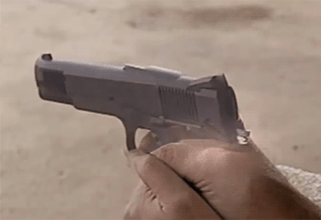
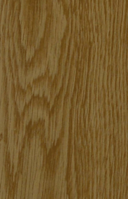
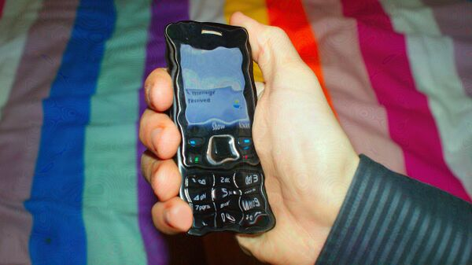
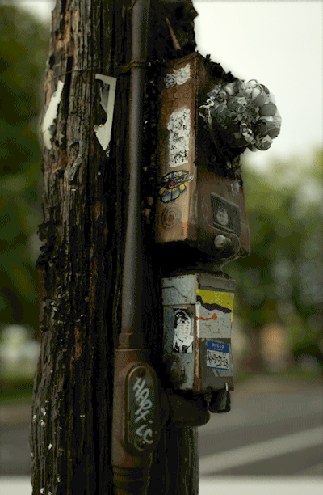

[◀返回](./home.md)

# 漂移

**白狼喝水** by **Anonymous** \- 这个动态 .gif 是一个非常常见的[迷幻](../文档/药物分类/迷幻剂.md "迷幻")视觉漂移的图像示例喵，具体来说是[流动](#流动 "视觉漂移")的形式哦。

**漂移**被定义为一种体验，就是物体和风景的纹理、形状和一般结构看起来在逐渐扭曲、融化，并在它们自身之间变形呢。[\[1\]](#cite_note-BersaniCorazza2014-1)[\[2\]](#cite_note-KleinmanGillin1977-2)[\[3\]](#cite_note-MuthukumaraswamyCarhart-Harris2013-3) 当一个人盯着看的时候，这些改变的强度会逐渐增加，但它们是暂时的，一旦人把视线移开再看，它们就会恢复到正常的样子哦。

这种效应能够在下面描述的4个不同强度级别上显现出来：

1.  **边缘** \- 在最低级别，视觉漂移可以被描述为外部环境中的直线在摆动。这只发生在人的周边视觉中，不能被直接注视到喵。
2.  **直接** \- 在这个级别，视觉漂移的强度不一定会增加，但现在可以在人的中心视线内直接看到了。这部分改变了外部环境中形状、物体和风景的外观和形式，导致它们微妙地漂移、弯曲和变形呢。
3.  **清晰** \- 在这个级别，视觉漂移变得足够强大，可以彻底改变人外部环境中特定形状的物体。如果一个人盯着一个固定点并保持眼睛相对不动，这种效果可以强大到让物体逐渐变得让人认不出原来的样子哦。
4.  **全包围** \- 在视觉漂移的最高级别，强度变得足够强大，不仅扭曲特定的物体，而且扭曲人视觉的每一个点和整个外部环境。这创造了一个极度模糊、扭曲和混合的不可识别的视觉数据团喵。

漂移通常伴随着其他同时发生的效应，比如[对称纹理重复](../药效/对称纹理重复.md "对称纹理重复")和[残影](../药效/残影.md "残影")。[\[1\]](#cite_note-BersaniCorazza2014-1)[\[4\]](#cite_note-PapoutsisNikolaou2014-4) 它通常是在[中等](../文档/给药剂量.md#common "剂量") [剂量](../文档/给药剂量.md "剂量")的[迷幻剂](../文档/药物分类/迷幻剂.md "迷幻剂")类化合物影响下产生的，比如[LSD](../药物/LSD.md "LSD")、[赛洛西宾](../药物/赛洛西宾蘑菇.md "赛洛西宾")和[麦斯卡林](../药物/麦斯卡林.md "麦斯卡林")。然而，在某些[兴奋剂](../文档/药物分类/兴奋剂.md "兴奋剂")和[解离剂](../文档/药物分类/解离剂.md "解离剂")（如[MDMA](../药物/MDMA.md "MDMA")或[3-MeO-PCP](../药物/3-MeO-PCP.md "3-MeO-PCP")）的影响下，也会发生程度较轻的漂移呢。

这种视觉效果的具体风格取决于扭曲的特定、不断变化的方向、速度和节奏。这导致了一小部分不同的表现形式，定义和列举如下：

## 目录

* [1 变形](#变形)
* [2 呼吸](#呼吸)
* [3 融化](#融化)
* [4 流动](#流动)
* [5 图像示例](#图像示例)
* [6 变体](#变体)
* [7 精神活性物质](#精神活性物质)
* [8 体验报告](#体验报告)
* [9 另见](#另见)
* [10 外部链接](#外部链接)
* [11 参考文献](#参考文献)

#### 变形

变形可以被描述为一种视觉漂移的风格，它的节奏和方向完全是杂乱无章和自发的喵。它导致物体和风景在大小、形状和配置上看起来逐渐变化、变形和扭曲。

#### 呼吸

呼吸可以被描述为一种视觉漂移的风格，它导致物体和风景看起来以一致的节奏稳定地向内收缩和向外扩张，就像生物的肺一样在呼吸呢。

#### 融化

融化可以被描述为一种视觉漂移的风格，它导致物体和风景的纹理看起来完全或部分融化了哦。它在较低强度时开始于物体纹理的逐渐扭曲，导致它们微妙地下垂、摆动并失去结构完整性。这逐渐增加，直到变得无法忽视，因为固体物体之间的线条、纹理和颜色以一种极度流动的风格融化在了一起喵。

#### 流动

流动可以被描述为一种视觉漂移的风格，它似乎几乎只发生在纹理上（特别是如果它们看起来非常详细、复杂或粗糙的话）。它导致纹理看起来像河流一样在一个无缝的、循环的动画中流动。这在木纹或动物的皮毛上特别常见呢。

#### 图像示例

|  | [标题](../药效/属性:标题.md "属性:标题") |
| --- | --- |
|  | **小仙女露西** by **[StingrayZ](../用户/StingrayZ.md "User:StingrayZ")** |
|  | **漂移的枪** by **Anonymous** |
|  | **星月夜** by **[文森特·梵高](http://en.wikipedia.org/wiki/The_Starry_Night)** |
|  | **呼吸的木柱** by **[Chelsea Morgan](../用户/Replicatosaurus.md "User:Replicatosaurus")** |
|  | **对称漂移图案** by **Anonymous** |
|  | **客厅** by **[Chelsea Morgan](../用户/TheReplicator.md "User:TheReplicator")** |
|  | **红杉林** by **[CountRoloff](http://www.reddit.com/r/Drugs/comments/12plge/ate_some_shrooms_then_i_went_to_the_redwoods_took/)** |
|  | **摇摇晃晃的卧室** by **[Chelsea Morgan](../用户/TheReplicator.md "User:TheReplicator")** |
|  | **漂移的猫** by **Anonymous** |
|  | **视觉漂移** by **Anonymous** |
|  | **白狼喝水** by **Anonymous** |
|  | **手机** by **[Chelsea Morgan](../用户/TheReplicator.md "User:TheReplicator")** |
|  | **呼吸的木柱** by **Anonymous** |
|  | **漂移** by **Anonymous** |
|  | **流动的水果** by **Anonymous** |

#### 变体

每种潜在漂移风格的具体差异可以细分为以下变体，并且可能独立于效应强度发生哦：

*   **复杂 vs. 简单** – 漂移可以以一种向许多不同复杂方向扩散的方式改变外部环境，导致原始的感官输入看起来完全无法识别。或者，哪怕是在高剂量的精神活性物质下，它也可能仅仅由简单的翘曲、摆动和弯曲组成的喵。
*   **慢 vs. 快** – 漂移可以表现为以突然的速度发展的变化，在视野中产生快速的运动，或者当一个人盯着它看时，它可以逐渐表现并缓慢移动呢。
*   **平滑 vs. 抖动** – 漂移可以表现为平滑、流畅和无缝的运动，或者可以表现为抖动，帧率极低，以突然和局部的过渡移动哦。
*   **静止 vs. 稍纵即逝** – 漂移要么冻结在其扭曲的位置，直到人移开视线再看，要么本质上非常短暂，几乎在人试图直接看它的那一刻就重置了喵。
*   **逼真 vs. 不逼真** – 漂移在外观和运动上要么看起来令人信服地自然和栩栩如生，要么看起来极度像卡通、夸张和不真实呢。

<!-- 请勿删除或修改，这是一个标记，待识别并填坑（药效索引） -->

### 体验报告

在我们的[体验索引](../文档/教学索引页.md "体验索引")中描述这种效应的轶事报告包括：

* [Experience: 15mg 2C-B (oral) - A pleasant low-dose evening with Nexus](../报告/psychounautwiki/Experience:_15mg_2C-B_(oral)_-_A_pleasant_low-dose_evening_with_Nexus.md "Experience: 15mg 2C-B (oral) - A pleasant low-dose evening with Nexus")
* [Experience: 18 mg 2C-I - Visually intense and strong bodily sensations](../报告/psychounautwiki/Experience:_18_mg_2C-I_-_Visually_intense_and_strong_bodily_sensations.md "Experience: 18 mg 2C-I - Visually intense and strong bodily sensations")
* [Experience: 22mg 2C-B (oral) / 100ug 1P-LSD (sublingual) - My first time tripping alone (2 days in a row)](../报告/psychounautwiki/Experience:_22mg_2C-B_(oral)_/_100ug_1P-LSD_(sublingual)_-_My_first_time_tripping_alone_(2_days_in_a_row).md "Experience: 22mg 2C-B (oral) / 100ug 1P-LSD (sublingual) - My first time tripping alone (2 days in a row)")
* [Experience: 25mg 2C-E (oral) - A mindblowing experience](../报告/psychounautwiki/Experience:_25mg_2C-E_(oral)_-_A_mindblowing_experience.md "Experience: 25mg 2C-E (oral) - A mindblowing experience")
* [Experience: 300mg DXM (Oral) - Brink of the third](../报告/psychounautwiki/Experience:_300mg_DXM_(Oral)_-_Brink_of_the_third.md "Experience: 300mg DXM (Oral) - Brink of the third")
* [Experience: 32mg 2C-B - Bromo Mescaline](../报告/psychounautwiki/Experience:_32mg_2C-B_-_Bromo_Mescaline.md "Experience: 32mg 2C-B - Bromo Mescaline")
* [Experience: 36mg 4-AcO-DiPT - Truly, one for the psychedelic animals among us](../报告/psychounautwiki/Experience:_36mg_4-AcO-DiPT_-_Truly,_one_for_the_psychedelic_animals_among_us.md "Experience: 36mg 4-AcO-DiPT - Truly, one for the psychedelic animals among us")
* [Experience: 450 Datura seeds - Talking to Ghosts](../报告/psychounautwiki/Experience:_450_Datura_seeds_-_Talking_to_Ghosts.md "Experience: 450 Datura seeds - Talking to Ghosts")
* [Experience: 5-EAPB (60mg) + 2-FMA (20mg) + 4-AcO-DMT (10mg) - Emotional catharsis](../报告/psychounautwiki/Experience:_5-EAPB_(60mg)_%2B_2-FMA_(20mg)_%2B_4-AcO-DMT_(10mg)_-_Emotional_catharsis.md "Experience: 5-EAPB (60mg) + 2-FMA (20mg) + 4-AcO-DMT (10mg) - Emotional catharsis")
* [Experience: 80mg EPT - Bummer](../报告/psychounautwiki/Experience:_80mg_EPT_-_Bummer.md "Experience: 80mg EPT - Bummer")
* [Experience: 80mg EPT - Slight improvement](../报告/psychounautwiki/Experience:_80mg_EPT_-_Slight_improvement.md "Experience: 80mg EPT - Slight improvement")
* [Experience: LSD (Unknown dosage) - My experiences with LSD and anorexia/bulemia](../报告/psychounautwiki/Experience:_LSD_(Unknown_dosage)_-_My_experiences_with_LSD_and_anorexia/bulemia.md "Experience: LSD (Unknown dosage) - My experiences with LSD and anorexia/bulemia")
* [Experience:1000 Morning Glory seeds - Rediscovering the Self](../报告/psychounautwiki/Experience:1000_Morning_Glory_seeds_-_Rediscovering_the_Self.md "Experience:1000 Morning Glory seeds - Rediscovering the Self")
* [Experience:100ug 1P-LSD - A Fear and loathing into Bliss](../报告/psychounautwiki/Experience:100ug_1P-LSD_-_A_Fear_and_loathing_into_Bliss.md "Experience:100ug 1P-LSD - A Fear and loathing into Bliss")
* [Experience:1050 µg 1cP-LSD - The matrix](../报告/psychounautwiki/Experience:1050_%C2%B5g_1cP-LSD_-_The_matrix.md "Experience:1050 µg 1cP-LSD - The matrix")
* [Experience:1064mgs - Fascinating DXM experience - Unusual effects](../报告/psychounautwiki/Experience:1064mgs_-_Fascinating_DXM_experience_-_Unusual_effects.md "Experience:1064mgs - Fascinating DXM experience - Unusual effects")
* [Experience:120mg - Garden of The Gods](../报告/psychounautwiki/Experience:120mg_-_Garden_of_The_Gods.md "Experience:120mg - Garden of The Gods")
* [Experience:120µg LSD - First Bad Acid Trip, Psychosis](../报告/psychounautwiki/Experience:120%C2%B5g_LSD_-_First_Bad_Acid_Trip,_Psychosis.md "Experience:120µg LSD - First Bad Acid Trip, Psychosis")
* [Experience:150mg MDMA + 20mg 2C-B - I designed it this way myself](../报告/psychounautwiki/Experience:150mg_MDMA_%2B_20mg_2C-B_-_I_designed_it_this_way_myself.md "Experience:150mg MDMA + 20mg 2C-B - I designed it this way myself")
* [Experience:170mg 4-AcO-DMT - Recklessness rewarded](../报告/psychounautwiki/Experience:170mg_4-AcO-DMT_-_Recklessness_rewarded.md "Experience:170mg 4-AcO-DMT - Recklessness rewarded")
* [Experience:1mg 25c-NBOMe - Experiment in my room](../报告/psychounautwiki/Experience:1mg_25c-NBOMe_-_Experiment_in_my_room.md "Experience:1mg 25c-NBOMe - Experiment in my room")
* [Experience:2 grams Psilocybe Cubensis + 2.7 grams Syrian Rue - The Psilohuasca Albino Fox](../报告/psychounautwiki/Experience:2_grams_Psilocybe_Cubensis_%2B_2.7_grams_Syrian_Rue_-_The_Psilohuasca_Albino_Fox.md "Experience:2 grams Psilocybe Cubensis + 2.7 grams Syrian Rue - The Psilohuasca Albino Fox")
* [Experience:2 hits of LSD + weed - Mindfuck](../报告/psychounautwiki/Experience:2_hits_of_LSD_%2B_weed_-_Mindfuck.md "Experience:2 hits of LSD + weed - Mindfuck")
* [Experience:2 x 150 LSD tabs](../报告/psychounautwiki/Experience:2_x_150_LSD_tabs.md "Experience:2 x 150 LSD tabs")
* [Experience:2.5g - Swim's first mushroom trip](../报告/psychounautwiki/Experience:2.5g_-_Swim%27s_first_mushroom_trip.md "Experience:2.5g - Swim's first mushroom trip")
* [Experience:2.5g Mushrooms + 500mg DMT](../报告/psychounautwiki/Experience:2.5g_Mushrooms_%2B_500mg_DMT.md "Experience:2.5g Mushrooms + 500mg DMT")
* [Experience:2.5g Peganum Harmala + 250µg LSD - Ecstasy of Love and Misanthropy](../报告/psychounautwiki/Experience:2.5g_Peganum_Harmala_%2B_250%C2%B5g_LSD_-_Ecstasy_of_Love_and_Misanthropy.md "Experience:2.5g Peganum Harmala + 250µg LSD - Ecstasy of Love and Misanthropy")
* [Experience:2.5g Syrian rue + 6g Mimosa Hostilis - Becoming God (my second experience with unity)](../报告/psychounautwiki/Experience:2.5g_Syrian_rue_%2B_6g_Mimosa_Hostilis_-_Becoming_God_(my_second_experience_with_unity).md "Experience:2.5g Syrian rue + 6g Mimosa Hostilis - Becoming God (my second experience with unity)")
* [Experience:20x Extract - a tall humanoid figure wearing a white cloak](../报告/psychounautwiki/Experience:20x_Extract_-_a_tall_humanoid_figure_wearing_a_white_cloak.md "Experience:20x Extract - a tall humanoid figure wearing a white cloak")
* [Experience:225ug - Sheer Awe and Joy](../报告/psychounautwiki/Experience:225ug_-_Sheer_Awe_and_Joy.md "Experience:225ug - Sheer Awe and Joy")
* [Experience:225ug LSD + 9g cubensis - Galactic Melt and the Meverse](../报告/psychounautwiki/Experience:225ug_LSD_%2B_9g_cubensis_-_Galactic_Melt_and_the_Meverse.md "Experience:225ug LSD + 9g cubensis - Galactic Melt and the Meverse")
* [Experience:250 seeds - Harsh body load](../报告/psychounautwiki/Experience:250_seeds_-_Harsh_body_load.md "Experience:250 seeds - Harsh body load")
* [Experience:250mg MDA / 250mg MDMA - unnecessarily large dosage](../报告/psychounautwiki/Experience:250mg_MDA_/_250mg_MDMA_-_unnecessarily_large_dosage.md "Experience:250mg MDA / 250mg MDMA - unnecessarily large dosage")
* [Experience:25mg (insufflated) - Simultaneously amazing and horrible](../报告/psychounautwiki/Experience:25mg_(insufflated)_-_Simultaneously_amazing_and_horrible.md "Experience:25mg (insufflated) - Simultaneously amazing and horrible")
* [Experience:25mg Quetiapine - Nice buzz](../报告/psychounautwiki/Experience:25mg_Quetiapine_-_Nice_buzz.md "Experience:25mg Quetiapine - Nice buzz")
* [Experience:2g Syrian rue + 1g Mimosa Hostilis - These voices are the building blocks of consciousness](../报告/psychounautwiki/Experience:2g_Syrian_rue_%2B_1g_Mimosa_Hostilis_-_These_voices_are_the_building_blocks_of_consciousness.md "Experience:2g Syrian rue + 1g Mimosa Hostilis - These voices are the building blocks of consciousness")
* [Experience:2mg 25C-NBOMe - Experimental trip to test personal limits of NBOMes](../报告/psychounautwiki/Experience:2mg_25C-NBOMe_-_Experimental_trip_to_test_personal_limits_of_NBOMes.md "Experience:2mg 25C-NBOMe - Experimental trip to test personal limits of NBOMes")
* [Experience:3 drops of cinnamon bark oil/ 5 drops of german chamomile oil/ 2mL of nutmeg oil in lecithin - experiments with nutmeg oil](../报告/psychounautwiki/Experience:3_drops_of_cinnamon_bark_oil/_5_drops_of_german_chamomile_oil/_2mL_of_nutmeg_oil_in_lecithin_-_experiments_with_nutmeg_oil.md "Experience:3 drops of cinnamon bark oil/ 5 drops of german chamomile oil/ 2mL of nutmeg oil in lecithin - experiments with nutmeg oil")
* [Experience:3.5g Syrian rue + 30g Mimosa Hostilis brew - flying through a rainbow tunnel](../报告/psychounautwiki/Experience:3.5g_Syrian_rue_%2B_30g_Mimosa_Hostilis_brew_-_flying_through_a_rainbow_tunnel.md "Experience:3.5g Syrian rue + 30g Mimosa Hostilis brew - flying through a rainbow tunnel")
* [Experience:3.5g psilocybe cubensis - Relinquishing of Material Chains/Fear and Desolation](../报告/psychounautwiki/Experience:3.5g_psilocybe_cubensis_-_Relinquishing_of_Material_Chains/Fear_and_Desolation.md "Experience:3.5g psilocybe cubensis - Relinquishing of Material Chains/Fear and Desolation")
* [Experience:300µg AL-LAD - Don't worry, because you're everyone!](../报告/psychounautwiki/Experience:300%C2%B5g_AL-LAD_-_Don%27t_worry,_because_you%27re_everyone!.md "Experience:300µg AL-LAD - Don't worry, because you're everyone!")
* [Experience:300µg LSD - Togetherness and the Silent Dusk](../报告/psychounautwiki/Experience:300%C2%B5g_LSD_-_Togetherness_and_the_Silent_Dusk.md "Experience:300µg LSD - Togetherness and the Silent Dusk")
* [Experience:30mg (smoked) DMT - The Monolith](../报告/psychounautwiki/Experience:30mg_(smoked)_DMT_-_The_Monolith.md "Experience:30mg (smoked) DMT - The Monolith")
* [Experience:30mg - Horrible bodyload](../报告/psychounautwiki/Experience:30mg_-_Horrible_bodyload.md "Experience:30mg - Horrible bodyload")
* [Experience:30mg - Psychostimulant egodeath](../报告/psychounautwiki/Experience:30mg_-_Psychostimulant_egodeath.md "Experience:30mg - Psychostimulant egodeath")
* [Experience:30mg 4-HO-MiPT - Positively groovy](../报告/psychounautwiki/Experience:30mg_4-HO-MiPT_-_Positively_groovy.md "Experience:30mg 4-HO-MiPT - Positively groovy")
* [Experience:337mg DMT fumarate - A Day With DMT](../报告/psychounautwiki/Experience:337mg_DMT_fumarate_-_A_Day_With_DMT.md "Experience:337mg DMT fumarate - A Day With DMT")
* [Experience:354mg DXM, weed, nicotine - Descending into the void](../报告/psychounautwiki/Experience:354mg_DXM,_weed,_nicotine_-_Descending_into_the_void.md "Experience:354mg DXM, weed, nicotine - Descending into the void")
* [Experience:4-AcO-DMT + 200mg Pill](../报告/psychounautwiki/Experience:4-AcO-DMT_%2B_200mg_Pill.md "Experience:4-AcO-DMT + 200mg Pill")
* [Experience:4-HO-DET (20 mg, oral) - Tripping for my birthday](../报告/psychounautwiki/Experience:4-HO-DET_(20_mg,_oral)_-_Tripping_for_my_birthday.md "Experience:4-HO-DET (20 mg, oral) - Tripping for my birthday")

[... 更多结果](../报告/psychounautwiki/Special:Ask/-5B-5BCategory:Experience-5D-5D-20-5B-5BEffect::Drifting-5D-5D/mainlabel%3D/limit%3D50/offset%3D50/format%3Dul.md "Special:Ask/-5B-5BCategory:Experience-5D-5D-20-5B-5BEffect::Drifting-5D-5D/mainlabel=/limit=50/offset=50/format=ul")

### 另见

* [负责任的用药](../文档/负责任的用药索引页.md "负责任的用药")
* [主观效应索引](../药效/home.md "主观效应索引")
* [迷幻剂 - 主观效应](../文档/药物分类/迷幻剂.md#主观效应 "迷幻剂")
* [解离剂 - 主观效应](../文档/药物分类/解离剂.md#主观效应 "解离剂")
* [谵妄剂 - 主观效应](../文档/药物分类/谵妄剂.md#主观效应 "谵妄剂")

### 外部链接

* [视物变形症 (维基百科)](https://en.wikipedia.org/wiki/Metamorphopsia)
* [运动视错觉 (NIH)](https://www.ncbi.nlm.nih.gov/pubmed/14610133)

### 参考文献

1. ↑ [1.0](#cite_ref-BersaniCorazza2014_1-0) [1.1](#cite_ref-BersaniCorazza2014_1-1) Bersani, Francesco Saverio; Corazza, Ornella; Albano, Gabriella; Valeriani, Giuseppe; Santacroce, Rita; Bolzan Mariotti Posocco, Flaminia; Cinosi, Eduardo; Simonato, Pierluigi; Martinotti, Giovanni; Bersani, Giuseppe; Schifano, Fabrizio (2014). "25C-NBOMe: Preliminary Data on Pharmacology, Psychoactive Effects, and Toxicity of a New Potent and Dangerous Hallucinogenic Drug". *BioMed Research International*. **2014**: 1–6. [doi](http://en.wikipedia.org/wiki/Digital_object_identifier "wikipedia:Digital object identifier"):[10.1155/2014/734749](//doi.org/10.1155%2F2014%2F734749). [ISSN](http://en.wikipedia.org/wiki/International_Standard_Serial_Number "wikipedia:International Standard Serial Number") [2314-6133](//www.worldcat.org/issn/2314-6133). 
2. [↑](#cite_ref-KleinmanGillin1977_2-0) Kleinman, J. E.; Gillin, J. C.; Wyatt, R. J. (1977). "A Comparison of the Phenomenology of Hallucinogens and Schizophrenia From Some Autobiographical Accounts*". *Schizophrenia Bulletin*. **3** (4): 560–586. [doi](http://en.wikipedia.org/wiki/Digital_object_identifier "wikipedia:Digital object identifier"):[10.1093/schbul/3.4.560](//doi.org/10.1093%2Fschbul%2F3.4.560). [ISSN](http://en.wikipedia.org/wiki/International_Standard_Serial_Number "wikipedia:International Standard Serial Number") [0586-7614](//www.worldcat.org/issn/0586-7614). 
3. [↑](#cite_ref-MuthukumaraswamyCarhart-Harris2013_3-0) Muthukumaraswamy, S. D.; Carhart-Harris, R. L.; Moran, R. J.; Brookes, M. J.; Williams, T. M.; Errtizoe, D.; Sessa, B.; Papadopoulos, A.; Bolstridge, M.; Singh, K. D.; Feilding, A.; Friston, K. J.; Nutt, D. J. (2013). "Broadband Cortical Desynchronization Underlies the Human Psychedelic State". *Journal of Neuroscience*. **33** (38): 15171–15183. [doi](http://en.wikipedia.org/wiki/Digital_object_identifier "wikipedia:Digital object identifier"):[10.1523/JNEUROSCI.2063-13.2013](//doi.org/10.1523%2FJNEUROSCI.2063-13.2013). [ISSN](http://en.wikipedia.org/wiki/International_Standard_Serial_Number "wikipedia:International Standard Serial Number") [0270-6474](//www.worldcat.org/issn/0270-6474). 
4. [↑](#cite_ref-PapoutsisNikolaou2014_4-0) Papoutsis, Ioannis; Nikolaou, Panagiota; Stefanidou, Maria; Spiliopoulou, Chara; Athanaselis, Sotiris (2014). "25B-NBOMe and its precursor 2C-B: modern trends and hidden dangers". *Forensic Toxicology*. **33** (1): 1–11. [doi](http://en.wikipedia.org/wiki/Digital_object_identifier "wikipedia:Digital object identifier"):[10.1007/s11419-014-0242-9](//doi.org/10.1007%2Fs11419-014-0242-9). [ISSN](http://en.wikipedia.org/wiki/International_Standard_Serial_Number "wikipedia:International Standard Serial Number") [1860-8965](//www.worldcat.org/issn/1860-8965).

