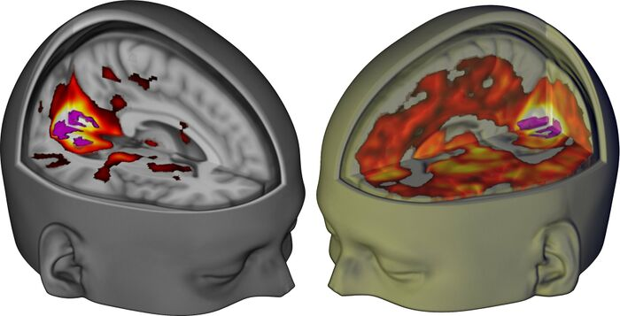
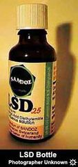

[◀返回](./home.md)

# LSD

<mark>尽管是长文，但是翻译得还是不错!</mark>

>
> 《主播女孩重度依赖》中糖糖吃的魔法邮票，似乎在o圈有至少一个已确认的击杀记录
>

| 概览 | LSD |
| --- | --- |
| **图片** |  |
| **俗名** | LSD, LSD-25, Lucy, L, Acid, Cid, Tabs, Blotter |
| **取代名称** | *d-Lysergic acid diethylamide* (d-麦角酸二乙酰胺) |
| **系统名** | *(6aR,9R)-N,N-Diethyl-7-methyl-4,6,6a,7,8,9-hexahydroindolo-[4,3-fg]quinoline-9-carboxamide* |
| **分类** | |
| **精神药效分类** | [迷幻剂](../文档/药物分类/迷幻剂.md) |
| **化学分类** | [麦角酸酰胺类物质](../文档/药物分类/麦角酸酰胺类物质.md) |
| **[给药途径](../文档/给药途径.md)** | **舌下含服** |
| **警告** | 始终从低剂量开始，因为个体体重、耐受性、新陈代谢和个人敏感度存在差异。[参见伤害减少措施](../文档/药物应对措施/home.md)。 |
| **[生物利用度](../文档/给药剂量.md#Bioavailability)** | 71% - 71%[\[1\]](#cite_note-1) |
| **[给药剂量](../文档/给药剂量.md)** | |
| [阈值](../文档/给药剂量.md#阈值) | 15 µg |
| [轻微](../文档/给药剂量.md#轻微) | 15 - 75 µg |
| [中等](../文档/给药剂量.md#中等) | 75 - 150 µg |
| [强烈](../文档/给药剂量.md#强烈) | 150 - 300 µg |
| [严重](../文档/给药剂量.md#严重) | 300 µg + |
| **[药效时长](../文档/药效时长.md)** | |
| [总时长](../文档/药效时长.md#总时长) | 8 - 12 小时 |
| [药效发作](../文档/药效时长.md#药效发作) | 15 - 30 分钟 |
| [药效上升](../文档/药效时长.md#药效上升) | 45 - 90 分钟 |
| [药效达峰](../文档/药效时长.md#药效达峰) | 3 - 5 小时 |
| [药效褪去](../文档/药效时长.md#药效褪去) | 3 - 5 小时 |
| [药效残余](../文档/药效时长.md#药效残余) | 12 - 48 小时 |
| **免责声明** | 本站的[剂量](../文档/给药剂量.md)信息仅供教育目的，收集自用户和[网络](../关于本站/home.md)。这并非推荐，应与其他来源核实准确性。 |
| **相互作用** | |
| [大麻](../药物/四氢大麻酚（THC）.md) | ⚠️ 谨慎连用 |
| [兴奋剂](../文档/药物分类/兴奋剂.md) | ⚠️ 谨慎连用 |
| [曲马多](../药物/曲马多.md) | ⛔ 严禁联用 |
| [谵妄剂](../文档/药物分类/谵妄剂.md) | ⛔ 严禁联用 |
| 三环类抗抑郁药 | ⛔ 严禁联用 |
| 利托那韦 | ⛔ 严禁联用 |
| [锂盐](../药物/锂盐.md) | ⛔ 严禁联用 |

**麦角酸二乙酰胺**（Lysergic acid diethylamide，也称为 **Lysergide**、**LSD-25**、**LSD**、**L**、**Lucy** 和 **Acid**）是[麦角酸酰胺类物质](../文档/药物分类/麦角酸酰胺类物质.md)中的一种经典[迷幻剂](../文档/药物分类/迷幻剂.md)[\[2\]](#cite_note-Nichols2016-2)。它可能是研究最多、文化影响力最大的迷幻物质，也是麦角酸酰胺类物质的原型。其作用机制尚未完全明了，但一般认为涉及[血清素](../文档/home.md)受体的结合活性。

LSD 的精神活性效应最早由 Sandoz 实验室（瑞士）的 [Albert Hofmann](https://en.wikipedia.org/wiki/Albert_Hofmann) 于 1943 年发现[\[3\]](#cite_note-3)。在 20 世纪 50 年代，它被 Sandoz 广泛分发作为心理治疗和科学研究的实验药物[\[4\]](#cite_note-Schmid2015-4)；在这个时期，它引起了知识界的极大兴趣，甚至成为美国中央情报局（CIA）秘密调查“精神控制”潜在应用的主题[\[5\]](#cite_note-SenateReport1977-5)。

娱乐性 LSD 的使用成为 20 世纪 60 年代青年反主流文化运动的一个核心且高度可见的方面，最终导致了 1971 年的国际禁令[\[6\]](#cite_note-NicholsChemistryWorld-6)[\[7\]](#cite_note-Convention1971-7)。如今，非法的娱乐性使用仍然广泛存在，并在流行文化中与反主流文化和锐舞（Rave）场景联系在一起。美国成年人中 LSD 的终身使用率为 6-8%[\[8\]](#cite_note-8)。

经过数十年的制度性压制，涉及 LSD 的科学研究最近经历了大规模的复兴[\[4\]](#cite_note-Schmid2015-4)。作为所谓“迷幻复兴”的一部分[\[9\]](#cite_note-9)，目前正在研究其在治疗多种疾病方面的应用，包括酒精中毒[\[10\]](#cite_note-KrebsJohansen2012-10)、物质成瘾[\[11\]](#cite_note-Winkelman2015-11)、丛集性头痛[\[12\]](#cite_note-SewellHalpernPope2006-12)、自闭症[\[13\]](#cite_note-De_GregorioPopicEnns2021-13)以及与绝症相关的[焦虑](../药效/焦虑.md)[\[14\]](#cite_note-SchimmelBreeksemaSmith-Apeldoorn2021-14)。

[主观效应](../药效/home.md)包括[视觉几何](../药效/视觉几何.md) / [幻觉状态](../药效/幻觉状态.md)、[时间扭曲](../药效/时间扭曲.md)、[内省增强](../药效/内省.md)、[概念性思维](../药效/概念性思维.md)、[音乐欣赏能力增强](../药效/音乐欣赏能力增强.md)、[欣快感](../药效/躯体欣快感.md)和[自我消解](../药效/自我消解.md)。据报道，LSD 的使用与神秘体验有关，有时声称能促进自我反省和个人成长[\[15\]](#cite_note-LyversMeester2012-15)。它被称为第一种现代致幻神剂（Entheogen），这一类别通常仅限于传统的植物制剂或提取物[\[16\]](#cite_note-16)。

与大多数被高度禁止的物质不同，LSD 尚未被证明具有生理毒性或成瘾性[\[2\]](#cite_note-Nichols2016-2)[\[17\]](#cite_note-17)。然而，不良的心理反应，如严重的[焦虑](../药效/焦虑.md)、[偏执](../药效/偏执.md)、[妄想](../药效/妄想.md)和[精神病](../药效/精神病.md)始终是可能的，特别是对于那些有精神障碍倾向的人（见[此部分](#毒性与伤害减少)）[\[18\]](#cite_note-18)。

如果使用此物质，强烈建议采取[伤害减少措施](../文档/药物应对措施/home.md)。

目录
--------

* [1 历史与文化](#历史与文化)
    + [1.1 名称](#名称)
* [2 化学](#化学)
* [3 药理学](#药理学)
    + [3.1 "闪回" (Flashbacks)](#闪回)
* [4 主观效应](#主观效应)
    + [4.1 **躯体效应**](#躯体效应)
    + [4.2 **视觉效应**](#视觉效应)
        - [4.2.1 增强](#增强)
        - [4.2.2 扭曲](#扭曲)
        - [4.2.3 几何](#几何)
        - [4.2.4 幻觉状态](#幻觉状态)
    + [4.3 **认知效应**](#认知效应)
    + [4.4 **听觉效应**](#听觉效应)
    + [4.5 **多重感官效应**](#多重感官效应)
    + [4.6 **超个人效应**](#超个人效应)
    + [4.7 药物联用效应](#药物联用效应)
    + [4.8 体验报告](#体验报告)
* [5 形式](#形式)
* [6 研究](#研究)
    + [6.1 酒精中毒](#酒精中毒)
    + [6.2 创伤相关疼痛](#创伤相关疼痛)
    + [6.3 丛集性头痛](#丛集性头痛)
    + [6.4 临终焦虑](#临终焦虑)
    + [6.5 神经可塑性](#神经可塑性)
* [7 试剂测试结果](#试剂测试结果)
* [8 毒性与伤害减少](#毒性与伤害减少)
    + [8.1 精神病与精神障碍风险](#精神病与精神障碍风险)
    + [8.2 依赖性与滥用潜力](#依赖性与滥用潜力)
        - [8.2.1 耐受性](#耐受性)
    + [8.3 药物过量](#药物过量)
    + [8.4 伪冒品 ("假酸")](#伪冒品_假酸)
    + [8.5 幻觉持续感知障碍 (HPPD)](#幻觉持续感知障碍_HPPD)
    + [8.6 **相互作用**](#相互作用)
        - [8.6.1 危险的相互作用](#危险的相互作用)
        - [8.6.2 **其他相互作用**](#其他相互作用)
* [9 知名人士](#知名人士)
* [10 法律地位](#法律地位)
* [11 另见](#另见)
* [12 外部链接](#外部链接)
    + [12.1 参考文献](#参考文献)
    + [12.2 讨论](#讨论)
    + [12.3 伤害减少资源](#伤害减少资源)
* [13 文献](#文献)
    + [13.1 实验性](#实验性)
    + [13.2 临床](#临床)
    + [13.3 综合](#综合)
* [14 延伸阅读](#延伸阅读)
    + [14.1 书籍](#书籍)
    + [14.2 媒体](#媒体)
* [15 脚注](#脚注)
* [16 参考文献](#参考文献_2)

历史与文化
-------------------

LSD 最初的合成记录于 1938 年 11 月 16 日，由瑞士化学家 Albert Hofmann 在瑞士巴塞尔的 Sandoz 实验室工作时完成[\[19\]](#cite_note-Nichols-19)。该化合物是作为一个大型研究项目的一部分合成的，旨在寻找麦角菌（一种生长在黑麦和其他谷物上的真菌）的医学上有用的衍生物。

然而，直到五年后，Hofmann 声称他在骑自行车回家前意外摄入了一定量的该化学物质，才发现它具有精神活性[\[19\]](#cite_note-Nichols-19)。

第一次有意的摄入记录于 1943 年 4 月 19 日[\[20\]](#cite_note-LsdMyProblemChild-20)。Hofmann 摄入了 250 微克 (µg) 的 LSD，根据其他麦角[生物碱](../文档/药物分类/home.md)的剂量，他认为这是一个[阈值](../文档/给药剂量.md#阈值)剂量。他发现其效果比预期的要强得多，并对其深刻的改变心智的效果印象深刻。4 月 19 日现在每年都被作为“自行车日”来庆祝。

1947 年，Sandoz 以 *Delysid* 的名称向医学界推出了 LSD，将其作为一种实验工具进行营销，用于在正常人中诱导暂时的类精神病状态（“模型精神病”），并在后来用于辅助心理治疗（“精神松解”或“迷幻”疗法）[\[20\]](#cite_note-LsdMyProblemChild-20)。该物质一经发布便产生了重大影响——在 15 年内，关于 LSD 和其他[致幻剂](../文档/药物分类/迷幻剂.md)的研究产生了超过 1,000 篇科学论文，并被处方给超过 40,000 名患者[\[21\]](#cite_note-21)。

在 20 世纪 50 年代，美国中央情报局 (CIA) 创建了一个代号为 [MK-ULTRA](https://en.wikipedia.org/wiki/Project_MKUltra) 的研究项目，进行秘密研究，调查 LSD 在“精神控制”和化学战中的应用。
实验包括在不知情或未同意的情况下向 CIA 雇员、军事人员、医生、妓女、精神病患者和普通公众施用该物质，这导致至少一人死亡[\[5\]](#cite_note-SenateReport1977-5)。

1963 年，Sandoz 对 LSD 的专利到期。几位著名的知识分子，包括 Aldous Huxley、Timothy Leary、Al Hubbard 和 Alan Watts 开始倡导大众消费 LSD；根据 L. R. Veysey 的说法，他们深刻地影响了新一代青年的思想[\[22\]](#cite_note-22)。LSD 成为 20 世纪 60 年代青年主导的反主流文化的一个核心且高度可见的特征，引发了美国公民社会的广泛争议和反弹。

1968 年 10 月 24 日，在美国持有 LSD 成为非法[\[23\]](#cite_note-23)。最后一次 FDA 批准的患者研究于 1980 年结束，而一项针对健康志愿者的研究是在 20 世纪 80 年代后期进行的。在瑞士，经法律批准和监管的 LSD 精神病学使用一直持续到 1993 年[\[24\]](#cite_note-24)。

### 名称

名称 *LSD* 来自其早期研究代号 *LSD-25*，是德语拼写 "Lysergsäure-diethylamid" 的缩写，后跟一个序列号[\[20\]](#cite_note-LsdMyProblemChild-20)。

LSD 有许多街头名称，包括：**acid**、**lucy**、**L**、**cid** 或 **sid**。也称为 **blotter**（吸墨纸/邮票）或 **tabs**（贴片），这是指它们标准的分发形式。

化学
---------

LSD，即 d-麦角酸二乙酰胺，属于一类称为[麦角酸酰胺类物质](../文档/药物分类/麦角酸酰胺类物质.md)（麦角灵的一个子类）的合成有机化合物。

它是麦角酸酰胺家族的“母体化合物”，这意味着它是其结构衍生物的一系列化合物的原型，这些化合物具有广泛相似的效果。这些包括：[1B-LSD](../药物/1B-LSD.md)、[1P-LSD](../药物/1P-LSD.md)、[1V-LSD](../药物/1V-LSD.md)、[ALD-52](../药物/ALD-52.md)、[AL-LAD](../药物/AL-LAD.md)、[ETH-LAD](../药物/ETH-LAD.md)、[PRO-LAD](../药物/PRO-LAD.md)、[LSM-775](../药物/LSM-775.md)、[LSZ](../药物/LSZ.md) 和 [MiPLA](../药物/MiPLA.md)。

其化学结构由一个与双环喹啉基团（麦角酸）稠合的双环六氢吲哚环组成。在喹啉的碳 8 位上结合了一个 N,N-二乙基甲酰胺。它还在碳 6 位上被一个甲基取代。

它是一种手性化合物，在 R5 和 R8 处有两个立体中心。LSD 的活性形式称为 (+)-D-LSD，其绝对构型为 (5*R*, 8*R*)。其他三种立体异构体不具有精神活性属性[\[25\]](#cite_note-TiHKAL-25)。

纯品形式为无色、无味、棱柱状晶体[\[26\]](#cite_note-26)。它对氧气、紫外线和氯（尤其是在溶液中）敏感[\[25\]](#cite_note-TiHKAL-25)。如果避光防潮并在 0°C 或以下的低温下储存，其效力可持续数年，但在常温 (25°C) 下会缓慢降解[\[27\]](#cite_note-27)。

药理学
------------

这张图片显示了在闭眼状态下，LSD 作用下的大脑（右图）比安慰剂作用下的大脑（左图）有更多的部分参与了视觉体验。

这种效应的幅度与参与者报告的复杂、梦幻般的视觉体验相关[\[28\]](#cite_note-28)。

LSD 对各种受体的结合亲和力[\[note 1\]](#cite_note-29)。

[解离常数](https://en.wikipedia.org/wiki/Dissociation_constant) (Ki) 越低，LSD 与该受体的结合越强（即亲和力越高）。水平线代表 LSD 在人体血浆中的近似浓度值，因此，高于该线的受体亲和力不太可能参与 LSD 的效应。

更多信息：[血清素能迷幻剂](../文档/药物分类/迷幻剂.md)

根据各种研究，LSD 在大多数[血清素](../文档/home.md)[受体](../文档/受体蛋白.md)亚型上充当[部分激动剂](../文档/受体-配体结合模型.md)，包括 5-HT1A、5-HT2A、5-HT2B、5-HT2C 和 5-HT6 受体，具有高亲和力[\[29\]](#cite_note-30)。5-HT3 和 5-HT4 受体除外。尚未在人体中发现的 5-HT5B 受体对 LSD 也有高亲和力[\[30\]](#cite_note-31)。

LSD 的[迷幻](../文档/药物分类/迷幻剂.md)效应机制被认为是 5-HT2A、5-HT2C 和 5-HT1A 受体亚型的[激动剂](../文档/受体-配体结合模型.md)（结合）活性，具有高亲和力[\[31\]](#cite_note-32)[\[32\]](#cite_note-33)[\[33\]](#cite_note-34)[\[34\]](#cite_note-35)。

最近的研究还发现，即使结合到相同的受体位点，LSD 激活的细胞内信号级联也与内源性血清素不同[\[35\]](#cite_note-36)。由于细胞内信号级联影响基因表达，LSD 诱导的细胞内信号事件可能会不适当地改变基因表达，进而可能导致神经元状态和随后的认知的变化[\[36\]](#cite_note-CNichols-37)。

这些发现有助于解释为什么其行为效应在人类中可能类似于偏执型精神分裂症。

该研究的结论是，急性 LSD 使用增加了哺乳动物大脑中一小组基因的表达，这些基因涉及广泛的细胞功能，包括突触可塑性、谷氨酸能信号传导、细胞骨架结构以及突触与细胞核之间的通讯[\[36\]](#cite_note-CNichols-37)。

此外，研究表明 LSD 对所有[多巴胺](../文档/home.md)和所有[去甲肾上腺素](../文档/肾上腺素受体.md)受体具有结合功效。大多数[血清素能迷幻剂](../文档/药物分类/迷幻剂.md)并不具有显著的[多巴胺能](../文档/home.md)，因此 LSD 在这方面是独特的。
特别是，LSD 在 D2 受体上的激动剂活性已被证明对其主观效应有贡献[\[37\]](#cite_note-38)[\[38\]](#cite_note-39)。

### "闪回" (Flashbacks)

“闪回”现象的病因似乎多种多样。Krebs 和 Johansen (2015[\[39\]](#cite_note-40)) 等研究人员将至少部分病例归因于躯体症状障碍，即人们专注于在使用药物之前没有意识到的正常躯体体验和感知。其他研究人员将其与一种类似于人们在面临创伤或强烈情感体验后受到触发刺激时所面临的情境线索的联想反应联系起来 (Holland 和 Passie 2011[\[40\]](#cite_note-41))。关于风险因素是什么尚无共识，但一些研究人员推测，先前存在的精神病理学可能是一个重要的促成因素 (Abraham 和 Duffy 1996[\[41\]](#cite_note-42))。

[幻觉持续感知障碍](../药效/幻觉持续感知障碍.md) (HPPD) 的患病率难以估计，但似乎非常罕见 (Halpern 等 2016[\[42\]](#cite_note-43))，估计范围从短暂且较轻微的 1 型 HPPD 的 20 分之一用户，到更令人担忧的 2 型 HPPD 的 50,000 分之一用户[\[43\]](#cite_note-44)。

与互联网上流传的关于 LSD 长期储存在脊髓或身体其他部位的谣言相反[\[44\]](#cite_note-45)，药理学证据 (Passie 等 2008[\[45\]](#cite_note-46)) 表明 LSD 的半衰期很短，为 175 分钟，经过酶代谢转化为极性更强且因此水溶性的化合物（如 2-oxo-3-hydroxy-LSD），并通过尿液排出。没有证据表明 LSD 在体内长期储存。

主观效应
------------------

与[赛洛西宾蕈](../药物/赛洛西宾蘑菇.md)、[LSA](../药物/lsa.md) 和 [死藤水](../药物/死藤水.md)等其他迷幻剂相比，据报道 LSD 在其躯体和认知效应方面更具刺激性和快节奏。观察到的各种效应可能归因于其除了[血清素](../文档/home.md)之外，还在一系列中枢神经系统受体（如[多巴胺](../文档/home.md)和[去甲肾上腺素](../文档/肾上腺素受体.md)受体）上具有所谓的“滥交”结合活性。

就[主观效应](../药效/home.md)而言，LSD 可以被描述为具有[赛洛西宾](../药物/赛洛西宾蘑菇.md)或 [DMT](../药物/DMT.md) 的[视觉](../药效/视觉效应.md)和[精神内容](../药效/认知效应.md)，同时具有经典[兴奋剂](../文档/药物分类/兴奋剂.md)（如[苯丙胺](../药物/苯丙胺.md)或[哌甲酯](../药物/哌甲酯.md)）的“[多巴胺能](../文档/home.md)边缘”。因此，LSD 的欣快感可以被描述为“中等强迫性”，高于[色胺类物质](../文档/4位取代色胺综合.md)，但不如某些基于[苯乙胺](../文档/药物分类/苯乙胺类物质.md)的[兴奋剂](../文档/药物分类/兴奋剂.md)或[共情剂](../文档/药物分类/home.md)高。

此外，与[赛洛西宾](../药物/赛洛西宾蘑菇.md)或[麦斯卡林](../药物/麦斯卡林.md)相比，它与稍微更多的认知副作用有关，如[焦虑](../药效/焦虑.md)和[偏执](../药效/偏执.md)。一些用户报告说，他们的药效消退期（comedown）更严酷，可能类似于[兴奋剂](../文档/药物分类/兴奋剂.md)，这可能是由于其持续时间长（10 小时以上）及其[多巴胺能](../文档/home.md)特性的敏感性。

***免责声明：**以下列出的效应引用了[***主观效应索引***](../药效/home.md) (**SEI**)，这是一个基于轶事用户报告和 [PsychonautWiki](../关于本站/home.md) 贡献者个人分析的开放研究文献。因此，应以健康的怀疑态度看待它们。*

*同样值得注意的是，这些效应不一定会以可预测或可靠的方式发生，尽管较高的剂量更可能诱发全方位的效应。*同样，**不良反应**随着剂量的增加而变得越来越可能，并可能包括**成瘾、严重伤害或死亡*** ☠.*

### **躯体效应**

*   **[神经发生](../药效/神经发生.md)**

*   **[刺激](../药效/刺激.md)** - LSD 通常被描述为非常有活力和刺激性，但并非强迫性的。例如，它倾向于鼓励身体活动，如散步、攀岩或跳舞。相比之下，其他常见的迷幻剂如[赛洛西宾](../药物/赛洛西宾蘑菇.md)或 [LSA](../药物/lsa.md) 通常具有镇静和久坐的倾向。

*   **[自发性躯体感觉](../药效/自发性躯体感觉.md)** - LSD 的“躯体快感”（body high）表现为一种欣快的、快速移动的、尖锐的、特定位置或全身性的刺痛感。[\[lower-alpha 1\]](#cite_note-47)

*   **[躯体欣快感](../药效/躯体欣快感.md)** - 某种形式的躯体欣快感可能在旅程的某些点出现。然而，与[共情剂](../文档/药物分类/home.md)或[阿片类药物](../文档/药物分类/吗啡喃类物质.md)的效应相比，它是有限且不一致的，并且很容易表现为没有任何明显原因的身体不适。

*   **[躯体轻盈感](../药效/躯体轻盈感.md)** - LSD 产生的刺激和能量可以使用户感觉好像他们在失重地移动。

*   **[触觉效应](../药效/触觉效应.md)** - 增强的触觉感受通常在大多数 LSD 旅程的中等水平上持续存在。[\[lower-alpha 2\]](#cite_note-48)

*   **[躯体形态感改变](../药效/躯体形态感改变.md)** - 这种效应通常伴随着温暖感或[统一感](../药效/统一感与互联感.md)，通常在体验的高峰期附近。用户可能会感觉好像他们实际上是其他物体的一部分或与之相连。[\[lower-alpha 3\]](#cite_note-49)

*   **[镇痛](../药效/镇痛.md)** - LSD 可以极大地减少或扭曲对疼痛的感知。这可能是由于多种因素造成的，因为致幻效应意味着疼痛可以被解释为不同的感觉（即来自疼痛刺激的搔痒感）。LSD 还具有可能有助于此效应的强效抗炎特性。[\[note 2\]](#cite_note-50)

*   **[体温调节抑制](../药效/体温调节抑制.md)**[\[4\]](#cite_note-Schmid2015-4) - LSD 似乎会导致身体失去部分调节体温的能力。虽然通常无害，但在极端炎热或寒冷的条件下服用 LSD 时，用户应小心。

*   **[体温升高](../药效/体温升高.md)**[\[46\]](#cite_note-51) - 据报道，在某些情况下可能会发生潜在危险的过热状态，特别是由于 LSD 会提高体内血清素，因此在较高剂量下更为明显。[\[lower-alpha 4\]](#cite_note-52)

*   **[恶心](../药效/恶心.md)** - 轻微的恶心偶尔会在中等到高剂量下报告，并且会在用户呕吐后消失或随着高峰期的到来而自行逐渐消退。

*   **[躯体控制增强](../药效/躯体控制增强.md)**

*   **[耐力增强](../药效/耐力增强.md)** - 用户进行身体活动的耐力可能会增强。一些用户还报告说使用小剂量来提高运动表现。然而，与[兴奋剂](../文档/药物分类/兴奋剂.md)的效果相比，这种效果通常较轻微。

*   **[食欲抑制](../药效/食欲抑制.md)** - LSD 可以以类似于（尽管不如）兴奋剂的方式抑制食欲，特别是对于油腻食物。[\[lower-alpha 5\]](#cite_note-53)

*   **[脱水](../药效/脱水.md)** - 可能会发生轻度至中度脱水。不如[兴奋剂](../文档/药物分类/兴奋剂.md)或[阿片类药物](../文档/药物分类/吗啡喃类物质.md)那么极端。

*   **[排尿困难](../药效/排尿困难.md)**

*   **[血压升高](../药效/血压升高.md)**[\[4\]](#cite_note-Schmid2015-4) - 由于该物质的[血管收缩](../药效/血管收缩.md)特性，血压随之升高。

*   **[心率增快](../药效/心率增快.md)**[\[4\]](#cite_note-Schmid2015-4)

*   **[出汗增加](../药效/出汗增加.md)**

*   **[肌肉紧张](../药效/肌肉紧张.md)**

*   **[肌肉痉挛](../药效/肌肉痉挛.md)**

*   **[过度打哈欠](../药效/过度打哈欠.md)** - 过度打哈欠经常被报道，特别是在药效上升阶段。

*   **[瞳孔扩大](../药效/瞳孔扩大.md)**[\[4\]](#cite_note-Schmid2015-4) - 瞳孔不等大，即两眼瞳孔扩张程度存在显著差异，也可能存在。在致幻剂使用的背景下，这种现象被认为是无害的。\[*[来源请求](../关于本站/home.md)*\]

*   **[唾液分泌增加](../药效/痰液增多.md)**

*   **[癫痫发作](../药效/癫痫发作.md)**[\[47\]](#cite_note-Fisher1967-54) - 非常罕见，但可能发生在易感人群中，特别是在身体负担重的情况下，如脱水、营养不良、过热或疲劳。

*   **[磨牙](../药效/磨牙.md)** - 轻度至中度。不如 [MDMA](../药物/MDMA.md) 强烈。

*   **[血管收缩](../药效/血管收缩.md)** - 剂量依赖性，但与[兴奋剂](../文档/药物分类/兴奋剂.md)、[25x-NBOMe](../文档/药物分类/N-苄基苯乙胺类物质.md) 或 [DOx](../药物分类/2,5-二甲氧基苯丙胺类物质.md) 相比均较弱。一些用户报告感觉寒冷，尤其是在四肢。

### **视觉效应**

* #### 增强
    + **[视觉锐度增强](../药效/视觉锐度增强.md)**
    + **[颜色增强](../药效/颜色增强.md)** - 与其他迷幻剂相比，这种效果通常被报道为更明亮和更具“光彩”的特征。
    + **[模式识别增强](../药效/模式识别增强.md)**
    + **[放大](../药效/放大.md)**
    + **[帧率增强](../药效/视觉加工加速.md)**

#### 扭曲
    + **[漂移](../药效/漂移.md)** *([融化](../药效/漂移.md)、[呼吸](../药效/漂移.md)、[变形](../药效/漂移.md)和[流动](../药效/漂移.md))* - 与其他迷幻剂相比，这种效果可以被描述为高度详细但在外观上像卡通。扭曲在运动中缓慢而平滑，在外观上转瞬即逝。
    + **[颜色偏移](../药效/颜色偏移.md)**
    + **[残影](../药效/残影.md)**
    + **[深度感知扭曲](../药效/深度感知扭曲.md)**
    + **[环境模式化](../药效/模式识别增强.md)**
    + **[透视扭曲](../药效/视觉扭曲.md)**
    + **[递归](../药效/递归.md)**
    + **[对称纹理重复](../药效/对称纹理重复.md)**
    + **[景色切割](../药效/景色切割.md)**

#### [几何](../药效/视觉几何.md)
LSD 的视觉几何形状可以被描述为在外观上更类似于 [2C-B](../药物/2C-B.md) 或 [2C-I](../药物/2C-I.md)，而不是 [赛洛西宾](../药物/赛洛西宾蘑菇.md)、[LSA](../药物/lsa.md) 或 [DMT](../药物/DMT.md)。它可以被[详尽地描述](../药效/视觉几何.md)为主要在复杂性上错综复杂，在形式上是算法的，在组织上是非结构化的，光线明亮，色彩丰富，感觉合成，色彩多变，阴影平坦，边缘锋利，尺寸巨大，速度快，运动平滑，角落有棱角，深度非沉浸式，强度一致。

    在较高剂量下，它倾向于产生 [8A 级](../药效/视觉几何.md)视觉几何状态，而不是 [8B 级](../药效/视觉几何.md)。非常高的剂量使血清素受体饱和，倾向于使人的视觉感知从彩虹几何形状饱和到白色虚空。

#### 幻觉状态
    LSD 能够产生全方位的低级和高级幻觉状态；然而，它们比其他迷幻色胺类物质如 [DMT](../药物/DMT.md) 或 [赛洛西宾蕈](../药物/赛洛西宾蘑菇.md) 明显更不一致和更不可再生。这些效应包括：

    + **[变形](../药效/变形.md)**

    + **[机械景观](../药效/机械景观.md)** - 一种罕见的效应，通常只在非常强烈到严重的剂量下发生，并且不如某些迷幻剂如 [DMT](../药物/DMT.md)、[赛洛西宾蕈](../药物/赛洛西宾蘑菇.md)、[2C-P](../药物/2C-P.md) 和非典型迷幻剂如 [鼠尾草](../药物/鼠尾草.md) 那样一致。

    + **[内部幻觉](../药效/内部幻觉.md)** (*[自主实体](../药效/自主实体.md)*；*[场景、风景和景观](../药效/场景、风景和景观.md)*；*[透视幻觉](../药效/透视幻觉.md)*和*[情景和情节](../药效/情景和情节.md)*) - 虽然一些用户报告 LSD 能够产生与 [赛洛西宾蕈](../药物/赛洛西宾蘑菇.md) 或 [DMT](../药物/DMT.md) 相同强度和生动性的幻觉状态，但这要罕见得多且更不一致。虽然传统的迷幻剂如 [LSA](../药物/lsa.md)、[死藤水](../药物/死藤水.md) 和 [麦斯卡林](../药物/麦斯卡林.md) 将在 5 级 [几何](../药效/视觉几何.md) 及以上几乎一致地诱导内部幻觉，但一些用户声称 LSD 倾向于直接进入 [8A 级](../药效/视觉几何.md) 视觉几何。这种缺乏一致诱导的幻觉突破意味着，对于大多数人来说，在不伴随过度副作用的剂量下，LSD 在深度上相对有限。

    + **[外部幻觉](../药效/外部幻觉.md)** (*[自主实体](../药效/自主实体.md)*；*[场景、风景和景观](../药效/场景、风景和景观.md)*；*[透视幻觉](../药效/透视幻觉.md)*和*[情景和情节](../药效/情景和情节.md)*)

### **认知效应**

*   **[分析能力增强](../药效/分析能力增强.md)** - 一些用户报告获得了以新颖和相对客观的方式分析情况的能力。目前尚不清楚这是否属实，或者只是该物质产生的一种感觉。
    + **[焦虑](../药效/焦虑.md)** & **[偏执](../药效/偏执.md)** - 在低到中等剂量下通常不被观察到，并且当考虑到[心境与环境](../文档/药物应对措施/准备工作.md)的基本规则时，发生的可能性较小。[\[note 3\]](#cite_note-55)
    + **[概念性思维](../药效/概念性思维.md)** - 一个标志性效应。LSD 可能允许用户绕过正常的认知模式（及其相关的局限性）。表现为横向或抽象的思维模式。
    + **[认知欣快感](../药效/认知欣快感.md)** - 与 [MDMA](../药物/MDMA.md)、[可卡因](../药物/可卡因.md) 和 [阿片类药物](../文档/药物分类/吗啡喃类物质.md) 相比，认知欣快感是有限且不一致的。与上述物质不同，迷幻剂带来的精神欣快感是“非强迫性的”，这意味着它需要预先存在的积极情绪状态。
    + **[心境平静](../药效/心境平静.md)** - 当一到三个剂量与心理治疗方案结合使用时，这种效应在所有经典迷幻剂中都会急性表现出来。在比较荟萃分析时，迷幻心理疗法在几种心理健康问题上的表现大大优于“黄金标准”治疗。
    + **[内省](../药效/内省.md)** - 存在于大多数剂量中。可能与个人偏见抑制一起发生。
    + **[个人偏见抑制](../药效/个人偏见抑制.md)** - 用户可能会觉得他们有能力以更客观的方式分析他们的生活或人际关系。目前尚不清楚这是否属实，或者只是该物质产生的一种感觉。
    + **[创造力增强](../药效/创造力增强.md)** - LSD 以其增强创造力和打破常规思维的能力而闻名。许多艺术家、音乐家、科学家和其他知识分子都使用过它，可追溯到 20 世纪 50 年代。[\[48\]](#cite_note-56)
    + **[新奇感增强](../药效/新奇感增强.md)** - 与其他物质相比，在 LSD 上非常突出。
    + **[专注力增强](../药效/专注力增强.md)** - 主要发生在低剂量或[阈值](../文档/给药剂量.md#阈值)剂量下，感觉不如[兴奋剂](../文档/药物分类/兴奋剂.md)那样强迫或尖锐。
    + **[沉浸感增强](../药效/沉浸感增强.md)** - 与其他物质相比，在 LSD 上非常突出，仅次于解离性沉浸感增强。
    + **[个人意义增强](../药效/个人意义增强.md)** - 用户可能会觉得他们的体验具有特殊的意义，这种意义在旅程结束后可能会持续，也可能不会。似乎取决于用户的[心境与环境](../文档/药物应对措施/准备工作.md)。
    + **[情绪增强](../药效/情绪增强.md)** - 用户体验情绪的能力可能会大大增强。这被认为有助于其治疗效果。因此，建议不要在情绪低落或不稳定时服用 LSD，并遵循[心境与环境](../文档/药物应对措施/准备工作.md)的原则。
    + **[共情、情感和社交能力增强](../药效/共情.md)** - 可能很突出，但与 MDMA 相比也不可靠。更多地依赖于剂量；较高剂量更可能导致内省和社交退缩。
    + **[妄想](../药效/妄想.md)** - 轻微的妄想可能在中等剂量下发生。严重的、持续的妄想通常限于较高剂量或个人易感性。
    + **[既视感](../药效/既视感.md)** - 不可靠，通常在较高剂量下发生。可能表明过量以及[妄想](../药效/妄想.md)和[精神病](../药效/精神病.md)的开始。
    + **[性欲增强](../药效/性欲增强.md)** - 与[兴奋剂](../文档/药物分类/兴奋剂.md)和[大麻](../药物/四氢大麻酚（THC）.md)相比通常不一致。发生时为轻度至中度。
    + **[音乐欣赏能力增强](../药效/音乐欣赏能力增强.md)** - 对许多用户来说非常突出。可能是其治疗效果的一部分。LSD 上的崇高或神秘体验通常与音乐有关。
    + **[幽默感增强](../药效/幽默感增强.md)** - 在 LSD 上非常常见，特别是在药效上升和高峰期。用户报告突然发现平凡的情况和行为莫名其妙地滑稽。[\[note 4\]](#cite_note-57)
        - **[大笑发作](../药效/大笑发作.md)** - 大笑发作很常见，特别是在[药效上升](../文档/药效时长.md#药效上升)阶段。如果周围有其他也受影响的人，它可能表现为无法控制的咯咯笑和大笑，形成反馈循环。
    + **[记忆抑制](../药效/记忆抑制.md)** - 存在于低-中等剂量以上的所有剂量水平。比[麦斯卡林](../药物/麦斯卡林.md)或[2C-B](../药物/2C-B.md)等[苯乙胺类物质](../文档/药物分类/苯乙胺类物质.md)强，但比[赛洛西宾](../药物/赛洛西宾蘑菇.md)或[DMT](../药物/DMT.md)等色胺类物质弱。
        - **[自我消解](../药效/自我消解.md)** - 一个标志性效应。可能伴有[欣快感](../药效/躯体欣快感.md)或[烦躁不安](../药效/烦躁不安.md)，具体取决于[心境与环境](../文档/药物应对措施/准备工作.md)。也伴有[时间扭曲](../药效/时间扭曲.md)和潜在的[思维循环](../药效/思维循环.md)。
    + **[动机增强](../药效/动机增强.md)** - LSD 在低剂量和微剂量下产生类似于兴奋剂的动机增强，尽管明显不那么突出或可靠。
    + **[多重思维流](../药效/多重思维流.md)**
    + **[自我替换](../药效/自我替换.md)** - 自我替换非常罕见，并且以不可预测的方式发生。这种效应通常与[妄想](../药效/妄想.md)同时发生，可能表明[精神病](../药效/精神病.md)的开始。它更可能发生在高剂量下。
    + **[人格退行](../药效/人格退行.md)** - LSD 上真正的人格退行非常罕见。更常见的是，它采取较温和的形式，即用户对童年早期有强烈的感觉，包括压抑的记忆。
    + **[同时情绪](../药效/同时情绪.md)**
    + **[暗示性增强](../药效/暗示性增强.md)** - 对外部影响的暗示性可能会大大增强。虽然可能对心理治疗有益，但这种属性可能会被不法分子（例如邪教领袖）滥用。建议用户对与谁一起服用 LSD 保持辨别力。
    + **[思维加速](../药效/思维加速.md)**
    + **[思维连通性](../药效/思维连通性.md)** - 一个标志性效应。思想可能感觉比平时更流畅和相互关联。可能与[概念性思维](../药效/概念性思维.md)和[创造力增强](../药效/创造力增强.md)一起发生。
    + **[思维循环](../药效/思维循环.md)** - 通常发生在较高剂量下，以及体验的高峰期。通常伴有[自我消解](../药效/自我消解.md)。大麻或兴奋剂可能会加剧或触发这种效应。
    + **[时间扭曲](../药效/时间扭曲.md)** - 一个标志性效应。用户对时间的感知可能会发生强烈改变。通常采取时间膨胀的形式，即体验到时间变慢，流逝得比清醒时慢得多。
    + **[清醒](../药效/清醒.md)** - 用户报告在摄入 LSD 后长达 10 小时（或更长时间）内难以或无法入睡。
    + **[成瘾抑制](../药效/成瘾抑制.md)**[\[49\]](#cite_note-krebs-58) - 一些研究表明 LSD 可用于治疗成瘾。据传闻，许多用户报告迷幻剂对此目的有帮助。

### **听觉效应**

*   **[听觉增强](../药效/听觉增强.md)** - 一些用户报告在 LSD 上听觉增强。然而，目前没有临床证据支持这一说法。
    + **[听觉扭曲](../药效/听觉扭曲.md)** - 声音可能显得“微弱”或“陌生”。更可能发生在较高剂量下。某些主观报告提到类似于音乐中的*镶边、延迟/回声、混响*等效果。
    + **[听觉幻觉](../药效/听觉幻觉.md)** - 通常存在于较高剂量下。不如视觉幻觉常见，但可能与它们一起发生。

### **多重感官效应**

*   **[联觉](../药效/联觉.md)** - 真正的联觉是罕见且不可再生的，尽管用户经常描述能够“听到颜色”和“看到声音”的感觉。增加剂量可以增加发生的可能性，但似乎主要发生在那些已经有联觉状态倾向的人身上。

### **[超个人](../药效/超个人.md)效应**

* 超个人状态经常在 LSD 的中等到高剂量下报告。它们似乎比大多数苯乙胺类物质（如 [麦斯卡林](../药物/麦斯卡林.md)、[2C-B](../药物/2C-B.md)）强，但比色胺类物质（如 [赛洛西宾](../药物/赛洛西宾蘑菇.md)、[DMT](../药物/DMT.md)）弱。强烈依赖于[心境与环境](../文档/药物应对措施/准备工作.md)。

    + **[存在主义自我实现](../药效/存在主义自我实现.md)**
    + **[灵性增强](../药效/灵性增强.md)**
    + **[统一感与互联感](../药效/统一感与互联感.md)**

### 药物联用效应

* **[酒精](../药物/酒精.md)** - 酒精的[抑制剂](../文档/药物分类/抑制剂.md)作用可用于减少 LSD 产生的一些[焦虑](../药效/焦虑.md)和[肌肉紧张](../药效/肌肉紧张.md)。然而，酒精也会导致[脱水](../药效/脱水.md)、[恶心](../药效/恶心.md)和[躯体疲劳](../药效/躯体疲劳.md)，这可能会对用户的心态（Set）产生负面影响。如果在使用 LSD 时饮酒，建议用户控制节奏，只喝平时量的一部分。
* **[苯二氮卓类物质](../文档/药物分类/苯二氮卓类物质.md)** - 苯二氮卓类物质通过抑制大脑电活动，非常有效地降低 LSD 的认知和视觉效应的强度。
* **[解离剂](../文档/药物分类/解离剂.md)** - LSD 增强解离剂的认知、视觉和一般幻觉效应。解离剂诱导的[空洞、空间和虚空](../药效/视觉断连.md)和[内部幻觉](../药效/内部幻觉.md)在 LSD 上变得更加生动和强烈。这些效应对应于[困惑](../药效/困惑.md)、[妄想](../药效/妄想.md)和[精神病](../药效/精神病.md)风险的增加。
* **[MDMA](../药物/MDMA.md)** - LSD 协同增强 MDMA 的躯体、认知和视觉效应。这些物质之间的协同作用是不可预测的，因此建议从明显低于单独服用任何一种物质的剂量开始。有一些证据表明 LSD 可以增加 MDMA 的神经毒性[\[50\]](#cite_note-59)[\[51\]](#cite_note-60)[\[52\]](#cite_note-61)。
* **[抗抑郁药](../药物/抗抑郁药.md)** 和 **[抗精神病药](../药物/抗精神病药.md)** 可能会通过作用于相同的受体并竞争其结合能力来阻断 LSD 的作用。抗抑郁药 [米氮平](../药物/米氮平.md) 和 [曲唑酮](../药物/曲唑酮.md) 作用于 5-HT2A 和 5-HT2C 受体，阻断血清素和其他分子的结合[\[53\]](#cite_note-62)。非典型抗精神病药也作用于这些受体，以减少幻觉和认知扭曲。

### 体验报告

目前我们的[体验索引](../报告/psychounautwiki/Experience_index)中有 47 篇描述该物质效应的体验报告。

* [Experience: 1 tab LSD - First Time Experience](../报告/psychounautwiki/Experience:_1_tab_LSD_-_First_Time_Experience)
* [Experience: 385μg LSD - A Fruit of My Endeavors](../报告/psychounautwiki/Experience:_385%CE%BCg_LSD_-_A_Fruit_of_My_Endeavors)
* [Experience: 660ug LSD - First bad trip](../报告/psychounautwiki/Experience:_660ug_LSD_-_First_bad_trip)
* [Experience: LSD (Unknown dosage) - My experiences with LSD and anorexia/bulemia](../报告/psychounautwiki/Experience:_LSD_(Unknown_dosage)_-_My_experiences_with_LSD_and_anorexia/bulemia)
* [Experience:1 blotter- LSD - My first exorcism](../报告/psychounautwiki/Experience:1_blotter-_LSD_-_My_first_exorcism)
* [Experience:1 hit LSD (unknown dosage) - Choose Asia](../报告/psychounautwiki/Experience:1_hit_LSD_(unknown_dosage)_-_Choose_Asia)
* [Experience:1,55mg LSD - The Report](../报告/psychounautwiki/Experience:1,55mg_LSD_-_The_Report)
* [Experience:1100ug LSD (oral) - Time reversal, spiders, and the hospital](../报告/psychounautwiki/Experience:1100ug_LSD_(oral)_-_Time_reversal,_spiders,_and_the_hospital)
* [Experience:120µg LSD - First Bad Acid Trip, Psychosis](../报告/psychounautwiki/Experience:120%C2%B5g_LSD_-_First_Bad_Acid_Trip,_Psychosis)
* [Experience:130ug LSD - Warmth and the Truth](../报告/psychounautwiki/Experience:130ug_LSD_-_Warmth_and_the_Truth)
* [Experience:2 hits of LSD + weed - Mindfuck](../报告/psychounautwiki/Experience:2_hits_of_LSD_%2B_weed_-_Mindfuck)
* [Experience:2 x 150 LSD tabs](../报告/psychounautwiki/Experience:2_x_150_LSD_tabs)
* [Experience:2.5g Peganum Harmala + 250µg LSD - Ecstasy of Love and Misanthropy](../报告/psychounautwiki/Experience:2.5g_Peganum_Harmala_%2B_250%C2%B5g_LSD_-_Ecstasy_of_Love_and_Misanthropy)
* [Experience:210ug LSD - Poles at the Peak](../报告/psychounautwiki/Experience:210ug_LSD_-_Poles_at_the_Peak)
* [Experience:215µg LSD - Supermarket Amnesia](../报告/psychounautwiki/Experience:215%C2%B5g_LSD_-_Supermarket_Amnesia)
* [Experience:225ug - Sheer Awe and Joy](../报告/psychounautwiki/Experience:225ug_-_Sheer_Awe_and_Joy)
* [Experience:225ug LSD + 9g cubensis - Galactic Melt and the Meverse](../报告/psychounautwiki/Experience:225ug_LSD_%2B_9g_cubensis_-_Galactic_Melt_and_the_Meverse)
* [Experience:250ug LSD - Bulk Acid](../报告/psychounautwiki/Experience:250ug_LSD_-_Bulk_Acid)
* [Experience:3-MeO-PCP, LSD, Clonazolam, and Amphetamine - Excessive Amounts and Excessive Confusion](../报告/psychounautwiki/Experience:3-MeO-PCP,_LSD,_Clonazolam,_and_Amphetamine_-_Excessive_Amounts_and_Excessive_Confusion)
* [Experience:300 ug of LSD - The mysterious community](../报告/psychounautwiki/Experience:300_ug_of_LSD_-_The_mysterious_community)
* [Experience:300ug LSD - Profound religious experience](../报告/psychounautwiki/Experience:300ug_LSD_-_Profound_religious_experience)
* [Experience:300ug LSD - The Pyramid Universe](../报告/psychounautwiki/Experience:300ug_LSD_-_The_Pyramid_Universe)
* [Experience:300µg LSD - Togetherness and the Silent Dusk](../报告/psychounautwiki/Experience:300%C2%B5g_LSD_-_Togetherness_and_the_Silent_Dusk)
* [Experience:400ug LSD + 40mg 4-AcO-MET (insufflated) - Meeting Yourself](../报告/psychounautwiki/Experience:400ug_LSD_%2B_40mg_4-AcO-MET_(insufflated)_-_Meeting_Yourself)
* [Experience:400ug LSD + weed + nitrous -- Fundamental insights into the universe](../报告/psychounautwiki/Experience:400ug_LSD_%2B_weed_%2B_nitrous_--_Fundamental_insights_into_the_universe)
* [Experience:400µg LSD + 7.9g cannabis - Pure Energy](../报告/psychounautwiki/Experience:400%C2%B5g_LSD_%2B_7.9g_cannabis_-_Pure_Energy)
* [Experience:437.5μg LSD - Everything at once](../报告/psychounautwiki/Experience:437.5%CE%BCg_LSD_-_Everything_at_once)
* [Experience:480ug of LSD in a subway train](../报告/psychounautwiki/Experience:480ug_of_LSD_in_a_subway_train)
* [Experience:4x 200ug tabs - You do not need to understand](../报告/psychounautwiki/Experience:4x_200ug_tabs_-_You_do_not_need_to_understand)
* [Experience:5 tabs LSD + cannabis + nitrous - A lover's ego death](../报告/psychounautwiki/Experience:5_tabs_LSD_%2B_cannabis_%2B_nitrous_-_A_lover%27s_ego_death)
* [Experience:660ug LSD - Panic, Terror, Mass Hysteria... Freedom](../报告/psychounautwiki/Experience:660ug_LSD_-_Panic,_Terror,_Mass_Hysteria..._Freedom)
* [Experience:800ug LSD - 3D Vision](../报告/psychounautwiki/Experience:800ug_LSD_-_3D_Vision)
* [Experience:An intense slap: 60 μg LSD and 280 mg DXM](../报告/psychounautwiki/Experience:An_intense_slap:_60_%CE%BCg_LSD_and_280_mg_DXM)
* [Experience:First 105μg LSD - Unlocking The Door](../报告/psychounautwiki/Experience:First_105%CE%BCg_LSD_-_Unlocking_The_Door)
* [Experience:Into the Multiverse](../报告/psychounautwiki/Experience:Into_the_Multiverse)
* [Experience:LSD (120ug) - An Overdose of LSD and Trip into Insanity](../报告/psychounautwiki/Experience:LSD_(120ug)_-_An_Overdose_of_LSD_and_Trip_into_Insanity)
* [Experience:LSD (150µg) + Cannabis - 150µg lsd and a shitload of weed](../报告/psychounautwiki/Experience:LSD_(150%C2%B5g)_%2B_Cannabis_-_150%C2%B5g_lsd_and_a_shitload_of_weed)
* [Experience:LSD (220 ug) and Cannabis - Tripping at home](../报告/psychounautwiki/Experience:LSD_(220_ug)_and_Cannabis_-_Tripping_at_home)
* [Experience:LSD (230 ug) - An amazing adventure by vikilikepsych](../报告/psychounautwiki/Experience:LSD_(230_ug)_-_An_amazing_adventure_by_vikilikepsych)
* [Experience:LSD (300 ug) - A Real Wake-Up](../报告/psychounautwiki/Experience:LSD_(300_ug)_-_A_Real_Wake-Up)
* [Experience:LSD (388 µg) + Cannabis - The Terror of Eternity](../报告/psychounautwiki/Experience:LSD_(388_%C2%B5g)_%2B_Cannabis_-_The_Terror_of_Eternity)
* [Experience:LSD (400ug, Oral) - An afternoon in "a" garden](../报告/psychounautwiki/Experience:LSD_(400ug,_Oral)_-_An_afternoon_in_%22a%22_garden)
* [Experience:LSD (~500μg, sublingual) + Noopept - Mind Reset](../报告/psychounautwiki/Experience:LSD_(~500%CE%BCg,_sublingual)_%2B_Noopept_-_Mind_Reset)
* [Experience:LSD 500ug Oral Ingestion - Rapid Object Apperance Change](../报告/psychounautwiki/Experience:LSD_500ug_Oral_Ingestion_-_Rapid_Object_Apperance_Change)
* [Experience:MDMA (750mg, Oral) - Finally Free](../报告/psychounautwiki/Experience:MDMA_(750mg,_Oral)_-_Finally_Free)
* [Experience:Unity and interconnectedness](../报告/psychounautwiki/Experience:Unity_and_interconnectedness)
* [Experience:Unknown Dosages: 1 psilocin chocolate, 1 hit LSD; Lawing the Mown](../报告/psychounautwiki/Experience:Unknown_Dosages:_1_psilocin_chocolate,_1_hit_LSD;_Lawing_the_Mown)

其他体验报告可以在这里找到：

* [Erowid Experience Vaults: LSD Reports](https://www.erowid.org/experiences/subs/exp_LSD.shtml)

形式
-----

LSD 通常以各种形式分发，用于[口服](../文档/给药途径.md#口服)或[舌下](../文档/给药途径.md#舌下)给药，其中吸墨纸是最常见的：

* **吸墨纸 (Blotters)**：通常是从穿孔吸墨纸上撕下的小方块，这些纸已经浸入 LSD 和酒精溶液中。这些方块可以吞咽、咀嚼或舌下含服。*注意：咀嚼吸墨纸不应产生苦涩的金属味，因为这可能表明存在 [25x-NBOMe](../文档/药物分类/N-苄基苯乙胺类物质.md) 或 [DOx](../药物分类/2,5-二甲氧基苯丙胺类物质.md) 化合物（有关更多信息，请[参见此处](#伪冒品_假酸)）。*
* **液体溶液**：通常装在带有移液管的小瓶中。这种形式通常直接滴入口中或舌头上。在食用前，也可以滴在单独的方糖或糖果上[\[54\]](#cite_note-63)。
* **片剂** & **微丸 (Microdots)**：是非常小的片剂，可以咀嚼或吞咽。
* **粉末**：理论上可以口服、舌下含服或通过鼻吸或注射给药。然而，由于其极高的效力，LSD 实际上很少以这种方式遇到或服用。它几乎总是稀释成液体溶液或“铺”在吸墨纸上，以允许更准确和一致的剂量。
* **凝胶片 (Gel tabs)**：可以口服，是含有 LSD 的小块明胶。这些在过去比现在更常见，但在世界某些地区仍然偶尔出现。

* 

      吸墨纸

* 

      液体溶液

* 

      微丸

* 

      凝胶片

研究
--------

### 酒精中毒

20 世纪 60 年代的一些研究调查了 LSD 作为酒精中毒的治疗方法，发现近 60% 的接受治疗者酒精滥用水平降低，这种效果持续了六个月，但在一年后消失[\[49\]](#cite_note-krebs-58)[\[55\]](#cite_note-64)[\[49\]](#cite_note-krebs-58)[\[56\]](#cite_note-65)[\[57\]](#cite_note-66)。

2012 年对六项随机对照试验的荟萃分析发现证据表明，单次剂量的 LSD 结合各种酒精中毒治疗方案与酒精滥用的减少有关，持续数月[\[49\]](#cite_note-krebs-58)。

LSD 有时也在非医疗环境中自我给药，用于克服成瘾。

### 创伤相关疼痛

Eric Kast 在 20 世纪 60 年代研究了 LSD 作为[镇痛剂](../药效/镇痛.md)，用于治疗由癌症或其他重大创伤引起的急性和慢性疼痛[\[58\]](#cite_note-67)。即使在低（即亚迷幻）剂量下，也发现它至少与传统[阿片类药物](../文档/药物分类/吗啡喃类物质.md)一样有效，同时在疼痛减轻方面持续时间更长（在高峰效应消退后持续长达一周）。

Kast 将这种效应归因于[焦虑](../药效/焦虑.md)的减少；也就是说，患者并没有经历*更少*的疼痛，而是对他们经历的疼痛*不再那么痛苦*。这种声称的效应正在使用类似的迷幻物质进行测试，在一项正在进行（截至 2006 年）的关于[赛洛西宾](../药物/赛洛西宾蘑菇.md)对晚期癌症患者[焦虑](../药效/焦虑.md)影响的研究中。\[*[来源请求](../关于本站/home.md)*\]

### 丛集性头痛

LSD 已被用于治疗丛集性头痛，这是一种罕见但极其痛苦的疾病。

尽管这种现象尚未得到充分调查，但病例报告表明 LSD 和[赛洛西宾](../药物/赛洛西宾蘑菇.md)可以减轻丛集性疼痛，还可以中断丛集性头痛周期，防止未来的头痛发生。现有的治疗方法包括各种色胺类物质和其他化学物质，因此 LSD 在这方面的功效可能并不令人惊讶。

麦克莱恩医院（McLean Hospital）计划进行一项剂量反应研究，测试 LSD 和赛洛西宾的有效性，尽管该项目的当前状态尚不清楚。麦克莱恩研究人员 2006 年的一项研究采访了 53 名丛集性头痛患者，他们用 LSD 或[赛洛西宾](../药物/赛洛西宾蘑菇.md)治疗自己，发现大多数使用者报告了有益的效果[\[59\]](#cite_note-Sewell2006-68)。

与 LSD 或 [MDMA](../药物/MDMA.md) 在心理治疗中的使用不同，这项研究涉及非心理效应，通常是亚迷幻剂量[\[60\]](#cite_note-69)[\[59\]](#cite_note-Sewell2006-68)。

### 临终焦虑

从 2008 年到 2011 年，瑞士一直在进行关于使用 LSD 缓解绝症癌症患者面对即将到来的死亡时的焦虑的研究。该研究的初步结果是有希望的，并且没有报告负面影响[\[61\]](#cite_note-70)[\[62\]](#cite_note-71)。

### 神经可塑性

2018 年的一项研究表明，LSD 和其他迷幻剂通过 TrkB、mTOR 和 [5-HT2A](../文档/受体蛋白.md) 信号传导诱导神经可塑性[\[63\]](#cite_note-LyGreb2018-72)。

试剂测试结果
---------------

将化合物暴露于试剂中会产生颜色变化，这表明正在测试的化合物。

| Marquis | Mecke | Mandelin | Liebermann | Froehde | Robadope | Ehrlich | Hofmann | Simon's |
| --- | --- | --- | --- | --- | --- | --- | --- | --- |
| 无反应 | 无反应 | 无反应 | 无反应 | 无反应 | 无反应 | 粉色 - 紫色 - 蓝色 (缓慢) | 蓝色 | 无反应 |

毒性与伤害减少
---------------------------

更多信息：[药物应对措施 § 迷幻剂](../文档/药物应对措施/home.md)

来自 2010 年 ISCD 研究的表格，根据药物危害专家的声明对各种药物（合法和非法）进行排名。LSD 被发现是总体上第 18 位最危险的药物[\[64\]](#cite_note-Nutt_2010-73)。

显示 LSD 相对身体危害、社会危害和依赖性的雷达图[\[65\]](#cite_note-74)。

大量研究发现，LSD 在生理上耐受性良好，相对于剂量的毒性极低。没有证据表明对大脑或其他器官有持久影响，也没有归因于 LSD 毒性直接影响的死亡记录[\[66\]](#cite_note-hallucinogens-75)。

然而，值得注意的是，虽然 LSD 作为一种化学物质可能不会导致直接的身体毒性或死亡，但不当使用仍可能带来严重的危害。

例如，它有可能强烈损害用户的判断力和注意力持续时间，这可能会促进不稳定或危险的行为。在极端情况下，用户可能会经历强烈的[妄想](../药效/妄想.md)，例如他们目前处于梦中，因此身体是无敌的，或者他们受到恶意实体的迫害。这可能会促使他们跳楼或跳崖，或跑进迎面而来的车流中[\[2\]](#cite_note-Nichols2016-2)。

此外，极端的负面反应和精神病发作（即“[坏旅](../文档/药物应对措施/应急处理.md)”）如果没有得到适当的管理或治疗，可能会造成持久的心理创伤。极端的负面反应并不常见，但更可能发生在无[看护人](../文档/药物应对措施/准备工作.md)的环境中和/或使用较高剂量（即超过“中等”范围）时。

最后，应该注意的是，LSD 作为心理健康治疗有效性的证据仅适用于临床环境中使用的受控程序。LSD 本身不被视为治疗方法，因为目前的证据表明它必须与专业的心理治疗相结合才能产生持久的治疗效果。

如果没有适当的保障措施，试图用 LSD 自我治疗实际上可能会恶化心理健康问题[\[67\]](#cite_note-76)。

**如果使用此物质，强烈建议采取[伤害减少措施](../文档/药物应对措施/home.md)。这些包括：**

*   第一次使用或尝试更高剂量时，在[看护人](../文档/药物应对措施/准备工作.md)的监督下服用该物质
*   从低-中等范围的剂量开始，并监测异常反应（例如[躁狂](../药效/躁狂.md)、[妄想](../药效/妄想.md)）或敏感性
*   不超过列出的[严重剂量](../文档/给药剂量.md#严重)。如果需要严重剂量，建议休息一段时间以降低耐受性。严重剂量大大增加了负面影响的风险
*   使用[试剂测试套件](../文档/药物应对措施/准备工作.md)验证物质是真正的 LSD 而不是危险的伪造品
*   准备[苯二氮卓类物质](../文档/药物分类/苯二氮卓类物质.md)或[抗精神病药](../药物/抗精神病药.md)（例如 *[喹硫平](../药物/喹硫平.md)*）以在压倒性焦虑或精神病的情况下终止旅程

### 精神病与精神障碍风险

LSD 可以加剧各种精神障碍的症状（例如[妄想](../药效/妄想.md)、[躁狂](../药效/躁狂.md)、[精神病](../药效/精神病.md)）。具体来说，**它可以促使易感人群精神分裂症的早期发作。**[\[66\]](#cite_note-hallucinogens-75)

那些有个人或家族精神障碍史，特别是像精神分裂症这样的精神病性障碍的人，不应在未咨询合格医疗专业人员的情况下使用 LSD。

### 依赖性与滥用潜力

与其他[血清素能迷幻剂](../文档/药物分类/迷幻剂.md)一样，LSD 被认为是非成瘾性的，滥用潜力低[\[66\]](#cite_note-hallucinogens-75)。值得注意的是，没有文献报道成功训练动物自我给药血清素能迷幻剂，这是滥用倾向的预测指标，表明它不具备引发或维持依赖所需的药理学特性[\[66\]](#cite_note-hallucinogens-75)。此外，没有人类临床证据表明 LSD 会导致成瘾。

停止长期使用时几乎没有戒断综合征[\[68\]](#cite_note-balestrieri-77)。在一项研究中，定期服用 LSD 数周的吗啡成瘾者没有意识到药物何时被换成安慰剂，也没有经历戒断症状[\[69\]](#cite_note-isbell-78)。

#### 耐受性

LSD 表现出显著的[快速耐受性](http://en.wikipedia.org/wiki/tachyphylaxis)；即，摄入后几乎立即形成对其效果的耐受性；即，在短短三个小时内[\[70\]](#cite_note-79)。20 世纪 50 年代和 60 年代的人类研究（当时 LSD 在美国仍然合法）发现，对 LSD 效果的耐受性“需要 3-4 天的每日给药才能达到接近最大水平，需要 5 天的禁欲才能完全逆转”[\[71\]](#cite_note-Buchborn-80)。

一些轶事报告表明，极高剂量的 LSD 会产生一种耐受性，这种耐受性可持续更长时间，从几周到几个月不等，高剂量的 LSD 加上高耐受性，会导致 LSD 的强度、持续时间和效果出现异常变化。

LSD 还与所有[迷幻剂](../文档/药物分类/迷幻剂.md)表现出交叉耐受性，这意味着在使用 LSD 后，所有迷幻剂的效果都会降低。

### 药物过量

与其他高度禁止的精神活性物质不同，LSD 没有已知的毒性剂量；实际上不可能因身体过量而死。然而，较高剂量会增加不良心理反应的风险，如[焦虑](../药效/焦虑.md)、[偏执](../药效/偏执.md)、[惊恐发作](../药效/惊恐发作.md)、[妄想](../药效/妄想.md)、[精神病](../药效/精神病.md)，在极少数情况下还会出现[癫痫发作](../药效/癫痫发作.md)。

除了严重的精神病发作或怀疑摄入了所谓的“假酸”（模仿 LSD 效果但具有身体毒性和过量风险的物质，例如 [25x-NBOMe](../文档/药物分类/N-苄基苯乙胺类物质.md) 或 [DOx](../药物分类/2,5-二甲氧基苯丙胺类物质.md)）外，通常不需要医疗护理。

[苯二氮卓类物质](../文档/药物分类/苯二氮卓类物质.md)（例如 [地西泮](../药物/地西泮.md) (*Valium*)、[阿普唑仑](../药物/阿普唑仑.md) (*Xanax*)）有助于缓解 LSD 的急性负面心理影响。[抗精神病药](../药物/抗精神病药.md)如[喹硫平](../药物/喹硫平.md) (*Seroquel*) 也可使用，尽管它们有更多的后遗症和潜在的相互作用。[酒精](../药物/酒精.md)也可以作为最后的手段，但通常被认为不如其他终止旅程的药物有效，有时还会产生负面的相互作用。

### 伪冒品 ("假酸")

高化学效力允许将 LSD 注入（“铺”）在吸墨纸上进行街头分发。它有时会被其他某些[迷幻剂](../文档/药物分类/迷幻剂.md)伪造，这些迷幻剂也恰好足够强效以铺在吸墨纸上（同时也更便宜）。俗称“假酸”或“劣质酸”，历史上最常见的掺假物是 [DOx](../药物分类/2,5-二甲氧基苯丙胺类物质.md) 系列，尽管近年来 [25x-NBOMe](../文档/药物分类/N-苄基苯乙胺类物质.md) 系列已变得非常普遍。

与未掺假的 LSD 吸墨纸（通常只有轻微的苦味或轻微的金属味，这是吸墨纸墨水的副产品）不同，伪冒品被描述为具有“金属味”、“麻木感”、“化学味”或“极苦或酸”的味道。建议立即吐出任何具有超过合理水平的强烈苦味的吸墨纸。

然而，重要的是要注意，味觉测试不足以完全防止伪冒品。相反，人们应该始终尝试使用[试剂测试套件](../文档/药物应对措施/准备工作.md)测试他们的 LSD。测试套件被认为是至关重要的，因为常见的伪冒品具有比 LSD 明显更差的安全性，包括身体过量和死亡的风险。\[*[来源请求](../关于本站/home.md)*\]

### 幻觉持续感知障碍 (HPPD)

更多信息：[幻觉持续感知障碍](../药效/幻觉持续感知障碍.md)

在极少数情况下，LSD 可能会在某些个体中引发[幻觉持续感知障碍](../药效/幻觉持续感知障碍.md) (HPPD)[\[72\]](#cite_note-81)。原因尚不清楚；然而，关于 LSD 在食用后数月或数年仍在体内物理存在的解释已被实验证据否定。

有人说 HPPD 是创伤后应激障碍的一种表现，与 LSD 对大脑化学的直接作用无关，并且根据个体对该障碍的易感性而变化[\[73\]](#cite_note-82)。

### **相互作用**

#### 危险的相互作用

***警告：*** *许多单独使用相当安全的精神活性物质，当与某些其他物质结合使用时，可能会突然变得危险甚至危及生命。以下列表提供了一些已知的危险相互作用（尽管不保证包括所有相互作用）。*

*始终进行独立研究（例如 [Google](https://www.google.com)、[DuckDuckGo](https://www.duckduckgo.com)、[PubMed](https://pubmed.ncbi.nlm.nih.gov/)）以确保两种或多种物质的组合可以安全食用。一些列出的相互作用来源于 [TripSit](https://combo.tripsit.me)。*

*   **[锂盐](../药物/锂盐.md)**：[\[74\]](#cite_note-ErowidInteraction-83)[\[75\]](#cite_note-84) 锂盐通常用于治疗双相情感障碍；然而，大量的轶事证据表明，将其与迷幻剂一起服用会显著增加[精神病](../药效/精神病.md)和[癫痫发作](../药效/癫痫发作.md)的风险。[\[76\]](#cite_note-85)[\[77\]](#cite_note-86)[\[78\]](#cite_note-87) 因此，应**严格避免**这种组合。
*   **三环类抗抑郁药**：[\[74\]](#cite_note-ErowidInteraction-83) 三环类抗抑郁药增加对 LSD 的身体、幻觉和心理反应。[\[79\]](#cite_note-88) 轶事证据表明，当与 LSD 结合使用时，TCA 会增加[坏旅](../文档/药物应对措施/应急处理.md)和[精神病](../药效/精神病.md)的风险。由于症状类似于锂盐和 LSD 诱发的症状，不能排除[癫痫发作](../药效/癫痫发作.md)。因此，应避免这种组合。
*   **[曲马多](../药物/曲马多.md)**：[\[80\]](#cite_note-tripsit-89) 曲马多被充分证明会降低个体的癫痫发作阈值[\[81\]](#cite_note-90)，而 LSD 也有可能在易感个体中诱发癫痫发作。[\[47\]](#cite_note-Fisher1967-54)
*   **利托那韦**：[\[74\]](#cite_note-ErowidInteraction-83) 当将[麦角灵](../文档/药物分类/麦角酸酰胺类物质.md)与利托那韦结合使用时，发生了严重的血管收缩。因为不知道这是否延伸到 LSD，建议极其谨慎。
*   **[谵妄剂](../文档/药物分类/谵妄剂.md)**（例如 ***[苯海拉明](../药物/苯海拉明.md)、[东莨菪碱](../药物/东莨菪碱.md)***）：谵妄剂通常不应与其他物质结合使用，但与迷幻剂一起服用时可能有额外的风险。可能会增加[焦虑](../药效/焦虑.md)、[妄想](../药效/妄想.md)、[躁狂](../药效/躁狂.md)、[精神病](../药效/精神病.md)和[血清素综合征](../文档/血清素综合征.md)的风险。
*   **[大麻](../药物/四氢大麻酚（THC）.md)**：[\[80\]](#cite_note-tripsit-89) 大麻与 LSD 具有强烈、不稳定的协同作用。虽然通常用于增强或延长 LSD 的效果，但这种组合增加了不良心理效应的风险，如[焦虑](../药效/焦虑.md)、[偏执](../药效/偏执.md)、[惊恐发作](../药效/惊恐发作.md)和[精神病](../药效/精神病.md)。轶事报告经常将大麻使用描述为[坏旅](../文档/药物应对措施/应急处理.md)或[精神病](../药效/精神病.md)的触发事件。[\[note 5\]](#cite_note-91) 建议谨慎。
*   **[兴奋剂](../文档/药物分类/兴奋剂.md)**（例如 ***[苯丙胺](../药物/苯丙胺.md)、[可卡因](../药物/可卡因.md)、[哌甲酯](../药物/哌甲酯.md)***）：[\[80\]](#cite_note-tripsit-89) 虽然能够增强 LSD 的[欣快](../药效/躯体欣快感.md)效应，但兴奋剂也会提高[焦虑](../药效/焦虑.md)水平并增加[偏执](../药效/偏执.md)、[思维循环](../药效/思维循环.md)和[精神病](../药效/精神病.md)的风险，特别是在[药效褪去](../文档/药效时长.md#药效褪去)阶段。由于 LSD 对[多巴胺](../文档/home.md)通路的直接影响，这种风险可能比其他迷幻剂更高。通常不鼓励这种组合。

#### **其他相互作用**

*   [**SSRIs**](../文档/血清素再摄取抑制剂.md)（例如 [***氟西汀***](../药物/氟西汀.md)、[***舍曲林***](../药物/舍曲林.md)）：由于 SSRIs 引起的 5-HT2A 受体下调，迷幻剂的效果可能会降低。较弱的效果可能导致用户通过增加剂量或重新给药来补偿，这可能会产生比他们预期的更强的效果。由于其[抗焦虑](../药效/焦虑抑制.md)作用，SSRIs 也可以减少发生[坏旅](../文档/药物应对措施/应急处理.md)的机会。

知名人士
-------------------

一些知名人士公开评论了他们使用 LSD 的经历。[\[82\]](#cite_note-92)[\[83\]](#cite_note-93) 其中一些评论可以追溯到它在美国和欧洲可以合法用于非医疗用途的时代，另一些则与 20 世纪 50 年代和 60 年代的精神病治疗有关。还有一些人描述了出于哲学、艺术、治疗、精神或娱乐目的获得的非法 LSD 的经历。

*   **Aldous Huxley**，《美丽新世界》的作者，搬到好莱坞后成为了迷幻剂的使用者。他处于反主流文化使用迷幻剂的最前沿，这导致了他 1954 年的作品《知觉之门》。由于身患癌症，他于 1963 年 11 月 22 日要求妻子给他注射 100 µg 的 LSD。[\[84\]](#cite_note-OpenCulture-94)
*   **Ernst Jünger**，德国作家和哲学家，一生都在尝试使用诸如[乙醚](../药物/乙醚.md)、[可卡因](../药物/可卡因.md)和[大麻制品](../药物/四氢大麻酚（THC）.md)等物质；晚年他使用了[麦斯卡林](../药物/麦斯卡林.md)和 LSD。这些实验在 *Annäherungen* (1970, *Approaches*) 中有全面记录。小说 *Visit to Godenholm|Besuch auf Godenholm* (1952, *Visit to Godenholm*) 明显受到他早期麦斯卡林和 LSD 实验的影响。他会见了 LSD 发明者 Albert Hofmann，他们曾多次一起服用 LSD。[\[85\]](#cite_note-95) 他是“精神航海者”（Psychonaut）一词的发明者。

*   **Jerry Garcia** 在 1989 年 7 月 3 日的一次采访中，在回答“多年来你对 LSD 的感觉有变化吗？”这个问题时说，“并没有太大变化。我对 LSD 的感觉很复杂。它既是我害怕的东西，也是我同时喜欢的东西。我从未服用过任何迷幻剂，有过迷幻体验，却没有那种‘我不知道会发生什么’的感觉。从这个意义上说，它基本上仍然是一个谜。”[\[86\]](#cite_note-96)

*   **Kary Mullis** 据报道将他开发 DNA 扩增技术归功于 LSD 的帮助，他因此获得了 1993 年的诺贝尔化学奖。[\[87\]](#cite_note-97)

*   **Oliver Sacks**，一位以撰写有关患者疾病和不寻常经历的畅销病历而闻名的神经学家，在他的书《幻觉》中谈到了他自己使用 LSD 和其他改变知觉的化学物质的经历。[\[88\]](#cite_note-98)

*   **Paul McCartney** 说披头士乐队的歌曲 "Day Tripper" 和 "Lucy in the Sky with Diamonds" 受到 LSD 旅程的启发。尽管如此，John Lennon 多年来一直表示，"Lucy in the Sky with Diamonds" 的首字母拼出 L-S-D 是巧合（标题来自他儿子 Julian 画的一幅画），乐队成员直到歌曲发布后才注意到，Paul McCartney 证实了这个故事。[\[89\]](#cite_note-99) John Lennon、George Harrison 和 Ringo Starr 也使用了该物质，尽管 McCartney 告诫说“很容易高估药物对披头士音乐的影响。”[\[90\]](#cite_note-weeklystandard-100)

*   **Richard Feynman**，加州理工学院的一位著名物理学家，在加州理工学院任教期间尝试了 LSD。Feynman 在口述他的轶事时基本上回避了这个问题；他在 "O Americano, Outra Vez" 部分顺便提到了它。[\[91\]](#cite_note-101)[\[92\]](#cite_note-102)

*   **Steve Jobs**，Apple Inc. 的联合创始人和前首席执行官，说：“服用 LSD 是一次深刻的经历，是我一生中最重要的几件事之一。”[\[93\]](#cite_note-103)

*   **W. H. Auden**，诗人，说：“我自己服用过一次麦斯卡林和一次 LSD。除了我和非我（包括我的身体）之间轻微的精神分裂解离之外，什么也没发生。”[\[94\]](#cite_note-104) 他还说，“LSD 是一次彻底的失败。……它似乎破坏的是沟通的能力。例如，我听过口齿伶俐的人在 LSD 作用下录制的磁带，他们说的绝对是废话。他们可能看到了一些有趣的东西，但他们肯定失去了沟通的能力或意愿。”[\[95\]](#cite_note-105) 他还说，“没什么大不了的，但我确实得到了明显的印象，有些鸟试图与我交流。”[\[96\]](#cite_note-106)

法律地位
------------

在国际上，1971 年联合国精神药物公约要求其缔约方禁止 LSD。因此，它在公约的所有缔约方中都是非法的，包括美国、澳大利亚、新西兰和大多数欧洲国家。

根据 1971 年联合国公约，允许在人类中进行 LSD 的医学和科学研究，尽管据报道实际上很难实施[\[7\]](#cite_note-Convention1971-7)。

*   **澳大利亚**：根据毒物标准，LSD 在澳大利亚被视为附表 9 禁止物质。[\[97\]](#cite_note-Poisons_Standard-107) 附表 9 物质是指可能被滥用或误用的物质，法律禁止制造、拥有、销售或使用，除非是医学或科学研究需要，或者是为了分析、教学或培训目的，并经联邦和/或州或领地卫生当局批准。[\[97\]](#cite_note-Poisons_Standard-107) 截至 2023 年 10 月 28 日，在澳大利亚首都领地 (ACT) 持有少于 5 剂量的 LSD 已非刑事化。[\[98\]](#cite_note-108)
*   **奥地利**：根据成瘾物质法 (*Suchtmittelgesetz*)，拥有、生产和销售 LSD 是非法的。[\[99\]](#cite_note-109)[\[7\]](#cite_note-Convention1971-7)
*   **巴西**：由于被列入 Portaria SVS/MS nº 344，拥有、生产和销售是非法的。[\[100\]](#cite_note-110)
*   **加拿大**：LSD 在加拿大是附表 III 受控物质。[\[101\]](#cite_note-111)
*   **克罗地亚**：LSD 是受控物质。[\[102\]](#cite_note-112)
*   **捷克共和国**：2010 年，拥有 5 片 LSD 已非刑事化。任何持有少于此数量的人可能会被指控为轻罪或收到警方的警告。[\[103\]](#cite_note-113)
*   **丹麦**：LSD 在丹麦是 A 类受控物质。[\[104\]](#cite_note-114)
*   **德国**：自 1967 年 2 月 25 日起，LSD 根据麻醉品法 (*Anlage I BtMG*)[\[105\]](#cite_note-115)（前鸦片法 *Opiumgesetz*）被列为附表 I 受控物质[\[106\]](#cite_note-116)。未经许可制造、拥有、进口、出口、购买、销售、采购或分发它是非法的。[\[107\]](#cite_note-117)
*   **意大利**：LSD 是附表 I (*Tabella I*) 受控物质。[\[108\]](#cite_note-118)
*   **日本**：根据麻醉和精神药物控制法 (*麻薬及び向精神薬取締法*)，LSD 被归类为麻醉品。[\[109\]](#cite_note-119)
*   **拉脱维亚**：LSD 在拉脱维亚是附表 I 受控物质。[\[110\]](#cite_note-120)
*   **卢森堡**：LSD 是违禁物质。[\[111\]](#cite_note-121)
*   **荷兰**：根据鸦片法 (*Opiumwet*)，LSD 被归类为清单 I (*Lijst 1*) 受控物质。[\[112\]](#cite_note-122)
*   **挪威**：LSD 被归类为麻醉品。[\[113\]](#cite_note-123)
*   **葡萄牙**：LSD 在葡萄牙生产、销售或交易是非法的。然而，自 2001 年以来，被发现持有少量（最多 500 µg）的个人被视为病人而不是罪犯。该物质被没收，嫌疑人可能会被迫参加最近的 CDT（药物成瘾劝阻委员会）的劝阻会议或支付罚款。[\[114\]](#cite_note-greenwald2009-124)
*   **俄罗斯**：LSD 是清单 I (*список I*) 受控物质。拥有、生产和销售是非法的。[\[115\]](#cite_note-125)
*   **瑞士**：LSD 是 Verzeichnis D 下特别命名的受控物质。[\[116\]](#cite_note-126)
*   **瑞典**：LSD 是附表 I (*Förteckning I*) 受控物质。[\[117\]](#cite_note-127) 瑞典最高法院于 2018 年得出结论，拥有含有大量 DMT 的加工植物材料是非法的。然而，拥有未加工的此类植物材料被裁定为合法。\[*[来源请求](../关于本站/home.md)*\]
*   **英国**：LSD 在英国是 A 类受控物质。[\[118\]](#cite_note-128)
*   **美国**：根据 1970 年受控物质法，LSD 是附表 I 受控物质。这意味着未经缉毒局 (DEA) 许可，制造、购买、拥有、加工或分发是非法的。[\[119\]](#cite_note-129)
*   **波兰**：根据 "Wykaz środków odurzających i substancji psychotropowych"，拥有、生产和销售 LSD 是非法的，并归类为 "I-P"[\[120\]](#cite_note-130)

另见
--------

*   [伤害减少措施 (迷幻剂)](../文档/药物应对措施/home.md)
    +   [试剂测试套件](../文档/药物应对措施/准备工作.md)
*   [迷幻剂](../文档/药物分类/迷幻剂.md)
*   [麦角酸酰胺类物质](../文档/药物分类/麦角酸酰胺类物质.md)
*   [赛洛西宾蕈](../药物/赛洛西宾蘑菇.md)
*   [麦斯卡林](../药物/麦斯卡林.md)
*   [DMT](../药物/DMT.md)

外部链接
--------------

### 参考文献

*   [LSD (Wikipedia)](https://en.wikipedia.org/wiki/Lysergic_acid_diethylamide)
*   [LSD (Erowid Vault)](https://www.erowid.org/chemicals/lsd/lsd.shtml)
*   [LSD (TiHKAL / Isomer Design)](https://isomerdesign.com/PiHKAL/read.php?domain=tk&id=26)
*   [LSD (Drugs-Forum)](https://drugs-forum.com/wiki/Lsd)
*   [LSD (DrugBank Online)](https://go.drugbank.com/drugs/DB04829)

### 讨论

*   [The Big & Dandy Basic LSD Questions Thread - The Fourth Iteration (Bluelight)](https://www.bluelight.org/xf/threads/371883)

### 伤害减少资源

*   [Thinking of using LSD for the first time? Here are some things to think about (Global Drug Survey)](https://www.globaldrugsurvey.com/gds-2018/thinking-of-using-lsd-for-the-first-time-heres-our-checklist-to-help-you-stay-safe/)
*   [How to have a safe psychedelic trip (Psyche Magazine)](https://psyche.co/guides/how-to-have-a-safe-psychedelic-trip)

文献
----------

### 实验性

*   Passie, T., Halpern, J. H., Stichtenoth, D. O., Emrich, H. M., & Hintzen, A. (2008). The Pharmacology of Lysergic Acid Diethylamide: A Review. *CNS neuroscience & therapeutics*, 14(4), 295-314. [doi: 10.1111/j.1755-5949.2008.00059.x](https://doi.org/10.1111/j.1755-5949.2008.00059.x)
*   Schmid, Y., Enzler, F., Gasser, P., Grouzmann, E., Preller, K. H., Vollenweider, F. X., ... & Liechti, M. E. (2015). Acute effects of lysergic acid diethylamide in healthy subjects. *Biological psychiatry*, 78(8), 544-553. [doi: 10.1016/j.biopsych.2014.11.015](https://doi.org/10.1016/j.biopsych.2014.11.015)
*   Carhart-Harris, R. L., Kaelen, M., Bolstridge, M., Williams, T. M., Williams, L. T., Underwood, R., ... & Nutt, D. J. (2016). The paradoxical psychological effects of lysergic acid diethylamide (LSD). *Psychological medicine, 46*(7), 1379-1390. [doi: 10.1017/S0033291715002901](https://doi.org/10.1017/S0033291715002901)
*   Carhart-Harris, R. L., Muthukumaraswamy, S., Roseman, L., Kaelen, M., Droog, W., Murphy, K., ... & Nutt, D. J. (2016). Neural correlates of the LSD experience revealed by multimodal neuroimaging. *Proceedings of the National Academy of Sciences, 113*(17), 4853-4858. [doi: 10.1073/pnas.1518377113](https://doi.org/10.1073/pnas.1518377113)
*   Nichols, C. D., & Sanders-Bush, E. (2002). A single dose of lysergic acid diethylamide influences gene expression patterns within the mammalian brain. *Neuropsychopharmacology, 26*(5), 634-642. [doi: 10.1016/S0893-133X(01)00405-5](https://doi.org/10.1016/S0893-133X(01)00405-5)
*   Wacker, D., Wang, S., McCorvy, J. D., Betz, R. M., Venkatakrishnan, A. J., Levit, A., ... & Roth, B. L. (2017). Crystal structure of an LSD-bound human serotonin receptor. *Cell, 168*(3), 377-389. [doi: 10.1016/j.cell.2016.12.033](https://doi.org/10.1016/j.cell.2016.12.033)

### 临床

*   Fuentes, J. J., Fonseca, F., Elices, M., Farré, M., & Torrens, M. (2020). Therapeutic use of LSD in psychiatry: a systematic review of randomized-controlled clinical trials. *Frontiers in psychiatry*, 943. [doi: 10.3389/fpsyt.2019.00943](https://doi.org/10.3389/fpsyt.2019.00943)

### 综合

*   Nichols, D. E. (2004). Hallucinogens. *Pharmacology & therapeutics, 101*(2), 131-181. [doi: 10.1124/pr.115.011478](http://dx.doi.org/10.1124/pr.115.011478)

延伸阅读
---------------

### 书籍

*   Hoffman, Albert. *[LSD — My Problem Child](https://www.maps.org/images/pdf/books/lsdmyproblemchild.pdf)*. McGraw-Hill, 1980.
*   Lee, M. A., & Shlain, B. (1992). *Acid Dreams: The Complete Social History of LSD: The CIA, the Sixties, and Beyond*. Grove Press.
*   Grof, S., Hofmann, A., & Weil, A. (2008). LSD psychotherapy (The healing potential of psychedelic medicine). *Ben Lomond, CA: Multidisciplinary Association for Psychedelic Studies.*

### 媒体

*   Gross, Terry. [The CIA's Secret Quest For Mind Control: Torture, LSD And A 'Poisoner In Chief'](https://www.npr.org/2019/09/09/758989641/the-cias-secret-quest-for-mind-control-torture-lsd-and-a-poisoner-in-chief). NPR. National Public Radio, 9 September 2019. Web.
*   Grinspoon, Peter. [Back to the Future: Psychedelic Drugs in Psychiatry](https://www.health.harvard.edu/blog/back-to-the-future-psychedelic-drugs-in-psychiatry-202106222508). Harvard Health, 22 June 2021. Web.
*   Ungerleider, Shoshana. [A New Era in Psychedelic Medicine](https://time.com/6106152/psychedelic-medicine-health-care-workers/). Time, 13 Oct. 2021. Web.

脚注
---------

1.  [↑](#cite_ref-47) *对一些人来说，它在整个旅程中以不同、不可预测的点自发表现出来，但对大多数人来说，它保持着稳定的存在，随[药效发作](../文档/药效时长.md#药效发作)而上升，在[药效达峰](../文档/药效时长.md#药效达峰)后消散。*
2.  [↑](#cite_ref-48) *如果达到 [8A 级几何](../药效/视觉几何.md)，已描述过一种“似乎意识到并感觉到全身每一个神经末梢”的强烈感觉。*
3.  [↑](#cite_ref-49) *这种效应通常被报道为感觉舒适和平静，与 [鼠尾草](../药物/鼠尾草.md) 上经历的那种相比。*
4.  [↑](#cite_ref-52) *建议用户监测其核心体温，如果在炎热或过度拥挤的户外环境中服用 LSD，请务必小心。*
5.  [↑](#cite_ref-53) *建议在旅程开始前两到三小时吃一顿中等大小的饭，以确保有足够的能量维持整个旅程。在旅程中，用户可能想吃零食，如水果或坚果或冰沙，而不是正餐，以避免恶心和胃部不适。*

参考文献
----------

1.  [↑](#cite_ref-1) Dolder, P. C., Schmid, Y., Haschke, M., Rentsch, K. M., Liechti, M. E. (January 2016). ["Pharmacokinetics and Concentration-Effect Relationship of Oral LSD in Humans"](https://academic.oup.com/ijnp/article-lookup/doi/10.1093/ijnp/pyv072). *International Journal of Neuropsychopharmacology*. **19** (1): 1–7. [doi](http://en.wikipedia.org/wiki/Digital_object_identifier "wikipedia:Digital object identifier"):[10.1093/ijnp/pyv072](//doi.org/10.1093%2Fijnp%2Fpyv072). [ISSN](http://en.wikipedia.org/wiki/International_Standard_Serial_Number "wikipedia:International Standard Serial Number") [1461-1457](//www.worldcat.org/issn/1461-1457).
2.  ↑ [2.0](#cite_ref-Nichols2016_2-0) [2.1](#cite_ref-Nichols2016_2-1) [2.2](#cite_ref-Nichols2016_2-2) [Nichols, David E.](https://en.wikipedia.org/wiki/David_E._Nichols) (2016). Barker, Eric L., ed. "Psychedelics". *Pharmacological Reviews*. **68** (2): 264–355. [doi](http://en.wikipedia.org/wiki/Digital_object_identifier "wikipedia:Digital object identifier"):[10.1124/pr.115.011478](//doi.org/10.1124%2Fpr.115.011478). [eISSN](http://en.wikipedia.org/wiki/International_Standard_Serial_Number#Electronic_ISSN "wikipedia:International Standard Serial Number") [1521-0081](//www.worldcat.org/issn/1521-0081). [ISSN](http://en.wikipedia.org/wiki/International_Standard_Serial_Number "wikipedia:International Standard Serial Number") [0031-6997](//www.worldcat.org/issn/0031-6997).
3.  [↑](#cite_ref-3) Passie, T.; Halpern, J. H.; Stichtenoth, D. O.; Emrich, H. M.; Hintzen, A. ["The Pharmacology of Lysergic Acid Diethylamide: A Review"](https://web.archive.org/web/20130501033627/http://www.maps.org/w3pb/new/2008/2008_Passie_23067_1.pdf) (PDF). *CNS Neuroscience & Therapeutics*. **14**: 295–314. [doi](http://en.wikipedia.org/wiki/Digital_object_identifier "wikipedia:Digital object identifier"):[10.1111/j.1755-5949.2008.00059.x](//doi.org/10.1111%2Fj.1755-5949.2008.00059.x). [eISSN](http://en.wikipedia.org/wiki/International_Standard_Serial_Number#Electronic_ISSN "wikipedia:International Standard Serial Number") [1755-5949](//www.worldcat.org/issn/1755-5949). [ISSN](http://en.wikipedia.org/wiki/International_Standard_Serial_Number "wikipedia:International Standard Serial Number") [1755-5930](//www.worldcat.org/issn/1755-5930). Archived from [the original](http://www.maps.org/w3pb/new/2008/2008_Passie_23067_1.pdf) (PDF) on May 1, 2013. Retrieved January 1, 2020.
4.  ↑ [4.0](#cite_ref-Schmid2015_4-0) [4.1](#cite_ref-Schmid2015_4-1) [4.2](#cite_ref-Schmid2015_4-2) [4.3](#cite_ref-Schmid2015_4-3) [4.4](#cite_ref-Schmid2015_4-4) [4.5](#cite_ref-Schmid2015_4-5) Schmid, Y.; Enzler, F.; Gasser, P.; Grouzmann, E.; Preller, K. H.; Vollenweider, F. X.; Brenneisen, R.; Müller, F.; Borgwardt, S.; Liechti, M. E. (2015). "Acute Effects of Lysergic Acid Diethylamide in Healthy Subjects". *Biological Psychiatry*. **78** (8): 544–553. [doi](http://en.wikipedia.org/wiki/Digital_object_identifier "wikipedia:Digital object identifier"):[10.1016/j.biopsych.2014.11.015](//doi.org/10.1016%2Fj.biopsych.2014.11.015). [eISSN](http://en.wikipedia.org/wiki/International_Standard_Serial_Number#Electronic_ISSN "wikipedia:International Standard Serial Number") [1873-2402](//www.worldcat.org/issn/1873-2402). [ISSN](http://en.wikipedia.org/wiki/International_Standard_Serial_Number "wikipedia:International Standard Serial Number") [0006-3223](//www.worldcat.org/issn/0006-3223).
5.  ↑ [5.0](#cite_ref-SenateReport1977_5-0) [5.1](#cite_ref-SenateReport1977_5-1) ["Joint Hearing before the Select Committee On Intelligence and the Subcommitte On Health And Scientific Research of the Committee On Human Resources: Ninety-fifth congress: First Session"](http://www.nytimes.com/packages/pdf/national/13inmate_ProjectMKULTRA.pdf) (PDF). U.S. Government Printing Office. August 3, 1977. Retrieved January 3, 2020.
6.  [↑](#cite_ref-NicholsChemistryWorld_6-0) [David Nichols](https://en.wikipedia.org/wiki/David_E._Nichols) (December 22, 2005). ["LSD: cultural revolution and medical advances"](https://www.chemistryworld.com/section/feature/lsd-cultural-revolution-and-medical-advances/3004672.article). *Chemistry World*. Royal Society of Chemistry. Retrieved September 27, 2007.
7.  ↑ [7.0](#cite_ref-Convention1971_7-0) [7.1](#cite_ref-Convention1971_7-1) [7.2](#cite_ref-Convention1971_7-2) ["Convention On Psychotropic Substances, 1971"](https://www.unodc.org/pdf/convention_1971_en.pdf) (PDF). United Nations Office on Drugs and Crime. Retrieved January 3, 2020.
8.  [↑](#cite_ref-8) Johnston, L. D., O’Malley, P. M., Bachman, J. G., Schulenberg, J. E., Miech, R. A. (August 2014). [*Monitoring the Future National Survey Results on Drug Use, 1975-2013. Volume 2, College Students & Adults Ages 19-55*](https://eric.ed.gov/?id=ED578547). Institute for Social Research.
9.  [↑](#cite_ref-9) Sessa, B. (2012). *The psychedelic renaissance: reassassing the role of psychedelic drugs in 21st century psychiatry and society*. Muswell Hill Press. [ISBN](http://en.wikipedia.org/wiki/International_Standard_Book_Number "wikipedia:International Standard Book Number") [9781908995001](http://en.wikipedia.org/wiki/Special:BookSources/9781908995001 "wikipedia:Special:BookSources/9781908995001").
10. [↑](#cite_ref-KrebsJohansen2012_10-0) Krebs, Teri S; Johansen, Pål-Ørjan (8 March 2012). "Lysergic acid diethylamide (LSD) for alcoholism: meta-analysis of randomized controlled trials". *Journal of Psychopharmacology*. **26** (7): 994–1002. [doi](http://en.wikipedia.org/wiki/Digital_object_identifier "wikipedia:Digital object identifier"):[10.1177/0269881112439253](//doi.org/10.1177%2F0269881112439253). [eISSN](http://en.wikipedia.org/wiki/International_Standard_Serial_Number#Electronic_ISSN "wikipedia:International Standard Serial Number") [1461-7285](//www.worldcat.org/issn/1461-7285). [ISSN](http://en.wikipedia.org/wiki/International_Standard_Serial_Number "wikipedia:International Standard Serial Number") [0269-8811](//www.worldcat.org/issn/0269-8811). [PMID](http://en.wikipedia.org/wiki/PubMed_Identifier "wikipedia:PubMed Identifier") [22406913](//www.ncbi.nlm.nih.gov/pubmed/22406913).
11. [↑](#cite_ref-Winkelman2015_11-0) Winkelman, Michael (27 January 2015). "Psychedelics as Medicines for Substance Abuse Rehabilitation: Evaluating Treatments with LSD, Peyote, Ibogaine and Ayahuasca". *Current Drug Abuse Reviews*. **7** (2): 101–116. [doi](http://en.wikipedia.org/wiki/Digital_object_identifier "wikipedia:Digital object identifier"):[10.2174/1874473708666150107120011](//doi.org/10.2174%2F1874473708666150107120011). [ISSN](http://en.wikipedia.org/wiki/International_Standard_Serial_Number "wikipedia:International Standard Serial Number") [1874-4737](//www.worldcat.org/issn/1874-4737). [PMID](http://en.wikipedia.org/wiki/PubMed_Identifier "wikipedia:PubMed Identifier") [25563446](//www.ncbi.nlm.nih.gov/pubmed/25563446).
12. [↑](#cite_ref-SewellHalpernPope2006_12-0) Sewell, R. A.; Halpern, J. H.; Pope, H. G. (26 June 2006). "Response of cluster headache to psilocybin and LSD". *Neurology*. **66** (12): 1920–1922. [doi](http://en.wikipedia.org/wiki/Digital_object_identifier "wikipedia:Digital object identifier"):[10.1212/01.wnl.0000219761.05466.43](//doi.org/10.1212%2F01.wnl.0000219761.05466.43). [eISSN](http://en.wikipedia.org/wiki/International_Standard_Serial_Number#Electronic_ISSN "wikipedia:International Standard Serial Number") [1526-632X](//www.worldcat.org/issn/1526-632X). [ISSN](http://en.wikipedia.org/wiki/International_Standard_Serial_Number "wikipedia:International Standard Serial Number") [0028-3878](//www.worldcat.org/issn/0028-3878). [PMID](http://en.wikipedia.org/wiki/PubMed_Identifier "wikipedia:PubMed Identifier") [16801660](//www.ncbi.nlm.nih.gov/pubmed/16801660).
13. [↑](#cite_ref-De_GregorioPopicEnns2021_13-0) De Gregorio, Danilo; Popic, Jelena; Enns, Justine P.; Inserra, Antonio; Skalecka, Agnieszka; Markopoulos, Athanasios; Posa, Luca; Lopez-Canul, Martha; Qianzi, He; Lafferty, Christopher K.; Britt, Jonathan P.; Comai, Stefano; Aguilar-Valles, Argel; Sonenberg, Nahum; Gobbi, Gabriella (25 January 2021). ["Lysergic acid diethylamide (LSD) promotes social behavior through mTORC1 in the excitatory neurotransmission"](//www.ncbi.nlm.nih.gov/pmc/articles/PMC7865169). *Proceedings of the National Academy of Sciences*. **118** (5). [doi](http://en.wikipedia.org/wiki/Digital_object_identifier "wikipedia:Digital object identifier"):[10.1073/pnas.2020705118](//doi.org/10.1073%2Fpnas.2020705118). [eISSN](http://en.wikipedia.org/wiki/International_Standard_Serial_Number#Electronic_ISSN "wikipedia:International Standard Serial Number") [1091-6490](//www.worldcat.org/issn/1091-6490). [ISSN](http://en.wikipedia.org/wiki/International_Standard_Serial_Number "wikipedia:International Standard Serial Number") [0027-8424](//www.worldcat.org/issn/0027-8424). [PMC](http://en.wikipedia.org/wiki/PubMed_Central "wikipedia:PubMed Central") [7865169](//www.ncbi.nlm.nih.gov/pmc/articles/PMC7865169) . [PMID](http://en.wikipedia.org/wiki/PubMed_Identifier "wikipedia:PubMed Identifier") [33495318](//www.ncbi.nlm.nih.gov/pubmed/33495318).
14. [↑](#cite_ref-SchimmelBreeksemaSmith-Apeldoorn2021_14-0) Schimmel, Nina; Breeksema, Joost J.; Smith-Apeldoorn, Sanne Y.; Veraart, Jolien; van den Brink, Wim; Schoevers, Robert A. (23 November 2021). "Psychedelics for the treatment of depression, anxiety, and existential distress in patients with a terminal illness: a systematic review". *Psychopharmacology*. **239** (1): 15–33. [doi](http://en.wikipedia.org/wiki/Digital_object_identifier "wikipedia:Digital object identifier"):[10.1007/s00213-021-06027-y](//doi.org/10.1007%2Fs00213-021-06027-y). [eISSN](http://en.wikipedia.org/wiki/International_Standard_Serial_Number#Electronic_ISSN "wikipedia:International Standard Serial Number") [1432-2072](//www.worldcat.org/issn/1432-2072). [ISSN](http://en.wikipedia.org/wiki/International_Standard_Serial_Number "wikipedia:International Standard Serial Number") [0033-3158](//www.worldcat.org/issn/0033-3158). [PMID](http://en.wikipedia.org/wiki/PubMed_Identifier "wikipedia:PubMed Identifier") [34812901](//www.ncbi.nlm.nih.gov/pubmed/34812901).
15. [↑](#cite_ref-LyversMeester2012_15-0) Lyvers, Michael; Meester, Molly (2012). "Illicit Use of LSD or Psilocybin, but not MDMA or Nonpsychedelic Drugs, is Associated with Mystical Experiences in a Dose-Dependent Manner". *Journal of Psychoactive Drugs*. **44** (5): 410–417. [doi](http://en.wikipedia.org/wiki/Digital_object_identifier "wikipedia:Digital object identifier"):[10.1080/02791072.2012.736842](//doi.org/10.1080%2F02791072.2012.736842). [eISSN](http://en.wikipedia.org/wiki/International_Standard_Serial_Number#Electronic_ISSN "wikipedia:International Standard Serial Number") [2159-9777](//www.worldcat.org/issn/2159-9777). [ISSN](http://en.wikipedia.org/wiki/International_Standard_Serial_Number "wikipedia:International Standard Serial Number") [0279-1072](//www.worldcat.org/issn/0279-1072).
16. [↑](#cite_ref-16) Grof, Stanislav (1993). [*Realms of the Human Unconscious: Observations from LSD Research*](https://web.archive.org/web/20110128001045/http://www.csp.org/chrestomathy/realms_of3.html). London: Souvenir Press. pp. 13–14. [ISBN](http://en.wikipedia.org/wiki/International_Standard_Book_Number "wikipedia:International Standard Book Number") [0-285-64882-9](http://en.wikipedia.org/wiki/Special:BookSources/0-285-64882-9 "wikipedia:Special:BookSources/0-285-64882-9"). Archived from [the original](http://www.csp.org/chrestomathy/realms_of3.html) on January 28, 2011. Retrieved January 3, 2020.
17. [↑](#cite_ref-17) Lüscher, Christian; Ungless, Mark A. (2006). "The Mechanistic Classification of Addictive Drugs". *PLOS Medicine*. **3** (11). [doi](http://en.wikipedia.org/wiki/Digital_object_identifier "wikipedia:Digital object identifier"):[10.1371/journal.pmed.0030437](//doi.org/10.1371%2Fjournal.pmed.0030437). [eISSN](http://en.wikipedia.org/wiki/International_Standard_Serial_Number#Electronic_ISSN "wikipedia:International Standard Serial Number") [1549-1676](//www.worldcat.org/issn/1549-1676). [ISSN](http://en.wikipedia.org/wiki/International_Standard_Serial_Number "wikipedia:International Standard Serial Number") [1549-1277](//www.worldcat.org/issn/1549-1277). [PMID](http://en.wikipedia.org/wiki/PubMed_Identifier "wikipedia:PubMed Identifier") [17105338](//www.ncbi.nlm.nih.gov/pubmed/17105338).
18. [↑](#cite_ref-18) Strassmann, Rick (1984). "Adverse reactions to psychedelic drugs. A review of the literature". *Journal of Nervous and Mental Disease*. **172** (10): 577–595. [doi](http://en.wikipedia.org/wiki/Digital_object_identifier "wikipedia:Digital object identifier"):[10.1097/00005053-198410000-00001](//doi.org/10.1097%2F00005053-198410000-00001). [ISSN](http://en.wikipedia.org/wiki/International_Standard_Serial_Number "wikipedia:International Standard Serial Number") [0022-3018](//www.worldcat.org/issn/0022-3018). [OCLC](http://en.wikipedia.org/wiki/OCLC "wikipedia:OCLC") [1754691](//www.worldcat.org/oclc/1754691). [PMID](http://en.wikipedia.org/wiki/PubMed_Identifier "wikipedia:PubMed Identifier") [6384428](//www.ncbi.nlm.nih.gov/pubmed/6384428).
19. ↑ [19.0](#cite_ref-Nichols_19-0) [19.1](#cite_ref-Nichols_19-1) [Nichols, David](https://en.wikipedia.org/wiki/David_E._Nichols) (May 24, 2003). ["Hypothesis on Albert Hofmann's Famous 1943 "Bicycle Day""](https://erowid.org/general/conferences/conference_mindstates4_nichols.shtml). at Mindstates IV: Berkeley, CA: Transcription & Editing by Erowid. Retrieved January 3, 2020.
20. ↑ [20.0](#cite_ref-LsdMyProblemChild_20-0) [20.1](#cite_ref-LsdMyProblemChild_20-1) [20.2](#cite_ref-LsdMyProblemChild_20-2) Hofmann, Albert (1980). [*LSD - My Problem Child*](https://erowid.org/library/books_online/lsd_my_problem_child/). Translated by Ott, Jonathan. New York: McGraw-Hill. [ISBN](http://en.wikipedia.org/wiki/International_Standard_Book_Number "wikipedia:International Standard Book Number") [978-0-07029-325-0](http://en.wikipedia.org/wiki/Special:BookSources/978-0-07029-325-0 "wikipedia:Special:BookSources/978-0-07029-325-0"). [OCLC](http://en.wikipedia.org/wiki/OCLC "wikipedia:OCLC") [6251390](//www.worldcat.org/oclc/6251390).
21. [↑](#cite_ref-21) Zentner, Joseph L. (1976). "The Recreational Use of LSD-25 and Drug Prohibition". *Journal of Psychedelic Drugs*. **8** (4): 299–305. [doi](http://en.wikipedia.org/wiki/Digital_object_identifier "wikipedia:Digital object identifier"):[10.1080/02791072.1976.10471853](//doi.org/10.1080%2F02791072.1976.10471853). [eISSN](http://en.wikipedia.org/wiki/International_Standard_Serial_Number#Electronic_ISSN "wikipedia:International Standard Serial Number") [2159-9777](//www.worldcat.org/issn/2159-9777). [ISSN](http://en.wikipedia.org/wiki/International_Standard_Serial_Number "wikipedia:International Standard Serial Number") [0279-1072](//www.worldcat.org/issn/0279-1072).
22. [↑](#cite_ref-22) Veysey, Laurence R. (1978). *The Communal Experience: Anarchist and Mystical Communities in Twentieth-Century America*. Chicago IL: University of Chicago Press. p. 437. [ISBN](http://en.wikipedia.org/wiki/International_Standard_Book_Number "wikipedia:International Standard Book Number") [0-226-85458-2](http://en.wikipedia.org/wiki/Special:BookSources/0-226-85458-2 "wikipedia:Special:BookSources/0-226-85458-2").
23. [↑](#cite_ref-23) ["Public Law 90-639"](https://www.erowid.org/psychoactives/law/law_fed_staggers-dodd.pdf) (PDF). Erowid. Retrieved January 3, 2020.
24. [↑](#cite_ref-24) Gasser, Peter (1995). ["Psycholytic Therapy with MDMA and LSD in Switzerland"](http://www.maps.org/news-letters/v05n3/05303psy.html). *Newsletter of the Multidisciplinary Association for Psychedelic Studies*. MAPS. **5** (3): 3–7. Retrieved January 3, 2020.
25. ↑ [25.0](#cite_ref-TiHKAL_25-0) [25.1](#cite_ref-TiHKAL_25-1) [Shulgin, Alexander](https://en.wikipedia.org/wiki/Alexander_Shulgin); Shulgin, Ann (1997). ["#26. LSD-25"](https://erowid.org/library/books_online/tihkal/tihkal26.shtml). *[TiHKAL: The Continuation](https://en.wikipedia.org/wiki/TiHKAL)*. United States: Transform Press. [ISBN](http://en.wikipedia.org/wiki/International_Standard_Book_Number "wikipedia:International Standard Book Number") [0-9630096-9-9](http://en.wikipedia.org/wiki/Special:BookSources/0-9630096-9-9 "wikipedia:Special:BookSources/0-9630096-9-9"). [OCLC](http://en.wikipedia.org/wiki/OCLC "wikipedia:OCLC") [38503252](//www.worldcat.org/oclc/38503252).
26. [↑](#cite_ref-26) ["Chemical Datasheet: D-Lysergic Acid Diethylamide"](https://cameochemicals.noaa.gov/chemical/20577). CAMEO Chemicals. Retrieved November 15, 2020.
27. [↑](#cite_ref-27) Li Z, McNally AJ, Wang H, Salamone SJ. [Stability study of LSD under various storage conditions](https://pubmed.ncbi.nlm.nih.gov/9788528/). J Anal Toxicol. 1998 Oct;22(6):520-5. doi: 10.1093/jat/22.6.520. PMID: 9788528.
28. [↑](#cite_ref-28) Carhart-Harris, R. L.; Muthukumaraswamy, S.; Roseman, L.; Kaelen, M.; Droog, W.; Murphy, K.; Tagliazucchi, E.; Schenberg, E. E.; Nest, T.; Orban, C.; Leech, R.; Williams, L. T.; Williams, T. M.; Bolstridge, M.; Sessa, B.; McGonigle, J.; Sereno, M. I.; [Nichols, D.](https://en.wikipedia.org/wiki/David_E._Nichols); Hellyer, P. J.; Hobden, P.; Evans, J.; Singh, K. D.; Wise, R. G.; Curran, H. V.; Feilding, A.; Nutt, D. J. (2016). "Neural correlates of the LSD experience revealed by multimodal neuroimaging". *Proceedings of the National Academy of Sciences*. **113** (17): 4853–4858. [doi](http://en.wikipedia.org/wiki/Digital_object_identifier "wikipedia:Digital object identifier"):[10.1073/pnas.1518377113](//doi.org/10.1073%2Fpnas.1518377113). [eISSN](http://en.wikipedia.org/wiki/International_Standard_Serial_Number#Electronic_ISSN "wikipedia:International Standard Serial Number") [1091-6490](//www.worldcat.org/issn/1091-6490). [ISSN](http://en.wikipedia.org/wiki/International_Standard_Serial_Number "wikipedia:International Standard Serial Number") [0027-8424](//www.worldcat.org/issn/0027-8424). [OCLC](http://en.wikipedia.org/wiki/OCLC "wikipedia:OCLC") [43473694](//www.worldcat.org/oclc/43473694).
29. [↑](#cite_ref-30) Aghajanian, G. K.; Bing, O. H. (1964). "Persistence Of Lysergic Acid Siethylamide In The Plasma Of Human Subjects". *Clinical Pharmacology & Therapeutics*. **5** (5): 611–614. [doi](http://en.wikipedia.org/wiki/Digital_object_identifier "wikipedia:Digital object identifier"):[10.1002/cpt196455611](//doi.org/10.1002%2Fcpt196455611). [ISSN](http://en.wikipedia.org/wiki/International_Standard_Serial_Number "wikipedia:International Standard Serial Number") [1532-6535](//www.worldcat.org/issn/1532-6535). [PMID](http://en.wikipedia.org/wiki/PubMed_Identifier "wikipedia:PubMed Identifier") [14209776](//www.ncbi.nlm.nih.gov/pubmed/14209776).
30. [↑](#cite_ref-31) Nelson, D. L. (2004). "5-HT5 receptors". *Current Drug Targets-CNS & Neurological Disorders*. **3** (1): 53–58. [doi](http://en.wikipedia.org/wiki/Digital_object_identifier "wikipedia:Digital object identifier"):[10.2174/1568007043482606](//doi.org/10.2174%2F1568007043482606). [ISSN](http://en.wikipedia.org/wiki/International_Standard_Serial_Number "wikipedia:International Standard Serial Number") [1568-007X](//www.worldcat.org/issn/1568-007X). [PMID](http://en.wikipedia.org/wiki/PubMed_Identifier "wikipedia:PubMed Identifier") [14965244](//www.ncbi.nlm.nih.gov/pubmed/14965244).
31. [↑](#cite_ref-32) Moreno, J. L.; Holloway, T.; Albizu, L.; Sealfon, S. C.; González-Maeso, J. (2011). "Metabotropic glutamate mGlu2 receptor is necessary for the pharmacological and behavioral effects induced by hallucinogenic 5-HT2A receptor agonists". *Neuroscience Letters*. **493** (3): 76–79. [doi](http://en.wikipedia.org/wiki/Digital_object_identifier "wikipedia:Digital object identifier"):[10.1016/j.neulet.2011.01.046](//doi.org/10.1016%2Fj.neulet.2011.01.046). [ISSN](http://en.wikipedia.org/wiki/International_Standard_Serial_Number "wikipedia:International Standard Serial Number") [0304-3940](//www.worldcat.org/issn/0304-3940). [OCLC](http://en.wikipedia.org/wiki/OCLC "wikipedia:OCLC") [1874501](//www.worldcat.org/oclc/1874501). [PMID](http://en.wikipedia.org/wiki/PubMed_Identifier "wikipedia:PubMed Identifier") [21276828](//www.ncbi.nlm.nih.gov/pubmed/21276828).
32. [↑](#cite_ref-33) Krebs-Thomson, Ph.D., K. (May 1998). ["Effects of Hallucinogens on Locomotor and Investigatory Activity and Patterns: Influence of 5-HT2A and 5-HT2C Receptors"](http://www.nature.com/doifinder/10.1016/S0893-133X(97)00164-4). *Neuropsychopharmacology*. **18** (5): 339–351. [doi](http://en.wikipedia.org/wiki/Digital_object_identifier "wikipedia:Digital object identifier"):[10.1016/S0893-133X(97)00164-4](//doi.org/10.1016%2FS0893-133X%2897%2900164-4). [ISSN](http://en.wikipedia.org/wiki/International_Standard_Serial_Number "wikipedia:International Standard Serial Number") [0893-133X](//www.worldcat.org/issn/0893-133X).
33. [↑](#cite_ref-34) Burris, K. D., Breeding, M., Sanders-Bush, E. (1 September 1991). ["(+)Lysergic acid diethylamide, but not its nonhallucinogenic congeners, is a potent serotonin 5HT1C receptor agonist"](https://jpet.aspetjournals.org/content/258/3/891). *Journal of Pharmacology and Experimental Therapeutics*. **258** (3): 891–896. [ISSN](http://en.wikipedia.org/wiki/International_Standard_Serial_Number "wikipedia:International Standard Serial Number") [0022-3565](//www.worldcat.org/issn/0022-3565).
34. [↑](#cite_ref-35) Titeler, M., Lyon, R. A., Glennon, R. A. (February 1988). ["Radioligand binding evidence implicates the brain 5-HT2 receptor as a site of action for LSD and phenylisopropylamine hallucinogens"](http://link.springer.com/10.1007/BF00176847). *Psychopharmacology*. **94** (2). [doi](http://en.wikipedia.org/wiki/Digital_object_identifier "wikipedia:Digital object identifier"):[10.1007/BF00176847](//doi.org/10.1007%2FBF00176847). [ISSN](http://en.wikipedia.org/wiki/International_Standard_Serial_Number "wikipedia:International Standard Serial Number") [0033-3158](//www.worldcat.org/issn/0033-3158).
35. [↑](#cite_ref-36) Backstrom, J. (August 1999). ["Agonist-Directed Signaling of Serotonin 5-HT2C Receptors Differences Between Serotonin and Lysergic Acid Diethylamide (LSD)"](http://www.nature.com/doifinder/10.1016/S0893-133X(99)00005-6). *Neuropsychopharmacology*. **21** (2): 77S–81S. [doi](http://en.wikipedia.org/wiki/Digital_object_identifier "wikipedia:Digital object identifier"):[10.1016/S0893-133X(99)00005-6](//doi.org/10.1016%2FS0893-133X%2899%2900005-6). [ISSN](http://en.wikipedia.org/wiki/International_Standard_Serial_Number "wikipedia:International Standard Serial Number") [0893-133X](//www.worldcat.org/issn/0893-133X).
36. ↑ [36.0](#cite_ref-CNichols_37-0) [36.1](#cite_ref-CNichols_37-1) Nichols, C. (May 2002). ["A Single Dose of Lysergic Acid Diethylamide Influences Gene Expression Patterns within the Mammalian Brain"](http://www.nature.com/doifinder/10.1016/S0893-133X(01)00405-5). *Neuropsychopharmacology*. **26** (5): 634–642. [doi](http://en.wikipedia.org/wiki/Digital_object_identifier "wikipedia:Digital object identifier"):[10.1016/S0893-133X(01)00405-5](//doi.org/10.1016%2FS0893-133X%2801%2900405-5). [ISSN](http://en.wikipedia.org/wiki/International_Standard_Serial_Number "wikipedia:International Standard Serial Number") [0893-133X](//www.worldcat.org/issn/0893-133X).
37. [↑](#cite_ref-38) Marona-Lewicka, Danuta; Thisted, Ronald A.; [Nichols, David E.](https://en.wikipedia.org/wiki/David_E._Nichols) (2005). "Distinct temporal phases in the behavioral pharmacology of LSD: dopamine D2 receptor-mediated effects in the rat and implications for psychosis". *Psychopharmacology*. **180** (3): 427–435. [doi](http://en.wikipedia.org/wiki/Digital_object_identifier "wikipedia:Digital object identifier"):[10.1007/s00213-005-2183-9](//doi.org/10.1007%2Fs00213-005-2183-9). [eISSN](http://en.wikipedia.org/wiki/International_Standard_Serial_Number#Electronic_ISSN "wikipedia:International Standard Serial Number") [1432-2072](//www.worldcat.org/issn/1432-2072). [ISSN](http://en.wikipedia.org/wiki/International_Standard_Serial_Number "wikipedia:International Standard Serial Number") [0033-3158](//www.worldcat.org/issn/0033-3158). [PMID](http://en.wikipedia.org/wiki/PubMed_Identifier "wikipedia:PubMed Identifier") [15723230](//www.ncbi.nlm.nih.gov/pubmed/15723230).
38. [↑](#cite_ref-39) Hanna, Jon; Manning, Tania (2012). ["The End of a Chemistry Era...: Dave Nichols Closes Shop"](https://www.erowid.org/culture/characters/nichols_david/nichols_david_interview1.shtml). *Erowid Extracts*. Erowid. **23**: 2–7. Retrieved January 3, 2020.
39. [↑](#cite_ref-40) Johansen, PØ; Krebs, TS (March 2015). "Psychedelics not linked to mental health problems or suicidal behavior: a population study". *Journal of psychopharmacology (Oxford, England)*. **29** (3): 270–9. [doi](http://en.wikipedia.org/wiki/Digital_object_identifier "wikipedia:Digital object identifier"):[10.1177/0269881114568039](//doi.org/10.1177%2F0269881114568039). [PMID](http://en.wikipedia.org/wiki/PubMed_Identifier "wikipedia:PubMed Identifier") [25744618](//www.ncbi.nlm.nih.gov/pubmed/25744618).
40. [↑](#cite_ref-41) Holland D, Passie T (2011) Flashback-Phaenomene als Nachwirkung von Halluzinogeneinnahme VWB-Verlag, Berlin
41. [↑](#cite_ref-42) Abraham HD, Duffy FH (1996) Stable qEEG differences in post-LSD visual disorder by split half analysis: evidence for disinhibition. Psychiatry Res 67:173–187
42. [↑](#cite_ref-43) Halpern, JH; Lerner, AG; Passie, T (2018). "A Review of Hallucinogen Persisting Perception Disorder (HPPD) and an Exploratory Study of Subjects Claiming Symptoms of HPPD". *Current topics in behavioral neurosciences*. **36**: 333–360. [doi](http://en.wikipedia.org/wiki/Digital_object_identifier "wikipedia:Digital object identifier"):[10.1007/7854_2016_457](//doi.org/10.1007%2F7854_2016_457). [PMID](http://en.wikipedia.org/wiki/PubMed_Identifier "wikipedia:PubMed Identifier") [27822679](//www.ncbi.nlm.nih.gov/pubmed/27822679).
43. [↑](#cite_ref-44) Halpern, JH; Lerner, AG; Passie, T (2018). "A Review of Hallucinogen Persisting Perception Disorder (HPPD) and an Exploratory Study of Subjects Claiming Symptoms of HPPD". *Current topics in behavioral neurosciences*. **36**: 333–360. [doi](http://en.wikipedia.org/wiki/Digital_object_identifier "wikipedia:Digital object identifier"):[10.1007/7854_2016_457](//doi.org/10.1007%2F7854_2016_457). [PMID](http://en.wikipedia.org/wiki/PubMed_Identifier "wikipedia:PubMed Identifier") [27822679](//www.ncbi.nlm.nih.gov/pubmed/27822679).
44. [↑](#cite_ref-45) ["Does LSD Stay in Your Spinal Cord Forever?"](https://hightimes.com/health/science/does-lsd-stay-in-your-spinal-cord-forever/). *High Times*. 12 January 2015.
45. [↑](#cite_ref-46) Passie, T; Halpern, JH; Stichtenoth, DO; Emrich, HM; Hintzen, A (2008). "The pharmacology of lysergic acid diethylamide: a review". *CNS neuroscience & therapeutics*. **14** (4): 295–314. [doi](http://en.wikipedia.org/wiki/Digital_object_identifier "wikipedia:Digital object identifier"):[10.1111/j.1755-5949.2008.00059.x](//doi.org/10.1111%2Fj.1755-5949.2008.00059.x). [PMID](http://en.wikipedia.org/wiki/PubMed_Identifier "wikipedia:PubMed Identifier") [19040555](//www.ncbi.nlm.nih.gov/pubmed/19040555).
46. [↑](#cite_ref-51) Friedman, Steven A.; Hirsch, Stuart E. (1971). "Extreme Hyperthermia After LSD Ingestion". *JAMA: The Journal of the American Medical Association*. **217** (11): 1549–1550. [doi](http://en.wikipedia.org/wiki/Digital_object_identifier "wikipedia:Digital object identifier"):[10.1001/jama.1971.03190110067020](//doi.org/10.1001%2Fjama.1971.03190110067020). [eISSN](http://en.wikipedia.org/wiki/International_Standard_Serial_Number#Electronic_ISSN "wikipedia:International Standard Serial Number") [1538-3598](//www.worldcat.org/issn/1538-3598). [ISSN](http://en.wikipedia.org/wiki/International_Standard_Serial_Number "wikipedia:International Standard Serial Number") [0098-7484](//www.worldcat.org/issn/0098-7484). [OCLC](http://en.wikipedia.org/wiki/OCLC "wikipedia:OCLC") [1124917](//www.worldcat.org/oclc/1124917).
47. ↑ [47.0](#cite_ref-Fisher1967_54-0) [47.1](#cite_ref-Fisher1967_54-1) Fisher, D. D.; Ungerleider, J. T. (1967). ["Grand mal seizures following ingestion of LSD"](//www.ncbi.nlm.nih.gov/pmc/articles/PMC1502729). *California Medicine*. **106** (3): 210–211. [ISSN](http://en.wikipedia.org/wiki/International_Standard_Serial_Number "wikipedia:International Standard Serial Number") [0008-1264](//www.worldcat.org/issn/0008-1264). [PMC](http://en.wikipedia.org/wiki/PubMed_Central "wikipedia:PubMed Central") [1502729](//www.ncbi.nlm.nih.gov/pmc/articles/PMC1502729) . [PMID](http://en.wikipedia.org/wiki/PubMed_Identifier "wikipedia:PubMed Identifier") [4962683](//www.ncbi.nlm.nih.gov/pubmed/4962683).
48. [↑](#cite_ref-56) Wießner I, Falchi M, Maia LO, Daldegan-Bueno D, Palhano-Fontes F, Mason NL, Ramaekers JG, Gross ME, Schooler JW, Feilding A, Ribeiro S, Araujo DB, Tófoli LF. LSD and creativity: Increased novelty and symbolic thinking, decreased utility and convergent thinking. J Psychopharmacol. 2022 Mar;36(3):348-359. doi: 10.1177/02698811211069113. Epub 2022 Feb 1. PMID: 35105186.
49. ↑ [49.0](#cite_ref-krebs_58-0) [49.1](#cite_ref-krebs_58-1) [49.2](#cite_ref-krebs_58-2) [49.3](#cite_ref-krebs_58-3) Krebs, T. S.; Johansen, P. Ø. (2012). "Lysergic acid diethylamide (LSD) for alcoholism: meta-analysis of randomized controlled trials". *Journal of Psychopharmacology*. **26** (7): 994–1002. [doi](http://en.wikipedia.org/wiki/Digital_object_identifier "wikipedia:Digital object identifier"):[10.1177/0269881112439253](//doi.org/10.1177%2F0269881112439253). [eISSN](http://en.wikipedia.org/wiki/International_Standard_Serial_Number#Electronic_ISSN "wikipedia:International Standard Serial Number") [1461-7285](//www.worldcat.org/issn/1461-7285). [ISSN](http://en.wikipedia.org/wiki/International_Standard_Serial_Number "wikipedia:International Standard Serial Number") [0269-8811](//www.worldcat.org/issn/0269-8811). [OCLC](http://en.wikipedia.org/wiki/OCLC "wikipedia:OCLC") [19962867](//www.worldcat.org/oclc/19962867). [PMID](http://en.wikipedia.org/wiki/PubMed_Identifier "wikipedia:PubMed Identifier") [22406913](//www.ncbi.nlm.nih.gov/pubmed/22406913).
50. [↑](#cite_ref-59) Armstrong, B. D.; Paik, E.; Chhith, S.; Lelievre, V.; Waschek, J. A.; Howard, S. G. (2004). "Potentiation of (DL)‐3,4‐methylenedioxymethamphetamine (MDMA)‐induced toxicity by the serotonin 2A receptior partial agonist d‐lysergic acid diethylamide (LSD), and the protection of same by the serotonin 2A/2C receptor antagonist MDL 11,939". *Neuroscience Research Communications*. **35** (2): 83–95. [doi](http://en.wikipedia.org/wiki/Digital_object_identifier "wikipedia:Digital object identifier"):[10.1002/nrc.20023](//doi.org/10.1002%2Fnrc.20023). [eISSN](http://en.wikipedia.org/wiki/International_Standard_Serial_Number#Electronic_ISSN "wikipedia:International Standard Serial Number") [1520-6769](//www.worldcat.org/issn/1520-6769).
51. [↑](#cite_ref-60) Gudelsky, Gary A.; Yamamoto, Bryan; Nash, J. Frank (1994). "Potentiation of 3,4-methylenedioxymethamphetamine-induced dopamine release and serotonin neurotoxicity by 5-HT2 receptor agonists". *European Journal of Pharmacology*. **264** (3): 325–330. [doi](http://en.wikipedia.org/wiki/Digital_object_identifier "wikipedia:Digital object identifier"):[10.1016/0014-2999(94)90669-6](//doi.org/10.1016%2F0014-2999%2894%2990669-6). [eISSN](http://en.wikipedia.org/wiki/International_Standard_Serial_Number#Electronic_ISSN "wikipedia:International Standard Serial Number") [1879-0712](//www.worldcat.org/issn/1879-0712). [ISSN](http://en.wikipedia.org/wiki/International_Standard_Serial_Number "wikipedia:International Standard Serial Number") [0014-2999](//www.worldcat.org/issn/0014-2999). [OCLC](http://en.wikipedia.org/wiki/OCLC "wikipedia:OCLC") [01568459](//www.worldcat.org/oclc/01568459).
52. [↑](#cite_ref-61) Capela, J. P.; Fernandes, E.; Remião, F.; Bastos, M. L.; Meisel, A.; Carvalho, F. (2007). "Ecstasy induces apoptosis via 5-HT2A-receptor stimulation in cortical neurons". *NeuroToxicology*. **28** (4): 868–875. [doi](http://en.wikipedia.org/wiki/Digital_object_identifier "wikipedia:Digital object identifier"):[10.1016/j.neuro.2007.04.005](//doi.org/10.1016%2Fj.neuro.2007.04.005). [ISSN](http://en.wikipedia.org/wiki/International_Standard_Serial_Number "wikipedia:International Standard Serial Number") [0161-813X](//www.worldcat.org/issn/0161-813X). [PMID](http://en.wikipedia.org/wiki/PubMed_Identifier "wikipedia:PubMed Identifier") [17572501](//www.ncbi.nlm.nih.gov/pubmed/17572501).
53. [↑](#cite_ref-62) Anttila, S. A. K.; Leinonen, E. V. J. (2001). ["A Review of the Pharmacological and Clinical Profile of Mirtazapine"](//www.ncbi.nlm.nih.gov/pmc/articles/PMC6494141). *CNS Drug Reviews*. **7** (3): 249–264. [doi](http://en.wikipedia.org/wiki/Digital_object_identifier "wikipedia:Digital object identifier"):[10.1111/j.1527-3458.2001.tb00198.x](//doi.org/10.1111%2Fj.1527-3458.2001.tb00198.x). [eISSN](http://en.wikipedia.org/wiki/International_Standard_Serial_Number#Electronic_ISSN "wikipedia:International Standard Serial Number") [1755-5949](//www.worldcat.org/issn/1755-5949). [ISSN](http://en.wikipedia.org/wiki/International_Standard_Serial_Number "wikipedia:International Standard Serial Number") [1755-5930](//www.worldcat.org/issn/1755-5930). [OCLC](http://en.wikipedia.org/wiki/OCLC "wikipedia:OCLC") [221972947](//www.worldcat.org/oclc/221972947). [PMC](http://en.wikipedia.org/wiki/PubMed_Central "wikipedia:PubMed Central") [6494141](//www.ncbi.nlm.nih.gov/pmc/articles/PMC6494141) . [PMID](http://en.wikipedia.org/wiki/PubMed_Identifier "wikipedia:PubMed Identifier") [11607047](//www.ncbi.nlm.nih.gov/pubmed/11607047).
54. [↑](#cite_ref-63) Jim Newton (July 27, 1992). ["Long LSD Prison Terms--It's All in the Packaging : Drugs: Law can mean decades in prison for minuscule amounts. DEA official says no change is needed"](https://www.latimes.com/archives/la-xpm-1992-07-27-mn-4335-story.html). Los Angeles Times. Retrieved January 3, 2020.
55. [↑](#cite_ref-64) Maclean, J. R.; Macdonald, D. C.; Odgen, F.; Wilby, E. (1967). "LSD-25 and Mescaline as Therapeutic Adjuvants: Experience from a Seven Year Study". In Abramson, H. A. [*The Use of LSD in Psychotherapy and Alcoholism*](https://www.samorini.it/doc1/alt_aut/ad/abramson-the-use-of-lsd-in-psychotherapy-and-alcoholism.pdf) (PDF). New York: Bobbs-Merrill. pp. 74–80. [OCLC](http://en.wikipedia.org/wiki/OCLC "wikipedia:OCLC") [302168](//www.worldcat.org/oclc/302168).
56. [↑](#cite_ref-65) Hoffer, A. (1967). "A Program for the Treatment of Alcoholism: LSD, Malvaria and Nicotinic Acid". In Abramson, H. A. [*The Use of LSD in Psychotherapy and Alcoholism*](https://www.samorini.it/doc1/alt_aut/ad/abramson-the-use-of-lsd-in-psychotherapy-and-alcoholism.pdf) (PDF). New York: Bobbs-Merrill. pp. 353–402. [OCLC](http://en.wikipedia.org/wiki/OCLC "wikipedia:OCLC") [302168](//www.worldcat.org/oclc/302168).
57. [↑](#cite_ref-66) Mangini, Mariavittoria (1998). "Treatment of Alcoholism Using Psychedelic Drugs: A Review of the Program of Research". *Journal of Psychoactive Drugs*. **30** (4): 381–418. [doi](http://en.wikipedia.org/wiki/Digital_object_identifier "wikipedia:Digital object identifier"):[10.1080/02791072.1998.10399714](//doi.org/10.1080%2F02791072.1998.10399714). [eISSN](http://en.wikipedia.org/wiki/International_Standard_Serial_Number#Electronic_ISSN "wikipedia:International Standard Serial Number") [2159-9777](//www.worldcat.org/issn/2159-9777). [ISSN](http://en.wikipedia.org/wiki/International_Standard_Serial_Number "wikipedia:International Standard Serial Number") [0279-1072](//www.worldcat.org/issn/0279-1072).
58. [↑](#cite_ref-67) Kast, Eric (1967). "Attenuation of anticipation: A therapeutic use of lysergic acid diethylamide". *Psychiatric Quarterly*. **41** (4): 646–657. [doi](http://en.wikipedia.org/wiki/Digital_object_identifier "wikipedia:Digital object identifier"):[10.1007/BF01575629](//doi.org/10.1007%2FBF01575629). [eISSN](http://en.wikipedia.org/wiki/International_Standard_Serial_Number#Electronic_ISSN "wikipedia:International Standard Serial Number") [1573-6709](//www.worldcat.org/issn/1573-6709). [ISSN](http://en.wikipedia.org/wiki/International_Standard_Serial_Number "wikipedia:International Standard Serial Number") [0033-2720](//www.worldcat.org/issn/0033-2720). [OCLC](http://en.wikipedia.org/wiki/OCLC "wikipedia:OCLC") [01715671](//www.worldcat.org/oclc/01715671).
59. ↑ [59.0](#cite_ref-Sewell2006_68-0) [59.1](#cite_ref-Sewell2006_68-1) Sewell, R. A.; Halpern, J. H.; Pope, H. G. (2006). "Response of cluster headache to psilocybin and LSD". *Neurology*. **66** (12): 1920–1922. [doi](http://en.wikipedia.org/wiki/Digital_object_identifier "wikipedia:Digital object identifier"):[10.1212/01.wnl.0000219761.05466.43](//doi.org/10.1212%2F01.wnl.0000219761.05466.43). [eISSN](http://en.wikipedia.org/wiki/International_Standard_Serial_Number#Electronic_ISSN "wikipedia:International Standard Serial Number") [1526-632X](//www.worldcat.org/issn/1526-632X). [ISSN](http://en.wikipedia.org/wiki/International_Standard_Serial_Number "wikipedia:International Standard Serial Number") [0028-3878](//www.worldcat.org/issn/0028-3878). [OCLC](http://en.wikipedia.org/wiki/OCLC "wikipedia:OCLC") [960771045](//www.worldcat.org/oclc/960771045).
60. [↑](#cite_ref-69) ["LSD and Psilocybin Research: Research into psilocybin and LSD as potential treatments for people with cluster headaches"](https://web.archive.org/web/20070129094555/http://www.maps.org:80/research/cluster/psilo-lsd/#cluster). Multidisciplinary Association for Psychedelic Studies. Archived from [the original](http://www.maps.org/research/cluster/psilo-lsd/) on January 29, 2007. Retrieved January 6, 2020.
61. [↑](#cite_ref-70) dvp (July 28, 2009). ["Psychiater Gasser bricht sein Schweigen"](https://web.archive.org/web/20140902094708/https://www.bazonline.ch/wissen/medizin-und-psychologie/Psychiater-Gasser-bricht-sein-Schweigen/story/25732295) (in German). Basler Zeitung. Archived from [the original](https://www.bazonline.ch/wissen/medizin-und-psychologie/Psychiater-Gasser-bricht-sein-Schweigen/story/25732295) on September 2, 2014. Retrieved January 6, 2020.
62. [↑](#cite_ref-71) David Jay Brown (May 26, 2011). ["Landmark Clinical LSD Study Nears Completion"](https://patch.com/california/santacruz/landmark-clinical-lsd-study-nears-completion). Patch. Retrieved January 6, 2020.
63. [↑](#cite_ref-LyGreb2018_72-0) Ly, Calvin; Greb, Alexandra C.; Cameron, Lindsay P.; Wong, Jonathan M.; Barragan, Eden V.; Wilson, Paige C.; Burbach, Kyle F.; Soltanzadeh Zarandi, Sina; Sood, Alexander; Paddy, Michael R.; Duim, Whitney C.; Dennis, Megan Y.; McAllister, A. Kimberley; Ori-McKenney, Kassandra M.; Gray, John A.; Olson, David E. (2018). "Psychedelics Promote Structural and Functional Neural Plasticity". *Cell Reports*. **23** (11): 3170–3182. [doi](http://en.wikipedia.org/wiki/Digital_object_identifier "wikipedia:Digital object identifier"):[10.1016/j.celrep.2018.05.022](//doi.org/10.1016%2Fj.celrep.2018.05.022). [ISSN](http://en.wikipedia.org/wiki/International_Standard_Serial_Number "wikipedia:International Standard Serial Number") [2211-1247](//www.worldcat.org/issn/2211-1247).
64. [↑](#cite_ref-Nutt_2010_73-0) Nutt DJ, King LA, Phillips LD (November 2010). "Drug harms in the UK: a multicriteria decision analysis". *Lancet*. **376** (9752): 1558–1565. [CiteSeerX](http://en.wikipedia.org/wiki/CiteSeerX "wikipedia:CiteSeerX") [10.1.1.690.1283](//citeseerx.ist.psu.edu/viewdoc/summary?doi=10.1.1.690.1283) . [doi](http://en.wikipedia.org/wiki/Digital_object_identifier "wikipedia:Digital object identifier"):[10.1016/S0140-6736(10)61462-6](//doi.org/10.1016%2FS0140-6736%2810%2961462-6). [PMID](http://en.wikipedia.org/wiki/PubMed_Identifier "wikipedia:PubMed Identifier") [21036393](//www.ncbi.nlm.nih.gov/pubmed/21036393). Unknown parameter `|s2cid=` ignored ([help](/w/index.php?title=Help:CS1_errors&action=edit&redlink=1 "Help:CS1 errors (page does not exist)"))
65. [↑](#cite_ref-74) Nutt, D.; King, L. A.; Saulsbury, W.; Blakemore, C. (2007). "Development of a rational scale to assess the harm of drugs of potential misuse". *Health Policy*. **369** (9566): 1047–1053. [doi](http://en.wikipedia.org/wiki/Digital_object_identifier "wikipedia:Digital object identifier"):[10.1016/S0140-6736(07)60464-4](//doi.org/10.1016%2FS0140-6736%2807%2960464-4). [eISSN](http://en.wikipedia.org/wiki/International_Standard_Serial_Number#Electronic_ISSN "wikipedia:International Standard Serial Number") [1872-6054](//www.worldcat.org/issn/1872-6054). [ISSN](http://en.wikipedia.org/wiki/International_Standard_Serial_Number "wikipedia:International Standard Serial Number") [0168-8510](//www.worldcat.org/issn/0168-8510). [OCLC](http://en.wikipedia.org/wiki/OCLC "wikipedia:OCLC") [10960514](//www.worldcat.org/oclc/10960514). [PMID](http://en.wikipedia.org/wiki/PubMed_Identifier "wikipedia:PubMed Identifier") [17382831](//www.ncbi.nlm.nih.gov/pubmed/17382831).
66. ↑ [66.0](#cite_ref-hallucinogens_75-0) [66.1](#cite_ref-hallucinogens_75-1) [66.2](#cite_ref-hallucinogens_75-2) [66.3](#cite_ref-hallucinogens_75-3) [Nichols, David E.](https://en.wikipedia.org/wiki/David_E._Nichols) (2004). "Hallucinogens". *Pharmacology & Therapeutics*. **101** (2): 131–181. [doi](http://en.wikipedia.org/wiki/Digital_object_identifier "wikipedia:Digital object identifier"):[10.1016/j.pharmthera.2003.11.002](//doi.org/10.1016%2Fj.pharmthera.2003.11.002). [eISSN](http://en.wikipedia.org/wiki/International_Standard_Serial_Number#Electronic_ISSN "wikipedia:International Standard Serial Number") [1879-016X](//www.worldcat.org/issn/1879-016X). [ISSN](http://en.wikipedia.org/wiki/International_Standard_Serial_Number "wikipedia:International Standard Serial Number") [0163-7258](//www.worldcat.org/issn/0163-7258). [OCLC](http://en.wikipedia.org/wiki/OCLC "wikipedia:OCLC") [04981366](//www.worldcat.org/oclc/04981366).
67. [↑](#cite_ref-76) ["Does LSD have any medical uses?"](https://drugscience.org.uk/drug-information/lsd/#048630551458760). *LSD*. Drug Science. Retrieved January 7, 2020.
68. [↑](#cite_ref-balestrieri_77-0) Balestrieri, A. (1 September 1959). ["Acquired and Crossed Tolerance to Mescaline, LSD-25, and BOL-148"](http://archpsyc.jamanetwork.com/article.aspx?doi=10.1001/archpsyc.1959.03590030063008). *Archives of General Psychiatry*. **1** (3): 279. [doi](http://en.wikipedia.org/wiki/Digital_object_identifier "wikipedia:Digital object identifier"):[10.1001/archpsyc.1959.03590030063008](//doi.org/10.1001%2Farchpsyc.1959.03590030063008). [ISSN](http://en.wikipedia.org/wiki/International_Standard_Serial_Number "wikipedia:International Standard Serial Number") [0003-990X](//www.worldcat.org/issn/0003-990X).
69. [↑](#cite_ref-isbell_78-0) Isbell, H. (1 November 1956). ["Studies on Lysergic Acid Diethylamide (LSD-25): 1. Effects in Former Morphine Addicts and Development of Tolerance During Chronic Intoxication"](http://archneurpsyc.jamanetwork.com/article.aspx?doi=10.1001/archneurpsyc.1956.02330290012002). *A.M.A. Archives of Neurology & Psychiatry*. **76** (5): 468. [doi](http://en.wikipedia.org/wiki/Digital_object_identifier "wikipedia:Digital object identifier"):[10.1001/archneurpsyc.1956.02330290012002](//doi.org/10.1001%2Farchneurpsyc.1956.02330290012002). [ISSN](http://en.wikipedia.org/wiki/International_Standard_Serial_Number "wikipedia:International Standard Serial Number") [0096-6886](//www.worldcat.org/issn/0096-6886).
70. [↑](#cite_ref-79) Freedman, D. X. (1984). "LSD: the bridge from human to animal". In Jacobs, B. L. *Hallucinogens, neurochemical, behavioral, and clinical perspectives*. Central nervous system pharmacology series. Raven Press. [ISBN](http://en.wikipedia.org/wiki/International_Standard_Book_Number "wikipedia:International Standard Book Number") [9780890049907](http://en.wikipedia.org/wiki/Special:BookSources/9780890049907 "wikipedia:Special:BookSources/9780890049907").
71. [↑](#cite_ref-Buchborn_80-0) Buchborn, T., Grecksch, G., Dieterich, D. C., Höllt, V. (2016). "Neuropathology of Drug Addictions and Substance Misuse". [*Tolerance to Lysergic Acid Diethylamide*](https://linkinghub.elsevier.com/retrieve/pii/B9780128002124000790). Elsevier. pp. 846–858. [doi](http://en.wikipedia.org/wiki/Digital_object_identifier "wikipedia:Digital object identifier"):[10.1016/B978-0-12-800212-4.00079-0](//doi.org/10.1016%2FB978-0-12-800212-4.00079-0). [ISBN](http://en.wikipedia.org/wiki/International_Standard_Book_Number "wikipedia:International Standard Book Number") [9780128002124](http://en.wikipedia.org/wiki/Special:BookSources/9780128002124 "wikipedia:Special:BookSources/9780128002124").
72. [↑](#cite_ref-81) Halpern, J. H.; Pope Jr, H. G. (2003). ["Hallucinogen persisting perception disorder: what do we know after 50 years?"](https://www.erowid.org/archive/rhodium/pdf/hppd.review.pdf) (PDF). *Drug and Alcohol Dependence*. **69** (2): 109–119. [doi](http://en.wikipedia.org/wiki/Digital_object_identifier "wikipedia:Digital object identifier"):[10.1016/S0376-8716(02)00306-X](//doi.org/10.1016%2FS0376-8716%2802%2900306-X). [ISSN](http://en.wikipedia.org/wiki/International_Standard_Serial_Number "wikipedia:International Standard Serial Number") [0376-8716](//www.worldcat.org/issn/0376-8716). [PMID](http://en.wikipedia.org/wiki/PubMed_Identifier "wikipedia:PubMed Identifier") [12609692](//www.ncbi.nlm.nih.gov/pubmed/12609692).
73. [↑](#cite_ref-82) [*Lysergic acid diethylamide*](https://go.drugbank.com/drugs/DB04829)
74. ↑ [74.0](#cite_ref-ErowidInteraction_83-0) [74.1](#cite_ref-ErowidInteraction_83-1) [74.2](#cite_ref-ErowidInteraction_83-2) ["LSD: Interactions"](https://erowid.org/chemicals/lsd/lsd_interactions.shtml). Erowid. November 18, 2003. Retrieved January 7, 2020.
75. [↑](#cite_ref-84) Nayak, S., Gukasyan, N., Barrett, F. S., Erowid, E., Erowid, F., Griffiths, R. R. (2021), [*Classic psychedelic coadministration with lithium, but not lamotrigine, is associated with seizures: an analysis of online psychedelic experience reports*](https://osf.io/r726d), PsyArXiv
76. [↑](#cite_ref-85) "wanderlei" (October 3, 2010). ["A Nice Little Trip to the Hospital: Lithium & LSD"](https://erowid.org/experiences/exp.php?ID=83935). *Erowid Experience Vaults*. Erowid. ExpID: 83935. Retrieved January 7, 2020.
77. [↑](#cite_ref-86) "MissDja1a" (December 16, 2008). ["Having a Seizure and Passing Out: Lithium & LSD"](https://erowid.org/experiences/exp.php?ID=75153). *Erowid Experience Vaults*. Erowid. ExpID: 75153. Retrieved January 7, 2020.
78. [↑](#cite_ref-87) "throwaway_naut" (2014). ["Please Read: a cautionary tale concerning LSD"](https://www.reddit.com/r/Psychonaut/comments/17uspp/please_read_a_cautionary_tale_concerning_lsd). *r/Psychonaut*. Reddit. Retrieved January 7, 2020.
79. [↑](#cite_ref-88) Bonson, Katherine R.; Murphy, Dennis L. (1995). "Alterations in responses to LSD in humans associated with chronic administration of monoamine oxidase inhibitors or lithium". *Behavioural Brain Research*. **73** (1-2): 229–233. [doi](http://en.wikipedia.org/wiki/Digital_object_identifier "wikipedia:Digital object identifier"):[10.1016/0166-4328(96)00102-7](//doi.org/10.1016%2F0166-4328%2896%2900102-7). [eISSN](http://en.wikipedia.org/wiki/International_Standard_Serial_Number#Electronic_ISSN "wikipedia:International Standard Serial Number") [1872-7549](//www.worldcat.org/issn/1872-7549). [ISSN](http://en.wikipedia.org/wiki/International_Standard_Serial_Number "wikipedia:International Standard Serial Number") [0166-4328](//www.worldcat.org/issn/0166-4328). [OCLC](http://en.wikipedia.org/wiki/OCLC "wikipedia:OCLC") [06183451](//www.worldcat.org/oclc/06183451). [PMID](http://en.wikipedia.org/wiki/PubMed_Identifier "wikipedia:PubMed Identifier") [8788508](//www.ncbi.nlm.nih.gov/pubmed/8788508).
80. ↑ [80.0](#cite_ref-tripsit_89-0) [80.1](#cite_ref-tripsit_89-1) [80.2](#cite_ref-tripsit_89-2) ["Tripsit Factsheets - LSD"](http://drugs.tripsit.me/lsd). Tripsit. Retrieved January 7, 2020.
81. [↑](#cite_ref-90) Talaie, H.; Panahandeh, R.; Fayaznouri, M. R.; Asadi, Z.; Abdollahi, M. (2009). ["Dose-independent occurrence of seizure with tramadol"](//www.ncbi.nlm.nih.gov/pmc/articles/PMC3550327). *Journal of Medical Toxicology*. **5** (2): 63–67. [doi](http://en.wikipedia.org/wiki/Digital_object_identifier "wikipedia:Digital object identifier"):[10.1007/BF03161089](//doi.org/10.1007%2FBF03161089). [eISSN](http://en.wikipedia.org/wiki/International_Standard_Serial_Number#Electronic_ISSN "wikipedia:International Standard Serial Number") [1937-6995](//www.worldcat.org/issn/1937-6995). [ISSN](http://en.wikipedia.org/wiki/International_Standard_Serial_Number "wikipedia:International Standard Serial Number") [1556-9039](//www.worldcat.org/issn/1556-9039). [OCLC](http://en.wikipedia.org/wiki/OCLC "wikipedia:OCLC") [163567183](//www.worldcat.org/oclc/163567183). [PMC](http://en.wikipedia.org/wiki/PubMed_Central "wikipedia:PubMed Central") [3550327](//www.ncbi.nlm.nih.gov/pmc/articles/PMC3550327) . [PMID](http://en.wikipedia.org/wiki/PubMed_Identifier "wikipedia:PubMed Identifier") [19415589](//www.ncbi.nlm.nih.gov/pubmed/19415589).
82. [↑](#cite_ref-92) ["Famous LSD users"](https://web.archive.org/web/20081007023344/http://www.thegooddrugsguide.com/articles/famous_users/lsd.htm). The Good Drugs Guide. Archived from [the original](http://www.thegooddrugsguide.com/articles/famous_users/lsd.htm) on October 7, 2008. Retrieved 2008-10-20.
83. [↑](#cite_ref-93) ["People on psychedelics"](https://web.archive.org/web/20130421145334/http://popwiki.net/). Archived from [the original](http://popwiki.net) on April 21, 2013. Retrieved 2012-11-01.
84. [↑](#cite_ref-OpenCulture_94-0) Colman D (October 2011). ["Aldous Huxley's LSD Death Trip"](https://web.archive.org/web/20111112140024/http://www.openculture.com/2011/10/aldous_huxleys_lsd_death_trip.html). Archived from [the original](http://www.openculture.com/2011/10/aldous_huxleys_lsd_death_trip.html) on November 12, 2011. Retrieved 1 November 2011.
85. [↑](#cite_ref-95) ["LSD, My Problem Child · Radiance from Ernst Junger"](http://www.psychedelic-library.org/child7.htm). *www.psychedelic-library.org*.
86. [↑](#cite_ref-96) Alderson J (April 20, 2010). ["Q&A with Jerry Garcia: Portrait of an Artist as a Tripper"](https://web.archive.org/web/20100521033451/http://www.relix.com/features/2010/04/20/q-a-with-jerry-garcia-portrait-of-an-artist-as-a-tripper?3). Relix Magazine. Archived from [the original](http://www.relix.com/features/2010/04/20/q-a-with-jerry-garcia-portrait-of-an-artist-as-a-tripper?3) on May 21, 2010. Retrieved 2013-06-29.
87. [↑](#cite_ref-97) Harrison A (2006-01-16). ["LSD: The Geek's Wonder Drug?"](https://web.archive.org/web/20080505100508/http://www.wired.com/science/discoveries/news/2006/01/70015). *Wired*. Archived from [the original](https://www.wired.com/science/discoveries/news/2006/01/70015) on May 5, 2008. Retrieved 2008-03-11. Like Herbert, many scientists and engineers also report heightened states of creativity while using LSD. During a press conference on Friday, Hofmann revealed that he was told by Nobel-prize-winning chemist Kary Mullis that LSD had helped him develop the polymerase chain reaction that helps amplify specific DNA sequences.
88. [↑](#cite_ref-98) Sacks O (2012). [*Hallucinations*](https://www.oliversacks.com/books-by-oliver-sacks/hallucinations/). Vintage Books. p. 106. [ISBN](http://en.wikipedia.org/wiki/International_Standard_Book_Number "wikipedia:International Standard Book Number") [978-0-307-94743-7](http://en.wikipedia.org/wiki/Special:BookSources/978-0-307-94743-7 "wikipedia:Special:BookSources/978-0-307-94743-7"). On the West Coast in the early 1960s LSD and morning glory seeds were readily available, so I sampled those, too.
89. [↑](#cite_ref-99) ["Lucy in the Sky with Diamonds LSD"](http://www.snopes.com/music/hidden/lucysky.asp). snopes.com. Retrieved 2012-06-20.
90. [↑](#cite_ref-weeklystandard_100-0) Matus V (June 2004). ["The Truth Behind "LSD""](https://www.washingtonexaminer.com/weekly-standard/the-truth-behind-lsd). *The Weekly Standard*.
91. [↑](#cite_ref-101) Feynman RP (1985). Ralph Leighton, ed. *Surely You're Joking, Mr. Feynman!: Adventures of a Curious Character*. W. W. Norton. [ISBN](http://en.wikipedia.org/wiki/International_Standard_Book_Number "wikipedia:International Standard Book Number") [978-0-393-01921-6](http://en.wikipedia.org/wiki/Special:BookSources/978-0-393-01921-6 "wikipedia:Special:BookSources/978-0-393-01921-6"). [OCLC](http://en.wikipedia.org/wiki/OCLC "wikipedia:OCLC") [10925248](//www.worldcat.org/oclc/10925248).
92. [↑](#cite_ref-102) Gleick J (1992). *Genius: The Life and Science of Richard Feynman*. Pantheon Books. [ISBN](http://en.wikipedia.org/wiki/International_Standard_Book_Number "wikipedia:International Standard Book Number") [978-0-679-40836-9](http://en.wikipedia.org/wiki/Special:BookSources/978-0-679-40836-9 "wikipedia:Special:BookSources/978-0-679-40836-9"). [OCLC](http://en.wikipedia.org/wiki/OCLC "wikipedia:OCLC") [243743850](//www.worldcat.org/oclc/243743850).
93. [↑](#cite_ref-103) Bosker B (21 October 2011). ["The Steve Jobs Reading List: The Books And Artists That Made The Man"](https://web.archive.org/web/20111022123850/http://www.huffingtonpost.com/2011/10/21/the-steve-jobs-reading-list-the-books_n_1024021.html). *Huffington Post*. Archived from [the original](http://www.huffingtonpost.com/2011/10/21/the-steve-jobs-reading-list-the-books_n_1024021.html) on October 22, 2011. Retrieved 23 October 2011.
94. [↑](#cite_ref-104) Mason D (Autumn 2015). "Review: Awe for Auden". *The Hudson Review*. The Hudson Review, Inc. **68** (3): 492–500.
95. [↑](#cite_ref-105) Auden WH (15 November 1971). ["W. H. Auden at Swathmore; An hour of questions and answers with Auden"](http://www.swarthmore.edu/library/auden/QandA_pt6.html). *Exhibition notes from the W.H. Auden Collection*. the Swarthmore College Library.
96. [↑](#cite_ref-106) MacMonagle N (17 February 2007). ["A Master of Memorable speech"](https://www.irishtimes.com/news/a-master-of-memorable-speech-1.1195982). *The Irish Times*.
97. ↑ [97.0](#cite_ref-Poisons_Standard_107-0) [97.1](#cite_ref-Poisons_Standard_107-1) ["Poisons Standard October 2015"](https://www.comlaw.gov.au/Details/F2015L01534). *Federal Register of Legislation*.
98. [↑](#cite_ref-108) <https://www.health.act.gov.au/about-our-health-system/population-health/drug-law-reform>
99. [↑](#cite_ref-109) ["Bundesrecht konsolidiert: Gesamte Rechtsvorschrift für Suchtmittelgesetz"](https://www.ris.bka.gv.at/GeltendeFassung.wxe?Abfrage=Bundesnormen&Gesetzesnummer=10011040) (in German). Rechtsinformationssystem der Republik Österreich (RIS). Retrieved November 17, 2020.
100. [↑](#cite_ref-110) ["RESOLUÇÃO DA DIRETORIA COLEGIADA - RDC N° 130, DE 2 DE DEZEMBRO DE 2016"](https://web.archive.org/web/20200924013735/http://portal.anvisa.gov.br/documents/10181/3115436/(1)RDC_130_2016_.pdf/fc7ea407-3ff5-4fc1-bcfe-2f37504d28b7) (in Portuguese). Agência Nacional de Vigilância Sanitária (Anvisa) [National Sanitary Surveillance Agency]. December 5, 2016. Archived from [the original](http://portal.anvisa.gov.br/documents/10181/3115436/%281%29RDC_130_2016_.pdf/fc7ea407-3ff5-4fc1-bcfe-2f37504d28b7) on September 24, 2020.
101. [↑](#cite_ref-111) ["Schedule III"](https://laws-lois.justice.gc.ca/eng/acts/C-38.8/page-15.html). *Controlled Drugs and Substances Act (S.C. 1996, c. 19)*. Government of Canada. Retrieved January 1, 2020.
102. [↑](#cite_ref-112) ["Droga, Psihotropnih Tvari I Biljaka Iz Kojih Se Može Dobiti Droga Te Tvari Koje Se Mogu Uporabiti Za Izradu Droga"](https://narodne-novine.nn.hr/clanci/sluzbeni/2016_01_10_258.html) (in Croatian). Ministarstvo Zdravlja [Ministry of Health] (published January 29, 2016). January 20, 2016.
103. [↑](#cite_ref-113) Benjamin Cunningham (December 23, 2009). ["New drug guidelines are Europe's most liberal"](https://www.praguepost.com/news/3194-new-drug-guidelines-are-europes-most-liberal.html). The Prague Post. Retrieved November 16, 2020.
104. [↑](#cite_ref-114) ["Samlet liste over euforiserende stoffer opført på bilag 1 til bekendtgørelsen om euforiserende stoffer nr. 557 af 31. maj 2011 og stoffer reguleret herefter via ændringsbekendtgørelser"](https://laegemiddelstyrelsen.dk/da/godkendelse/virksomhedstilladelse-og-registrering/euforiserende-stoffer/liste-over-stoffer/~/media/BD3103CB7080427DB7125B0685EF6427.ashx) (in Danish). Lægemiddelstyrelsen [Danish Medicines Agency]. June 13, 2018. Retrieved January 1, 2020.
105. [↑](#cite_ref-115) ["Gesetz über den Verkehr mit Betäubungsmitteln: Anlage I"](https://www.gesetze-im-internet.de/btmg_1981/anlage_i.html) (in German). Bundesamt für Justiz [Federal Office of Justice]. Retrieved December 10, 2019.
106. [↑](#cite_ref-116) ["Vierte Verordnung über die den Betäubungsmitteln gleichgestellten Stoffe"](http://www.bgbl.de/xaver/bgbl/start.xav?startbk=Bundesanzeiger_BGBl&jumpTo=bgbl167s0197.pdf) (PDF). *Bundesgesetzblatt Teil I: 1967 Nr. 10* (in German). Bundesanzeiger Verlag. February 24, 1967. p. 197. [ISSN](http://en.wikipedia.org/wiki/International_Standard_Serial_Number "wikipedia:International Standard Serial Number") [0341-1095](//www.worldcat.org/issn/0341-1095).
107. [↑](#cite_ref-117) ["Gesetz über den Verkehr mit Betäubungsmitteln: § 29"](https://www.gesetze-im-internet.de/btmg_1981/__29.html) (in German). Bundesamt für Justiz [Federal Office of Justice]. Retrieved December 10, 2019.
108. [↑](#cite_ref-118) ["Tabella I"](https://web.archive.org/web/20190713034227/http://www.salute.gov.it/imgs/C_17_pagineAree_3729_listaFile_itemName_0_file.pdf) (PDF) (in Italian). Ministero della Salute [Ministry of Health]. p. 11. Archived from [the original](http://www.salute.gov.it/imgs/C_17_pagineAree_3729_listaFile_itemName_0_file.pdf) (PDF) on July 13, 2019.
109. [↑](#cite_ref-119) ["麻薬及び向精神薬取締法"](https://www.mhlw.go.jp/web/t_doc?dataId=81102000&dataType=0&pageNo=3) [Narcotic and Psychotropic Drugs Control Act] (in Japanese). 厚生労働省 [Ministry of Health, Labour and Welfare]. Retrieved August 14, 2020.
110. [↑](#cite_ref-120) ["Noteikumi par Latvijā kontrolējamajām narkotiskajām vielām, psihotropajām vielām un prekursoriem"](http://likumi.lv/doc.php?id=121086) (in Latvian). VSIA Latvijas Vēstnesis. November 10, 2005. Retrieved January 1, 2020.
111. [↑](#cite_ref-121) [*Règlement grand-ducal du 26 mars 1974 établissant la liste des stupéfiants*](https://legilux.public.lu/eli/etat/leg/rgd/1974/03/26/n1/jo)
112. [↑](#cite_ref-122) ["Opiumwet"](https://wetten.overheid.nl/BWBR0001941/2020-01-01) [Opium Act] (in Dutch). Ministerie van Binnenlandse Zaken en Koninkrijksrelaties [Ministry of the Interior and Kingdom Relations]. January 1, 2020. Retrieved January 8, 2020.
113. [↑](#cite_ref-123) ["Forskrift om narkotika (narkotikaforskriften)"](https://lovdata.no/dokument/SF/forskrift/2013-02-14-199) (in Norwegian). Lovdata. September 1, 2020. Retrieved November 17, 2020.
114. [↑](#cite_ref-greenwald2009_124-0) Glenn Greenwald (April 2, 2009). ["Drug Decriminalization in Portugal: Lessons for Creating Fair and Successful Drug Policies"](https://www.cato.org/publications/white-paper/drug-decriminalization-portugal-lessons-creating-fair-successful-drug-policies). *White Paper Series*. Cato Institute. Retrieved January 7, 2020.
115. [↑](#cite_ref-125) ["Постановление Правительства РФ от 30.06.1998 N 681 "Об утверждении перечня наркотических средств, психотропных веществ и их прекурсоров, подлежащих контролю в Российской Федерации" (с изменениями и дополнениями)"](http://base.garant.ru/12112176/) (in Russian). ГАРАНТ [GARANT]. Retrieved January 8, 2020.
116. [↑](#cite_ref-126) ["Verordnung des EDI über die Verzeichnisse der Betäubungsmittel, psychotropen Stoffe, Vorläuferstoffe und Hilfschemikalien"](https://www.admin.ch/opc/de/classified-compilation/20101220/index.html) (in German). Bundeskanzlei [Federal Chancellery of Switzerland]. Retrieved January 1, 2020.
117. [↑](#cite_ref-127) ["Läkemedelsverkets författningssamling"](https://web.archive.org/web/20190722110239/https://lakemedelsverket.se/upload/lvfs/LVFS_2011-10.pdf) (PDF) (in Swedish). Christina Rångemark Åkerman (Läkemedelsverket [Swedish Medical Products Agency]). September 21, 2011. p. 24. [ISSN](http://en.wikipedia.org/wiki/International_Standard_Serial_Number "wikipedia:International Standard Serial Number") [1101-5225](//www.worldcat.org/issn/1101-5225). Archived from [the original](https://lakemedelsverket.se/upload/lvfs/LVFS_2011-10.pdf) (PDF) on July 22, 2019.
118. [↑](#cite_ref-128) ["Part I: Class A Drugs"](http://www.legislation.gov.uk/ukpga/1971/38/schedule/2/part/I). *"Misuse of Drugs Act 1971"*. UK Government. Retrieved January 7, 2020.
119. [↑](#cite_ref-129) ["Controlled Substances: by CSA Schedule"](https://www.deadiversion.usdoj.gov/schedules/orangebook/e_cs_sched.pdf) (PDF). U.S. Department of Justice. August 21, 2019. p. 5. Retrieved January 7, 2020.
120. [↑](#cite_ref-130) ["Wykaz środków odurzających i substancji psychotropowych"](https://pl.wikipedia.org/w/index.php?title=Wykaz_%C5%9Brodk%C3%B3w_odurzaj%C4%85cych_i_substancji_psychotropowych&oldid=67226458). 2022.