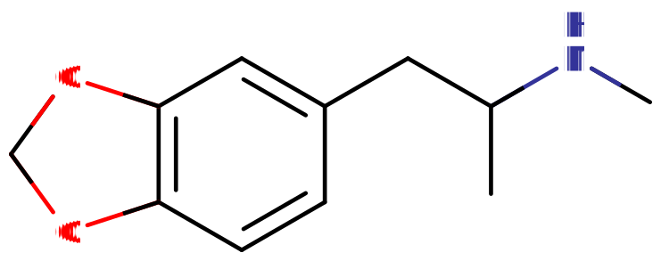
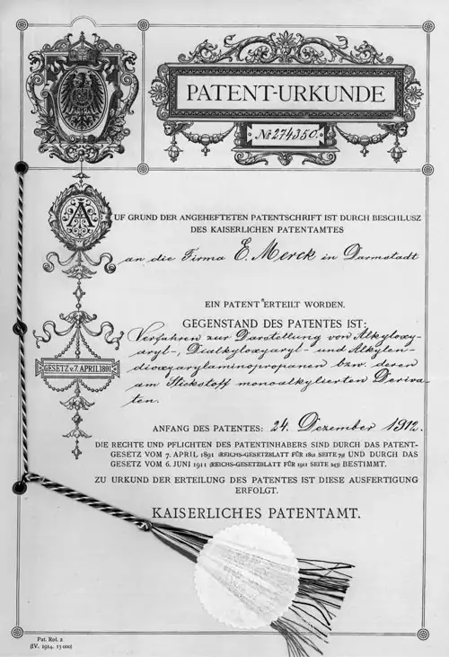
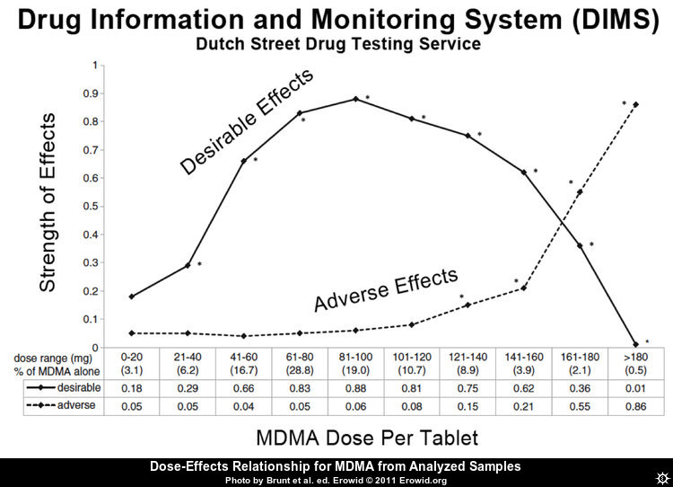
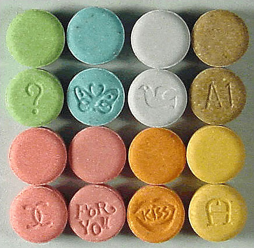
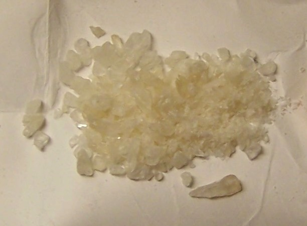

# MDMA

[◀返回](index.md)

> 摇头丸吃了会摇头是一个错误的刻板印象，其实整个身子都会随音乐舞动......

| 化学信息       | MDMA                                                                                                              |
| -------------- | ----------------------------------------------------------------------------------------------------------------- |
| 结构式         |                                                                                              |
| 分子式         | C11H15NO2                                                                        |
| CAS 号         | 42542-10-9                                                                                                        |
| **化学命名法** |                                                                                                                   |
| 俗名           | MDMA, Molly, Mandy, Emma, MD, Ecstasy, E, X, XTC, Rolls, Beans, Pingers                                           |
| 取代名称       | 3,4-亚甲二氧基-N-甲基苯丙胺                                                                                       |
| 系统命名法     | (RS)-1-(苯并[d][1,3]二氧杂环戊烯-5-基)-N-甲基丙-2-胺                                                              |
| **类别成员**   |                                                                                                                   |
| 精神活性类别   | _[兴奋剂](../文档/药物分类/兴奋剂.md) / [共情剂](../文档/药物分类/共情剂.md)_                                     |
| 化学类别       | _[苯丙胺类物质](../文档/药物分类/苯丙胺类物质.md) / [亚甲双氧基苯类物质](../文档/药物分类/亚甲双氧基苯类物质.md)_ |

> **警告：** 由于个体体重、耐受性、新陈代谢和个人敏感度的差异，请务必从低剂量开始。[参见负责任的用药部分](../文档/负责任的用药索引页.md)。

| **[给药途径](../文档/给药途径.md)** | ⇣ [口服](../文档/给药途径.md) |
| ----------------------------------- | ----------------------------- |
| [**剂量**](../文档/给药剂量.md)     |                               |
| [阈值](../文档/药物剂量分类.md)     | 20 mg                         |
| [轻微](../文档/药物剂量分类.md)     | 20 \~ 80 mg                   |
| [中等](../文档/药物剂量分类.md)     | 80 \~ 120 mg                  |
| [强烈](../文档/药物剂量分类.md)     | 120 \~ 150 mg                 |
| [严重](../文档/药物剂量分类.md)     | 150 mg +                      |
| [**药效时长**](../文档/药效时长.md) |                               |
| [总时长](../文档/药效时长.md)       | 3 \~ 6 小时                   |
| [药效发作](../文档/药效时长.md)     | 30 \~ 45 分钟                 |
| [药效上升](../文档/药效时长.md)     | 15 \~ 30 分钟                 |
| [药效达峰](../文档/药效时长.md)     | 1.5 \~ 2.5 小时               |
| [药效褪去](../文档/药效时长.md)     | 1 \~ 1.5 小时                 |
| [药效残余](../文档/药效时长.md)     | 12 \~ 48 小时                 |

> **[免责声明](../文档/免责声明.md)：** PW的[剂量](../文档/给药剂量.md)信息是从用户和资源中收集的，仅供教育用途。这不是推荐，应该与其他来源核实准确性。

| **[相互作用](#危险的相互作用)**                 |             |
| ----------------------------------------------- | ----------- |
| 5-MeO-xxT                                       | ⚠️ 谨慎联用 |
| [酒精](酒精.md)                                 | ⚠️ 谨慎联用 |
| [可卡因](可卡因.md)                             | ⚠️ 谨慎联用 |
| DOx                                             | ⚠️ 谨慎联用 |
| [GHB](GHB.md)                                   | ⚠️ 谨慎联用 |
| [GBL](GBL.md)                                   | ⚠️ 谨慎联用 |
| [MXE](MXE.md)                                   | ⚠️ 谨慎联用 |
| [αMT](αMT.md)                                   | ⚠️ 谨慎联用 |
| 蛋白酶抑制剂                                    | ⚠️ 谨慎联用 |
| [SSRIs](../文档/SSRI.md)                        | ⚠️ 谨慎联用 |
| SNRIs                                           | ⚠️ 谨慎联用 |
| 25x-NBOMe                                       | 💔 联用危险 |
| [PCP](PCP.md)                                   | 💔 联用危险 |
| [神经递质释放剂](../文档/神经递质释放剂.md)     | 💔 联用危险 |
| 2C-T-x                                          | 💔 联用危险 |
| [5-HTP](5-HTP.md)                               | 💔 联用危险 |
| [曲马多](曲马多.md)                             | ⛔ 严禁联用 |
| [单胺氧化酶抑制剂](../文档/单胺氧化酶抑制剂.md) | ⛔ 严禁联用 |
| [右美沙芬](右美沙芬.md)                         | ⛔ 严禁联用 |

**3,4-亚甲二氧基甲基苯丙胺**（也称为**摇头丸**、**E**、**XTC**、**emma**、**molly**、**mandy**、**pingers**和**MDMA**）是[苯丙胺](../文档/药物分类/苯丙胺类物质.md)类的一种经典[共情剂](../文档/药物分类/共情剂.md)物质。
它是[共情剂](../文档/药物分类/共情剂.md)家族中最著名、使用最广泛的成员，这个多样化的群体还包括[MDA](MDA.md)、[Methylone](Methylone.md)、[4-MMC](4-MMC.md)和[6-APB](6-APB.md)。它通过促进大脑中[血清素](../文档/血清素.md)、[多巴胺](../文档/多巴胺.md)和[去甲肾上腺素](../文档/去甲肾上腺素.md)的释放来产生效果，尤其是血清素。

MDMA最早于1912年由制药公司[默克](http://en.wikipedia.org/wiki/Merck_Group 'wikipedia:Merck Group')开发。[^1] 然而，直到1970年代，它才被报道用于人类，当时它在美国的地下心理治疗圈子中为人所知。[^2] 在1980年代初，它传播到夜生活和锐舞文化中，最终导致其在1985年被联邦列为管制物质。[^3] 到了2014年，据估计它是世界上最受欢迎的娱乐性药物之一，与[可卡因](可卡因.md)和[大麻](大麻.md)并列。[^4]

如今，娱乐性MDMA的使用广泛与舞会、电子舞曲以及夜店和锐舞场景相关联。[^5] 研究人员目前正在调查MDMA是否可以辅助治疗难治性创伤后应激障碍（PTSD）、自闭症成人的社交[焦虑](../药效/焦虑.md)，[^6] 以及患有危及生命疾病的人的焦虑。[^7] [^8] [^9]

[主观效应](../药效/index.md)包括[兴奋](../药效/兴奋.md)、[焦虑抑制](../药效/焦虑抑制.md)、[去抑制](../药效/去抑制.md)、[共情和社交能力增强](../药效/共情、情感和社交能力增强.md)、[放松](../药效/肌肉松弛.md)和[欣快感](../药效/认知欣快.md)。
由于它能促进与自己和他人亲近的感觉，它被归类为共情剂。MDMA的一个显著特性是耐受性建立得异常快，许多用户报告说，如果频繁使用，它的效果会急剧下降。

通常建议在每次使用之间等待一到三个月，以便给大脑足够的时间恢复[血清素](../文档/血清素.md)水平并避免毒性。此外，强烈不建议使用过高的剂量和多次补服，因为这被认为会显著增加MDMA的毒性。

MDMA具有中等到高度的滥用潜力，但相比之下，产生真正的心理依赖或成瘾的潜力较低，似乎甚至低于[大麻](大麻.md)（低于10%）。有趣的是，MDMA的过度使用和依赖或成瘾的潜力实际上可能会受到某些地理因素的巨大影响，比如在其他文化或亚文化中，类似于[氯胺酮](氯胺酮.md)。尽管与MDMA相比，氯胺酮在各种文化中的成瘾潜力仍然明显更高。MDMA的急性不良反应通常是高剂量或多次剂量的结果；无论是因为过于频繁还是在24小时内过量使用。尽管如此，易感个体仍可能发生单剂毒性。[^10] MDMA最严重的短期身体健康风险是[体温升高](../药效/体温升高.md)和[脱水](../药效/脱水.md)，这已导致死亡。[^11] 它还被证明在高剂量下具有[神经毒性](../文档/神经毒性.md)；[^12] 然而，尚不清楚这种风险在多大程度上适用于典型的娱乐用途。[^13] MDMA可能会导致过度口渴，并且无法排出体内的水，这可能导致[水中毒和电解质失衡](#水中毒和电解质失衡)。MDMA已被证明会导致[性功能障碍](../药效/性欲减退.md)，包括勃起功能障碍和性高潮延迟（见[主观效应](#主观效应)）。

如果使用这种物质，强烈建议采取[伤害减少措施](../文档/负责任的用药索引页.md)。

## 历史与文化

|                                                                        |
| ---------------------------------------------------------------------- |
|  |
| 默克公司1912年的MDMA合成专利证书                                       |

MDMA最初由德国化学家Anton Köllisch博士于1912年在默克制药公司工作时合成。Köllisch当时正在开发有助于控制出血过多的药物，他对MDMA合成感兴趣是因为它是生产甲基海得拉斯梯宁（止血剂海得拉斯梯宁的甲基化类似物）的中间体。当时没有任何迹象表明对MDMA本身作为活性剂感兴趣。[^1]

直到1927年，Max Oberlin博士在默克公司寻找具有类似肾上腺素或麻黄碱作用谱的化合物时，进行了首次证实的药理测试，才再次提到它。尽管结果很有希望，但由于物质价格上涨，研究停止了。[^1]

1965年，美国化学家[Alexander Shulgin](../文档/TiHKAL.md)作为学术练习合成了MDMA，但没有测试其精神活性。[^14] [^2] Shulgin声称在1967年从一名学生那里第一次听说了MDMA的效果，并决定自己进行实验。他对这种物质的效果印象深刻，并相信它具有治疗效用。他向治疗师和精神科医生宣传它，导致它作为各种心理障碍的辅助治疗获得了一定的普及。[^2]

在此期间，心理治疗师Leo Zeff博士从退休中复出，随后向4000多名患者介绍了当时合法的MDMA。从1970年代中期到1980年代中期，加利福尼亚州使用MDMA（当时称为“Adam”）的临床医生数量有所增长。[^15]

MDMA的娱乐性使用大约在同一时间流行起来，特别是在夜总会，最终引起了缉毒局（DEA）的注意。经过几次听证会，一名美国联邦行政法法官建议将MDMA列为附表III管制物质，以便可以在医疗领域使用。尽管如此，DEA局长否决了这一建议，并将MDMA归类为附表I管制物质。[^16] [^14]

在英国，1971年的滥用药物法案已经在1977年进行了修改，将所有环取代苯丙胺类物质（如MDMA）包括在内，并在1985年进一步修订，明确提到摇头丸（Ecstasy），将其归入A类。[^15]

## 化学

MDMA，即3,4-亚甲二氧基-N-甲基苯丙胺，是[取代苯丙胺类物质](../文档/药物分类/苯丙胺类物质.md)的一种合成分子。苯丙胺类的分子都包含一个[苯乙胺](../文档/药物分类/苯乙胺类物质.md)核心，由一个苯环通过乙基链结合到一个氨基（NH2）基团上，在Rα位置有一个额外的甲基取代。除此之外，MDMA在RN位置包含一个甲基取代，这一特征与[甲基苯丙胺](甲基苯丙胺.md)共有。关键是，MDMA分子还在苯环的R3和R4位置包含氧基团取代——这些氧基团通过亚甲基桥结合成亚甲二氧基环。MDMA与其他[共情剂](../文档/药物分类/共情剂.md)和[兴奋剂](../文档/药物分类/兴奋剂.md)如[MDA](MDA.md)、[MDEA](MDEA.md)和[MDAI](MDAI.md)共享这个亚甲二氧基环。

## 药理学

MDMA主要作为三种主要[单胺神经递质](../文档/单胺.md)[血清素](../文档/血清素.md)、[去甲肾上腺素](../文档/去甲肾上腺素.md)和[多巴胺](../文档/多巴胺.md)的[释放剂](../文档/神经递质释放剂.md)，通过其在痕量胺相关受体1（TAAR1）和囊泡单胺转运体2（VMAT2）的作用发挥作用。[^17] [^18] [^19] MDMA是单胺转运体底物（即多巴胺（**DAT**）、去甲肾上腺素（**NET**）和血清素（**SERT**）转运体的底物），使其能够通过这些神经元膜转运蛋白进入单胺能[神经元](../文档/神经元.md)。[^18] 通过作为单胺转运体底物，MDMA在神经元膜转运体处产生竞争性[再摄取抑制](../文档/神经递质再摄取抑制剂.md)，与内源性单胺竞争再摄取。[^18] [^20]

MDMA抑制两种囊泡单胺转运体（VMATs），其中第二种（VMAT2）在单胺[神经元](../文档/神经元.md)囊泡膜内高度表达。[^19] 一旦进入单胺神经元，MDMA充当VMAT2抑制剂和TAAR1激动剂。[^18] [^21] MDMA对VMAT2的抑制导致神经元细胞质中上述单胺神经递质浓度的增加。[^19] [^22] MDMA激活TAAR1触发蛋白激酶信号传导事件，然后磷酸化神经元的相关单胺转运体。[^18]

随后，这些磷酸化的单胺转运体要么反转转运方向——即从细胞内向[突触](../文档/突触.md)间隙移动神经递质——要么缩回神经元，分别产生神经递质的流入和神经元膜转运体处的非竞争性[再摄取抑制](../文档/神经递质再摄取抑制剂.md)。[^18] 与多巴胺和去甲肾上腺素转运体相比，MDMA对血清素转运体的摄取亲和力高十倍，因此主要具有血清素能效应。[^23]

MDMA在突触后血清素受体5-HT1和5-HT2受体上也具有弱激动剂活性，其更有效的代谢物[MDA](MDA.md)可能会增强这种作用。[^24] [^25] [^26] [^27] 血清中的皮质醇、催乳素和催产素数量因MDMA而增加。[^28]

此外，MDMA是两种sigma受体亚型的配体，尽管其在这些受体上的功效及其所起的作用尚未阐明。[^29]

## 主观效应

> _**免责声明：** 下列效果引用自 [**主观效应索引**](../药效/index.md)（**SEI**），这是基于轶事用户报告和 [PsychonautWiki](../文档/关于本站/index.md)贡献者的个人分析的开放研究文献。因此，应该带着健康的怀疑态度来看待它们。_
>
> _还要注意，这些效果不一定会以可预测或可靠的方式发生，尽管高剂量更容易诱发全方位的效果。同样，**不良反应** 随着剂量的增加而变得越来越可能，可能包括 **成瘾、严重伤害或死亡** ☠。_

### **[躯体效应](../药效/躯体效应.md)** 

- **[心律异常](../药效/心律异常.md)**
- **[食欲抑制](../药效/食欲抑制.md)**
- **[身体控制增强](../药效/躯体控制增强.md)**
- **[支气管扩张](../药效/支气管扩张.md)**
- **[脱水](../药效/脱水.md)** -- 建议不要喝过量的水来避免水中毒，参见[水中毒和电解质失衡](#水中毒和电解质失衡)部分。
- **[排尿困难](../药效/排尿困难.md)** - 像其他兴奋剂一样；这可能会以轻微或中等程度发生，这也是建议避免喝太多水的一个原因，参见[水中毒和电解质失衡](#水中毒和电解质失衡)部分。
- **[口干](../药效/口干.md)** - 避免喝太多水，参见[水中毒和电解质失衡](#水中毒和电解质失衡)部分。嚼口香糖可能有助于增加湿润度并逆转干燥。
- **[过度打哈欠](../药效/过度打哈欠.md)** - 偶尔打哈欠被认为是血清素能活动的结果，这可能会让人感到更镇静或困倦。它更有可能在低剂量和/或更纯的MDMA中发生。因此，它有时被用作批次质量的指标。
- **[血压升高](../药效/血压升高.md)**[^30] [^31]
- **[体温升高](../药效/体温升高.md)**[^32] - 由于MDMA是[血清素](../文档/血清素.md)释放剂，核心体温的升高往往是体验中显著且持续的一部分。必须小心，因为在危险的高温环境中服用过高剂量可能导致血清素毒性和相关的氧化应激，如果不加以治疗可能是致命的或极具破坏性的。避免喝太多水，参见[水中毒和电解质失衡](#水中毒和电解质失衡)部分。
- **[心率增快](../药效/心率增快.md)**[^30]
- **[出汗增加](../药效/出汗增加.md)**[^33] - 避免喝太多水，参见[水中毒和电解质失衡](#水中毒和电解质失衡)部分。
- **[肌肉收缩](../药效/肌肉收缩.md)**
- **[恶心](../药效/恶心.md)** - 这种效果最常出现在体验的[药效上升](../文档/药效时长.md)阶段，以及高剂量下，但在那些似乎易感的人群中也有自发发生的报道。这可能是由于肠道中存在大量的血清素受体。
- **[神经毒性](../文档/神经毒性.md)** - 长期使用可能导致显著程度的神经毒性。像这样的后果是将MDMA的使用限制在每年最多几次的主要原因。长期的[抑郁](../药效/抑郁.md)或快感缺失症状在过度频繁使用中相当常见。
- **[镇痛](../药效/镇痛.md)** - 这种效果通常不如[阿片类药物](../文档/药物分类/阿片类药物.md)那样强大。[^34] [^35] [^36]
- **[瞳孔扩大](../药效/瞳孔扩大.md)** - 与其他兴奋剂相比，这个成分可能非常突出，通常几乎与真正的[迷幻剂](../文档/药物分类/迷幻剂.md)相同。环境和照明水平也可能是一个因素。
- **[癫痫发作](../药效/癫痫发作.md)** - 癫痫发作很少见，但可能发生在易感人群中，特别是当服用高剂量或在身体负担重的情况下（如脱水、疲劳、营养不良或过热）补服时。
- **[暂时性勃起功能障碍](../药效/暂时性勃起功能障碍.md)** & **[性高潮抑制](../药效/性高潮抑制.md)**[^37] [^38]
- **[自发性躯体感觉](../药效/自发性躯体感觉.md)** - MDMA的“身体嗨”可以被描述为一种中度到极度的欣快感和高度愉悦的刺痛感，平滑地包裹整个身体。这种感觉保持着持续的存在，随着起效稳步上升，一旦达到顶峰就达到极限。
    - **[躯体欣快感](../药效/躯体欣快感.md)** - 躯体欣快感是MDMA体验的一个突出方面，当负责任地使用MDMA（即合理的剂量和体验间隔）时可靠地发生，并可能导致深刻的社交和身体[去抑制](../药效/去抑制.md)和多动，或者一种极其愉悦的身体感觉，其特征也可能是缺乏活动能力但具有相当程度的舒适感。然而，随着一个人对MDMA效果建立耐受性，欣快感很快就会消退，通俗地称为“失去魔力”。
- **[耐力增强](../药效/耐力增强.md)**
- **[兴奋](../药效/兴奋.md)** - MDMA以其刺激和充满活力而闻名。这鼓励了跑步、散步、攀岩和跳舞等活动，使得MDMA成为音乐活动（如音乐节和锐舞）或一般夜生活活动的热门选择。MDMA呈现的独特刺激风格可以描述为强迫性的。这意味着在高剂量下，随着下巴紧咬、不自主的身体颤抖和震动出现，变得很难或不可能保持静止，导致手部不稳和普遍缺乏运动控制。然而，与大多数其他兴奋剂不同的是，MDMA的刺激效果也可能矛盾地伴随着持续或波浪般的深度[镇静](../药效/镇静.md)和[放松](../药效/肌肉松弛.md)感，这取决于剂量，低剂量体现出更放松或镇静的特质。然而，在中等到高剂量下，它的作用更类似于传统兴奋剂；导致几乎不变的四处走动和从事各种移动活动的愿望。对于某些人来说，如果该用户倾向于或愿意接受此类活动，这种鼓励的刺激风格以导致非常活跃的身体行为（如跳舞）而闻名。然而，对于那些对舞蹈行为有普遍社会偏见的人来说，在足够的（中等）剂量MDMA影响下，突然对这个想法变得更加开放也并不罕见。
- **[触觉增强](../药效/触觉增强.md)** - MDMA对触觉产生明显的增强。用户通常报告说有一种柔软和毛茸茸的感觉覆盖在皮肤上。同样，触摸柔软和毛茸茸的物体（如长毛地毯）会变得令人无法抗拒的愉悦和满足。MDMA类型的触觉增强似乎是共情剂类独有的效果，可能是一种血清素相关的效果。尽管也值得注意的是，该药物的许多实验者发现触觉效果（特别是在愉悦方面）经常被其他用户明显夸大，其中一些支持者甚至声称与身体接触相关的近乎“高潮”的感觉。
- **[磨牙](../药效/磨牙.md)**[^39] - 这种效果在与认知和身体[欣快感](../药效/认知欣快.md)一起体验时，通常会导致用户轻微或强烈地紧咬下巴肌肉，有时甚至达到个人面部表情开始改变的程度。这有时通俗地称为“gurning”。这种特殊效果是人们在锐舞时服用MDMA使用奶嘴或嚼口香糖的原因，因为强烈的磨牙会导致许多用户过度用力咬嘴唇。[^40] 并且通常仅在中等到高剂量下体验到。对于其他人，特别是如果他们容易体验到肌肉放松的矛盾感觉，磨牙症可能不那么明显。
- **[体温调节抑制](../药效/体温调节抑制.md)** - 避免喝太多水，参见[水中毒和电解质失衡](#水中毒和电解质失衡)部分。
- **[血管收缩](../药效/血管收缩.md)**
- **[视物振动](../药效/视物振动.md)** - 在高剂量下，人的眼球可能会开始快速地来回摆动，导致视力变得模糊并暂时失去焦点。这是一种称为[眼球震颤](http://en.wikipedia.org/wiki/Nystagmus)的状况。

### **[视觉效应](../药效/视觉效应.md)** 

MDMA的视觉效果比传统的[迷幻剂](../文档/药物分类/迷幻剂.md)更具选择性，一致性也更低。这导致许多人无视MDMA的[迷幻](../文档/药物分类/迷幻剂.md)方面，认为那是神话、谣言或可忽略不计的效果，尽管有大量的轶事报告表明并非如此。（通常是轻微的）幻觉效果不能保证显现，但在高剂量使用化学纯MDMA时最有可能发生，以及在体验结束时；特别是如果用户一直在吸食[大麻](大麻.md)。[药效褪去](../文档/药效时长.md)期间的视觉效果通常以闭眼视觉（CEVs）为特征，如典型的迷幻样图案。而在高峰效应期间，视觉效果往往更类似于标准迷幻剂的睁眼扭曲，尽管形式要温和得多，生动程度也低得多。如果用户以前有使用[迷幻剂](../文档/药物分类/迷幻剂.md)的经验，它们似乎也更有可能发生。

#### 增强

MDMA呈现一系列感官增强，通常具有适度的视觉增强，与标准迷幻剂相比特征温和，但与经典兴奋剂相比仍然明显存在。这些通常包括：

- **[颜色增强](../药效/颜色增强.md)** - 当暴露在非常明亮或霓虹色中时，这对MDMA来说异常强烈；特别是当观看辐射或发光的颜色（如荧光棒）时。
- **[模式识别增强](../药效/模式识别增强.md)** - 虽然类似或相关的化合物以诱导空想性错视（无处不在地感知随机视觉刺激中的图案）而闻名；MDMA只是增强了对现有图案表面和设计的质量、清晰度和审美欣赏。

#### 抑制

- **[复视](../药效/复视.md)**

#### 扭曲

- **[视觉拖尾](../药效/视觉拖尾.md)**
- **[对称纹理重复](../药效/对称纹理重复.md)**

#### [几何](../药效/几何.md)

MDMA产生的视觉几何可以描述为在外观上更类似于[二甲双羟色胺](赛洛西宾蘑菇.md)（Psilocin）而不是[LSD](LSD.md)。它可以通过其[变体](../药效/几何.md)全面描述为：主要在复杂性上错综复杂，形式上抽象，风格上自然，组织上结构化，光线上昏暗，颜色上主要是单调的蓝色和灰色，阴影上有光泽，边缘锋利，尺寸小，速度快，运动平滑，圆角和棱角相等，深度上非沉浸式，强度上一致。在高剂量下，它们比[8B级](../药效/几何.md)视觉几何更有可能产生[8A级](../药效/几何.md)视觉几何状态。许多用户报告说，MDMA几何呈现出黑暗和威胁的情感氛围，带有合成和令人伤脑筋的感觉。

#### 幻觉状态

MDMA能够产生一系列独特的低级和高级幻觉状态，其方式比几乎所有其他常用[迷幻剂](../文档/药物分类/迷幻剂.md)的一致性和可重复性都要低得多。这些效果在高峰效应或体验的[药效褪去](../文档/药效时长.md)期间更为常见，通常包括：

- **[外部幻觉](../药效/外部幻觉.md)**（_[自主实体](../药效/自主实体.md)_；_[场景、布景和景观](../药效/场景、布景和景观.md)_；*[视角幻觉](../药效/视角幻觉.md)*和*[情景与情节](../药效/情景与情节.md)*）- 这种效果与[谵妄剂](../文档/药物分类/谵妄剂.md)产生的效果有许多相似之处，但并不一致地显现，通常只发生在严重的、可能有毒的剂量下，因此在体验MDMA的视觉效果时不被认为是典型或健康的迹象。它可以通过其[变体](../药效/外部幻觉.md)全面描述为：可信度上是谵妄的，可控性上是自主的，风格上是实体的。它们通常遵循记忆重播和半现实或预期事件的主题。例如，人们可能随意拿着物体或执行人们期望他们在现实生活中会做的动作，然后在进一步检查下消失和溶解。这方面的常见例子包括看到人们戴着眼镜或帽子，而实际上并没有，以及将物体误认为是人类或动物。
- **[内部幻觉](../药效/内部幻觉.md)** - MDMA诱导的内部幻觉仅作为极高剂量下的自发突破存在。这种效果的[变体](../药效/内部幻觉.md)在可信度上是谵妄的，风格上是互动的，内容上是新体验，可控性上是自主的，外观上是实体的。它们最常见的表现方式是通过[入睡前幻觉](../药效/幻觉状态.md)场景，用户可能会在经历了一晚的使用后逐渐入睡时体验到；这些通常可以描述为前几个小时的记忆重播。这些是短暂和稍纵即逝的，但频繁且完全可信和令人信服。就主题而言，它们通常以与人交谈的形式出现，或者表现为离奇和极其荒谬的情节。
- **[周边信息误判](../药效/周边信息误判.md)**

### **[认知效应](../药效/认知效应.md)** 

- MDMA的一般思维空间被许多人描述为明显的精神刺激、爱或柏拉图式情感的感觉、同理心、健谈、对新颖社交互动的开放态度以及明显的活力、复兴和欣快愉悦感。它能够产生大量通常与[共情剂](../文档/药物分类/共情剂.md)和[兴奋剂](../文档/药物分类/兴奋剂.md)相关的认知效果。

这些效果中最突出的包括：

- **[失忆](../药效/失忆.md)** - 极高剂量的MDMA有时会导致部分失忆。
- **[焦虑抑制](../药效/焦虑抑制.md)** - 虽然最初但非常短暂的药效上升阶段实际上可能以轻微或明显的[焦虑](../药效/焦虑.md)为特征，但这一成分几乎总是在之后很快被彻底的全面和/或主要的焦虑和担忧抑制所取代。
- **[认知欣快](../药效/认知欣快.md)** - 强烈的情感欣快和幸福感以及积极情绪和乐观主义的显著增加几乎普遍存在于MDMA中，这可能是[血清素](../文档/血清素.md)释放浓度增加以及[去甲肾上腺素](../文档/去甲肾上腺素.md)和[多巴胺](../文档/多巴胺.md)增加（程度较小）的直接结果。
- **[强迫性补量](../药效/强迫性补量.md)**
- **[创造力增强](../药效/创造力增强.md)** - 虽然这是一个非常常见的效果，但显然在具有某些人格类型或特定类型的创造性努力（例如音乐制作而不是创作文学作品）的人群中更为普遍。与真正的迷幻化合物相比，它通常也被认为是不太显著的效果。
- **[性欲减退](../药效/性欲减退.md)**[^41] [^42] [^43]
- **[谵妄](../药效/谵妄.md)** & **[混乱](../药效/混乱.md)** - 这种效果通常只发生在过高的剂量下，并且与体温调节失调和过热有关，特别是当MDMA在拥挤、身体剧烈的环境中服用时，导致用户无法充分冷却、休息或补水。
- **[去抑制](../药效/去抑制.md)** - 这种效果可能非常强大，表现为（有时是不受限制的）社交能力增加、健谈以及在友善和愿意与陌生人公开交流方面的非凡自信。然而，这被认为比急性[酒精](酒精.md)中毒更不“令人讨厌”和粗心。
- **[自我膨胀](../药效/自我膨胀.md)** - 这可以以多种方式表现（积极和消极），但通常以自尊心的增加和旺盛的自信感为特征。个人性格类型和用户的自然神经化学可以在这种效果的质量中发挥主要作用。
- **[情绪强化](../药效/情绪强化.md)** - 这种效果通常与MDMA的共情和深情方面联系最紧密，尽管它往往缺乏大多数[迷幻剂](../文档/药物分类/迷幻剂.md)甚至[大麻](大麻.md)中存在的情感同情和心理情感脆弱感，一些用户甚至报告情绪几乎没有或根本没有有意义的变化或增强。它通常被认为更多是对他人性情的*理解*增加，而不是深切的衷心或发自内心的“感觉”，如同情或怜悯。
- **[共情、情感和社交能力增强](../药效/共情、情感和社交能力增强.md)** - 与任何其他已知物质相比，这种特殊且主要特征性的效果通常在MDMA中更一致、明显、功能性、强大和具有治疗作用。它是任何MDMA体验中最明显和最引人注目的效果，并主导着思维空间。然而，随着时间的推移和重复使用，这种效果会大大减弱，因为灌输的观点变得完全扎根并已经到位，使人们感到仅仅是受到刺激和欣快，没有明显的与他人交流的新冲动。一些用户报告说，MDMA仅在十次体验后就“失去了魔力”，而其他人则报告说使用了数百次后共情品质才消失。这似乎并不适用于所有用户。然而，许多用户报告说，尽管使用了几十次甚至几百次，他们并没有经历任何新颖品质的下降。
- **[专注力强化](../药效/专注力强化.md)** - 专注力增强仅发生在低至中等剂量下。较高的剂量通常会损害注意力和注意力集中，特别是在体验的“下降”阶段。
- **[沉浸感强化](../药效/沉浸感强化.md)** - 这种效果在接触音乐（特别是正规的音乐相关活动）或灯光秀和类似类型的视觉或听觉展示的设置中似乎异常明显。
- **[音乐欣赏能力增强](../药效/音乐欣赏能力增强.md)** - 这种效果通常通过增加音乐声学现象的享乐和激动人心的情感影响来表现自己，通常会导致一种“炒作”或肾上腺素激增的感觉。对于一些用户来说，据报道对音乐中微妙细节的理解增强或对作曲和歌词的更深层理解感，这与许多其他致幻化合物相比本质上不太常见。整体效果在很大程度上主要表明对一般听音乐的热情全面增加。极少数情况下，人们可能会发现音乐令人讨厌或分心而不是增强——这似乎很大程度上基于场景和心境，很少发生。
- **[正念](../药效/正念.md)**
- **[动机增强](../药效/动机增强.md)**
- **[复兴感](../药效/复兴感.md)**
- **[思维加速](../药效/思维加速.md)** - 这一成分可以非常有效地补充体验期间发生的社交互动和与他人的口头交流。这尤其有利，因为这种效果似乎明显不如其他兴奋剂那样狂躁、注意力分散、“快速”和动荡；许多人甚至将其描述为感觉“平滑”和独特的易于管理。
- **[时间压缩](../药效/时间扭曲.md)** - MDMA通常会产生强烈的时间压缩感，并在主观上将时间流逝的体验加速到异常显著的程度；可能比任何其他常用的娱乐性物质都要多。
- **[清醒](../药效/清醒.md)**

### **[听觉效应](../药效/听觉效应.md)** 

- **[增强](../药效/听觉锐度增强.md)**
- **[幻觉](../药效/听觉幻觉.md)**
- **[扭曲](../药效/听觉扭曲.md)**
- **[耳鸣](../药效/听觉效应.md)** - 耳鸣很少被报道，但通常表现为耳朵里的闷响，受用户是直立还是躺下的影响。当与其他物质结合使用时最常被报道，但在高剂量下也可以单独表现出来。这可能伴随着部分或全部，但高度暂时（大约一分钟）的听力损失，尤其是在站立时。一些用户报告滥用后获得永久性耳鸣。

### **[超个人效应](../药效/超个人效应.md)** 

- **[存在主义自我实现](../药效/存在主义自我实现.md)** - 虽然相对常见，但与[麦司卡林](麦斯卡林.md)、[赛洛西宾](赛洛西宾蘑菇.md)、[LSD](LSD.md)或[MXE](MXE.md)等[致幻剂](../文档/药物分类/致幻剂.md)相比，这种效果并不那么明显、令人信服或一致。这个成分在MDMA中具有独特的品质，因为它几乎总是以自我肯定、个人代理和对自己以及他人的个人欣赏的形式出现。
- **[统一感与互联感](../药效/统一感与互联感.md)** - 低层次的统一感和互联感体验通常由MDMA产生，尽管其形式比[LSD](LSD.md)等化合物更不抽象或“形而上学”。这种MDMA效果最一致地表现在锐舞和音乐活动的大人群中，形式是“与人群融为一体”。据说音乐也会持续加强这种效果，可以被认为是体验高峰的一个非常难忘和决定性的特征。

### **药效残余** 

在[共情剂](../文档/药物分类/共情剂.md)或[兴奋剂](../文档/药物分类/兴奋剂.md)体验的[药效褪去](../文档/药效时长.md)期间发生的效果通常感觉比[药效达峰](../文档/药效时长.md)期间发生的效果更消极和不舒服。这通常被称为“下降期”（comedown），被认为是由于[神经递质](../文档/神经递质.md)耗尽而发生的。虽然，近年来人们越来越普遍地认识到，MDMA真正的“宿醉”，特别是在[抑郁](../药效/抑郁.md)方面，往往实际上会“隔一天”，因为大脑据称在第二天仍释放大量血清素，这可能解释了“余辉”效应，该效应最终后来被真正的宿醉和不舒服的情感效果所取代。这些效果通常包括：

- **[焦虑](../药效/焦虑.md)**
- **[食欲抑制](../药效/食欲抑制.md)**
- **[脑电击感](../药效/脑电击感.md)**
- **[认知疲劳](../药效/认知疲劳.md)**
- **[抑郁](../药效/抑郁.md)** - 可能从轻微到严重不等，通常在主要效果突然结束后的最初下降期最为严重，而不是在接下来的几天里。话虽如此，接下来几天的抑郁仍然通常很明显，并且可能持续长达一周。
- **[现实感丧失](../药效/现实感丧失.md)**
- **[梦境抑制](../药效/梦境抑制.md)** _或_ **[梦境强化](../药效/梦境强化.md)** - 虽然已知这种物质会抑制做梦，但一些用户指出，在服用大剂量MDMA后的几个晚上会出现非常奇怪，有时甚至是可怕的梦。
- **[睡眠瘫痪](../药效/睡眠瘫痪.md)** - 一些用户报告在服用MDMA后经历睡眠瘫痪的发生率更高。
- **[头痛](../药效/头痛.md)** - 过度使用后第二天的头痛非常常见，是由电解质失衡和身体劳损共同导致的。
- **[易怒](../药效/易怒.md)**
- **[动力抑制](../药效/动力抑制.md)**
- **[思维减速](../药效/思维减速.md)**
- **[思维混乱](../药效/思维混乱.md)**
- **[自杀意念](../药效/自杀意念.md)**
- **[清醒](../药效/清醒.md)**
  如上所述，个人可能会经历*余辉*效应，特别是当MDMA在治疗环境中使用并适当遵守伤害减少措施时。一些用户甚至利用“恢复方案”，如冰沙和其他用某些成分制成的消耗品，来缓解神经递质短缺中存在的一些症状。也就是说，如果一个人的MDMA使用随着时间的推移变得更加频繁或过度，余辉通常会让位于更频繁甚至逐渐恶化的下降期。然而，一些用户只经历*余辉*或只经历下降期/崩溃是一个误解，因为许多（如果不是大多数）用户往往会经历两者；只是处于双相顺序。此类余辉效果包括：
- **[返老还童感](../药效/返老还童感.md)**
- **[心境平和](../药效/心境平和.md)**

### 分析样品的剂量-效应关系

根据此图，普通用户的最佳单次口服剂量可能约为90毫克。请注意，底部的百分比过于过时，无法指导估算当前药丸中的物质含量：在苏黎世的一项药物检查计划中测试的摇头丸中MDMA的平均浓度在2010年至2018年间翻了一番。含有超过120毫克MDMA的药丸比例从4%上升到73%。在同一时期，含有其他精神活性化合物的药丸比例从53%下降到7%。[^44]

[^45](#cite_note-45)

### 体验报告

描述该化合物在我们[体验索引](../文档/复现索引.md)中的效果的轶事报告包括：

- [Experience:0.75g MDMA - Possibly some MDA through metabolisation?](../报告/psychounautwiki/Experience:0.75g_MDMA_-_Possibly_some_MDA_through_metabolisation%3F)
- [Experience:150mg MDMA + 20mg 2C-B - I designed it this way myself](../报告/psychounautwiki/Experience:150mg_MDMA_%2B_20mg_2C-B_-_I_designed_it_this_way_myself)
- [Experience:250mg MDA / 250mg MDMA - unnecessarily large dosage](../报告/psychounautwiki/Experience:250mg_MDA_/_250mg_MDMA_-_unnecessarily_large_dosage)
- [Experience:250mg MDMA (oral) - Pareidolia & paranoia](</报告/psychounautwiki/Experience:250mg_MDMA_(oral)_-_Pareidolia_%26_paranoia>)
- [Experience:450mg MDMA - Quarter consumption through whole night](../报告/psychounautwiki/Experience:450mg_MDMA_-_Quarter_consumption_through_whole_night)
- [Experience:Cannabis, Ecstasy (3 brownies, 1 pill, Oral) My happy friends Shadow People](</报告/psychounautwiki/Experience:Cannabis,_Ecstasy_(3_brownies,_1_pill,_Oral)_My_happy_friends_Shadow_People>)
- [Experience:MDMA (1/2 tab, oral) - My first time ever being high](</报告/psychounautwiki/Experience:MDMA_(1/2_tab,_oral)_-_My_first_time_ever_being_high>)
- [Experience:MDMA (100 mg) + Cannabis - Trip Report](</报告/psychounautwiki/Experience:MDMA_(100_mg)_%2B_Cannabis_-_Trip_Report>)
- [Experience:MDMA (750mg, Oral) - Finally Free](</报告/psychounautwiki/Experience:MDMA_(750mg,_Oral)_-_Finally_Free>)
- [Experience:MDMA (80mg, rectal) - Comments on rectal bioavailability](</报告/psychounautwiki/Experience:MDMA_(80mg,_rectal)_-_Comments_on_rectal_bioavailability>)
- [Experience:MDMA or MDA, 580mg, Oral](../报告/psychounautwiki/Experience:MDMA_or_MDA,_580mg,_Oral)
- [Experience:Nightmare flipping](../报告/psychounautwiki/Experience:Nightmare_flipping)

更多的体验报告可以在这里找到：

- [Erowid Experience Vaults: MDMA](https://www.erowid.org/experiences/subs/exp_MDMA.shtml)

## 名称和形式

### 名称

|                                                                                       |
| ------------------------------------------------------------------------------------- |
|  |
| MDMA丸剂，通常称为**Ecstasy**（摇头丸）                                               |

|                                                                        |
| ---------------------------------------------------------------------- |
|  |
| 米白色MDMA晶体，通常称为**Molly**                                      |

自1980年代以来，MDMA已广为人知为“**Ecstasy**”（缩写为“**E**”、“**X**”或“**XTC**”），通常指的是其作为非法压制药丸或片剂的街头形式。[^46] 美国术语“**Molly**”和英国等效术语“**Mandy**”最初指的是据称纯度高且无掺假的MDMA晶体或粉末。[^47] 然而，此后它演变成一个通用的街头术语，指代以粉末或晶体形式出售的任何数量的欣快[兴奋剂](../文档/药物分类/兴奋剂.md)。

### 形式

MDMA可以以下列形式找到：

#### 晶体

**晶体**或**粉末**（通常称为**Molly**）是一种白色至褐色的物质，可以溶解、压碎、放入胶囊或食用纸（“降落伞”）中。它可以[口服](../文档/给药途径.md)、[舌下](../文档/给药途径.md)、口腔或通过[鼻吸](../文档/给药途径.md)（“snorting”或“sniffing”）给药。

#### 丸剂

|  | **不要相信地下品牌名称，它们很容易造假**                                                                                                            |
| -------------------------------------------------- | --------------------------------------------------------------------------------------------------------------------------------------------------- |
|                                                    | 以前在摇头丸使用者中口碑很好的“三菱”品牌，随着致命批次的发现受到了打击（白色三菱中发现了[PMA](PMA.md)，红色三菱中发现了[PMMA](PMMA.md)）[^48] [^49] |

**丸剂**是MDMA出售的最常见形式，通常被称为**摇头丸**（Ecstasy）。它们经常含有其他物质或掺假物，范围从[MDA](MDA.md)、[MDEA](MDEA.md)、[苯丙胺](../文档/药物分类/苯丙胺类物质.md)、[甲基苯丙胺](甲基苯丙胺.md)、[咖啡因](咖啡因.md)、[2C-B](2C-B.md)或mCPP，到合成副产物如MDP2P、MDDM或[2C-H](2C-H.md)。它们还可能含有一系列随机物质，如[研究用化学品](../文档/研究用化学品.md)、处方药、非处方药、毒药或什么都没有。强烈建议在摄入未知药丸时采取[伤害减少](../文档/负责任的用药索引页.md)措施，例如使用试剂检测套件。
在苏黎世的一项药物检查计划中测试的摇头丸中MDMA的平均浓度在2010年至2018年间翻了一番。含有超过120毫克MDMA的药丸比例从4%上升到73%。在同一时期，含有其他精神活性化合物的药丸比例从53%下降到7%。[^50]

## 研究

### MDMA辅助心理治疗

#### 剂量

MDMA辅助治疗的常用剂量：

- 1.1-1.7 mg/kg，或对于70 kg的人为80-120 mg。
- 公斤体重 + 50（毫克）

#### MDMA辅助心理治疗PTSD

2011年，一项针对20名患者的初步研究表明，在治疗创伤后应激障碍（PTSD）方面取得了有希望的结果。在两到三次MDMA辅助心理治疗疗程后，83%的患者不再符合PTSD的标准，而对照组（MDMA被安慰剂取代）只有25%。结果在治疗后两个月和十二个月得以维持。MDMA组和安慰剂组在疗程前后都接受了非药物心理治疗。在该研究中，给予了125mg MDMA加2小时后的62.5mg补充剂量。[^51] 研究完成后，安慰剂组的患者也接受了MDMA辅助心理治疗，2013年发表的一项对19名患者的长期随访研究表明，即使在三年后，积极结果仍然保持。[^52]

2017年，FDA授予MDMA针对PTSD的突破性疗法认定，这意味着如果研究显示出希望，可能会更快地进行潜在医疗用途的审查。[^52] 旨在观察有效性和安全性的3期临床试验已经开始，预计将于2021年完成，这意味着FDA最早可能在2022年批准治疗。[^53] [^54]

### R-MDMA

MDMA通常以其[外消旋](../文档/异构体.md)形式（称为SR-MDMA）生产和消费，该形式由等量的S-MDMA和R-MDMA组成。2017年的一项研究发现，在小鼠中施用高剂量的R-MDMA增加了亲社会行为并促进了恐惧消退学习，但没有产生高热或神经毒性迹象。这被认为是由于R-MDMA相对于SR-MDMA显示出较低的多巴胺释放。这一结果表明，R-MDMA可能是一种比外消旋MDMA更安全、更可行的治疗剂。[^55] 然而，需要更多的研究来验证这一发现。

## 试剂检测结果

将化合物暴露于试剂中会产生颜色变化，这表明正在测试的化合物。

| Marquis     | Mecke              | Mandelin           | Liebermann      | Froehde            | Gallic     |       |
| ----------- | ------------------ | ------------------ | --------------- | ------------------ | ---------- | ----- |
| 紫色 - 黑色 | 绿色 - 蓝色 / 黑色 | 紫色 / 蓝色 - 黑色 | 强烈棕色 - 黑色 | 黄色/绿色 - 深蓝色 | 绿色到棕色 |       |
| Robadope    | Ehrlich            | Hofmann            | Simon’s         | Zimmermann         | Scott      | Folin |
| 无反应      | 无反应             | 无反应             | 深蓝色          | 无反应             | 无反应     | 橙色  |

## 毒性和危害潜力

|                                                                                                                                      |
| ------------------------------------------------------------------------------------------------------------------------------------ |
|                               |
| 2010年ISCD研究表格，根据药物危害专家的陈述对各种药物（合法和非法）进行排名。MDMA（“Ecstacy”）被发现是总体上第16位最危险的药物。[^56] |

|                                                                  |
| ---------------------------------------------------------------- |
|  |
| 显示MDMA相对身体伤害、社会伤害和依赖性的雷达图[^57]              |

MDMA消费的短期身体健康风险包括[脱水](../药效/脱水.md)、磨牙症、[失眠](../药效/失眠.md)、[高热](../药效/体温升高.md)、[^58] [^59] [^60] MDMA本身通常不会引起任何严重或危及生命的影响，除非它与其他外在因素有关，例如暴露于长时间的高温和高湿环境、长时间的身体活动、摄入水分不足和缺乏适应。[^61]

没有足够休息或补水的持续活动可能导致使用者的体温升至危险水平，过度出汗导致的体液流失使用户面临进一步的风险，因为MDMA的刺激和欣快特质可能导致用户忽视自己的身体状况。

像[酒精](酒精.md)这样的利尿剂可能会因为导致过度的脱水而进一步加剧这些风险。建议用户密切关注他们的饮水量，既不要喝太多也不要喝太少，并注意不要过度劳累以避免中暑，这可能是致命的。

### 中毒剂量

确切的中毒剂量尚不清楚，但被认为远大于其有效剂量。

### 水中毒和电解质失衡

水中毒症状通常在一个人在一小时内饮用超过约3-4升水时出现。[62^] [^63] 此外，MDMA使用后死亡的一个重要原因是低钠血症，即由于喝太多水导致的低血钠水平。

摇头丸使用者报告说[口干症](https://en.wikipedia.org/wiki/Xerostomia)（口干）很常见。[^64] [^65] 在MDMA使用病例报告中观察到的[过度饮水](https://en.wikipedia.org/wiki/Polydipsia)可能是由[高热](https://en.wikipedia.org/wiki/Hyperpyrexia)、主要饮水驱动力的改变以及接触强调需要喝水的伤害减少信息引起的。[^66] 较高剂量的MDMA导致排尿总体困难。[^67] 尿潴留是由MDMA促进抗利尿激素（ADH）释放引起的；ADH负责调节排尿。这种效果可以通过放松来减轻，也可以通过在生殖器上放一块热法兰绒来促进血液流动来缓解。[^68] [^69] 然而，MDMA会导致水潴留和[电解质稀释](https://en.wikipedia.org/wiki/Electrolyte_imbalance)。因此，过度水合已导致水中毒死亡。[^70] 这是[Leah Betts之死](https://en.wikipedia.org/wiki/Death_of_Leah_Betts)的主要原因，她在90分钟内服用了一粒摇头丸并喝了大约7升（1.8美制加仑）的水，导致水中毒和低钠血症，进而导致严重的[脑肿胀](https://en.wikipedia.org/wiki/Cerebral_edema)，造成不可挽回的损害。

用户在跳舞或在炎热环境中可能会出现脱水迹象，如口干和出汗。

#### 水中毒和电解质失衡的预防

建议用户备有水源，口渴时喝水，切勿过量饮水。

- 避免在几个小时内饮用超过3升水。
- 低钠血症可以通过饮用含钠的液体来预防，例如运动饮料（通常含约20mM NaCl）。

### 神经毒性

MDMA使用的神经毒性是相当多争论的主题。科学研究已达成普遍共识，即尽管在负责任的背景下尝试在身体上是安全的，但重复或高剂量使用MDMA肯定具有某种形式的神经毒性。

使用MDMA会导致随后大脑中[血清素](../文档/血清素.md)再摄取转运体的下调。大脑从血清素能变化中恢复的速度尚不清楚。一项研究表明，在暴露于MDMA的一些动物中存在持久的血清素能变化。[^71] 其他研究表明，大脑可能会从血清素能损伤中恢复。[^72] [^73] [^74]

人们认为MDMA的代谢物在不确定的神经毒性水平中起着很大的作用。例如，MDMA的一种称为[α-甲基多巴胺](https://en.wikipedia.org/wiki/Alpha-Methyldopamine)（α-Me-DA，已知对[多巴胺](../文档/多巴胺.md)[神经元](../文档/神经元.md)有毒[^75] [^18]）的代谢物曾被认为与MDMA对[血清素](../文档/血清素.md)[受体](../文档/受体.md)的毒性有关。

然而，一项研究发现情况并非如此，因为直接施用α-Me-DA并没有引起神经毒性。[^18] 此外，发现直接注射到大脑中的MDMA没有毒性，这意味着当通过鼻吸或口服摄入MDMA时，代谢物是造成毒性的原因。[^18]

这项研究发现，虽然α-Me-DA参与其中，但主要是α-Me-DA的进一步代谢物（涉及谷胱甘肽）导致了MDMA/[MDA](MDA.md)触发的对[5-HT受体](../文档/受体.md)的选择性损伤。[^18] 这种代谢物在核心温度升高时以更高浓度形成。它被其转运体摄入[血清素](../文档/血清素.md)[受体](../文档/受体.md)，并被[MAO-B](../文档/单胺氧化酶抑制剂.md)代谢成活性氧，从而导致神经损伤。[^18] [^76]

#### 关于MDMA多巴胺能神经毒性的撤回文章

[“_灵长类动物在常用的MDMA娱乐剂量方案后出现严重的多巴胺能神经毒性_](https://en.wikipedia.org/wiki/Retracted_article_on_dopaminergic_neurotoxicity_of_MDMA)”[^77] 是George A. Ricaurte的一篇文章，于2002年9月发表在同行评审期刊《科学》上，这是世界顶级学术期刊之一。它后来被撤回；在测试中使用了[甲基苯丙胺](甲基苯丙胺.md)而不是MDMA。

### 心脏毒性

长期大量使用MDMA已被证明具有心脏毒性，并可能通过其对5-HT2B受体的作用导致瓣膜病（心脏瓣膜损伤）。[^78] [^76]

在一项研究中，28%的长期使用者（每周2-3次剂量，平均6年，平均年龄24.3岁）患有临床上明显的瓣膜性心脏病。[^79]

强烈建议在使用这种物质时采取[伤害减少措施](../文档/负责任的用药索引页.md)。

### 依赖性和滥用潜力

与其他[兴奋剂](../文档/药物分类/兴奋剂.md)一样，长期使用MDMA可被视为具有中等成瘾性，具有很高的滥用潜力，并且能够在某些用户中引起心理依赖。当成瘾发展时，如果突然停止使用，可能会出现渴望和[戒断反应](../文档/药物戒断反应.md)。

随着长期和重复使用，对MDMA的许多效果会产生耐受性。这导致用户必须服用越来越大的剂量才能达到相同的效果。

单次给药后，大约需要1个月的时间耐受性才能减少到一半，2.5个月才能恢复到基线（在没有进一步消费的情况下）。

MDMA与所有[多巴胺能](../文档/多巴胺.md)和[血清素能](../文档/血清素.md)[兴奋剂](../文档/药物分类/兴奋剂.md)表现出交叉耐受性，这意味着在消费MDMA后，所有[兴奋剂](../文档/药物分类/兴奋剂.md)的效果都会降低。

### 危险的相互作用

**_警告：_** _许多单独使用相当安全的精神活性物质，当与某些其他物质结合使用时，可能会突然变得危险甚至危及生命。以下列表提供了一些已知的危险相互作用（尽管不保证包括所有相互作用）。_

_始终进行独立研究（例如[Google](https://www.google.com)、[DuckDuckGo](https://www.duckduckgo.com)、[PubMed](https://pubmed.ncbi.nlm.nih.gov/)）以确保两种或多种物质的组合可以安全食用。一些列出的相互作用来自[TripSit](https://combo.tripsit.me)。_

- **SSRI**和**SNRIs** - 可能会减弱MDMA预期的心理效果，同时保留相同水平的不良生理副作用。[^80] [^81] 但与普遍看法不同的是，它不会引起血清素综合征。
- **25x-NBOMe** - 由于25x-NBOMe高度不可预测和身体负担重的效果，强烈不建议与MDMA联用。
- **蛋白酶抑制剂** - 某些HIV药物如利托那韦或考比司他含有蛋白酶抑制剂，这会导致肝脏处理MDMA的速度变慢，导致更长和更强的效果，从而对肝脏造成更多伤害并可能导致过量服用。建议降低剂量。[^82]
- **5-MeO-xxT** - 5-MeO色胺类被认为是不可预测的，应小心与MDMA混合。
- **[酒精](酒精.md)** - MDMA和酒精都会导致脱水和身体负担。请谨慎、适度和充分补水地对待这种组合。超过少量的酒精会削弱MDMA的欣快感。
- **[可卡因](可卡因.md)** - 可卡因阻断MDMA的一些理想效果，同时增加心脏病发作的风险。
- **DOx** - DOx和MDMA的联合刺激效果可能会变得难以忍受，特别是在药效上升阶段。此外，在DOx仍然活跃时MDMA药效消退可能会产生显著的焦虑和身体不适。
- **[GHB](GHB.md)**/**[GBL](GBL.md)** - 大量的GHB/GBL可能会在下降期压倒MDMA的效果，并使用户面临突然失去意识的风险。
- **[MXE](MXE.md)** - 有报告称两者同时服用时会出现令人担忧的血清素相互作用，但在MDMA体验结束时服用MXE似乎不会引起同样的问题。
- **[PCP](PCP.md)** - PCP与MDMA可能会增加过度刺激、[躁狂](../药效/躁狂.md)和[精神病发作](../药效/精神病发作.md)的风险。
- **[曲马多](曲马多.md)** - 曲马多有充分的记录表明会降低癫痫发作阈值[^83]，当曲马多与MDMA一起服用时，这种风险尤其升高。

### [血清素综合征](../文档/血清素综合征.md)风险

与以下物质的组合可能导致危险的高[血清素](../文档/血清素.md)水平。血清素综合征需要立即就医，如果不加治疗可能是致命的。

- **MAOIs**（[单胺氧化酶抑制剂](../文档/单胺氧化酶抑制剂.md)）如**[骆驼蓬](骆驼蓬.md)**、**[卡皮木](死藤水.md)**、**苯乙肼**、**司来吉兰**和**吗氯贝胺**[^84] - MAO-B抑制剂可以不可预测地增加苯乙胺类的效力和持续时间。MAO-A抑制剂与MDMA会导致高血压危象。
- **血清素释放剂**如**MDMA**、**[4-FA](4-FA.md)**、**[甲基苯丙胺](甲基苯丙胺.md)**、**[Methylone](Methylone.md)**和**[αMT](αMT.md)**
- **AMT**
- **2C-T-x**
- **[右美沙芬](右美沙芬.md)**
- **[5-HTP](5-HTP.md)** - 5-HTP是一种作为血清素前体的补充剂。有时建议在MDMA体验后使用它来试图恢复耗尽的血清素储备。然而，在MDMA之前不久或与MDMA一起服用5-HTP可能会导致大脑中血清素水平过高，这可能导致血清素综合征。[^85] 因此，建议等到使用MDMA的第二天再服用5-HTP。

## 法律地位

在国际上，MDMA于1986年2月被列入联合国精神药物公约附表I管制物质。[^86]

- **澳大利亚**：从2023年7月1日起，MDMA在澳大利亚是附表8（管制药物）药物。[^87] 截至2023年10月28日，澳大利亚首都领地（ACT）对1.5克以下（或5个单剂量，如片剂形式）的个人数量已非刑事化。[^88]
- **奥地利**：根据SMG（奥地利麻醉品法），拥有、生产和销售MDMA是非法的。[^89]
- **比利时**：在比利时，拥有、生产和销售MDMA是非法的。[^90]
- **巴西**：根据Portaria SVS/MS nº 344，拥有、生产和销售MDMA是非法的。[^91]
- **加拿大**：MDMA在加拿大是附表I药物。[^92]
- **丹麦**：在丹麦，拥有、生产和销售MDMA是非法的。[^93]
- **埃及**：MDMA在埃及是附表III药物。
- **芬兰**：在芬兰，拥有、生产和销售MDMA是非法的。
- **法国**：MDMA被列为“stupéfiant”，即公认的滥用药物。拥有、购买、销售或制造是非法的。[^94]
- **德国**：自1986年8月1日起，MDMA受Anlage I BtMG（_麻醉品法，附表I_）管制。[^95] [^96] 未经许可制造、拥有、进口、出口、购买、销售、采购或分发是非法的。[^97]
- **拉脱维亚**：MDMA在拉脱维亚是附表I药物。[^98]
- **卢森堡**：MDMA是违禁物质。[^99]
- **荷兰**：在荷兰，拥有、生产和销售MDMA是非法的。[^100]
- **新西兰**：MDMA在新西兰是B1类药物。[^101]
- **挪威**：在挪威，拥有、生产和销售MDMA是非法的。
- **葡萄牙**：在葡萄牙，生产、销售或交易MDMA是非法的。然而，自2001年以来，被发现拥有少量（最多1克）的个人被视为病人而不是罪犯。在大多数情况下，药物被没收，嫌疑人可能被迫参加最近的CDT（药物成瘾劝阻委员会）的劝阻会议或支付罚款。[^102](#cite_note-greenwald2009-102)
- **俄罗斯**：MDMA被归类为附表I违禁物质。[^103]
- **瑞典**：在瑞典，拥有、生产和销售MDMA是非法的。
- **瑞士**：MDMA是Verzeichnis D下特别命名的管制物质。[^104]
- **英国**：MDMA在英国是A类药物。[^105]
- **美国**：MDMA被归类为管制物质法案下的附表I药物。这意味着未经缉毒局（DEA）许可，制造、购买、拥有、加工或分销是非法的。[^106]
- **捷克共和国**：MDMA是附表I管制物质。[^107]

## 另见

- [负责任的用药](../文档/负责任的用药索引页.md)
- [共情剂](../文档/药物分类/共情剂.md)
- [兴奋剂](../文档/药物分类/兴奋剂.md)
- [MDA](MDA.md)
- [Methylone](Methylone.md)
- [4-FA](4-FA.md)

## 外部链接

- [MDMA (Wikipedia)](http://en.wikipedia.org/wiki/MDMA)
- [MDMA (Erowid Vault)](http://www.erowid.org/chemicals/mdma/mdma.shtml)
- [MDMA (PiHKAL / Isomer Design)](https://isomerdesign.com/PiHKAL/read.php?domain=pk&id=109)
- [MDMA (DrugBank)](https://go.drugbank.com/drugs/DB01454)
- [MDMA (Drugs.com)](https://www.drugs.com/illicit/mdma.html)
- [MDMA (Drugs-Forum)](https://drugs-forum.com/wiki/MDMA)

### 伤害减少

- 计算器
    - [MDMA Dosage Calculator for SS - JSCalc](https://jscalc.io/embed/cV91nOOzy44l3CGf?autofocus=1)
    - [Molly Measure](https://mollymeasure.com/)
- [EcstasyData](http://www.ecstasydata.org)
- [Pill Reports](https://www.pillreports.net/)
- [RollSafe](http://www.rollsafe.org/)
    - [MDMA Wiki](https://rollsafe.org/mdma-wiki/) (archived)

## 参考文献

[^1]: Freudenmann, Roland W.; Öxler, Florian; Bernschneider-Reif, Sabine (2006). "The origin of MDMA (ecstasy) revisited:the true story reconstructed from the original documents". Addiction. 101 (9): 1241–1245. doi:[10.1111/j.1360-0443.2006.01511.x](https://doi.org/10.1111/j.1360-0443.2006.01511.x). ISSN: [1360-0443](https://portal.issn.org/resource/ISSN/1360-0443).

[^2]: Shulgin, Alexander; Shulgin, Ann (1991). "Chapter 12". PiHKAL: A Chemical Love Story. Part 1. Transform Press. pp. 66–74. ISBN 0963009605.

[^3]: Merck and Ecstasy / MDMA

[^4]: The Global Drug Survey 2014 findings

[^5]: World Health Organization, ed. (2004). Neuroscience of psychoactive substance use and dependence. World Health Organization. ISBN 9789241562355.

[^6]: Multidisciplinary Association for Psychedelic Studies (2022), A Placebo-controlled, Randomized, Blinded, Dose Finding Phase 2 Pilot Safety Study of MDMA-assisted Therapy for Social Anxiety in Autistic Adults, clinicaltrials.gov

[^7]: MDMA-Assisted Therapy for Anxiety Associated with Life-Threatening Illness (MDA-1)

[^8]: Meyer, J. S. (21 November 2013). "3,4-methylenedioxymethamphetamine (MDMA): current perspectives". Substance Abuse and Rehabilitation. 4: 83–99. doi:[10.2147/SAR.S37258](https://doi.org/10.2147/SAR.S37258).

[^9]: Parrott, A. C. (March 2014). "The potential dangers of using MDMA for psychotherapy". Journal of Psychoactive Drugs. 46 (1): 37–43. doi:[10.1080/02791072.2014.873690](https://doi.org/10.1080/02791072.2014.873690). ISSN: [0279-1072](https://portal.issn.org/resource/ISSN/0279-1072).

[^10]: Meyer, J. S. (2013). "3,4-methylenedioxymethamphetamine (MDMA): current perspectives". Substance Abuse and Rehabilitation. 4: 83–99. doi:[10.2147/SAR.S37258](https://doi.org/10.2147/SAR.S37258). ISSN: [1179-8467](https://portal.issn.org/resource/ISSN/1179-8467).

[^11]: Greene, S. L., Kerr, F., Braitberg, G. (October 2008). "Review article: amphetamines and related drugs of abuse". Emergency medicine Australasia: EMA. 20 (5): 391–402. doi:[10.1111/j.1742-6723.2008.01114.x](https://doi.org/10.1111/j.1742-6723.2008.01114.x). ISSN: [1742-6723](https://portal.issn.org/resource/ISSN/1742-6723).

[^12]: Nestler, E. J., Hyman, S. E., Malenka, R. C. (2009). Molecular neuropharmacology: a foundation for clinical neuroscience (2nd ed ed.). McGraw-Hill Medical. ISBN 9780071481274.

[^13]: Gouzoulis-Mayfrank, E., Daumann, J. (2009). "Neurotoxicity of drugs of abuse--the case of methylenedioxyamphetamines (MDMA, ecstasy), and amphetamines". Dialogues in Clinical Neuroscience. 11 (3): 305–317. ISSN: [1294-8322](https://portal.issn.org/resource/ISSN/1294-8322).

[^14]: Karch, Steven (2011). "A Historical Review of MDMA". The Open Forensic Science Journal. 4: 20–24. doi:[10.2174/1874402801104010020](https://doi.org/10.2174/1874402801104010020). ISSN: [1874-4028](https://portal.issn.org/resource/ISSN/1874-4028).

[^15]: Sessa, B. (2017). The Psychedelic Renaissance: Reassessing the Role of Psychedelic Drugs in 21st Century Psychiatry and Society. Muswell Hill Press. ISBN 9781908995278.

[^16]: Young, Francis L. (May 22, 1968). "In The Matter Of MDMA Scheduling: Opinion And Recommended Ruling, Findings Of Fact, Conclusions Of Law And Decision Of Administrative Law Judge On Issues Two Through Seven" (PDF). maps.org. Multidisciplinary Association for Psychedelic Studies. Retrieved November 14, 2019.

[^17]: "3,4-Methylenedioxymethamphetamine". Hazardous Substances Data Bank. National Library of Medicine. 28 August 2008. Retrieved 22 August 2014.

[^18]: Miller, G. M. (January 2011). "The emerging role of trace amine-associated receptor 1 in the functional regulation of monoamine transporters and dopaminergic activity: TAAR1 regulation of monoaminergic activity". Journal of Neurochemistry. 116 (2): 164–176. doi:[10.1111/j.1471-4159.2010.07109.x](https://doi.org/10.1111/j.1471-4159.2010.07109.x). ISSN: [0022-3042](https://portal.issn.org/resource/ISSN/0022-3042).

[^19]: Eiden, L. E., Weihe, E. (January 2011). "VMAT2: a dynamic regulator of brain monoaminergic neuronal function interacting with drugs of abuse: VMAT2 and addiction". Annals of the New York Academy of Sciences. 1216 (1): 86–98. doi:[10.1111/j.1749-6632.2010.05906.x](https://doi.org/10.1111/j.1749-6632.2010.05906.x). ISSN: [0077-8923](https://portal.issn.org/resource/ISSN/0077-8923).

[^20]: Fitzgerald, J. L., Reid, J. J. (November 1990). "Effects of methylenedioxymethamphetamine on the release of monoamines from rat brain slices". European Journal of Pharmacology. 191 (2): 217–220. doi:[10.1016/0014-2999(90)94150-V](<https://doi.org/10.1016/0014-2999(90)94150-V>). ISSN: [0014-2999](https://portal.issn.org/resource/ISSN/0014-2999).

[^21]: Eiden, L. E., Weihe, E. (January 2011). "VMAT2: a dynamic regulator of brain monoaminergic neuronal function interacting with drugs of abuse: VMAT2 and addiction". Annals of the New York Academy of Sciences. 1216 (1): 86–98. doi:[10.1111/j.1749-6632.2010.05906.x](https://doi.org/10.1111/j.1749-6632.2010.05906.x). ISSN: [0077-8923](https://portal.issn.org/resource/ISSN/0077-8923).

[^22]: Bogen, I. L., Haug, K. H., Myhre, O., Fonnum, F. (September 2003). "Short- and long-term effects of MDMA ("ecstasy") on synaptosomal and vesicular uptake of neurotransmitters in vitro and ex vivo". Neurochemistry International. 43 (4–5): 393–400. doi:[10.1016/S0197-0186(03)00027-5](<https://doi.org/10.1016/S0197-0186(03)00027-5>). ISSN: [0197-0186](https://portal.issn.org/resource/ISSN/0197-0186).

[^23]: Nelson, L., Goldfrank, L. R., eds. (2011). Goldfrank’s toxicologic emergencies (9th ed ed.). McGraw-Hill Medical. ISBN 9780071605939.

[^24]: Battaglia, G., Brooks, B. P., Kulsakdinun, C., De Souza, E. B. (April 1988). "Pharmacologic profile of MDMA (3,4-methylenedioxymethamphetamine) at various brain recognition sites". European Journal of Pharmacology. 149 (1–2): 159–163. doi:[10.1016/0014-2999(88)90056-8](<https://doi.org/10.1016/0014-2999(88)90056-8>). ISSN: [0014-2999](https://portal.issn.org/resource/ISSN/0014-2999).

[^25]: Lyon, RobertA., Glennon, RichardA., Titeler, M. (April 1986). "3,4-Methylenedioxymethamphetamine (MDMA): Stereoselective interactions at brain 5-HT1 and 5-HT2 receptors". Psychopharmacology. 88 (4). doi:[10.1007/BF00178519](https://doi.org/10.1007/BF00178519). ISSN: [0033-3158](https://portal.issn.org/resource/ISSN/0033-3158).

[^26]: Nash, J. F., Roth, B. L., Brodkin, J. D., Nichols, D. E., Gudelsky, G. A. (August 1994). "Effect of the R(−) and S(+) isomers of MDA and MDMA on phosphotidyl inositol turnover in cultured cells expressing 5-HT2A or 5-HT2C receptors". Neuroscience Letters. 177 (1–2): 111–115. doi:[10.1016/0304-3940(94)90057-4](<https://doi.org/10.1016/0304-3940(94)90057-4>). ISSN: [0304-3940](https://portal.issn.org/resource/ISSN/0304-3940).

[^27]: Setola, V., Hufeisen, S. J., Grande-Allen, K. J., Vesely, I., Glennon, R. A., Blough, B., Rothman, R. B., Roth, B. L. (June 2003). "3,4-Methylenedioxymethamphetamine (MDMA, "Ecstasy") Induces Fenfluramine-Like Proliferative Actions on Human Cardiac Valvular Interstitial Cells in Vitro". Molecular Pharmacology. 63 (6): 1223–1229. doi:[10.1124/mol.63.6.1223](https://doi.org/10.1124/mol.63.6.1223). ISSN: [0026-895X](https://portal.issn.org/resource/ISSN/0026-895X).

[^28]: Betzler, F., Viohl, L., Romanczuk-Seiferth, N. (January 2017). Foxe, J., ed. "Decision-making in chronic ecstasy users: a systematic review". European Journal of Neuroscience. 45 (1): 34–44. doi:[10.1111/ejn.13480](https://doi.org/10.1111/ejn.13480). ISSN: [0953-816X](https://portal.issn.org/resource/ISSN/0953-816X).

[^29]: Matsumoto, R. R. (July 2009). "Targeting sigma receptors: novel medication development for drug abuse and addiction". Expert Review of Clinical Pharmacology. 2 (4): 351–358. doi:[10.1586/ecp.09.18](https://doi.org/10.1586/ecp.09.18). ISSN: [1751-2433](https://portal.issn.org/resource/ISSN/1751-2433).

[^30]: Kalant, H. (2 October 2001). "The pharmacology and toxicology of "ecstasy" (MDMA) and related drugs". CMAJ: Canadian Medical Association Journal. 165 (7): 917–928. ISSN: [0820-3946](https://portal.issn.org/resource/ISSN/0820-3946).

[^31]: Bexis, S., Docherty, J. R. (April 2006). "Effects of MDMA, MDA and MDEA on blood pressure, heart rate, locomotor activity and body temperature in the rat involve α -adrenoceptors: MDMA on rat vascular and temperature responses". British Journal of Pharmacology. 147 (8): 926–934. doi:[10.1038/sj.bjp.0706688](https://doi.org/10.1038/sj.bjp.0706688). ISSN: [0007-1188](https://portal.issn.org/resource/ISSN/0007-1188).

[^32]: Liechti, M. E. (31 October 2014). "Effects of MDMA on body temperature in humans". Temperature: Multidisciplinary Biomedical Journal. 1 (3): 192–200. doi:[10.4161/23328940.2014.955433](https://doi.org/10.4161/23328940.2014.955433). ISSN: [2332-8940](https://portal.issn.org/resource/ISSN/2332-8940).

[^33]: 3,4-Methylenedioxymethamphetamine (MDMA, Ecstasy) and Driving Impairment

[^34]: <http://www.idmu.co.uk/therapeutic-uses-of-ecstasy.htm>

[^35]: Greer, G. R., Tolbert, R. (December 1998). "A method of conducting therapeutic sessions with MDMA". Journal of Psychoactive Drugs. 30 (4): 371–379. doi:[10.1080/02791072.1998.10399713](https://doi.org/10.1080/02791072.1998.10399713). ISSN: [0279-1072](https://portal.issn.org/resource/ISSN/0279-1072).

[^36]: shirelle@maps.org (1995), A Dose/Response Human Pilot Study – Safety and Efficacy of MDMA in Modification of Physical Pain and Psychological Distress in End-Stage Cancer Patients, retrieved 2 August 2022

[^37]: Buffum, John; Moser, Charles (October 1986). "MDMA and Human Sexual Function". Journal of Psychoactive Drugs. 18 (4): 355–359. doi:[10.1080/02791072.1986.10472369](https://doi.org/10.1080/02791072.1986.10472369). ISSN: [0279-1072](https://portal.issn.org/resource/ISSN/0279-1072). PMID: [2880951](https://pubmed.ncbi.nlm.nih.gov/2880951).

[^38]: Zemishlany, Z.; Aizenberg, D.; Weizman, A. (March 2001). "Subjective effects of MDMA ('Ecstasy') on human sexual function". European Psychiatry. 16 (2): 127–130. doi:[10.1016/s0924-9338(01)00551-x](<https://doi.org/10.1016/s0924-9338(01)00551-x>). ISSN: [0924-9338](https://portal.issn.org/resource/ISSN/0924-9338). PMID: [11311179](https://pubmed.ncbi.nlm.nih.gov/11311179).

[^39]: Dinis-Oliveira, R. J., Caldas, I., Carvalho, F., Magalhães, T. (1 October 2010). "Bruxism after 3,4-methylenedioxymethamphetamine (ecstasy) abuse". Clinical Toxicology. 48 (8): 863–864. doi:[10.3109/15563650.2010.489903](https://doi.org/10.3109/15563650.2010.489903). ISSN: [1556-3650](https://portal.issn.org/resource/ISSN/1556-3650).

[^40]: Urban Dictionary: gurning

[^41]: Parrott, Andy C.; Milani, Raffaella M.; Parmar, Rishee; Turner, John J. (2001-09-11). "Recreational ecstasy/MDMA and other drug users from the UK and Italy: psychiatric symptoms and psychobiological problems". Psychopharmacology. 159 (1): 77–82. doi:[10.1007/s002130100897](https://doi.org/10.1007/s002130100897). ISSN: [0033-3158](https://portal.issn.org/resource/ISSN/0033-3158). PMID: [11797073](https://pubmed.ncbi.nlm.nih.gov/11797073).

[^42]: Passie, Torsten; Hartmann, Uwe; Schneider, Udo; Emrich, Hinderk M.; Krüger, Tillmann H.C. (January 2005). "Ecstasy (MDMA) mimics the post-orgasmic state: Impairment of sexual drive and function during acute MDMA-effects may be due to increased prolactin secretion". Medical Hypotheses. 64 (5): 899–903. doi:[10.1016/j.mehy.2004.11.044](https://doi.org/10.1016/j.mehy.2004.11.044). ISSN: [0306-9877](https://portal.issn.org/resource/ISSN/0306-9877). PMID: [15780482](https://pubmed.ncbi.nlm.nih.gov/15780482).

[^43]: Topp, Libby; Hando, Julie; Dillon, Paul; Roche, Ann; Solowij, Nadia (June 1999). "Ecstasy use in Australia: patterns of use and associated harm". Drug and Alcohol Dependence. 55 (1–2): 105–115. doi:[10.1016/s0376-8716(99)00002-2](<https://doi.org/10.1016/s0376-8716(99)00002-2>). ISSN: [0376-8716](https://portal.issn.org/resource/ISSN/0376-8716). PMID: [10402155](https://pubmed.ncbi.nlm.nih.gov/10402155).

[^44]: "MDMA Auswertung 2018" [MDMA Evaluation 2018] (PDF). saferparty.ch (in German). Sozialdepartement Zürich. 2018. Retrieved January 18, 2020.

[^45]: Effects Relationship for MDMA from Analyzed Samples (DIMS 2011)

[^46]: Green, A. R., Mechan, A. O., Elliott, J. M., O’Shea, E., Colado, M. I. (1 September 2003). "The Pharmacology and Clinical Pharmacology of 3,4-Methylenedioxymethamphetamine (MDMA, "Ecstasy")". Pharmacological Reviews. 55 (3): 463–508. doi:[10.1124/pr.55.3.3](https://doi.org/10.1124/pr.55.3.3). ISSN: [0031-6997](https://portal.issn.org/resource/ISSN/0031-6997).

[^47]: Kahn, D. E., Ferraro, N., Benveniste, R. J. (15 December 2012). "3 cases of primary intracranial hemorrhage associated with "Molly", a purified form of 3,4-methylenedioxymethamphetamine (MDMA)". Journal of the Neurological Sciences. 323 (1): 257–260. doi:[10.1016/j.jns.2012.08.031](https://doi.org/10.1016/j.jns.2012.08.031). ISSN: [0022-510X](https://portal.issn.org/resource/ISSN/0022-510X).

[^48]: Shulgin Index, p811

[^49]: <http://www.ecstasy.org/testing/pma.html>

[^50]: "MDMA Auswertung 2018" [MDMA Evaluation 2018] (PDF). saferparty.ch (in German). Sozialdepartement Zürich. 2018. Retrieved January 18, 2020.

[^51]: Mithoefer, M. C., Wagner, M. T., Mithoefer, A. T., Jerome, L., Martin, S. F., Yazar-Klosinski, B., Michel, Y., Brewerton, T. D., Doblin, R. (January 2013). "Durability of improvement in post-traumatic stress disorder symptoms and absence of harmful effects or drug dependency after 3,4-methylenedioxymethamphetamine-assisted psychotherapy: a prospective long-term follow-up study". Journal of Psychopharmacology. 27 (1): 28–39. doi:[10.1177/0269881112456611](https://doi.org/10.1177/0269881112456611). ISSN: [0269-8811](https://portal.issn.org/resource/ISSN/0269-8811).

[^52]: Wan, W. (2017), Ecstasy could be ‘breakthrough’ therapy for soldiers, others suffering from PTSD, retrieved August 29, 2017

[^53]: Feduccia, A. A., Holland, J., Mithoefer, M. C. (February 2018). "Progress and promise for the MDMA drug development program". Psychopharmacology. 235 (2): 561–571. doi:[10.1007/s00213-017-4779-2](https://doi.org/10.1007/s00213-017-4779-2). ISSN: [1432-2072](https://portal.issn.org/resource/ISSN/1432-2072).

[^54]: Inverse: MDMA Steps Closer to FDA Approval as a Drug, but Now it Needs to Leap, 2016

[^55]: Curry, D. W., Young, M. B., Tran, A. N., Daoud, G. E., Howell, L. L. (January 2018). "Separating the agony from ecstasy: R(–)-3,4-methylenedioxymethamphetamine has prosocial and therapeutic-like effects without signs of neurotoxicity in mice". Neuropharmacology. 128: 196–206. doi:[10.1016/j.neuropharm.2017.10.003](https://doi.org/10.1016/j.neuropharm.2017.10.003). ISSN: [0028-3908](https://portal.issn.org/resource/ISSN/0028-3908).

[^56]: Nutt DJ, King LA, Phillips LD (November 2010). "Drug harms in the UK: a multicriteria decision analysis". Lancet. 376 (9752): 1558–1565. doi:[10.1016/S0140-6736(10)61462-6](<https://doi.org/10.1016/S0140-6736(10)61462-6>). PMID: [21036393](https://pubmed.ncbi.nlm.nih.gov/21036393).

[^57]: Nutt, D., King, L. A., Saulsbury, W., Blakemore, C. (March 2007). "Development of a rational scale to assess the harm of drugs of potential misuse". The Lancet. 369 (9566): 1047–1053. doi:[10.1016/S0140-6736(07)60464-4](<https://doi.org/10.1016/S0140-6736(07)60464-4>). ISSN: [0140-6736](https://portal.issn.org/resource/ISSN/0140-6736).

[^58]: Nimmo, S. M., Kennedy, B. W., Tullett, W. M., Blyth, A. S., Dougall, J. R. (October 1993). "Drug-induced hyperthermia". Anaesthesia. 48 (10): 892–895. doi:[10.1111/j.1365-2044.1993.tb07423.x](https://doi.org/10.1111/j.1365-2044.1993.tb07423.x). ISSN: [0003-2409](https://portal.issn.org/resource/ISSN/0003-2409).

[^59]: Malberg, J. E., Seiden, L. S. (1 July 1998). "Small changes in ambient temperature cause large changes in 3,4-methylenedioxymethamphetamine (MDMA)-induced serotonin neurotoxicity and core body temperature in the rat". The Journal of Neuroscience. 18 (13): 5086–5094. ISSN: [0270-6474](https://portal.issn.org/resource/ISSN/0270-6474).

[^60]: Wolff, K., Tsapakis, E. M., Winstock, A. R., Hartley, D., Holt, D., Forsling, M. L., Aitchison, K. J. (May 2006). "Vasopressin and oxytocin secretion in response to the consumption of ecstasy in a clubbing population". Journal of Psychopharmacology. 20 (3): 400–410. doi:[10.1177/0269881106061514](https://doi.org/10.1177/0269881106061514). ISSN: [0269-8811](https://portal.issn.org/resource/ISSN/0269-8811).

[^61]: Nadesan, K., Kumari, C., Afiq, M. (1 August 2017). "Dancing to death: A case of heat stroke". Journal of Forensic and Legal Medicine. 50: 1–5. doi:[10.1016/j.jflm.2017.05.008](https://doi.org/10.1016/j.jflm.2017.05.008). ISSN: [1752-928X](https://portal.issn.org/resource/ISSN/1752-928X).

[^62]: <https://www.healthline.com/health/how-much-water-can-kill-you>

[^63]: <https://www.medicalnewstoday.com/articles/318619>

[^64]: <https://pubmed.ncbi.nlm.nih.gov/18268544/>

[^65]: <https://pubmed.ncbi.nlm.nih.gov/10403088/>

[^66]: <https://www.ncbi.nlm.nih.gov/pmc/articles/PMC4923534/>

[^67]: <https://www.sciencedirect.com/science/article/abs/pii/S0736467903003433>

[^68]: Bora, F., Yılmaz, F., Bora, T. (November 2016). "Ecstasy (MDMA) and its effects on kidneys and their treatment: a review". Iranian Journal of Basic Medical Sciences. 19 (11): 1151–1158. ISSN: [2008-3866](https://portal.issn.org/resource/ISSN/2008-3866).

[^69]: Inman, D. S., Greene, D. (January 2003). "'The agony and the ecstasy': acute urinary retention after MDMA abuse". BJU International. 91 (1): 123–123. doi:[10.1046/j.1464-410X.2003.04018.x](https://doi.org/10.1046/j.1464-410X.2003.04018.x). ISSN: [1464-4096](https://portal.issn.org/resource/ISSN/1464-4096).

[^70]: Brvar, M., Kozelj, G., Osredkar, J., Mozina, M., Gricar, M., Bunc, M. (October 2004). "Polydipsia as another mechanism of hyponatremia after "ecstasy" (3,4 methyldioxymethamphetamine) ingestion". European Journal of Emergency Medicine. 11 (5): 302–304. doi:[10.1097/00063110-200410000-00014](https://doi.org/10.1097/00063110-200410000-00014). ISSN: [0969-9546](https://portal.issn.org/resource/ISSN/0969-9546).

[^71]: Fischer, C., Hatzidimitriou, G., Wlos, J., Katz, J., Ricaurte, G. (August 1995). "Reorganization of ascending 5-HT axon projections in animals previously exposed to the recreational drug (+/-)3,4-methylenedioxymethamphetamine (MDMA, "ecstasy")". The Journal of Neuroscience. 15 (8): 5476–5485. ISSN: [0270-6474](https://portal.issn.org/resource/ISSN/0270-6474).

[^72]: Scheffel, U., Szabo, Z., Mathews, W. B., Finley, P. A., Dannals, R. F., Ravert, H. T., Szabo, K., Yuan, J., Ricaurte, G. A. (June 1998). "In vivo detection of short- and long-term MDMA neurotoxicity?a positron emission tomography study in the living baboon brain". Synapse. 29 (2): 183–192. doi:[10.1002/(SICI)1098-2396(199806)29:2<183::AID-SYN9>3.0.CO;2-3](<https://doi.org/10.1002/(SICI)1098-2396(199806)29:2%3C183::AID-SYN9%3E3.0.CO;2-3>). ISSN: [0887-4476](https://portal.issn.org/resource/ISSN/0887-4476).

[^73]: Reneman, L., Lavalaye, J., Schmand, B., Wolff, F. A. de, Brink, W. van den, Heeten, G. J. den, Booij, J. (1 October 2001). "Cortical Serotonin Transporter Density and Verbal Memory in Individuals Who Stopped Using 3,4-Methylenedioxymethamphetamine (MDMA or "Ecstasy"): Preliminary Findings". Archives of General Psychiatry. 58 (10): 901. doi:[10.1001/archpsyc.58.10.901](https://doi.org/10.1001/archpsyc.58.10.901). ISSN: [0003-990X](https://portal.issn.org/resource/ISSN/0003-990X).

[^74]: Selvaraj, S., Hoshi, R., Bhagwagar, Z., Murthy, N. V., Hinz, R., Cowen, P., Curran, H. V., Grasby, P. (April 2009). "Brain serotonin transporter binding in former users of MDMA ('ecstasy')". British Journal of Psychiatry. 194 (4): 355–359. doi:[10.1192/bjp.bp.108.050344](https://doi.org/10.1192/bjp.bp.108.050344). ISSN: [0007-1250](https://portal.issn.org/resource/ISSN/0007-1250).

[^75]: Perfetti, X., O’Mathúna, B., Pizarro, N., Cuyàs, E., Khymenets, O., Almeida, B., Pellegrini, M., Pichini, S., Lau, S. S., Monks, T. J., Farré, M., Pascual, J. A., Joglar, J., Torre, R. de la (July 2009). "Neurotoxic thioether adducts of 3,4-methylenedioxymethamphetamine identified in human urine after ecstasy ingestion". Drug Metabolism and Disposition. 37 (7): 1448–1455. doi:[10.1124/dmd.108.026393](https://doi.org/10.1124/dmd.108.026393). ISSN: [1521-009X](https://portal.issn.org/resource/ISSN/1521-009X).

[^76]: Elangbam, C. S. (October 2010). "Drug-induced Valvulopathy: An Update". Toxicologic Pathology. 38 (6): 837–848. doi:[10.1177/0192623310378027](https://doi.org/10.1177/0192623310378027). ISSN: [0192-6233](https://portal.issn.org/resource/ISSN/0192-6233).

[^77]: Ricaurte GA, Yuan J, Hatzidimitriou G, Cord BJ, McCann UD (September 2002). "Severe dopaminergic neurotoxicity in primates after a common recreational dose regimen of MDMA ("ecstasy")". Science. 297 (5590): 2260–3. doi:[10.1126/science.1074501](https://doi.org/10.1126/science.1074501). PMID: [12351788](https://pubmed.ncbi.nlm.nih.gov/12351788).

[^78]: Rothman, R. B., Baumann, M. H., Savage, J. E., Rauser, L., McBride, A., Hufeisen, S. J., Roth, B. L. (5 December 2000). "Evidence for Possible Involvement of 5-HT 2B Receptors in the Cardiac Valvulopathy Associated With Fenfluramine and Other Serotonergic Medications". Circulation. 102 (23): 2836–2841. doi:[10.1161/01.CIR.102.23.2836](https://doi.org/10.1161/01.CIR.102.23.2836). ISSN: [0009-7322](https://portal.issn.org/resource/ISSN/0009-7322).

[^79]: Droogmans, S., Cosyns, B., D’haenen, H., Creeten, E., Weytjens, C., Franken, P. R., Scott, B., Schoors, D., Kemdem, A., Close, L., Vandenbossche, J.-L., Bechet, S., Van Camp, G. (1 November 2007). "Possible association between 3,4-methylenedioxymethamphetamine abuse and valvular heart disease". The American Journal of Cardiology. 100 (9): 1442–1445. doi:[10.1016/j.amjcard.2007.06.045](https://doi.org/10.1016/j.amjcard.2007.06.045). ISSN: [0002-9149](https://portal.issn.org/resource/ISSN/0002-9149).

[^80]: Ewens, H. (2017), Everything You Need to Know About Mixing MDMA and Antidepressants

[^81]: Dobry, Y., Rice, T., Sher, L. (2013). "Ecstasy use and serotonin syndrome: a neglected danger to adolescents and young adults prescribed selective serotonin reuptake inhibitors". International Journal of Adolescent Medicine and Health. 25 (3): 193–199. doi:[10.1515/ijamh-2013-0052](https://doi.org/10.1515/ijamh-2013-0052). ISSN: [0334-0139](https://portal.issn.org/resource/ISSN/0334-0139).

[^82]: Harrington, Robert D.; Woodward, Jane A.; Hooton, Thomas M.; Horn, John R. (1999-10-11). "Life-Threatening Interactions Between HIV-1 Protease Inhibitors and the Illicit Drugs MDMA and γ-Hydroxybutyrate". Archives of Internal Medicine. 159 (18): 2221. doi:[10.1001/archinte.159.18.2221](https://doi.org/10.1001/archinte.159.18.2221). ISSN: [0003-9926](https://portal.issn.org/resource/ISSN/0003-9926).

[^83]: Talaie, H.; Panahandeh, R.; Fayaznouri, M. R.; Asadi, Z.; Abdollahi, M. (2009). "Dose-independent occurrence of seizure with tramadol". Journal of Medical Toxicology. 5 (2): 63–67. doi:[10.1007/BF03161089](https://doi.org/10.1007/BF03161089). ISSN: [1556-9039](https://portal.issn.org/resource/ISSN/1556-9039). PMID: [19415589](https://pubmed.ncbi.nlm.nih.gov/19415589).

[^84]: Gillman, P. K. (October 2005). "Monoamine oxidase inhibitors, opioid analgesics and serotonin toxicity". British Journal of Anaesthesia. 95 (4): 434–441. doi:[10.1093/bja/aei210](https://doi.org/10.1093/bja/aei210). ISSN: [0007-0912](https://portal.issn.org/resource/ISSN/0007-0912).

[^85]: Silins, E.; Copeland, J.; Dillon, P. (2007). "Qualitative Review of Serotonin Syndrome, Ecstasy (MDMA) and the use of Other Serotonergic Substances: Hierarchy of Risk". Australian and New Zealand Journal of Psychiatry. 41 (8): 649–655. doi:[10.1080/00048670701449237](https://doi.org/10.1080/00048670701449237). ISSN: [0004-8674](https://portal.issn.org/resource/ISSN/0004-8674). PMID: [17620161](https://pubmed.ncbi.nlm.nih.gov/17620161).

[^86]: "Decision to place MDMA into Schedule I" (PDF). UNODC. Commission on Narcotic Drugs. 11 February 1986. Retrieved November 11, 2019.

[^87]: Australian MDMA and Psilocybin, new laws., 2023

[^88]: <https://www.health.act.gov.au/about-our-health-system/population-health/drug-law-reform>

[^89]: Suchtgiftverordnung, aktuelle Fassung

[^90]: EMCDDA Country legal profiles - Belgium | <http://www.emcdda.europa.eu/html.cfm/index5174EN.html?pluginMethod=eldd.countryprofiles&country=BE>

[^91]: List of controlled substances: Portaria SVS/MS nº 344 (Portuguese) | <http://portal.anvisa.gov.br/lista-de-substancias-sujeitas-a-controle-especial>

[^92]: Branch, L. S. (2022), Consolidated federal laws of canada, Controlled Drugs and Substances Act

[^93]: EMCDDA Country legal profiles - Denmark | <http://www.emcdda.europa.eu/html.cfm/index5174EN.html?pluginMethod=eldd.countryprofiles&country=DK>

[^94]: Arrêté du 22 février 1990 fixant la liste des substances classées comme stupéfiants

[^95]: "Anlage I BtMG" (in German). Bundesministerium der Justiz und für Verbraucherschutz. Retrieved December 18, 2019.

[^96]: "Zweite Verordnung zur Änderung betäubungsmittelrechtlicher Vorschriften" (in German). Bundesanzeiger Verlag. Retrieved December 18, 2019.

[^97]: "§ 29 BtMG" (in German). Bundesministerium der Justiz und für Verbraucherschutz. Retrieved December 18, 2019.

[^98]: Noteikumi par Latvijā kontrolējamajām narkotiskajām vielām, psihotropajām vielām un prekursoriem (3,4-Metilēndioksifeniletānamīni)

[^99]: Règlement grand-ducal du 13 juin 1986 complétant l'annexe du règlement grand-ducal du 20 mars 1974 concernant certaines substances psychotropes. | <http://legilux.public.lu/eli/etat/leg/rgd/1986/06/13/n2/jo>

[^100]: Opiumwet | <https://wetten.overheid.nl/BWBR0001941/2019-07-19&xid=17259,15700022,15700186,15700191,15700256,15700259,15700262,15700265,15700271,15700283&usg=ALkJrhg0a81esxOUix1UMvvAvbVALDP2-Q#BijlageI>

[^101]: Misuse of Drugs Act 1975 No 116 (as at 01 July 2022), Public Act – New Zealand Legislation

[^102]: Greenwald, G. (2009), Drug Decriminalization in Portugal: Lessons for Creating Fair and Successful Drug Policies, Social Science Research Network

[^103]: Resolution of the Government of the Russian Federation | <https://www.consultant.ru/cons/cgi/online.cgi?req=doc&base=LAW&n=314201&fld=134&dst=100034,0&rnd=0.41568319511755825#047741519652799347>

[^104]: "Verordnung des EDI über die Verzeichnisse der Betäubungsmittel, psychotropen Stoffe, Vorläuferstoffe und Hilfschemikalien" (in German). Bundeskanzlei [Federal Chancellery of Switzerland]. Retrieved January 1, 2020.

[^105]: Misuse of Drugs Act 1971

[^106]: DEA / Drug Scheduling | <https://www.dea.gov/druginfo/ds.shtml>

[^107]: <https://www.zakonyprolidi.cz/cs/2013-463#f5150333>
