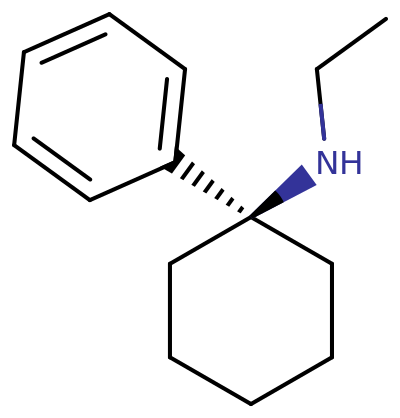

[◀返回](/药物/home.md)

# PCE

**与其他[解离剂](./../文档/药物分类/解离剂.md)相比，PCE 导致[精神病](/药效/精神病发作.md)（注：原文链接为Psychosis，此处映射到最接近的可用文档或保留概念，因文件树中无通用精神病文档，暂链至兴奋剂精神病作为参考或建议去除链接仅保留文本，考虑到准确性，此处保留文本不链接，或链接至外部维基百科如果允许，但根据规则应去除外链/内链。根据文件树，只有兴奋剂精神病，故此处去除链接以避免误导）和[躁狂](https://en.wikipedia.org/wiki/Mania)的概率可能显著更高。[\[1\]](#cite_note-one-1)[\[2\]](#cite_note-two-2)**

强烈不建议高剂量或连续多日使用该物质。请参阅[此部分](./PCP.md#Toxicity_and_harm_potential)了解更多详情。

| PCE | |
| --- | --- |
|  | |
| 化学命名法 | |
| 通用名称 | *PCE, Eticyclidine* |
| 取代名称 | *Eticyclidine* |
| 系统名称 | *(1\-Phenylcyclohexyl)ethylamine* |
| 类别成员 | |
| 精神活性类别 | *[解离剂](./../文档/药物分类/解离剂.md)* |
| 化学类别 | *[芳基环己胺类物质](./../文档/药物分类/芳基环己胺类物质.md)* |
| [给药途径](./../文档/给药途径.md) | |
| - **警告：** 由于个体体重、耐受性、新陈代谢和个人敏感度的差异，请务必从较低剂量开始。[参见负责任的用药部分](./../文档/负责任的用药索引页.md)。   | |
| **⇣ [抽吸](./../文档/给药途径.md)** | |
| [给药剂量](./../文档/给药剂量.md) | |
| [阈值](./../文档/药物剂量分类.md) | 1 mg |
| [轻微](./../文档/药物剂量分类.md) | 2 \- 4 mg |
| [中等](./../文档/药物剂量分类.md) | 4 \- 8 mg |
| [强烈](./../文档/药物剂量分类.md) | 8 \- 12 mg |
| [严重](./../文档/药物剂量分类.md) | 12 mg\+ **严重剂量可能导致精神病和躁狂。**[\[3\]](#cite_note-3) |
| [药效时长](./../文档/药效时长.md) | |
| [总时长](./../文档/药效时长.md) | 4 \- 6 小时 |
| [药效发作](./../文档/药效时长.md) | 2 \- 20 分钟 |
| [药效上升](./../文档/药效时长.md) | 20 \- 40 分钟 |
| [药效达峰](./../文档/药效时长.md) | 2 \- 3 小时 |
| [药效褪去](./../文档/药效时长.md) | 1 \- 2 小时 |
| [药效残余](./../文档/药效时长.md) | 4 \- 48 小时 |
| **⇣ [口服](./../文档/给药途径.md)** | |
| [给药剂量](./../文档/给药剂量.md) | |
| [阈值](./../文档/药物剂量分类.md) | 1 mg |
| [轻微](./../文档/药物剂量分类.md) | 3 \- 5 mg |
| [中等](./../文档/药物剂量分类.md) | 5 \- 10 mg |
| [强烈](./../文档/药物剂量分类.md) | 10 \- 15 mg |
| [严重](./../文档/药物剂量分类.md) | 15mg\+ **严重剂量可能导致精神病和躁狂。**[\[4\]](#cite_note-4) |
| [药效时长](./../文档/药效时长.md) | |
| [总时长](./../文档/药效时长.md) | 4 \- 8 小时 |
| [药效发作](./../文档/药效时长.md) | 30 \- 90 分钟 |
| [药效上升](./../文档/药效时长.md) | 40 \- 120 分钟 |
| [药效达峰](./../文档/药效时长.md) | 2 \- 3 小时 |
| [药效褪去](./../文档/药效时长.md) | 1 \- 2 小时 |
| [药效残余](./../文档/药效时长.md) | 4 \- 48 小时 |
| **⇣ [鼻吸](./../文档/给药途径.md)** | |
| [给药剂量](./../文档/给药剂量.md) | |
| [阈值](./../文档/药物剂量分类.md) | 1 mg |
| [轻微](./../文档/药物剂量分类.md) | 2 \- 4 mg |
| [中等](./../文档/药物剂量分类.md) | 4 \- 8 mg |
| [强烈](./../文档/药物剂量分类.md) | 8 \- 15 mg |
| [严重](./../文档/药物剂量分类.md) | 15mg\+ **严重剂量可能导致精神病和躁狂。**[\[5\]](#cite_note-psychosis-5) |
| [药效时长](./../文档/药效时长.md) | |
| [总时长](./../文档/药效时长.md) | 4 \- 6 小时 |
| [药效发作](./../文档/药效时长.md) | 3 \- 30 分钟 |
| [药效上升](./../文档/药效时长.md) | 30 \- 90 分钟 |
| [药效达峰](./../文档/药效时长.md) | 2 \- 3 小时 |
| [药效褪去](./../文档/药效时长.md) | 1 \- 2 小时 |
| [药效残余](./../文档/药效时长.md) | 4 \- 48 小时 |
| - **[免责声明](./../文档/关于本站/观前提醒.md)：** 本站的[给药剂量](./../文档/给药剂量.md)信息收集自用户和[资源](./../文档/科学信息索引页.md)，仅供教育目的。它不是推荐，应与其他来源核实以确保准确性。 | |
| [药物联用](#Dangerous_interactions) | |
|  | |
|  | |
| [兴奋剂](./../文档/药物分类/兴奋剂.md) | 💔 联用危险 |
| [抑制剂](./../文档/药物分类/抑制剂.md) | 💔 联用危险 |

**PCE**（也称为 **Eticyclidine** 或 **CI\-400**）是[芳基环己胺类物质](./../文档/药物分类/芳基环己胺类物质.md)化学类别的合成[解离剂](./../文档/药物分类/解离剂.md)，在[给药](./../文档/给药途径.md)时会产生[分离效应](./../药效/分离效应.md)、[麻醉](./../药效/镇痛.md)和[致幻](./../文档/药物分类/迷幻剂.md)效应。像其结构密切相关的类似物 [PCP](./PCP.md) 一样，PCE 主要作为 [NMDA受体拮抗剂](./../文档/药物分类/NMDA受体拮抗剂类药物.md)发挥作用，它非竞争性地结合并阻断 NMDA 受体的活性。[\[6\]](#cite_note-Morris2014-6)[\[7\]](#cite_note-7)[\[8\]](#cite_note-8)

PCP 在 1950 年代作为[麻醉](./../药效/镇痛.md)药物上市，但由于解离性[致幻](./../文档/药物分类/迷幻剂.md)副作用的高发率，于 1965 年退市，这些副作用在 PCE 中也被发现。不久之后，Parke-Davis 的研究人员发现了[氯胺酮](./氯胺酮.md)作为一种耐受性更好的衍生物用于麻醉药物。从那时起，许多 PCP 的合成衍生物被作为解离剂用于娱乐和非医疗用途。[\[6\]](#cite_note-Morris2014-6)

如今，PCE 通常作为一种娱乐性药物使用，或更罕见地，与其流行的现代亲属 [3-MeO-PCP](./3-MeO-PCP.md) 和 [3-MeO-PCE](./3-MeO-PCE.md) 一起用于[精神探索](./../文档/精神探索.md)目的。PCE 可以[口服](./../文档/给药途径.md)、[抽吸](./../文档/给药途径.md)、[鼻吸](./../文档/给药途径.md)或[注射](./../文档/给药途径.md)。[\[9\]](#cite_note-9) 它以其效力、效应的多样性、长效性和滥用倾向而著称。值得注意的是，PCE 比 PCP 稍微强效一些，具有相似的效应，但其令人不快的味道和导致恶心的倾向使其较少被使用者接受，从而使其相对默默无闻。

目录
--------

* [1 化学](#Chemistry)
* [2 药理学](#Pharmacology)
* [3 主观效应](#Subjective_effects)
    + [3\.1 **躯体效应**](#Physical_effects)
    + [3\.2 **分离效应**](#Disconnective_effects)
    + [3\.3 **视觉效应**](#Visual_effects)
        - [3\.3\.1 抑制](#Suppression)
        - [3\.3\.2 扭曲](#Distortions)
        - [3\.3\.3 几何](#Geometry)
        - [3\.3\.4 幻觉状态](#Hallucinatory_states)
    + [3\.4 **认知效应**](#Cognitive_effects)
    + [3\.5 **听觉效应**](#Auditory_effects)
    + [3\.6 体验报告](#Experience_reports)
* [4 毒性和伤害潜力](#Toxicity_and_harm_potential)
    + [4\.1 耐受性和成瘾潜力](#Tolerance_and_addiction_potential)
    + [4\.2 精神病](#Psychosis)
    + [4\.3 尿路效应](#Urinary_tract_effects)
    + [4\.4 危险的相互作用](#Dangerous_interactions)
* [5 法律地位](#Legal_status)
* [6 另见](#See_also)
* [7 外部链接](#External_links)
* [8 文献](#Literature)
* [9 参考文献](#References)

化学
---------

PCE，或 Eticyclidine，是芳基环己胺类的合成解离剂。PCE 包含环己烷，一个六元饱和环，在 R1 处与一个环和一个乙基结合。其中一个环是哌啶环，一个含氮六元环，在其氮基团处结合。氮处的另一个成分不像 PCP 那样是一个完整的环己烷环，而是一个乙基。与 PCP 一样，PCE 是以三个组成环 **p**henyl（苯基）、**c**yclohexane（环己烷）和 **e**thyl（乙基）的首字母命名的缩写。

药理学
------------

更多信息：[NMDA受体拮抗剂](./../文档/药物分类/NMDA受体拮抗剂类药物.md)

NMDA 受体（谷氨酸受体的一个亚型，谷氨酸是神经系统中主要的兴奋性神经递质）允许电信号在脑和脊柱的神经细胞之间传递；为了传递信号，受体必须是开放的。NMDA 受体拮抗剂已被证明通过阻断这些受体来破坏这种信号传递。神经系统中信息流的这种断开导致感觉丧失（麻醉）、运动困难（运动失调），最终导致该物质相当于“[K洞](./../药效/视觉效应.md#Holes.2C_spaces_and_voids)”状的状态，这与在氯胺酮上体验到的最为相关，尽管性质上存在本质差异。\[*[来源请求](./../文档/科学信息索引页.md)*\]

除了其独特的 NMDA 受体阻断能力外，PCE 还充当[多巴胺](./../文档/多巴胺.md)-[去甲肾上腺素](./../文档/去甲肾上腺素.md)[再摄取抑制剂](./../文档/神经递质再摄取抑制剂.md)以及[血清素](./../文档/血清素.md)[再摄取抑制剂](./../文档/神经递质再摄取抑制剂.md)，具有可疑的 µ-阿片受体亲和力和典型的[解离](./../文档/药物分类/解离剂.md)效应。这为其欣快和经常的刺激特性提供了解释。

PCE 比 PCP 稍微强效一些，具有相似的效应，但其令人不快的味道和导致恶心的倾向使其较少被使用者接受。[\[10\]](#cite_note-10)

主观效应
------------------

|  | **此主观效应部分是一个[小节](./../文档/科学信息索引页.md)**。 *因此，它仍在进行中，可能包含不完整或错误的信息。* *您可以通过[编辑它](https://psychonautwiki.org/w/index.php?title=PCE&action=edit)来提供帮助。* |
| --- | --- |

***免责声明：** 下列效应引用自[***主观效应索引***](./../文档/科学信息索引页.md) (**SEI**)，这是一个基于传闻中的用户报告和[PsychonautWiki](./../文档/关于本站/关于FreeODwiki.md) [贡献者](https://psychonautwiki.org/wiki/Special:TopUsers)个人分析的开放研究文献。因此，应以健康的怀疑态度看待它们。*

*同样值得注意的是，这些效应不一定会以可预测或可靠的方式发生，尽管较高的剂量更可能诱发全方位的效应。同样，**不良反应**随着剂量的增加而变得越来越可能，可能包括**成瘾、严重伤害或死亡*** ☠。

### **躯体效应** Child.png

*     + **[自发性躯体感觉](./../药效/躯体效应.md)**
    + **[触觉抑制](./../药效/触觉效应.md)**
    + **[躯体自主](./../药效/躯体自主.md)**
    + **[运动控制丧失](./../药效/运动控制丧失.md)**
    + **[躯体欣快感](./../药效/躯体欣快感.md)**
    + **[躯体轻盈感](./../药效/躯体轻盈感.md)**
    + **[头晕](./../药效/头晕.md)**
    + **[恶心](./../药效/恶心.md)**
    + **[视觉滑动](./../药效/眼球滑动.md)**

### **[分离效应](./../药效/分离效应.md)** Chain-broken.png

*     + **[触觉分离](./../药效/分离效应.md)**
    + **[视觉分离](./../药效/分离效应.md)** \- 这最终导致 PCE 相当于“K洞”或更具体的，*[孔洞、空间和虚空](./../药效/视觉效应.md#Holes.2C_spaces_and_voids)* 以及 *[结构](./../药效/视觉效应.md#Structures)*。然而，与氯胺酮不同，PCE 在这个水平上不会使用户无法动弹，这可能导致不可预测的精神病行为。
    + **[意识分离](./../药效/分离效应.md)**

### **视觉效应** Eye.png

* #### 抑制
    + **[视觉锐度抑制](./../药效/视觉锐度抑制.md)**
    + **[复视](./../药效/复视.md)**
    + **[模式识别抑制](./../药效/模式识别抑制.md)**
    + **[帧率抑制](./../药效/视觉效应.md)**

#### 扭曲
    + **[透视扭曲](./../药效/视觉效应.md)**
    + **[环境立体主义](./../药效/视觉效应.md)**
    + **[环境球体主义](./../药效/视觉效应.md)**
    + **[风景切片](./../药效/视觉效应.md)**

#### [几何](./../药效/视觉效应.md)
#### 幻觉状态
    在高剂量下，PCE 可以产生全方位的高级幻觉状态，其方式不如许多其他常用[迷幻剂](./../文档/药物分类/迷幻剂.md)那样一致和可重复。这些效应包括：

    + **[外部幻觉](./../药效/视觉效应.md)**
    + **[内部幻觉](./../药效/视觉效应.md)**

### **认知效应** User.png

* PCE 的一般思维空间通常被描述为比[右美沙芬](./右美沙芬.md)和[氯胺酮](./氯胺酮.md)更具刺激性、欣快感和头脑清晰。具体的认知效应可以分解为几个独立的子成分，列出如下：

    + **[焦虑抑制](./../药效/镇静.md)**
    + **[去抑制](./../药效/认知效应.md)**
    + **[概念性思维](./../药效/认知效应.md)**
    + **[思维加速](./../药效/认知效应.md)**
    + **[思维混乱](./../药效/认知效应.md)**
    + **[沉浸感增强](./../药效/认知效应.md)**
    + **[妄想](./../药效/认知效应.md)**
    + **[人格解体](./../药效/分离效应.md)** \& **[现实解体](./../药效/分离效应.md)**
    + **[记忆抑制](./../药效/认知效应.md)**
        - **[自我死亡](./../药效/认知效应.md)**
        - **[失忆](./../药效/认知效应.md)**
    + **[分析抑制](./../药效/认知效应.md)**
    + **[时间扭曲](./../药效/认知效应.md)**
    + **[认知欣快](./../药效/认知效应.md)**
    + **[内省](./../药效/认知效应.md)**
    + **[既视感](./../药效/认知效应.md)**
    + **[强迫性补量](./../药效/认知效应.md)**
    + **[大难临头感](./../药效/认知效应.md)**
    + **[创造力增强](./../药效/认知效应.md)**
    + **[精神病](/药效/精神病发作.md)** \- 这种效应在 PCE 上比其他解离剂更常见。[\[11\]](#cite_note-Tasman2015-11)

### **听觉效应** Volume-up.png

*     + **[抑制](./../药效/听觉效应.md)**
    + **[扭曲](./../药效/听觉效应.md)**
    + **[幻觉](./../药效/听觉效应.md)**

### 体验报告

目前我们的[体验索引](./../文档/科学信息索引页.md)中没有描述该化合物效应的轶事报告。更多的体验报告可以在这里找到：

* [Erowid Experience Vaults: PCE](https://www.erowid.org/experiences/subs/exp_PCE.shtml)

毒性和伤害潜力
---------------------------

更多信息：[研究用化学品 § 毒性和伤害潜力](./../文档/研究用化学品.md#Toxicity_and_harm_potential)，以及[负责任的用药 § 迷幻剂](./../文档/负责任的用药索引页.md#Hallucinogens)

长期使用 PCE 可能导致类精神分裂症的精神病发作、严重的持久性记忆丧失、思维混乱、抑郁、体重减轻、肝脏异常和横纹肌溶解（骨骼肌分解）。[\[12\]](#cite_note-erowid-12)

一些研究发现，像其他[NMDA受体拮抗剂](./../文档/药物分类/NMDA受体拮抗剂类药物.md)一样，PCE 可以在大鼠中引起称为[奥尔尼病变](https://en.wikipedia.org/wiki/Olney%27s_lesions)的脑损伤。[\[13\]](#cite_note-13)[\[14\]](#cite_note-14) 对大鼠进行的研究表明，高剂量的 NMDA 受体拮抗剂地佐环平会导致大鼠脑部某些区域形成可逆的空泡。所有关于奥尔尼病变的研究仅在非人类动物身上进行，可能不适用于人类。

PCE 也已被证明在大鼠脑中引起 N-乙酰天冬氨酸和 N-乙酰天冬氨酰谷氨酸水平的类精神分裂症变化，这在活体大鼠和脑组织尸检中均可检测到。[\[15\]](#cite_note-15) 它还在人类中诱发模仿精神分裂症的症状。[\[16\]](#cite_note-16)

强烈建议在使用此物质时采取[伤害减少措施](./../文档/负责任的用药索引页.md)，例如[液体容量给药法](./../文档/液体容量给药法.md)，以确保施用预期的剂量。

### 耐受性和成瘾潜力

PCE 的慢性使用可被视为高度成瘾，具有产生不良副作用（如精神病）的高潜力。与其他[解离剂](./../文档/药物分类/解离剂.md)相比，据报道 PCE 比 [MXE](./../文档/药物分类/解离剂.md)（注：暂无MXE条目，链接至解离剂分类或保持红链，此处链接至分类）、[Diphenidine](./../文档/药物分类/解离剂.md)（二苯啶，暂无条目）、[Ephenidine](./../文档/药物分类/解离剂.md)（乙苯啶，暂无条目）和[氯胺酮](./氯胺酮.md)更容易成瘾。当成瘾形成时，如果一个人突然停止使用，可能会出现渴望和[戒断效应](./../文档/药物戒断反应.md)。互联网上有多份报告称，人们成为该物质的严重成瘾的日常使用者，因此在尝试该物质之前应采取严肃的预防措施和考虑。

随着长期和反复使用，对 PCE 许多效应的耐受性会发展。这导致使用者必须施用越来越大的剂量才能达到相同的效果。之后，耐受性需要大约 3 - 7 天才能减半，1 - 2 周才能恢复到基线（在没有进一步摄入的情况下）。PCE 与所有[解离剂](./../文档/药物分类/解离剂.md)呈现交叉耐受，这意味着在消耗 PCE 后，所有[解离剂](./../文档/药物分类/解离剂.md)的效果都会降低。

### 精神病

据报道，PCE 导致[精神病](/药效/精神病发作.md)和躁狂的比率明显高于其他[解离剂](./../文档/药物分类/解离剂.md)，如[氯胺酮](./氯胺酮.md)、[Diphenidine](./../文档/药物分类/解离剂.md)或 [MXE](./../文档/药物分类/解离剂.md)。多篇科学论文描述了在摄入中等至大剂量药物后发生的精神病、躁狂和/或谵妄状态。在一项初步的人体试验中，据报道，接受麻醉剂量的患者中有六分之一出现精神病。在某些情况下，需要长达一周或更长时间才能缓解。在使用亚麻醉剂量的 PCE 进行缓解疼痛的试验期间，也报告了类似的结果（尽管不那么严重）。[\[11\]](#cite_note-Tasman2015-11)

强烈建议在使用这种药物时极度小心并采取[伤害减少措施](./../文档/负责任的用药索引页.md)。

* 使用者应避免连续多天服用该药物或对其成瘾，因为这会增加出现严重不良反应的风险。
* 不应超过推荐的剂量范围，因为高剂量会引发不良反应。
* 使用者应从极低剂量开始，并尽可能缓慢地增加剂量。由于药物的效力，最好使用[液体容量给药法](./../文档/液体容量给药法.md)；大多数标准[毫克称](./../文档/毫克称.md)无法准确称量 10-15mg 以下的剂量。
* 不建议在完全清醒之前[强迫性补量](./../药效/认知效应.md)，这可能导致剂量过高。

由于精神病的风险，不建议将此药物与其他物质结合使用，特别是[兴奋剂](./../文档/药物分类/兴奋剂.md)、[迷幻剂](./../文档/药物分类/迷幻剂.md)或其他[解离剂](./../文档/药物分类/解离剂.md)，如 [MXE](./../文档/药物分类/解离剂.md)。在消费之前，应始终进行独立研究以确保两种或多种物质的组合是安全的。

### 尿路效应

就长期反复过度使用对健康的长期影响而言，PCE 似乎表现出与在其他[芳基环己胺类物质](./../文档/药物分类/芳基环己胺类物质.md)如[氯胺酮](./氯胺酮.md)或 [PCP](./PCP.md) 中发现的类似的极端膀胱和尿路问题。

* **[尿频](./../药效/尿频.md)** \- 尿频是每隔几分钟就需要排空膀胱。
* **尿急** \-这可以描述为一种突然、强烈的排尿需求。
* **尿压** \- 这被体验为膀胱持续充满的感觉，排尿无法缓解。
* **骨盆和膀胱疼痛** \- 疼痛可能会突然严重地发展，特别是当膀胱充满尿液时。
* **血尿** \- 血尿是尿液中可见的血液。
* **失禁** \- 这是尿液的渗漏。

大量的轶事证据表明，通过不定期使用 PCE（至少每天或每周）并仔细监测和限制该物质的使用，可以将这些症状降至最低，尽管由于观察到的毒性特性，仍然不鼓励一般使用该物质。

### 危险的相互作用

***警告：*** *许多独自使用时相当安全的精神活性物质，当与某些其他物质结合使用时，可能会突然变得危险甚至危及生命。以下列表提供了一些已知的危险相互作用（尽管不保证包括所有相互作用）。*

*始终进行独立研究（例如 [Google](https://www.google.com)、[DuckDuckGo](https://www.duckduckgo.com)、[PubMed](https://pubmed.ncbi.nlm.nih.gov/)）以确保两种或多种物质的组合是安全的。一些列出的相互作用来自 [TripSit](https://combo.tripsit.me)。*

* **[迷幻剂](./../文档/药物分类/迷幻剂.md)** \- 不建议这种组合，因为据报道 PCE 导致极端心理障碍（如[精神病](/药效/精神病发作.md)和躁狂）的比率明显高于其他[解离剂](./../文档/药物分类/解离剂.md)。
* **[兴奋剂](./../文档/药物分类/兴奋剂.md)** \- 兴奋剂和解离剂都有产生不良心理反应的风险，如[焦虑](./../药效/镇静.md)、[躁狂](/药效/躁狂.md)和[精神病](/药效/精神病发作.md)，当两种物质结合使用时，这些风险会加剧。
* **[抑制剂](./../文档/药物分类/抑制剂.md)** \- 因为两者都抑制呼吸系统，这种组合可能导致突然失去知觉、呕吐和因窒息而死亡的风险增加。如果发生[恶心](./../药效/恶心.md)或呕吐，使用者应尝试以[恢复体位](./../文档/恢复体位.md)入睡或让朋友将他们移入该体位。

法律地位
------------

|  | **此法律部分是一个[小节](./../文档/科学信息索引页.md)。** *因此，它可能包含不完整或错误的信息。您可以通过[编辑它](https://psychonautwiki.org/w/index.php?title=PCE&action=edit)来提供帮助。* |
| --- | --- |

在国际上，PCE 是《精神药物公约》附表 I 中的物质。[\[17\]](#cite_note-17)

* **加拿大** \- PCE 受 CDSA 附表 III 管制，这使得在没有许可证或处方的情况下销售、拥有和制造它是非法的。\[*[来源请求](./../文档/科学信息索引页.md)*\]
* **德国：** PCE 受 BtMG Anlage I 管制，这使得在没有许可证的情况下制造、进口、拥有、销售或转让它是非法的。[\[18\]](#cite_note-18)
* **新西兰** \- PCE 在新西兰是附表 I（A 类）。\[*[来源请求](./../文档/科学信息索引页.md)*\]
* **波兰** \- PCE 在波兰是附表 II（II-P 组）。\[*[来源请求](./../文档/科学信息索引页.md)*\]
* **葡萄牙** \- 自 2001 年 7 月起，第 30/2000 号法律将 PCE 的个人使用去罪化。拥有少于 100 mg 不被视为刑事犯罪，尽管该物质可能会被没收，拥有者可能会被转介至强制治疗。销售或拥有超过个人拥有限量的数量是可判处监禁的刑事犯罪。\[*[来源请求](./../文档/科学信息索引页.md)*\]
* **瑞士：** PCE 是 Verzeichnis D 下特别列出的受控物质。[\[19\]](#cite_note-19)
* **英国** \- PCE 在英国是 A 类药物，这使得在没有处方的情况下购买或拥有它是非法的。\[*[来源请求](./../文档/科学信息索引页.md)*\]
* **美国** \- PCE 是附表 II 受控物质。\[*[来源请求](./../文档/科学信息索引页.md)*\]

另见
--------

* [负责任的用药](./../文档/负责任的用药索引页.md)
    + [液体容量给药法](./../文档/液体容量给药法.md)
* [研究用化学品](./../文档/研究用化学品.md)
* [解离剂](./../文档/药物分类/解离剂.md)
* [PCP](./PCP.md)
* [MXE](./../文档/药物分类/解离剂.md)
* [3\-MeO\-PCE](./3-MeO-PCE.md)

外部链接
--------------

* [PCE (Wikipedia)](https://en.wikipedia.org/wiki/Eticyclidine)
* [PCE (Isomer Design)](https://isomerdesign.com/PiHKAL/explore.php?id=11018)

文献
----------

* Morris, H., \& Wallach, J. (2014\). ***From PCP to MXE: A comprehensive review of the non\-medical use of dissociative drugs***. *Drug Testing and Analysis*, 6(7–8\), 614–632\. <https://doi.org/10.1002/dta.1620>

参考文献
----------

1. [↑](#cite_ref-one_1-0) Luisada, P. V. M. D. (1978\), [*The Phencyclidine Psychosis: Phenomenology and Treatment." Phencyclidine (PCP) Abuse: An Appraisal.*](https://www.ojp.gov/ncjrs/virtual-library/abstracts/phencyclidine-psychosis-phenomenology-and-treatment-phencyclidine), National Institute on Drug Abuse 
2. [↑](#cite_ref-two_2-0) Tasman, A., Kay, J., Lieberman, J. A., First, M. B., Riba, M. (5 February 2015\). *Psychiatry*. John Wiley \& Sons. [ISBN](http://en.wikipedia.org/wiki/International_Standard_Book_Number "wikipedia:International Standard Book Number") [9781118753361](http://en.wikipedia.org/wiki/Special:BookSources/9781118753361 "wikipedia:Special:BookSources/9781118753361"). 
3. [↑](#cite_ref-3) PCP Psychosis (PsychonautWiki) \| <https://psychonautwiki.org/wiki/3-MeO-PCP#Toxicity_and_harm_potential>
4. [↑](#cite_ref-4) PCP Psychosis (PsychonautWiki) \| <https://psychonautwiki.org/wiki/3-MeO-PCP#Toxicity_and_harm_potential>
5. [↑](#cite_ref-psychosis_5-0) 3\-MeO\-PCP Psychosis (PsychonautWiki) \| <https://psychonautwiki.org/wiki/3-MeO-PCP#Toxicity_and_harm_potential>
6. ↑ [6\.0](#cite_ref-Morris2014_6-0) [6\.1](#cite_ref-Morris2014_6-1) Morris, H., Wallach, J. (August 2014\). "From PCP to MXE: a comprehensive review of the non\-medical use of dissociative drugs". *Drug Testing and Analysis*. **6** (7–8\): 614–632\. [doi](http://en.wikipedia.org/wiki/Digital_object_identifier "wikipedia:Digital object identifier"):[10\.1002/dta.1620](//doi.org/10.1002%2Fdta.1620). [ISSN](http://en.wikipedia.org/wiki/International_Standard_Serial_Number "wikipedia:International Standard Serial Number") [1942\-7611](//www.worldcat.org/issn/1942-7611). 
7. [↑](#cite_ref-7) McKim, W. A. (2000\). *Drugs and behavior: an introduction to behavioral pharmacology* (4th ed ed.). Prentice Hall. [ISBN](http://en.wikipedia.org/wiki/International_Standard_Book_Number "wikipedia:International Standard Book Number") [9780130831460](http://en.wikipedia.org/wiki/Special:BookSources/9780130831460 "wikipedia:Special:BookSources/9780130831460"). CS1 maint: Extra text ([link](/w/index.php?title=Category:CS1_maint:_Extra_text&action=edit&redlink=1 "Category:CS1 maint: Extra text (page does not exist)"))
8. [↑](#cite_ref-8) Kapur, S., Seeman, P. (September 2002\). ["NMDA receptor antagonists ketamine and PCP have direct effects on the dopamine D2 and serotonin 5\-HT2 receptors—implications for models of schizophrenia"](https://www.nature.com/articles/4001093). *Molecular Psychiatry*. **7** (8\): 837–844\. [doi](http://en.wikipedia.org/wiki/Digital_object_identifier "wikipedia:Digital object identifier"):[10\.1038/sj.mp.4001093](//doi.org/10.1038%2Fsj.mp.4001093). [ISSN](http://en.wikipedia.org/wiki/International_Standard_Serial_Number "wikipedia:International Standard Serial Number") [1476\-5578](//www.worldcat.org/issn/1476-5578). 
9. [↑](#cite_ref-9) Abuse, N. I. on D. (2019\), [*Hallucinogens DrugFacts*](https://nida.nih.gov/publications/drugfacts/hallucinogens) 
10. [↑](#cite_ref-10) Kalir, A., Edery, H., Pelah, Z., Balderman, D., Porath, G. (May 1969\). ["1\-Phenylcycloalkylamine derivatives. II. Synthesis and pharmacological activity"](https://pubs.acs.org/doi/abs/10.1021/jm00303a030). *Journal of Medicinal Chemistry*. **12** (3\): 473–477\. [doi](http://en.wikipedia.org/wiki/Digital_object_identifier "wikipedia:Digital object identifier"):[10\.1021/jm00303a030](//doi.org/10.1021%2Fjm00303a030). [ISSN](http://en.wikipedia.org/wiki/International_Standard_Serial_Number "wikipedia:International Standard Serial Number") [0022\-2623](//www.worldcat.org/issn/0022-2623). 
11. ↑ [11\.0](#cite_ref-Tasman2015_11-0) [11\.1](#cite_ref-Tasman2015_11-1) Tasman, A., Kay, J., Lieberman, J. A., First, M. B., Riba, M. (5 February 2015\). *Psychiatry*. John Wiley \& Sons. [ISBN](http://en.wikipedia.org/wiki/International_Standard_Book_Number "wikipedia:International Standard Book Number") [9781118753361](http://en.wikipedia.org/wiki/Special:BookSources/9781118753361 "wikipedia:Special:BookSources/9781118753361"). 
12. [↑](#cite_ref-erowid_12-0) PCE Effects by Erowid \| <https://www.erowid.org/chemicals/PCE/PCE_effects.shtml>
13. [↑](#cite_ref-13) Olney, J. W., Labruyere, J., Price, M. T. (16 June 1989\). "Pathological changes induced in cerebrocortical neurons by phencyclidine and related drugs". *Science (New York, N.Y.)*. **244** (4910\): 1360–1362\. [doi](http://en.wikipedia.org/wiki/Digital_object_identifier "wikipedia:Digital object identifier"):[10\.1126/science.2660263](//doi.org/10.1126%2Fscience.2660263). [ISSN](http://en.wikipedia.org/wiki/International_Standard_Serial_Number "wikipedia:International Standard Serial Number") [0036\-8075](//www.worldcat.org/issn/0036-8075). 
14. [↑](#cite_ref-14) Hargreaves, R. J., Hill, R. G., Iversen, L. L. (1994\). "Neuroprotective NMDA antagonists: the controversy over their potential for adverse effects on cortical neuronal morphology". *Acta Neurochirurgica. Supplementum*. **60**: 15–19\. [doi](http://en.wikipedia.org/wiki/Digital_object_identifier "wikipedia:Digital object identifier"):[10\.1007/978\-3\-7091\-9334\-1\_4](//doi.org/10.1007%2F978-3-7091-9334-1_4). 
15. [↑](#cite_ref-15) Reynolds, L. M., Cochran, S. M., Morris, B. J., Pratt, J. A., Reynolds, G. P. (1 March 2005\). "Chronic phencyclidine administration induces schizophrenia\-like changes in N\-acetylaspartate and N\-acetylaspartylglutamate in rat brain". *Schizophrenia Research*. **73** (2–3\): 147–152\. [doi](http://en.wikipedia.org/wiki/Digital_object_identifier "wikipedia:Digital object identifier"):[10\.1016/j.schres.2004\.02\.003](//doi.org/10.1016%2Fj.schres.2004.02.003). [ISSN](http://en.wikipedia.org/wiki/International_Standard_Serial_Number "wikipedia:International Standard Serial Number") [0920\-9964](//www.worldcat.org/issn/0920-9964). 
16. [↑](#cite_ref-16) Murray, J. B. (May 2002\). "Phencyclidine (PCP): a dangerous drug, but useful in schizophrenia research". *The Journal of Psychology*. **136** (3\): 319–327\. [doi](http://en.wikipedia.org/wiki/Digital_object_identifier "wikipedia:Digital object identifier"):[10\.1080/00223980209604159](//doi.org/10.1080%2F00223980209604159). [ISSN](http://en.wikipedia.org/wiki/International_Standard_Serial_Number "wikipedia:International Standard Serial Number") [0022\-3980](//www.worldcat.org/issn/0022-3980). 
17. [↑](#cite_ref-17) ["List of psychotropic substances under international control (Green List)"](http://web.archive.org/web/20070302130637/http://www.incb.org/pdf/e/list/green.pdf) (PDF) (23rd ed.). International Narcotics Control Board (INCB). August 2003\. Archived from [the original](http://www.incb.org/pdf/e/list/green.pdf) (PDF) on March 2, 2007\. 
18. [↑](#cite_ref-18) [*Anlage I BtMG \- Einzelnorm*](http://www.gesetze-im-internet.de/btmg_1981/anlage_i.html) 
19. [↑](#cite_ref-19) ["Verordnung des EDI über die Verzeichnisse der Betäubungsmittel, psychotropen Stoffe, Vorläuferstoffe und Hilfschemikalien"](https://www.admin.ch/opc/de/classified-compilation/20101220/index.html) (in German). Bundeskanzlei \[Federal Chancellery of Switzerland\]. Retrieved January 1, 2020.