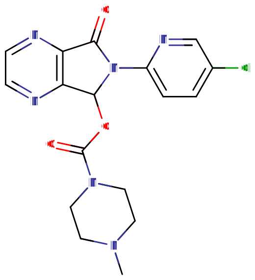

# 佐匹克隆

[◀返回](index.md)

!!! danger "危险联用"

    **⚠️ 警告！当 [GABA 类物质](../文档/药物分类/抑制剂.md) 与其他[抑制剂](../文档/药物分类/抑制剂.md)（如[阿片类药物](../文档/药物分类/阿片类药物.md)、[苯二氮卓类物质](../文档/药物分类/苯二氮卓类物质.md)、[巴比妥类物质](../文档/药物分类/巴比妥类物质.md)、[加巴喷丁类物质](../文档/药物分类/加巴喷丁类物质.md)、[噻吩二氮卓类物质](../文档/药物分类/噻吩二氮卓类物质.md) 或[酒精](./酒精.md)）混用时，可能会导致致命的[过量](../文档/药物过量.md)！[^1]**

    我们强烈不建议将这些物质混用，特别是在[中等](../文档/药物剂量分类.md)到[严重](../文档/药物剂量分类.md)剂量的情况下，非常危险！

| **化学信息** | 佐匹克隆（Zopiclone）                                                                                          |
| ------------ | -------------------------------------------------------------------------------------------------------------- |
| 结构式       |                                                                                      |
| 分子式       | C17H17ClN6O3                                                       |
| CAS 号       | 43200-80-2                                                                                                     |
| **化学命名** |                                                                                                                |
| 常用名称     | Zimovane, Imovane                                                                                              |
| 取代名称     | Zopiclone                                                                                                      |
| 系统名称     | (RS)-6-(5-Chloropyridin-2-yl)-7-oxo-6,7-dihydro-5H-pyrrolo[3,4-b]pyrazin-5-yl 4-methylpiperazine-1-carboxylate |
| **类别归属** |                                                                                                                |
| 精神活性分类 | _[抑制剂](../文档/药物分类/抑制剂.md) / [致幻剂](../文档/药物分类/致幻剂.md)_                                  |
| 化学分类     | _[环吡咯酮](../文档/药物分类/环吡咯酮.md)_                                                                     |

| [**给药途径**](../文档/给药途径.md) | 🔽 [口服](../文档/给药途径.md#口服) |
| ----------------------------------- | ----------------------------------- |
| 生物利用度                          | 52 \~ 59%                           |
| [**剂量**](../文档/给药剂量.md)     |                                     |
| 阈值                                | 2 mg                                |
| 轻微                                | 3.5 \~ 5 mg                         |
| 中等                                | 5 \~ 7.5 mg                         |
| 强烈                                | 7.5 \~ 15 mg                        |
| 严重                                | 15 mg +                             |
| [**药效时长**](../文档/药效时长.md) |                                     |
| 总时长                              | 3.5 \~ 9 小时                       |
| 药效发作                            | 10 \~ 30 分钟                       |
| 药效达峰                            | 3 \~ 4 小时                         |

- !!! warning "警告"

        由于个体体重、耐受性、新陈代谢和个人敏感度的差异，请务必从低剂量开始。参见[负责任的用药部分](../文档/负责任的用药索引页.md)。

    !!! info "[免责声明](../关于本站/免责声明.md)"

        本站的[给药剂量](../文档/给药剂量.md)信息收集自用户和[相关资源](../文档/科学信息索引页.md)，仅供教育目的使用。这不是医疗建议，应与其他来源核实以确保准确性。

**佐匹克隆**（Zopiclone，商品名也叫 **Zimovane** 和 **Imovane** ）是一种非[苯二氮卓类](../文档/药物分类/苯二氮卓类物质.md)的[催眠](../文档/催眠药.md)药物，属于[环吡咯酮](../文档/药物分类/环吡咯酮.md)类物质。它是大家俗称的"Z 药"（Z-drugs）家族的一员，这个家族还包括[扎来普隆](扎来普隆.md)（Sonata）和[唑吡坦](./唑吡坦.md)（Ambien 和 AmbienCR）。其作用机制与苯二氮卓类药物类似，通过 [GABA](../文档/GABA.md) 结合发挥作用。

因为它有很强的[镇静](../药效/镇静.md)效果，所以主要用来治疗失眠。

虽然起初大家以为「Z 药」的滥用潜力比苯二氮卓类药物要小，但在过去几年里，这种看法发生了一些变化，因为已经观察到了许多成瘾和依赖的案例。和所有的"Z 药"一样，建议佐匹克隆只在短期内使用——通常是一周或更短时间。[^2] 通常不建议每天或长期连续使用。[^3]

## 化学

佐匹克隆是一种环吡咯酮类的非苯二氮卓类催眠药。佐匹克隆和其密切相关的右旋 S-立体异构体右佐匹克隆（_Lunesta_）是最流行和常见的环吡咯酮类药物。这一类药物的名字来源于它们都有一个吡咯酮核心——也就是一个带有氮取代基（吡咯）和酮基（-one）的五元环。

在佐匹克隆中，酮基位于吡咯酮环的 R5 位置。佐匹克隆包含四个含氮环，其中就包括吡咯酮。与吡咯酮核心稠合的是一个吡嗪环，这是一个带有两个氮取代基的六元芳香环。这两个环在 R3 和 R4 处稠合。这种双环核心被称为吡咯并吡嗪。在 R6 处与吡咯酮氮基团结合的是一个取代的吡啶环。吡啶是一个带有一个氮基团的六元不饱和环。佐匹克隆的吡啶环在 R5 处被一个氯基团取代了。

佐匹克隆的最后一个环是哌嗪环。哌嗪是一个带有两个氮成分的六元饱和环；在这里，它在 R4 处被一个甲基取代。这个哌嗪环通过一个羧酸酯基团在 R7 处连接到佐匹克隆的吡咯酮核心上。

可以通过色谱法测量血液、血浆或尿液中的佐匹克隆含量。治疗期间血浆浓度通常低于 100 μg/L，但在因驾驶能力受损被捕的司机中经常超过 100 μg/L，而在急性中毒患者中可能超过 1,000 μg/l。在致命的急性过量受害者中，_尸检_ 血液浓度通常在 0.4 \~ 3.9 mg/L 的范围内。[^4]

## 药理学

尽管结构不同，佐匹克隆与[苯二氮卓类物质](../文档/药物分类/苯二氮卓类物质.md)具有几乎相同的药理学特征。它的作用机制是结合到与苯二氮卓类药物相同的位点，并作为完全激动剂发挥作用，从而正向调节对苯二氮卓敏感的[GABA](../文档/GABA.md)A [受体](../文档/受体激动剂.md)，并增强 GABA 在 [GABA](../文档/GABA.md)A 受体上的结合，从而产生佐匹克隆的主观效应。

因为 GABA 是大脑中主要的抑制性[神经递质](../文档/神经递质.md)，受体的激活会导致佐匹克隆产生[镇静](../药效/镇静.md)和[抗焦虑](../药效/焦虑抑制.md)的效果。除了苯二氮卓类的药理特性外，佐匹克隆还具有一些类似巴比妥类药物的特性。

此外，它（连同去甲基佐匹克隆）是烟碱乙酰胆碱受体的非竞争性拮抗剂。[^5] 这可能是导致类似谵妄效果的原因。

佐匹克隆的代谢产物去甲基佐匹克隆也具有药理活性，尽管它主要具有抗焦虑特性。一项研究发现佐匹克隆对 α1 和 α5 亚基有一些轻微的选择性，[^6] 尽管通常认为它在结合 α1、α2、α3 和 α5 GABAA 苯二氮卓受体复合物时是非选择性的。

研究发现去甲基佐匹克隆具有部分激动剂的特性，这与作为完全激动剂的母体药物佐匹克隆不同。[^7] 佐匹克隆的作用机制与苯二氮卓类药物相似，在运动活动以及多巴胺和血清素更新率方面也有类似的影响。

## 主观效应

与[苯二氮卓类物质](../文档/药物分类/苯二氮卓类物质.md)等类似性质的物质相比，通常报告称佐匹克隆会表现出明显更多的[健忘](../药效/认知效应.md)和[去抑制](../药效/去抑制.md)效应，这与[酒精](./酒精.md)类似。

!!! info "[免责声明](../关于本站/免责声明.md)"

    _下列效应引用自 [**主观效应索引**](../药效/index.md) (**SEI**)，这是一个基于轶事用户报告和个人分析的开放研究文献。因此，应带着健康的怀疑态度来看待它们。_

    _同样值得注意的是，这些效应不一定会以可预测或可靠的方式发生，尽管较高的剂量更可能引发全方位的效应。同样，**不良反应** 随着剂量的增加变得越来越可能，可能包括 **成瘾、严重伤害或死亡** ☠。_

- ### **[躯体效应](../药效/躯体效应.md)** 
    - **[镇静](../药效/镇静.md)**：佐匹克隆的镇静作用非常强，会让使用者进入一种极度嗜睡的状态。在较高剂量下，这会让用户突然感觉自己极度睡眠不足，好像好几天没睡觉了一样，迫使他们坐下或躺下，感觉随时都要昏睡过去。这种睡眠不足的感觉与剂量成正比增加，最终可能强大到迫使人完全失去知觉，无论他们当时在哪里或在做什么。
    - **[呼吸抑制](../药效/呼吸抑制.md)**
    - **[肌肉松弛](../药效/肌肉松弛.md)**
    - **[头晕](../药效/头晕.md)**
    - **[运动控制丧失](../药效/运动控制丧失.md)**：这种效应很明显，堪比大量饮酒后的运动控制丧失。这通常导致用户走路跌跌撞撞，无法走直线。因为这很容易导致受伤，所以在使用佐匹克隆时应避免走动和上下楼梯。
    - **[味觉幻觉](../药效/味觉幻觉.md)**：有时报告称佐匹克隆会在嘴里留下金属味。

- ### **[视觉效应](../药效/视觉效应.md)** 
    - **[影子人](../药效/影子人.md)**
    - **[视力抑制](../药效/视觉锐度抑制.md)**
    - **[漂移](../药效/漂移.md)** _([融化](../药效/漂移.md)、[呼吸](../药效/漂移.md)、[变形](../药效/漂移.md) 和 [流动](../药效/漂移.md))_ - 视觉漂移效应是这种物质最显著的视觉效应。它们通常在强剂量下发生，或者当用户抵抗睡眠的冲动时发生。它们类似于 [唑吡坦](./唑吡坦.md) 产生的扭曲，通常不如 [谵妄剂](../文档/药物分类/谵妄剂.md) 那么明显。与谵妄剂的视觉效果一样，它们在光线昏暗时最明显。根据剂量和光线的不同，它们可能被描述为速度快或慢、静止或持久、运动平滑、外观逼真、简单或复杂。
    - **[外部幻觉](../药效/外部幻觉.md)**：在非常高的剂量下，佐匹克隆可能会产生类似于 [谵妄剂](../文档/药物分类/谵妄剂.md) 但不那么明显的 [外部幻觉](../药效/外部幻觉.md)。
    - **[残影](../药效/残影.md)**：这种效应很轻微，通常只在高剂量下体验到。

- ### **[认知效应](../药效/认知效应.md)** 

    佐匹克隆的认知效应可以分为几个部分，随着剂量的增加逐渐增强。许多人描述佐匹克隆的总体精神状态是强烈的镇静、抑制力下降和严重的健忘。它产生的大量认知效应是大多数 GABA 能[抑制剂](../文档/药物分类/抑制剂.md)所典型的。

    - **[健忘](../药效/认知效应.md)**：与[苯二氮卓类物质](../文档/药物分类/苯二氮卓类物质.md)相比，佐匹克隆在更低的剂量下就能产生[健忘](../药效/认知效应.md)。在使用普通剂量时，人们可能记不清具体发生了什么。这通常不如[唑吡坦](./唑吡坦.md)产生的健忘那么强烈。
    - **[焦虑抑制](../药效/焦虑抑制.md)**
    - **[思维减速](../药效/思维减速.md)**
    - **[去抑制](../药效/去抑制.md)**
    - **[妄想](../药效/妄想.md)**
    - **[谵妄](../药效/谵妄.md)**
    - **[分析能力抑制](../药效/分析抑制.md)**
    - **[欣快感](../药效/躯体欣快感.md)**：一些用户报告说佐匹克隆会产生[欣快感](../药效/躯体欣快感.md)，但这通常很短暂，而且通常只出现在体验的开始阶段，随后往往伴随着[情绪抑制](../药效/情感抑制.md)。
    - **[情绪抑制](../药效/情感抑制.md)**：虽然佐匹克隆主要抑制[焦虑](../药效/焦虑.md)，但它也会以类似于[抗精神病药](../文档/抗精神病药.md)但不那么强烈的方式抑制其他情绪。
    - **[时间压缩](../药效/时间扭曲.md)**：这种效应主要在高剂量影响下才明显。
    - **[易怒](../药效/易怒.md)**：结合佐匹克隆强烈的去抑制效应，这种效应可能导致受影响的人对他（甚至有时对自己）表现出暴力行为。
    - **[音乐欣赏能力增强](../药效/音乐欣赏能力增强.md)**
    - **[强迫性补量](../药效/强迫性补量.md)**

- ### **[听觉效应](../药效/听觉效应.md)** 
    - **[听觉幻觉](../药效/听觉幻觉.md)**：佐匹克隆的听觉幻觉主要是声音，并且出现在较高剂量下。睡眠剥夺会放大这种效应。

### 体验报告

目前我们的[报告索引](../报告/index.md)中没有关于该物质效果的体验报告。你可以在[本站 Github 仓库](https://github.com/SalviaSWC/FreeODwiki)提交你自己的体验报告。

其他的体验报告可以在这里找到：

- PsychonautWiki：
    1. [Experience:Zopiclone (30mg, oral) - DANGER](<https://psychonautwiki.org/wiki/Experience:Zopiclone_(30mg,_oral)_-_DANGER>)
    2. [Experience:Zopiclone (7.5 mg) + Mirtazapine (7.5 mg) + Cannabis](<https://psychonautwiki.org/wiki/Experience:Zopiclone_(7.5_mg)_%2B_Mirtazapine_(7.5_mg)_%2B_Cannabis>)
    3. [Experience:Zopiclone hppd?](https://psychonautwiki.org/wiki/Experience:Zopiclone_hppd%3F)
- [Erowid Experience Vaults: Zopiclone](https://www.erowid.org/experiences/subs/exp_Pharms_Zopiclone.shtml)

## 毒性与危害

通常认为佐匹克隆相对于剂量的毒性较低。然而，当与[苯二氮卓类物质](../文档/药物分类/苯二氮卓类物质.md)、[酒精](./酒精.md) 或[阿片类药物](../文档/药物分类/阿片类药物.md)等[抑制剂](../文档/药物分类/抑制剂.md)混合使用时，它可能是[致命的](../药效/呼吸抑制.md)。当与这些物质中的一种或多种结合使用时，发生"断片"的几率会显著增加，让用户对在仅使用佐匹克隆或与大多数其他中枢神经系统抑制剂结合使用时发生的事件几乎没有记忆。

一些用户报告说，他们试图将佐匹克隆与酒精结合使用来治疗宿醉，但成功程度各不相同。

强烈建议在使用这种物质时采取[伤害减少措施](../文档/伤害减少措施.md)。

### 依赖性与滥用潜力

佐匹克隆在生理和心理上都极易成瘾。这种化合物的成瘾潜力甚至可能比苯二氮卓类药物更大。

每天使用几周后，就会对[镇静](../药效/镇静.md)-[催眠](../文档/催眠药.md)效果产生耐受性。停止使用后，耐受性会在 7 \~ 14 天内恢复到基线。在连续给药几周或更长时间后突然停止使用，可能会出现戒断症状或反弹症状，并且可能需要逐渐减少剂量。

佐匹克隆与所有[苯二氮卓类物质](../文档/药物分类/苯二氮卓类物质.md)存在交叉耐受性，这意味着在使用它之后，苯二氮卓类药物和大多数其他 [GABA 能](../文档/GABA.md)抑制剂的效果会减弱。[^8]

### 危险的相互作用

!!! warning "警告"

    _许多精神活性物质在单独使用时相对安全，但与某些其他物质联用可能会突然变得危险甚至危及生命。_

    _请务必进行独立研究（例如 [Google](https://www.google.com)、[DuckDuckGo](https://www.duckduckgo.com)、[PubMed](https://pubmed.ncbi.nlm.nih.gov/)），确保多种物质的组合是安全的。部分列出的相互作用来自 [TripSit](https://combo.tripsit.me)。_

- ⛔ **[抑制剂](../文档/药物分类/抑制剂.md)** (_[1,4-丁二醇](1,4-丁二醇.md), [2-甲基 -2-丁醇](2-甲基-2-丁醇.md), [酒精](./酒精.md), [巴比妥类物质](../文档/药物分类/巴比妥类物质.md), [GHB](GHB.md)/[GBL](GBL.md), [甲喹酮](./甲喹酮.md), [阿片类药物](../文档/药物分类/阿片类药物.md)_)这种组合可能会导致危险甚至致命程度的[呼吸抑制](../药效/呼吸抑制.md)。这些物质会增强彼此引起的[肌肉松弛](../药效/肌肉松弛.md)、[镇静](../药效/镇静.md) 和[健忘](../药效/认知效应.md)，在高剂量下可能导致意外的意识丧失。在意识丧失期间呕吐的风险也会增加，并可能导致窒息死亡。如果发生这种情况，用户应尝试以[恢复体位](../文档/恢复体位.md)入睡，或者让朋友帮忙把他们摆成这个姿势。
- ⛔ **[解离剂](../文档/药物分类/解离剂.md)**：这种组合会增加意识丧失期间呕吐的风险，并可能导致窒息死亡。如果发生这种情况，用户应尝试以[恢复体位](../文档/恢复体位.md)入睡，或者让朋友帮忙把他们摆成这个姿势。

## 法律地位

- **加拿大**：在加拿大，佐匹克隆只能凭处方购买。[^9]
- **德国**：根据 Anlage 1 AMVV，佐匹克隆是处方药。[^10]
- **挪威**：在挪威，佐匹克隆可凭处方获得。
- **瑞士**：佐匹克隆被列为 "Abgabekategorie B" 药物，通常需要处方。

## 另见

- [负责任的用药](../文档/负责任的用药索引页.md)
- [抑制剂](../文档/药物分类/抑制剂.md)
- [苯二氮卓类物质](../文档/药物分类/苯二氮卓类物质.md)

## 外部链接

- [Zopiclone (Wikipedia)](http://en.wikipedia.org/wiki/zopiclone)
- [Zopiclone (Erowid Vault)](https://www.erowid.org/pharms/zopiclone/zopiclone.shtml)
- [Zopiclone (Isomer Design)](https://isomerdesign.com/PiHKAL/explore.php?id=3359)

## 引用文献

[^1]: [_Risks of Combining Depressants - TripSit_](https://tripsit.me/combining-depressants/)

[^2]: <http://www.nice.org.uk/nicemedia/pdf/TA077publicinfoenglish.pdf>

[^3]: Kleijn, E. van der (1989). "Effects of zopiclone and temazepam on sleep, behaviour and mood during the day". _European Journal of Clinical Pharmacology_. **36** (3): 247–251. [doi](http://en.wikipedia.org/wiki/Digital_object_identifier):[10.1007/BF00558155](https://doi.org/10.1007/BF00558155). [ISSN](http://en.wikipedia.org/wiki/International_Standard_Serial_Number) [0031-6970](https://www.worldcat.org/issn/0031-6970)

[^4]: Kratzsch, C., Tenberken, O., Peters, F. T., Weber, A. A., Kraemer, T., Maurer, H. H. (August 2004). ["Screening, library-assisted identification and validated quantification of 23 benzodiazepines, flumazenil, zaleplone, zolpidem and zopiclone in plasma by liquid chromatography/mass spectrometry with atmospheric pressure chemical ionization"](https://onlinelibrary.wiley.com/doi/10.1002/jms.599). _Journal of Mass Spectrometry_. **39** (8): 856–872. [doi](http://en.wikipedia.org/wiki/Digital_object_identifier):[10.1002/jms.599](https://doi.org/10.1002/jms.599). [ISSN](http://en.wikipedia.org/wiki/International_Standard_Serial_Number) [1076-5174](https://www.worldcat.org/issn/1076-5174)

[^5]: Fleck, M. W. (August 2002). "Molecular actions of (S)-desmethylzopiclone (SEP-174559), an anxiolytic metabolite of zopiclone". _The Journal of Pharmacology and Experimental Therapeutics_. **302** (2): 612–618. [doi](http://en.wikipedia.org/wiki/Digital_object_identifier):[10.1124/jpet.102.033886](https://doi.org/10.1124/jpet.102.033886). [ISSN](http://en.wikipedia.org/wiki/International_Standard_Serial_Number) [0022-3565](https://www.worldcat.org/issn/0022-3565)

[^6]: John R. Atack (August 2003). ["Anxioselective compounds acting at the GABA(A) receptor benzodiazepine binding site"](https://doi.org/10.2174%2F1568007033482841). _Journal of CNS and Neurological Disorders_. **2** (4): 213–332. [doi](http://en.wikipedia.org/wiki/Digital_object_identifier):[10.2174/1568007033482841](https://doi.org/10.2174/1568007033482841). [ISSN](http://en.wikipedia.org/wiki/International_Standard_Serial_Number) [0022-3565](https://www.worldcat.org/issn/0022-3565)

[^7]: Atack, J. R. ["Anxioselective Compounds Acting at the GABAA Receptor Benzodiazepine Binding Site"](https://www.eurekaselect.com/article/36695). _Current Drug Targets - CNS & Neurological Disorders_. **2** (4): 213–232.

[^8]: Zopiclone and triazolam in insomnia associated with generalized anxiety disorder. If zopiclone has been taken for more than a few weeks, then the medication should be gradually reduced or preferably crossed over to an equivalent dose of [diazepam](./地西泮.md) (Valium) which has a much longer half-life, making withdrawal easier. One should then gradually [taper](../文档/减量戒断法.md) the dose over a period of several months to avoid extremely severe and unpleasant withdrawal symptoms which can last up to two years after withdrawal if the withdrawal is done too abruptly. <http://www.benzo.org.uk/manual/>

[^9]: <https://ccsa.ca/sites/default/files/2019-04/CCSA-Canadian-Drug-Summary-Prescription-Sedatives-2017-en.pdf>

[^10]: [_AMVV - Verordnung über die Verschreibungspflicht von Arzneimitteln_](https://www.gesetze-im-internet.de/amvv/BJNR363210005.html)
