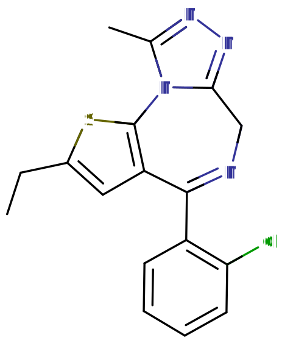

# 依替唑仑

[◀返回](index.md)

!!! danger "联用危险"

    **当[噻吩二氮卓类物质](../文档/药物分类/噻吩二氮卓类物质.md)与[抑制剂](../文档/药物分类/抑制剂.md)（如[阿片类药物](../文档/药物分类/阿片类药物.md)、[苯二氮卓类物质](../文档/药物分类/苯二氮卓类物质.md) 、[巴比妥类物质](../文档/药物分类/巴比妥类物质.md)、[加巴喷丁类物质](../文档/药物分类/加巴喷丁类物质.md)、[酒精](酒精.md)或其他[GABA 能物质](../文档/GABA.md#GABA受体)）联用时，可能会导致致命[药物过量](../文档/药物过量.md)。[^1]**

    强烈建议不要将这些物质联用，特别是在[中等](../文档/药物剂量分类.md#中等)到[严重](../文档/药物剂量分类.md#严重)剂量下。

| **化学信息** | 依替唑仑（Etizolam）                                                                     |
| ------------ | ---------------------------------------------------------------------------------------- |
| 结构式       |                                                                 |
| 分子式       | C17H15ClN4S                                             |
| CAS 号       | 40054-69-1                                                                               |
| **化学命名** |                                                                                          |
| 常用名称     | 依替唑仑、Etilaam、Etizest、Depas                                                        |
| 取代名称     | Etizolam                                                                                 |
| 系统命名     | 4-(2-Chlorophenyl)-2-ethyl-9-methyl-6H-thieno[3,2-f][1,2,4]triazolo[4,3-a][1,4]diazepine |
| **类别归属** |                                                                                          |
| 精神活性类别 | _[抑制剂](../文档/药物分类/抑制剂.md)_                                                   |
| 化学类别     | _[噻吩二氮卓类物质](../文档/药物分类/噻吩二氮卓类物质.md) / 噻吩三唑并二氮卓类物质_      |

| [**给药途径**](../文档/给药途径.md) | 🔽 [口服](../文档/给药途径.md#口服) |
| ----------------------------------- | ----------------------------------- |
| 生物利用度                          | 93%                                 |
| [**给药剂量**](../文档/给药剂量.md) |                                     |
| 阈值                                | 0.2 mg                              |
| 轻微                                | 0.5 \~ 1 mg                         |
| 中等                                | 1 \~ 2 mg                           |
| 强烈                                | 2 \~ 5 mg                           |
| 严重                                | 5 mg +                              |
| [**药效时长**](../文档/药效时长.md) |                                     |
| 总时长                              | 5 \~ 7 小时                         |
| 药效发作                            | 15 \~ 30 分钟                       |
| 药效上升                            | 30 \~ 60 分钟                       |
| 药效达峰                            | 2 \~ 3 小时                         |
| 药效褪去                            | 1.5 \~ 2.5 小时                     |
| 药效残余                            | 6 \~ 24 小时                        |

- !!! warning "警告"

          由于个体体重、耐受性、新陈代谢和个人敏感度的差异，请务必从低剂量开始。参见[负责任的用药部分](../文档/负责任的用药索引页.md)。

    !!! info "[免责声明](../关于本站/免责声明.md)"

          本站的[给药剂量](../文档/给药剂量.md)信息收集自使用者和[相关资源](../文档/科学信息索引页.md)，仅供教育目的使用。这不是医疗建议，应与其他来源核实以确保准确性。

依替唑仑（也被称为 Etilaam、Etizest、Depas 等商品名）是一种属于[噻吩二氮卓类物质](../文档/药物分类/噻吩二氮卓类物质.md)的新型[抑制剂](../文档/药物分类/抑制剂.md)。依替唑仑在化学结构上与[苯二氮卓类物质](../文档/药物分类/苯二氮卓类物质.md)相关，通过结合大脑中的 [GABA](../文档/GABA.md) 受体来发挥作用。

依替唑仑通常不作为处方药。它在网上作为[研究用化学品](../文档/研究用化学品.md)销售，常被用作处方苯二氮卓类药物（如[阿普唑仑](阿普唑仑.md)或[地西泮](地西泮.md)）的替代品。依替唑仑常见的形式有药片、药丸、吸附在吸墨纸上、溶解在丙二醇中或是纯粉末形态。

[主观效应](../药效/index.md)包括[焦虑抑制](../药效/焦虑抑制.md)、[去抑制](../药效/去抑制.md)、[肌肉松弛](../药效/肌肉松弛.md)、[镇静](../药效/镇静.md)和[认知欣快](../药效/认知欣快.md)。由于口服和舌下含服的生物利用度很高，依替唑仑通常通过这两种方式给药。

和苯二氮卓类物质一样，长期或重度使用者[突然停用噻吩二氮卓类物质](../文档/药物分类/噻吩二氮卓类物质.md#断药)可能是危险的，甚至会危及生命。因此，对该物质产生生理依赖的人建议通过在较长时间内逐渐减少每天用量的[减量戒断法](../文档/减量戒断法.md)来停止用药，而不是突然停药。[^2]

## 历史与文化

依替唑仑于 2011 年首次出现在在线[研究用化学品](../文档/研究用化学品.md)市场上。从那时起，它的受欢迎程度稳步上升。这可能是因为其成本低且供应充足，以及它与娱乐用途苯二氮卓类药物相似的高度依赖性和成瘾性。[^3]

依替唑仑与大多数其他研究用化学品的不同之处在于，它在世界许多国家被批准并作为治疗焦虑症的药物处方使用，常见的商品名有 _Etilaam_ 和 _Etizest_。它作为药物的起源尚不明确，尽管早在 1990 年代就有记载将其用于治疗焦虑症的医学论文了。[^4]

## 化学

依替唑仑是[苯二氮卓类物质](../文档/药物分类/苯二氮卓类物质.md)的结构类似物，其苯环被噻吩环取代，因此被归类为[噻吩二氮卓类物质](../文档/药物分类/噻吩二氮卓类物质.md)。噻吩是一个含有硫原子的五元芳香环。依替唑仑包含一个与二氮卓环融合的噻吩环，二氮卓环是一个七元环，两个氮成分分别位于 R1 和 R4 位置。这构成了依替唑仑的噻吩二氮卓核心。一个乙基链结合在该双环结构的 R7 位置。此外，一个 R2' 氯取代的苯环结合在 R5 位置。

依替唑仑还包含一个甲基化的三唑环，该环与二氮卓环的 R1 和 R2 位置融合并合并。依替唑仑与某些被称为三唑并苯二氮卓类的[苯二氮卓](../文档/药物分类/苯二氮卓类物质.md)药物共有这种融合三唑环的取代特征，这类药物通常以后缀"-zolam"区分。

## 药理学

噻吩二氮卓类物质通过结合 GABAA 受体复合物上的苯二氮卓结合位点产生各种效应，通过增加神经递质 [γ-氨基丁酸 (GABA)](../文档/GABA.md) 结合受体的能力，来增强其效能和效应。[^5] 这被称为[正向变构调节](../文档/正向变构调节剂.md)。[^6] 由于该位点是大脑内最丰富的抑制性受体群，对其进行调节会导致依替唑仑对神经系统产生[镇静](../药效/镇静.md)（或[镇静效果](../药效/焦虑抑制.md)）。

## 主观效应

轶事报告表明，就其相对效力而言，1 mg 的依替唑仑大约相当于 0.5 mg 的[阿普唑仑](阿普唑仑.md)、0.5 mg 的[氯硝西泮](氯硝西泮.md)或 10 mg 的[地西泮](地西泮.md)。在起效速度、总时长和娱乐效果方面，它常被比作效力稍弱且[镇静](../药效/镇静.md)感较低的[阿普唑仑](阿普唑仑.md)。

!!! info "[免责声明](../关于本站/免责声明.md)"

    _下列效应引用自 [**主观效应索引**](../药效/index.md) (**SEI**)，这是一个基于轶事使用者报告和个人分析的开放研究文献。因此，应带着健康的怀疑态度来看待它们。_

    _同样值得注意的是，这些效应不一定会以可预测或可靠的方式发生，尽管较高的剂量更可能引发全方位的效应。同样，**不良反应** 随着剂量的增加变得越来越可能，可能包括 **成瘾、严重伤害或死亡** ☠。_

- ### **[身体效应](../药效/躯体效应.md)** 
    - [镇静](../药效/镇静.md)：依替唑仑具有快速起效的镇静作用。在高剂量下，这会让使用者突然感觉像是好几天没睡觉一样，迫使他们坐下来，感觉随时都会昏过去，而不是进行体力活动。这种睡眠不足感与剂量成正比，最终会强大到迫使人完全失去知觉。
    - [肌肉松弛](../药效/肌肉松弛.md)：这种效应被描述为类似于[地西泮](地西泮.md)，尽管根据剂量不同，其显著程度略低。0.5 \~ 1mg 左右的低剂量通常会产生与[阿普唑仑](阿普唑仑.md)相当的效果。
    - [躯体欣快感](../药效/躯体欣快感.md)
    - [运动控制丧失](../药效/运动控制丧失.md)
    - [呼吸抑制](../药效/呼吸抑制.md)
    - [性欲增强](../药效/性欲增强.md)
    - [癫痫发作抑制](../药效/癫痫发作抑制.md)
    - [食欲增强](../药效/食欲增强.md)：这种效应并不特别突出，但据报道在某些人身上会发生。与[大麻](大麻.md)联用时会产生协同效应。
    - [头晕](../药效/头晕.md)
    - [暂时性勃起功能障碍](../药效/暂时性勃起功能障碍.md)

- ### **矛盾效应** 

    对[苯二氮卓类物质](../文档/药物分类/苯二氮卓类物质.md)的矛盾反应，如癫痫发作增加（在癫痫患者中）、攻击性、焦虑增加、暴力行为、冲动控制丧失、易怒和自杀行为有时会发生（尽管在普通人群中很少见，发生率低于 1%）。[^7] [^8] 这些矛盾效应在娱乐性滥用者、精神障碍患者、儿童和高剂量给药患者中发生频率更高。[^9] [^10] 虽然尚未经过正式研究，但噻吩二氮卓类物质被认为具有同样的风险。

- ### **[认知效应](../药效/认知效应.md)** 
    - [焦虑抑制](../药效/焦虑抑制.md)
    - [去抑制](../药效/去抑制.md)
    - [认知欣快](../药效/认知欣快.md)：这种效应通常只在高剂量下产生，被认为主要是由于使用者预先存在的[焦虑](../药效/焦虑.md)得到释放而产生的。许多使用者报告说，从[苯二氮卓类物质](../文档/药物分类/苯二氮卓类物质.md)或像依替唑仑这样的[噻吩二氮卓类物质](../文档/药物分类/噻吩二氮卓类物质.md)中完全感受不到任何愉悦或欣快感。
    - [强迫性补量](../药效/强迫性补量.md)：强迫性补量可能是由于该物质在迅速消失前，能以极快的方式产生缓解焦虑、放松甚至有时是欣快的效果。由于它产生的[记忆抑制](../药效/记忆抑制.md)，情况可能会变得更糟，这会导致使用者忘记自己已经吃过了，从而陷入导致危险的[失忆](../药效/失忆.md)断片状态的恶性循环。
    - [记忆抑制](../药效/记忆抑制.md)
        - [失忆](../药效/失忆.md)
    - [清醒度错觉](../药效/妄想.md#清醒度错觉)：这是一种错误的信念，即尽管有明显的证据（如严重的认知受损和无法与他人充分沟通），却认为自己完全清醒。这最常发生在中等到严重剂量下。
    - [分析能力抑制](../药效/分析能力抑制.md)
    - [自我膨胀](../药效/自我膨胀.md)
    - [思维减速](../药效/思维减速.md)
    - [动力抑制](../药效/动力抑制.md)
    - [情感抑制](../药效/情感抑制.md)：虽然这种化合物主要抑制焦虑，但它也会以一种不同于[抗精神病药](../文档/抗精神病药.md)但强度较低的方式使其他情绪变得迟钝。
    - [困倦](../药效/困倦.md)

- ### **药效残余** 
    - [反跳性焦虑](../药效/焦虑.md)：反跳性焦虑是像[苯二氮卓类物质](../文档/药物分类/苯二氮卓类物质.md)和依替唑仑这类[缓解焦虑](../药效/焦虑抑制.md)物质中常见的效应。它通常与处于物质影响下的总时长以及在给定时间内消耗的总量相对应，这种效应很容易导致依赖和成瘾的循环。
    - [梦境强化](../药效/梦境强化.md) 或[梦境抑制](../药效/梦境抑制.md)
    - [残留困倦](../药效/困倦.md)：虽然依替唑仑可以作为有效的[催眠](../文档/催眠药.md)辅助手段，但其效果可能会持续到第二天早上，这可能会导致使用者在接下来的几个小时内感到"昏沉"或"迟钝"。
    - [思维减速](../药效/思维减速.md)
    - [思维混乱](../药效/思维混乱.md)
    - [易怒](../药效/易怒.md)

### 体验报告

目前我们的[报告索引](../报告/index.md)中没有关于该物质效果的体验报告。你可以在[本站 Github 仓库](https://github.com/SalviaSWC/FreeODwiki)提交你自己的体验报告。

其他的体验报告可以在这里找到：

- PsychonautWiki：
    1. [Experience:20mg Etizolam - Smoking Etizolam](https://psychonautwiki.org/wiki/Experience:20mg_Etizolam_-_Smoking_Etizolam)
    2. [Experience:2mg Etizolam - Here be dragons](https://psychonautwiki.org/wiki/Experience:2mg_Etizolam_-_Here_be_dragons)
    3. [Experience:3mg Etizolam - A Comedown Drug](https://psychonautwiki.org/wiki/Experience:3mg_Etizolam_-_A_Comedown_Drug)
- [Erowid Experience Vaults: Etizolam](https://www.erowid.org/experiences/subs/exp_Etizolam.shtml)

## 毒性与伤害潜力

!!! danger "危险"

    长期使用可能会出现[眼睑痉挛](http://zh.wikipedia.org/wiki/眼睑痉挛)（眼皮抽搐）。[^11] 极少数情况下，也有[远心性环状红斑](http://zh.wikipedia.org/wiki/远心性环状红斑)皮肤病变的报道。[^12]

更多信息请参阅：[研究用化学品 § 毒性与伤害潜力](../文档/研究用化学品.md#毒性与伤害潜力)

依替唑仑相对于剂量的毒性可能较低。[^13] 然而，当与[抑制剂](../文档/药物分类/抑制剂.md)（如[酒精](酒精.md)或[阿片类药物](../文档/药物分类/阿片类药物.md)）混合使用时，它具有潜在的[致命性](../药效/呼吸抑制.md)。

强烈建议在使用该物质时采取[伤害减少措施](../文档/负责任的用药索引页.md)，例如[液体容量给药法](../文档/液体容量给药法.md)。

### 耐受性与成瘾潜力

像大多数苯二氮卓类物质一样，依替唑仑被认为具有高度成瘾性，且有很高的滥用潜力。

在一项研究中，对大鼠神经元施用多剂量的依替唑仑或劳拉西泮，观察到对劳拉西泮的抗惊厥作用产生了耐受性，但对依替唑仑则没有。[^14] 因此，与传统的苯二氮卓类物质相比，依替唑仑产生耐受和依赖的可能性较小。[^14]

然而，在连续使用几天内，对镇静催眠效果仍会产生耐受性。停药后，耐受性会在 7 \~ 14 天内恢复到基线。但在某些情况下，根据长期使用的时长和强度，这可能需要更长的时间。

对于重度或长期使用者来说，[戒断噻吩二氮卓类物质](../文档/药物分类/苯二氮卓类物质.md#断药)是众所周知的困难，且可能危及生命。停止使用后，癫痫发作的风险会增加。在连续给药几周或更长时间后突然停止使用，可能会出现戒断症状或反跳症状，这可能需要逐渐减量。有关以受控方式从噻吩二氮卓类物质减量的更多信息，请参阅相关指南。在戒断期间应避免使用会降低癫痫发作阈值的物质，如[曲马多](曲马多.md)。

依替唑仑与所有[苯二氮卓类物质](../文档/药物分类/苯二氮卓类物质.md)和[噻吩二氮卓类物质](../文档/药物分类/噻吩二氮卓类物质.md)存在交叉耐受性，这意味着在摄入它之后，所有的苯二氮卓和噻吩二氮卓类药物的效果都会降低。

### 药物过量

当摄入极大量或与其他抑制剂同时服用时，可能会发生噻吩二氮卓类药物过量。
这对于其他 GABA 能抑制剂（如[巴比妥类物质](../文档/药物分类/巴比妥类物质.md)和[酒精](酒精.md)）尤其危险，因为它们的作用方式相似，但结合在 GABAA 受体上不同的变构位点，因此它们的效果会互相增强。
噻吩二氮卓类物质增加 GABAA 受体上氯离子通道开放的频率，而巴比妥类物质增加它们开放的时长，这意味着当两者同时摄入时，离子通道会更频繁地开放且保持开放时间更长。[^15]
噻吩二氮卓类药物过量是一种医疗紧急情况，如果不及时妥善处理，可能会导致昏迷、永久性脑损伤或死亡。

噻吩二氮卓类药物过量的症状可能包括严重的[思维减速](../药效/思维减速.md)、[语无伦次](../药效/语无伦次.md)、[混乱](../药效/混乱.md)、[妄想](../药效/妄想.md)、[呼吸抑制](../药效/呼吸抑制.md)、昏迷或死亡。
在医院环境中可以有效地治疗此类过量，通常预后良好。
有时会使用[氟马西尼](氟马西尼.md)（一种 GABAA 拮抗剂）来治疗过量。[^16] 然而，护理工作主要还是支持性的。

### 危险的相互作用

!!! warning "警告"

    _许多精神活性物质在单独使用时相对安全，但与某些其他物质联用可能会突然变得危险甚至危及生命。_

    _请务必进行独立研究（例如 [Google](https://www.google.com)、[DuckDuckGo](https://www.duckduckgo.com)、[PubMed](https://pubmed.ncbi.nlm.nih.gov/)），确保多种物质的组合是安全的。部分列出的相互作用来自 [TripSit](https://combo.tripsit.me)。_

- [抑制剂](../文档/药物分类/抑制剂.md)（[1,4-丁二醇](1,4-丁二醇.md)、[2-甲基 -2-丁醇](2M2B.md)、[酒精](酒精.md)、[巴比妥类物质](../文档/药物分类/巴比妥类物质.md)、[GHB](GHB.md)/[GBL](GBL.md)、[甲喹酮](甲喹酮.md)、[阿片类药物](../文档/药物分类/阿片类药物.md)）：这种组合可能导致危险甚至致命水平的[呼吸抑制](../药效/呼吸抑制.md)。这些物质会相互增强彼此引起的[肌肉松弛](../药效/肌肉松弛.md)、[镇静](../药效/镇静.md)和[失忆](../药效/失忆.md)，并可能在高剂量下导致意外的意识丧失。在失去知觉期间呕吐并因由此产生的窒息而死亡的风险也会增加。如果发生这种情况，使用者应尝试以[恢复体位](../文档/恢复体位.md)入睡，或由朋友将其移动到该体位。
- [解离剂](../文档/药物分类/解离剂.md)：这种组合可能导致在失去知觉期间呕吐并因由此产生的窒息而死亡的风险增加。如果发生这种情况，使用者应尝试以[恢复体位](../文档/恢复体位.md)入睡。
- [兴奋剂](../文档/药物分类/兴奋剂.md)：由于存在过度中毒的风险，将噻吩二氮卓类物质与[兴奋剂](../文档/药物分类/兴奋剂.md)结合是危险的。兴奋剂会掩盖噻吩二氮卓类物质的[镇静](../药效/镇静.md)作用，而镇静作用是大多数人判断自己中毒程度的主要因素。一旦兴奋剂药效消失，噻吩二氮卓类物质的效果将显著增强，导致加剧的[去抑制](../药效/去抑制.md)。如果联用，应严格限制自己每小时仅服用一定量的噻吩二氮卓类物质。如果不注意补水，这种组合还可能导致严重的脱水。

## 法律状态

在国际上，依替唑仑于 2020 年 3 月被添加到联合国《精神药物公约》中，作为附表 IV 受控物质。[^17] [^18]

- 澳大利亚：由药物管制局根据 1956 年《海关（禁止进口）条例》第 5 条发布的附表 4。[^19] 2020 年 10 月的毒药标准中未说明其为附表 4，但它可能属于去氯依替唑仑的类似物法案。进出口需要许可证和许可。
- 奥地利：自 2012 年起，根据 NPSG（新精神活性物质法），拥有、生产、供应或进口依替唑仑均属违法。[^20] 但是，没有分发意图的违规者可能不会面临指控。[^21]
- 巴西：自 2021 年 3 月 23 日起，由于 ANVISA 的 RDC 第 473 号决议，拥有、生产和销售均为非法。[^22] [^23]
- 加拿大：依替唑仑似乎包含在 CDSA 附表 VI 的第 18 条"苯二氮卓类及其盐类和衍生物"中。
- 德国：自 2013 年 7 月 17 日起，依替唑仑受 BtMG（麻醉品法，附表 III）控制。[^24] [^25] 它只能凭麻醉品处方单开具。[^26]
- 日本：依替唑仑受日本《麻醉品和精神药物管制法》控制，未经处方拥有、销售或制造均属违法。[^27]
- 波兰：依替唑仑在波兰属于 NPS 类药物，拥有或分发均属违法。[^28]
- 俄罗斯：在俄罗斯，自 2017 年起，依替唑仑属于附表 III 受控物质。[^29]
- 瑞士：依替唑仑是 Verzeichnis B 下特别列名的受控物质。允许医疗使用。[^30]
- 土耳其：依替唑仑被归类为药物，拥有、生产、供应或进口均属违法。[^31] [^32]
- 荷兰：依替唑仑是《鸦片法》清单 2 中的物质，属于非法。[^33]
- 英国：截至 2017 年 5 月 31 日，依替唑仑在英国属于 C 类物质，拥有、生产或供应均属违法。[^34]
- 美国：依替唑仑于 2023 年 1 月 23 日被 DEA 临时列入附表，使依替唑仑成为附表 I 受控物质。[^35] 在其临时列入附表之前，一些州立法机构已通过法律在其管辖范围内禁止它。截至 2019 年 7 月，依替唑仑在以下各州属于受控物质：阿拉巴马州、[^36] 阿肯色州、[^37] 佛罗里达州、[^38] 乔治亚州、[^39] 路易斯安那州、密西西比州、[^40] 德克萨斯州、南卡罗来纳州、[^41] 弗吉尼亚州、[^42] 印第安纳州[^43] 和俄亥俄州。

## 另见

- [负责任的用药](../文档/负责任的用药索引页.md)
    - [液体容量给药法](../文档/液体容量给药法.md)
- [抑制剂](../文档/药物分类/抑制剂.md)
- [苯二氮卓类物质](../文档/药物分类/苯二氮卓类物质.md)
- [阿普唑仑](阿普唑仑.md)
- [酒精](酒精.md)

## 外部链接

- [依替唑仑 (维基百科)](http://zh.wikipedia.org/wiki/依替唑仑)
- [Etizolam (Erowid Vault)](http://www.erowid.org/pharms/etizolam)
- [Etizolam (Isomer Design)](https://isomerdesign.com/PiHKAL/explore.php?id=3039)
- [Etizolam (Drugs-Forum)](https://drugs-forum.com/wiki/Etizolam)

## 文献

- Sanna, E., Pau, D., Tuveri, F., Massa, F., Maciocco, E., Acquas, C., ... & Biggio, G. (1999). Molecular and neurochemical evaluation of the effects of etizolam on GABAA receptors under normal and stress conditions. Arzneimittelforschung, 49(02), 88-95. <https://doi.org/10.1055/s-0031-1300366>
- Altamura, A. C., Moliterno, D., Paletta, S., Maffini, M., Mauri, M. C., & Bareggi, S. (2013). Understanding the pharmacokinetics of anxiolytic drugs. Expert Opinion on Drug Metabolism & Toxicology, 9(4), 423-440. <https://doi.org/10.1517/17425255.2013.759209>
- Fracasso, C., Confalonieri, S., Garattini, S., & Caccia, S. (1991). Single and multiple dose pharmacokinetics of etizolam in healthy subjects. European Journal of Clinical Pharmacology, 40(2), 181-185. <https://doi.org/10.1007/BF00280074>
>
## 引用文献

[^1]: [_Risks of Combining Depressants - TripSit_](https://tripsit.me/combining-depressants/)

[^2]: Kahan, M., Wilson, L., Mailis-Gagnon, A., Srivastava, A. (November 2011). ["Canadian guideline for safe and effective use of opioids for chronic noncancer pain. Appendix B-6: Benzodiazepine Tapering"](https://www.ncbi.nlm.nih.gov/pmc/articles/PMC3215603/). _Canadian Family Physician_. **57** (11): 1269–1276. [ISSN](http://en.wikipedia.org/wiki/International_Standard_Serial_Number) [0008-350X](https://www.worldcat.org/issn/0008-350X)

[^3]: [_Etizolam - TripSit wiki_](https://wiki.tripsit.me/wiki/Etizolam)

[^4]: Sanna, E., Pau, D., Tuveri, F., Massa, F., Maciocco, E., Acquas, C., Floris, C., Fontana, S., Maira, G., Biggio, G. (28 December 2011). ["Molecular and Neurochemical Evaluation of the Effects of Etizolam on GABAA Receptors under Normal and Stress Conditions"](http://www.thieme-connect.de/DOI/DOI?10.1055/s-0031-1300366). _Arzneimittelforschung_. **49** (02): 88–95. [doi](http://en.wikipedia.org/wiki/Digital_object_identifier):[10.1055/s-0031-1300366](https://doi.org/10.1055/s-0031-1300366). [ISSN](http://en.wikipedia.org/wiki/International_Standard_Serial_Number) [0004-4172](https://www.worldcat.org/issn/0004-4172)

[^5]: Haefely, W. (29 June 1984). "Benzodiazepine interactions with GABA receptors". _Neuroscience Letters_. **47** (3): 201–206. [doi](http://en.wikipedia.org/wiki/Digital_object_identifier):[10.1016/0304-3940(84)90514-7](<https://doi.org/10.1016/0304-3940(84)90514-7>). [ISSN](http://en.wikipedia.org/wiki/International_Standard_Serial_Number) [0304-3940](https://www.worldcat.org/issn/0304-3940)

[^6]: <https://www.ncbi.nlm.nih.gov/pmc/articles/PMC3684331/#s2title>

[^7]: Saïas, T., Gallarda, T. (September 2008). "[Paradoxical aggressive reactions to benzodiazepine use: a review]". _L'Encephale_. **34** (4): 330–336. [doi](http://en.wikipedia.org/wiki/Digital_object_identifier):[10.1016/j.encep.2007.05.005](https://doi.org/10.1016/j.encep.2007.05.005). [ISSN](http://en.wikipedia.org/wiki/International_Standard_Serial_Number) [0013-7006](https://www.worldcat.org/issn/0013-7006)

[^8]: Paton, C. (December 2002). ["Benzodiazepines and disinhibition: a review"](https://www.cambridge.org/core/journals/psychiatric-bulletin/article/benzodiazepines-and-disinhibition-a-review/421AF197362B55EDF004700452BF3BC6). _Psychiatric Bulletin_. **26** (12): 460–462. [doi](http://en.wikipedia.org/wiki/Digital_object_identifier):[10.1192/pb.26.12.460](https://doi.org/10.1192/pb.26.12.460). [ISSN](http://en.wikipedia.org/wiki/International_Standard_Serial_Number) [0955-6036](https://www.worldcat.org/issn/0955-6036)

[^9]: Bond, A. J. (1 January 1998). ["Drug- Induced Behavioural Disinhibition"](https://doi.org/10.2165/00023210-199809010-00005). _CNS Drugs_. **9** (1): 41–57. [doi](http://en.wikipedia.org/wiki/Digital_object_identifier):[10.2165/00023210-199809010-00005](https://doi.org/10.2165/00023210-199809010-00005). [ISSN](http://en.wikipedia.org/wiki/International_Standard_Serial_Number) [1179-1934](https://www.worldcat.org/issn/1179-1934)

[^10]: Drummer, O. H. (February 2002). "Benzodiazepines - Effects on Human Performance and Behavior". _Forensic Science Review_. **14** (1–2): 1–14. [ISSN](http://en.wikipedia.org/wiki/International_Standard_Serial_Number) [1042-7201](https://www.worldcat.org/issn/1042-7201)

[^11]: Wakakura, M., Tsubouchi, T., Inouye, J. (March 2004). "Etizolam and benzodiazepine induced blepharospasm". _Journal of Neurology, Neurosurgery, and Psychiatry_. **75** (3): 506–507. [doi](http://en.wikipedia.org/wiki/Digital_object_identifier):[10.1136/jnnp.2003.019869](https://doi.org/10.1136/jnnp.2003.019869). [ISSN](http://en.wikipedia.org/wiki/International_Standard_Serial_Number) [0022-3050](https://www.worldcat.org/issn/0022-3050)

[^12]: Kuroda, K., Yabunami, H., Hisanaga, Y. (January 2002). "Etizolam-induced superficial erythema annulare centrifugum". _Clinical and Experimental Dermatology_. **27** (1): 34–36. [doi](http://en.wikipedia.org/wiki/Digital_object_identifier):[10.1046/j.0307-6938.2001.00943.x](https://doi.org/10.1046/j.0307-6938.2001.00943.x). [ISSN](http://en.wikipedia.org/wiki/International_Standard_Serial_Number) [0307-6938](https://www.worldcat.org/issn/0307-6938)

[^13]: Mandrioli, R., Mercolini, L., Raggi, M. A. (October 2008). "Benzodiazepine metabolism: an analytical perspective". _Current Drug Metabolism_. **9** (8): 827–844. [doi](http://en.wikipedia.org/wiki/Digital_object_identifier):[10.2174/138920008786049258](https://doi.org/10.2174/138920008786049258). [ISSN](http://en.wikipedia.org/wiki/International_Standard_Serial_Number) [1389-2002](https://www.worldcat.org/issn/1389-2002)

[^14]: Sanna, E., Busonero, F., Talani, G., Mostallino, M. C., Mura, M. L., Pisu, M. G., Maciocco, E., Serra, M., Biggio, G. (5 September 2005). "Low tolerance and dependence liabilities of etizolam: molecular, functional, and pharmacological correlates". _European Journal of Pharmacology_. **519** (1–2): 31–42. [doi](http://en.wikipedia.org/wiki/Digital_object_identifier):[10.1016/j.ejphar.2005.06.047](https://doi.org/10.1016/j.ejphar.2005.06.047). [ISSN](http://en.wikipedia.org/wiki/International_Standard_Serial_Number) [0014-2999](https://www.worldcat.org/issn/0014-2999)

[^15]: Twyman, R. E., Rogers, C. J., Macdonald, R. L. (March 1989). "Differential regulation of gamma-aminobutyric acid receptor channels by diazepam and phenobarbital". _Annals of Neurology_. **25** (3): 213–220. [doi](http://en.wikipedia.org/wiki/Digital_object_identifier):[10.1002/ana.410250302](https://doi.org/10.1002/ana.410250302). [ISSN](http://en.wikipedia.org/wiki/International_Standard_Serial_Number) [0364-5134](https://www.worldcat.org/issn/0364-5134)

[^16]: Hoffman, E. J., Warren, E. W. (September 1993). "Flumazenil: a benzodiazepine antagonist". _Clinical Pharmacy_. **12** (9): 641–656; quiz 699–701. [ISSN](http://en.wikipedia.org/wiki/International_Standard_Serial_Number) [0278-2677](https://www.worldcat.org/issn/0278-2677)

[^17]: ["WHO: World Health Organization recommends 12 NPS for scheduling"](https://www.unodc.org/LSS/Announcement/Details/021820a0-8746-42a4-9ee3-47ce50b30ca3). December 2019. Retrieved October 16, 2020.

[^18]: ["CND accepts all WHO recommendations on the control of several psychoactive substances from the 42nd ECDD meeting"](https://www.who.int/news/item/18-03-2020-c-n-d-accepts-all-w-h-o-recommendations-from-42nd-e-c-d-d). World Health Organization (WHO). March 18, 2020. Retrieved October 16, 2020.

[^19]: Health, [_Poisons Standard October 2020_](http://www.legislation.gov.au/Details/F2020L01255/Html/Text)

[^20]: ["Neue Psychoaktive Substanzen"](https://www.oesterreich.gv.at/themen/gesundheit_und_notfaelle/sucht/2/1/Seite.1520660.html) (in German). Bundeskriminalamt Österreich. Retrieved February 17, 2022.

[^21]: ["NPSG"](https://www.ris.bka.gv.at/GeltendeFassung.wxe?Abfrage=Bundesnormen&Gesetzesnummer=20007605) (in German). Bundeskriminalamt Österreich. Retrieved February 17, 2022.

[^22]: ["Resolução de diretoria colegiada - RDC Nº 473"](http://antigo.anvisa.gov.br/documents/10181/6236630/%282%29RDC_473_2021_.pdf/7a65445f-52a1-4533-97c7-6d96eff3b8e1) (in Portuguese). Retrieved May 20, 2021.

[^23]: ["Portaria SVS/MS nº 344"](https://web.archive.org/web/20210520204528/https://www.gov.br/anvisa/pt-br/assuntos/medicamentos/controlados/lista-substancias) (in Portuguese). Retrieved May 20, 2021.

[^24]: ["Anlage III BtMG"](https://www.gesetze-im-internet.de/btmg_1981/anlage_iii.html) (in German). Bundesministerium der Justiz und für Verbraucherschutz. Retrieved December 19, 2019.

[^25]: ["Siebenundzwanzigste Verordnung zur Änderung betäubungsmittelrechtlicher Vorschriften"](https://www.bgbl.de/xaver/bgbl/start.xav#__bgbl__//*%5B@attr_id=%27bgbl113s2274.pdf%27%5D) (in German). Bundesanzeiger Verlag. Retrieved December 19, 2019.

[^26]: ["§ 8 BtMVV"](https://www.gesetze-im-internet.de/btmvv_1998/__8.html) (in German). Bundesministerium der Justiz und für Verbraucherschutz. Retrieved December 19, 2019.

[^27]: ["新たに３物質を向精神薬に指定します"](https://www.mhlw.go.jp/seisakunitsuite/bunya/kenkou_iryou/iyakuhin/yakubuturanyou/oshirase/20160914-1.html) (in Japanese). 厚生労働省. Retrieved March 28, 2021.

[^28]: ["Rozporządzenie Ministra zdrowia z dnia 21 sierpnia 2019 r."](http://prawo.sejm.gov.pl/isap.nsf/download.xsp/WDU20190001745/O/D20191745.pdf) (PDF) (in Polish).

[^29]: [_Постановление Правительства РФ от 12.07.2017 N 827_](https://www.consultant.ru/cons/cgi/online.cgi?req=doc&base=LAW&n=220067&dst=1000000001&date=02.12.2019)

[^30]: ["Verordnung des EDI über die Verzeichnisse der Betäubungsmittel, psychotropen Stoffe, Vorläuferstoffe und Hilfschemikalien"](https://www.admin.ch/opc/de/classified-compilation/20101220/index.html) (in German). Bundeskanzlei. Retrieved January 1, 2020.

[^31]: [_Başbakanlık Mevzuatı Geliştirme ve Yayın Genel Müdürlüğü_](https://resmigazete.gov.tr/eskiler/2014/01/20140125-3.htm)

[^32]: <https://resmigazete.gov.tr/eskiler/2014/01/20140125-3-1.pdf>

[^33]: [_Opiumwet, Lijst II (Dutch)_](https://wetten.overheid.nl/BWBR0001941/2023-09-12#BijlageII), 2023

[^34]: The Misuse of Drugs (Amendment) (England, Wales and Scotland) Regulations 2017 | <http://www.tihs.org.uk/timeline/resources/2017-631.pdf>

[^35]: Schedules of Controlled Substances: Temporary Placement of Etizolam, Flualprazolam, Clonazolam, Flubromazolam, and Diclazepam in Schedule I | <https://www.federalregister.gov/documents/2022/12/23/2022-27278/schedules-of-controlled-substances-temporary-placement-of-etizolam-flualprazolam-clonazolam>

[^36]: [_Alabama Code Title 20. Food, Drugs, and Cosmetics § 20-2-23_](https://codes.findlaw.com/al/title-20-food-drugs-and-cosmetics/al-code-sect-20-2-23.html)

[^37]: <http://www.healthy.arkansas.gov/aboutadh/rulesregs/controlled_substances_list.pdf>

[^38]: [_Statutes & Constitution : View Statutes : Online Sunshine_](http://www.leg.state.fl.us/Statutes/index.cfm?App_mode=Display_Statute&URL=0800-0899/0893/Sections/0893.03.html)

[^39]: <http://www.namsdl.org/library/946E60B2-ABB3-24A6-F087859B3EA48EC1/>

[^40]: [_HB1231 (As Sent to Governor) - 2014 Regular Session_](http://billstatus.ls.state.ms.us/documents/2014/html/HB/1200-1299/HB1231SG.htm)

[^41]: [_Controlled Substance Schedule, SCDHEC_](https://scdhec.gov/healthcare-quality/drug-control-register-verify/controlled-substance-schedule)

[^42]: [_18VAC110-20-322. Placement of chemicals in Schedule I._](https://law.lis.virginia.gov/admincode/title18/agency110/chapter20/section322/)

[^43]: [_Ellington's bill banning two deadly drugs could soon be law, State of Indiana House of Representatives_](https://www.indianahouserepublicans.com/news/press-releases/ellington-s-bill-banning-two-deadly-drugs-could-soon-be-law/)
