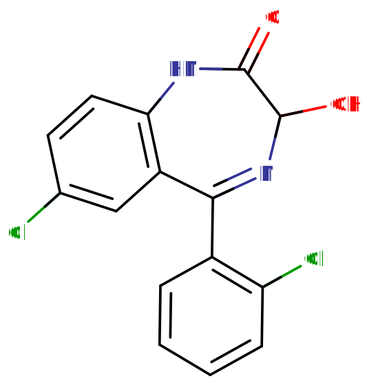

# 劳拉西泮

[◀返回](index.md)

!!! danger "危险联用"

    **当[苯二氮卓类物质](../文档/药物分类/苯二氮卓类物质.md)与其他[抑制剂](../文档/药物分类/抑制剂.md)联用时，可能会发生致命的[药物过量](../文档/药物过量.md)。这些抑制剂包括[阿片类药物](../文档/药物分类/阿片类药物.md)、[巴比妥类物质](../文档/药物分类/巴比妥类物质.md)、[加巴喷丁类物质](../文档/药物分类/加巴喷丁类物质.md)、[噻吩二氮卓类物质](../文档/药物分类/噻吩二氮卓类物质.md)、[酒精](../药物/酒精.md)或其他 [GABA 能物质](../文档/GABA.md)。**[^1]

    强烈建议不要联用这些物质，特别是在[中等](../文档/药物剂量分类.md)到[严重](../文档/药物剂量分类.md)的剂量下。

| **化学信息** | 劳拉西泮（Lorazepam）                                                             |
| ------------ | --------------------------------------------------------------------------------- |
| 结构式       |                                                         |
| 分子式       | C15H10Cl2N2O2              |
| CAS 号       | 846-49-1                                                                          |
| **化学命名** |                                                                                   |
| 常用名       | 劳拉西泮、Ativan、Orfidal、Lorsilan                                               |
| 取代名称     | Lorazepam                                                                         |
| 系统命名     | (RS)-7-Chloro-5-(2-chlorophenyl)-3-hydroxy-1,3-dihydro-2H-1,4-benzodiazepin-2-one |
| **类别归属**     |                                                                                   |
| 精神药效类   | _[抑制剂](../文档/药物分类/抑制剂.md)_                                            |
| 化学分类     | _[苯二氮卓类物质](../文档/药物分类/苯二氮卓类物质.md)_                            |

| [**给药途径**](../文档/给药途径.md) | 🔽 [口服](../文档/给药途径.md#口服) |
| ----------------------------------- | ----------------------------- |
|                                     |                               |
| [**剂量**](../文档/给药剂量.md)      |                               |
| 阈值                                | 0.10 mg                       |
| 轻微                                | 0.25 \~ 0.5 mg                |
| 中等                                | 0.5 \~ 1.5 mg                 |
| 强烈                                | 1.5 \~ 2 mg                   |
| 严重                                | 2 \~ 3 mg +                   |
| [**药效时长**](../文档/药效时长.md) |                               |
| 总时长                              | 4 \~ 8 小时                   |
| 药效发作                            | 5 \~ 30 分钟                  |
| 药效达峰                            | 1 \~ 3 小时                   |
| 药效褪去                            | 4 \~ 8 小时                   |

- !!! warning "警告"

        由于个体体重、耐受性、新陈代谢和个人敏感度的差异，请务必从低剂量开始。参见[负责任的用药部分](../文档/负责任的用药索引页.md)。

    !!! info "[免责声明](../关于本站/免责声明.md)"

        本站的[给药剂量](../文档/给药剂量.md)信息收集自用户和[相关资源](../文档/科学信息索引页.md)，仅供教育目的使用。这不是医疗建议，应与其他来源核实以确保准确性。

**劳拉西泮**（商品名 **Ativan** 或 **Tavor**）是[苯二氮卓类](../文档/药物分类/苯二氮卓类物质.md)的一种[抑制剂](../文档/药物分类/抑制剂.md)。劳拉西泮用于短期治疗[焦虑](../药效/焦虑.md)、[失眠](../药效/镇静.md)、[急性癫痫发作](../文档/癫痫发作.md)以及住院患者的镇静。[^2] [^3] [^4] [^5]

使用者应注意，对于长期或大量使用[苯二氮卓类物质](../文档/药物分类/苯二氮卓类物质.md)的人来说，[突然停药](../文档/药物戒断反应.md)可能是危险的，甚至危及生命。因此，建议对该物质产生生理依赖的个体在较长时间内通过每天逐渐减少摄入量来[逐渐减量](../文档/减量戒断法.md)，而不是突然停止使用。[^6]

## 化学

劳拉西泮属于[苯二氮卓类](../文档/药物分类/苯二氮卓类物质.md)药物。苯二氮卓类药物包含一个苯环与一个二氮卓环稠合，二氮卓环是一个七元环，其两个氮取代基位于 R1 和 R4 位置。此外，苯二氮卓环在 R5 位置与一个 2-氯苯环结合。苄环的 R7 位置也被一个氯基团取代。此外，劳拉西泮在 R3 位置含有一个羟基 (OH-) 取代基。它还在其二氮卓环的 R2 位置含有一个双键氧基团，形成一个酮。R2 位置的这种氧取代是与其他后缀为 -azepam 的苯二氮卓类药物共有的特征。

## 药理学

苯二氮卓类药物通过与苯二氮卓受体位点结合，作用于 [GABA](../文档/GABA.md) [受体](../文档/受体激动剂.md)，从而放大神经递质 [γ-氨基丁酸（GABA）](../文档/GABA.md)的效率和效应，从而产生各种效果。[^7] 由于该位点是大脑中最为丰富的抑制性受体组，其调节导致了劳拉西泮对神经系统的[镇静](../药效/镇静.md)（或[镇静效应](../药效/焦虑抑制.md)）。

苯二氮卓类药物的[抗惊厥](../文档/癫痫发作.md)特性可能部分或全部归因于其与电压依赖性钠通道的结合，而非苯二氮卓受体。[^8]

与其他苯二氮卓类药物相比，与其他苯二氮卓类药物相比，劳拉西泮被认为对 [GABA](../文档/GABA.md) 受体具有相对较高的亲和力，这也可以解释其显著的健忘效应。[^9]

劳拉西泮通过肝脏途径进行葡萄糖醛酸酸化，产生劳拉西泮葡萄糖醛酸苷作为主要代谢物。附着的葡萄糖醛酸苷增加了分子的极性，使其能更快地通过尿液排出。

## 主观效应

!!! info "[免责声明](../关于本站/免责声明.md)"

    _下列效应引用自 [**主观效应索引**](../药效/index.md) (**SEI**)，这是一个基于轶事用户报告和个人分析的开放研究文献。因此，应带着健康的怀疑态度来看待它们。_

    _同样值得注意的是，这些效应不一定会以可预测或可靠的方式发生，尽管较高的剂量更可能引发全方位的效应。同样，**不良反应** 随着剂量的增加变得越来越可能，可能包括 **成瘾、严重伤害或死亡** ☠。_

- ### **[躯体效应](../药效/躯体效应.md)** 
    - **[镇静](../药效/镇静.md)**
    - **[运动控制丧失](../药效/运动控制丧失.md)**
    - **[肌肉松弛](../药效/肌肉松弛.md)**
    - **[食欲增强](../药效/食欲增强.md)**：这种效应并不特别显著，但据报道在某些人身上会发生。当与[大麻](大麻.md)联用时，它可能产生协同作用。
    - **[头晕](../药效/头晕.md)**
    - **[恶心抑制](../药效/恶心抑制.md)**[^10]
    - **[呼吸抑制](../药效/呼吸抑制.md)**
    - **[癫痫发作抑制](../药效/癫痫发作抑制.md)**
    - **[尿频](../药效/尿频.md)**[^11]

- ### 反常效应 
    对[苯二氮卓类物质](../文档/药物分类/苯二氮卓类物质.md)的反常反应，如癫痫发作增加（在癫痫患者中）、攻击性、焦虑增加、暴力行为、冲动控制丧失、易怒和自杀行为有时会发生（尽管在普通人群中很少见，发生率低于 1%）。[^12] [^13] 这些反常效应在娱乐性滥用者、精神障碍患者、儿童和高剂量治疗方案的患者中发生频率更高。[^14] [^15]

- ### **[认知效应](../药效/认知效应.md)** 
    劳拉西泮的认知效应可以分解为几个部分，这些部分随着剂量的增加而逐渐增强。许多人将劳拉西泮的整体精神状态描述为强烈的镇静和抑制力下降。在娱乐性剂量下，它可能会让人感到非常混乱。它包含大量典型的[抑制剂](../文档/药物分类/抑制剂.md)认知效应。通常与[阿普唑仑](../药物/阿普唑仑.md)相比，劳拉西泮的特点是具有更强的镇静和嗜睡作用，但[抗焦虑](../药效/焦虑抑制.md)作用较少。

    这些最显著的认知效应通常包括：

    - **[分析抑制](../药效/分析抑制.md)**
    - **[焦虑抑制](../药效/焦虑抑制.md)**：不如阿普唑仑、[氯硝西泮](../药物/氯硝西泮.md)或[地西泮](../药物/地西泮.md)显著。
    - **[食欲增强](../药效/食欲增强.md)**
    - **[强迫性补量](../药效/强迫性补量.md)**
    - **[清醒错觉](../药效/清醒错觉.md)**：这是一种错误的信念，即尽管有明显的证据表明自己并未清醒（如严重的认知障碍和无法与他人充分交流），但仍认为自己完全清醒。这最常发生在[严重](../文档/药物剂量分类.md)剂量下。
    - **[去抑制](../药效/去抑制.md)**
    - **[梦境增强](../药效/梦境增强.md)**
    - **[情感抑制](../药效/情感抑制.md)**：虽然该化合物主要抑制焦虑，但它也以一种独特但强度低于[抗精神病药](../药物/抗精神病药.md)的方式迟钝其他情绪。这一特定成分对于劳拉西泮可能比其他常见的苯二氮卓类药物更显著。
    - **[记忆抑制](../药效/记忆抑制.md)**
    - **[健忘](../药效/失忆.md)**
    - **[思维减速](../药效/思维减速.md)**：即使在[轻微](../文档/药物剂量分类.md)-[中等](../文档/药物剂量分类.md)剂量且没有[耐受性](../文档/药物耐受性.md)的情况下，旁观者往往也能在言语交流中清楚地看到这一点。
    - **[断片](../药效/记忆抑制.md)**

### 体验报告

目前我们的[报告索引](../报告/index.md)中没有关于该物质效果的体验报告。你可以在[本站 Github 仓库](https://github.com/SalviaSWC/FreeODwiki)提交你自己的体验报告。

其他的体验报告可以在这里找到：

- [Erowid Experience Vaults: Lorazepam](https://www.erowid.org/experiences/subs/exp_Pharms_Lorazepam.shtml)

## 毒性与危害潜力

|                                    |
| :-----------------------------------------------------------------------------: |
| 雷达图显示了苯二氮卓类药物与其他药物相比的相对身体危害、社会危害和依赖性。[^16] |

相对于剂量而言，劳拉西泮的毒性可能较低。[^17] 然而，当与[酒精](../药物/酒精.md)或[阿片类药物](../文档/药物分类/阿片类药物.md)等[抑制剂](../文档/药物分类/抑制剂.md)混合使用时，它具有潜在的[致死性](../药效/呼吸抑制.md)。

强烈建议在使用该物质时采取[伤害减少措施](../文档/负责任的用药索引页.md)。

### 耐受性与成瘾潜力

劳拉西泮具有极强的生理和心理成瘾性。

连续使用几天后，对镇静-催眠效应的耐受性就会产生。停药后，耐受性会在 7 \~ 14 天内恢复到基线水平。然而，在某些情况下，这可能需要更长的时间，具体取决于长期使用的持续时间和强度。

在持续用药几周或更长时间后突然停止使用，可能会出现戒断症状或反弹症状，可能需要逐渐减少剂量。有关以受控方式从苯二氮卓类药物中[减量](../文档/减量戒断法.md)的更多信息，请参阅[本指南](http://www.benzo.org.uk/manual/bzcha02.htm)。

[苯二氮卓类药物的停药](../文档/药物分类/苯二氮卓类物质.md)是出了名的困难；对于经常使用的人来说，如果不经过数周的逐渐减量就停止使用，可能会危及生命。这会增加[高血压](../药效/血压升高.md)、[癫痫发作](../文档/癫痫发作.md)和死亡的风险。[^18] 在戒断期间应避免使用降低癫痫发作阈值的药物，如[曲马多](../药物/曲马多.md)。

劳拉西泮与所有[苯二氮卓类物质](../文档/药物分类/苯二氮卓类物质.md)存在交叉耐受性，这意味着在使用它之后，所有苯二氮卓类药物的效果都会降低。

### 药物过量

当极大量服用[苯二氮卓类物质](../文档/药物分类/苯二氮卓类物质.md)或与其他抑制剂同时服用时，可能会发生苯二氮卓类药物过量。这对于其他 GABA 能抑制剂如[巴比妥类物质](../文档/药物分类/巴比妥类物质.md)和[酒精](../药物/酒精.md)尤其危险，它们以类似的方式起作用，但结合在 GABAA 受体上不同的变构位点，因此它们的效应会相互增强。苯二氮卓类药物增加了 GABAA 受体上氯离子通道开放的频率，而巴比妥类药物增加了它们开放的持续时间，这意味着当两者同时摄入时，离子通道将更频繁地开放并保持开放更长时间。[^19] 苯二氮卓类药物过量是一种医疗紧急情况，如果不及时和正确治疗，可能导致昏迷、永久性脑损伤或死亡。

苯二氮卓类药物过量的症状可能包括严重的[思维减速](../药效/思维减速.md)、[口齿不清](../药效/语言抑制.md)、[困惑](../药效/混乱.md)、[妄想](../药效/妄想.md)、[呼吸抑制](../药效/呼吸抑制.md)、昏迷或死亡。苯二氮卓类药物过量可以在医院环境中得到有效治疗，结果通常良好。苯二氮卓类药物过量有时用[氟马西尼](../药物/氟马西尼.md)（一种 GABAA 拮抗剂）治疗，[^20] 但护理主要是支持性的。

### 危险的药物联用

!!! warning "警告"

    _许多精神活性物质在单独使用时相对安全，但与某些其他物质联用可能会突然变得危险甚至危及生命。_

    _请务必进行独立研究（例如 [Google](https://www.google.com)、[DuckDuckGo](https://www.duckduckgo.com)、[PubMed](https://pubmed.ncbi.nlm.nih.gov/)），确保多种物质的组合是安全的。部分列出的相互作用来自 [TripSit](https://combo.tripsit.me)。_

- **[抑制剂](../文档/药物分类/抑制剂.md)** (_[1,4-丁二醇](../药物/1,4-丁二醇.md), [2-甲基 -2-丁醇](../药物/2-甲基-2-丁醇.md), [酒精](../药物/酒精.md), [巴比妥类物质](../文档/药物分类/巴比妥类物质.md), [GHB](../药物/GHB.md)/[GBL](../药物/GBL.md), [甲喹酮](../药物/甲喹酮.md), [阿片类药物](../文档/药物分类/阿片类药物.md)_)：这种组合可能导致危险甚至致命水平的[呼吸抑制](../药效/呼吸抑制.md)。这些物质会增强彼此引起的[肌肉松弛](../药效/肌肉松弛.md)、[镇静](../药效/镇静.md)和[健忘](../药效/失忆.md)，在高剂量下可能导致意外的意识丧失。在意识丧失期间还有呕吐和因窒息而死亡的风险增加。如果发生这种情况，使用者应尝试以[恢复体位](../文档/恢复体位.md)入睡，或让朋友将其移至该体位。
- **[解离剂](../文档/药物分类/解离剂.md)**：这种组合可能导致在意识丧失期间呕吐和因窒息而死亡的风险增加。如果发生这种情况，使用者应尝试以[恢复体位](../文档/恢复体位.md)入睡，或让朋友将其移至该体位。
- **[兴奋剂](../文档/药物分类/兴奋剂.md)**：将苯二氮卓类药物与[兴奋剂](../文档/药物分类/兴奋剂.md)结合使用是危险的，因为存在过度中毒的风险。兴奋剂会降低苯二氮卓类药物的[镇静](../药效/镇静.md)作用，这是大多数人判断其中毒程度的主要因素。一旦兴奋剂消退，苯二氮卓类药物的作用将显著增强，导致[去抑制](../药效/去抑制.md)加剧以及[其他效应](../文档/药物分类/苯二氮卓类物质.md)。如果联用，应严格限制每小时苯二氮卓类药物的摄入量。如果不监测水分摄入，这种组合还可能导致严重的脱水。

## 法律地位

在国际上，根据联合国《精神药物公约》，劳拉西泮属于附表 IV 药物。[^21]

- **奥地利**：劳拉西泮在 AMG (Arzneimittelgesetz Österreich) 下可合法用于医疗用途，而在没有处方的情况下出售或拥有则根据 SMG (Suchtmittelgesetz Österreich) 是非法的。
- **加拿大**：劳拉西泮被列在加拿大受控药物和物质法案的附表 IV 中。
- **中国：** 劳拉西泮是受管制的第二类精神药品。[^22] 第二类精神药品的处方通常限制为 7 天的供应量。[^23]
- **德国**：截至 1986 年 8 月 1 日，劳拉西泮受 Anlage III BtMG (_麻醉品法，附表 III_) 管制。[^24] [^25] 它只能通过麻醉品处方单开具，除了每个剂型中含有高达 2.5 毫克劳拉西泮的制剂。[^24]
- **新西兰**：根据 1975 年滥用药物法，劳拉西泮是 C 类受控药物。[^26]
- **俄罗斯**：自 2013 年以来，劳拉西泮是附表 III 受控物质。[^27]
- **瑞士**：劳拉西泮是 Verzeichnis B 下特别列出的受控物质。允许医疗用途。[^28]
- **土耳其**：劳拉西泮是一种仅限"绿色处方"的物质，[^29] 在没有处方的情况下出售或拥有是非法的。
- **英国**：劳拉西泮被归类为受控物质，并列在 2001 年滥用药物法规的附表 IV，第 I 部分 (CD Benz POM) 中，允许凭有效处方持有。1971 年滥用药物法规定，在没有处方的情况下持有它是非法的，为此目的，它被归类为 C 类药物。[^30]
- **美国**：根据受控物质法，劳拉西泮是附表 IV 药物。[^31]
- **波兰**：劳拉西泮受精神药物法案附表 IV-P 组管制，"_滥用潜力低_"（该组中还有其他苯二氮卓类药物）。它可以合法用于医疗、科学和制造目的。[^32]

## 另见

- [负责任的用药](../文档/负责任的用药索引页.md)
- [精神活性物质索引](../文档/药物分类/药物全索引.md)
- [依替唑仑](../药物/依替唑仑.md)
- [苯二氮卓类物质](../文档/药物分类/苯二氮卓类物质.md)
- [抑制剂](../文档/药物分类/抑制剂.md)
- [液体容量给药法](../文档/液体容量给药法.md)

## 外部链接

- [Lorazepam (Wikipedia)](http://en.wikipedia.org/wiki/Lorazepam)
- [Lorazepam (Erowid Vault)](http://www.erowid.org/pharms/lorazepam)
- [Lorazepam (Isomer Design)](https://isomerdesign.com/PiHKAL/explore.php?id=3020)
- [Lorazepam (DrugBank)](https://go.drugbank.com/drugs/DB00186)
- [Lorazepam (Drugs.com)](https://www.drugs.com/lorazepam.html)
- [Lorazepam (Drugs-Forum)](https://drugs-forum.com/wiki/Lorazepam)

## 引用文献

[^1]: [_Risks of Combining Depressants - TripSit_](https://tripsit.me/combining-depressants/)

[^2]: [_benzo.org.uk : Benzodiazepines and their effects, Professor Ian Hindmarch, January, 1997_](https://www.benzo.org.uk/hindmarch.htm)

[^3]: Cox, C. E., Reed, S. D., Govert, J. A., Rodgers, J. E., Campbell-Bright, S., Kress, J. P., Carson, S. S. (March 2008). ["An Economic Evaluation of Propofol and Lorazepam for Critically Ill Patients Undergoing Mechanical Ventilation"](https://www.ncbi.nlm.nih.gov/pmc/articles/PMC2763279/). _Critical care medicine_. **36** (3): 706–714. [doi](http://en.wikipedia.org/wiki/Digital_object_identifier):[10.1097/CCM.0B013E3181544248](https://doi.org/10.1097/CCM.0B013E3181544248). [ISSN](http://en.wikipedia.org/wiki/International_Standard_Serial_Number) [0090-3493](https://www.worldcat.org/issn/0090-3493)

[^4]: Walker, M. (24 September 2005). ["Status epilepticus: an evidence based guide"](https://www.ncbi.nlm.nih.gov/pmc/articles/PMC1226249/). _BMJ : British Medical Journal_. **331** (7518): 673–677. [ISSN](http://en.wikipedia.org/wiki/International_Standard_Serial_Number) [0959-8138](https://www.worldcat.org/issn/0959-8138)

[^5]: Battaglia, J. (1 June 2005). ["Pharmacological Management of Acute Agitation"](https://doi.org/10.2165/00003495-200565090-00003). _Drugs_. **65** (9): 1207–1222. [doi](http://en.wikipedia.org/wiki/Digital_object_identifier):[10.2165/00003495-200565090-00003](https://doi.org/10.2165/00003495-200565090-00003). [ISSN](http://en.wikipedia.org/wiki/International_Standard_Serial_Number) [1179-1950](https://www.worldcat.org/issn/1179-1950)

[^6]: Kahan, M., Wilson, L., Mailis-Gagnon, A., Srivastava, A. (November 2011). ["Canadian guideline for safe and effective use of opioids for chronic noncancer pain. Appendix B-6: Benzodiazepine Tapering"](https://www.ncbi.nlm.nih.gov/pmc/articles/PMC3215603/). _Canadian Family Physician_. **57** (11): 1269–1276. [ISSN](http://en.wikipedia.org/wiki/International_Standard_Serial_Number) [0008-350X](https://www.worldcat.org/issn/0008-350X)

[^7]: Haefely, W. (29 June 1984). "Benzodiazepine interactions with GABA receptors". _Neuroscience Letters_. **47** (3): 201–206. [doi](http://en.wikipedia.org/wiki/Digital_object_identifier):[10.1016/0304-3940(84)90514-7](<https://doi.org/10.1016/0304-3940(84)90514-7>). [ISSN](http://en.wikipedia.org/wiki/International_Standard_Serial_Number) [0304-3940](https://www.worldcat.org/issn/0304-3940)

[^8]: McLean, M. J., Macdonald, R. L. (February 1988). "Benzodiazepines, but not beta carbolines, limit high frequency repetitive firing of action potentials of spinal cord neurons in cell culture". _The Journal of Pharmacology and Experimental Therapeutics_. **244** (2): 789–795. [ISSN](http://en.wikipedia.org/wiki/International_Standard_Serial_Number) [0022-3565](https://www.worldcat.org/issn/0022-3565)

[^9]: Matthew, E., Andreason, P., Pettigrew, K., Carson, R. E., Herscovitch, P., Cohen, R., King, C., Johanson, C. E., Greenblatt, D. J., Paul, S. M. (28 March 1995). ["Benzodiazepine receptors mediate regional blood flow changes in the living human brain"](https://www.ncbi.nlm.nih.gov/pmc/articles/PMC42301/). _Proceedings of the National Academy of Sciences of the United States of America_. **92** (7): 2775–2779. [ISSN](http://en.wikipedia.org/wiki/International_Standard_Serial_Number) [0027-8424](https://www.worldcat.org/issn/0027-8424)

[^10]: <http://www.drugs.com/comments/lorazepam/for-nausea-vomiting.html>

[^11]: [_Lorazepam: MedlinePlus Drug Information_](https://medlineplus.gov/druginfo/meds/a682053.html)

[^12]: Saïas, T., Gallarda, T. (September 2008). "[Paradoxical aggressive reactions to benzodiazepine use: a review]". _L'Encephale_. **34** (4): 330–336. [doi](http://en.wikipedia.org/wiki/Digital_object_identifier):[10.1016/j.encep.2007.05.005](https://doi.org/10.1016/j.encep.2007.05.005). [ISSN](http://en.wikipedia.org/wiki/International_Standard_Serial_Number) [0013-7006](https://www.worldcat.org/issn/0013-7006)

[^13]: Paton, C. (December 2002). ["Benzodiazepines and disinhibition: a review"](https://www.cambridge.org/core/journals/psychiatric-bulletin/article/benzodiazepines-and-disinhibition-a-review/421AF197362B55EDF004700452BF3BC6). _Psychiatric Bulletin_. **26** (12): 460–462. [doi](http://en.wikipedia.org/wiki/Digital_object_identifier):[10.1192/pb.26.12.460](https://doi.org/10.1192/pb.26.12.460). [ISSN](http://en.wikipedia.org/wiki/International_Standard_Serial_Number) [0955-6036](https://www.worldcat.org/issn/0955-6036)

[^14]: Bond, A. J. (1 January 1998). ["Drug- Induced Behavioural Disinhibition"](https://doi.org/10.2165/00023210-199809010-00005). _CNS Drugs_. **9** (1): 41–57. [doi](http://en.wikipedia.org/wiki/Digital_object_identifier):[10.2165/00023210-199809010-00005](https://doi.org/10.2165/00023210-199809010-00005). [ISSN](http://en.wikipedia.org/wiki/International_Standard_Serial_Number) [1179-1934](https://www.worldcat.org/issn/1179-1934)

[^15]: Drummer, O. H. (February 2002). "Benzodiazepines - Effects on Human Performance and Behavior". _Forensic Science Review_. **14** (1–2): 1–14. [ISSN](http://en.wikipedia.org/wiki/International_Standard_Serial_Number) [1042-7201](https://www.worldcat.org/issn/1042-7201)

[^16]: Nutt, D., King, L. A., Saulsbury, W., Blakemore, C. (24 March 2007). ["Development of a rational scale to assess the harm of drugs of potential misuse"](https://www.sciencedirect.com/science/article/pii/S0140673607604644). _The Lancet_. **369** (9566): 1047–1053. [doi](http://en.wikipedia.org/wiki/Digital_object_identifier):[10.1016/S0140-6736(07)60464-4](<https://doi.org/10.1016/S0140-6736(07)60464-4>). [ISSN](http://en.wikipedia.org/wiki/International_Standard_Serial_Number) [0140-6736](https://www.worldcat.org/issn/0140-6736)

[^17]: Mandrioli, R., Mercolini, L., Raggi, M. A. (October 2008). "Benzodiazepine metabolism: an analytical perspective". _Current Drug Metabolism_. **9** (8): 827–844. [doi](http://en.wikipedia.org/wiki/Digital_object_identifier):[10.2174/138920008786049258](https://doi.org/10.2174/138920008786049258). [ISSN](http://en.wikipedia.org/wiki/International_Standard_Serial_Number) [1389-2002](https://www.worldcat.org/issn/1389-2002)

[^18]: Lann, M. A., Molina, D. K. (June 2009). "A fatal case of benzodiazepine withdrawal". _The American Journal of Forensic Medicine and Pathology_. **30** (2): 177–179. [doi](http://en.wikipedia.org/wiki/Digital_object_identifier):[10.1097/PAF.0b013e3181875aa0](https://doi.org/10.1097/PAF.0b013e3181875aa0). [ISSN](http://en.wikipedia.org/wiki/International_Standard_Serial_Number) [1533-404X](https://www.worldcat.org/issn/1533-404X)

[^19]: Twyman, R. E., Rogers, C. J., Macdonald, R. L. (March 1989). "Differential regulation of gamma-aminobutyric acid receptor channels by diazepam and phenobarbital". _Annals of Neurology_. **25** (3): 213–220. [doi](http://en.wikipedia.org/wiki/Digital_object_identifier):[10.1002/ana.410250302](https://doi.org/10.1002/ana.410250302). [ISSN](http://en.wikipedia.org/wiki/International_Standard_Serial_Number) [0364-5134](https://www.worldcat.org/issn/0364-5134)

[^20]: Hoffman, E. J., Warren, E. W. (September 1993). "Flumazenil: a benzodiazepine antagonist". _Clinical Pharmacy_. **12** (9): 641–656; quiz 699–701. [ISSN](http://en.wikipedia.org/wiki/International_Standard_Serial_Number) [0278-2677](https://www.worldcat.org/issn/0278-2677)

[^21]: List of psychotropic substances under international control | <http://www.indiapost.gov.in/Pdf/Customs/List_of_Psychotropic_Substances.pdf>

[^22]: 《麻醉药品和精神药品品种目录（2023 版）》-国有资产管理处 (tjnu.edu.cn)

[^23]: 卫生部关于印发《麻醉药品、精神药品处方管理规定》的通知 麻醉药品、精神药品处方管理规定\_\_2006 年第 28 号国务院公报\_中国政府网 (www.gov.cn)

[^24]: ["Anlage III BtMG"](https://www.gesetze-im-internet.de/btmg_1981/anlage_iii.html) (in German). Bundesministerium der Justiz und für Verbraucherschutz. Retrieved December 26, 2019.

[^25]: ["Zweite Verordnung zur Änderung betäubungsmittelrechtlicher Vorschriften"](http://www.bgbl.de/xaver/bgbl/start.xav?startbk=Bundesanzeiger_BGBl&jumpTo=bgbl186s1099.pdf) (PDF). _Bundesgesetzblatt Jahrgang 1986 Teil I Nr. 36_ (in German). Bundesanzeiger Verlag. July 29, 1986. Retrieved December 26, 2019.

[^26]: <http://legislation.govt.nz/act/public/1975/0116/91.0/DLM436723.html>

[^27]: [_Постановление Правительства РФ от 04.02.2013 N 78 "О внесении изменений в некоторые акты Правительства Российской Федерации" - КонсультантПлюс_](https://www.consultant.ru/cons/cgi/online.cgi?req=doc&base=LAW&n=141744&dst=100005&date=02.12.2019)

[^28]: ["Verordnung des EDI über die Verzeichnisse der Betäubungsmittel, psychotropen Stoffe, Vorläuferstoffe und Hilfschemikalien"](https://www.admin.ch/opc/de/classified-compilation/20101220/index.html) (in German). Bundeskanzlei [Federal Chancellery of Switzerland]. Retrieved January 1, 2020.

[^29]: YEŞİL REÇETEYE TABİ İLAÇLAR | <https://www.titck.gov.tr/storage/Archive/2019/contentFile/01.04.2019%20SKRS%20Ye%C5%9Fil%20Re%C3%A7eteli%20%C4%B0la%C3%A7lar%20Aktif%20SON%20-%20G%C3%9CNCEL_58b1ff4a-2e1c-4867-bad7-eec855d6162a.pdf>

[^30]: [_Drugs licensing_](https://www.gov.uk/government/collections/drugs-licensing)

[^31]: Drug Scheduling, DEA | <https://www.dea.gov/drug-information/drug-scheduling>

[^32]: [_Polish wiki about controlled substances (no english translation)_](https://pl.wikipedia.org/wiki/Wykaz_%C5%9Brodk%C3%B3w_odurzaj%C4%85cych_i_substancji_psychotropowych)
