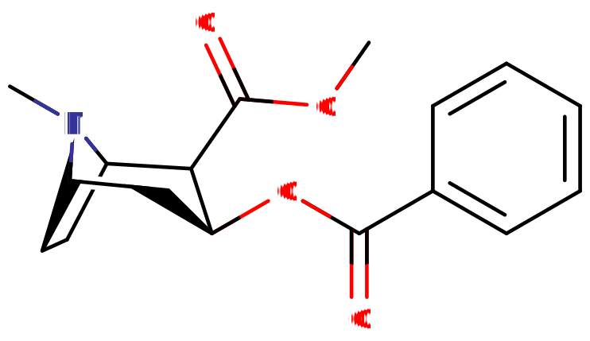
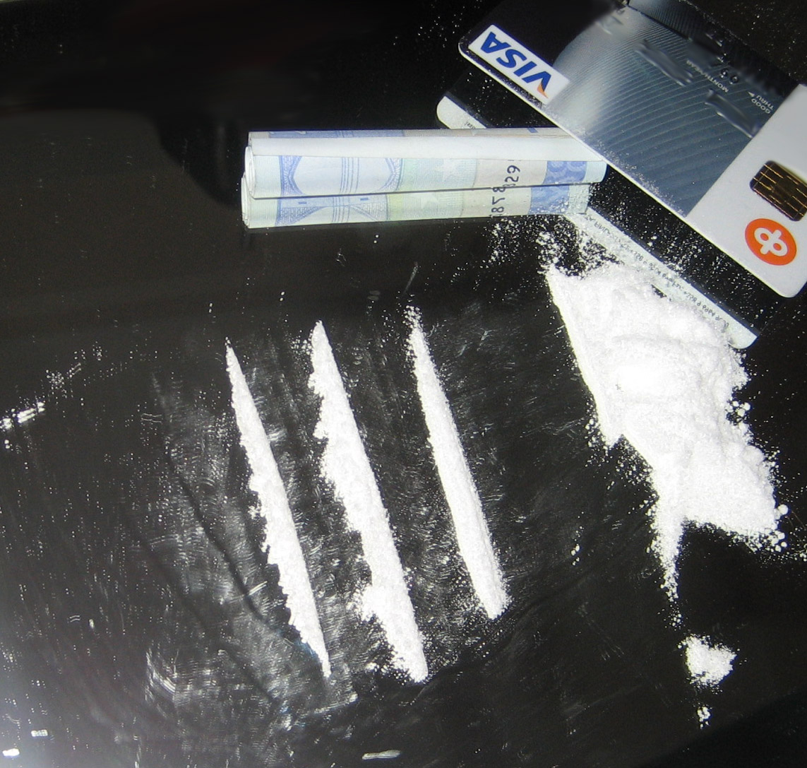
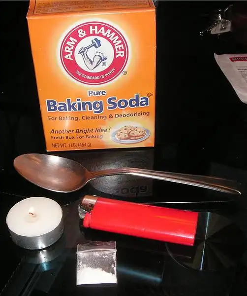
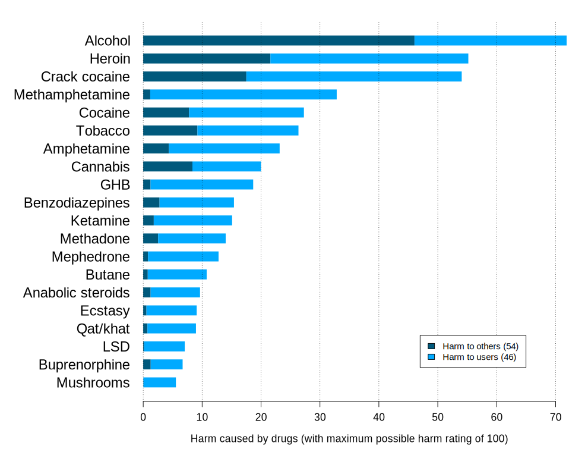
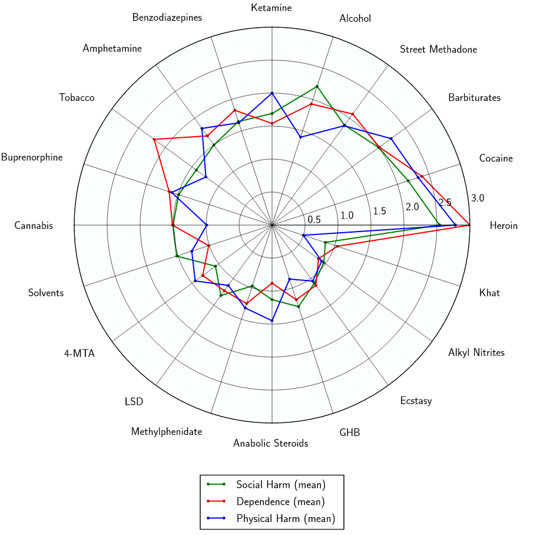

# 可卡因

[◀返回](index.md)

!!! quote " "

    根据多重因素推断：《Rimworld》中的成瘾品「精神茶」「呀呦粉」和「薄片」似乎分别来自于传统古柯茶叶、可卡因和[霹雳可卡因](#形式)，而它们共同的原料「精神叶」则是古柯树

    1. 游戏中，它们来自于同一原材料——植物「精神叶」，与现实生活中相同——可卡因来源于古柯树萃取提炼而成。而古柯叶泡茶提神是南美洲原住民传统，这也是游戏中「精神茶」的对应物
    2. 游戏中，描述角色使用成瘾品时，使用「呀呦粉」被描述为「吸」，「薄片」则为「抽」。现实生活中可卡因是直接吸粉末的，而霹雳可卡因则是通过加热气化后吸入气体的
    3. 游戏中，「呀呦粉」持续的效果更长，而「薄片」则持续时间更短。现实生活中，霹雳可卡因的起效更快但持续时间更短，而可卡因则相反。同时，「呀呦粉」的意外过量风险比「薄片」低，成瘾性也较低，与现实生活中可卡因和霹雳可卡因的情况一致。

!!! danger "危险"

    **左旋咪唑（Levamisole）一种常见的可卡因掺假物，与可卡因/左旋咪唑相关综合征有关**。到 2017 年，美国查获并分析的可卡因中，有 87% 含有左旋咪唑。[^1]

    可卡因和左旋咪唑诱发的[血管炎](https://en.wikipedia.org/wiki/Vasculitis)（CLIV）[^2]，通常作为一个统称，用来描述掺有左旋咪唑的可卡因引起的血管炎和坏死并发症，包括[左旋咪唑诱发的坏死综合征](https://en.wikipedia.org/wiki/Levamisole_induced_necrosis_syndrome)（LINES）[^3]，以及可卡因/左旋咪唑相关的[自身免疫综合征](https://en.wikipedia.org/wiki/Autoimmune_disease)（CLAAS）[^4] 。

    **为了安全**：DanceSafe 建议使用特定的[试剂检测套件](../文档/试剂检测套件.md)序列（ Morris > Marquis > Liebermann ）来测试可卡因样本，以便更可靠地识别成分和检测掺假物。详细说明请参见他们的[官方测试指南（PDF），第4页](https://dancesafe.org/wp-content/uploads/2024/05/DS_Instructions_Reagents_v17Spring24.pdf)。

| **化学信息** | 可卡因（Cocaine）                                                                          |
| ------------ | ------------------------------------------------------------------------------------------ |
| 结构式       |                                                                    |
| 分子式       | C17H21NO4                                                 |
| CAS 号       | 50-36-2                                                                                    |
| **化学命名** |                                                                                            |
| 常见名称     | Cocaine、Coke、Coca、Crack、Blow、Girl、White、Snow、Nose Candy、Yayo、Perico、Gear、Chari |
| 取代名称     | Benzoylmethylecgonine（苯甲酰甲基芽子碱）                                                  |
| 系统名称     | Methyl (1R,2R,3S,5S)-3- (Benzoyloxy)-8-methyl-8-azabicyclo[3.2.1] octane-2-carboxylate     |
| **类别归属** |                                                                                            |
| 精神活性分类 | _[兴奋剂](../文档/药物分类/兴奋剂.md)、[SNDRI](../文档/药物分类/SNDRI.md)_                 |
| 化学分类     | _[托烷类物质](../文档/药物分类/托烷类物质.md)_                                             |

| [给药途径](../文档/给药途径.md)                   | ⇣ [抽吸](../文档/给药途径.md#Smoked) | ⇣ [口服](../文档/给药途径.md#Oral) | ⇣ [鼻吸](../文档/给药途径.md#Insufflated) | ⇣ [静脉注射](../文档/给药途径.md#Intravenous) |
| ------------------------------------------------- | ------------------------------------ | ---------------------------------- | ----------------------------------------- | --------------------------------------------- |
| [生物利用度](../文档/给药剂量.md#Bioavailability) | 90%[^5]                              | 33%[^6]                            | 60[^7] \~ 80%[^8]                         | 100%                                          |
| [**给药剂量**](../文档/给药剂量.md)               |                                      |                                    |                                           |                                               |
| [阈值](../文档/药物剂量分类.md#Threshold)         | 2.5 mg                               | 13 mg                              | 5 mg                                      | 2 mg                                          |
| [轻微](../文档/药物剂量分类.md#Light)             | 5 \~ 15 mg                           | 13 \~ 75 mg                        | 10 \~ 30 mg                               | 2 \~ 5 mg                                     |
| [中等](../文档/药物剂量分类.md#Common)            | 15 \~ 30 mg                          | 75 \~ 150 mg                       | 30 \~ 60 mg                               | 5 \~ 10 mg                                    |
| [强烈](../文档/药物剂量分类.md#Strong)            | 30 \~ 45 mg                          | 150 \~ 225 mg                      | 60 \~ 90 mg                               | 10 \~ 15 mg                                   |
| [严重](../文档/药物剂量分类.md#Heavy)             | 45 mg +                              | 225 mg +                           | 90 mg +                                   | 15 mg +                                       |
| [**药效时长**](../文档/药效时长.md)               |                                      |                                    |                                           |                                               |
| [总时长](../文档/药效时长.md#Total)               | 5 \~ 15 分钟                         | 120 \~ 240 分钟                    | 10 \~ 90 分钟                             | 5 \~ 15 分钟                                  |
| [药效发作](../文档/药效时长.md#Onset)             | 3 \~ 5 秒                            | 30 \~ 40 分钟                      | 3 \~ 10 分钟                              | 3 \~ 5 秒                                     |
| [药效上升](../文档/药效时长.md#Come_up)           | 1 \~ 2 分钟                          | 40 \~ 50 分钟                      | 5 \~ 12 分钟                              | 1 \~ 2 分钟                                   |
| [药效达峰](../文档/药效时长.md#Peak)              | 2 \~ 10 分钟                         | 60 \~ 180 分钟                     | 7.5 \~ 16 分钟                            | 2 \~ 10 分钟                                  |
| [药效褪去](../文档/药效时长.md#Offset)            | 1 \~ 5 分钟                          | 10 \~ 25 分钟                      | 10 \~ 25 分钟                             | 1 \~ 5 分钟                                   |

| [药物联用](#危险药物联用) |             |
| ------------------------- | ----------- |
| 蘑菇                      | ⚠️ 谨慎联用 |
| LSD                       | ⚠️ 谨慎联用 |
| DMT                       | ⚠️ 谨慎联用 |
| 麦斯卡林                  | ⚠️ 谨慎联用 |
| 2C-x                      | ⚠️ 谨慎联用 |
| 大麻                      | ⚠️ 谨慎联用 |
| 氯胺酮                    | ⚠️ 谨慎联用 |
| MXE                       | 💔 联用危险 |
| 苯丙胺类物质              | 💔 联用危险 |
| MDMA                      | 💔 联用危险 |
| 咖啡因                    | ⚠️ 谨慎联用 |
| GHB                       | 💔 联用危险 |
| GBL                       | 💔 联用危险 |
| DOx                       | ⚠️ 谨慎联用 |
| 25x-NBOMe                 | 💔 联用危险 |
| 2C-T-x                    | 💔 联用危险 |
| 5-MeO-xxT                 | ⚠️ 谨慎联用 |
| 右美沙芬                  | 💔 联用危险 |
| PCP                       | 💔 联用危险 |
| 酒精                      | 💔 联用危险 |
| αMT                       | ⚠️ 谨慎联用 |
| 阿片类药物                | 💔 联用危险 |
| 曲马多                    | 💔 联用危险 |
| 单胺氧化酶抑制剂          | ⛔ 严禁联用 |

!!! warning "警告"

    由于个体体重、耐受性、新陈代谢和个人敏感度的差异，请务必从低剂量开始。参见[负责任的用药部分](../文档/负责任的用药索引页.md)。

!!! info "[免责声明](../关于本站/免责声明.md)"

    本站的[给药剂量](../文档/给药剂量.md)信息收集自用户和[相关资源](../文档/科学信息索引页.md)，仅供教育目的使用。这不是医疗建议，应与其他来源核实以确保准确性。

**可卡因**（Cocaine，也被称为 **苯甲酰甲基芽子碱**，非正式名称有 **coke**, **cola**, **snow**, **blow**, **white** 等，[详见下文](可卡因.md#Etymology)）是[托烷类物质](../文档/药物分类/托烷类物质.md)中的一种经典[兴奋剂](../文档/药物分类/兴奋剂.md)。它是一种[天然存在](../文档/天然来源表.md)的[生物碱](../文档/生物碱.md)，提取自两种[古柯](../文档/古柯.md)植物的叶子；即原产于南美洲的 _Erythroxylum coca_ 和 _E. novogranatense_。[^10] 其作用机制涉及增加大脑中[血清素](../文档/血清素.md)、[多巴胺](../文档/多巴胺.md)和[去甲肾上腺素](../文档/去甲肾上腺素.md)的水平。

可卡因是世界上分布最广且受到高度管制的非法物质之一。根据 2007 年联合国的一份报告，它是世界上使用量第二大的物质，仅次于[大麻](大麻.md)。[^11] 它被认为是一种主要的所谓「街头毒品」和「滥用药物」，与[海洛因](海洛因.md)和[甲基苯丙胺](甲基苯丙胺.md)并列。 由于其高利润率和长期稳定的需求，它已成为各种跨国犯罪集团或相关组织在黑市上贩运的主要产品。

可卡因的使用跨越了所有社会阶层，打破了将其仅仅与富人或穷人联系在一起的传统刻板印象。虽然可卡因是一种昂贵的毒品——通常被富裕用户视为身份的象征——但研究表明，其使用率在收入和教育水平较高的人群中比例更高，特别是在所谓的「中产阶级」或富裕群体中。[^12] 大约 25% 的患有 ADHD 的成年人使用可卡因，其中 10% 发展为使用障碍。由于相关的健康风险，通常建议进行筛查。[^13]

[主观效应](../药效/index.md)包括[兴奋](../药效/兴奋.md)、[血压升高](../药效/血压升高.md)、[食欲抑制](../药效/食欲抑制.md)、[去抑制](../药效/去抑制.md)、[动机增强](../药效/动机增强.md)、[自我膨胀](../药效/自我膨胀.md)、[性欲增强](../药效/性欲增强.md)和[欣快感](../药效/认知欣快.md)。给药途径包括[鼻吸](../文档/给药途径.md)（「snorting」或「sniffing」）以及偶尔的[注射](../文档/给药途径.md)。[口服](../文档/给药途径.md)摄入很少见但也是可能的，并且具有明显更长的持续时间；口服为 60 分钟，而鼻吸为 10-20 分钟，抽吸为 5 分钟。[^14] [^15]

典型的可卡因药效特点是[药效发作](../文档/药效时长.md)迅速且持续时间短，具有强烈的欣快「冲击感」（rush），随后是明显的消退或「崩溃」（crash）——这种体验会促使[强迫性补量](../药效/强迫性补量.md)。据报道，过量使用会增加[焦虑](../药效/焦虑.md)、[偏执](../药效/偏执.md)、易怒、轻微[幻觉](../药效/幻觉状态.md)、[躁狂](../药效/躁狂.md)的风险，在极少数情况下，还会导致[精神病发作](../药效/精神病发作.md)。

众所周知，它具有很高的滥用潜力。 长期使用（即高剂量、重复给药）与不断升级的耐受性和生理依赖有关，如果不加以治疗，可能会变得很严重。

此外，一些证据表明，与其他中枢神经系统兴奋剂（包括整个[苯丙胺类物质](../文档/药物分类/苯丙胺类物质.md)）相比，它具有独特的心脏毒性风险。[^16] 即使是「常规」使用也与永久性心脏病的发生有关，并且似乎还会导致易感人群的心源性猝死（更多信息请参见[此部分](可卡因.md#Toxicity_and_harm_potential)）。[^17]

如果使用这种物质，强烈建议采取[伤害减少措施](../文档/负责任的用药索引页.md)。

|                                                                                                                |
| :---------------------------------------------------------------------------------------------------------------------------------------------------------------: |
| [受污染的货币](https://en.wikipedia.org/wiki/Contaminated_currency)（如钞票）可能会成为丙型肝炎等疾病的[污染物传播媒介](https://en.wikipedia.org/wiki/Fomite)[^9] |

!!! warning "警告"

    长期使用可卡因会导致「[可卡因鼻](https://en.wikipedia.org/wiki/Cocaine#Cocaine_nose)」——损伤范围从[鼻中隔穿孔](https://en.wikipedia.org/wiki/Nasal_septum_perforation)（如图）到[可卡因诱发的中线破坏性病变（CIMDL）](https://en.wikipedia.org/wiki/Cocaine-induced_midline_destructive_lesions)

## 历史与文化

可卡因（大概是以 _古柯_ 叶的形式）是使用历史最悠久的药物之一，在玻利维亚西南部一个名为 Cueva del Chilano 的岩石掩体中发现了一组有 1000 年历史的古代「药物用具」（很可能是用于仪式），这似乎可以追溯到古老的蒂亚瓦纳科文化。这个古老的安第斯遗址发现了五种药物化学物质的痕迹，包括可卡因、苯甲酰芽子碱（可卡因的非活性代谢物）、[蟾毒色胺](5-HO-DMT.md)、[DMT](DMT.md)以及哈尔明碱（可能表明使用了[死藤水](死藤水.md)）。奇怪的是，还发现了一个装饰过的「骨制鼻烟壶」。[^18]

然而，当时不太可能是作为「粉末状可卡因」食用的，而仅仅是生嚼未加工的古柯叶，这产生的兴奋效果比现代的可卡因粉末或游离碱要弱得多，也更安全。咀嚼古柯叶或饮用被称为 _mate de coca_ 的冲泡饮料（茶）时感受到的主观强度，或许更像是[咖啡因](咖啡因.md)，尽管许多用户认为「古柯茶」在感觉上仍然比普通的含咖啡因饮料（如咖啡或红茶）更强。关于从植物中分离出可卡因生物碱的最早记录之一是在 1855 年[^19]，当时德国化学家 Friedrich Gaedcke 在《药学档案》杂志上发表了一篇描述，将该生物碱命名为「erythoxyline」。五年后的 1860 年， Albert Niemann 描述了从古柯中分离出一种生物碱，并将其命名为*可卡因*。随着这种臭名昭著的生物碱从古柯植物中化学分离出来，当代形式的可卡因历史就开始了。西方医学很快利用了该药物各种被感知到的表面层面或推测的好处。此后，制药和医学界开始发表相关研究论文。

这些发表的论文中，其中一个亮点是西格蒙德·弗洛伊德被称为「可卡因论文」的出版物集[^20]，这可以被认为是该药物在当时以及大约 1974 年重新发现这些论文时人气飙升的部分原因。在这些论文中，他正确地推测了可卡因作为局部麻醉剂的医疗用途，因为它的麻木作用：「可卡因[...]麻醉皮肤和粘膜的能力表明了它未来的可能用途，特别是在局部感染的情况下...... 基于这种麻醉特性的可卡因的一些额外用途很可能在不久的将来被开发出来。」 此外，弗洛伊德还观察到了可卡因对嘴唇和口腔的麻木作用。

弗洛伊德记录了他研究的关于饥饿、睡眠和疲劳的影响。描述道：「...兴奋和持久的欣快感，这与健康人的正常欣快感没有任何区别...... 你会感到自控力的增强，拥有更多的活力和工作能力...... 换句话说，你只是变得正常了，很快就很难相信你是在药物的影响下...... 长时间的剧烈脑力或体力劳动可以在没有任何疲劳的情况下完成...... 这种结果是在没有任何酒精引起的兴奋后的不愉快后遗症的情况下享受的。...... 在第一次甚至多次服用该药物后，完全没有出现进一步使用可卡因的渴望；相反，人们对它感到某种奇怪的厌恶。」 最后的陈述与现代关于可卡因使用后引发的渴望（[强迫性补量](../药效/强迫性补量.md)）的许多声誉相矛盾。

弗洛伊德还建议使用可卡因治疗吗啡戒断。

关于该药物的第一篇主要文章，也是「可卡因论文」集的一部分，是西格蒙德·弗洛伊德 1884 年的《关于古柯》(Uber Coca)，该文章概述了许多主要的观察效果，并对该药物的潜在用途进行了科学分析。弗洛伊德观察到：

「服用可卡因几分钟后，人会体验到一种突然的兴奋和轻盈感。嘴唇和上颚会感到某种毛茸茸的感觉，随后这些区域会有温暖的感觉；如果此时喝冷水，嘴唇会感到温暖，喉咙会感到寒冷。在其他时候，主要的感觉是口腔和喉咙里相当愉快的凉爽感。」 提到了药物带来的[欣快感](../药效/认知欣快.md)或[身体欣快感](../药效/躯体欣快感.md)。也可以从体验叙述中读到标志性的[口腔麻木](../药效/口腔麻木.md)。

根据 2007 年联合国的一份报告，可卡因是世界上使用量第二大的非法物质，仅次于[大麻](大麻.md)。[^11] 可卡因使用与暴力行为之间直接联系的科学证据有限；媒体偏见和误解可能助长了这种看法，这更可能由可卡因使用障碍或人格障碍来解释。[^21] 考虑到 2010 年代末和 2020 年代初，该药物的生产和全球使用量据报道甚至出现了更大的增长，这个统计数据似乎仍然非常贴切。根据 VICE News 等某些媒体的说法，截至 2022 年；苏格兰被认为是世界可卡因使用中心，随之而来的是，现在可能是「欧盟内的毒品死亡之都」。在过去的几年里，可卡因贩运和普遍使用在东半球的各个国家和地区出现了可以说是指数级的增长，许多有组织犯罪集团现在已经改变了他们的商业模式，主要倾向于可卡因贩运，通常直接与南美的主要犯罪集团合作。

就用户率而言（截至 2007 年），西班牙是可卡因使用率最高的国家（前一年有 3.0% 的成年人使用）。其他使用率达到或超过 1.5% 的国家有美国（ 2.8%）、英格兰和威尔士（ 2.4%）、加拿大（ 2.3%）、意大利（ 2.1%）、玻利维亚（ 1.9%）、智利（ 1.8%）和苏格兰（ 1.5%）。[^22]

### 词源

_Cocaine_ 这个名字源于「coca」（古柯）和生物碱后缀「-ine」。

### 常见名称

可卡因有许多常见名称或街头名称，包括 **coke**, **coca**, **cola**, **snow**, **ski**, **blow**, **nose candy**, **white**, 和 **girl**。受西班牙语影响的名称包括 **lello**, **yayo**, **yeyo**, 或 **yay**。在英国更具地域性的名称有 biff, charlie, lemos, flake 等等。

## 化学

可卡因是一种[托烷类](../文档/药物分类/托烷类物质.md) [生物碱](../文档/生物碱.md)，发现于两种[古柯](../文档/古柯.md)植物 _Erythroxylum coca_ 和 _E. novogranatense_ 的叶子中，这些植物原产于南美洲的安第斯山脉。[^10] 然而，中美洲的古柯产量急剧增加。 2022 年，当局在洪都拉斯销毁了超过 650 万株古柯植物，在危地马拉销毁了 400 万株，在伯利兹南部销毁了超过 50 万株。到 2024 年，洪都拉斯发现并铲除的古柯种植园数量几乎比前一年翻了一番，该地区拆除的加工实验室数量也创下了纪录。与安第斯山脉小农户通常种植古柯不同，中美洲的种植由有组织犯罪集团控制，并得到主要外国卡特尔的支持。[^23] [^24] [^25]

可卡因在强烈加热时会分解，因此，当需要蒸发该物质时，通常使用可卡因的游离碱和碳酸氢盐形式，因为它们的沸点比盐酸盐低得多，分别被称为可卡因碱和「快克」（crack）。

可卡因的化学结构由三部分组成；亲水性甲酯部分和亲脂性苯甲酰酯部分，它们分别位于芽子碱的羧酸和羟基基团的位置。这种结构使其能够通过鼻粘膜和血脑屏障快速吸收。

两个酯基的存在使得可卡因在温暖、潮湿的环境中相对不稳定，储存在开口容器中或水分含量高的可卡因会随着时间的推移因水解成甲基芽子碱或苯甲酰芽子碱而失去明显的效力。

### 合成

!!! info "[免责声明](../关于本站/免责声明.md)"

    本指南仅供信息和教育目的。我们不鼓励你违法，也不对你的行为承担任何责任。

虽然[可卡因的生物合成](https://en.wikipedia.org/wiki/Biosynthesis_of_cocaine)既罕见又具有技术挑战性，但代谢工程的进步使得在世界各地的实验室中生产可卡因在理论上成为可能，从而可能消除对拉丁美洲贩运的依赖。由于该药物目前经过许多中间商——每个人都试图增加利润——它经常被掺入各种掺假物，导致纯度降低并增加使用者的健康风险。在受控的实验室环境中直接生产可卡因可以显著减少这种掺假。这种方法甚至可能对那些[持有少量非刑事化](https://en.wikipedia.org/wiki/Legal_status_of_cocaine)的国家的小规模生产有用，即使可卡因是在生产国购买的。可卡因有时会在到达最终用户之前被卡特尔掺入左旋咪唑。[^26]

Rhodium 档案中的 Buzz 教授的可卡因合成提供了一个可卡因合成路线的例子。

## 药理学

关于可卡因对中枢神经系统影响的研究最广泛的是其对[多巴胺](../文档/多巴胺.md)转运体的阻断作用。这种物质作为一种[再摄取抑制剂](../文档/神经递质再摄取抑制剂.md)，阻止[多巴胺](../文档/多巴胺.md)被回收，导致过量的多巴胺在突触或[神经元](../文档/神经元.md)之间的连接处积聚。结果是多巴胺能信号传导的突触后效应增强和延长。在较小程度上，可卡因也表现出对[血清素](../文档/血清素.md)和[去甲肾上腺素](../文档/去甲肾上腺素.md)神经递质再摄取抑制的功能相似作用。[^27] 正是这种[神经递质](../文档/神经递质.md)的突然泛滥导致了可卡因特有的兴奋感。

可卡因的药效学涉及神经递质的复杂关系（在大鼠中抑制单胺摄取的比例约为：血清素:多巴胺 = 2:3 ，血清素:去甲肾上腺素 = 2:5 ）。关于可卡因对中枢神经系统影响的研究最广泛的是其对多巴胺转运蛋白的阻断作用。神经信号传导过程中释放的多巴胺递质通常通过转运体回收；即，转运体结合递质并将其从突触间隙泵回突触前神经元，在那里它被摄入储存囊泡中。

可卡因紧密结合在多巴胺转运体上，形成一种阻断转运体功能的复合物。多巴胺转运体无法再执行其再摄取功能，因此多巴胺在突触间隙中积聚。突触中多巴胺浓度的增加激活了突触后多巴胺受体，这使得该药物具有奖赏性并促进了可卡因的强迫性使用。[^28]

## 主观效应

!!! info "[免责声明](../关于本站/免责声明.md)"

    _下列效应引用自 [**主观效应索引**](../药效/index.md) (**SEI**)，这是一个基于轶事用户报告和个人分析的开放研究文献。因此，应带着健康的怀疑态度来看待它们。_

    _同样值得注意的是，这些效应不一定会以可预测或可靠的方式发生，尽管较高的剂量更可能引发全方位的效应。同样，**不良反应** 随着剂量的增加变得越来越可能，可能包括 **成瘾、严重伤害或死亡** ☠。_

可卡因的认知效应可以分解为几个部分，这些部分随着剂量的增加而逐渐增强。可卡因的一般精神状态被描述为极度精神兴奋、动机增加、性欲增加以及压倒性的欣快感和/或满足感。然而，药物的主观体验很大程度上取决于质量和纯度，这可能会有巨大的差异。

- ### **[躯体效应](../药效/躯体效应.md)** 
    - **[兴奋](../药效/兴奋.md)**：据报道，可卡因具有极强的能量和刺激性，其方式比[甲基苯丙胺](甲基苯丙胺.md)弱，但通常强于[苯丙胺](苯丙胺.md)、[莫达菲尼](莫达菲尼.md)、[咖啡因](咖啡因.md)和[哌甲酯](哌甲酯.md)。可卡因呈现的特定刺激风格可以描述为在低到中等剂量下是受鼓励的，但在高剂量下是强迫的。这意味着在某些剂量下，随着下颚紧咬、不自主的身体颤抖和震动出现，保持静止变得困难或不可能，导致全身剧烈颤抖、手不稳以及普遍缺乏精细运动控制。这种效应在体验消退期间会被轻微的疲劳和普遍的疲惫所取代。然而，许多用户报告说，与标准苯丙胺相比，「充满活力」的效果相对有限，并且不罕见地甚至会报告某些「放松」效果或明显的欣快和兴高采烈，但实际刺激量有限。
    - **[心律异常](../药效/心律异常.md)**：可卡因持续将心率提高到异常高的水平，如果在短时间内长时间或大剂量使用，这可能是危险的。即使是像走路这样微妙的身体活动似乎也会引起异常快的心跳；即使与其他兴奋剂相比也是如此。因此，建议用户参与比平时更少的身体活动，即使与这些其他物质相比，因为该药物对脉搏率和心输出量有独特显著的影响。可卡因是一种具有特别心脏毒性的兴奋剂。
    - **[身体欣快感](../药效/躯体欣快感.md)**
    - **[神经毒性](../文档/神经毒性.md)**：长期或反复使用可卡因会导致严重的神经损伤。[^29] [^30] [^31]
    - **[心率增快](../药效/心率增快.md)**
    - **[血压升高](../药效/血压升高.md)**
    - **[食欲抑制](../药效/食欲抑制.md)**：对于新用户或未适应的用户，此成分通常不太强烈。
    - **[躯体控制增强](../药效/躯体控制增强.md)**
    - **[支气管扩张](../药效/支气管扩张.md)**：这有时可能非常明显，并可能导致无法吞咽。
    - **[脱水](../药效/脱水.md)**
    - **[尿频](../药效/尿频.md)**
    - **[排便](../w/index.php?title=Bowel_movements&action=edit&redlink=1)**
    - **[体温升高](../药效/体温升高.md)**
    - **[出汗增加](../药效/出汗增加.md)**
    - **[镇痛](../药效/镇痛.md)**：可卡因被接受的少数医疗用途之一是作为局部麻醉剂；即由于[触觉抑制](../药效/触觉抑制.md)（麻木）。这种效应似乎主要是由钠通道阻滞介导的。 在娱乐环境中，例如鼻吸；这种感觉主要在鼻道、喉咙和/或前牙明显感觉到。整个面部的麻木通常表明物质中添加了切割剂，如诺瓦卡因。
    - **[瞳孔扩大](../药效/瞳孔扩大.md)**
    - **[口腔麻木](../药效/口腔麻木.md)**
    - **[触觉幻觉](../药效/触觉幻觉.md)**[^32]：高剂量和/或长期使用某些多巴胺能兴奋剂，如[甲基苯丙胺](甲基苯丙胺.md)和可卡因，会导致产生虫子在皮肤表面或皮肤下爬行的幻觉（蚁走感）。这通常被称为*寄生虫妄想*，或更非正式地称为「可卡因虫」（coke bugs）。
    - **[磨牙](../药效/磨牙.md)**：与[MDMA](MDMA.md)相比，该成分可以被认为不那么强烈。
    - **[暂时性勃起功能障碍](../药效/暂时性勃起功能障碍.md)**
    - **[血管收缩](../药效/血管收缩.md)**：像其他兴奋剂一样，这会导致用户身体各个部位感到寒冷，例如手部。当与其他血管收缩剂（如[尼古丁](烟草.md)）结合使用时，这可能会变得非常危险。

- ### **[认知效应](../药效/认知效应.md)** 

    可卡因的精神状态和认知效应被认为是欣快和令人振奋的，最初有明显的「冲击感」（rush），很快平稳下来变成较弱的兴奋感，然后在十几分钟内迅速消退，除非（安全地）补量。有时据报道，与类似口径或强度的兴奋剂（如大多数[苯丙胺类物质](苯丙胺.md)）相比，它更具「享乐主义」、躁狂或易分心；但通常仍被报道为比[咖啡因](咖啡因.md)（常见的[黄嘌呤](../文档/药物分类/兴奋剂.md)兴奋剂）的中高剂量更少「注意力涣散」。与其他强兴奋剂相比，它通常在执行功能方面的增强也明显较少。它也以其所谓的「蜜月期」而闻名，当用户刚接触该物质时，可卡因的效果（尤其是精神上的）似乎特别或不成比例地积极；通常据报道，[食欲抑制](../药效/食欲抑制.md)和[清醒](../药效/清醒.md)等效果在早期接触该药物时不太强烈。

    - **[分析能力增强](../药效/分析能力增强.md)**：这种效果通常只在低到中等剂量下出现。
    - **[焦虑](../药效/焦虑.md)** _或_ **[焦虑抑制](../药效/焦虑抑制.md)**
    - **[强迫性补量](../药效/强迫性补量.md)**：这种效果比任何其他常用的[兴奋剂](../文档/药物分类/兴奋剂.md)都更普遍。
    - **[认知欣快](../药效/认知欣快.md)**：当[鼻吸](../文档/给药途径.md#Insufflated)时，此成分几乎总是首先表现为前 5-10 分钟内的初始「冲击感」，然后迅速在接下来的 10 分钟左右平稳下来变成较轻程度的精神欣快。然而，其他精神和身体成分可以比这个最初备受追捧的欣快 _冲击_ 阶段持续更长时间。
    - **[去抑制](../药效/去抑制.md)**
    - **[自我膨胀](../药效/自我膨胀.md)**：这种效果可能表现得不一致或偶尔出现，有时相反；仅在尾声阶段、重复给药甚至矛盾地与其他更友好的成分（如[共情、情感和社交能力增强](../药效/共情、情感和社交能力增强.md)）结合出现；然而仍然明显少于[MDMA](MDMA.md)和[共情剂](../文档/药物分类/共情剂.md)。
    - **[专注力强化](../药效/专注力强化.md)**：此成分在低到中等剂量下最有效，因为任何更高的剂量通常都会损害注意力。然而，与苯丙胺相比，这种效果仍然要小得多，通常包括注意力分散增加，并且经常无法一次专注于单个任务。鼻吸带来的奖励感、短暂的认知增强和异常欣快的精神「冲击感」经常被认为是这种有限的注意力增加潜力的主要原因。
    - **[性欲增强](../药效/性欲增强.md)**：由于该药物据称对睾酮水平的影响，而不仅仅是多巴胺的增加，这种风格（与类似物质相比）可能更突出或更强烈。这也可能取决于剂量。
    - **[音乐欣赏能力增强](../药效/音乐欣赏能力增强.md)**：在经常或长期使用后，此成分可能会变得不那么强烈甚至完全不存在。
    - **[易怒](../药效/易怒.md)**：虽然通常这种效果主要出现在[药效达峰](../文档/药效时长.md#Peak)后或消退阶段；但与可卡因中毒相关的易怒和/或极度不耐烦因其偶尔发生且很大程度上不可预测的潜在强度而臭名昭著。它通俗地被称为「可卡因愤怒」（coke rage）。[^33]
    - **[躁狂](../药效/躁狂.md)**：可卡因的这一方面通常是将其指定为与等效剂量的苯丙胺相比头脑不那么清醒和「功能性」的主要品质之一。
    - **[记忆增强](../药效/记忆增强.md)**：这通常只在非常短暂的高峰效应期间出现，但可能异常突出；可能是由于可卡因增加了大脑中[乙酰胆碱](../文档/乙酰胆碱.md)的信号传导。
    - **[记忆抑制](../药效/记忆抑制.md)**：这种效果在高剂量下最普遍，似乎主要影响短期记忆。
    - **[暗示性抑制](../药效/暗示性抑制.md)**
    - **[动机增强](../药效/动机增强.md)**
    - **[耳鸣](../w/index.php?title=Ringing_in_ears&action=edit&redlink=1)**：这种效果通常只有在[静脉注射](../文档/给药途径.md#Intravenous)可卡因时才会体验到，被称为「响铃」（bell ringer）。
    - **[思维加速](../药效/思维加速.md)**：这一方面即使在主要效果消退后仍可继续。
    - **[思维组织](../药效/思维组织.md)**：这种可能的效果被认为比苯丙胺明显要小。
    - **[时间压缩](../药效/时间扭曲.md)**：这可以描述为时间加速和流逝比清醒时快得多的体验。
    - **[清醒](../药效/清醒.md)**：这被认为比苯丙胺类兴奋剂（特别是甲基苯丙胺）要小。

- ### **药效残余** 

    与[药效达峰](../文档/药效时长.md#Peak)期间发生的效果相比，[兴奋剂](../文档/药物分类/兴奋剂.md)体验的[药效褪去](../文档/药效时长.md#Offset)期间发生的效果通常感觉消极和不舒服。这通常被称为 _下头_（comedown）或「崩溃」（crash），是因为[神经递质](../文档/神经递质.md)耗竭而发生的。然而，许多用户报告说，「崩溃」的严重程度取决于剂量；与消耗其他主要神经递质的兴奋剂相比，低或适度的剂量有时似乎没有强烈的崩溃感。相反，在高剂量下，它仍然可能非常严重。其影响通常包括：
    
    - **[焦虑](../药效/焦虑.md)**
    - **[认知疲劳](../药效/认知疲劳.md)**
    - **[强迫性补量](../药效/强迫性补量.md)**[^34]：在药效褪去期间，一旦用户几乎立刻「下头」，他们可能会体验到对该药物异常强烈的渴望。
    - **[抑郁](../药效/抑郁.md)**：在较高剂量下可能很严重，但在某些时候；对于许多用户来说，在较低剂量下实际上不存在。然而，当在体感到中度到重度水平时，它也可能包括明显的身体不适和烦躁的「空虚感」，有时在胸部或鼻道中。
    - **[易怒](../药效/易怒.md)**
    - **[动力抑制](../药效/动力抑制.md)**
    - **[呼吸抑制](../药效/呼吸抑制.md)**
    - **[触觉幻觉](../药效/触觉幻觉.md)**：这发生在大量或长期使用后，表现为昆虫在皮肤上爬行的感觉。
    - **[思维减速](../药效/思维减速.md)**
    - **[头痛](../药效/头痛.md)**

### 体验报告

目前我们的[报告索引](../报告/index.md)中没有关于该物质效果的体验报告。你可以在[本站 Github 仓库](https://github.com/SalviaSWC/FreeODwiki)提交你自己的体验报告。

其他的体验报告可以在这里找到：

- [Experience:Cocaine 5mg Insufflated](https://psychonautwiki.org/wiki/Experience:Cocaine_5mg_Insufflated)

## 常见用途

可卡因在黑市出售时经常被掺假，这会显著改变其对身体的影响。即使掺假物在药理上是无活性的，它们与可卡因因水分而导致的长期易变质性相结合，也会导致可卡因剂量之间明显的效力差异巨大，因此，很难确定「典型」的娱乐剂量。

纯可卡因非常强效， 1 毫克即可产生可感知的局部麻醉（麻木）效果， 5-7 毫克即可产生可感知的中枢神经系统刺激；然而，在娱乐环境中往往使用更高的剂量。

## 形式

|                                                                                              |
| :------------------------------------------------------------------------------------------------------------------------------------------------------: |
| 为了将可卡因（底部塑料袋中）转化为快克，需要几种用品。图为小苏打（制作快克常用的碱）、金属勺、茶蜡和打火机。勺子放在热源上方，以便将可卡因「煮」成快克。 |

- **可卡因膏（Cocaine paste）**：古柯叶的粗提物，含有 40% 到 91% 的硫酸可卡因以及伴随的古柯生物碱和不同数量的苯甲酸、甲醇和煤油。
- **盐类（Salts）**：可卡因是一种弱碱性化合物（一种「生物碱」），因此可以与酸化合物结合形成各种盐。盐酸盐（HCl）是迄今为止最常见的，尽管偶尔也会见到硫酸盐（-SO4）和硝酸盐（-NO3）。不同的盐在各种溶剂中的溶解程度不同。盐酸盐具有极性，极易溶于水。
- **游离碱（Freebase）**：「游离碱」是可卡因的碱形式，与盐形式相对。它几乎不溶于水，而盐酸盐是水溶性的。这使得碱性形式的可卡因无法用于[舌下](../文档/给药途径.md)使用和[鼻吸](../文档/给药途径.md)。游离碱可卡因可以用乙醚、异丙醇和盐酸处理，将其转化为盐形式。[^35]
- **「快克」（Crack）**：「快克」是指纯度较低的游离碱可卡因，通常通过用小苏打（碳酸氢钠， NaHCO3 ）和水的溶液中和盐酸可卡因来生产，产生一种非常坚硬/易碎的、灰白色到棕色的无定形材料，其中含有碳酸钠、截留的水和其他副产品作为主要杂质。抽吸或蒸发可卡因并将其吸入肺部会产生几乎即时的「兴奋」，这种兴奋可能非常强烈且令人上瘾。这种最初的刺激积累被称为「冲击感」（rush）。虽然刺激效果可能会持续数小时，但欣快感非常短暂，促使用户立即吸食更多。
- **古柯叶浸液（Coca leaf infusions）**：古柯草本浸液（也称为古柯茶）在古柯叶生产国的使用就像世界上其他地方的任何草本药用浸液一样普遍。秘鲁和玻利维亚政府多年来一直积极推广以过滤袋形式自由合法地商业化干古柯叶，用作具有药用特性的「古柯茶」饮料。这些叶子也被当地居民广泛用于各种目的，包括治疗高原反应。
- **古柯叶咀嚼（Coca leaf chewing）**：咀嚼叶子（加石灰）在产区也很常见，这会麻木口腔并引起轻微的刺激。

## 毒性与危害潜力

!!! warning "警告：鼻腔给药"

    鼻吸会导致鼻损伤、出血，并且——随着反复长期使用——会对鼻子和周围组织造成不可逆转的损伤。共用鼻吸工具（包括钞票）会增加传播血源性疾病（如丙型肝炎和艾滋病毒）的风险。

    为了安全，使用前将物质制成细粉，并始终使用自己干净的鼻吸工具。限制每次疗程每个鼻孔的使用量，并在使用后（药效达峰后） 30-60 分钟内用盐水冲洗鼻子，以清除任何残留物质并减少刺激。如果与他人在一起，不要让任何人强迫你使用。

    或者，颊粘膜给药可以用作一种伤害减少的选择。这涉及将粉末（例如，包裹在一小块卫生纸中）放在嘴唇下，让其通过脸颊或牙龈吸收。这种方法避免了鼻损伤，尽管它可能有不同的效果和风险，例如对口腔或牙龈的刺激。 了解更多关于[鼻腔给药风险](../文档/给药途径.md#Insufflation)的信息。

|                                                                                        |
| :----------------------------------------------------------------------------------------------------------------------------------------------: |
| 2010 年 ISCD 研究的表格，根据药物危害专家的陈述对各种药物（合法和非法）进行排名。快克可卡因和可卡因分别被认为是总体上第三和第五危险的药物。[^36] |

|          |
| :---------------------------------------------------: |
| 显示可卡因相对身体危害、社会危害和依赖性的雷达图[^37] |

长期使用可卡因已被证明会导致神经毒性，与高发病率和死亡率有关。[^31] [^29] [^30] 长期使用或滥用确实会导致[神经递质](../文档/神经递质.md)的短期下调。

可卡因最具潜在危害的身体影响似乎不是神经系统的，而是心血管系统的。严重的心脏不良事件，特别是心源性猝死，在高剂量下成为严重风险，因为可卡因对心脏钠通道有阻断作用。[^17] 此外，长期使用可卡因可能导致可卡因相关的心肌病。[^38]

经常鼻吸可卡因（最流行的摄入方法）会对鼻孔、鼻子和鼻腔产生极其不利的影响。这些包括嗅觉丧失、流鼻血、吞咽困难、声音嘶哑或慢性流鼻涕。

「[快克肺](https://en.wikipedia.org/wiki/Crack_cocaine#Crack_lung)」是抽吸快克可卡因引起的各种肺部疾病的术语，甚至在短期或初次使用后也可能发展。虽然快克肺通常可以通过适当的医疗护理逆转，大多数人完全康复，但在某些情况下——特别是如果出现并发症——可能会发生持久的肺损伤。

如果使用这种物质，强烈建议采取[伤害减少措施](../文档/负责任的用药索引页.md)。

### 致死剂量

易感人群可能因粘膜接触低至 30 毫克的剂量而死亡，而成瘾者每天可能耐受高达 5 克。[^39]

### 依赖性和滥用潜力

与其他[兴奋剂](../文档/药物分类/兴奋剂.md)一样，长期使用可卡因可被视为高度成瘾，具有很高的滥用潜力，并且能够在某些用户中引起心理依赖。当成瘾形成后，如果一个人突然停止使用，可能会出现渴望和[戒断反应](../文档/药物戒断反应.md)。成瘾是大量娱乐性使用可卡因的严重风险，但不太可能源于典型的医疗用途。

随着长期和反复使用，会对可卡因的许多效果产生耐受性。这导致用户必须使用越来越大的剂量才能达到相同的效果。之后，大约需要 3-7 天耐受性才会减半， 1-2 周才能恢复到基线水平（在没有进一步摄入的情况下）。

可卡因与所有[多巴胺能](../文档/多巴胺.md) [兴奋剂](../文档/药物分类/兴奋剂.md)表现出交叉耐受性，这意味着在摄入可卡因后，所有[兴奋剂](../文档/药物分类/兴奋剂.md)的效果都会降低。

尽管有证据表明长期使用者的脑结构和功能发生了变化，但 2018 年的一项系统评价发现，支持长期使用可卡因导致广泛认知障碍的证据有限，这表明关于普遍认知缺陷的普遍假设可能被夸大了。[^40]

#### 戒断症状

在定期服用可卡因后，一些用户会上瘾。当立即停用该物质时，用户会体验到后来被称为「崩溃」（crash）的情况，以及许多其他可卡因戒断症状，包括[偏执](../药效/偏执.md)、[抑郁](../药效/抑郁.md)、[性欲减退](../药效/性欲减退.md)、[焦虑](../药效/焦虑.md)、瘙痒、[情绪波动](../w/index.php?title=Cognitive_effects:_Mood_swings&action=edit&redlink=1)、[易怒](../药效/易怒.md)、疲劳、[失眠](../w/index.php?title=Physical_effects:_Wakefulness&action=edit&redlink=1)、对更多可卡因的强烈渴望，以及在某些情况下，[恶心和呕吐](../药效/恶心.md)。

这些症状可能持续数周，在某些情况下可能持续数月。即使大多数戒断症状消散后，大多数用户仍感到需要继续使用该药物；这种感觉可能会持续数年，并可能在压力时期达到顶峰。大约 30-40% 的可卡因成瘾者在戒掉可卡因后会转向其他物质，如药物和[酒精](酒精.md)。

可卡因的滥用与自杀有很高的相关性。[^41] [^42] 在那些使用可卡因的人中，风险在戒断阶段最大。[^43]

### 精神病

主条目：[兴奋剂精神病](../文档/兴奋剂精神病.md)

可卡因具有诱发暂时性[精神病](../药效/精神病发作.md)的类似潜力[^44]，超过一半的可卡因滥用者报告在某个时候至少有一些精神病症状。[^45]

患者的典型症状包括偏执妄想，认为自己被跟踪，吸毒被监视，并伴有支持妄想信念的幻觉。[^46] 伴有[蚁走感](../w/index.php?title=Formication&action=edit&redlink=1)（「可卡因虫」）的[寄生虫妄想](../w/index.php?title=Delusional_parasitosis&action=edit&redlink=1)也是相当常见的症状。[^46]

可卡因诱发的精神病表现出对药物精神病效应的致敏作用。这意味着随着重复间歇性使用，精神病会变得更加严重。[^47]

### 危险药物联用

!!! warning "警告"

    _许多精神活性物质在单独使用时相对安全，但与某些其他物质联用可能会突然变得危险甚至危及生命。_

    _请务必进行独立研究（例如 [Google](https://www.google.com)、[DuckDuckGo](https://www.duckduckgo.com)、[PubMed](https://pubmed.ncbi.nlm.nih.gov/)），确保多种物质的组合是安全的。部分列出的相互作用来自 [TripSit](https://combo.tripsit.me)。_

- **蘑菇**：兴奋剂会增加焦虑水平和思维循环的风险，这可能导致负面体验。
- **LSD**：兴奋剂会增加焦虑水平和思维循环的风险，这可能导致负面体验。
- **DMT**：兴奋剂会增加焦虑水平和思维循环的风险，这可能导致负面体验。
- **麦斯卡林**：兴奋剂引起的注意力和焦虑会被迷幻剂放大，导致思维循环的风险增加。
- **2C-x**：兴奋剂的致焦虑和聚焦效应增加了不愉快的思维循环的机会。由于迷幻剂的刺激作用，这种组合通常是不必要的。刺激作用的组合可能会让人不舒服。
- **大麻**：兴奋剂会增加[焦虑](../药效/焦虑.md)水平和[思维循环](../药效/思维循环.md)的风险，这可能导致负面体验。
- **氯胺酮**：没有意外的相互作用，虽然可能会增加血压，但在合理剂量下不是问题。由于身体受伤的风险，不建议在高剂量的这种组合下四处走动。
- **MXE**：与 MXE 一起服用兴奋剂更容易导致躁狂状态，特别是如果避免睡眠的话。
- **苯丙胺类物质**：这种兴奋剂组合会增加心脏负担。这通常是不值得的，因为可卡因对像苯丙胺这样的多巴胺释放剂有轻微的阻断作用。
- **MDMA**：可卡因会阻断 MDMA 的一些理想效果，同时增加心脏病发作的风险。
- **咖啡因**：两者都是兴奋剂，有心动过速、高血压的风险，在极端情况下有心力衰竭的风险。
- **GHB**：兴奋剂增加呼吸频率，允许更高剂量的镇静剂。如果兴奋剂先失效，镇静剂可能会压倒患者并导致呼吸停止。同样， G 可能会失效并留下危险浓度的可卡因。
- **GBL**：兴奋剂增加呼吸频率，允许更高剂量的镇静剂。如果兴奋剂先失效，镇静剂可能会压倒患者并导致呼吸停止。同样， G 可能会失效并留下危险浓度的可卡因。
- **DOx**：两者的联合刺激作用可能导致不舒服的身体负荷，而可卡因的聚焦效应很容易导致思维循环。在 DOx 仍然活跃时从可卡因中恢复可能会非常令人焦虑。
- **25x-NBOMe**：可卡因和 NBOMes 都提供相当大的刺激。当结合使用时，它们会导致严重的血管收缩、心动过速、高血压，在极端情况下会导致心力衰竭。
- **2C-T-x**：可卡因和 2C-T-x 都提供相当大的刺激。当结合使用时，它们会导致严重的血管收缩、心动过速、高血压，在极端情况下会导致心力衰竭。
- **5-MeO-xxT**：兴奋剂的致焦虑和聚焦效应增加了不愉快的思维循环的机会。由于迷幻剂的刺激作用，这种组合通常是不必要的。
- **右美沙芬**：两种物质都会提高心率，在极端情况下，由这些药物引起的惊恐发作已导致更严重的心脏问题。
- **PCP**：这种组合很容易导致躁狂状态。
- **酒精**：在使用兴奋剂时饮酒是有风险的，因为酒精的镇静作用会降低。这些是身体用来衡量「醉酒」程度的。这通常会导致过度饮酒，抑制力大大降低，肝损伤风险增加，脱水增加。它们还会让你喝过通常会昏倒的量，增加风险。如果你决定这样做，你应该设定每小时喝多少的限制并坚持下去，记住你会感觉不到酒精。由于古柯乙烯的形成，酒精在某种程度上增强了可卡因。
- **αMT**
- **阿片类药物**：兴奋剂增加呼吸频率，允许更高剂量的阿片类药物。如果兴奋剂先失效，阿片类药物可能会压倒患者并导致呼吸停止。
- **曲马多**：曲马多和兴奋剂都会增加癫痫发作的风险。
- **单胺氧化酶抑制剂**：这种组合研究很少。

## 法律地位

- **澳大利亚**：可卡因是附表 8 （受控）药物，允许一些医疗用途，但其他方面是非法的。[^48] 截至 2023 年 10 月 28 日，在澳大利亚首都直辖区（ACT），拥有 1.5 克以下的个人数量已非刑事化。[^49]
- **奥地利**：根据 SMG（Suchtmittelgesetz Österreich），拥有、生产和销售可卡因是非法的。[^50]
- **玻利维亚**：有限的古柯种植在玻利维亚是合法的，在那里咀嚼叶子和喝古柯茶被认为是文化习俗，特别是在山区。加工过的可卡因是非法的。
- **巴西**：个人使用可卡因已非刑事化，尽管在公共场合消费被认为是犯罪。种植、运输和销售是非法的。[^51]
- **加拿大**：根据加拿大管制药物和物质法案，可卡因是一级药物。[^52]
- **哥伦比亚**：尽管最高法院在 1994 年将拥有少于 1 克供个人使用的可卡因合法化，[^53] [^54] 但根据新的全国警察法规，销售和拥有现在是非法的。
- **德国**：可卡因被列入 1929 年 12 月 10 日最初版本的鸦片法（_Opium Act_）。[^55] 根据 1981 年的麻醉品法改革，它受 Anlage III BtMG（_麻醉品法，附表 III_）管制。[^56] 它只能通过麻醉品处方表开具。如果非法拥有，最多 5 克的数量被视为少量。[^57] 在这些情况下，检方可以停止诉讼。
- **香港**：除非获得卫生署颁发的许可证，否则使用和拥有可卡因是非法的。
- **印度**：使用和拥有可卡因是非法的，将被判处 10 年监禁。
- **立陶宛**：可卡因是一级物质。不允许拥有、生产和贸易。[^58]
- **墨西哥**：截至 2009 年 8 月 25 日，墨西哥立法机构正式将供个人使用的小剂量可卡因、海洛因、大麻、冰毒和摇头丸合法化。对于携带不超过半克可卡因的人，将不采取任何行动。[^59] [^60] [^61] [^62] [^63]
- **荷兰**：可卡因被认为是非法硬性毒品。正如 1928 年鸦片法所述，不允许拥有、生产和贸易。虽然技术上是非法的，但拥有少于半克通常不会受到惩罚。[^64] [^65]
- **新西兰**：可卡因是 A 类药物。古柯叶和含有不超过 0.1% 可卡因碱且无法回收可卡因的制剂均归类为 C 类。
- **尼日利亚**：被发现持有可卡因是犯罪行为。
- **巴基斯坦**：使用和拥有可卡因是非法的。
- **秘鲁**：种植古柯植物是合法的，古柯叶在市场上公开出售。与玻利维亚类似，咀嚼叶子和喝古柯茶属于文化习俗。根据秘鲁刑法第 299 条，在秘鲁拥有最多 2 克可卡因或最多 5 克可卡因碱膏供个人使用是合法的。[^66] 然而，警察对待它的现实可能会大不相同。[^67] 第 299 条的一个重要部分是，一个人不得同时拥有两种或两种以上的毒品——这将构成刑事犯罪。
- **波兰**：可卡因被列入「Wykaz środków odurzających i substancji psychotropowych」组「I-N」。使用和拥有可卡因是非法的。[^68]
- **葡萄牙**：个人使用可卡因已非刑事化。药物滥用通过行政和医疗干预处理。贩运是非法的。[^69]
- **沙特阿拉伯**：使用和拥有可卡因可判处死刑。
- **新加坡**：拥有超过 30 克可卡因将被判处强制性死刑。
- **南非**：可卡因是一种受控物质。
- **瑞士**：可卡因是 Verzeichnis A 下明确列出的受控物质。[^70]
- **英国**：可卡因是 A 类药物，受 1971 年滥用药物法管制。然而，允许医生用于控制疼痛的医疗用途。
- **美国**：根据美国管制物质法案，可卡因被归类为附表 II 麻醉品。[^71]

## 研究

单次低剂量的可卡因会导致小鼠结构性脑损伤，即使没有明显的行为或代谢变化。[^31] 可卡因通过阻断多巴胺、去甲肾上腺素和血清素的再摄取来增加大鼠脑中的这些物质，可能通过自由基形成和过度的谷氨酸活性导致神经毒性。然而，在大鼠中重复使用可卡因也会提高牛磺酸的水平，这是一种神经保护性氨基酸，有助于对抗这种兴奋性毒性。这表明大鼠大脑具有自我保护反应，牛磺酸或其衍生物可能有助于控制可卡因的有害影响。[^72]

## 另见

- [负责任的用药](../文档/负责任的用药索引页.md)
- [兴奋剂](../文档/药物分类/兴奋剂.md)
- [托烷类物质](../文档/药物分类/托烷类物质.md)
- [二氯潘](../w/index.php?title=Dichloropane&action=edit&redlink=1)（RTI-111）
- [苯丙胺](苯丙胺.md)

## 外部链接

- [可卡因 (Wikipedia)](https://en.wikipedia.org/wiki/Cocaine)
- [可卡因 (Erowid Vault)](https://erowid.org/chemicals/cocaine/cocaine.shtml)
- [可卡因 (Isomer Design)](https://isomerdesign.com/PiHKAL/explore.php?id=2969)
- [可卡因 (DrugBank)](https://go.drugbank.com/drugs/DB00907)
- [可卡因 (Drugs.com)](https://www.drugs.com/illicit/cocaine.html)
- [可卡因 (Drugs-Forum)](https://drugs-forum.com/wiki/Cocaine)

## 参考文献

[^1]: <https://www.dea.gov/sites/default/files/2018-07/DIR-040-17_2017-NDTA.pdf>

[^2]: Gill, H; Trinh, D; Anderson, DJ; Li, N; Madenberg, D (August 2021). ["Cocaine and Levamisole Induced Vasculitis"](..//www.ncbi.nlm.nih.gov/pmc/articles/PMC8439268). _Cureus_. **13** (8): e17192. [doi](http://en.wikipedia.org/wiki/Digital_object_identifier):[10.7759/cureus.17192](..//doi.org/10.7759%2Fcureus.17192). [PMC](http://en.wikipedia.org/wiki/PubMed_Central) [8439268](..//www.ncbi.nlm.nih.gov/pmc/articles/PMC8439268). [PMID](http://en.wikipedia.org/wiki/PubMed_Identifier) [34548986](..//www.ncbi.nlm.nih.gov/pubmed/34548986).

[^3]: Fredericks, C.; Yon, J. R.; Alex, G.; Morton, M.; Messer, T.; Bokhari, F.; Poulakidas, S. (2017). "Levamisole-induced Necrosis Syndrome: Presentation and Management". _Wounds: A Compendium of Clinical Research and Practice_. **29** (3): 71–76. [PMID](http://en.wikipedia.org/wiki/PubMed_Identifier) [28355139](..//www.ncbi.nlm.nih.gov/pubmed/28355139).

[^4]: Cascio, MJ; Jen, KY (January 2018). "Cocaine/levamisole-associated autoimmune syndrome: a disease of neutrophil-mediated autoimmunity". _Current opinion in hematology_. **25** (1): 29–36. [doi](http://en.wikipedia.org/wiki/Digital_object_identifier):[10.1097/MOH.0000000000000393](..//doi.org/10.1097%2FMOH.0000000000000393). [PMID](http://en.wikipedia.org/wiki/PubMed_Identifier) [29211697](..//www.ncbi.nlm.nih.gov/pubmed/29211697).

[^5]: Roque Bravo, R; Faria, AC; Brito-da-Costa, AM; Carmo, H; Mladěnka, P; Dias da Silva, D; Remião, F; On Behalf Of The Oemonom, Researchers (13 April 2022). ["Cocaine: An Updated Overview on Chemistry, Detection, Biokinetics, and Pharmacotoxicological Aspects including Abuse Pattern"](..//www.ncbi.nlm.nih.gov/pmc/articles/PMC9032145). _Toxins_. **14** (4). [doi](http://en.wikipedia.org/wiki/Digital_object_identifier):[10.3390/toxins14040278](..//doi.org/10.3390%2Ftoxins14040278). [PMC](http://en.wikipedia.org/wiki/PubMed_Central) [9032145](..//www.ncbi.nlm.nih.gov/pmc/articles/PMC9032145). [PMID](http://en.wikipedia.org/wiki/PubMed_Identifier) [35448887](..//www.ncbi.nlm.nih.gov/pubmed/35448887).

[^6]: Fattinger K, Benowitz NL, Jones RT, Verotta D (July 2000). "Nasal mucosal versus gastrointestinal absorption of nasally administered cocaine". _European Journal of Clinical Pharmacology_. **56** (4): 305–10. [doi](http://en.wikipedia.org/wiki/Digital_object_identifier):[10.1007/s002280000147](..//doi.org/10.1007%2Fs002280000147). [PMID](http://en.wikipedia.org/wiki/PubMed_Identifier) [10954344](..//www.ncbi.nlm.nih.gov/pubmed/10954344).

[^7]: Barnett, G., Hawks, R., Resnick, R. (March 1981). ["Cocaine pharmacokinetics in humans"](https://linkinghub.elsevier.com/retrieve/pii/0378874181900635). _Journal of Ethnopharmacology_. **3** (2–3): 353–366. [doi](http://en.wikipedia.org/wiki/Digital_object_identifier):[10.1016/0378-8741(81)90063-5](..//doi.org/10.1016%2F0378-8741%2881%2990063-5). [ISSN](http://en.wikipedia.org/wiki/International_Standard_Serial_Number) [0378-8741](..//www.worldcat.org/issn/0378-8741).

[^8]: Jeffcoat, A. R., Perez-Reyes, M., Hill, J. M., Sadler, B. M., Cook, C. E. (April 1989). "Cocaine disposition in humans after intravenous injection, nasal insufflation (snorting), or smoking". _Drug Metabolism and Disposition: The Biological Fate of Chemicals_. **17** (2): 153–159. [ISSN](http://en.wikipedia.org/wiki/International_Standard_Serial_Number) [0090-9556](..//www.worldcat.org/issn/0090-9556).

[^9]: Laureen Veevers (1 October 2006). ["'Shared banknote' health warning to cocaine users"](http://cocaine.org/cokemoney/banknotes.html). _The Observer_. Retrieved 2008-07-26.

[^10]: Aggrawal, A. (1995). _Narcotic Drugs_. National Book Trust. [ISBN](http://en.wikipedia.org/wiki/International_Standard_Book_Number) [9788123713830](http://en.wikipedia.org/wiki/Special:BookSources/9788123713830).

[^11]: <http://www.unodc.org/pdf/research/wdr07/WDR_2007.pdf>

[^12]: ["Cocaine: The drug that is more than a middle-class problem"](https://www.bbc.com/news/uk-45036469). 3 August 2018.

[^13]: Oliva F, Mangiapane C, Nibbio G, Berchialla P, Colombi N, Vigna-Taglianti FD (November 2021). "Prevalence of cocaine use and cocaine use disorder among adult patients with attention-deficit/hyperactivity disorder: A systematic review and meta-analysis". _Journal of Psychiatric Research_. **143**: 587–598. [doi](http://en.wikipedia.org/wiki/Digital_object_identifier):[10.1016/j.jpsychires.2020.11.021](..//doi.org/10.1016%2Fj.jpsychires.2020.11.021). [hdl](http://en.wikipedia.org/wiki/Handle_System):[2318/1768539](..//hdl.handle.net/2318%2F1768539). [PMID](http://en.wikipedia.org/wiki/PubMed_Identifier) [33199055](..//www.ncbi.nlm.nih.gov/pubmed/33199055).

[^14]: Wilkinson, P., Van Dyke, C., Jatlow, P., Barash, P., Byck, R. (March 1980). ["Intranasal and oral cocaine kinetics"](http://doi.wiley.com/10.1038/clpt.1980.52). _Clinical Pharmacology and Therapeutics_. **27** (3): 386–394. [doi](http://en.wikipedia.org/wiki/Digital_object_identifier):[10.1038/clpt.1980.52](..//doi.org/10.1038%2Fclpt.1980.52). [ISSN](http://en.wikipedia.org/wiki/International_Standard_Serial_Number) [0009-9236](..//www.worldcat.org/issn/0009-9236).

[^15]: Coe, M. A., Jufer Phipps, R. A., Cone, E. J., Walsh, S. L. (1 June 2018). ["Bioavailability and Pharmacokinetics of Oral Cocaine in Humans"](https://academic.oup.com/jat/article/42/5/285/4859571). _Journal of Analytical Toxicology_. **42** (5): 285–292. [doi](http://en.wikipedia.org/wiki/Digital_object_identifier):[10.1093/jat/bky007](..//doi.org/10.1093%2Fjat%2Fbky007). [ISSN](http://en.wikipedia.org/wiki/International_Standard_Serial_Number) [0146-4760](..//www.worldcat.org/issn/0146-4760).

[^16]: Nutt, D., King, L. A., Saulsbury, W., Blakemore, C. (24 March 2007). ["Development of a rational scale to assess the harm of drugs of potential misuse"](<https://www.thelancet.com/journals/lancet/article/PIIS0140-6736(07)60464-4/fulltext>). _The Lancet_. **369** (9566): 1047–1053. [doi](http://en.wikipedia.org/wiki/Digital_object_identifier):[10.1016/S0140-6736(07)60464-4](..//doi.org/10.1016%2FS0140-6736%2807%2960464-4). [ISSN](http://en.wikipedia.org/wiki/International_Standard_Serial_Number) [0140-6736](..//www.worldcat.org/issn/0140-6736).

[^17]: O’Leary, M. E., Hancox, J. C. (28 January 2010). ["Role of voltage-gated sodium, potassium and calcium channels in the development of cocaine-associated cardiac arrhythmias: Voltage-gated ion channels and cocaine-induced arrhythmia"](https://onlinelibrary.wiley.com/doi/10.1111/j.1365-2125.2010.03629.x). _British Journal of Clinical Pharmacology_. **69** (5): 427–442. [doi](http://en.wikipedia.org/wiki/Digital_object_identifier):[10.1111/j.1365-2125.2010.03629.x](..//doi.org/10.1111%2Fj.1365-2125.2010.03629.x). [ISSN](http://en.wikipedia.org/wiki/International_Standard_Serial_Number) [0306-5251](..//www.worldcat.org/issn/0306-5251).

[^18]: Miller, M. J., Albarracin-Jordan, J., Moore, C., Capriles, J. M. (4 June 2019). ["Chemical evidence for the use of multiple psychotropic plants in a 1,000-year-old ritual bundle from South America"](https://pnas.org/doi/full/10.1073/pnas.1902174116). _Proceedings of the National Academy of Sciences_. **116** (23): 11207–11212. [doi](http://en.wikipedia.org/wiki/Digital_object_identifier):[10.1073/pnas.1902174116](..//doi.org/10.1073%2Fpnas.1902174116). [ISSN](http://en.wikipedia.org/wiki/International_Standard_Serial_Number) [0027-8424](..//www.worldcat.org/issn/0027-8424).

[^19]: Gaedcke, F. (1855). Ueber das Erythroxylin, dargestellt aus den Blättern des in Südamerika cultivirten Strauches Erythroxylon Coca Lam. <https://doi.org/10.1002/ardp.18551320208>

[^20]: <https://libgen.top/ads3b7a7a253eb54644e9ca79039ca3e0f105V1622B>

[^21]: van Amsterdam, J; van den Brink, W (November 2023). "Combined use of cocaine and alcohol: A violent cocktail? A systematic review". _Journal of forensic and legal medicine_. **100**: 102597. [doi](http://en.wikipedia.org/wiki/Digital_object_identifier):[10.1016/j.jflm.2023.102597](..//doi.org/10.1016%2Fj.jflm.2023.102597). [PMID](http://en.wikipedia.org/wiki/PubMed_Identifier) [37832170](..//www.ncbi.nlm.nih.gov/pubmed/37832170).

[^22]: <http://www.unodc.org/pdf/research/wdr07/WDR_2007.pdf>

[^23]: ["Plantaciones, laboratorios y narcorutas de coca en Honduras"](https://www.elheraldo.hn/elheraldoplus/interactivos/plantaciones-laboratorios-y-narcorutas-de-coca-en-honduras-LJ17693091). *www.elheraldo.hn* (in Spanish).

[^24]: Voss, Alex Papadovassilakis, Gavin (10 February 2023). ["Guatemala registra récord en producción de coca, pero no de cocaína"](https://insightcrime.org/es/noticias/guatemala-registra-record-produccion-coca-no-cocaina/). _InSight Crime_ (in Spanish).

[^25]: ["Police find half a million coca plants in Southern Belize"](https://www.breakingbelizenews.com/2023/08/31/police-find-half-a-million-coca-plants-in-southern-belize/). _Belize News and Opinion on www.breakingbelizenews.com_. 31 August 2023.

[^26]: Buchanan, JA; Oyer, RJ; Patel, NR; Jacquet, GA; Bornikova, L; Thienelt, C; Shriver, DA; Shockley, LW; Wilson, ML; Hurlbut, KM; Lavonas, EJ (June 2010). ["A confirmed case of agranulocytosis after use of cocaine contaminated with levamisole"](..//www.ncbi.nlm.nih.gov/pmc/articles/PMC3550277). _Journal of Medical Toxicology : Official Journal of the American College of Medical Toxicology_. **6** (2): 160–4. [doi](http://en.wikipedia.org/wiki/Digital_object_identifier):[10.1007/s13181-010-0060-3](..//doi.org/10.1007%2Fs13181-010-0060-3). [PMC](http://en.wikipedia.org/wiki/PubMed_Central) [3550277](..//www.ncbi.nlm.nih.gov/pmc/articles/PMC3550277). [PMID](http://en.wikipedia.org/wiki/PubMed_Identifier) [20358411](..//www.ncbi.nlm.nih.gov/pubmed/20358411).

[^27]: Rothman, R. B., Baumann, M. H., Dersch, C. M., Romero, D. V., Rice, K. C., Carroll, F. I., Partilla, J. S. (1 January 2001). [<32::AID-SYN5>3.0.CO;2-3 "Amphetamine-type central nervous system stimulants release norepinephrine more potently than they release dopamine and serotonin"](<https://onlinelibrary.wiley.com/doi/10.1002/1098-2396(20010101)39:1>). _Synapse_. **39** (1): 32–41. [doi](http://en.wikipedia.org/wiki/Digital_object_identifier):[10.1002/1098-2396(20010101)39:1<32::AID-SYN5>3.0.CO;2-3](..//doi.org/10.1002%2F1098-2396%2820010101%2939%3A1%3C32%3A%3AAID-SYN5%3E3.0.CO%3B2-3). [ISSN](http://en.wikipedia.org/wiki/International_Standard_Serial_Number) [0887-4476](..//www.worldcat.org/issn/0887-4476).

[^28]: Hummel, M., Unterwald, E. M. (April 2002). ["D1 dopamine receptor: A putative neurochemical and behavioral link to cocaine action"](https://onlinelibrary.wiley.com/doi/10.1002/jcp.10078). _Journal of Cellular Physiology_. **191** (1): 17–27. [doi](http://en.wikipedia.org/wiki/Digital_object_identifier):[10.1002/jcp.10078](..//doi.org/10.1002%2Fjcp.10078). [ISSN](http://en.wikipedia.org/wiki/International_Standard_Serial_Number) [0021-9541](..//www.worldcat.org/issn/0021-9541).

[^29]: Hofmaier T, Luf A, Seddik A, Stockner T, Holy M, Freissmuth M, Ecker GF, Schmid R, Sitte HH, Kudlacek O (July 2014). ["Aminorex, a metabolite of the cocaine adulterant levamisole, exerts amphetamine like actions at monoamine transporters"](..//www.ncbi.nlm.nih.gov/pmc/articles/PMC4077236). _Neurochemistry International_. **73** (100): 32–41. [doi](http://en.wikipedia.org/wiki/Digital_object_identifier):[10.1016/j.neuint.2013.11.010](..//doi.org/10.1016%2Fj.neuint.2013.11.010). [PMC](http://en.wikipedia.org/wiki/PubMed_Central) [4077236](..//www.ncbi.nlm.nih.gov/pmc/articles/PMC4077236). [PMID](http://en.wikipedia.org/wiki/PubMed_Identifier) [24296074](..//www.ncbi.nlm.nih.gov/pubmed/24296074).

[^30]: Clare K, Park K, Pan Y, Lejuez CW, Volkow ND, Du C (2024). ["Neurovascular effects of cocaine: relevance to addiction"](..//www.ncbi.nlm.nih.gov/pmc/articles/PMC10917943). _Frontiers in Pharmacology_. **15**: 1357422. [doi](http://en.wikipedia.org/wiki/Digital_object_identifier):[10.3389/fphar.2024.1357422](..//doi.org/10.3389%2Ffphar.2024.1357422). [PMC](http://en.wikipedia.org/wiki/PubMed_Central) [10917943](..//www.ncbi.nlm.nih.gov/pmc/articles/PMC10917943). [PMID](http://en.wikipedia.org/wiki/PubMed_Identifier) [38455961](..//www.ncbi.nlm.nih.gov/pubmed/38455961).

[^31]: Nicolucci, C; Pais, ML; Santos, AC; Ribeiro, FM; Encarnação, PMCC; Silva, ALM; Castro, IF; Correia, PMM; Veloso, JFCA; Reis, J; Lopes, MZ; Botelho, MF; Pereira, FC; Priolli, DG (2020). ["Single Low Dose of Cocaine-Structural Brain Injury Without Metabolic and Behavioral Changes"](..//www.ncbi.nlm.nih.gov/pmc/articles/PMC7874143). _Frontiers in neuroscience_. **14**: 589897. [doi](http://en.wikipedia.org/wiki/Digital_object_identifier):[10.3389/fnins.2020.589897](..//doi.org/10.3389%2Ffnins.2020.589897). [PMC](http://en.wikipedia.org/wiki/PubMed_Central) [7874143](..//www.ncbi.nlm.nih.gov/pmc/articles/PMC7874143). [PMID](http://en.wikipedia.org/wiki/PubMed_Identifier) [33584173](..//www.ncbi.nlm.nih.gov/pubmed/33584173).

[^32]: Morani, A. S., Panwar, V., Grasing, K. (March 2013). ["Tactile Hallucinations with Repetitive Movements Following Low-Dose Cocaine: Implications for Cocaine Reinforcement and Sensitization: Case Report"](https://onlinelibrary.wiley.com/doi/10.1111/j.1521-0391.2013.00336.x). _The American Journal on Addictions_. **22** (2): 181–182. [doi](http://en.wikipedia.org/wiki/Digital_object_identifier):[10.1111/j.1521-0391.2013.00336.x](..//doi.org/10.1111%2Fj.1521-0391.2013.00336.x). [ISSN](http://en.wikipedia.org/wiki/International_Standard_Serial_Number) [1055-0496](..//www.worldcat.org/issn/1055-0496).

[^33]: [_Urban Dictionary: Coke Rage_](https://www.urbandictionary.com/define.php?term=Coke%20Rage)

[^34]: <https://one.nhtsa.gov/people/injury/research/job185drugs/cocain.htm>

[^35]: [_Ask Erowid : ID 3151 : Can freebase cocaine be converted back to powder?_](https://www.erowid.org/ask/ask.php?ID=3151)

[^36]: Nutt DJ, King LA, Phillips LD (November 2010). "Drug harms in the UK: a multicriteria decision analysis". _Lancet_. **376** (9752): 1558–1565. [CiteSeerX](http://en.wikipedia.org/wiki/CiteSeerX) [10.1.1.690.1283](..//citeseerx.ist.psu.edu/viewdoc/summary?doi=10.1.1.690.1283). [doi](http://en.wikipedia.org/wiki/Digital_object_identifier):[10.1016/S0140-6736(10)61462-6](..//doi.org/10.1016%2FS0140-6736%2810%2961462-6). [PMID](http://en.wikipedia.org/wiki/PubMed_Identifier) [21036393](..//www.ncbi.nlm.nih.gov/pubmed/21036393).

[^37]: Nutt, D., King, L. A., Saulsbury, W., Blakemore, C. (24 March 2007). ["Development of a rational scale to assess the harm of drugs of potential misuse"](https://www.sciencedirect.com/science/article/pii/S0140673607604644). _The Lancet_. **369** (9566): 1047–1053. [doi](http://en.wikipedia.org/wiki/Digital_object_identifier):[10.1016/S0140-6736(07)60464-4](..//doi.org/10.1016%2FS0140-6736%2807%2960464-4). [ISSN](http://en.wikipedia.org/wiki/International_Standard_Serial_Number) [0140-6736](..//www.worldcat.org/issn/0140-6736).

[^38]: ["Cocaine-Related Cardiomyopathy: Overview, Cardiac Effects of Cocaine, Epidemiology"](https://emedicine.medscape.com/article/152535-overview). 16 October 2021.

[^39]: [_Cocaine and crack drug profile_](https://www.emcdda.europa.eu/publications/drug-profiles/cocaine)

[^40]: Frazer, KM; Richards, Q; Keith, DR (1 August 2018). "The long-term effects of cocaine use on cognitive functioning: A systematic critical review". _Behavioural brain research_. **348**: 241–262. [doi](http://en.wikipedia.org/wiki/Digital_object_identifier):[10.1016/j.bbr.2018.04.005](..//doi.org/10.1016%2Fj.bbr.2018.04.005). [PMID](http://en.wikipedia.org/wiki/PubMed_Identifier) [29673580](..//www.ncbi.nlm.nih.gov/pubmed/29673580).

[^41]: Vijayakumar L, Kumar MS, Vijayakumar V (May 2011). "Substance use and suicide". _Current Opinion in Psychiatry_. **24** (3): 197–202. [doi](http://en.wikipedia.org/wiki/Digital_object_identifier):[10.1097/YCO.0b013e3283459242](..//doi.org/10.1097%2FYCO.0b013e3283459242). [PMID](http://en.wikipedia.org/wiki/PubMed_Identifier) [21430536](..//www.ncbi.nlm.nih.gov/pubmed/21430536).

[^42]: Moçambique M, Hoffmann A, Roglio V, Kessler F, Dalbosco C, Schuch J, Pechansky F (24 June 2022). ["Prevalence of suicide in cocaine users accessing health services: a systematic review and meta-analysis"](..//www.ncbi.nlm.nih.gov/pmc/articles/PMC9375660). _Revista Brasileira de Psiquiatria_. Sao Paulo, Brazil. **44** (4): 441–448. [doi](http://en.wikipedia.org/wiki/Digital_object_identifier):[10.47626/1516-4446-2021-2207](..//doi.org/10.47626%2F1516-4446-2021-2207). [PMC](http://en.wikipedia.org/wiki/PubMed_Central) [9375660](..//www.ncbi.nlm.nih.gov/pmc/articles/PMC9375660). [PMID](http://en.wikipedia.org/wiki/PubMed_Identifier) [35751594](..//www.ncbi.nlm.nih.gov/pubmed/35751594).

[^43]: Ayd FJ (2000). [_Lexicon of psychiatry, neurology, and the neurosciences_](https://books.google.com/books?id=ea_QVG2BFy8C&q=256) (2nd ed.). Philadelphia [u.a.]: Lippincott Williams & Wilkins. p. 256. [ISBN](http://en.wikipedia.org/wiki/International_Standard_Book_Number) [978-0-7817-2468-5](http://en.wikipedia.org/wiki/Special:BookSources/978-0-7817-2468-5).

[^44]: Brady, K. T., Lydiard, R. B., Malcolm, R., Ballenger, J. C. (December 1991). "Cocaine-induced psychosis". _The Journal of Clinical Psychiatry_. **52** (12): 509–512. [ISSN](http://en.wikipedia.org/wiki/International_Standard_Serial_Number) [0160-6689](..//www.worldcat.org/issn/0160-6689).

[^45]: [_Psychosis Among Substance Users_](https://www.medscape.com/viewarticle/528487)

[^46]: Elliott, A., Mahmood, T., Smalligan, R. D. (March 2012). ["Cocaine Bugs: A Case Report of Cocaine-Induced Delusions of Parasitosis: Cocaine Bugs"](https://onlinelibrary.wiley.com/doi/10.1111/j.1521-0391.2011.00208.x). _The American Journal on Addictions_. **21** (2): 180–181. [doi](http://en.wikipedia.org/wiki/Digital_object_identifier):[10.1111/j.1521-0391.2011.00208.x](..//doi.org/10.1111%2Fj.1521-0391.2011.00208.x). [ISSN](http://en.wikipedia.org/wiki/International_Standard_Serial_Number) [1055-0496](..//www.worldcat.org/issn/1055-0496).

[^47]: Schanzer, B. M., First, M. B., Dominguez, B., Hasin, D. S., Caton, C. L. M. (October 2006). ["Diagnosing Psychotic Disorders in the Emergency Department in the Context of Substance Use"](http://psychiatryonline.org/doi/abs/10.1176/ps.2006.57.10.1468). _Psychiatric Services_. **57** (10): 1468–1473. [doi](http://en.wikipedia.org/wiki/Digital_object_identifier):[10.1176/ps.2006.57.10.1468](..//doi.org/10.1176%2Fps.2006.57.10.1468). [ISSN](http://en.wikipedia.org/wiki/International_Standard_Serial_Number) [1075-2730](..//www.worldcat.org/issn/1075-2730).

[^48]: Health, [_Poisons Standard October 2019_](http://www.legislation.gov.au/Details/F2019L01197)

[^49]: <https://www.health.act.gov.au/about-our-health-system/population-health/drug-law-reform>

[^50]: ["Suchtgiftverordnung"](https://www.ris.bka.gv.at/GeltendeFassung.wxe?Abfrage=Bundesnormen&Gesetzesnummer=10011053). Government of Austria. Retrieved February 18, 2022.

[^51]: <http://www.planalto.gov.br/ccivil_03/_ato2004-2006/2006/lei/l11343.htm>

[^52]: <http://laws-lois.justice.gc.ca/eng/acts/C-38.8/page-23.html#h-26>

[^53]: <http://www.signonsandiego.com/news/world/20040405-0915-legalizeddrugs.html>

[^54]: <http://www.cbsnews.com/stories/2004/04/05/world/main610293.shtml>

[^55]: ["Gesetz über den Verkehr mit Betäubungsmitteln (Opiumgesetz)"](https://commons.wikimedia.org/wiki/File:Deutsches_Reichsgesetzblatt_29T1_043_0215.jpg) (in German). Reichsministerium des Innern. Retrieved December 28, 2019.

[^56]: ["Anlage III BtMG"](https://www.gesetze-im-internet.de/btmg_1981/anlage_iii.html) (in German). Bundesministerium der Justiz und für Verbraucherschutz. Retrieved December 19, 2019.

[^57]: ["Bundesgerichtshof: Urt. v. 01.02.1985, Az.: 2 StR 685/84"](https://research.wolterskluwer-online.de/document/ff414862-1114-4b4d-b724-00d35b0ec251) (in German). 2. Strafsenat des Bundesgerichtshofs. February 1, 1985. Retrieved December 28, 2019.

[^58]: <http://vvkt.lt/lit/I-narkotiniu-ir-psichotropiniu-medziagu-saraas/312>

[^59]: [_USATODAY.com：Mexico votes to legalize small amounts of cocaine, heroin and marijuana_](https://usatoday30.usatoday.com/news/world/2006-04-28-mexicodrugs_x.htm)

[^60]: <http://www.foxnews.com/story/0,2933,193616,00.html>

[^61]: <http://www.cbsnews.com/stories/2006/05/03/world/main1575608.shtml>

[^62]: <http://www.cbsnews.com/stories/2006/04/12/world/main1491595.shtml>

[^63]: <http://www.msnbc.msn.com/id/12535896>

[^64]: <http://www.lwl.org/LWL/Jugend/KoopSucht/nl/Repression/index_html#b>

[^65]: <http://www.drugsbeleid.nl/nederlands/projecten/drugsverbod_juridisch_ontmaskeren.htm>

[^66]: <http://www.druglawreform.info/en/country-information/peru/item/207-peru?pop=1&tmpl=component&print=1>

[^67]: Tony (2012), [_Drugs in Peru: The Laws of Possession_](https://howtoperu.com/drugs-in-peru-laws-of-possession/)

[^68]: <https://isap.sejm.gov.pl/isap.nsf/download.xsp/WDU20051791485/T/D20051485L.pdf>

[^69]: <http://www.cato.org/pubs/wtpapers/greenwald_whitepaper.pdf>

[^70]: ["Verordnung des EDI über die Verzeichnisse der Betäubungsmittel, psychotropen Stoffe, Vorläuferstoffe und Hilfschemikalien"](https://www.admin.ch/opc/de/classified-compilation/20101220/index.html) (in German). Bundeskanzlei [Federal Chancellery of Switzerland]. Retrieved January 1, 2020.

[^71]: <http://www.justice.gov/dea/pubs/scheduling.html>

[^72]: Yablonsky-Alter, E; Agovic, MS; Gashi, E; Lidsky, TI; Friedman, E; Banerjee, SP (29 May 2009). ["Cocaine challenge enhances release of neuroprotective amino acid taurine in the striatum of chronic cocaine treated rats: a microdialysis study"](..//www.ncbi.nlm.nih.gov/pmc/articles/PMC2734188). _Brain research bulletin_. **79** (3-4): 215–8. [doi](http://en.wikipedia.org/wiki/Digital_object_identifier):[10.1016/j.brainresbull.2008.12.014](..//doi.org/10.1016%2Fj.brainresbull.2008.12.014). [PMC](http://en.wikipedia.org/wiki/PubMed_Central) [2734188](..//www.ncbi.nlm.nih.gov/pmc/articles/PMC2734188)
