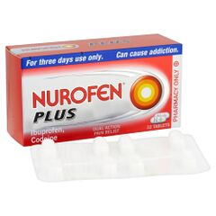
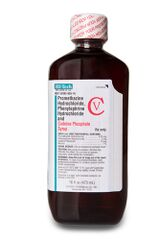

[◀返回](./home.md)

# 可待因 (Codeine)

<mark> 不错</mark>

*   **⚠️ 致命的[药物过量](../文档/药物过量.md)可能会在[阿片类药物](../文档/药物分类/阿片类药物.md)与其他[抑制剂](../文档/药物分类/抑制剂.md)联用时发生，例如[苯二氮卓类物质](../文档/药物分类/苯二氮卓类物质.md)、[巴比妥类物质](../文档/药物分类/巴比妥类物质.md)、[加巴喷丁类物质](../文档/药物分类/加巴喷丁类物质.md)、[噻吩二氮卓类物质](../文档/药物分类/噻吩二氮卓类物质.md)、[酒精](./酒精.md)或其他[GABA能物质](../文档/药物分类/抑制剂.md)。[\[1\]](#cite_note-tripsit-1)**

强烈不建议联用这些物质，特别是在[中等](../文档/药物剂量分类.md#Common)至[严重](../文档/药物剂量分类.md#Heavy)剂量下。

| 可待因 | |
| --- | --- |
|  | |
| 化学命名法 | |
| 俗名 | *Codeine, Lean, Purple Drank, Syrup* |
| 取代名称 | *3\-methylmorphine* |
| 系统命名法 | *(5α,6α)\-7,8\-Didehydro\-4,5\-epoxy\-3\-methoxy\-17\-methylmorphinan\-6\-ol* |
| 类别归属 | |
| 精神活性类别 | *[阿片类药物](../文档/药物分类/阿片类药物.md)* |
| 化学类别 | *[吗啡喃类物质](../文档/药物分类/吗啡喃类物质.md)* |
| [给药途径](../文档/给药途径.md) | |
| **警告：** 由于个体体重、耐受性、代谢和个人敏感度的差异，请务必从低剂量开始。[参见负责任的用药部分](../文档/负责任的用药索引页.md)。   | |
| **⇣ [抽吸](../文档/给药途径.md)** | |
| [给药剂量](../文档/给药剂量.md) | |
| [生物利用度](../文档/给药剂量.md) | 49.9 - 59.7%[\[2\]](#cite_note-2) |
| **⇣ [口服](../文档/给药途径.md)** | |
| [给药剂量](../文档/给药剂量.md) | |
| [阈值](../文档/药物剂量分类.md#Threshold) | 30 mg |
| [轻微](../文档/药物剂量分类.md#Light) | 50 - 100 mg |
| [中等](../文档/药物剂量分类.md#Common) | 100 - 150 mg |
| [强烈](../文档/药物剂量分类.md#Strong) | 150 - 200 mg |
| [严重](../文档/药物剂量分类.md#Heavy) | 200 mg + |
| **[药效时长](../文档/药效时长.md)** | |
| [总时长](../文档/药效时长.md#Total) | 3 - 6 小时 |
| [药效发作](../文档/药效时长.md#Onset) | 30 - 45 分钟 |
| [药效上升](../文档/药效时长.md#Come_up) | 1 - 2 小时 |
| [药效达峰](../文档/药效时长.md#Peak) | 3 - 5 小时 |
| [药效褪去](../文档/药效时长.md#Offset) | 2 - 4 小时 |
| **[免责声明](../关于本站/观前提醒.md)：** 本站的[给药剂量](../文档/给药剂量.md)信息收集自用户和[网络](../文档/科学信息索引页.md)，仅供教育目的。这并非推荐，应与其他来源核实以确保证准确性。 | |
| **[药物联用](#Dangerous_interactions)** | |
| 单胺氧化酶抑制剂 | **⛔ 严禁联用** |
| 氧化亚氮 | **⚠️ 谨慎联用** |
| PCP | **💔 联用危险** |
| 兴奋剂 | **💔 联用危险** |
| 酒精 | **⛔ 严禁联用** |
| 苯二氮卓类物质 | **⛔ 严禁联用** |
| 右美沙芬 | **⛔ 严禁联用** |
| GHB | **⛔ 严禁联用** |
| GBL | **⛔ 严禁联用** |
| 氯胺酮 | **💔 联用危险** |
| MXE | **💔 联用危险** |
| 曲马多 | **💔 联用危险** |
| 西柚 | **⚠️ 谨慎联用** |

**可待因**（Codeine，也被称为 **3-甲基吗啡**）是一种天然存在的[吗啡喃类](../文档/药物分类/吗啡喃类物质.md)[阿片类](../文档/药物分类/阿片类药物.md)物质，提取自罂粟，特别是*包鳞罂粟*。[\[3\]](#cite_note-3) [给药](../文档/给药途径.md)后，该组成员会产生[镇静](../药效/镇静.md)、[咳嗽抑制](../药效/咳嗽抑制.md)和[欣快感](../药效/躯体欣快感.md)等效应。

可待因是[鸦片](../文档/药物分类/阿片类药物.md)中含量第二高的[生物碱](../文档/药物分类/home.md)（高达 3%）。虽然可待因可以从天然来源提取，但半合成工艺是药用可待因的主要来源。它被认为是弱至中效[阿片类药物](../文档/药物分类/阿片类药物.md)（如[曲马多](#Dangerous_interactions)、[右丙氧芬](../文档/药物分类/阿片类药物.md)、[二氢可待因](./二氢可待因.md)和[氢可酮](../文档/药物分类/阿片类药物.md)）的原型。

目前，可待因是世界上使用最广泛的阿片类药物，[\[4\]](#cite_note-4)[\[5\]](#cite_note-5) 根据包括世界卫生组织及其前身国际联盟在内的众多组织的报告，它也是总体上最常用的药物之一。它是最有效的口服阿片类镇痛药之一，具有较宽的安全范围。

在娱乐用途中，它通常包含在非处方止痛药中购买，这些止痛药将其与毒性更大的物质混合。可以使用[冷水萃取术](../文档/冷水萃取术.md)分离这些物质。

目录
--------

*   [1 化学](#Chemistry)
*   [2 药理学](#Pharmacology)
    *   [2.1 结合亲和力 (Ki)\[9\]](#Binding_affinities_.28Ki.29.5B9.5D)
*   [3 主观效应](#Subjective_effects)
    *   [3.1 **躯体效应**](#Physical_effects)
    *   [3.2 **认知效应**](#Cognitive_effects)
    *   [3.3 **视觉效应**](#Visual_effects)
        *   [3.3.1 抑制](#Suppressions)
        *   [3.3.2 幻觉状态](#Hallucinatory_States)
    *   [3.4 体验报告](#Experience_reports)
*   [4 常见形式](#Common_forms)
*   [5 毒性和危害潜力](#Toxicity_and_harm_potential)
    *   [5.1 耐受性和成瘾潜力](#Tolerance_and_addiction_potential)
    *   [5.2 危险的相互作用](#Dangerous_interactions)
*   [6 法律地位](#Legal_status)
*   [7 另见](#See_also)
*   [8 外部链接](#External_links)
*   [9 文献](#Literature)
*   [10 参考文献](#References)

化学
---------

可待因，或称 3-甲基吗啡，是吗啡喃类的一种阿片类药物。可待因和该类其他分子的核心包含三个苯环，以称为菲的锯齿状模式融合。第四个含氮环与菲融合在 R9 和 R13 处，氮成员位于组合结构的 R17 处。这种结构称为吗啡喃。可待因（与其他吗啡喃一样）在其两个环之间包含一个醚桥，通过一个氧基团连接 R4 和 R5。它包含一个结合在 R6 处的羟基 (OH-) 和一个位于 R17 氮原子上的甲基。

在含有羟基的同一个环上，可待因包含一个[二氢可待因](./二氢可待因.md)所缺乏的双键。可待因与吗啡密切相关，因为两者都在 R3 处包含一个氧基团，但可待因中的这个氧基团被一个甲基取代（形成甲氧基）。可待因与其他吗啡喃类似，包括[二氢可待因](./二氢可待因.md)、[海洛因](./海洛因.md)、[乙基吗啡](./乙基吗啡.md)、[氢可酮](../文档/药物分类/阿片类药物.md)和[羟考酮](./羟考酮.md)。

药理学
------------

可待因本身不具有中枢活性，必须首先通过细胞色素 P450 酶 CYP2D6 的首过代谢转化为[吗啡](./吗啡.md)（因此，它是吗啡的[前药](../文档/药物前药.md)）。可待因也通过 CYP3A4 酶系统代谢为无活性的去甲可待因。两种生成的异构体都由 UGT2B7 结合成相应的 3-葡萄糖苷酸。

一部分人群产生的 CYP2D6 酶较少，因此与普通人相比，体验到的可待因效果显著降低。然而，其他人产生的 CYP2D6 酶数量较多，这可能导致对药物的超敏反应。一些增强[阿片类药物](../文档/药物分类/阿片类药物.md)的方法，例如在服用前全天饮用西柚汁，会抑制 CYP3A4 酶。[\[6\]](#cite_note-6) 这导致较少的可待因转化为去甲可待因，从而留下更多可待因代谢为吗啡。这也表明，如果用户在摄入可待因之前服用抗组胺药如[苯海拉明](./苯海拉明.md)，将导致缺乏将可待因代谢为吗啡的能力。[\[7\]](#cite_note-7)

个人在一次使用过程中，通过酶代谢转化为吗啡的可待因量存在上限。这个限制通常被称为“天花板剂量”，通常被认为在 400mg 左右。服用更高剂量会导致更严重的副作用，如[瘙痒感](../药效/瘙痒感.md)和[恶心](../药效/恶心.md)，但不会增加[欣快感](../药效/躯体欣快感.md)。

可待因的活性代谢物，尤其是[吗啡](./吗啡.md)，通过结合并激活[阿片](../文档/药物分类/阿片类药物.md)受体，主要是[μ-阿片](../文档/药物分类/阿片类药物.md)[受体](../文档/受体激动剂.md)来发挥作用。[\[8\]](#cite_note-8) 这是因为阿片类药物在结构上模仿天然存在于体内的[内源性](../文档/药物分类/home.md)内啡肽，它们同样作用于 μ-阿片受体组。阿片类药物在结构上模仿这些天然内啡肽的方式导致了它们的[欣快感](../药效/躯体欣快感.md)、[镇痛](../药效/镇痛.md)、[肌肉松弛](../药效/肌肉松弛.md)和[抗焦虑](../药效/镇静.md)效应。这是因为内啡肽负责减少疼痛、引起睡意和快感。它们可以在应对疼痛、剧烈运动、性高潮或一般兴奋时释放。

可待因本身是阿片受体的弱配体。然而，其主要的活性代谢物[吗啡](./吗啡.md)显示出更强的激动效应。

### 结合亲和力 (Ki)[\[9\]](#cite_note-9)

*   Mu 阿片受体激动剂 - 589 nM
*   Kappa 阿片受体激动剂 - 18061 nM
*   Delta 阿片受体激动剂 - 11442 nM

主观效应
------------------

***免责声明：** 下列效应参考自[***主观效应索引***](../文档/药物分类/home.md) (**SEI**)，这是一个基于众多用户报告和[PsychonautWiki](../文档/科学信息索引页.md)贡献者个人分析的开放研究文献。因此，应带着健康的怀疑态度来看待这些内容。*

*同样值得注意的是，这些效应不一定会以一种可预测或可靠的方式发生，尽管更高的剂量更可能诱发全方位的效应。*同样，**不良反应**随着剂量的增加而变得越来越可能，并且可能包括**成瘾、严重伤害或死亡*** ☠。

### **躯体效应**

*   可待因的总体精神状态被许多人描述为欣快、放松、焦虑抑制和疼痛缓解。

    *   **[镇痛](../药效/镇痛.md)**
    *   **[躯体欣快感](../药效/躯体欣快感.md)** - 与[吗啡](./吗啡.md)或[二乙酰吗啡](./海洛因.md)（海洛因）相比，这种物质的躯体欣快感被认为不那么强烈，因为通过代谢转化为其活性形式的量有上限。这种感觉本身可以描述为极度的身体舒适、温暖和幸福感，传遍全身。
    *   **[瘙痒感](../药效/瘙痒感.md)** - 与其他[阿片类药物](../文档/药物分类/阿片类药物.md)相比，这种化合物由于组胺释放量更高，会导致更严重的瘙痒感。
    *   **[呼吸抑制](../药效/呼吸抑制.md)** - 在低至中等剂量下，这种效应导致呼吸轻度至中度减慢的感觉，但不会引起明显的损伤。在高剂量和过量服用时，阿片类药物引起的呼吸抑制会导致呼吸急促、呼吸模式异常、半意识或无意识。严重的过量服用如果没有立即的医疗关注，可能导致昏迷或死亡。
    *   **[镇静](../药效/镇静.md)** - 在较高剂量下，这种化合物会导致镇静感，并且比[羟考酮](./羟考酮.md)和[氢可酮](../文档/药物分类/阿片类药物.md)更具镇静作用。
    *   **[食欲抑制](../药效/食欲抑制.md)**
    *   **[便秘](../药效/便秘.md)**
    *   **[咳嗽抑制](../药效/咳嗽抑制.md)**
    *   **[性欲减退](../药效/性欲减退.md)**
    *   **[排尿困难](../药效/排尿困难.md)**
    *   **[恶心](../药效/恶心.md)** - 这种效应更可能发生在高剂量下和/或用户没有适当控制节奏时。
    *   **[性高潮抑制](../药效/性高潮抑制.md)**
    *   **[瞳孔缩小](../药效/瞳孔缩小.md)**

### **认知效应**

*   *   **[认知欣快感](../药效/认知效应.md)** - 与[吗啡](./吗啡.md)或[二乙酰吗啡](./海洛因.md)（海洛因）相比，这种物质的认知欣快感被认为不那么强烈，因为通过代谢转化为其活性形式的量有上限。然而，在低耐受性的情况下使用较重剂量，它仍然能够产生极端的强度和压倒性的幸福感。这种感觉本身可以描述为一种强大且压倒性的情感幸福、满足和快乐的感觉。
    *   **[焦虑抑制](../药效/镇静.md)**
    *   **[思维减速](../药效/认知效应.md)**
    *   **[强迫性重复用药](../药效/认知效应.md)** - 值得注意的是，重复服用可待因不会放大其效应的强度。
    *   **[做梦增强](../文档/药物分类/促梦剂.md)**
    *   **[睡意](../药效/镇静.md)**

### **视觉效应**

*   #### 抑制
    *   **[复视](../药效/复视.md)** - 在高剂量下，眼睛会无法控制地失焦和重新聚焦。这会产生模糊效果和复视，无论视线聚焦在哪里都会出现。这可能非常强烈，以至于无法阅读或驾驶。
    #### 幻觉状态
    *   **[内部幻觉](../药效/视觉效应.md)** - 在重剂量“点头”（nodding）期间，人们可能会经历半意识和入睡前幻觉状态，导致类似梦境的状态和高达 3 级的图像。这通常伴随着定义不清的几何图形。

### 体验报告

目前的[体验索引](../文档/科学信息索引页.md)中没有描述该化合物效应的轶事报告。其他的体验报告可以在这里找到：

*   [Erowid Experience Vaults: Codeine](https://www.erowid.org/experiences/subs/exp_Codeine.shtml)

常见形式
------------

可待因在世界各地的药店有多种形式，通常与其他产品混合，如果在较高剂量下食用，这些产品可能是危险的甚至致命的。这样做是为了作为一种威慑，防止其娱乐用途，但可以通过使用[冷水萃取术](../文档/冷水萃取术.md)轻松规避。

*   

    Co-codamol 每 8mg 可待因含有 500mg 对乙酰氨基酚。它可以在任何英国药房的柜台后买到。

*   

    Nurofen plus 含有 12.8mg 可待因和布洛芬。它可以在任何英国药房的柜台后买到。由于可待因含量高于 Co-codamol，它们更适合[冷水萃取术](../文档/冷水萃取术.md)。

*   

    许多处方强度的止咳糖浆含有可待因和异丙嗪——一种抗组胺药。当用于娱乐时，它们通常被称为 lean 或 *[purple drank](https://en.wikipedia.org/wiki/Purple_drank)*。

毒性和危害潜力
---------------------------

相对于剂量，可待因的毒性较低。与所有阿片类药物一样，长期影响各不相同，但可能包括性欲减退、冷漠和记忆力减退。有些人也可能对可待因产生过敏反应，如皮肤肿胀和皮疹。[\[10\]](#cite_note-10) 当与[酒精](./酒精.md)或[苯二氮卓类物质](../文档/药物分类/苯二氮卓类物质.md)等[抑制剂](../文档/药物分类/抑制剂.md)混合时，也可能因[呼吸抑制](../药效/呼吸抑制.md)而致命。

强烈建议在使用这种药物时采取[伤害减少措施](../文档/负责任的用药索引页.md)。

### 耐受性和成瘾潜力

与其他[阿片类药物](../文档/药物分类/阿片类药物.md)一样，长期使用可待因可被视为具有中度成瘾性，滥用潜力高，并且能够导致某些使用者产生心理依赖。当成瘾形成后，如果一个人突然停止使用，可能会出现渴望和[戒断症状](../文档/药物戒断反应.md)。

随着长期和重复使用，对可待因许多效应的耐受性会发展。这种发展的速度对于不同的效应是不同的，例如对便秘诱导效应的耐受性发展特别缓慢。这导致使用者必须服用越来越大的剂量才能达到相同的效果。之后，大约需要 3 - 7 天耐受性才能减半，1 - 2 周才能恢复到基线（在没有进一步摄入的情况下）。可待因与所有其他[阿片类药物](../文档/药物分类/阿片类药物.md)存在交叉耐受性，这意味着在服用可待因后，所有[阿片类药物](../文档/药物分类/阿片类药物.md)的效果都会降低。

### 危险的相互作用

***警告：*** *许多单独使用时相当安全的精神活性物质，当与某些其他物质结合使用时，可能会突然变得危险甚至危及生命。以下列表列出了一些已知的危险相互作用（尽管不保证包括所有相互作用）。*

*务必进行独立研究（例如 [Google](https://www.google.com), [DuckDuckGo](https://www.duckduckgo.com), [PubMed](https://pubmed.ncbi.nlm.nih.gov/)）以确保两种或多种物质的组合可以安全食用。部分列出的相互作用来自 [TripSit](https://combo.tripsit.me)。*

*   **[酒精](./酒精.md)** - 两种物质都会增强另一种物质引起的共济失调和镇静作用，在高剂量下可能导致意外的意识丧失。将受影响的患者置于[恢复体位](../文档/恢复体位.md)，以防止因过量呕吐吸入而窒息。记忆断片很常见。
*   **[兴奋剂](../文档/药物分类/兴奋剂.md)** - 兴奋剂会增加呼吸频率，从而允许使用比平时更高剂量的阿片类药物。如果兴奋剂先失效，阿片类药物可能会压倒使用者并导致呼吸停止。
*   **[苯二氮卓类物质](../文档/药物分类/苯二氮卓类物质.md)** - 中枢神经系统和/或呼吸抑制作用可能会叠加或协同出现。这两种物质会强烈且不可预测地相互增强，非常迅速地导致意识丧失。在无意识状态下，如果没有置于[恢复体位](../文档/恢复体位.md)，呕吐吸入是一个风险，断片/记忆丧失很常见。
*   **[右美沙芬](./右美沙芬.md)** - 通常被认为是有毒的。已观察到中枢神经系统抑制、呼吸困难、心脏问题和肝脏毒性。此外，如果一个人服用右美沙芬，他们对阿片类药物的耐受性会略微降低，从而导致额外的协同效应。
*   **GHB**/**GBL** - 这两种物质会强烈且不可预测地相互增强，非常迅速地导致意识丧失。在无意识状态下，如果没有置于[恢复体位](../文档/恢复体位.md)，呕吐吸入是一个风险。
*   **[氯胺酮](./氯胺酮.md)** - 两种物质都带来呕吐和意识丧失的风险。如果使用者在受影响时失去知觉，如果没有被置于[恢复体位](../文档/恢复体位.md)，则存在严重的呕吐吸入风险。
*   **[单胺氧化酶抑制剂](../文档/单胺氧化酶抑制剂.md)** - 单胺氧化酶抑制剂 (MAOIs) 与某些阿片类药物合用与罕见的严重不良反应报告有关。似乎有两种类型的相互作用，一种是兴奋性的，一种是抑制性的。兴奋性反应的症状可能包括激越、头痛、多汗、高热、潮红、战栗、肌阵挛、僵硬、震颤、腹泻、高血压、心动过速、癫痫发作和昏迷。在某些情况下已发生死亡。
*   **MXE** - MXE 可以增强阿片类药物的效应，但也会增加呼吸抑制和器官毒性的风险。
*   **[氧化亚氮](./氧化亚氮.md)** - 两种物质都会增强另一种物质引起的共济失调和镇静作用，在高剂量下可能导致意外的意识丧失。在无意识状态下，如果没有置于[恢复体位](../文档/恢复体位.md)，呕吐吸入是一个风险。记忆断片很常见。
*   **[PCP](./PCP.md)** - PCP 可能会降低阿片类药物的耐受性，增加过量服用的风险。
*   **[曲马多](#Dangerous_interactions)** - 增加癫痫发作的风险。曲马多本身已知会诱发癫痫发作，并且可能与其他阿片类药物在癫痫发作阈值上产生相加效应。中枢神经系统和/或呼吸抑制作用可能会叠加或协同出现。
*   **西柚** - 虽然西柚不具精神活性，但它可能会影响某些阿片类药物的代谢。曲马多、羟考酮和芬太尼主要由酶 CYP3A4 代谢，该酶被西柚汁强效抑制[\[11\]](#cite_note-Ershad2020-11)。这可能导致药物需要更长时间才能从体内清除。重复给药可能会增加毒性。美沙酮也可能受到影响[\[11\]](#cite_note-Ershad2020-11)。可待因和氢可酮由 CYP2D6 代谢。服用抑制 CYP2D6 的药物或由于基因突变而缺乏该酶的人对可待因没有反应，因为它无法代谢为其活性产物：吗啡。

法律地位
------------

*   **澳大利亚：** 在澳大利亚，当与其他物质混合时，可待因制剂属于附表 4（仅限处方）药物[\[12\]](#cite_note-12)。含有纯可待因的制剂（例如，磷酸可待因片或磷酸可待因糖浆）可凭处方获得，并被视为附表 8（受控药物（未经授权持有即为非法））[\[13\]](#cite_note-13)。附表 8 药物是可以开处方的药物，但受到严格限制以防止滥用和依赖[\[14\]](#cite_note-14)。未经授权持有附表 8 药物属于刑事犯罪，可能会根据起诉州的不同而受到不同的惩罚。
*   **奥地利：** 根据 AMG (Arzneimittelgesetz Österreich)，可待因用于医疗用途是合法的，而根据 SMG (Suchtmittelgesetz Österreich)，在没有处方的情况下销售或持有是非法的。[\[15\]](#cite_note-15)
*   **加拿大：** 在加拿大，可待因可在以下限制下的复方片剂中非处方购买：每个剂量单位不超过 8 毫克，并且必须与至少两种其他活性成分混合。它被保存在柜台后面，根据要求出售——通常是卖给 18 岁及以上的人——经过简短咨询并由药剂师自行决定。其他最常见的活性成分包括另一种非阿片类镇痛药（300 毫克对乙酰氨基酚，如 Tylenol No. 1；或 325 毫克阿司匹林，如 222s）和 15 毫克咖啡因。含有布洛芬的 OTC 片剂通常无法获得。每个剂量单位可待因含量高于 8 毫克或少于两种其他活性成分的制剂需凭处方购买。
*   **丹麦：** 在丹麦，可待因非处方出售，混合物中最大含量为 9.6 毫克。该物品在柜台出售，无需处方。含有可待因的最强非处方制剂含有 9.6 毫克（含阿司匹林，商品名 Kodimagnyl）；任何更强的药物都需要处方才能合法持有。
*   **芬兰：** 在芬兰，最大强度为 1mg/ml 的可待因止咳糖浆可在药店非处方出售。没有处方无法获得片剂形式的可待因。任何更强的止咳糖浆和复方止痛药（可待因与对乙酰氨基酚或布洛芬，如 Panacod、Co-codamol 和 Ardinex）都需要处方。
*   **法国：** 在法国，大多数含有可待因的制剂不需要医生处方。含有可待因的产品示例包括 Néocodion（止咳药和糖浆）、Codoliprane（可待因与对乙酰氨基酚）、Prontalgine 和 Migralgine（可待因、对乙酰氨基酚和咖啡因）。[\[16\]](#cite_note-16) 自 2017 年“卫生部长”Agnès Buzyn 做出决定后，可待因成为受监管/受控物质（附表 2），因此现在仅限处方药，且不再提供纯可待因原料。最常见的处方可待因品牌是 Klipal 和 Codoliprane，两者都大量混合了对乙酰氨基酚。Klipal 是最强的比例，50mg 可待因对应 600mg 对乙酰氨基酚。
*   **德国：** 根据 BtMG 的 Anlage III，可待因是受控物质。它只能通过麻醉品处方形式开具。对于含有高达 2.5% 或每单位 100mg 可待因的制剂有一个例外，如果没有开给酒精或药物依赖者，可以用常规处方开具。[\[17\]](#cite_note-17)
*   **希腊：** 可待因在希腊被归类为非法药物，拥有它的个人可能会被逮捕，即使他们在另一个国家被合法开具了处方。它只能凭医生处方出售。[\[18\]](#cite_note-18)
*   **香港：** 在香港，可待因受香港法例第 134 章《危险药物条例》附表 1 监管。它只能由卫生专业人员合法使用以及用于大学研究目的。该物质可由药剂师根据处方给予。然而，持牌药剂师无需处方即可提供剂量高达 0.1% 的可待因。[\[19\]](#cite_note-19)
*   **冰岛：** 对乙酰氨基酚和可待因的制剂在冰岛需要处方。
*   **印度：** 可待因制剂在印度需要处方。对乙酰氨基酚和可待因的制剂在印度有售。可待因也以磷酸可待因的形式存在于各种止咳糖浆中。
*   **伊朗：** 伊朗的可待因制剂通常含有对乙酰氨基酚，但可以非处方购买。伊朗卫生部副部长报告说，可待因是伊朗最畅销的非处方药。可待因的娱乐性使用在伊朗也已变得普遍，但当局继续允许未经医生许可购买可待因，尽管药剂师可能会要求购买者出示身份证明以验证他们已年满 18 岁。
*   **爱尔兰：** 可待因仍然是一种半非处方、柜台销售药物，每片上限为 12.8 毫克，但可待因产品必须在公众视线之外。含有超过 12.8 毫克可待因的产品仅限处方。
*   **意大利：** 可待因片剂或制剂在意大利需要处方。对乙酰氨基酚和可待因的制剂在意大利以 Co-Efferalgan 和 Tachidol 的形式出售。
*   **日本：** 可待因和类似的中级中枢作用剂与非阿片类镇痛药、抗组胺药、维生素、惰性胃肠道剂如高岭土和果胶、温和泻药、抗酸剂和草药制剂混合，可以非处方购买，OTC 配发的上限为 10 毫克。
*   **马尔代夫：** 马尔代夫对药物采取极其严格的立场，对于许多常见药物，除非你有公证和认证的医生处方，否则禁止任何含有可待因的药物。违反规定的游客，即使是无意的，也会被驱逐出境或监禁。
*   **波兰：** 可待因被列在“Wykaz środków odurzających i substancji psychotropowych”的“II-N”组中，这意味着它用于科学和医疗目的是合法的，并且可以以 15mg 的剂量与 500mg 对乙酰氨基酚（Antidol）或 300mg 磺基愈创木酚（Thiocodin）混合非处方购买。但是，如果药店工作人员认为客户是未成年人或想将其用于药物滥用目的，他们可以拒绝出售。[\[20\]](#cite_note-20) [\[21\]](#cite_note-21)
*   **罗马尼亚：** 可待因 OTC 出售（当与另一种活性成分混合时），每片可待因的限制为 12.8mg，这见于 Nurofen Plus。任何超过 12.8mg/单位的量都需要处方，无论它是否含有另一种成分。
*   **俄罗斯：** 根据 ITAR-Tass 和奥地利新闻社的报道，由于发现地下二氢脱氧吗啡（鳄鱼毒品）合成方法，2012 年全国范围内取消了可待因产品的 OTC 供应。
*   **西班牙：** 可待因片剂或制剂在西班牙需要处方，但这通常不被执行，许多药店会在没有处方要求的情况下出售可待因产品。
*   **斯里兰卡：** 可待因制剂作为非处方药在斯里兰卡有售。最常见的制剂是 Panadeine，含有 500 毫克对乙酰氨基酚和 8 毫克可待因。
*   **瑞典：** 根据瑞典法律，可待因属于附表 III，这意味着它受到严格监管，仅出售给持有处方的人。
*   **瑞士：** 可待因是 Verzeichnis A 中特别指定的受控物质。允许用于医疗用途。一些含有可待因的制剂包含在 Verzeichnis C 中，而某些则被排除在外。[\[22\]](#cite_note-22)
*   **土耳其：** 可待因是一种仅限“红色处方”的物质[\[23\]](#cite_note-23)，在没有处方的情况下销售或持有是非法的。
*   **阿拉伯联合酋长国：** 阿联酋对药物采取极其严格的立场，对于许多常见药物，特别是任何含有可待因的药物，除非你有公证和认证的医生处方，否则禁止使用。违反规定的游客，即使是无意的，也会被驱逐出境或监禁。美国驻阿联酋大使馆维护着一份[非官方清单](http://abudhabi.usembassy.gov/restricted_medication.html)，列出了不得进口的物品。
*   **英国：** 根据 1971 年滥用药物法，可待因是 B 类受控物质，当制备用于注射时是 A 类药物。[\[24\]](#cite_note-24) 未经处方持有受控物质属于刑事犯罪。[\[25\]](#cite_note-25) 然而，根据 2001 年滥用药物法规附表 5，某些可待因制剂不受此限制。因此，只要可待因与至少一种其他活性或非活性成分复方，且每片、胶囊等的剂量不超过 100 毫克或液体制剂浓度不超过 2.5%，未经处方持有可待因是合法的。
*   **美国：** 在美国，可待因受受控物质法监管。联邦法律规定，当用于仅含可待因或每个剂量单位超过 90 毫克的止痛产品时，可待因是附表 II 受控物质。用于止痛的可待因与阿司匹林或对乙酰氨基酚（扑热息痛/泰诺）复方的片剂被列为附表 III；止咳糖浆视配方而定，属于附表 III 或 V。

另见
--------

*   [负责任的用药](../文档/负责任的用药索引页.md)
*   [止痛药阿片类药物提取术](../文档/止痛药阿片类药物提取术.md)
*   [抑制剂](../文档/药物分类/抑制剂.md)
*   [羟考酮](./羟考酮.md)
*   [卡痛叶](../文档/药物/卡痛叶.md) (此处原文为Kratom，翻译为卡痛叶，文件树中暂无，按规则归入药物)

外部链接
--------------

*   [Codeine (Wikipedia)](https://en.wikipedia.org/wiki/Codeine)
*   [Codeine (Erowid Vault)](https://erowid.org/pharms/codeine/codeine.shtml)
*   [Codeine (Isomer Design)](https://isomerdesign.com/PiHKAL/explore.php?id=9293)
*   [Codeine (DrugBank)](https://go.drugbank.com/drugs/DB00318)
*   [Codeine (Drugs.com)](https://www.drugs.com/codeine.html)
*   [Codeine (Drugs-Forum)](https://drugs-forum.com/wiki/Codeine)

文献
----------

*   Friswell J, Phillips C, Holding J, Morgan CJ, Brandner B, Curran HV. (2008). Acute effects of opioids on memory functions of healthy men and women. Psychopharmacology (Berl.). 198 (2): 243–50. <https://doi.org/10.1007/s00213-008-1123-x>.
*   Schmidt, H., Vormfelde, S. V., Klinder, K., Gundert-Remy, U., Gleiter, C. H., Skopp, G., Aderjan, R. and Fuhr, U. (2002), Affinities of Dihydrocodeine and its Metabolites to Opioid Receptors. Pharmacology & Toxicology, 91: 57–63. <https://doi.org/10.1034/j.1600-0773.2002.910203.x>
*   Koch T, Höllt V. (2008). Role of receptor internalization in opioid tolerance and dependence. Pharmacol. Ther. 117 (2): 199–206. <https://doi.org/10.1016/j.pharmthera.2007.10.003>
*   Pert, C. B., Pasternak, G., & Snyder, S. H. (1973). Opiate Agonists and Antagonists Discriminated by Receptor Binding in Brain. Science, 182 (4119), 1359-1361. <https://doi.org/10.1126/science.182.4119.1359>
*   Stefano GB, Ptáček R, Kuželová H, Kream RM. (2012). Endogenous morphine: up-to-date review (2011). Folia Biol. (Praha). 58 (2): 49–56. PMID 22578954.

参考文献
==========

1.  [↑](#cite_ref-tripsit_1-0) [*Risks of Combining Depressants - TripSit*](https://tripsit.me/combining-depressants/) 
2.  [↑](#cite_ref-2) Hull, J. H., Findlay, J. W., Rogers, J. F., Welch, R. M., Butz, R. F., Bustrack, J. A. (November 1982). "An evaluation of the effects of smoking on codeine pharmacokinetics and bioavailability in normal human volunteers". *Drug Intelligence & Clinical Pharmacy*. **16** (11): 849–854. [doi](http://en.wikipedia.org/wiki/Digital_object_identifier "wikipedia:Digital object identifier"):[10.1177/106002808201601107](//doi.org/10.1177%2F106002808201601107). [ISSN](http://en.wikipedia.org/wiki/International_Standard_Serial_Number "wikipedia:International Standard Serial Number") [0012-6578](//www.worldcat.org/issn/0012-6578). 
3.  [↑](#cite_ref-3) Dicpinigaitis, P. V., Morice, A. H., Birring, S. S., McGarvey, L., Smith, J. A., Canning, B. J., Page, C. P. (April 2014). Sibley, D. R., ed. ["Antitussive Drugs—Past, Present, and Future"](http://pharmrev.aspetjournals.org/lookup/doi/10.1124/pr.111.005116). *Pharmacological Reviews*. **66** (2): 468–512. [doi](http://en.wikipedia.org/wiki/Digital_object_identifier "wikipedia:Digital object identifier"):[10.1124/pr.111.005116](//doi.org/10.1124%2Fpr.111.005116). [ISSN](http://en.wikipedia.org/wiki/International_Standard_Serial_Number "wikipedia:International Standard Serial Number") [0031-6997](//www.worldcat.org/issn/0031-6997). 
4.  [↑](#cite_ref-4) [*Codeine General Information*](https://www.opiates.com/codeine/) 
5.  [↑](#cite_ref-5) [*Unlocking the opium poppy’s biggest secret: Genes that make codeine, morphine*](https://www.sciencedaily.com/releases/2010/03/100314150916.htm) 
6.  [↑](#cite_ref-6) Girennavar, B., Jayaprakasha, G. K., Patil, B. S. (October 2007). "Potent inhibition of human cytochrome P450 3A4, 2D6, and 2C9 isoenzymes by grapefruit juice and its furocoumarins". *Journal of Food Science*. **72** (8): C417–421. [doi](http://en.wikipedia.org/wiki/Digital_object_identifier "wikipedia:Digital object identifier"):[10.1111/j.1750-3841.2007.00483.x](//doi.org/10.1111%2Fj.1750-3841.2007.00483.x). [ISSN](http://en.wikipedia.org/wiki/International_Standard_Serial_Number "wikipedia:International Standard Serial Number") [1750-3841](//www.worldcat.org/issn/1750-3841). 
7.  [↑](#cite_ref-7) Lurcott, G. (1998). ["The effects of the genetic absence and inhibition of CYP2D6 on the metabolism of codeine and its derivatives, hydrocodone and oxycodone"](https://www.ncbi.nlm.nih.gov/pmc/articles/PMC2148980/). *Anesthesia Progress*. **45** (4): 154–156. [ISSN](http://en.wikipedia.org/wiki/International_Standard_Serial_Number "wikipedia:International Standard Serial Number") [0003-3006](//www.worldcat.org/issn/0003-3006). 
8.  [↑](#cite_ref-8) Thompson, C. M., Wojno, H., Greiner, E., May, E. L., Rice, K. C., Selley, D. E. (1 February 2004). ["Activation of G-Proteins by Morphine and Codeine Congeners: Insights to the Relevance of O- and N-Demethylated Metabolites at μ- and δ-Opioid Receptors"](https://jpet.aspetjournals.org/content/308/2/547). *Journal of Pharmacology and Experimental Therapeutics*. **308** (2): 547–554. [doi](http://en.wikipedia.org/wiki/Digital_object_identifier "wikipedia:Digital object identifier"):[10.1124/jpet.103.058602](//doi.org/10.1124%2Fjpet.103.058602). [ISSN](http://en.wikipedia.org/wiki/International_Standard_Serial_Number "wikipedia:International Standard Serial Number") [0022-3565](//www.worldcat.org/issn/0022-3565). 
9.  [↑](#cite_ref-9) Schmidt, H., Vormfelde, S. V., Klinder, K., Gundert-Remy, U., Gleiter, C. H., Skopp, G., Aderjan, R., Fuhr, U. (August 2002). ["Affinities of Dihydrocodeine and its Metabolites to Opioid Receptors: DIHYDROCODEINE BINDING TO OPIOID RECEPTORS"](http://doi.wiley.com/10.1034/j.1600-0773.2002.910203.x). *Pharmacology & Toxicology*. **91** (2): 57–63. [doi](http://en.wikipedia.org/wiki/Digital_object_identifier "wikipedia:Digital object identifier"):[10.1034/j.1600-0773.2002.910203.x](//doi.org/10.1034%2Fj.1600-0773.2002.910203.x). [ISSN](http://en.wikipedia.org/wiki/International_Standard_Serial_Number "wikipedia:International Standard Serial Number") [0901-9928](//www.worldcat.org/issn/0901-9928). 
10. [↑](#cite_ref-10) <http://www.drugs.com/codeine.html>
11. ↑ [11.0](#cite_ref-Ershad2020_11-0) [11.1](#cite_ref-Ershad2020_11-1) Ershad, M., Cruz, M. D., Mostafa, A., Mckeever, R., Vearrier, D., Greenberg, M. I. (March 2020). ["Opioid Toxidrome Following Grapefruit Juice Consumption in the Setting of Methadone Maintenance"](https://journals.lww.com/10.1097/ADM.0000000000000535). *Journal of Addiction Medicine*. **14** (2): 172–174. [doi](http://en.wikipedia.org/wiki/Digital_object_identifier "wikipedia:Digital object identifier"):[10.1097/ADM.0000000000000535](//doi.org/10.1097%2FADM.0000000000000535). [ISSN](http://en.wikipedia.org/wiki/International_Standard_Serial_Number "wikipedia:International Standard Serial Number") [1932-0620](//www.worldcat.org/issn/1932-0620). 
12. [↑](#cite_ref-12) [*Poisons Standard October 2019*](https://www.legislation.gov.au/Details/F2019L01197/Html/Text#_Toc17278861) 
13. [↑](#cite_ref-13) [*Poisons Standard October 2019*](https://www.legislation.gov.au/Details/F2019L01197/Html/Text#_Toc17278865) 
14. [↑](#cite_ref-14) [*Poisons Standard October 2019*](https://www.legislation.gov.au/Details/F2019L01197/Html/Text#_Toc17278839) 
15. [↑](#cite_ref-15) ["Suchtgiftverordnung"](https://www.ris.bka.gv.at/GeltendeFassung.wxe?Abfrage=Bundesnormen&Gesetzesnummer=10011053). Government of Austria. Retrieved February 18, 2022. 
16. [↑](#cite_ref-16) [*Codéine : substance active à effet thérapeutique*](https://www.vidal.fr/medicaments/substances/codeine-1039.html) 
17. [↑](#cite_ref-17) [*Anlage III BtMG - Einzelnorm*](http://www.gesetze-im-internet.de/btmg_1981/anlage_iii.html) 
18. [↑](#cite_ref-18) <http://gogreece.about.com/od/planagreattriptogreece/a/greecepharmacy_2.htm>
19. [↑](#cite_ref-19) Laws of Hong Kong, Dangerous Drugs Ordinance, Chapter 134
20. [↑](#cite_ref-20) [*Wykaz środków odurzających i substancji psychotropowych*](https://pl.wikipedia.org/wiki/Wykaz_%C5%9Brodk%C3%B3w_odurzaj%C4%85cych_i_substancji_psychotropowych#Grupa_II-N) 
21. [↑](#cite_ref-21) [*Kodeina – Narkopedia*](https://narkopedia.org/Kodeina#Polska) 
22. [↑](#cite_ref-22) ["Verordnung des EDI über die Verzeichnisse der Betäubungsmittel, psychotropen Stoffe, Vorläuferstoffe und Hilfschemikalien"](https://www.admin.ch/opc/de/classified-compilation/20101220/index.html) (in German). Bundeskanzlei [Federal Chancellery of Switzerland]. Retrieved January 1, 2020. 
23. [↑](#cite_ref-23) KIRMIZI REÇETEYE TABİ İLAÇLAR | <https://www.titck.gov.tr/storage/Archive/2019/contentFile/K%C4%B1rm%C4%B1z%C4%B1%20Re%C3%A7eteye%20Tabi%20%C4%B0la%C3%A7lar%2005072019_ebcc7e92-6661-4983-870a-fe8983a9c2b7.pdf>
24. [↑](#cite_ref-24) [*Misuse of Drugs Act 1971*](https://www.legislation.gov.uk/ukpga/1971/38/schedule/2) 
25. [↑](#cite_ref-25) [*Misuse of Drugs Act 1971*](https://www.legislation.gov.uk/ukpga/1971/38/contents)