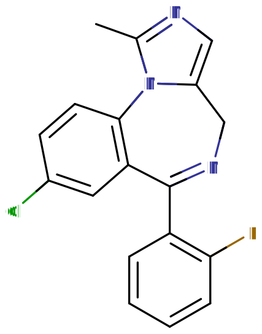

# 咪达唑仑

[◀返回](index.md)

!!! danger "联用危险"

    如果在服用[苯二氮卓类物质](../文档/药物分类/苯二氮卓类物质.md)的同时使用了其他[抑制剂](../文档/药物分类/抑制剂.md)（如[阿片类药物](../文档/药物分类/阿片类药物.md)、[巴比妥类物质](../文档/药物分类/巴比妥类物质.md)、[加巴喷丁类物质](../文档/药物分类/加巴喷丁类物质.md)、[噻吩二氮卓类物质](../文档/药物分类/噻吩二氮卓类物质.md)、[酒精](酒精.md)或其他 [GABA 类物质](../文档/GABA.md)），可能发生致命的[药物过量](../文档/药物过量.md)！[^1]

    我们强烈建议不要联用这些物质，特别是在[中等](../文档/药物剂量分类.md#中等)到[严重](../文档/药物剂量分类.md#严重)剂量下。

| **化学信息** | 咪达唑仑（Midazolam）                                                     |
| ------------ | ------------------------------------------------------------------------- |
| 结构式       |                                                 |
| 分子式       | C18H13ClFN3                              |
| CAS 号       | 59467-70-8                                                                |
| **化学命名** |                                                                           |
| 常用名称     | 咪达唑仑、Versed                                                          |
| 取代名称     | Midazolam                                                                 |
| 系统名称     | 8-Chloro-6-(2-fluorophenyl)-1-methyl-4H-imidazo[1,5-a][1,4]benzodiazepine |
| **类别归属** |                                                                           |
| 精神活性分类 | _[抑制剂](../文档/药物分类/抑制剂.md)_                                    |
| 化学分类     | _[苯二氮卓类物质](../文档/药物分类/苯二氮卓类物质.md)_                    |

| [**给药途径**](../文档/给药途径.md) | 🔽 [口服](../文档/给药途径.md#口服) | 🔽 [静脉注射](../文档/给药途径.md#静脉注射) |
| ----------------------------------- | ----------------------------------- | ------------------------------------------- |
| 生物利用度                          | 40%                                 |                                             |
| [**剂量**](../文档/给药剂量.md)     |                                     |                                             |
| 阈值                                | 1 mg                                | 1 mg                                        |
| 轻微                                | 2.5 - 5 mg                          | 1 - 2 mg                                    |
| 中等                                | 5 - 15 mg                           | 2 - 4 mg                                    |
| 强烈                                | 15 - 30 mg                          | 4 - 5 mg                                    |
| 严重                                | 30 mg +                             | 5 mg +                                      |
| [**药效时长**](../文档/药效时长.md) |                                     |                                             |
| 总时长                              | 2 - 4 小时                          | 2 - 6 小时                                  |
| 药效发作                            | 30 - 60 分钟                        | 4 - 6 分钟                                  |
| 药效上升                            | 30 - 60 分钟                        |                                             |
| 药效达峰                            | 1 - 2 小时                          | 1 - 4 小时                                  |
| 药效褪去                            | 1 - 2 小时                          | 0.5 - 1.5 小时                              |

- !!! warning "警告"

        由于个体体重、耐受性、新陈代谢和个人敏感度的差异，请务必从低剂量开始。参见[负责任的用药部分](../文档/负责任的用药索引页.md)。

    !!! info "[免责声明](../关于本站/免责声明.md)"

        本站的[给药剂量](../文档/给药剂量.md)信息收集自用户和[相关资源](../文档/科学信息索引页.md)，仅供教育目的使用。这不是医疗建议，应与其他来源核实以确保准确性。

**咪达唑仑**（商品名 **Versed**）是[苯二氮卓类](../文档/药物分类/苯二氮卓类物质.md)的一种[抑制剂](../文档/药物分类/抑制剂.md)。它作为一种 [GABA](../文档/GABA.md) [受体](../文档/受体拮抗剂.md) [激动剂](../文档/受体激动剂.md)发挥作用。

咪达唑仑于 1974 年获得专利，并于 1982 年投入医疗使用。[^2] 它用于麻醉、程序镇静、睡眠障碍、[癫痫发作](../药效/癫痫发作.md)和严重躁动。[^3] 它在世界卫生组织的基本药物清单上。[^4]

其[主观效应](../药效/index.md)包括[镇静](../药效/镇静.md)、[焦虑抑制](../药效/焦虑抑制.md)、[去抑制](../药效/去抑制.md)、[肌肉松弛](../药效/肌肉松弛.md)、[呼吸抑制](../药效/呼吸抑制.md)和中度的[欣快感](../药效/认知欣快.md)。它可以通过口服、静脉注射或肌肉注射给药。

此外，需要注意的是，对于大量或长期使用者来说，突然停用苯二氮卓类药物可能是危险的，甚至危及生命。因此，身体依赖这种物质的人建议通过在较长一段时间内逐渐降低每天的服用量来[减量](../文档/减量戒断法.md)，而不是突然停止使用。[^5]

## 化学

咪达唑仑盐酸盐是短效[苯二氮卓类](../文档/药物分类/苯二氮卓类物质.md)衍生物的盐酸盐，具有咪唑核心结构，使其成为咪唑苯二氮卓。它在 pH 小于 4 时溶于水，在生理 pH 下脂溶。咪达唑仑的 pKa 为 6.15，这允许制备水溶性盐。临床使用的咪达唑仑肠外溶液缓冲至 pH 3.5。[^6]

## 药理学

咪达唑仑对成人是一种短效苯二氮卓类药物，消除半衰期为 1.5 \~ 2.5 小时。[^7] 咪达唑仑代谢成活性代谢物 α1-羟基咪达唑仑。然而，咪达唑仑的活性代谢物很少，仅占咪达唑仑生物活性的 10%。咪达唑仑口服吸收差，只有 50% 的药物到达血液。[^8]

咪达唑仑由细胞色素 P450 (CYP) 酶和葡萄糖醛酸结合代谢。咪达唑仑的治疗和不良反应是其对 GABAA 受体作用的结果；咪达唑仑不直接激活 GABAA 受体，但与其他苯二氮卓类药物一样，它增强了神经递质 GABA 对 GABAA 受体的作用（增加 Cl-通道开放的频率），导致神经抑制。几乎所有的药代动力学特性都可以用苯二氮卓类药物对 GABAA 受体的作用来解释。

## 主观效应

出现咪达唑仑所致健忘副作用的人通常不知道他们的记忆受损，除非他们以前知道这是一种副作用。[^9] 长期使用苯二氮卓类药物与长期的记忆缺陷有关，并且在停止苯二氮卓类药物六个月后仅显示部分恢复。目前尚不清楚在更长时间的戒断后是否会完全恢复。苯二氮卓类药物可能会引起或加重抑郁症。苯二氮卓类药物偶尔会出现矛盾性兴奋，包括癫痫发作的恶化。[^9]

### 依赖性与滥用潜力

大约三分之一接受苯二氮卓类药物治疗超过 4 周的人会出现苯二氮卓类药物依赖，若减量过快，通常会导致耐受性和苯二氮卓类药物戒断综合征。咪达唑仑输注可能会在几天内诱导耐受性和戒断综合征。

依赖的风险因素包括依赖型人格、使用短效、高效力的苯二氮卓类药物以及长期使用。咪达唑仑的戒断症状可能从失眠和焦虑到癫痫发作和精神病。戒断症状有时可能类似于一个人的潜在疾病。

长期规律使用后逐渐减量咪达唑仑可以最大限度地减少戒断和反跳效应。耐受性和由此产生的戒断综合征可能是由于受体下调和 GABAA 受体基因表达的改变，这会导致 GABA 能神经元系统功能的长期变化。[^8]

### 药物过量

咪达唑仑过量被认为是医疗紧急情况，通常需要医务人员立即关注。健康个体的苯二氮卓类药物过量在适当的医疗支持下很少危及生命；然而，当它们与其他中枢神经系统抑制剂（如酒精、阿片类药物或三环类抗抑郁药）结合使用时，苯二氮卓类药物的毒性会增加。老年人、患有阻塞性肺病的人或静脉注射使用时，苯二氮卓类药物过量的毒性和死亡风险也会增加。

### 危险的药物联用

蛋白酶抑制剂、奈法唑酮、舍曲林、葡萄柚、氟西汀、红霉素、地尔硫卓、克拉霉素会抑制咪达唑仑的代谢，导致作用时间延长。圣约翰草、利福喷丁、利福平、利福布汀、苯妥英会增强咪达唑仑的代谢，导致作用减弱。镇静抗抑郁药、抗癫痫药（如苯巴比妥、苯妥英和卡马西平）、镇静抗组胺药、阿片类药物、抗精神病药和酒精会增强咪达唑仑的镇静作用。[^8]

圣约翰草会降低咪达唑仑的血液水平。葡萄柚汁会减少肠道 3A4，导致代谢减少和血浆浓度升高。

## 法律地位

- **瑞典**：咪达唑仑是处方药。
- **巴西**：咪达唑仑是处方药。
- **美国**：咪达唑仑是附表 IV 物质。

## 另见

- [负责任的用药](../文档/负责任的用药索引页.md)
- [抑制剂](../文档/药物分类/抑制剂.md)
- [苯二氮卓类物质](../文档/药物分类/苯二氮卓类物质.md)

## 外部链接

- [Midazolam (Wikipedia)](https://en.wikipedia.org/wiki/Midazolam)
- [Midazolam (Isomer Design)](https://isomerdesign.com/PiHKAL/explore.php?id=3023)
- [Midazolam (DrugBank)](https://go.drugbank.com/drugs/DB00683)
- [Midazolam (Drugs.com)](https://www.drugs.com/mtm/midazolam.html)

## 引用文献

[^1]: [_Risks of Combining Depressants - TripSit_](https://tripsit.me/combining-depressants/)

[^2]: Fischer, J., Ganellin, C. R. (2006). [_Analogue-based drug discovery_](http://public.ebookcentral.proquest.com/choice/publicfullrecord.aspx?p=481323). Wiley-VCH. [ISBN](http://en.wikipedia.org/wiki/International_Standard_Book_Number) [9783527607495](http://en.wikipedia.org/wiki/Special:BookSources/9783527607495)

[^3]: "Midazolam Hydrochloride". The American Society of Health-System Pharmacists. Archived from the original on 5 September 2015.

[^4]: World Health Organization (2019). World Health Organization model list of essential medicines: 21st list 2019. Geneva: World Health Organization. hdl:10665/325771. WHO/MVP/EMP/IAU/2019.06. License: CC BY-NC-SA 3.0 IGO.

[^5]: Kahan, M., Wilson, L., Mailis-Gagnon, A., Srivastava, A. (November 2011). ["Canadian guideline for safe and effective use of opioids for chronic noncancer pain. Appendix B-6: Benzodiazepine Tapering"](https://www.ncbi.nlm.nih.gov/pmc/articles/PMC3215603/). _Canadian Family Physician_. **57** (11): 1269–1276. [ISSN](http://en.wikipedia.org/wiki/International_Standard_Serial_Number) [0008-350X](https://www.worldcat.org/issn/0008-350X)

[^6]: Basu, S., Bandyopadhyay, A. K. (September 2010). ["Development and Characterization of Mucoadhesive In Situ Nasal Gel of Midazolam Prepared with Ficus carica Mucilage"](http://link.springer.com/10.1208/s12249-010-9477-x). _AAPS PharmSciTech_. **11** (3): 1223–1231. [doi](http://en.wikipedia.org/wiki/Digital_object_identifier):[10.1208/s12249-010-9477-x](https://doi.org/10.1208/s12249-010-9477-x). [ISSN](http://en.wikipedia.org/wiki/International_Standard_Serial_Number) [1530-9932](https://www.worldcat.org/issn/1530-9932)

[^7]: "Midazolam Injection" (PDF). Medsafe. New Zealand Ministry of Health. 26 October 2012. Archived from the original (PDF) on 22 February 2016.

[^8]: Riss, J., Cloyd, J., Gates, J., Collins, S. (August 2008). ["Benzodiazepines in epilepsy: pharmacology and pharmacokinetics"](https://onlinelibrary.wiley.com/doi/10.1111/j.1600-0404.2008.01004.x). _Acta Neurologica Scandinavica_. **118** (2): 69–86. [doi](http://en.wikipedia.org/wiki/Digital_object_identifier):[10.1111/j.1600-0404.2008.01004.x](https://doi.org/10.1111/j.1600-0404.2008.01004.x). [ISSN](http://en.wikipedia.org/wiki/International_Standard_Serial_Number) [0001-6314](https://www.worldcat.org/issn/0001-6314)

[^9]: Merritt, P., Hirshman, E., Hsu, J., Berrigan, M. (January 2005). ["Metamemory without the memory: are people aware of midazolam-induced amnesia?"](http://link.springer.com/10.1007/s00213-004-1958-8). _Psychopharmacology_. **177** (3): 336–343. [doi](http://en.wikipedia.org/wiki/Digital_object_identifier):[10.1007/s00213-004-1958-8](https://doi.org/10.1007/s00213-004-1958-8). [ISSN](http://en.wikipedia.org/wiki/International_Standard_Serial_Number) [0033-3158](https://www.worldcat.org/issn/0033-3158)
