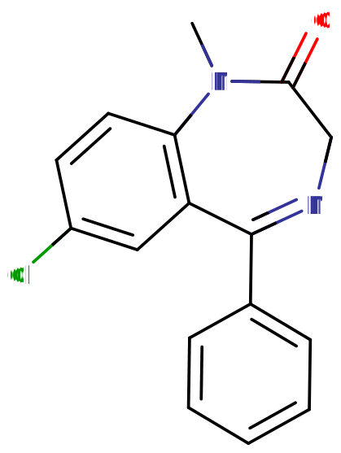

# 地西泮

[◀返回](index.md)

!!! danger "当[苯二氮卓类物质](../文档/药物分类/苯二氮卓类物质.md)与其他[抑制剂](../文档/药物分类/抑制剂.md)联用时，可能会发生致命的[药物过量](../文档/药物过量.md)。"

    这些抑制剂包括[阿片类药物](../文档/药物分类/阿片类药物.md)、[巴比妥类物质](../文档/药物分类/巴比妥类物质.md)、[加巴喷丁类物质](../文档/药物分类/加巴喷丁类物质.md)、[噻吩二氮卓类物质](../文档/药物分类/噻吩二氮卓类物质.md)、[酒精](酒精.md)或其他[GABA 能物质](../文档/GABA.md#GABA受体)。[^1]

    我们强烈建议大家不要把这些物质混在一起用，特别是在[中等](../文档/药物剂量分类.md#中等)到[严重](../文档/药物剂量分类.md#严重)剂量的时候，真的很危险！

!!! info "信息"

    请勿将其与[二氯地西泮](二氯地西泮.md)混淆。

| **化学信息** | 地西泮（Diazepam）                                      |
| ------------ | ------------------------------------------------------- |
| 结构式       |                                |
| 分子式       | C16H13ClN2O            |
| CAS 号       | 439-14-5                                                |
| **化学命名** |                                                         |
| 通用名称     | Valium, Diastat, Mother's Little Helper, Apaurin      |
| 取代名称     | Diazepam                                              |
| 系统名称     | 7-Chloro-1-methyl-5-phenyl-3H-1,4-benzodiazepin-2-one |
| **类别归属** |                                                         |
| 精神活性分类 | _[抑制剂](../文档/药物分类/抑制剂.md)_                  |
| 化学分类     | _[苯二氮卓类物质](../文档/药物分类/苯二氮卓类物质.md)_  |

| [**给药途径**](../文档/给药途径.md) | 🔽 [口服](../文档/给药途径.md#口服) |
| ----------------------------------- | ----------------------------------- |
| [**剂量**](../文档/给药剂量.md)     |                                     |
| 阈值                                | 1 mg                                |
| 轻微                                | 2.5 \~ 5 mg                         |
| 中等                                | 5 \~ 15 mg                          |
| 强烈                                | 15 \~ 30 mg                         |
| 严重                                | 30 mg +                             |
| [**药效时长**](../文档/药效时长.md) |                                     |
| 总时长                              | 4 \~ 8 小时                         |
| 药效发作                            | 20 \~ 40 分钟                       |
| 药效达峰                            | 60 \~ 90 分钟                       |
| 药效残余                            | 12 \~ 36 小时                       |

| [**相互作用**](#危险的相互作用)      |                 |
| ------------------------------------ | --------------- |
| [抑制剂](../文档/药物分类/抑制剂.md) | ⛔ **严禁联用** |
| [解离剂](../文档/药物分类/解离剂.md) | 💔 **联用危险** |
| [兴奋剂](../文档/药物分类/兴奋剂.md) | ⚠️ **谨慎联用** |

- !!! warning "警告"

        由于个体体重、耐受性、新陈代谢和个人敏感度的差异，请务必从低剂量开始。参见[负责任的用药部分](../文档/负责任的用药索引页.md)。

    !!! info "[免责声明](../关于本站/免责声明.md)"

        本站的[给药剂量](../文档/给药剂量.md)信息收集自用户和[相关资源](../文档/科学信息索引页.md)，仅供教育目的使用。这不是医疗建议，应与其他来源核实以确保准确性。

**地西泮**（也就是大家熟知的 **安定**、**Valium**）是[苯二氮卓类物质](../文档/药物分类/苯二氮卓类物质.md)家族中的一种[抑制剂](../文档/药物分类/抑制剂.md)。它的作用原理是增强大脑中抑制性[神经递质](../文档/神经递质.md) [GABA](../文档/GABA.md) 的效果。

地西泮在 1955 年由 Hoffman-La Roche 制药公司申请了专利。[^2] 自从 1963 年上市以来，它一直是世界上处方量最大的药物之一。[^3] 它通常被用来治疗各种各样的问题，比如[焦虑](../药效/焦虑.md)、[惊恐发作](../药效/惊恐发作.md)、[失眠](../文档/催眠药.md)、[癫痫发作](../文档/癫痫发作.md)、[肌肉痉挛](../药效/肌肉痉挛.md)以及[不宁腿](../药效/不宁腿.md)综合征。地西泮可是世界卫生组织基本药物清单中的核心药物，是基础医疗系统中必不可少的。[^4]

它的[主观效应](../药效/index.md)包括[焦虑抑制](../药效/焦虑抑制.md)、[镇静](../药效/镇静.md)和[肌肉松弛](../药效/肌肉松弛.md)。[^5] 与其他苯二氮卓类药物相比，地西泮起效很快。不过，普遍认为它的娱乐效果不如[氯硝西泮](氯硝西泮.md)（Klonopin）和[阿普唑仑](阿普唑仑.md)（Xanax）那么强。

地西泮被认为毒性较低。然而，它有中等的滥用潜力，如果长期使用会产生生理和心理依赖。另外，如果和[酒精](酒精.md)、[阿片类药物](../文档/药物分类/阿片类药物.md)或其他[抑制剂](../文档/药物分类/抑制剂.md)一起用，可能会导致[呼吸抑制](../药效/呼吸抑制.md)甚至死亡。如果要使用这种物质，我们强烈建议采取[伤害减少措施](../文档/负责任的用药索引页.md)。

要注意的是，对于长期规律使用的人来说，[突然停用苯二氮卓类药物](../文档/药物分类/苯二氮卓类物质.md)可能是危险甚至危及生命的，有时会导致癫痫发作或死亡。[^6] 我们强烈建议通过[减量戒断法](../文档/减量戒断法.md)，在较长的一段时间内每天逐渐减少用量，而不是突然停药。[^7]

虽然地西泮本身并不天然存在于植物或动物中，但最近的研究表明，它的主要代谢物去甲地西泮（DD）可以在各种生物系统中找到低浓度，包括动物和某些植物。这引发了一些有趣的问题，比如这些化合物是否可能进入食物链以及它们可能的天然来源。不过，这些发现的临床意义和生物学作用还在探索中。[^8] [^9]

## 历史与文化

继 1960 年获批使用的氯氮卓（利眠宁）之后，地西泮是 Hoffman-La Roche 制药公司的 Leo Sternbach 发明的第二个苯二氮卓类药物。地西泮作为利眠宁的改进版于 1963 年发布，迅速变得非常受欢迎，销量很快超过了利眠宁，帮助 Roche 成为了制药行业的巨头。在这次初步成功之后，其他制药公司也开始推出其他的苯二氮卓类衍生物。[^10]

苯二氮卓类药物在医疗专业人员中越来越受欢迎，因为它们比巴比妥类药物更好，巴比妥类药物的治疗指数相对较窄，而且在治疗剂量下镇静作用太强了。苯二氮卓类药物也安全得多；除非与大量其他抑制剂（如酒精或阿片类药物）一起服用，否则地西泮过量很少导致死亡。[^11] 像地西泮这样的苯二氮卓类药物最初得到了公众的广泛支持，但随着时间的推移，观点转变为越来越多的批评，并呼吁限制其处方。[^12]

在 Arthur Sackler 领导的 William Douglas McAdams 代理公司策划的广告活动推动下，Roche 销售的地西泮在 1969 年至 1982 年间是美国最畅销的药物，1978 年的年度销售峰值达到了 23 亿片 Valium。[^10] 虽然精神科医生继续开地西泮来短期缓解焦虑，但神经科现在更多地开地西泮来姑息治疗某些类型的癫痫和痉挛活动。

## 化学

地西泮是[苯二氮卓类](../文档/药物分类/苯二氮卓类物质.md)药物的一员。苯二氮卓类药物包含一个苯环与一个二氮卓环稠合，二氮卓环是一个七元环，两个氮取代基位于 R1 和 R4 位置。在 R1 位置，地西泮被甲基取代。此外，苯二氮卓环在 R5 位置与一个芳香苯环键合。双环核心的苯环在 R7 位置被氯基团取代。地西泮还在二氮卓环的 R2 位置包含一个双键氧基团，形成酮。这个 R2 位置的氧取代是后缀为-azepam 的苯二氮卓类药物共有的特征。

地西泮是一种 1,4-苯二氮卓。地西泮以白色或黄色固体晶体形式存在，熔点为 131.5 至 134.5°C。它无臭，味微苦。地西泮的 pH 值是中性的（即 pH = 7）。由于注射剂形式中含有苯甲酸/苯甲酸盐等添加剂，地西泮可能会被塑料吸收，所以液体制剂不应保存在塑料瓶或注射器等容器中。因此，它可能会渗入用于静脉输液的塑料袋和管子中。吸收似乎取决于几个因素，如温度、浓度、流速和管长。如果形成沉淀且不溶解，就不应该使用地西泮了。[^14]

## 药理学

地西泮是一种长效的"经典"苯二氮卓类药物。苯二氮卓类药物通过微摩尔苯二氮卓结合位点作为钙通道阻滞剂发挥作用，并显著抑制大鼠神经细胞制剂中去极化敏感的钙摄取。[^15] 地西泮抑制小鼠海马突触体的乙酰胆碱释放。这是通过测量小鼠在体内预处理地西泮后，体外小鼠脑细胞中钠依赖性高亲和力胆碱摄取发现的。这可能有助于解释地西泮的抗惊厥特性。[^16]

苯二氮卓类药物是 GABA A 型受体（GABAA）的正向变构调节剂。GABAA 受体是配体门控的氯离子选择性离子通道，由大脑中主要的抑制性神经递质 GABA 激活。苯二氮卓类药物与该受体复合物的结合促进了 GABA 的结合，进而增加了氯离子跨神经元细胞膜的总传导。这种增加的氯离子内流使神经元的膜电位超极化。结果是，静息电位和阈值电位之间的差异增加，神经元放电的可能性降低。最终，中枢神经系统中皮层和边缘系统的唤醒程度降低。[^17]

GABAA 受体是由五个亚基组成的异聚体，最常见的是两个α、两个β和一个γ（α2β2γ）。每个亚基都有许多亚型（α1–6，β1–3 和γ1–3）。含有α1 亚基的 GABAA 受体介导地西泮的镇静、顺行性遗忘和部分抗惊厥作用。含有α2 的 GABAA 受体介导抗焦虑作用，并在很大程度上介导肌肉松弛作用。含有α3 和α5 的 GABAA 受体也有助于苯二氮卓类药物的肌肉松弛作用，而包含α5 亚基的 GABAA 受体被证明可以调节苯二氮卓类药物的时间和空间记忆效应。[^18]

地西泮并不是唯一针对这些 GABAA 受体的药物。像氟马西尼这样的药物也结合到 GABAA 以诱导其作用。[^19] 地西泮似乎作用于边缘系统、丘脑和下丘脑区域，诱导抗焦虑作用。苯二氮卓类药物，包括地西泮，增加了大脑皮层的抑制过程。[^20]

苯二氮卓类药物通过结合到苯二氮卓受体位点并通过作用于其[受体](../文档/受体激动剂.md)放大神经递质[γ-氨基丁酸 (GABA)](../文档/GABA.md)的效率和效果，从而产生各种效应。[^21] 由于该位点是大脑中最丰富的抑制性受体组，其调节导致地西泮对神经系统的[镇静](../药效/镇静.md)（或[镇静作用](../药效/焦虑抑制.md)）。苯二氮卓类药物的[抗惊厥](../文档/癫痫发作.md)特性可能部分或全部归因于结合到电压依赖性钠通道而不是苯二氮卓受体。[^22]

## 主观效应

!!! info "[免责声明](../关于本站/免责声明.md)"

    _下列效应引用自 [**主观效应索引**](../药效/index.md) (**SEI**)，这是一个基于轶事用户报告和个人分析的开放研究文献。因此，应带着健康的怀疑态度来看待它们。_

    _同样值得注意的是，这些效应不一定会以可预测或可靠的方式发生，尽管较高的剂量更可能引发全方位的效应。同样，**不良反应** 随着剂量的增加变得越来越可能，可能包括 **成瘾、严重伤害或死亡** ☠。_

- ### **[身体效应](../药效/躯体效应.md)** 
    - **[镇静](../药效/镇静.md)**：在能量水平改变方面，这种药物具有镇静作用，通常会导致一种压倒性的嗜睡状态。在较高水平下，这会导致使用者突然感觉好像极度缺乏睡眠，好几天没睡过觉一样，迫使他们坐下来，感觉随时都要昏过去，而不是进行体育活动。这种睡眠剥夺感与剂量成正比，最终变得强大到足以迫使人完全失去意识。
    - **[肌肉松弛](../药效/肌肉松弛.md)**：与[阿普唑仑](阿普唑仑.md)（Xanax）相比，地西泮有更强的肌肉松弛作用。
    - **[运动控制丧失](../药效/运动控制丧失.md)**
    - **[呼吸抑制](../药效/呼吸抑制.md)**
    - **[头晕](../药效/头晕.md)**
    - **[癫痫发作抑制](../药效/癫痫发作抑制.md)**
    - **[躯体欣快感](../药效/躯体欣快感.md)**：地西泮与其他苯二氮卓类药物相似，除了抑制情绪外，人们报告说身体有中等到强烈的放松、愉悦和舒适感。这在已有焦虑者中表现得更频繁。然而，这并不是对每个人都一致，有些用户报告根本没有欣快感。还应该注意的是，如果体验到这种效果，与更强效和起效更快的苯二氮卓类药物（如[阿普唑仑](阿普唑仑.md)）相比，它通常在性质上更微妙。

- ### **[视觉效应](../药效/视觉效应.md)** 
    - **[视觉锐度抑制](../药效/视觉锐度抑制.md)**：像许多[抑制剂](../文档/药物分类/抑制剂.md)一样，地西泮已知会导致视力模糊或其他视觉锐度下降。这比其他苯二氮卓类药物发生的可能性小，但在高剂量下，或者如果使用者耐受性低，仍然可能出现。

- ### **矛盾效应** 
    对[苯二氮卓类药物](../文档/药物分类/苯二氮卓类物质.md)的矛盾反应，如癫痫发作增加（在癫痫患者中）、攻击性、焦虑增加、暴力行为、冲动控制丧失、易怒和自杀行为有时会发生（尽管在普通人群中很少见，发生率低于 1%）。[^23] [^24]

    这些矛盾效应在娱乐性滥用者、精神障碍患者、儿童和高剂量治疗的患者中发生的频率更高。[^25] [^26]

- ### **[认知效应](../药效/认知效应.md)** 
    许多人将地西泮的总体精神状态描述为强烈的镇静和抑制力下降。

    这些认知效应中最突出的通常包括：

    - **[焦虑抑制](../药效/焦虑抑制.md)**
    - **[去抑制](../药效/去抑制.md)**
    - **[清醒度妄想](../药效/妄想.md)**：这是一种错误的信念，即尽管有明显的证据表明严重的认知障碍和无法与他人充分交流，但自己仍然完全清醒。这最常发生在严重剂量下。
    - **[思维减速](../药效/思维减速.md)**
    - **[分析能力抑制](../药效/分析能力抑制.md)**
    - **[失忆](../药效/失忆.md)**
    - **[记忆抑制](../药效/记忆抑制.md)**：地西泮主要抑制短期记忆，导致健忘和/或行为混乱。
    - **[强迫性反复用药](../药效/强迫性补量.md)**
    - **[情感抑制](../药效/情感抑制.md)**：虽然这种化合物主要抑制焦虑，但它也以一种独特但不如[抗精神病药](../文档/抗精神病药.md)强烈的方式迟钝化其他情绪。
    - **[动力抑制](../药效/动力抑制.md)**：由于地西泮的中度镇静和嗜睡作用，做任何需要移动或大量努力的活动在这种化合物下可能很难做到，特别是在高剂量下。
    - **[语言能力抑制](../药效/语言能力抑制.md)**：地西泮和大多数苯二氮卓类药物已知会导致说话含糊不清和难以清晰地表达词语。

- ### **药效残余** 
    - **[反弹焦虑](../药效/焦虑.md)**：反弹焦虑是像[苯二氮卓类药物](../文档/药物分类/苯二氮卓类物质.md)这样的[焦虑缓解](../药效/焦虑抑制.md)物质常见的效应。它通常与在该物质影响下度过的总时间以及在给定时期内消耗的总量相对应，这种效应很容易导致依赖和成瘾的循环。
    - **[梦境强化](../药效/梦境强化.md)**[^27] 或 **[梦境抑制](../药效/梦境抑制.md)**
    - **[残留困倦](../药效/困倦.md)**：虽然苯二氮卓类药物可以用作有效的[助眠](../文档/催眠药.md)辅助手段，但它们的效果可能会持续到第二天早上，这可能导致用户在醒来后的几个小时内感到"昏昏沉沉"或"迟钝"。
    - **[思维减速](../药效/思维减速.md)**
    - **[思维混乱](../药效/思维混乱.md)**
    - **[易怒](../药效/易怒.md)**

### 体验报告

目前我们的[报告索引](../报告/index.md)中没有关于该物质效果的体验报告。你可以在[本站 Github 仓库](https://github.com/SalviaSWC/FreeODwiki)提交你自己的体验报告。

其他的体验报告可以在这里找到：

- PsychonautWiki：
    1. [Experience: A combination of diazepam and alcohol](https://psychonautwiki.org/wiki/Experience:_A_combination_of_diazepam_and_alcohol)
    2. [Experience:40mg Zolpidem / 20mg Diazepam - Please Don't Do This](https://psychonautwiki.org/wiki/Experience:40mg_Zolpidem_/_20mg_Diazepam_-_Please_Don%27t_Do_This)
    3. [Experience:Diazepam (20/10mg, Oral) - Comfortably Drunk](<https://psychonautwiki.org/wiki/Experience:Diazepam_(20/10mg,_Oral)_-_Comfortably_Drunk>)
- [Erowid Experience Vaults: Diazepam](https://www.erowid.org/experiences/subs/exp_Pharms_Diazepam.shtml)

## 毒性与危害潜力

|                                    |
| :-----------------------------------------------------------------------------: |
| 显示苯二氮卓类药物与其他药物相比的相对身体危害、社会危害和依赖性的雷达图。[^28] |

相对于剂量，地西泮的毒性较低。[^5] 然而，当与[酒精](酒精.md)或[阿片类药物](../文档/药物分类/阿片类药物.md)等[抑制剂](../文档/药物分类/抑制剂.md)混合使用时，它可能导致[致命](../药效/呼吸抑制.md)后果。

强烈建议在使用这种物质时采用[伤害减少措施](../文档/负责任的用药索引页.md)，如[液体容量给药法](../文档/液体容量给药法.md)，以确保给药剂量的准确性。

### 致死剂量

地西泮的小鼠口服 [LD50](../文档/药物剂量分类.md)（半数致死量）为 720 mg/kg，大鼠为 1,240 mg/kg。[^29] D. J. Greenblatt 及其同事在 1978 年报告了两名分别服用了 500 和 2,000 毫克地西泮的患者，他们进入了中度深度昏迷，并在 48 小时内出院，尽管地西泮及其代谢物去甲地西泮、奥沙西泮和替马西泮的浓度很高（根据医院采样和随访），但没有经历任何重要的并发症。[^30]

虽然单独服用通常不致命，但地西泮过量被视为医疗紧急情况，通常需要医务人员立即关注。地西泮（或任何其他苯二氮卓类药物）过量的解毒剂是氟马西尼（Anexate）。这种药物仅用于严重的[呼吸抑制](../药效/呼吸抑制.md)或心血管并发症的情况。因为氟马西尼是一种短效药物，而地西泮的作用可持续数天，可能需要多次剂量的氟马西尼。人工呼吸和稳定心血管功能也可能是必要的。[^31] [^32] [^33] [^11]

### 耐受性与成瘾潜力

地西泮具有极强的生理和心理成瘾性。

连续使用几天后，会对镇静催眠效果产生耐受性。[^34] 停止使用后，耐受性会在 7-14 天内恢复到基线。然而，在某些情况下，这可能需要更长的时间，具体取决于长期使用的持续时间和强度。

在持续给药几周或更长时间后突然停止使用，可能会出现戒断症状或反弹症状，可能需要逐渐减少剂量。[^35] [^36] 有关如何以受控方式减少苯二氮卓类药物的更多信息，请参阅[本指南](http://www.benzo.org.uk/manual/bzcha02.htm)。

[苯二氮卓类药物的戒断](../文档/药物分类/苯二氮卓类物质.md)是出了名的困难；对于经常使用的个人来说，如果不经过数周逐渐减少剂量就停止使用，可能会危及生命。增加[高血压](../药效/血压升高.md)、[癫痫发作](../文档/癫痫发作.md)和死亡的风险。[^6] 在戒断期间应避免使用降低癫痫阈值的药物，如[曲马多](曲马多.md)。

地西泮与所有[苯二氮卓类药物](../文档/药物分类/苯二氮卓类物质.md)表现出交叉耐受性，这意味着在服用它之后，所有苯二氮卓类药物的效果都会降低。

### 药物过量

当[苯二氮卓类药物](../文档/药物分类/苯二氮卓类物质.md)被极大量服用或与其他抑制剂同时服用时，可能会发生过量。这对于其他 GABA 能抑制剂如[巴比妥类药物](../文档/药物分类/巴比妥类物质.md)和[酒精](酒精.md)尤其危险，因为它们以类似的方式工作，但结合到 GABAA 受体上不同的变构位点，因此它们的效果会相互增强。苯二氮卓类药物增加氯离子通道在 GABAA 受体上打开的频率，而巴比妥类药物增加它们打开的持续时间，这意味着当两者同时服用时，离子孔会更频繁地打开并保持打开更长时间。[^37] 苯二氮卓类药物过量是一种医疗紧急情况，如果不及时和适当地治疗，可能导致昏迷、永久性脑损伤或死亡。

苯二氮卓类药物过量的症状可能包括严重的[思维减速](../药效/思维减速.md)、[口齿不清](../药效/语言能力抑制.md)、[思维混乱](../药效/思维混乱.md)、[妄想](../药效/妄想.md)、[呼吸抑制](../药效/呼吸抑制.md)、昏迷或死亡。苯二氮卓类药物过量可以在医院环境中得到有效治疗，结果通常良好。苯二氮卓类药物过量有时用[氟马西尼](氟马西尼.md)（一种 GABAA 拮抗剂）治疗，[^38] 但护理主要还是支持性的。

### 危险的相互作用

!!! warning "警告"

    _许多精神活性物质在单独使用时相对安全，但与某些其他物质联用可能会突然变得危险甚至危及生命。_

    _请务必进行独立研究（例如 [Google](https://www.google.com)、[DuckDuckGo](https://www.duckduckgo.com)、[PubMed](https://pubmed.ncbi.nlm.nih.gov/)），确保多种物质的组合是安全的。部分列出的相互作用来自 [TripSit](https://combo.tripsit.me)。_

- **抑制剂** (_[1,4-丁二醇](1,4-丁二醇.md), [2-甲基 -2-丁醇](2M2B.md), [酒精](酒精.md), [巴比妥类药物](../文档/药物分类/巴比妥类物质.md), [GHB](GHB.md)/[GBL](GBL.md), [甲喹酮](甲喹酮.md), [阿片类药物](../文档/药物分类/阿片类药物.md)_)：这种组合可能导致危险甚至致命水平的[呼吸抑制](../药效/呼吸抑制.md)。这些物质会增强彼此引起的[肌肉松弛](../药效/肌肉松弛.md)、[镇静](../药效/镇静.md)和[失忆](../药效/失忆.md)，并可能导致高剂量下的意外意识丧失。在意识丧失期间呕吐的风险也会增加，并导致窒息死亡。如果发生这种情况，用户应尝试以[恢复体位](../文档/恢复体位.md)入睡，或者让朋友帮助摆成该体位。
- **解离剂**：这种组合可能导致意识丧失期间呕吐的风险增加，并导致窒息死亡。如果发生这种情况，用户应尝试以[恢复体位](../文档/恢复体位.md)入睡，或者让朋友帮助摆成该体位。
- **兴奋剂**：将苯二氮卓类药物与[兴奋剂](../文档/药物分类/兴奋剂.md)结合使用是危险的，因为存在过度中毒的风险。兴奋剂会降低苯二氮卓类药物的[镇静](../药效/镇静.md)作用，这是大多数人用来确定其中毒水平的主要因素。一旦兴奋剂失效，苯二氮卓类药物的效果将显著增加，导致加剧的[去抑制](../药效/去抑制.md)以及[其他效应](../文档/药物分类/苯二氮卓类物质.md#主观效应)。如果结合使用，应严格限制每小时服用的苯二氮卓类药物量。如果没有监测水分补充，这种组合也可能导致严重脱水。

## 法律地位

在国际上，地西泮是《精神药物公约》下的附表 IV 管制药物。[^39] 地西泮在大多数国家作为处方药受到监管。

- **澳大利亚**: 地西泮是毒药标准下的附表 4 物质，使其成为仅限处方药。[^40]
- **奥地利**: 根据 AMG（奥地利药品法），地西泮用于医疗是合法的，但根据 SMG（奥地利麻醉品法），在没有处方的情况下销售或持有是非法的。
- **加拿大**: 地西泮列在《管制药物和物质法》的附表 IV 中。[^41]
- **捷克共和国**: 地西泮是附表 IV。[^42]（清单 7）物质。仅凭"无蓝条"处方销售（§ 1, g), 1. of _Nařízení vlády č. 463/2013 Sb._）[^43]
- **德国**: 截至 1986 年 8 月 1 日，地西泮受 Anlage III BtMG（_麻醉品法，附表 III_）管制。[^44] 它只能通过麻醉品处方表格开具，除非制剂中每种剂型含有高达 10 毫克地西泮，且溶液中含有高达 1% 且每个包装单位总共低于 250 毫克地西泮。[^45]
- **俄罗斯**: 自 2013 年以来，地西泮是附表 III 管制物质。[^46]
- **瑞士**: 地西泮是 Verzeichnis B 下特别命名的管制物质。允许医疗使用。[^47]
- **英国**: 地西泮被归类为管制药物，列在 2001 年《滥用药物条例》的附表 IV 第一部分（CD Benz POM）中，允许凭有效处方持有。1971 年《滥用药物法》规定，没有处方持有该物质是非法的，为此目的，它被归类为 C 类药物。[^48]

## 另见

- [负责任的用药](../文档/负责任的用药索引页.md)
    - [液体容量给药法](../文档/液体容量给药法.md)
- [抑制剂](../文档/药物分类/抑制剂.md)
    - [苯二氮卓类物质](../文档/药物分类/苯二氮卓类物质.md)
- [二氯地西泮](二氯地西泮.md)

## 外部链接

- [Diazepam (Wikipedia)](https://en.wikipedia.org/wiki/Diazepam)
- [Diazepam (Erowid Vault)](https://www.erowid.org/pharms/diazepam/)
- [Diazepam (Isomer Design)](https://isomerdesign.com/PiHKAL/explore.php?id=3011)
- [Diazepam (DrugBank)](https://go.drugbank.com/drugs/DB00829)
- [Diazepam (Drugs.com)](http://www.drugs.com/diazepam.html)
- [Diazepam (Drugs-Forum)](https://drugs-forum.com/wiki/Diazepam)

## 文献

- Calcaterra, N. E., & Barrow, J. C. (2014). Classics in Chemical Neuroscience: Diazepam (Valium). ACS Chemical Neuroscience, 5(4), 253-260. PMID: 24552479 <https://doi.org/10.1021/cn5000056>

## 引用文献

[^1]: [_Risks of Combining Depressants - TripSit_](https://tripsit.me/combining-depressants/)

[^2]: Wick, J. Y. (1 September 2013). ["The History of Benzodiazepines"](http://www.ingentaconnect.com/content/ascp/tcp/2013/00000028/00000009/art00001). _The Consultant Pharmacist_. **28** (9): 538–548. [doi](http://en.wikipedia.org/wiki/Digital_object_identifier):[10.4140/TCP.n.2013.538](https://doi.org/10.4140/TCP.n.2013.538). [ISSN](http://en.wikipedia.org/wiki/International_Standard_Serial_Number) [0888-5109](https://www.worldcat.org/issn/0888-5109)

[^3]: Calcaterra, N. E., Barrow, J. C. (16 April 2014). ["Classics in Chemical Neuroscience: Diazepam (Valium)"](https://pubs.acs.org/doi/10.1021/cn5000056). _ACS Chemical Neuroscience_. **5** (4): 253–260. [doi](http://en.wikipedia.org/wiki/Digital_object_identifier):[10.1021/cn5000056](https://doi.org/10.1021/cn5000056). [ISSN](http://en.wikipedia.org/wiki/International_Standard_Serial_Number) [1948-7193](https://www.worldcat.org/issn/1948-7193)

[^4]: WHO Model List (2005) | <http://whqlibdoc.who.int/hq/2005/a87017_eng.pdf>

[^5]: Mandrioli, R., Mercolini, L., Raggi, M. A. (October 2008). "Benzodiazepine metabolism: an analytical perspective". _Current Drug Metabolism_. **9** (8): 827–844. [doi](http://en.wikipedia.org/wiki/Digital_object_identifier):[10.2174/138920008786049258](https://doi.org/10.2174/138920008786049258). [ISSN](http://en.wikipedia.org/wiki/International_Standard_Serial_Number) [1389-2002](https://www.worldcat.org/issn/1389-2002)

[^6]: Lann, M. A., Molina, D. K. (June 2009). "A fatal case of benzodiazepine withdrawal". _The American Journal of Forensic Medicine and Pathology_. **30** (2): 177–179. [doi](http://en.wikipedia.org/wiki/Digital_object_identifier):[10.1097/PAF.0b013e3181875aa0](https://doi.org/10.1097/PAF.0b013e3181875aa0). [ISSN](http://en.wikipedia.org/wiki/International_Standard_Serial_Number) [1533-404X](https://www.worldcat.org/issn/1533-404X)

[^7]: Kahan, M., Wilson, L., Mailis-Gagnon, A., Srivastava, A. (November 2011). ["Canadian guideline for safe and effective use of opioids for chronic noncancer pain. Appendix B-6: Benzodiazepine Tapering"](https://www.ncbi.nlm.nih.gov/pmc/articles/PMC3215603/). _Canadian Family Physician_. **57** (11): 1269–1276. [ISSN](http://en.wikipedia.org/wiki/International_Standard_Serial_Number) [0008-350X](https://www.worldcat.org/issn/0008-350X)

[^8]: Unseld, E.; Krishna, D. R.; Fischer, C.; Klotz, U. (1989). "Detection of desmethyldiazepam and diazepam in brain of different species and plants". _Biochemical Pharmacology_. **38** (15): 2473–2478. [doi](http://en.wikipedia.org/wiki/Digital_object_identifier):[10.1016/0006-2952(89)90091-9](<https://doi.org/10.1016/0006-2952(89)90091-9>). [eISSN](http://en.wikipedia.org/wiki/International_Standard_Serial_Number#Electronic_ISSN) [1873-2968](https://www.worldcat.org/issn/1873-2968). [ISSN](http://en.wikipedia.org/wiki/International_Standard_Serial_Number) [0006-2952](https://www.worldcat.org/issn/0006-2952). [OCLC](http://en.wikipedia.org/wiki/OCLC) [01536391](https://www.worldcat.org/oclc/01536391). [PMID](http://en.wikipedia.org/wiki/PubMed_Identifier) [2502983](https://www.ncbi.nlm.nih.gov/pubmed/2502983)

[^9]: <https://pubmed.ncbi.nlm.nih.gov/2502983/>

[^10]: Sample, I. (2005), [_Leo Sternbach_](https://www.theguardian.com/society/2005/oct/03/health.guardianobituaries), retrieved 8 July 2019

[^11]: Barondes, S. H. (2003). _Better than Prozac: creating the next generation of psychiatric drugs_. Oxford University Press. [ISBN](http://en.wikipedia.org/wiki/International_Standard_Book_Number) [9780195151305](http://en.wikipedia.org/wiki/Special:BookSources/9780195151305)

[^12]: Marshall, K. P., Georgievskava, Z., Georgievsky, I. (June 2009). ["Social reactions to Valium and Prozac: A cultural lag perspective of drug diffusion and adoption"](https://linkinghub.elsevier.com/retrieve/pii/S1551741108000582). _Research in Social and Administrative Pharmacy_. **5** (2): 94–107. [doi](http://en.wikipedia.org/wiki/Digital_object_identifier):[10.1016/j.sapharm.2008.06.005](https://doi.org/10.1016/j.sapharm.2008.06.005). [ISSN](http://en.wikipedia.org/wiki/International_Standard_Serial_Number) [1551-7411](https://www.worldcat.org/issn/1551-7411)

[^13]: Mariani, M. (2015), [_Poison Pill - How the American opiate epidemic was started by one pharmaceutical company._](https://psmag.com/social-justice/how-the-american-opiate-epidemic-was-started-by-one-pharmaceutical-company), retrieved 10 January 2018

[^14]: Mikota SK, Plumb DC (2005). "Diazepam". _The Elephant Formulary_. Elephant Care International. Archived from the original on 8 September 2005.

[^15]: Taft, W. C., DeLorenzo, R. J. (May 1984). ["Micromolar-affinity benzodiazepine receptors regulate voltage-sensitive calcium channels in nerve terminal preparations"](https://pnas.org/doi/full/10.1073/pnas.81.10.3118). _Proceedings of the National Academy of Sciences_. **81** (10): 3118–3122. [doi](http://en.wikipedia.org/wiki/Digital_object_identifier):[10.1073/pnas.81.10.3118](https://doi.org/10.1073/pnas.81.10.3118). [ISSN](http://en.wikipedia.org/wiki/International_Standard_Serial_Number) [0027-8424](https://www.worldcat.org/issn/0027-8424)

[^16]: ["COMMUNICATIONS"](https://onlinelibrary.wiley.com/doi/10.1111/j.1476-5381.1985.tb17368.x). _British Journal of Pharmacology_. **84** (1): 1P–77P. January 1985. [doi](http://en.wikipedia.org/wiki/Digital_object_identifier):[10.1111/j.1476-5381.1985.tb17368.x](https://doi.org/10.1111/j.1476-5381.1985.tb17368.x). [ISSN](http://en.wikipedia.org/wiki/International_Standard_Serial_Number) [0007-1188](https://www.worldcat.org/issn/0007-1188)

[^17]: "National Highway Traffic Safety Administration Drugs and Human Performance Fact Sheet- Diazepam". Archived from the original on 27 March 2017.

[^18]: Tan, K. R., Rudolph, U., Lüscher, C. (April 2011). ["Hooked on benzodiazepines: GABAA receptor subtypes and addiction"](https://linkinghub.elsevier.com/retrieve/pii/S0166223611000051). _Trends in Neurosciences_. **34** (4): 188–197. [doi](http://en.wikipedia.org/wiki/Digital_object_identifier):[10.1016/j.tins.2011.01.004](https://doi.org/10.1016/j.tins.2011.01.004). [ISSN](http://en.wikipedia.org/wiki/International_Standard_Serial_Number) [0166-2236](https://www.worldcat.org/issn/0166-2236)

[^19]: Whirl-Carrillo, M., McDonagh, E. M., Hebert, J. M., Gong, L., Sangkuhl, K., Thorn, C. F., Altman, R. B., Klein, T. E. (October 2012). ["Pharmacogenomics Knowledge for Personalized Medicine"](https://onlinelibrary.wiley.com/doi/10.1038/clpt.2012.96). _Clinical Pharmacology & Therapeutics_. **92** (4): 414–417. [doi](http://en.wikipedia.org/wiki/Digital_object_identifier):[10.1038/clpt.2012.96](https://doi.org/10.1038/clpt.2012.96). [ISSN](http://en.wikipedia.org/wiki/International_Standard_Serial_Number) [0009-9236](https://www.worldcat.org/issn/0009-9236)

[^20]: Zakusov, V. V., Ostrovskaya, R. U., Kozhechkin, S. N., Markovich, V. V., Molodavkin, G. M., Voronina, T. A. (October 1977). "Further evidence for GABA-ergic mechanisms in the action of benzodiazepines". _Archives Internationales De Pharmacodynamie Et De Therapie_. **229** (2): 313–326. [ISSN](http://en.wikipedia.org/wiki/International_Standard_Serial_Number) [0003-9780](https://www.worldcat.org/issn/0003-9780)

[^21]: Haefely, W. (29 June 1984). "Benzodiazepine interactions with GABA receptors". _Neuroscience Letters_. **47** (3): 201–206. [doi](http://en.wikipedia.org/wiki/Digital_object_identifier):[10.1016/0304-3940(84)90514-7](<https://doi.org/10.1016/0304-3940(84)90514-7>). [ISSN](http://en.wikipedia.org/wiki/International_Standard_Serial_Number) [0304-3940](https://www.worldcat.org/issn/0304-3940)

[^22]: McLean, M. J., Macdonald, R. L. (February 1988). "Benzodiazepines, but not beta carbolines, limit high frequency repetitive firing of action potentials of spinal cord neurons in cell culture". _The Journal of Pharmacology and Experimental Therapeutics_. **244** (2): 789–795. [ISSN](http://en.wikipedia.org/wiki/International_Standard_Serial_Number) [0022-3565](https://www.worldcat.org/issn/0022-3565)

[^23]: Saïas, T., Gallarda, T. (September 2008). "[Paradoxical aggressive reactions to benzodiazepine use: a review]". _L'Encephale_. **34** (4): 330–336. [doi](http://en.wikipedia.org/wiki/Digital_object_identifier):[10.1016/j.encep.2007.05.005](https://doi.org/10.1016/j.encep.2007.05.005). [ISSN](http://en.wikipedia.org/wiki/International_Standard_Serial_Number) [0013-7006](https://www.worldcat.org/issn/0013-7006)

[^24]: Paton, C. (December 2002). ["Benzodiazepines and disinhibition: a review"](https://www.cambridge.org/core/journals/psychiatric-bulletin/article/benzodiazepines-and-disinhibition-a-review/421AF197362B55EDF004700452BF3BC6). _Psychiatric Bulletin_. **26** (12): 460–462. [doi](http://en.wikipedia.org/wiki/Digital_object_identifier):[10.1192/pb.26.12.460](https://doi.org/10.1192/pb.26.12.460). [ISSN](http://en.wikipedia.org/wiki/International_Standard_Serial_Number) [0955-6036](https://www.worldcat.org/issn/0955-6036)

[^25]: Bond, A. J. (1 January 1998). ["Drug- Induced Behavioural Disinhibition"](https://doi.org/10.2165/00023210-199809010-00005). _CNS Drugs_. **9** (1): 41–57. [doi](http://en.wikipedia.org/wiki/Digital_object_identifier):[10.2165/00023210-199809010-00005](https://doi.org/10.2165/00023210-199809010-00005). [ISSN](http://en.wikipedia.org/wiki/International_Standard_Serial_Number) [1179-1934](https://www.worldcat.org/issn/1179-1934)

[^26]: Drummer, O. H. (February 2002). "Benzodiazepines - Effects on Human Performance and Behavior". _Forensic Science Review_. **14** (1–2): 1–14. [ISSN](http://en.wikipedia.org/wiki/International_Standard_Serial_Number) [1042-7201](https://www.worldcat.org/issn/1042-7201)

[^27]: Goyal, S. (14 March 1970). "Drugs and dreams". _Canadian Medical Association Journal_. **102** (5): 524. [ISSN](http://en.wikipedia.org/wiki/International_Standard_Serial_Number) [0008-4409](https://www.worldcat.org/issn/0008-4409)

[^28]: Nutt, D., King, L. A., Saulsbury, W., Blakemore, C. (24 March 2007). ["Development of a rational scale to assess the harm of drugs of potential misuse"](https://www.sciencedirect.com/science/article/pii/S0140673607604644). _The Lancet_. **369** (9566): 1047–1053. [doi](http://en.wikipedia.org/wiki/Digital_object_identifier):[10.1016/S0140-6736(07)60464-4](<https://doi.org/10.1016/S0140-6736(07)60464-4>). [ISSN](http://en.wikipedia.org/wiki/International_Standard_Serial_Number) [0140-6736](https://www.worldcat.org/issn/0140-6736)

[^29]: <http://www.drugs.com/diazepam.html>

[^30]: Greenblatt, D. J., Woo, E., Allen, M. D., Orsulak, P. J., Shader, R. I. (20 October 1978). "Rapid recovery from massive diazepam overdose". _JAMA_. **240** (17): 1872–1874. [ISSN](http://en.wikipedia.org/wiki/International_Standard_Serial_Number) [0098-7484](https://www.worldcat.org/issn/0098-7484)

[^31]: [_Diazepam (PIM 181)_](https://inchem.org/documents/pims/pharm/pim181.htm)

[^32]: <http://www.drugs.com/diazepam.html>

[^33]: [_Diazepam (Diazepam Injection): Uses, Dosage, Side Effects, Interactions, Warning_](https://www.rxlist.com/diazepam-injection-drug.htm)

[^34]: Janicak, P. G., Marder, S. R., Pavuluri, M. N. (25 October 2010). _Principles and Practice of Psychopharmacotherapy_. Lippincott Williams & Wilkins. [ISBN](http://en.wikipedia.org/wiki/International_Standard_Book_Number) [9781605475653](http://en.wikipedia.org/wiki/Special:BookSources/9781605475653)

[^35]: Verster, J. C., Volkerts, E. R. (7 June 2006). ["Clinical Pharmacology, Clinical Efficacy, and Behavioral Toxicity of Alprazolam: A Review of the Literature"](https://onlinelibrary.wiley.com/doi/10.1111/j.1527-3458.2004.tb00003.x). _CNS Drug Reviews_. **10** (1): 45–76. [doi](http://en.wikipedia.org/wiki/Digital_object_identifier):[10.1111/j.1527-3458.2004.tb00003.x](https://doi.org/10.1111/j.1527-3458.2004.tb00003.x). [ISSN](http://en.wikipedia.org/wiki/International_Standard_Serial_Number) [1080-563X](https://www.worldcat.org/issn/1080-563X)

[^36]: Galanter, M., Kleber, H. D. (2008). _The American Psychiatric Publishing Textbook of Substance Abuse Treatment_. American Psychiatric Pub. [ISBN](http://en.wikipedia.org/wiki/International_Standard_Book_Number) [9781585622764](http://en.wikipedia.org/wiki/Special:BookSources/9781585622764)

[^37]: Twyman, R. E., Rogers, C. J., Macdonald, R. L. (March 1989). "Differential regulation of gamma-aminobutyric acid receptor channels by diazepam and phenobarbital". _Annals of Neurology_. **25** (3): 213–220. [doi](http://en.wikipedia.org/wiki/Digital_object_identifier):[10.1002/ana.410250302](https://doi.org/10.1002/ana.410250302). [ISSN](http://en.wikipedia.org/wiki/International_Standard_Serial_Number) [0364-5134](https://www.worldcat.org/issn/0364-5134)

[^38]: Hoffman, E. J., Warren, E. W. (September 1993). "Flumazenil: a benzodiazepine antagonist". _Clinical Pharmacy_. **12** (9): 641–656; quiz 699–701. [ISSN](http://en.wikipedia.org/wiki/International_Standard_Serial_Number) [0278-2677](https://www.worldcat.org/issn/0278-2677)

[^39]: International Narcotics Control Board (2003) | <http://infoespai.org/wp-content/uploads/2014/12/green.pdf>

[^40]: ["Poisons Standard December 2019"](https://www.legislation.gov.au/Details/F2019L01471). Office of Parliamentary Counsel. November 14, 2019. Retrieved December 28, 2019.

[^41]: <https://laws-lois.justice.gc.ca/eng/acts/C-38.8/page-12.html#h-95661>

[^42]: <https://eur-lex.europa.eu/resource.html?uri=cellar:6b5e9beb-1d9b-11ea-95ab-01aa75ed71a1.0001.02/DOC_1&format=PDF>

[^43]: <https://www.zakonyprolidi.cz/cs/2013-463>

[^44]: ["Zweite Verordnung zur Änderung betäubungsmittelrechtlicher Vorschriften"](http://www.bgbl.de/xaver/bgbl/start.xav?startbk=Bundesanzeiger_BGBl&jumpTo=bgbl186s1099.pdf) (PDF). _Bundesgesetzblatt Jahrgang 1986 Teil I_ (in German). Bundesanzeiger Verlag. July 29, 1986. Retrieved December 26, 2019.

[^45]: ["Anlage III BtMG"](https://www.gesetze-im-internet.de/btmg_1981/anlage_iii.html) (in German). Bundesministerium der Justiz und für Verbraucherschutz. Retrieved December 26, 2019.

[^46]: [_Постановление Правительства РФ от 04.02.2013 N 78 "О внесении изменений в некоторые акты Правительства Российской Федерации" - КонсультантПлюс_](https://www.consultant.ru/cons/cgi/online.cgi?req=doc&base=LAW&n=141744&dst=100005&date=02.12.2019)

[^47]: ["Verordnung des EDI über die Verzeichnisse der Betäubungsmittel, psychotropen Stoffe, Vorläuferstoffe und Hilfschemikalien"](https://www.admin.ch/opc/de/classified-compilation/20101220/index.html) (in German). Bundeskanzlei [Federal Chancellery of Switzerland]. Retrieved January 1, 2020.

[^48]: [_Drugs licensing_](https://www.gov.uk/government/collections/drugs-licensing)
