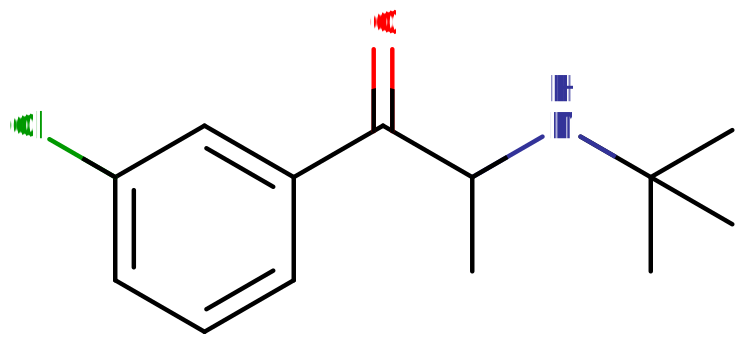

# 安非他酮

[◀返回](index.md)

| **化学信息** | 安非他酮                                                             |
| ------------ | -------------------------------------------------------------------- |
| 结构式       |                                            |
| 分子式       | C13H18ClNO                                     |
| CAS 号       | 34841-39-9                                                           |
| **化学命名** |                                                                      |
| 常用名称     | Bupropion、amfebutamone、威博隽 (Wellbutrin)、载班 (Zyban)、Aplenzin |
| 取代名称     | 3-Chloro-N-tert-butylcathinone                                       |
| 系统名称     | (RS)-2-(叔丁基氨基)-1-(3-氯苯基)丙-1-酮                              |
| **类别归属** |                                                                      |
| 精神活性分类 | _[兴奋剂](../文档/药物分类/兴奋剂.md)_                               |
| 化学分类     | _[取代卡西酮类物质](../文档/药物分类/卡西酮类物质.md)_               |

| [**给药途径**](../文档/给药途径.md)      | 🔽 [口服](../文档/给药途径.md#口服)                      | 🔽 [鼻吸](../文档/给药途径.md#鼻吸)                           | [抽吸](../文档/给药途径.md#抽吸)                         |
| ---------------------------------------- | ----------------------------------------------------- | ---------------------------------------------------------- | -------------------------------------------------------- |
| [**给药剂量**](../文档/给药剂量.md)      | **以下数值适用于速释型安非他酮**                      |                                                            |                                                          |
| [阈值](../文档/药物剂量分类.md#阈值)     | 75 mg                                                 | 50 mg                                                      | < 75 mg                                                  |
| [轻微](../文档/药物剂量分类.md#轻微)     | 75 \~ 125 mg                                          | 50 \~ 150 mg                                               | 75 \~ 150 mg                                             |
| [中等](../文档/药物剂量分类.md#中等)     | 125 \~ 225 mg                                         | 150 \~ 300 mg                                              | 150 \~ 225 mg                                            |
| [强烈](../文档/药物剂量分类.md#强烈)     | 225 \~ 325 mg                                         | 300 \~ 900 mg <mark>**警告：极高的癫痫致死风险**</mark> | 300 \~ 375 mg                                            |
| [严重](../文档/药物剂量分类.md#严重)     | 325 mg + <mark>**警告：极高的癫痫致死风险**</mark> | 900 mg + <mark>**警告：极高的癫痫致死风险**</mark>      | 375 mg 以上 <mark>**警告：极高的癫痫致死风险**</mark> |
| [**药效时长**](../文档/药效时长.md)      |                                                       |                                                            |                                                          |
| [总时长](../文档/药效时长.md#总时长)     | 8 \~ 12 小时                                          | 20 \~ 180 分钟                                             | 未知                                                     |
| [药效发作](../文档/药效时长.md#药效发作) | 40 \~ 60 分钟                                         | 30 \~ 120 秒                                               | 0.5 分钟                                                 |
| [药效上升](../文档/药效时长.md#药效上升) |                                                       | 1 \~ 5 分钟                                                | 未知                                                     |
| [药效达峰](../文档/药效时长.md#药效达峰) | 90 分钟                                               | 5 \~ 20 分钟                                               | 未知                                                     |
| [药效褪去](../文档/药效时长.md#药效褪去) | 5 \~ 8 小时                                           | 10 \~ 60 分钟                                              | 未知                                                     |
| [药效残余](../文档/药效时长.md#药效残余) | 1 \~ 2 天                                             | 1 \~ 6 小时                                                |                                                          |

- !!! warning "警告"

        由于个体体重、耐受性、新陈代谢和个人敏感度的差异，请务必从低剂量开始。参见[负责任的用药部分](../文档/负责任的用药索引页.md)。

    !!! info "[免责声明](../关于本站/免责声明.md)"

        本站的[给药剂量](../文档/给药剂量.md)信息收集自用户和[相关资源](../文档/科学信息索引页.md)，仅供教育目的使用。这不是医疗建议，应与其他来源核实以确保准确性。

**安非他酮**（以威博隽 Wellbutrin 的缓释、速释或控释形式，以及载班 Zyban 等名称销售，也被称为 amfebutamone）是一种[卡西酮类物质](../文档/药物分类/卡西酮类物质.md)[^1]，临床上用于治疗重度抑郁症和戒烟。安非他酮也常被超适应症用于治疗季节性情感障碍和注意力缺陷多动障碍（ADHD）。此外，它也会因为其类谵妄和兴奋的效果而被用于娱乐性用药。它是一种[去甲肾上腺素](../文档/去甲肾上腺素.md)-[多巴胺](../文档/多巴胺.md)再摄取抑制剂（NDRI）和烟碱型乙酰胆碱受体拮抗剂。[^2] [^3]它类谵妄的作用可能是通过拮抗烟碱型乙酰胆碱受体而产生的。

## 历史与文化

安非他酮由 Burroughs Wellcome（现为葛兰素史克）的 Nariman Mehta 于 1969 年发明，并于 1974 年获得美国专利。1985 年 12 月 30 日，它被美国食品药品监督管理局（FDA）批准作为抗抑郁药，并以威博隽（Wellbutrin）的名称上市。然而，由于在最初推荐的剂量（400–600 毫克/天）下癫痫发作的发生率很高，该药于 1986 年退市。随后研究发现，癫痫发作的风险与剂量高度相关，因此安非他酮于 1989 年重新上市，并将最大推荐日剂量降低至 450 毫克/天。

## 化学

安非他酮属于[卡西酮](../文档/药物分类/卡西酮类物质.md)类分子，其苯环的 R3 位被一个氯原子取代，氨基上被一个叔丁基取代。卡西酮是[苯丙胺类物质](../文档/药物分类/苯丙胺类物质.md)的一个子类，共享苯丙胺的核心结构，即通过乙基链连接到氨基（NH2）的苯环，并在 Rα 位有一个额外的甲基取代。安非他酮与其他卡西酮的区别在于苯丙胺骨架的 β 位碳原子上有酮基取代，也就是说它们是 β-酮基-苯丙胺。

## 药理学

安非他酮结合并抑制去甲肾上腺素转运体（NET）和多巴胺转运体（DAT），从而抑制这两种单胺的再摄取。它还作为拮抗剂结合烟碱型乙酰胆碱受体。[^3]安非他酮被广泛代谢为羟基安非他酮、苏式氢化安非他酮和赤式氢化安非他酮。它通过拮抗烟碱型乙酰胆碱受体（特别是 α3β2、α3β4、α4β2 型），抑制乙酰胆碱的作用，从而产生类谵妄的效果。它还会非常微弱地拮抗 α7 烟碱型乙酰胆碱受体。[^4] [^5]很可能正是这种对受体的拮抗作用，导致安非他酮让使用者产生幻觉和生动的梦境。

## 主观效应

安非他酮在高剂量时的效果特征与[苯海拉明](苯海拉明.md)相似；在低剂量时，它表现得像一种温和且通常令人愉悦的物质，但在高剂量时，[谵妄](../药效/谵妄.md)开始占据主导地位，导致极其不舒服的体验。

!!! info "[免责声明](../关于本站/免责声明.md)"

    _下列效应引用自 [**主观效应索引**](../药效/index.md) (**SEI**)，这是一个基于轶事用户报告和个人分析的开放研究文献。因此，应带着健康的怀疑态度来看待它们。_

    _同样值得注意的是，这些效应不一定会以可预测或可靠的方式发生，尽管较高的剂量更可能引发全方位的效应。同样，**不良反应** 随着剂量的增加变得越来越可能，可能包括 **成瘾、严重伤害或死亡** ☠。_

- ### **躯体效应** 

    - **[兴奋](../药效/兴奋.md)**：安非他酮的 NDRI 活性使其成为一种具有刺激性的物质。
    - **[自发性躯体感觉](../药效/自发性躯体感觉.md)**：这种效果通常较弱。根据其他具有类似药理作用的物质的经验，可以描述为一种轻微且令人愉悦的柔软或尖锐的刺痛感，伴随着身体散发出的温暖感。
    - **[癫痫发作](../文档/癫痫发作.md)**：这种效应发生的可能性与剂量成正比。
    - **[心率增快](../药效/心率增快.md)**
    - **[血压升高](../药效/血压升高.md)**
    - **[瞳孔扩大](../药效/瞳孔扩大.md)**
    - **[食欲抑制](../药效/食欲抑制.md)**
    - **[恶心](../药效/恶心.md)**：与高剂量成正比，通常发生在长期使用后。
    - **[触觉幻觉](../药效/触觉幻觉.md)**：这种效果通常只出现在高剂量时。
    - **[体温调节抑制](../药效/体温调节抑制.md)**

- ### **视觉效应** 

    - 这些效应通常只在摄入娱乐性高剂量、开始表现出类谵妄作用时才会出现。如果同时伴有睡眠剥夺（兴奋剂使用者常有的经历），出现这些效应的几率会增加。
    - **[外部幻觉](../药效/外部幻觉.md)**
    - **[影子人](../药效/影子人.md)**
    - **[漂移](../药效/漂移.md)**
    - **[模式识别增强](../药效/模式识别增强.md)**
    - **[视觉拖尾](../药效/视觉拖尾.md)**
    - **[周边信息误判](../药效/周边信息误判.md)**
    - **[视觉锐度抑制](../药效/视觉锐度抑制.md)**

- ### **[认知效应](../药效/认知效应.md)** 

    - **[谵妄](../药效/谵妄.md)**：这种情况发生在极高或不合理的剂量下，是安非他酮拮抗烟碱型乙酰胆碱受体（nAChRs）的结果。与其他谵妄剂不同，由于安非他酮具有让使用者保持清醒的能力，这种效果可能非常痛苦且难以摆脱，不像[苯海拉明](苯海拉明.md)那样的谵妄剂。
    - **[偏执](../药效/偏执.md)**
    - **[去抑制](../药效/去抑制.md)**：主要发生在娱乐剂量下。
    - **[妄想](../药效/妄想.md)**：这种效果通常只在极高剂量下出现。
    - **[焦虑](../药效/焦虑.md)**：安非他酮比其他兴奋剂更容易引起焦虑。
    - **[躁狂](../药效/躁狂.md)**：安非他酮会增加双相情感障碍患者躁狂发作的风险。
    - **[动机增强](../药效/动机增强.md)**：通常表现为变得更健谈、坐立不安或对任务的兴趣增加。与苯丙胺或哌甲酯相比，这种效果较弱。
    - **[梦境强化](../药效/梦境强化.md)**：报告指出，服用安非他酮会导致狂野、生动且真实的梦境，通常感觉是线性的且非常身临其境，几乎就像一场有趣的冒险。从入睡到醒来，时间似乎也比实际流逝得更多。梦境也更容易被记起。因此，安非他酮也会抑制睡眠，但这可以安全地通过[褪黑素](褪黑素.md)来抵消。这种效果可能是由安非他酮对去甲肾上腺素的高度作用引起的。
    - **[时间扭曲](../药效/时间扭曲.md)**：表现为时间膨胀感。二十分钟的时间感觉就像长达八小时。这发生在不合理的高剂量下。
    - **[音乐欣赏能力增强](../药效/音乐欣赏能力增强.md)**
    - **[沉浸感强化](../药效/沉浸感强化.md)**
    - **[认知欣快](../药效/认知欣快.md)**：安非他酮产生的欣快感通常较温和，但在某些人身上，据报道会产生与[苯丙胺](苯丙胺.md)相当的强烈欣快感。
    - **[自我膨胀](../药效/自我膨胀.md)**
    - **[认知不快](../药效/认知不快.md)**：这种效果只在高剂量下出现，通常是由于其类谵妄作用。
    - **[新奇感增强](../药效/新奇感增强.md)**
    - **[语言能力抑制](../药效/语言能力抑制.md)**：这种效果只在高剂量下出现，通常是由于其类谵妄作用。
    - **[幽默感增强](../药效/幽默感增强.md)**
    - **[性欲增强](../药效/性欲增强.md)**：安非他酮有时被超适应症处方用于治疗 [SSRI](../文档/SSRI.md) 引起的性功能障碍。
    - **[成瘾抑制](../药效/成瘾抑制.md)**：安非他酮会降低对[烟草](烟草.md)（尼古丁）的享受感，从而降低需求。单独使用或与伐尼克兰联用，安非他酮的缓释和控释剂型可用于治疗烟草成瘾和依赖。[^6]

- ### **听觉效应** 

    - **[听觉幻觉](../药效/听觉幻觉.md)**：这种效果只在高剂量下出现，通常是由于其类谵妄作用。
    - **[听觉锐度增强](../药效/听觉锐度增强.md)**：声音可能变得更容易听到或听起来很痛苦。通常这不一定是谵妄的一部分，但也可能是。

### 体验报告

目前我们的[报告索引](../报告/index.md)中没有关于该物质效果的体验报告。你可以在[本站 Github 仓库](https://github.com/SalviaSWC/FreeODwiki)提交你自己的体验报告。

其他的体验报告可以在这里找到：

- [Erowid Experience Vaults: Bupropion](https://www.erowid.org/experiences/subs/exp_Pharms_Bupropion.shtml%7C)

## 毒性与伤害潜力

安非他酮可能导致癫痫发作，因此不应与[曲马多](曲马多.md)等其他降低癫痫阈值的物质联用，也不应在 GABA 类药物戒断期间使用。

### 致死剂量

尽管安非他酮对大鼠和小鼠的半数致死量（LD50）[^7]处于平均水平，但过量服用仍然非常危险，因为存在单胺风暴、癫痫发作以及心脏病发作或中风的风险。

### 耐受性与成瘾潜力

由于其作为 NDRI 的活性，安非他酮具有成瘾潜力。通过鼻吸给药会大大提高成瘾风险。安非他酮在治疗剂量和娱乐剂量下都可能产生依赖性。

### 危险的药物联用

!!! warning "警告"

    _许多精神活性物质在单独使用时相对安全，但与某些其他物质联用可能会突然变得危险甚至危及生命。_

    _请务必进行独立研究（例如 [Google](https://www.google.com)、[DuckDuckGo](https://www.duckduckgo.com)、[PubMed](https://pubmed.ncbi.nlm.nih.gov/)），确保多种物质的组合是安全的。部分列出的相互作用来自 [TripSit](https://combo.tripsit.me)。_

- **兴奋剂**（[苯丙胺](苯丙胺.md)、[利右苯丙胺](利右苯丙胺.md)、[哌甲酯](哌甲酯.md)、[可卡因](可卡因.md)）：这种联用会增加心脏病发作、中风或[肾上腺素](../文档/肾上腺素.md)风暴的风险。这些药物通常本身就会 **降低癫痫阈值**，与安非他酮联用时可能会产生叠加效应。
- **曲马多、塔喷他多或任何其他降低癫痫阈值的药物或物质（如右丙氧芬或锂盐）**：这种联用会增加癫痫发作、癫痫致死或癫痫持续状态（持续超过五分钟的癫痫）的风险。
- **[镇静剂](../文档/镇静剂.md)**（[阿普唑仑](阿普唑仑.md)、氯硝唑仑、[地西泮](地西泮.md)、[阿片类药物](../文档/药物分类/阿片类药物.md)、苯巴比妥、司可巴比妥、[喹硫平](喹硫平.md)）：安非他酮的效果会被苯二氮卓类、巴比妥类、酒精和抗精神病药等镇静剂掩盖。如果镇静剂的效果在安非他酮之前消失，安非他酮的效果可能会显得或变得更加明显。
- **[酒精](酒精.md)**：这种联用会增加非典型且不愉快或危险副作用的风险，如癫痫发作、偏执或抑郁。
- **右美沙芬**：安非他酮是 CYP2D6 的强效抑制剂，而 CYP2D6 是负责分解右美沙芬的主要酶。这会导致药效延长以及右美沙芬在血液中过度蓄积。[^8]在极端情况下，这些物质引起的恐慌发作会导致更严重的心脏问题。右美沙芬和安非他酮都会降低癫痫阈值。
  另一方面，右美沙芬/安非他酮是一种获得批准的复方药物；每片 _缓释_ 片含有 45 毫克右美沙芬和 105 毫克安非他酮。治疗抑郁症的最大剂量设定为每天 2 片，间隔至少 8 小时。[^9]虽然这种复方药足够安全以获得批准，但速释联用以及更高剂量的安全性仍然令人担忧。
- **大麻**：安非他酮比其他兴奋剂更容易引起[焦虑](../药效/焦虑.md)、[思维循环](../药效/思维循环.md)和[偏执](../药效/偏执.md)。
- **咖啡因**：这种兴奋剂联用通常被认为是没有必要的，可能会增加心脏负担，并可能引起焦虑和身体不适。
- **氯胺酮**：苯丙胺和氯胺酮联用可能导致类似于精神分裂症的精神病，但这是否比单独使用其中任何一种产生的精神病更严重仍有争议。这是由于苯丙胺能够减轻氯胺酮引起的工作记忆障碍。单独使用苯丙胺可能导致夸大、偏执或躯体妄想，对阴性症状几乎没有影响。而氯胺酮则会导致思维障碍、执行功能中断以及由概念改变引起的妄想。这些机制源于苯丙胺通过其多巴胺效应增加中脑边缘通路的多巴胺能活性，以及氯胺酮通过 NMDA 拮抗作用干扰中脑皮层通路的多巴胺能功能。两者联用，主要可能出现思维障碍伴随阳性症状。[^10]
- **PCP**：增加心动过速、高血压和躁狂状态的风险。
- **去甲氯胺酮 (MXE)**：增加心动过速、高血压和躁狂状态的风险。
- **迷幻剂**（如 **_[LSD](LSD.md)、[麦斯卡林](麦斯卡林.md)、[赛洛西宾蘑菇](赛洛西宾蘑菇.md)_**）：安非他酮会显著增加[焦虑](../药效/焦虑.md)、[偏执](../药效/偏执.md)和[思维循环](../药效/思维循环.md)的风险。
    - **25x-NBOMe**：苯丙胺类和 NBOMes 都会提供相当大的刺激，联用时可能导致心动过速、高血压、血管收缩，在极端情况下会导致心力衰竭。兴奋剂的致焦虑和聚焦作用与迷幻剂联用也不好，因为它们会导致不愉快的思维循环。已知 NBOMes 会引起癫痫，而兴奋剂会增加这种风险。
    - **2C-T-x**：疑似具有轻度 MAOI 特性，可能增加高血压危象的风险。
    - **5-MeO-xxT**：疑似具有轻度 MAOI 特性，可能增加高血压危象的风险。
    - **DOx**
- **aMT**：aMT 具有 MAOI 特性，可能与苯丙胺类药物产生不利的相互作用。
- **MAOIs**：MAO-B 抑制剂会不可预测地增加苯乙胺类药物的效力和持续时间。MAO-A 抑制剂与苯丙胺联用可能导致高血压危象。

## 法律地位

在国际上，安非他酮通常不受管制，但属于处方药。

- **澳大利亚**：安非他酮是第 4 类管制物质。[^11]
- **巴西**：安非他酮是 C1 类管制物质。[^12]
- **法国**：安非他酮明确排除在禁用的卡西酮之外，是「Liste I」类处方药。[^13]

## 另见

- [负责任的用药措施](../文档/负责任的用药索引页.md)
- [取代卡西酮类物质](../文档/药物分类/卡西酮类物质.md)

## 外部链接

- [安非他酮 (维基百科)](https://en.wikipedia.org/wiki/Bupropion)
- [安非他酮 (Erowid 资料库)](https://erowid.org/pharms/bupropion/bupropion.shtml)

## 讨论

### 额外的药理学和相互作用信息

安非他酮是 CYP2D6 基因的强抑制剂，会导致 CYP2D6 底物在服用安非他酮期间代谢变慢且持续时间变长。根据我的经验，安非他酮与苯丙胺、可卡因或 LSD 的联用会导致极长时间的清醒，甚至达到有害的程度。我敦促任何有能力的人向页面添加相关信息。

#### CYP2D6 底物

- [CYP2D6 底物列表](https://go.drugbank.com/categories/DBCAT002623)

## 参考文献

[^1]: Iverson, of the ACMD, L. (2010, March 31). *Consideration of the Cathinones*. Retrieved from [https://www.gov.uk/government/uploads/system/uploads/attachment\_data/file/119173/acmd-cathinodes-report-2010.pdf](https://www.gov.uk/government/uploads/system/uploads/attachment_data/file/119173/acmd-cathinodes-report-2010.pdf)

[^2]: MedlinePlus. (2017, July 27). Retrieved from [https://medlineplus.gov/druginfo/meds/a695033.html](https://medlineplus.gov/druginfo/meds/a695033.html)

[^3]: I, C. F., E, B. B., W, M. S., A, N. H., J, L. R., & I, D. M. (2014). Bupropion and bupropion analogs as treatments for CNS disorders. Retrieved from [https://www.ncbi.nlm.nih.gov/pubmed/24484978](https://www.ncbi.nlm.nih.gov/pubmed/24484978)

[^4]: Lemke, Thomas L., Williams, David A. (24 January 2012). [*Foye\'s Principles of Medicinal Chemistry.*](https://books.google.com/books?id=Sd6ot9ul-bUC&pg=PA611#v=onepage&q&f=false%7C) Lippincott Williams & Wilkins. pp. 611–613.

[^5]: I, C. F., E, B. B., W, M. S., A, N. H., J, L. R., & I, D. M. (2014). Bupropion and bupropion analogs as treatments for CNS disorders. Retrieved from [https://www.ncbi.nlm.nih.gov/pubmed/24484978](https://www.ncbi.nlm.nih.gov/pubmed/24484978)

[^6]: Ebbert, J. O., MD, MSc, Hatsukami, D. K., Ph.D., Croghan, I. T., Ph.D., Schroeder, D. R., MS, Allen, S. S., MD, Hays, T. J., MD, & Hurt, R. D., MD. (2014, January 8). Combination Varenicline and Bupropion SR for Tobacco Dependence Treatment in Cigarette Smokers: A Randomized Trial. Retrieved from [https://www.ncbi.nlm.nih.gov/pmc/articles/PMC3959999/](https://www.ncbi.nlm.nih.gov/pmc/articles/PMC3959999/)

[^7]: Cayman Chemicals. (2012, July 19). Retrieved from [https://www.caymanchem.com/msdss/10488m.pdf](https://www.caymanchem.com/msdss/10488m.pdf)

[^8]: Journal of Clinical Psychopharmacology (June 2005). *Inhibition of CYP2D6 activity by bupropion*. Retrieved from [https://pubmed.ncbi.nlm.nih.gov/15876900/](https://pubmed.ncbi.nlm.nih.gov/15876900/)

[^9]: McCarthy, B; Bunn, H; Santalucia, M; Wilmouth, C; Muzyk, A; Smith, CM (30 November 2023). \"Dextromethorphan-bupropion (Auvelity) for the Treatment of Major Depressive Disorder\". *Clinical psychopharmacology and neuroscience : the official scientific journal of the Korean College of Neuropsychopharmacology*. 21 (4): 609–616. doi:10.9758/cpn.23.1081. PMID 37859435. PMC [10591164](http://www.ncbi.nlm.nih.gov/pmc/articles/pmc10591164/).

[^10]: Krystal, J. H., Perry, E. B., Gueorguieva, R., Belger, A., Madonick, S. H., Abi-Dargham, A., Cooper, T. B., MacDougall, L., Abi-Saab, W., D\'Souza, D. C. (1 September 2005). [\"Comparative and Interactive Human Psychopharmacologic Effects of Ketamine and Amphetamine: Implications for Glutamatergic and Dopaminergic Model Psychoses and Cognitive Function\"](http://archpsyc.jamanetwork.com/article.aspx?doi=10.1001/archpsyc.62.9.985). *Archives of General Psychiatry*. **62** (9): 985. doi:[10.1001/archpsyc.62.9.985](//doi.org/10.1001%2Farchpsyc.62.9.985). ISSN [0003-990X](//www.worldcat.org/issn/0003-990X).

[^11]: [https://www.ebs.tga.gov.au/ebs/picmi/picmirepository.nsf/pdf?OpenAgent&id=CP-2013-PI-01138-1](https://www.ebs.tga.gov.au/ebs/picmi/picmirepository.nsf/pdf?OpenAgent&id=CP-2013-PI-01138-1)

[^12]: [https://www.in.gov.br/en/web/dou/-/resolucao-rdc-n-784-de-31-de-marco-de-2023-474904992](https://www.in.gov.br/en/web/dou/-/resolucao-rdc-n-784-de-31-de-marco-de-2023-474904992)

[^13]: [*Arrêté du 22 février 1990 fixant la liste des substances classées comme stupéfiants*](https://www.legifrance.gouv.fr/loda/id/JORFTEXT000000533085/2020-11-20/)
