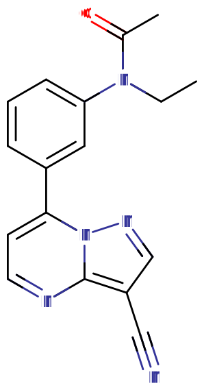

# 扎来普隆

[◀返回](index.md)

!!! danger "危险联用"

    **当 [GABA 类物质](../文档/GABA.md)与其他[抑制剂](../文档/药物分类/抑制剂.md)（如[阿片类药物](../文档/药物分类/阿片类药物.md)、[苯二氮卓类物质](../文档/药物分类/苯二氮卓类物质.md)、[巴比妥类物质](../文档/药物分类/巴比妥类物质.md)、[加巴喷丁类物质](../文档/药物分类/加巴喷丁类物质.md)、[噻吩二氮卓类物质](../文档/药物分类/噻吩二氮卓类物质.md)或[酒精](酒精.md)）联用时，可能会导致致命的[药物过量](../文档/药物过量.md)。[^1]**

    我们强烈建议不要把这些物质混用，特别是[中等](../文档/药物剂量分类.md)到[严重](../文档/药物剂量分类.md)剂量的时候。

| **化学信息** | 扎来普隆（Zaleplon）                                                          |
| ------------ | ----------------------------------------------------------------------------- |
| 结构式       |                                                      |
| 分子式       | C17H15N5O                                    |
| CAS 号       | 151319-34-5                                                                   |
| **化学命名** |                                                                               |
| 常见名称     | Sonata, Starnoc, Andante                                                      |
| 取代名称     | Zaleplon                                                                      |
| 系统命名     | N-[3-(3-cyanopyrazolo[1,5-a]pyrimidin-7-yl)phenyl]-N-ethylacetamide           |
| **类别归属** |                                                                               |
| 精神活性分类 | _[抑制剂](../文档/药物分类/抑制剂.md) / [致幻剂](../文档/药物分类/致幻剂.md)_ |
| 化学分类     | _吡唑并嘧啶_                                                                  |

| [**给药途径**](../文档/给药途径.md) | 🔽 [口服](../文档/给药途径.md#口服) |
| ----------------------------------- | ------------------------------ |
| 生物利用度                          | 30% ± 10%[^2]                  |
| [**剂量**](../文档/给药剂量.md)     |                                |
| 阈值                                | 5 mg                           |
| 轻微                                | 5 \~ 10 mg                     |
| 中等                                | 10 \~ 30 mg                    |
| 强烈                                | 30 \~ 60 mg                    |
| 严重                                | 60 mg +                        |
| [**药效时长**](../文档/药效时长.md) |                                |
| 总时长                              | 90 \~ 120 分钟                 |
| 药效发作                            | 5 \~ 15 分钟                   |
| 药效达峰                            | 30 \~ 60 分钟                  |
| 药效褪去                            | 10 \~ 20 分钟                  |
| 药效残余                            | 2 \~ 4 小时                    |

- !!! warning "警告"

        由于个体体重、耐受性、新陈代谢和个人敏感度的差异，请务必从低剂量开始。参见[负责任的用药部分](../文档/负责任的用药索引页.md)。

    !!! info "[免责声明](../关于本站/免责声明.md)"

        本站的[给药剂量](../文档/给药剂量.md)信息收集自用户和[相关资源](../文档/科学信息索引页.md)，仅供教育目的使用。这不是医疗建议，应与其他来源核实以确保准确性。

**扎来普隆**（商品名 **Sonata**）是一种非苯二氮卓类催眠药物。它属于[催眠药](../文档/催眠药.md)和[抑制剂](../文档/药物分类/抑制剂.md)精神活性类别，在化学上属于吡唑并嘧啶类。当出于娱乐目的服用时（剂量远高于处方剂量），它能够产生强烈的、奇异的非典型致幻、催眠、谵妄甚至迷幻效果。有些使用者会选择与处方不同的给药方式，比如[鼻吸](../文档/给药途径.md)，来让药效更快发作。

扎来普隆是被称为「Z 药」家族的一员。其他的 Z 药包括[唑吡坦](唑吡坦.md)（Ambien）和[佐匹克隆](佐匹克隆.md)。这些药物被设计成比苯二氮卓类药物具有更具选择性的催眠作用。

建议扎来普隆仅用于短期治疗。通常不建议每天或持续使用这种药物。

## 化学

扎来普隆是一种吡唑并嘧啶，在 3 位有一个腈基，在 7 位有一个 3-(N-乙基乙酰氨基)苯基取代基。

## 药理学

扎来普隆的药理学特征与[苯二氮卓类物质](../文档/药物分类/苯二氮卓类物质.md)相似。扎来普隆是苯二氮卓 α1[受体](../文档/受体.md)的完全[激动剂](../文档/受体激动剂.md)，该受体位于大脑中的 [GABAA](../文档/GABA.md) 受体离子载体复合物上，对 α2 和 α3 亚型的亲和力较低。它选择性地增强 GABA 的作用，类似于苯二氮卓类药物，但选择性更强。[^3]

关于服用这种化合物如何导致奇异的[幻觉](../药效/幻觉状态.md)，其背后的药理机制尚不清楚，似乎也没有被直接研究过。

## 主观效应

!!! info "[免责声明](../关于本站/免责声明.md)"

    _下列效应引用自 [**主观效应索引**](../药效/index.md) (**SEI**)，这是一个基于轶事用户报告和个人分析的开放研究文献。因此，应带着健康的怀疑态度来看待它们。_

    _同样值得注意的是，这些效应不一定会以可预测或可靠的方式发生，尽管较高的剂量更可能引发全方位的效应。同样，**不良反应** 随着剂量的增加变得越来越可能，可能包括 **成瘾、严重伤害或死亡** ☠。_

- ### **身体效应** 

    扎来普隆的躯体效应几乎与[阿普唑仑](阿普唑仑.md)等[苯二氮卓类物质](../文档/药物分类/苯二氮卓类物质.md)相同，但[肌肉松弛](../药效/肌肉松弛.md)作用较弱。它们可以细分为几个部分。

    具体描述如下，通常包括：

    - **[镇静](../药效/镇静.md)**：与其他[GABA 类](../文档/GABA.md)[抑制剂](../文档/药物分类/抑制剂.md)相比，这种化合物的镇静作用在将其与其他效果按比例比较时明显更强。这就是为什么扎来普隆通常被作为助眠剂处方给那些受失眠困扰的人。
    - **[躯体欣快感](../药效/躯体欣快感.md)**：这表现为一种温暖、柔软的光芒，从使用者的身体中心散发出来。
    - **[头晕](../药效/头晕.md)**
    - **[头痛](../药效/头痛.md)**
    - **[恶心](../药效/恶心.md)**：在中等至严重剂量下，胃部可能会感到轻微不适。一旦呕吐，这种感觉通常会消失。
    - **[肌肉松弛](../药效/肌肉松弛.md)**：虽然肌肉松弛肯定是存在的，但它通常只在较重剂量下显现，并且明显弱于苯二氮卓类药物。
    - **[运动控制丧失](../药效/运动控制丧失.md)**
    - **[呼吸抑制](../药效/呼吸抑制.md)**
    - **[心率增快](../药效/心率增快.md)**
    - **[血压升高](../药效/血压升高.md)**
    - **[癫痫发作抑制](../药效/癫痫发作抑制.md)**[^3]

    - **[胃痉挛](../药效/胃痉挛.md)**

- ### **[分离效应](../药效/分离效应.md)** 
    - **[视觉分离](../药效/视觉分离.md)**：这种效应仅在中等至严重的娱乐剂量下出现，并且与[DXM](右美沙芬.md)和[氯胺酮](氯胺酮.md)等[解离剂](../文档/药物分类/解离剂.md)相当。它通常导致感觉视觉变得遥远或模糊，就像通过屏幕或窗户观看一样。然而，它并不像传统解离剂那样能够产生高端的视觉分离，如[孔洞、空间和空虚](../药效/视觉分离.md)或[幻觉结构](../药效/视觉分离.md)。这可能是因为扎来普隆的镇静作用会使用户在远低于达到这种状态所需的剂量下就失去意识。
    - **[意识分离](../药效/意识分离.md)**：这种效应仅在中等至严重的娱乐剂量下出现，并且与[DXM](右美沙芬.md)和[氯胺酮](氯胺酮.md)等[解离剂](../文档/药物分类/解离剂.md)相当。然而，它并不像解离剂那样能够产生高端的认知分离。这可能是因为扎来普隆的镇静作用会使用户在远低于达到这种状态所需的剂量下就失去意识。

- ### **视觉效应** 

    扎来普隆的视觉效应与[谵妄剂](../文档/药物分类/谵妄剂.md)、[解离剂](../文档/药物分类/解离剂.md)和[迷幻剂](../文档/药物分类/迷幻剂.md)的某些方面相当。在较低剂量下，这些效应表现为简单的[视觉抑制](../药效/视觉抑制.md)，但在较高剂量下，它们可能会升级为奇异而独特的完全复杂的幻觉状态。

    - **[复视](../药效/复视.md)**
    - **[物体激活](../药效/物体激活.md)**
    - **[视觉锐度抑制](../药效/视觉锐度抑制.md)**
    - **[漂移](../药效/漂移.md)**：在较重剂量下，这种化合物可能会诱发景色、墙壁、物体和人看起来融化和扭曲的体验，这与赛洛辛或[LSD](LSD.md)等传统[迷幻剂](../文档/药物分类/迷幻剂.md)相当。
    - **[内部幻觉](../药效/内部幻觉.md)** (_[自主实体](../药效/自主实体.md)_; _[场景、布景和景观](../药效/场景、布景和景观.md)_; _[视角幻觉](../药效/视角幻觉.md)_ 和 _[情景与情节](../药效/情景与情节.md)_) - 这种化合物上的内部幻觉可以描述为生动的梦境般的状态。这种效应通常在中等剂量下短暂且自发地发生，但随着剂量的增加，其发生率和持续时间会逐渐延长，最终变得包罗万象。通过其[变体](../药效/内部幻觉.md)可以全面描述为：可信度上是谵妄的，风格上是互动的，内容上新体验和记忆重放各占一半，可控性上是自主的，风格上是实体的。
    - **[外部幻觉](../药效/外部幻觉.md)** (_[自主实体](../药效/自主实体.md)_; _[场景、布景和景观](../药效/场景、布景和景观.md)_; _[视角幻觉](../药效/视角幻觉.md)_ 和 _[情景与情节](../药效/情景与情节.md)_) - 与其他类别的[致幻剂](../文档/药物分类/致幻剂.md)相比，这种效应仅在严重剂量下发生。通过其[变体](../药效/内部幻觉.md)可以全面描述为：可信度上是谵妄的（虽然质量上不是），可控性上是自主的，风格上是实体的。这些幻觉最常见的主题既包括日常发生的事情（如与不在场的人交谈），也包括不可能发生的事情（如无生命的物体复活）。与谵妄剂不同，这些幻觉通常不被描述为可怕或令人不安的。

- ### **[认知效应](../药效/认知效应.md)** 

    扎来普隆的认知效应与[苯二氮卓类物质](../文档/药物分类/苯二氮卓类物质.md)相当，尽管[焦虑抑制](../药效/焦虑抑制.md)作用较弱。在较重的娱乐剂量下，通常与谵妄剂相关的其他效应可能会出现。这些包括[思维混乱](../药效/思维混乱.md)和[妄想](../药效/妄想.md)。具体效应可以细分为几个部分。

    具体描述如下，通常包括：

    - **[失忆](../药效/失忆.md)**：许多服用扎来普隆的使用者经常声称，醒来后，他们几乎不记得入睡的过程，也无法回忆起之前的事件。
    - **[焦虑抑制](../药效/焦虑抑制.md)**：这种效应通常只在较重剂量下发生，并且明显弱于苯二氮卓类药物，但在同等镇静剂量下与[唑吡坦](唑吡坦.md)的强度相似。
    - **[强迫性补量](../药效/强迫性补量.md)**
    - **[认知欣快](../药效/认知欣快.md)**
    - **[精神病发作](../药效/精神病发作.md)**
    - **[妄想](../药效/妄想.md)**[^4] [^5]：在较重剂量下，这种效应可能会以与传统谵妄剂相当的方式出现。它通常伴随着倾向于加强这种妄想信念的[外部幻觉](../药效/外部幻觉.md)。
    - **[清醒错觉](../药效/清醒错觉.md)**：这是一种错误的信念，即尽管有明显的相反证据（如严重的认知障碍和无法与他人充分交流），但仍认为自己完全清醒。它最常发生在严重剂量下。体验报告表明，扎来普隆引发这些妄想的强度可能与苯二氮卓类药物相当或更强。
    - **[去抑制](../药效/去抑制.md)**
    - **[梦境强化](../药效/梦境强化.md)**
    - **[狂笑](../药效/狂笑.md)**
    - **[躁狂](../药效/躁狂.md)**
    - **[既视感](../药效/既视感.md)**
    - **[混乱](../药效/混乱.md)**
    - **[音乐欣赏能力增强](../药效/音乐欣赏能力增强.md)**
    - **[暗示性强化](../药效/暗示性强化.md)**
    - **[分析能力抑制](../药效/分析能力抑制.md)**
    - **[语言能力抑制](../药效/语言能力抑制.md)**：在较重剂量的扎来普隆下，人们可能会发现自己很难连贯地表达思想。
    - **[短期记忆抑制](../药效/记忆抑制.md)**：在较重剂量下，由于短期记忆受到抑制，许多用户发现他们无法回忆起 10 或 30 秒前的事情。这可能会导致混乱、重复行为和[思维循环](../药效/思维循环.md)。
    - **[思维减速](../药效/思维减速.md)**
    - **[思维混乱](../药效/思维混乱.md)**：在较低剂量下，这种效应表现为试图入睡时精神喋喋不休的混乱和质量变化。在较高剂量下，这种效应往往与去抑制和妄想协同作用，导致奇异的决策过程或思维过程，这些过程通常不符合性格，并且一旦用户从体验中清醒过来，就会觉得毫无意义。
    - **[专注力抑制](../药效/专注力抑制.md)**[^3]

- ### **听觉效应** 
    - **[听觉幻觉](../药效/听觉幻觉.md)**：在较重剂量下，人们可能会体验到想象中的声音，如人声或音乐。这些通常伴随着[外部幻觉](../药效/外部幻觉.md)和[妄想](../药效/妄想.md)。
    - **[听觉增强](../药效/听觉锐度增强.md)**

### 体验报告

目前我们的[报告索引](../报告/index.md)中没有关于该物质效果的体验报告。你可以在[本站 Github 仓库](https://github.com/SalviaSWC/FreeODwiki)提交你自己的体验报告。

其他的体验报告可以在这里找到：

- [Erowid Experience Vaults: Zaleplon](https://www.erowid.org/experiences/subs/exp_Pharms_Zaleplon.shtml)

## 毒性与伤害潜能

单独使用时，扎来普隆相对于剂量的毒性可能较低。然而，当与[苯二氮卓类物质](../文档/药物分类/苯二氮卓类物质.md)、[酒精](酒精.md)或[阿片类药物](../文档/药物分类/阿片类药物.md)等[抑制剂](../文档/药物分类/抑制剂.md)混合使用时，可能会导致致命的[呼吸抑制](../药效/呼吸抑制.md)。[^3]

与其他 Z 药一样，使用扎来普隆可能会导致奇异和危险的行为。

强烈建议在使用这种物质时采取[伤害减少措施](../文档/负责任的用药索引页.md)。

### 耐受性与成瘾潜力

扎来普隆具有中等程度的生理和心理成瘾性。

每天使用几周内就会对[镇静](../药效/镇静.md)-[催眠](../文档/催眠药.md)效应产生耐受性。然而，当用于治疗时，对扎来普隆缩短入睡时间的效应似乎不会产生耐受性。停止使用后，耐受性会在 7-14 天内恢复到基线。在连续几周或更长时间的稳定给药后突然停止使用，可能会出现戒断症状或反弹症状，可能需要逐渐减少剂量。

### 危险药物联用

!!! warning "警告"

    _许多精神活性物质在单独使用时相对安全，但与某些其他物质联用可能会突然变得危险甚至危及生命。_

    _请务必进行独立研究（例如 [Google](https://www.google.com)、[DuckDuckGo](https://www.duckduckgo.com)、[PubMed](https://pubmed.ncbi.nlm.nih.gov/)），确保多种物质的组合是安全的。部分列出的相互作用来自 [TripSit](https://combo.tripsit.me)。_

- **抑制剂** (_[1,4-丁二醇](1,4-丁二醇.md)、[2M2B](2M2B.md)、[酒精](酒精.md)、[苯二氮卓类物质](../文档/药物分类/苯二氮卓类物质.md)、[巴比妥类物质](../文档/药物分类/巴比妥类物质.md)、[GHB](GHB.md)/[GBL](GBL.md)、[甲喹酮](甲喹酮.md)、[阿片类药物](../文档/药物分类/阿片类药物.md)_)：这种组合会增强彼此引起的[肌肉松弛](../药效/肌肉松弛.md)、[失忆](../药效/失忆.md)、[镇静](../药效/镇静.md)和[呼吸抑制](../药效/呼吸抑制.md)。在较高剂量下，这可能会导致突然的、意外的意识丧失以及危险程度的呼吸抑制。在无意识状态下呕吐窒息的风险也会增加。如果在意识丧失前发生[恶心](../药效/恶心.md)或呕吐，使用者应尝试以[恢复体位](../文档/恢复体位.md)入睡，或者让朋友帮忙摆成该体位。
- **解离剂**：这种组合可能会不可预测地增强彼此引起的[失忆](../药效/失忆.md)、[镇静](../药效/镇静.md)、[运动控制丧失](../药效/运动控制丧失.md)和[妄想](../药效/妄想.md)。它还可能导致突然的意识丧失，并伴有危险程度的[呼吸抑制](../药效/呼吸抑制.md)。如果在意识丧失前发生[恶心](../药效/恶心.md)或呕吐，使用者应尝试以[恢复体位](../文档/恢复体位.md)入睡，或者让朋友帮忙摆成该体位。
- **兴奋剂**：兴奋剂会掩盖抑制剂的[镇静](../药效/镇静.md)作用，而这正是大多数人用来判断自己中毒程度的主要因素。一旦兴奋剂作用消退，抑制剂的作用将显著增加，导致加剧的[去抑制](../药效/去抑制.md)、[运动控制丧失](../药效/运动控制丧失.md)和危险的[断片状态](../药效/失忆.md)。如果这种组合不密切监测液体摄入量，也可能导致严重脱水。如果选择混合使用这些物质，应严格限制自己每小时只服用一定量的剂量，直到达到最大阈值。

## 法律地位

- **欧盟**：扎来普隆在欧盟已被撤回。
- **瑞士**：扎来普隆于 2011 年在瑞士被撤回。
- **美国**：根据《受控物质法》（CSA），扎来普隆属于附表 IV，这意味着它被判定为"具有一定的滥用潜力。" 没有处方持有是违法的。
- **加拿大**：扎来普隆在加拿大未被列入管制。然而，如果没有有效处方持有可能是违法的。
- **俄罗斯**：扎来普隆可通过处方获得。

## 另见

- [负责任的用药](../文档/负责任的用药索引页.md)
- [致幻剂](../文档/药物分类/致幻剂.md)
- [谵妄剂](../文档/药物分类/谵妄剂.md)
- [催眠药](../文档/催眠药.md)
- [唑吡坦](唑吡坦.md)
- [佐匹克隆](佐匹克隆.md)

## 外部链接

- [Zaleplon (Wikipedia)](http://en.wikipedia.org/wiki/Zaleplon)
- [Zaleplon (TiHKAL / Isomer Design)](https://isomerdesign.com/PiHKAL/explore.php?id=9530)

## 引用文献

[^1]: [_Risks of Combining Depressants - TripSit_](https://tripsit.me/combining-depressants/)

[^2]: Profiles of Drug Substances, Zaleplon pharmacokinetics and absolute bioavailability | <https://onlinelibrary.wiley.com/doi/10.1002/(SICI)1099-081X(199904)20:3%3C171::AID-BDD169%3E3.0.CO;2-K>

[^3]: Profiles of Drug Substances, Excipients and Related Methodology | <https://www.sciencedirect.com/science/article/pii/S1871512510350084>

[^4]: Ambien, delusions, and violence: Is there a link? | <https://www.psychologytoday.com/blog/the-measure-madness/201005/ambien-delusions-and-violence-is-there-link>

[^5]: Ambien Side Effects Center (rxlist) | <http://www.rxlist.com/ambien-side-effects-drug-center.htm>
