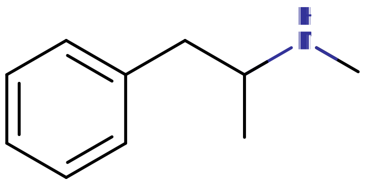
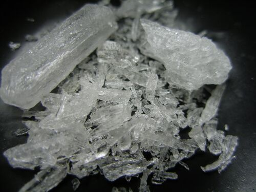
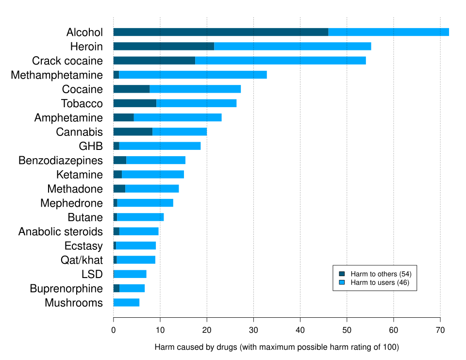

# 甲基苯丙胺

[◀返回](index.md)

> 卧槽，冰！

| 化学信息     | 甲基苯丙胺                                                                                        |
| ------------ | ------------------------------------------------------------------------------------------------- |
| 结构式       |                                                                   |
| 分子式       | C10H15N                                                                     |
| CAS 号       | 537-46-2（右旋） 7632-10-2（消旋）                                                             |
| **化学命名** |                                                                                                   |
| 通用名称     | 甲基苯丙胺、Meth、水晶、去氧麻黄碱、Speed、Ma、冰、玻璃、碎片、Tina、T、Tweak、Crank、Shabu、Yaba |
| 取代名称     | N-甲基苯丙胺                                                                                      |
| 系统名称     | N-甲基-1-苯基丙-2-胺                                                                              |
| **类别归属** |                                                                                                   |
| 精神药效分类 | [兴奋剂](../文档/药物分类/兴奋剂.md)                                                              |
| 化学分类     | [苯丙胺类物质](../文档/药物分类/苯丙胺类物质.md)                                                  |

### 给药途径与剂量

> **⚠️ 警告：** 由于个人体重、耐受性、代谢和个人敏感性的差异，请务必从低剂量开始。请参阅[负责任的用药索引页](../文档/负责任的用药索引页.md)。

| [**给药途径**](../文档/给药途径.md) |   [抽吸](../文档/给药途径.md#抽吸)   |   [口服](../文档/给药途径.md#口服)    |   [鼻吸](../文档/给药途径.md#鼻吸)   | [直肠给药](../文档/给药途径.md#直肠给药]) | [静脉注射](../文档/给药途径.md#静脉注射) |
| ----------------------------------- | :----------------------------------: | :-----------------------------------: | :----------------------------------: | :---------------------------------------: | ---------------------------------------- |
| 生物利用度                          |                > 90%                 |               ~ 70%[^1]               |                > 90%                 |                   ~ 99%                   | ~ 100%                                   |
| **剂量**                            |                                      |                                       |                                      |                                           |                                          |
| 阈值                                |                < 5 mg                |                < 5 mg                 |                < 5 mg                |                  < 5 mg                   | < 5 mg                                   |
| 轻微                                |              5 \~ 10 mg              |              5 \~ 10 mg               |              5 \~ 10 mg              |                5 \~ 10 mg                 | 5 \~ 10 mg                               |
| 中等                                |             10 \~ 20 mg              |              10 \~ 25 mg              |             10 \~ 30 mg              |                10 \~ 30 mg                | 10 \~ 30 mg                              |
| 强烈                                |             20 \~ 60 mg              |              25 \~ 50 mg              |             30 \~ 60 mg              |                30 \~ 40 mg                | 30 \~ 40 mg                              |
| 严重                                |               60 mg +                |                50 mg +                |               60 mg +                |                  40 mg +                  | 40 mg +                                  |
| **药效时长**                        |                                      |                                       |                                      |                                           |                                          |
| 总时长                              | 2 \~ 6 小时 （不常使用者可达12h） | 8 \~ 12 小时 （不常使用者可达24h） | 4 \~ 7 小时 （不常使用者可达12h） |   6 \~ 10 小时 （不常使用者可达18h）   | 4 \~ 8 小时 （不常使用者可达18h）     |
| 药效发作                            |              7 \~ 10 秒              |             15 \~ 45 分钟             |             3 \~ 5 分钟              |               5 \~ 15 分钟                | 15 \~ 30 秒                              |
| 药效上升                            |              5 \~ 10 秒              |              1 \~ 3 小时              |             3 \~ 5 分钟              |                3 \~ 5 分钟                | 1 \~ 2 分钟                              |
| 药效达峰                            |             1 \~ 3 小时              |              3 \~ 5 小时              |            1.5 \~ 3 小时             |                2 \~ 4 小时                | 1 \~ 3 小时                              |
| 药效褪去                            |             1 \~ 3 小时              |              3 \~ 4 小时              |             2 \~ 4 小时              |                3 \~ 5 小时                | 3 \~ 4 小时                              |
| 药效残余                            |             2 \~ 24 小时             |             12 \~ 24 小时             |             6 \~ 24 小时             |               12 \~ 24 小时               | 12 \~ 24 小时                            |

> **免责声明：** 本站的[剂量](../文档/给药剂量.md)信息仅用于教育目的，收集自用户和各类资源。这并不是建议，请务必参考其他来源以确保准确性。

**甲基苯丙胺**（也被称为 **Meth**, **冰**, **肉**, **水晶**等 [^2] [^3]）是一种[苯丙胺类物质](../文档/药物分类/苯丙胺类物质.md)的经典[兴奋剂](../文档/药物分类/兴奋剂.md)。它在结构上与[苯丙胺](苯丙胺.md)相关，但由于其脂溶性相对较高，它能更快地穿过血脑屏障。[^4] 它通过增加大脑中[血清素](../文档/血清素.md)、[多巴胺](../文档/多巴胺.md)和[去甲肾上腺素](../文档/去甲肾上腺素.md)这三种[神经递质](../文档/神经递质.md)的水平来产生药效。

甲基苯丙胺于1893年由日本化学家长井长义首次从[麻黄碱](麻黄碱.md)中合成。[5^] 与[海洛因](海洛因.md)和[可卡因](可卡因.md)一样，它作为一种危险且极具成瘾性的「街头药物」而臭名昭著。[^6]

[主观效应](../药效/index.md)包括[动机增强](../药效/动机增强.md)、[耐力增强](../药效/耐力增强.md)、[食欲抑制](../药效/食欲抑制.md)、[性欲增强](../药效/性欲增强.md)和[欣快感](../药效/认知欣快.md)。长期大剂量使用可能诱发[焦虑](../药效/焦虑.md)与[偏执](../药效/偏执.md)、[妄想](../药效/妄想.md)、[思维混乱](../药效/思维混乱.md)、[精神病发作](../药效/精神病发作.md)以及暴力行为。它与[强迫性补量](../药效/强迫性补量.md)密切相关，尤其是当它被[抽吸](../文档/给药途径.md)或[静脉注射](../文档/给药途径.md)时，因为它在初始给药后会产生压倒性的[欣快感](../药效/躯体欣快感.md)冲动。

甲基苯丙胺已被证明具有极高的滥用和成瘾潜力；由于其产生的强烈欣快感，它被广泛认为是成瘾性最强的物质之一。此外，与治疗剂量的[苯丙胺](苯丙胺.md)不同，中等到严重的[娱乐性用药](../文档/娱乐性用药.md)剂量的甲基苯丙胺被认为对人类具有直接的[神经毒性](../文档/神经递质.md)，会损害中枢神经系统内的[多巴胺](../文档/多巴胺.md)和[血清素](../文档/血清素.md)[神经元](../文档/神经递质.md)。在非人类哺乳动物中，已知会发生单胺能末梢变性和神经元凋亡（细胞死亡）。[^7] 在人类中，这种效应同样具有[神经毒性](../文档/神经递质.md)。[^8] 它还表现出心脏毒性，包括[血压升高](../药效/血压升高.md)以及中风和心脏病发作的风险增加。

如果使用这种物质，强烈建议采取[伤害减少措施](../文档/负责任的用药索引页.md)。

|                       |
| :------------------------------------------------: |
| 纯净的甲基苯丙胺盐酸盐「碎片」，通常被称为「冰毒」 |

## 历史与文化

苯丙胺于1887年由罗马尼亚化学家拉扎尔·埃德莱亚努在德国首次合成，他将其命名为苯基异丙基胺。[^9] 随后不久，甲基苯丙胺于1893年由日本化学家长井长义从麻黄碱中合成。[^10] 这两种药物直到1934年才有了药理用途，当时 Smith, Kline, and French 公司开始以 Benzedrine 的商品名销售苯丙胺吸入剂作为去充血剂。[^11] 在第二次世界大战期间，盟军和轴心国军队都广泛使用了苯丙胺和甲基苯丙胺，利用它们的兴奋和增强表现的作用。[^12] [^13]

最终，随着这些药物的成瘾特性被人们所知，各国政府开始对这些药物的销售实施严格控制。[^14] 例如，1970年在美国，甲基苯丙胺和苯丙胺根据《受控物质法》成为了二类受控物质。[^15]

尽管政府进行了严格控制，苯丙胺和甲基苯丙胺仍被来自不同背景的个人出于各种目的合法或非法地使用。[^16] [^17] [^18] [^19] 由于这些药物存在巨大的地下市场，它们经常由秘密化学家非法合成、走私并在黑市上销售。[^20] 根据药物和前体物质的查获情况来看，非法苯丙胺的生产和贩运远没有甲基苯丙胺那么普遍。

甲基苯丙胺盐酸盐经美国食品药品监督管理局 (USFDA) 批准，商品名为「Desoxyn」。[^21] 然而，由于其滥用潜力，它很少被处方，通常仅用于所有其他治疗选择都已耗尽的严重肥胖或 ADHD 病例。

## 化学

甲基苯丙胺，即 N-甲基苯丙胺，是[苯丙胺](苯丙胺.md)家族的一种合成分子。苯丙胺类分子包含一个苯乙胺核心，其特征是一个苯环通过一个乙基链与一个氨基 (NH2) 相连，并在 Rα 位置有一个额外的甲基取代。苯丙胺类是 α-甲基化的苯乙胺。甲基苯丙胺在 RN 位置有一个额外的甲基取代，这一取代也存在于 [MDMA](MDMA.md)、[甲卡西酮](甲卡西酮.md)和[甲氧麻黄酮](4-MMC.md)中。

### 立体异构体

甲基苯丙胺以两种[异构体](../文档/异构体.md)的形式存在：右旋和左旋。右旋甲基苯丙胺（也称为 d-甲基苯丙胺）是一种比左旋甲基苯丙胺更强的中枢神经系统 (CNS) 兴奋剂；然而，当误用时，两者都被认为具有成瘾性，并且在严重的娱乐剂量下都能产生类似的毒性症状。

## 药理学

甲基苯丙胺主要通过作为[多巴胺](../文档/多巴胺.md)、[去甲肾上腺素](../文档/去甲肾上腺素.md)和[血清素](../文档/血清素.md)等[神经递质](../文档/神经递质.md)的[神经递质释放剂](../文档/神经递质释放剂.md)作用于中枢神经系统 (CNS) 。[^22] 它还充当某些转运神经元的[神经递质再摄取抑制剂](../文档/神经递质再摄取抑制剂.md)，从而使去甲肾上腺素等神经递质留在突触中。[^23] 甲基苯丙胺还充当某些转运神经元的逆向转运体，通过迫使神经递质离开其储存囊泡，并使多巴胺转运体反向工作，将其排入突触间隙，从而增加单胺水平。[^24] [^25] 甲基苯丙胺增加单胺水平的其他已知机制包括：

- 减少细胞表面多巴胺转运体的表达。
- 通过抑制[单胺氧化酶](../文档/单胺氧化酶抑制剂.md) (MAO) 的活性来增加细胞质中的单胺水平。
- 增加多巴胺合成酶酪氨酸羟化酶 (TH) 的活性和表达。

除了释放大量的单胺外，甲基苯丙胺还具有较高的脂溶性，这使得药物能相对较快地穿过血脑屏障，与其他[兴奋剂](../文档/药物分类/兴奋剂.md)相比，药效发作更快。[^4] 所有这些都会导致奖赏感、欣快感和刺激感，以及不愉快的药效褪去过程。

## 主观效应

> **免责声明：** 下面列出的效应引用了 [**主观效应索引**](../药效/index.md) (**SEI**)。这些效应不一定以可预测或可靠的方式发生，尽管高剂量更容易诱发全谱效应。同样，**不良反应** 随剂量增加而变得越来越可能，可能包括 **成瘾、严重受伤或死亡** ☠。

### **[躯体效应](../药效/躯体效应.md)** 

**[兴奋](../药效/兴奋.md)** - 在对躯体能量水平的影响方面，甲基苯丙胺通常被认为是非常有活力和刺激性的，其方式与[苯丙胺](苯丙胺.md)相同，但比[莫达菲尼](莫达菲尼.md)、[咖啡因](咖啡因.md)和 [MDMA](MDMA.md) 更强。它与 MDMA 的刺激感相似但又有所不同，会鼓励人们进行跳舞、社交、跑步或打扫卫生等体力活动。甲基苯丙胺呈现出的这种特定风格的刺激可以被描述为强制性的。这意味着在较高剂量下，很难或不可能保持静止，会出现咬牙、不由自主的身体颤抖和振动，导致全身剧烈摇晃、双手不稳以及普遍缺乏运动控制。

- **[躯体欣快感](../药效/躯体欣快感.md)** - 作为一种强效兴奋剂，甲基苯丙胺能够产生强烈的躯体欣快感，尤其是当它被[抽吸](../文档/给药途径.md)或[静脉注射](../文档/给药途径.md)时。然而，初始的欣快感冲动可能会在物质药效完全结束前就消失，这会促使[强迫性补量](../药效/强迫性补量.md)，从而产生极具破坏性的累积效应。
- **[心律异常](../药效/心律异常.md)**
- **[血压升高](../药效/血压升高.md)**
- **[心率增快](../药效/心率增快.md)**
- **[食欲抑制](../药效/食欲抑制.md)**
- **[体味改变](../药效/体味改变.md)** - 甲基苯丙胺可能会在尿液、汗水和分泌物中留下非常独特的气味。
- **[支气管扩张](../药效/支气管扩张.md)**
- **[脱水](../药效/脱s水.md)**
- **[尿频](../药效/尿频.md)**
- **[体温升高](../药效/体温升高.md)**
- **[出汗增加](../药效/出汗增加.md)**
- **[肌肉收缩](../药效/肌肉收缩.md)**
- **[肌肉痉挛](../药效/肌肉痉挛.md)**
- **[耐力增强](../药效/耐力增强.md)** - 这种效应比任何其他常用的[兴奋剂](../文档/药物分类/兴奋剂.md)都更显著。
- **[触觉增强](../药效/触觉增强.md)**
- **[触觉幻觉](../药效/触觉幻觉.md)** - 高剂量或长期使用某些兴奋剂可能导致皮肤表面或皮下有虫子爬行的幻觉感。这通常被称为「寄生虫妄想」，非正式地称为「冰毒螨」。
- **[磨牙](../药效/磨牙.md)**
- **[暂时性勃起功能障碍](../药效/暂时性勃起功能障碍.md)**
- **[瞳孔扩大](../药效/瞳孔扩大.md)**
- **[视物振动](../药效/视物振动.md)** - 在高剂量下，人的眼球可能会开始自发地快速来回摆动。
- **[癫痫发作](../药效/癫痫发作.md)** - 这虽然不常见，但在有预兆的人群中可能会发生，尤其是在脱水、疲劳或营养不良等身体透支的情况下。

### **[视觉效应](../药效/视觉效应.md)** 

甲基苯丙胺的视觉效应通常不太一致，在高剂量下才略微明显。它们在某种程度上可与[谵妄剂](../文档/药物分类/谵妄剂.md)产生的视觉效果相提并论，且在黑暗区域更频繁。由长时间[清醒](../药效/清醒.md)引起的严重睡眠剥夺会导致更强烈的视觉效果甚至[外部幻觉](../药效/外部幻觉.md)。

#### 抑制

- **[复视](../药效/复视.md)**

#### 扭曲

- **[漂移](../药效/漂移.md)** - 这种效应通常很细微，仅在较高剂量或与[大麻](大麻.md)联用时出现。
- **[亮度改变](../药效/亮度改变.md)**

#### 幻觉状态

- **[物体改变](../药效/物体改变.md)** - 这种效应极少发生，通常仅在用户服用高剂量、处于药效褪去期或长时间保持清醒时才会出现。

### **[认知效应](../药效/认知效应.md)** 

甲基苯丙胺的认知效应可以分为几个组成部分，这些部分随剂量成比例增强。甲基苯丙胺的一般心境被许多人描述为极度的精神[兴奋](../药效/兴奋.md)、[专注力强化](../药效/专注力强化.md)、[自我膨胀](../药效/自我膨胀.md)和强大的欣快感。

- **[分析能力增强](../药效/分析能力增强.md)**
- **[强迫性补量](../药效/强迫性补量.md)**
- **[自我膨胀](../药效/自我膨胀.md)**
- **[认知欣快](../药效/认知欣快.md)** - 与其他多巴胺能兴奋剂如[苯丙胺](苯丙胺.md)甚至[可卡因](可卡因.md)相比，这种效应通常非常强烈。
- **[共情、情感和社交能力增强](../药效/共情、情感和社交能力增强.md)** - 这种效应较轻微，通常在最初几次使用后或产生耐受性后消失。
- **[专注力强化](../药效/专注力强化.md)** - 在低到中等剂量下最有效。
- **[性欲增强](../药效/性欲增强.md)**
- **[音乐欣赏能力增强](../药效/音乐欣赏能力增强.md)**
- **[记忆增强](../药效/记忆增强.md)**
- **[动机增强](../药效/动机增强.md)**
- **[思维加速](../药效/思维加速.md)**
- **[思维组织](../药效/思维组织.md)**
- **[时间扭曲](../药效/时间扭曲.md)** - 感觉时间流逝得比平时快得多。
- **[清醒](../药效/清醒.md)**

### **药效残余** 

在[兴奋剂](../文档/药物分类/兴奋剂.md)体验的[药效褪去](../药效/药效时长.md)期间，与[药效达峰](../药效/药效时长.md)期间相比，通常会感到消极和不适。这通常被称为「崩盘」，由于[神经递质](../文档/神经递质.md)耗尽而发生。

- **[焦虑](../药效/焦虑.md)**
- **[食欲抑制](../药效/食欲抑制.md)**
- **[认知疲劳](../药效/认知疲劳.md)**
- **[抑郁](../药效/抑郁.md)**
- **[易怒](../药效/易怒.md)**
- **[动力抑制](../药效/动力抑制.md)**
- **[睡眠瘫痪](../药效/睡眠瘫痪.md)**
- **[自杀意念](../药效/自杀意念.md)**
- **[思维减速](../药效/思维减速.md)**
- **[精神病发作](../药效/精神病发作.md)**
- **[清醒](../药效/清醒.md)** - 这种特定的残余效应比其他常用兴奋剂更明显。

### 体验报告

- [体验:35mg 右旋甲基苯丙胺 + 305mg 3-甲基甲卡西酮 + 20mg 2C-B - 在重建前摧毁自我](../报告/psychounautwiki/Experience:35mg_Dextromethamphetamine_%2B_305mg_3-Methylmethcathinone_%2B_20mg_2C-B_-_destroying_myself_before_rebuilding)
- [体验:甲基苯丙胺 (20-40 mg 鼻吸) + 大麻 - 幻觉性过量](</报告/psychounautwiki/Experience:Methamphetamine_(20-40_mg_insufflated)_%2B_cannabis_-_Hallucinatory_Overdose>)

## 毒性与伤害潜力

|                                                                          |
| :---------------------------------------------------------------------------------------------------------------: |
| 2010年 ISCD 研究表格，根据专家陈述对各种药物（合法和非法）进行排名。甲基苯丙胺被发现是总体第四危险的药物。[^26] |

### 神经毒性

有证据表明，长期使用甲基苯丙胺会导致人类脑损伤；这种损伤包括大脑结构和功能的不利变化，例如多个脑区灰质体积的减少。[^27]

与[苯丙胺](苯丙胺.md)不同，甲基苯丙胺对[多巴胺](../文档/多巴胺.md)神经元具有直接的神经毒性。[^28] 此外，由于过度的突触前多巴胺自氧化（一种神经毒性机制），滥用甲基苯丙胺与帕金森病风险增加有关。[^29] [^30] [^31] [^32] 与对多巴胺系统的神经毒性作用类似，甲基苯丙胺也会导致对[血清素](../文档/血清素.md)神经元的神经毒性。[^33] 已证明核心体温升高与甲基苯丙胺神经毒性作用的增加相关。[^34]

### 依赖性与滥用潜力

与其他[兴奋剂](../文档/药物分类/兴奋剂.md)一样，长期使用甲基苯丙胺被认为极具成瘾性，具有很高的滥用潜力，并能在某些用户中引起心理依赖。一旦产生毒瘾，如果突然停止使用，可能会出现渴求和[药物戒断反应](../文档/药物戒断反应.md)。

甲基苯丙胺的耐受性随着长期反复使用而迅速产生。[^35] [^36] 这导致用户不得不服用越来越大的剂量以达到相同的效果。之后，大约需要 3 \~ 7 天耐受性减半，1 \~ 2 周恢复到基线。甲基苯丙胺与所有多巴胺能[兴奋剂](../文档/药物分类/兴奋剂.md)存在交叉耐受。

关于苯丙胺和甲基苯丙胺依赖及滥用的有效治疗方法的证据有限。[^37] 鉴于此， 氟西汀和丙咪嗪在治疗滥用和成瘾方面似乎有一些有限的益处，“目前尚无任何治疗方法被证实对治疗甲基苯丙胺依赖和滥用有效”。

对于高度依赖苯丙胺和甲基苯丙胺的滥用者，“当长期大量使用甲基苯丙胺的人突然停止使用时，许多人报告会出现短暂的戒断综合征，该综合征会在最后一次用药后的 24 小时内发生”。[^38] 长期高剂量使用者出现戒断症状的情况很常见，发生率高达 87.6%，并持续三到四周，其中第一周会出现明显的“崩溃”阶段。[^38] 甲基苯丙胺戒断症状可能包括焦虑、对药物的渴求、情绪低落、疲劳、食欲增加、活动量增加或减少、缺乏动力、失眠或嗜睡以及生动或清醒的梦境。[^38] 戒断症状与依赖程度（即滥用程度）相关。[^38] 与可卡因戒断相关的精神抑郁持续时间更长，程度也更严重。[^39]

虽然很明显，吸入式甲基苯丙胺比口服或鼻吸式苯丙胺更容易上瘾，但关于药物本身是否更容易上瘾，以及如果确实如此，这种差异有多重要，仍存在争议。除了作用持续时间之外，这两种药物的主要区别在于，甲基苯丙胺的中枢活性更高，外周活性更低。原因之一是甲基的脂溶性增加，导致中枢吸收更快。另一个原因是，相同剂量下，甲基苯丙胺释放的多巴胺比例更高。D-甲基苯丙胺从突触释放的多巴胺与去甲肾上腺素的比例约为 1:1.3，而 D-苯丙胺的比例约为 1:2。它们对去甲肾上腺素转运蛋白（NET）和多巴胺转运蛋白（DAT）的影响更为相似，但也存在细微差异。D-甲基苯丙胺对 NET 的亲和力约为 D-苯丙胺的 4 倍，而 D-苯丙胺约为 5 倍。右旋甲基苯丙胺的血清素能活性也略强一些。但这可能只是微不足道的差异，因为右旋甲基苯丙胺释放血清素与去甲肾上腺素的比例仅为 1:60，而右旋苯丙胺的比例为 1:80。这两种药物对血清素转运蛋白（SERT）的亲和力均不明显。

甲基苯丙胺中枢效应相对于外周效应的增强，与兴奋剂使用者普遍的主观感受相符，即甲基苯丙胺带来的快感本身并不像其他药物那样令人感到“紧张不安”。不利的一面是，这种不良反应可能有助于减少有害剂量的使用。然而，这种差异在现实世界中会产生何种影响尚不清楚。一项针对13名甲基苯丙胺使用者的双盲小型研究显示，他们对甲基苯丙胺的偏好程度很低，这可能是由于使用者对这种药物更加熟悉所致。[^41]

强烈建议在使用这种物质时采取减少危害的措施。

### 精神病

滥用甲基苯丙胺会导致[兴奋剂精神病](../文档/兴奋剂精神病.md)，可能表现出各种症状（如[偏执](../药效/偏执.md)、[外部幻觉](../药效/外部幻觉.md)、[妄想](../药效/妄想.md)）。[^38] 一项关于苯丙胺 、 右旋苯丙胺和甲基苯丙胺滥用引起的精神病治疗的综述指出，约有 5%至 15%的使用者无法完全康复。[^38] [^42] 同一项综述还指出，基于至少一项试验， 抗精神病药物能有效缓解急性苯丙胺精神病的症状。[^38] 精神病极少由治疗性用药引起。[^43]

### 药物过量

甲基苯丙胺过量可能导致广泛的症状，在严重剂量下具有潜在致命性。[^44] 中度过量可能诱发心律异常、混乱、排尿困难、高血压或低血压、高热、反射亢进、肌痛、严重焦虑、震颤等症状。[^45] 极大量过量可能产生肾上腺素风暴、甲基苯丙胺精神病、循环衰竭、肾衰竭、[血清素综合征](../文档/血清素综合征.md)等。甲基苯丙胺过量也可能由于多巴胺能和 5-羟色胺能神经毒性而导致轻度脑损伤。[^28] [^33] 甲基苯丙胺中毒致死通常先出现抽搐和昏迷。[^46]

#### 急救措施

急性甲基苯丙胺过量主要通过对症治疗来处理，使用[苯二氮卓类物质](../文档/药物分类/苯二氮卓类物质.md)可以缓解焦虑、高血压、心动过速和癫痫发作等症状。[^47]

### 伤害减少

研究表明，N-乙酰-L-半胱氨酸（NAC）可以阻断甲基苯丙胺的有害神经毒性作用，同时防止大鼠体内的神经递质耗尽，[^48] 目前正在进行治疗甲基苯丙胺依赖的人体临床试验。NAC 也可能有效减轻患者的渴求感和心理依赖性。[^49] NAC 的半衰期较短，因此缓释制剂可能更适合用于减少危害。硒也被证明可以保护大脑免受甲基苯丙胺诱导的神经毒性。[^50] 然而，这些数据尚属初步，可能并不适用于人类。

### 危险的联用

**⚠️ 警告：** 许多物质单独使用时相对安全，但与某些其他物质结合时会突然变得危险甚至危及生命。

- **酒精** - 在兴奋剂作用下饮酒被认为是有风险的，因为它会掩盖酒精的镇静效果，增加脱水和肝损伤风险。
- **GHB/GBL** - 兴奋剂增加呼吸频率，允许更高剂量的镇静剂。如果兴奋剂先失效，可能会导致呼吸抑制。
- **阿片类药物** - 类似于 GHB，如果兴奋剂先失效，阿片类药物可能会导致呼吸骤停。
- **可卡因** - 可卡因的奖赏机制是通过抑制多巴胺转运蛋白（DAT）并增加多巴胺通过细胞膜的胞吐作用介导的。苯丙胺通过 pH 介导的置换机制逆转 DAT 和细胞内囊泡运输的方向，从而阻断多巴胺通过胞吐作用释放的常规机制，因为 Na+/K+ ATPase 的作用受到抑制。可卡因和苯丙胺联合使用会损害心脏，这是由于 5-HT2B 受体激活后，通过 5-羟色胺转运蛋白（SERT）介导的机制所致，而 5-HT2B 受体激活是血清素相关心脏瓣膜病的一种表现。滥用苯丙胺通常引起高血压，联用后可能由于瓣膜活动时血流湍急而增加晕厥的风险。苯丙胺可以逆转可卡因的奖赏机制。 [^51] [^52]
- **大麻** - 兴奋剂会增加[焦虑](../药效/焦虑.md)水平以及[思维循环](../药效/思维循环.md)和[偏执](../药效/偏执.md)的风险。
- **曲马多** - 曲马多和兴奋剂都会增加癫痫发作的风险。
- **右美沙芬** - 两者都会升高心率，严重时可能导致心脏问题。
- **氯胺酮** - 苯丙胺和氯胺酮联用可能导致类似精神分裂症的精神病症状，但其严重程度不及单独使用任一药物，这一点尚存争议。因为苯丙胺能减轻氯胺酮对工作记忆的损害。单独使用苯丙胺可能导致夸大妄想、偏执或躯体妄想，对阴性症状几乎没有影响。然而氯胺酮会因改变认知而导致思维障碍、执行功能障碍和妄想。这些机制是由于苯丙胺通过影响多巴胺的药理作用，导致中脑边缘通路的多巴胺能活性增强；以及氯胺酮通过 NMDA 受体拮抗作用，破坏中脑皮质通路的多巴胺能功能。合用这两种药物，主要表现为思维障碍，并伴有阳性症状。[^53]
- **致幻剂** (如 **[LSD](LSD.md)**, **[麦斯卡林](麦斯卡林.md)**, **[赛洛西宾蘑菇](赛洛西宾蘑菇.md)**) - 增加[焦虑](../药效/焦虑.md)、[偏执](../药效/偏执.md)和[思维循环](../药效/思维循环.md)的风险。

## 法律状态

甲基苯丙胺的生产、分销、销售和持有在许多司法管辖区受到限制或属于非法。[^54] [^55] 甲基苯丙胺已被列入《联合国精神药物公约》附表二。[^56]

- 澳大利亚：甲基苯丙胺被列入第8类管制物质清单，这意味着它可以用于医疗用途，但未经授权持有、生产或供应甲基苯丙胺均属违法行为。[^57] 自 2023 年 10 月 28 日起，澳大利亚首都领地（ACT）已将 1.5 克以下的个人用量甲基苯丙胺非刑事化。[^58]
- 奥地利：根据《奥地利毒品法》（Suchtmittelgesetz Österreich），持有、生产和销售甲基苯丙胺均属违法行为。[^59]
- 巴西：甲基苯丙胺被列为 F2 类违禁精神活性物质。[^60]
- 加拿大：甲基苯丙胺被列入《受管制物质和药物法》（CDSA）第 1 类管制物质清单。[^61]
- 捷克共和国：甲基苯丙胺被列为第 2 类管制物质。[^62]
- 法国：甲基苯丙胺被列为“stupéfiant”（麻醉剂），即一种公认的滥用药物。持有、购买、销售或制造甲基苯丙胺均属违法行为。[^63]
- 德国：甲基苯丙胺于1941年7月1日被列入《鸦片法》（Opiumgesetz）[^64]。自 2008 年 3 月 1 日起，它受《麻醉品法》（Anlage II BtMG）第二附表（Section II）管制[^65]。在此之前，由于它被列入《麻醉品法》（Anlage III）第三附表（Section III）[^66]，因此可以在麻醉品处方单上开具处方。未经许可，制造、持​​有、进口、出口、购买、出售、获取或分发甲基苯丙胺均属违法行为[^67]。
- 日本：甲基苯丙胺被列入 1954 年《苯丙胺管制法》（Amphetamines Control Law）[^68]。
- 荷兰：甲基苯丙胺被列为第一类管制物质[^69]。
- 新西兰：甲基苯丙胺被列为 A 类管制物质[^70]。
- 波兰：甲基苯丙胺被列为 II-P 类管制物质[^71]。
- 韩国：根据《联合国精神药物公约》，甲基苯丙胺在韩国被禁止。[^72]
- 瑞典：甲基苯丙胺被联合国列为毒品，并列入 1971 年《精神药物公约》P II类清单以及瑞典国内的II类清单。[^73]
- 瑞士：甲基苯丙胺是瑞士管制物质，具体列于 Verzeichnis A 类清单中。[^74]
- 英国：自 2007 年 1 月 18 日起，甲基苯丙胺被列为 A 类毒品。[^75]
- 美国：甲基苯丙胺在美国被列为 II 类管制物质。[^76]

## 另见

- [负责任的用药索引页](../文档/负责任的用药索引页.md)
- [药物全索引](../文档/药物分类/药物全索引.md)
- [兴奋剂](../文档/药物分类/兴奋剂.md)
- [苯乙胺类物质](../文档/药物分类/苯乙胺类物质.md)
- [苯丙胺类物质](../文档/药物分类/苯丙胺类物质.md)
- [苯丙胺](苯丙胺.md)

## 外部链接

- [甲基苯丙胺 (维基百科)](http://en.wikipedia.org/wiki/Methamphetamine)
- [甲基苯丙胺 (Erowid)](http://www.erowid.org/chemicals/meth/meth.shtml)

## 参考文献

[^1]: Rau, T., Ziemniak, J., Poulsen, D. (4 January 2016). ["The neuroprotective potential of low-dose methamphetamine in preclinical models of stroke and traumatic brain injury"](https://www.sciencedirect.com/science/article/pii/S0278584615000469). Progress in Neuro-Psychopharmacology and Biological Psychiatry. **64**: 231–236. [doi](http://en.wikipedia.org/wiki/Digital_object_identifier):[10.1016/j.pnpbp.2015.02.013](https://doi.org/10.1016%2Fj.pnpbp.2015.02.013). [ISSN](http://en.wikipedia.org/wiki/International_Standard_Serial_Number) [0278-5846](https://www.worldcat.org/issn/0278-5846).

[^2]: [Methamphetamine - City Vision](https://library.cityvision.edu/methamphetamine)

[^3]: [Erowid Methamphetamine (Speed, Crank) Vault](https://erowid.org/chemicals/meth/meth.shtml)

[^4]: Barr, A. M., Panenka, W. J., MacEwan, G. W., Thornton, A. E., Lang, D. J., Honer, W. G., Lecomte, T. (September 2006). ["The need for speed: an update on methamphetamine addiction"](https://www.ncbi.nlm.nih.gov/pmc/articles/PMC1557685/). Journal of Psychiatry and Neuroscience. **31** (5): 301–313. [ISSN](http://en.wikipedia.org/wiki/International_Standard_Serial_Number) [1180-4882](https://www.worldcat.org/issn/1180-4882).

[^5]: Nagai N (1893) Studies on the components of Ephedraceaein herb medicine. Yakugaku Zasshi 139 :901-933

[^6]: Galbraith, N. (October 2015). ["The methamphetamine problem"](https://www.ncbi.nlm.nih.gov/pmc/articles/PMC4706185/). BJPsych Bulletin. **39** (5): 218–220. [doi](http://en.wikipedia.org/wiki/Digital_object_identifier):[10.1192/pb.bp.115.050930](https://doi.org/10.1192%2Fpb.bp.115.050930). [ISSN](http://en.wikipedia.org/wiki/International_Standard_Serial_Number) [2056-4694](https://www.worldcat.org/issn/2056-4694).

[^7]: Jayanthi, S., Daiwile, A. P., Cadet, J. L. (October 2021). ["Neurotoxicity of methamphetamine: Main effects and mechanisms"](https://linkinghub.elsevier.com/retrieve/pii/S001448862100203X). Experimental Neurology. **344**: 113795. [doi](http://en.wikipedia.org/wiki/Digital_object_identifier):[10.1016/j.expneurol.2021.113795](https://doi.org/10.1016%2Fj.expneurol.2021.113795). [ISSN](http://en.wikipedia.org/wiki/International_Standard_Serial_Number) [0014-4886](https://www.worldcat.org/issn/0014-4886).

[^8]: Khoshsirat, S., Khoramgah, M. S., Mahmoudiasl, G.-R., Rezaei-Tavirani, M., Abdollahifar, M.-A., Tahmasebinia, F., Darabi, S., Niknazar, S., Abbaszadeh, H. A. (September 2020). ["LC3 and ATG5 overexpression and neuronal cell death in the prefrontal cortex of postmortem chronic methamphetamine users"](https://linkinghub.elsevier.com/retrieve/pii/S0891061820300715). Journal of Chemical Neuroanatomy. **107**: 101802. [doi](http://en.wikipedia.org/wiki/Digital_object_identifier):[10.1016/j.jchemneu.2020.101802](https://doi.org/10.1016%2Fj.jchemneu.2020.101802). [ISSN](http://en.wikipedia.org/wiki/International_Standard_Serial_Number) [0891-0618](https://www.worldcat.org/issn/0891-0618).

[^9]: Edeleano, L. (January 1887). ["Ueber einige Derivate der Phenylmethacrylsäure und der Phenylisobuttersäure"](https://onlinelibrary.wiley.com/doi/10.1002/cber.188702001142). Berichte der deutschen chemischen Gesellschaft. **20** (1): 616–622. [doi](http://en.wikipedia.org/wiki/Digital_object_identifier):[10.1002/cber.188702001142](https://doi.org/10.1002%2Fcber.188702001142). [ISSN](http://en.wikipedia.org/wiki/International_Standard_Serial_Number) [0365-9496](https://www.worldcat.org/issn/0365-9496).

[^10]: Grobler, S. R., Chikte, U., Westraat, J. (26 June 2011). ["The pH Levels of Different Methamphetamine Drug Samples on the Street Market in Cape Town"](https://www.hindawi.com/journals/isrn/2011/974768/). ISRN Dentistry. **2011**: 1–4. [doi](http://en.wikipedia.org/wiki/Digital_object_identifier):[10.5402/2011/974768](https://doi.org/10.5402%2F2011%2F974768). [ISSN](http://en.wikipedia.org/wiki/International_Standard_Serial_Number) [2090-4371](https://www.worldcat.org/issn/2090-4371).

[^11]: Rasmussen, N. (21 February 2006). ["Making the First Anti-Depressant: Amphetamine in American Medicine, 1929-1950"](https://academic.oup.com/jhmas/article-lookup/doi/10.1093/jhmas/jrj039). Journal of the History of Medicine and Allied Sciences. **61** (3): 288–323. [doi](http://en.wikipedia.org/wiki/Digital_object_identifier):[10.1093/jhmas/jrj039](https://doi.org/10.1093%2Fjhmas%2Fjrj039). [ISSN](http://en.wikipedia.org/wiki/International_Standard_Serial_Number) [0022-5045](https://www.worldcat.org/issn/0022-5045).

[^12]: Rasmussen, N. (September 2011). ["Medical Science and the Military: The Allies' Use of Amphetamine during World War II"](https://direct.mit.edu/jinh/article/42/2/205-233/50354). The Journal of Interdisciplinary History. **42** (2): 205–233. [doi](http://en.wikipedia.org/wiki/Digital_object_identifier):[10.1162/JINH_a_00212](https://doi.org/10.1162%2FJINH_a_00212). [ISSN](http://en.wikipedia.org/wiki/International_Standard_Serial_Number) [0022-1953](https://www.worldcat.org/issn/0022-1953).

[^13]: Defalque, R. J., Wright, A. J. (April 2011). ["Methamphetamine for Hitler's Germany: 1937 to 1945"](https://linkinghub.elsevier.com/retrieve/pii/S1522864911500162). Bulletin of Anesthesia History. **29** (2): 21–32. [doi](http://en.wikipedia.org/wiki/Digital_object_identifier):[10.1016/S1522-8649(11)50016-2](https://doi.org/10.1016%2FS1522-8649%2811%2950016-2). [ISSN](http://en.wikipedia.org/wiki/International_Standard_Serial_Number) [1522-8649](https://www.worldcat.org/issn/1522-8649).

[^14]: "Historical overview of methamphetamine". Vermont Department of Health. Government of Vermont. Retrieved 29 January 2012.

[^15]: "Controlled Substances Act". United States Food and Drug Administration. 11 June 2009. Retrieved 4 November 2013.

[^16]: Gyenis A. "Forty Years of On the Road 1957–1997". wordsareimportant.com. DHARMA beat. Archived from the original on 14 February 2008. Retrieved 18 March 2008.

[^17]: Wilson, A. (2009), [Mixing the Medicine: The Unintended Consequence of Amphetamine Control on the Northern Soul Scene](https://papers.ssrn.com/abstract=1339332), Social Science Research Network

[^18]: Hill, J. (2004), Paul Erdős – Mathematical Genius, Human (In That Order)

[^19]: Liddle, D. G., Connor, D. J. (June 2013). ["Nutritional Supplements and Ergogenic Aids"](https://linkinghub.elsevier.com/retrieve/pii/S0095454313000249). Primary Care: Clinics in Office Practice. 40 (2): 487–505. [doi](http://en.wikipedia.org/wiki/Digital_object_identifier):[10.1016/j.pop.2013.02.009](https://doi.org/10.1016%2Fj.pop.2013.02.009). [ISSN](http://en.wikipedia.org/wiki/International_Standard_Serial_Number) [0095-4543](https://www.worldcat.org/issn/0095-4543).

[^20]: Chawla S, Le Pichon T (2006). "World Drug Report 2006" (PDF). United Nations Office on Drugs and Crime. pp. 128–135. Retrieved 2 November 2013.

[^21]: Desoxyn Label (FDA) | <http://www.accessdata.fda.gov/drugsatfda_docs/label/2013/005378s028lbl.pdf>

[^22]: Kish, S. J. (17 June 2008). "Pharmacologic mechanisms of crystal meth". CMAJ : Canadian Medical Association Journal. **178** (13): 1679–1682. [doi](http://en.wikipedia.org/wiki/Digital_object_identifier):[10.1503/cmaj.071675](https://doi.org/10.1503%2Fcmaj.071675). [ISSN](http://en.wikipedia.org/wiki/International_Standard_Serial_Number) [0820-3946](https://www.worldcat.org/issn/0820-3946).

[^23]: Haughey, H. M., Brown, J. M., Wilkins, D. G., Hanson, G. R., Fleckenstein, A. E. (28 April 2000). "Differential effects of methamphetamine on Na(+)/Cl(-)-dependent transporters". Brain Research. **863** (1–2): 59–65. [doi](http://en.wikipedia.org/wiki/Digital_object_identifier):[10.1016/s0006-8993(00)02094-1](https://doi.org/10.1016%2Fs0006-8993%2800%2902094-1). [ISSN](http://en.wikipedia.org/wiki/International_Standard_Serial_Number) [0006-8993](https://www.worldcat.org/issn/0006-8993).

[^24]: Lin, M., Sambo, D., Khoshbouei, H. (5 October 2016). "Methamphetamine Regulation of Firing Activity of Dopamine Neurons". The Journal of Neuroscience: The Official Journal of the Society for Neuroscience. **36** (40): 10376–10391. [doi](http://en.wikipedia.org/wiki/Digital_object_identifier):[10.1523/JNEUROSCI.1392-16.2016](https://doi.org/10.1523%2FJNEUROSCI.1392-16.2016). [ISSN](http://en.wikipedia.org/wiki/International_Standard_Serial_Number) [1529-2401](https://www.worldcat.org/issn/1529-2401).

[^25]: [How Drugs Affect Neurotransmitters](https://thebrain.mcgill.ca/flash/i/i_03/i_03_m/i_03_m_par/i_03_m_par_cocaine.html), Canadian Institutes of Health Research, retrieved January 1, 2007

[^26]: Nutt DJ, King LA, Phillips LD (November 2010). "Drug harms in the UK: a multicriteria decision analysis". Lancet. **376** (9752): 1558–1565. [CiteSeerX](http://en.wikipedia.org/wiki/CiteSeerX) [10.1.1.690.1283](https://citeseerx.ist.psu.edu/viewdoc/summary?doi=10.1.1.690.1283). [doi](http://en.wikipedia.org/wiki/Digital_object_identifier):[10.1016/S0140-6736(10)61462-6](https://doi.org/10.1016%2FS0140-6736%2810%2961462-6). [PMID](http://en.wikipedia.org/wiki/PubMed_Identifier) [21036393](https://www.ncbi.nlm.nih.gov/pubmed/21036393).

[^27]: Nie, L., Zhao, Z., Wen, X., Luo, W., Ju, T., Ren, A., Wu, B., Li, J. (10 April 2020). "Gray-matter structure in long-term abstinent methamphetamine users". BMC psychiatry. **20** (1): 158. [doi](http://en.wikipedia.org/wiki/Digital_object_identifier):[10.1186/s12888-020-02567-3](https://doi.org/10.1186%2Fs12888-020-02567-3). [ISSN](http://en.wikipedia.org/wiki/International_Standard_Serial_Number) [1471-244X](https://www.worldcat.org/issn/1471-244X).

[^28]: Nestler, E. J., Hyman, S. E., Malenka, R. C. (2009). Molecular neuropharmacology: a foundation for clinical neuroscience (2nd ed ed.). McGraw-Hill Medical. [ISBN](http://en.wikipedia.org/wiki/International_Standard_Book_Number) [9780071481274](http://en.wikipedia.org/wiki/Special:BookSources/9780071481274).

[^29]: Cruickshank, C. C., Dyer, K. R. (July 2009). "A review of the clinical pharmacology of methamphetamine". Addiction (Abingdon, England). **104** (7): 1085–1099. [doi](http://en.wikipedia.org/wiki/Digital_object_identifier):[10.1111/j.1360-0443.2009.02564.x](https://doi.org/10.1111%2Fj.1360-0443.2009.02564.x). [ISSN](http://en.wikipedia.org/wiki/International_Standard_Serial_Number) [1360-0443](https://www.worldcat.org/issn/1360-0443).

[^30]: Thrash, B., Thiruchelvan, K., Ahuja, M., Suppiramaniam, V., Dhanasekaran, M. (November 2009). ["Methamphetamine-induced neurotoxicity: the road to Parkinson's disease"](https://linkinghub.elsevier.com/retrieve/pii/S1734114009701586). Pharmacological Reports. **61** (6): 966–977. [doi](http://en.wikipedia.org/wiki/Digital_object_identifier):[10.1016/S1734-1140(09)70158-6](https://doi.org/10.1016%2FS1734-1140%2809%2970158-6). [ISSN](http://en.wikipedia.org/wiki/International_Standard_Serial_Number) [1734-1140](https://www.worldcat.org/issn/1734-1140).

[^31]: Sulzer, D., Zecca, L. (February 2000). "Intraneuronal dopamine-quinone synthesis: a review". Neurotoxicity Research. **1** (3): 181–195. [doi](http://en.wikipedia.org/wiki/Digital_object_identifier):[10.1007/BF03033289](https://doi.org/10.1007%2FBF03033289). [ISSN](http://en.wikipedia.org/wiki/International_Standard_Serial_Number) [1029-8428](https://www.worldcat.org/issn/1029-8428).

[^32]: Miyazaki, I., Asanuma, M. (June 2008). "Dopaminergic neuron-specific oxidative stress caused by dopamine itself". Acta Medica Okayama. **62** (3): 141–150. [doi](http://en.wikipedia.org/wiki/Digital_object_identifier):[10.18926/AMO/30942](https://doi.org/10.18926%2FAMO%2F30942). [ISSN](http://en.wikipedia.org/wiki/International_Standard_Serial_Number) [0386-300X](https://www.worldcat.org/issn/0386-300X).

[^33]: Krasnova, I. N., Cadet, J. L. (May 2009). "Methamphetamine toxicity and messengers of death". Brain Research Reviews. **60** (2): 379–407. [doi](http://en.wikipedia.org/wiki/Digital_object_identifier):[10.1016/j.brainresrev.2009.03.002](https://doi.org/10.1016%2Fj.brainresrev.2009.03.002). [ISSN](http://en.wikipedia.org/wiki/International_Standard_Serial_Number) [0165-0173](https://www.worldcat.org/issn/0165-0173).

[^34]: Yuan, J., Hatzidimitriou, G., Suthar, P., Mueller, M., McCann, U., Ricaurte, G. (March 2006). "Relationship between temperature, dopaminergic neurotoxicity, and plasma drug concentrations in methamphetamine-treated squirrel monkeys". The Journal of Pharmacology and Experimental Therapeutics. **316** (3): 1210–1218. [doi](http://en.wikipedia.org/wiki/Digital_object_identifier):[10.1124/jpet.105.096503](https://doi.org/10.1124%2Fjpet.105.096503). [ISSN](http://en.wikipedia.org/wiki/International_Standard_Serial_Number) [0022-3565](https://www.worldcat.org/issn/0022-3565).

[^35]: Pérez-Mañá, C., Castells, X., Torrens, M., Capellà, D., Farre, M. (2 September 2013). "Efficacy of psychostimulant drugs for amphetamine abuse or dependence". The Cochrane Database of Systematic Reviews (9): CD009695. [doi](http://en.wikipedia.org/wiki/Digital_object_identifier):[10.1002/14651858.CD009695.pub2](https://doi.org/10.1002%2F14651858.CD009695.pub2). [ISSN](http://en.wikipedia.org/wiki/International_Standard_Serial_Number) [1469-493X](https://www.worldcat.org/issn/1469-493X).

[^36]: <http://www.merckmanuals.com/home/special_subjects/drug_use_and_abuse/amphetamines.html>

[^37]: Srisurapanont, M., Jarusuraisin, N., Kittirattanapaiboon, P. (2001). "Treatment for amphetamine dependence and abuse". The Cochrane Database of Systematic Reviews (4): CD003022. [doi](http://en.wikipedia.org/wiki/Digital_object_identifier):[10.1002/14651858.CD003022](https://doi.org/10.1002%2F14651858.CD003022). [ISSN](http://en.wikipedia.org/wiki/International_Standard_Serial_Number) [1469-493X](https://www.worldcat.org/issn/1469-493X).

[^38]: Shoptaw, S. J., Kao, U., Heinzerling, K., Ling, W. (15 April 2009). "Treatment for amphetamine withdrawal". The Cochrane Database of Systematic Reviews (2): CD003021. [doi](http://en.wikipedia.org/wiki/Digital_object_identifier):[10.1002/14651858.CD003021.pub2](https://doi.org/10.1002%2F14651858.CD003021.pub2). [ISSN](http://en.wikipedia.org/wiki/International_Standard_Serial_Number) [1469-493X](https://www.worldcat.org/issn/1469-493X).

[^39]: Winslow, B. T., Voorhees, K. I., Pehl, K. A. (15 October 2007). "Methamphetamine abuse". American Family Physician. 76 (8): 1169–1174. [ISSN](http://en.wikipedia.org/wiki/International_Standard_Serial_Number) [0002-838X](https://www.worldcat.org/issn/0002-838X).

[^40]: <https://en.wikipedia.org/wiki/Monoamine_releasing_agent#Activity_profiles>

[^41]: Kirkpatrick, M. G., Gunderson, E. W., Johanson, C.-E., Levin, F. R., Foltin, R. W., Hart, C. L. (April 2012). ["Comparison of intranasal methamphetamine and d-amphetamine self-administration by humans"](https://www.ncbi.nlm.nih.gov/pmc/articles/PMC3475187/). Addiction (Abingdon, England). **107** (4): 783–791. [doi](http://en.wikipedia.org/wiki/Digital_object_identifier):[10.1111/j.1360-0443.2011.03706.x](https://doi.org/10.1111%2Fj.1360-0443.2011.03706.x). [ISSN](http://en.wikipedia.org/wiki/International_Standard_Serial_Number) [0965-2140](https://www.worldcat.org/issn/0965-2140).

[^42]: Hofmann, F. G. (1983). A handbook on drug and alcohol abuse: the biomedical aspects (2nd ed ed.). Oxford University Press. [ISBN](http://en.wikipedia.org/wiki/International_Standard_Book_Number) [9780195030563](http://en.wikipedia.org/wiki/Special:BookSources/9780195030563).

[^43]: <http://www.accessdata.fda.gov/drugsatfda_docs/label/2013/021303s026lbl.pdf>

[^44]: "Desoxyn Prescribing Information" | <http://www.accessdata.fda.gov/drugsatfda_docs/label/2013/005378s028lbl.pdf>

[^45]: Goodman, L. S., Brunton, L. L., Chabner, B., Knollmann, B. C., eds. (2011). Goodman & Gilman’s pharmacological basis of therapeutics (12th ed ed.). McGraw-Hill. [ISBN](http://en.wikipedia.org/wiki/International_Standard_Book_Number) [9780071624428](http://en.wikipedia.org/wiki/Special:BookSources/9780071624428).

[^46]: "Desoxyn Prescribing Information" | <http://www.accessdata.fda.gov/drugsatfda_docs/label/2013/005378s028lbl.pdf>

[^47]: Robin, S., Michael, B. (2010). ["The clinical toxicology of metamfetamine"](https://www.tandfonline.com/doi/full/10.3109/15563650.2010.516752). Clinical Toxicology. **48** (7): 676. [doi](http://en.wikipedia.org/wiki/Digital_object_identifier):[10.3109/15563650.2010.516752](https://doi.org/10.3109%2F15563650.2010.516752).

[^48]: Fukami, G., Hashimoto, K., Koike, K., Okamura, N., Shimizu, E., Iyo, M. (July 2004). ["Effect of antioxidant N-acetyl-l-cysteine on behavioral changes and neurotoxicity in rats after administration of methamphetamine"](https://linkinghub.elsevier.com/retrieve/pii/S0006899304007164). Brain Research. 1016 (1): 90–95. [doi](http://en.wikipedia.org/wiki/Digital_object_identifier):[10.1016/j.brainres.2004.04.072](https://doi.org/10.1016%2Fj.brainres.2004.04.072). [ISSN](http://en.wikipedia.org/wiki/International_Standard_Serial_Number) [0006-8993](https://www.worldcat.org/issn/0006-8993).

[^49]: Mousavi, S. G., Sharbafchi, M. R., Salehi, M., Peykanpour, M., Karimian Sichani, N., Maracy, M. (January 2015). "The efficacy of N-acetylcysteine in the treatment of methamphetamine dependence: a double-blind controlled, crossover study". Archives of Iranian Medicine. **18** (1): 28–33. [doi](http://en.wikipedia.org/wiki/Digital_object_identifier):[10.1016/j.brainres.2004.04.072](https://doi.org/10.1016%2Fj.brainres.2004.04.072). [ISSN](http://en.wikipedia.org/wiki/International_Standard_Serial_Number) [1735-3947](https://www.worldcat.org/issn/1735-3947).

[^50]: Imam, S. Z., Newport, G. D., Islam, F., Slikker, W., Ali, S. F. (13 February 1999). ["Selenium, an antioxidant, protects against methamphetamine-induced dopaminergic neurotoxicity"](https://www.sciencedirect.com/science/article/pii/S0006899398013110). Brain Research. **818** (2): 575–578. [doi](http://en.wikipedia.org/wiki/Digital_object_identifier):[10.1016/S0006-8993(98)01311-0](https://doi.org/10.1016%2FS0006-8993%2898%2901311-0). [ISSN](http://en.wikipedia.org/wiki/International_Standard_Serial_Number) [0006-8993](https://www.worldcat.org/issn/0006-8993).

[^51]: Greenwald, M. K., Lundahl, L. H., Steinmiller, C. L. (December 2010). ["Sustained Release d-Amphetamine Reduces Cocaine but not 'Speedball'-Seeking in Buprenorphine-Maintained Volunteers: A Test of Dual-Agonist Pharmacotherapy for Cocaine/Heroin Polydrug Abusers"](http://www.nature.com/articles/npp2010175). Neuropsychopharmacology. **35** (13): 2624–2637. [doi](http://en.wikipedia.org/wiki/Digital_object_identifier):[10.1038/npp.2010.175](https://doi.org/10.1038%2Fnpp.2010.175). [ISSN](http://en.wikipedia.org/wiki/International_Standard_Serial_Number) [0893-133X](https://www.worldcat.org/issn/0893-133X).

[^52]: Siciliano, C. A., Saha, K., Calipari, E. S., Fordahl, S. C., Chen, R., Khoshbouei, H., Jones, S. R. (10 January 2018). ["Amphetamine Reverses Escalated Cocaine Intake via Restoration of Dopamine Transporter Conformation"](https://www.jneurosci.org/lookup/doi/10.1523/JNEUROSCI.2604-17.2017). The Journal of Neuroscience. **38** (2): 484–497. [doi](http://en.wikipedia.org/wiki/Digital_object_identifier):[10.1523/JNEUROSCI.2604-17.2017](https://doi.org/10.1523%2FJNEUROSCI.2604-17.2017). [ISSN](http://en.wikipedia.org/wiki/International_Standard_Serial_Number) [0270-6474](https://www.worldcat.org/issn/0270-6474).

[^53]: Krystal, J. H., Perry, E. B., Gueorguieva, R., Belger, A., Madonick, S. H., Abi-Dargham, A., Cooper, T. B., MacDougall, L., Abi-Saab, W., D’Souza, D. C. (1 September 2005). ["Comparative and Interactive Human Psychopharmacologic Effects of Ketamine and Amphetamine: Implications for Glutamatergic and Dopaminergic Model Psychoses and Cognitive Function"](http://archpsyc.jamanetwork.com/article.aspx?doi=10.1001/archpsyc.62.9.985). Archives of General Psychiatry. 62 (9): 985. [doi](http://en.wikipedia.org/wiki/Digital_object_identifier):[10.1001/archpsyc.62.9.985](https://doi.org/10.1001%2Farchpsyc.62.9.985). [ISSN](http://en.wikipedia.org/wiki/International_Standard_Serial_Number) [0003-990X](https://www.worldcat.org/issn/0003-990X).

[^54]: <http://www.unodc.org/pdf/youthnet/ATS.pdf>

[^55]: <http://web.archive.org/web/20051205125434/http://www.incb.org/pdf/e/list/green.pdf>

[^56]: <http://web.archive.org/web/20051205125434/http://www.incb.org/pdf/e/list/green.pdf>

[^57]: Health, [Poisons Standard February 2019](https://www.legislation.gov.au/Details/F2019L00032/Html/Text#_Toc532805057)

[^58]: <https://www.health.act.gov.au/about-our-health-system/population-health/drug-law-reform>

[^59]: ["Suchtgiftverordnung"](https://www.ris.bka.gv.at/GeltendeFassung.wxe?Abfrage=Bundesnormen&Gesetzesnummer=10011053). Government of Austria. Retrieved February 18, 2022.

[^60]: <https://www.in.gov.br/en/web/dou/-/resolucao-rdc-n-804-de-24-de-julho-de-2023-498447451>

[^61]: ["Controlled Drugs and Substances Act - SCHEDULE I"](https://www.laws-lois.justice.gc.ca/eng/acts/C-38.8/page-13.html#docCont). Government of Canada. Retrieved December 19, 2019.

[^62]: <https://www.zakonyprolidi.cz/cs/2013-463>

[^63]: [Arrêté du 22 février 1990 fixant la liste des substances classées comme stupéfiants](https://www.legifrance.gouv.fr/loda/id/JORFTEXT000000533085/2020-11-20/)

[^64]: ["The Nazi Death Machine: Hitler's Drugged Soldiers"](https://www.spiegel.de/international/the-nazi-death-machine-hitler-s-drugged-soldiers-a-354606.html). Spiegel Online. May 6, 2005. Retrieved December 23, 2019.

[^65]: ["Anlage II BtMG"](https://www.gesetze-im-internet.de/btmg_1981/anlage_ii.html) (in German). Bundesministerium der Justiz und für Verbraucherschutz. Retrieved December 23, 2019.

[^66]: ["Einundzwanzigste Verordnung zur Änderung betäubungsmittelrechtlicher Vorschriften"](https://www.bgbl.de/xaver/bgbl/start.xav?start=//*%5B@attr_id=%27bgbl108s0246.pdf%27%5D) (in German). Bundesanzeiger Verlag. Retrieved December 23, 2019.

[^67]: ["§ 29 BtMG"](https://www.gesetze-im-internet.de/btmg_1981/__29.html) (in German). Bundesministerium der Justiz und für Verbraucherschutz. Retrieved December 23, 2019.

[^68]: [UNODC - Bulletin on Narcotics - 1957 Issue 3 - 002](https://www.unodc.org/unodc/en/data-and-analysis/bulletin/bulletin_1957-01-01_3_page003.html)

[^69]: ["Opiumwet"](https://wetten.overheid.nl/BWBR0001941/2009-07-01) (in Dutch). Ministerie van Binnenlandse Zaken en Koninkrijksrelaties. Retrieved December 19, 2019.

[^70]: ["Schedule 1 - Class A controlled drugs"](https://www.legislation.govt.nz/act/public/1975/0116/latest/DLM436576.html). Parliamentary Counsel Office.

[^71]: [Ustawa z dnia 24 kwietnia 2015 r. o zmianie ustawy o przeciwdziałaniu narkomanii oraz niektórych innych ustaw (Dz.U. z 2015 r. poz. 875).](https://isap.sejm.gov.pl/isap.nsf/DocDetails.xsp?id=WDU20150000875)

[^72]: <https://web.archive.org/web/20160331074842/https://treaties.un.org/pages/ViewDetails.aspx?src=TREATY&mtdsg_no=VI-16&chapter=6&lang=en>

[^73]: <https://www.lakemedelsverket.se/sv/lagar-och-regler/foreskrifter/2011-10-konsoliderad>

[^74]: ["Verordnung des EDI über die Verzeichnisse der Betäubungsmittel, psychotropen Stoffe, Vorläuferstoffe und Hilfschemikalien"](https://www.admin.ch/opc/de/classified-compilation/20101220/index.html) (in German). Bundeskanzlei [Federal Chancellery of Switzerland]. Retrieved January 1, 2020.

[^75]: ["Corporate report - Controlled Drugs"](https://www.gov.uk/government/publications/controlled-drugs). Government Digital Service. Retrieved December 19, 2019.

[^76]: Controlled Drugs and Substances Act | <http://www.fda.gov/regulatoryinformation/legislation/ucm148726.htm>
