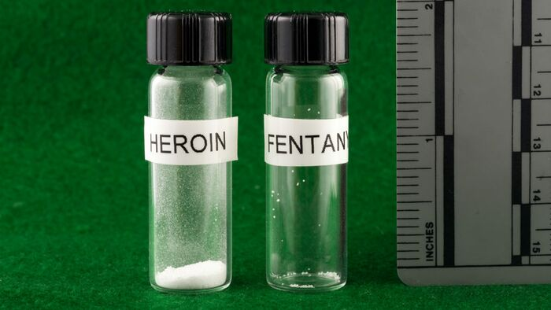

[◀返回](./home.md)

# 芬太尼 (Fentanyl)

<mark> 文章一长链接就崩掉，还好copilot给力，目前这是唯一一个可以放心点击不明链接的文章</mark>

> **⚠️ 警告**
>
> **这种物质极其强效（即在微克级别起效）。因此，处理时应极其小心，绝不应进行 [目测](../文档/药物剂量量取.md)。**
>
> 当与[阿片类药物](../文档/药物分类/吗啡喃类物质.md)、[苯二氮卓类物质](../文档/药物分类/苯二氮卓类物质.md)、苯巴比妥等巴比妥类物质、[加巴喷丁类物质](../文档/药物分类/加巴喷丁类物质.md)、噻吩二氮卓类物质或其他 [GABA能物质](../文档/药物分类/抑制剂.md)等[抑制剂](../文档/药物分类/抑制剂.md)联用时，**芬太尼**可能致命。[\[1\]](#cite_note-tripsit-1)
>
> 强烈建议在处理时佩戴手套，使用结合了[毫克称](../文档/毫克称.md)的[液体容量给药法](../文档/液体容量给药法.md)，并且在服用此药时不要混合服用[中等](../文档/药物剂量分类.md)或[严重](../文档/药物剂量分类.md)剂量的其他抑制剂。

| 芬太尼 (Fentanyl) | |
| --- | --- |
|  | |
| **化学命名** | |
| 俗名 | *Fentanyl, fentanil, Sublimaze, Actiq, Durogesic, Duragesic, Fentora, Matrifen, Haldid, Onsolis, Instanyl, Abstral, Lazanda* |
| 系统命名法名称 | *N-(1-(2-Phenylethyl)-4-piperidinyl)-N-phenylpropanamide* |
| **分类成员** | |
| 精神活性分类 | *[阿片类药物](../文档/药物分类/吗啡喃类物质.md)* |
| 化学分类 | *[哌啶](../文档/药物分类/苄基哌啶类物质.md)* |
| **[给药途径](../文档/给药途径.md)** | 舌下含服、鼻吸、透皮贴剂 |
| **[相互作用](#Dangerous_interactions)** | [MAOIs](#Dangerous_interactions), [氧化亚氮](../药物/氧化亚氮.md), [PCP](../药物/PCP.md), [兴奋剂](../文档/药物分类/兴奋剂.md), [酒精](#Dangerous_interactions), [苯二氮卓类物质](../文档/药物分类/苯二氮卓类物质.md), [右美沙芬](../药物/右美沙芬.md), GHB/GBL, [氯胺酮](../药物/氯胺酮.md), MXE, 曲马多, 西柚, 血清素释放剂, SSRIs, 5-HTP |

**芬太尼**（Fentanyl，也被称为 **Fentanil**，商品名包括 **Sublimaze**[\[2\]](#cite_note-2)、**Actiq**、**Durogesic**、**Duragesic**、**Fentora**、**Matrifen**、**Haldid**、**Onsolis**、**Instanyl**[\[3\]](#cite_note-3)、**Abstral**[\[4\]](#cite_note-4)、**Lazanda**[\[5\]](#cite_note-5) 等[\[6\]](#cite_note-6)）是一种属于苯胺哌啶类的强效合成[阿片类药物](../文档/药物分类/吗啡喃类物质.md)。它是 [μ-阿片](../文档/精神药物学/home.md)受体的强[激动剂](../文档/精神药物学/home.md)，效力大约是药用级（即100%纯度）[海洛因](../药物/海洛因.md)的40到50倍[\[7\]](#cite_note-7)[\[8\]](#cite_note-8)，大约是[吗啡](../药物/吗啡.md)的80到100倍。[\[来源请求\]](#)

芬太尼有多种药物制剂形式，包括透皮贴剂、棒棒糖、颊面片或贴片、鼻喷雾剂和吸入剂。[\[9\]](#cite_note-9) 在街头，它通常以粉末形式出现，经常被掺入或作为海洛因和其他药物出售，导致了无数的意外过量和死亡。[\[10\]](#cite_note-10) 2016年，芬太尼及其类似物是美国过量死亡的最常见原因，超过20,000人死亡，约占所有阿片类药物相关死亡的一半。[\[11\]](#cite_note-11)[\[12\]](#cite_note-12)

其[主观效应](../药效/home.md)与[海洛因](../药物/海洛因.md)相似，包括[镇痛](../药效/镇痛.md)、[镇静](../药效/镇静.md)、[呼吸抑制](../药效/呼吸抑制.md)和[欣快感](../药效/躯体欣快感.md)。然而，与其他阿片类药物相比，它[起效](../文档/药效时长.md)迅速且作用[时长](../文档/药效时长.md)短，这可能导致[强迫性复吸](../药效/home.md)。此外，许多使用者报告称，芬太尼及其类似物带来的[欣快感](../药效/躯体欣快感.md)明显较少。因此，它通常被认为娱乐价值较低。

由于其极高的效力，芬太尼是一种高度危险的物质，因为很难安全地进行剂量控制，且具有成瘾性。建议使用者意识到，如果选择使用芬太尼，他们将置身于极高的风险之中。如果使用者选择使用芬太尼，强烈建议采取[伤害减少措施](../文档/负责任的用药索引页.md)。建议使用者使用[试剂检测套件](../文档/毒品检测.md)检测其所有的阿片类药物（及一般物质）是否含有芬太尼和其他掺假物。

## 剂量与时长

**警告：** 由于个体体重、耐受性、代谢和个人敏感度的差异，请务必从较低剂量开始。[参见负责任的用药部分](../文档/负责任的用药索引页.md)。

| 舌下含服 (Sublingual) | |
| --- | --- |
| **[生物利用度](../文档/给药剂量.md#Bioavailability)** | 50%[\[来源请求\]](#) |
| **[阈值](../文档/药物剂量分类.md)** | 5 - 10 μg |
| **[轻微](../文档/药物剂量分类.md)** | 10 - 25 μg |
| **[中等](../文档/药物剂量分类.md)** | 25 - 50 μg |
| **[强烈](../文档/药物剂量分类.md)** | 50 - 75 μg |
| **[严重](../文档/药物剂量分类.md)** | 75 μg + |
| **[起效](../文档/药效时长.md)** | 15 - 30 分钟 |
| **[总时长](../文档/药效时长.md)** | 1 - 4 小时 |

| 鼻吸 (Insufflated) | |
| --- | --- |
| **[生物利用度](../文档/给药剂量.md#Bioavailability)** | 89%[\[来源请求\]](#) |
| **[阈值](../文档/药物剂量分类.md)** | 5 - 10 μg |
| **[轻微](../文档/药物剂量分类.md)** | 10 - 25 μg |
| **[中等](../文档/药物剂量分类.md)** | 25 - 50 μg |
| **[强烈](../文档/药物剂量分类.md)** | 50 - 75 μg |
| **[严重](../文档/药物剂量分类.md)** | 75 μg + |
| **[起效](../文档/药效时长.md)** | 15 - 30 分钟 |
| **[总时长](../文档/药效时长.md)** | 1 - 4 小时 |

| 透皮贴剂 (Transdermal) | |
| --- | --- |
| **[生物利用度](../文档/给药剂量.md#Bioavailability)** | 92%[\[来源请求\]](#) |
| **[阈值](../文档/药物剂量分类.md)** | 5 - 12 μg |
| **[轻微](../文档/药物剂量分类.md)** | 12 - 25 μg |
| **[中等](../文档/药物剂量分类.md)** | 25 - 50 μg |
| **[强烈](../文档/药物剂量分类.md)** | 50 - 100 μg |
| **[严重](../文档/药物剂量分类.md)** | 100 μg + |
| **[起效](../文档/药效时长.md)** | 2 - 4 小时 |
| **[总时长](../文档/药效时长.md)** | 48 - 72 小时 |

> **[免责声明](../文档/观前提醒.md)：** FreeODwiki 的[剂量](../文档/给药剂量.md)信息收集自用户和[网络资源](../关于本站/home.md)，仅用于教育目的。它不是推荐，应通过其他来源核实准确性。

## 目录
* [1 历史与文化](#History_and_culture)
* [2 化学](#Chemistry)
* [3 药理学](#Pharmacology)
* [4 主观效应](#Subjective_effects)
    * [4.1 **躯体效应**](#Physical_effects)
    * [4.2 **认知效应**](#Cognitive_effects)
    * [4.3 **视觉效应**](#Visual_effects)
        * [4.3.1 视觉抑制](#Suppressions)
    * [4.4 体验报告](#Experience_reports)
* [5 毒性与伤害潜力](#Toxicity_and_harm_potential)
    * [5.1 耐药性与成瘾潜力](#Tolerance_and_addiction_potential)
    * [5.2 危险的药物联用](#Dangerous_interactions)
        * [5.2.1 血清素综合征风险](#Serotonin_syndrome_risk)
* [6 法律地位](#Legal_status)
* [7 另见](#See_also)
* [8 外部链接](#External_links)
* [9 参考文献](#References)

## 历史与文化 (History and culture)

芬太尼由 Paul Janssen 于 1960 年首次合成[\[13\]](#cite_note-13)，这是在哌替啶（pethidine）医学应用几年后。Janssen 通过测定结构相关的物质哌替啶的类似物的阿片类活性，开发了芬太尼。[\[14\]](#cite_note-14) 芬太尼的广泛使用引发了柠檬酸芬太尼的生产，并于 1960 年代以商品名 Sublimaze 作为全身麻醉剂进入临床实践。随后，许多其他芬太尼类似物被开发并引入医疗实践，包括舒芬太尼（sufentanil）、阿芬太尼（alfentanil）、瑞芬太尼（remifentanil）和卡芬太尼（carfentanil）。

在 1990 年代中期，随着 Duragesic 贴剂的临床引入，芬太尼首次被广泛用于姑息治疗。随后的十年中，通过雌二醇 Mylan 透皮贴剂的给药方法，推出了首批供个人使用的速效芬太尼处方制剂，即 Actiq 棒棒糖和 Fentora 颊面片。截至 2012 年，芬太尼是临床实践中使用最广泛的合成阿片类药物[\[15\]](#cite_note-15)，目前有多种新的给药方法，包括用于癌症患者的舌下喷雾剂。[\[16\]](#cite_note-16)[\[17\]](#cite_note-17) 2013 年，全球使用了 1700 公斤芬太尼。[\[18\]](#cite_note-18)

## 化学 (Chemistry)

芬太尼是合成[阿片类药物](../文档/药物分类/吗啡喃类物质.md)中苯胺哌啶类的一员。其结构特征是[哌啶](../文档/药物分类/苄基哌啶类物质.md)环的氮成分 RN 通过乙基链与苯环结合。哌啶环对面的碳与丙酰胺基团的氮成员结合，丙酰胺基团是一个三碳链，其氮成分邻接与酮氧结合的碳。该丙酰胺基团还在 RN 处被额外的苯环取代。

## 药理学 (Pharmacology)

芬太尼产生娱乐效果是因为阿片类药物在结构上模仿体内的内源性内啡肽，这些内啡肽天然存在于体内并作用于 μ-阿片受体组。阿片类药物结构上模仿这些天然内啡肽的方式导致了它们的[欣快感](../药效/躯体欣快感.md)、[镇痛](../药效/镇痛.md)和[抗焦虑](../药效/镇静.md)作用。这是因为内啡肽负责减轻疼痛、引起嗜睡和愉悦感。它们可以在应对疼痛、剧烈运动、性高潮或一般兴奋时释放。

与吗啡相比，芬太尼的强效主要归因于其高亲脂性（化合物溶解于脂肪、油和脂质的能力）。正因为如此，与其他阿片类药物相比，它可以更容易地穿透中枢神经系统。

## 主观效应 (Subjective effects)

***免责声明：** 下列效应引用自 [***主观效应索引***](../药效/home.md) (**SEI**)，这是一个基于轶事用户报告和 [PsychonautWiki](../关于本站/home.md) 贡献者个人分析的开放研究文献。因此，应以健康的怀疑态度看待这些内容。*

*同样值得注意的是，这些效应不一定会以可预测或可靠的方式发生，尽管较高的剂量更可能诱发全方位的效应。* 同样，**不良反应**随着剂量的增加而变得越来越可能，可能包括 **成瘾、严重伤害或死亡** ☠。

### **躯体效应**

*   **[镇静](../药效/镇静.md)** - 芬太尼可以被描述为比其他阿片类药物更具镇静作用。即使在中等剂量下，芬太尼也可能导致压倒性的镇静感和疲倦感，比[海洛因](../药物/海洛因.md)和[羟考酮](../药物/羟考酮.md)更具镇静性。
*   **[镇痛](../药效/镇痛.md)** - 与其他阿片类药物相比，芬太尼可以被描述为一种强效镇痛剂，即使在非娱乐剂量下也能提供缓解。
*   **[躯体欣快感](../药效/躯体欣快感.md)** - 与[吗啡](../药物/吗啡.md)或[二乙酰吗啡](../药物/海洛因.md)（海洛因）相比，芬太尼的躯体欣快感强度较低。这种感觉本身可以描述为强烈的身体舒适、温暖和幸福感，传遍全身。
*   **[瘙痒感](../药效/瘙痒感.md)** - 与其他[阿片类药物](../文档/药物分类/吗啡喃类物质.md)不同，由于释放的组胺很少或没有，芬太尼引起的瘙痒反应非常小。
*   **[呼吸抑制](../药效/呼吸抑制.md)** - 与其他阿片类药物相比，芬太尼在相对于欣快感的较低剂量下即显示出此效应，即使在低剂量下也会导致呼吸轻度至中度减慢的感觉，但不会造成明显的障碍。在高剂量和过量时，阿片类药物引起的呼吸抑制可能导致呼吸急促、呼吸模式异常、半昏迷或无意识。如果没有立即的医疗关注，严重的过量可能导致昏迷或死亡。
*   **[便秘](../药效/便秘.md)**
*   **[咳嗽抑制](../药效/咳嗽抑制.md)**
*   **[性欲减退](../药效/性欲减退.md)**
*   **[排尿困难](../药效/排尿困难.md)**
*   **[瞳孔缩小](../药效/瞳孔缩小.md)**
*   **[出汗增加](../药效/出汗增加.md)**
*   **[血压降低](../药效/血压降低.md)**
*   **[食欲抑制](../药效/食欲抑制.md)**
*   **[性高潮抑制](../药效/性高潮抑制.md)**

### **认知效应**

*   **[认知欣快感](../药效/认知效应.md)** - 与[吗啡](../药物/吗啡.md)或[海洛因](../药物/海洛因.md)相比，芬太尼的认知欣快感强度较低。然而，在耐受性较低的情况下，大剂量使用仍能产生极度的强度和压倒性的幸福感。这种感觉本身可以描述为强大且压倒性的情感幸福、满足和快乐。
*   **[焦虑抑制](../药效/镇静.md)**
*   **[强迫性复吸](../药效/home.md)**
*   **梦境增强**

### **视觉效应**

#### 视觉抑制
*   **[复视](../药效/复视.md)** - 在高剂量下，眼睛会无法控制地失焦和重新聚焦。这会产生模糊的效果和复视，无论眼睛聚焦在哪里都会出现。

### 体验报告

目前我们的报告索引中没有描述此化合物效应的轶事报告。其他的体验报告可以在这里找到：

*   [Erowid Experience Vaults: Fentanyl](https://www.erowid.org/experiences/subs/exp_Pharms_Fentanyl.shtml)

## 毒性与伤害潜力 (Toxicity and harm potential)

**芬太尼** *新罕布什尔州警察法医实验室* - 这张图片展示了海洛因和芬太尼的致死剂量对比。

没有阿片类药物耐受性的个人非医疗使用芬太尼非常危险，并已导致无数人死亡。[\[19\]](#cite_note-19)[\[20\]](#cite_note-20) 在严重剂量下具有潜在致命性，即使是那些有阿片类药物耐受性的人也有很高的过量风险。一旦芬太尼进入使用者系统，由于吸收的性质，很难停止其过程。由于纯芬太尼粉末的强度极高，很难适当地稀释，通常产生的混合物可能太强，因此非常危险。当与[酒精](#Dangerous_interactions)或[苯二氮卓类物质](../文档/药物分类/苯二氮卓类物质.md)等[抑制剂](../文档/药物分类/抑制剂.md)混合时，也具有潜在的[致命性](../药效/呼吸抑制.md)。

像大多数阿片类药物一样，适当剂量的纯芬太尼除了依赖性和[便秘](../药效/便秘.md)外，不会引起许多长期并发症。除了极其强大的成瘾性和身体依赖性外，阿片类药物使用的有害或毒性方面完全与其管理、过量和使用不纯产品时不采取必要的预防措施有关。

芬太尼非常强效，渗透性比吗啡高约 1000 倍。[\[21\]](#cite_note-LarsenNielsen2003-21) 尽管芬太尼通过皮肤的吸收相当缓慢[\[22\]](#cite_note-VarvelShafer1989-22)，但通过触摸嘴、鼻子或眼睛无意中从皮肤转移物质是危险的。

大剂量的芬太尼可能导致[呼吸抑制](../药效/呼吸抑制.md)，进而导致致命或危险水平的缺氧。这是因为呼吸反射被与服用剂量成比例的 [µ-阿片](../文档/精神药物学/home.md) [受体](../文档/精神药物学/home.md)的[激动作用](../文档/精神药物学/home.md)所抑制。

芬太尼还可能引起[恶心](../药效/恶心.md)和[呕吐](../药效/呕吐.md)；相当一部分归因于阿片类药物过量的死亡是由无意识受害者吸入呕吐物引起的。这是指当一个无意识或半无意识的使用者仰卧时呕吐到嘴里并无意中窒息。这可以通过确保侧卧并头部向下倾斜来预防，以便在无意识呕吐时气道不会被阻塞（也称为复苏体位）。在过量的情况下，建议静脉注射或肌肉注射纳洛酮以抵消物质的作用。

强烈建议在使用此物质时采取[伤害减少措施](../文档/负责任的用药索引页.md)。

### 耐药性与成瘾潜力 (Tolerance and addiction potential)

与其他[阿片类药物](../文档/药物分类/吗啡喃类物质.md)一样，长期使用芬太尼被认为极易成瘾，具有很高的滥用潜力，并且能够在其使用者中引起心理和生理依赖。当成瘾形成后，如果一个人突然停止使用，可能会出现渴望和[戒断症状](../文档/药物戒断反应.md)。

随着长期和重复使用，对芬太尼许多效应的耐受性会发展。这种情况发生的速度对于不同的效应是不同的，例如对便秘诱导效应的耐受性发展特别缓慢。这导致使用者必须服用越来越大的剂量才能达到相同的效果。之后，大约需要 3 - 7 天耐受性才会减半，1 - 2 周才能恢复到基线（在没有进一步消费的情况下）。芬太尼与所有其他[阿片类药物](../文档/药物分类/吗啡喃类物质.md)呈现交叉耐受性，这意味着在服用芬太尼后，所有[阿片类药物](../文档/药物分类/吗啡喃类物质.md)的效果都会降低。

在停止使用一段时间并复吸后，致命的阿片类药物过量风险急剧上升，主要是因为耐受性降低。[\[23\]](#cite_note-23) 为了考虑到这种耐受性的缺乏，如果复吸，只服用通常[剂量](../文档/给药剂量.md)的一小部分更安全。还发现环境在阿片类药物耐受性中起作用。在一项科学研究中，具有相同海洛因给药史的老鼠在与其物质无关的环境中接受剂量后，比在熟悉的环境中死亡的可能性大得多。[\[24\]](#cite_note-24)

### 危险的药物联用 (Dangerous interactions)

***警告：** 许多精神活性物质单独使用时相对安全，但与某些其他物质结合使用时可能会突然变得危险甚至危及生命。以下列表提供了一些已知的危险相互作用（尽管不能保证包括所有相互作用）。*

*务必进行独立的类比研究（例如 [Google](https://www.google.com)、[DuckDuckGo](https://www.duckduckgo.com)、[PubMed](https://pubmed.ncbi.nlm.nih.gov/)）以确保两种或多种物质的组合可以安全食用。部分列出的相互作用来自 [TripSit](https://combo.tripsit.me)。*

*   **酒精** - 两种物质都会增强对方引起的共济失调和镇静作用，在高剂量下可能导致意外的意识丧失。将受影响的患者置于复苏体位，以防止因呕吐过多而吸入。可能会发生记忆断片。
*   **[兴奋剂](../文档/药物分类/兴奋剂.md)** - 兴奋剂会增加呼吸频率，这允许使用比平时更高剂量的阿片类药物。如果兴奋剂先失效，阿片类药物可能会压倒使用者并导致呼吸停止。
*   **[苯二氮卓类物质](../文档/药物分类/苯二氮卓类物质.md)** - 中枢神经系统和/或呼吸抑制作用可能会叠加或协同出现。这两种物质会强烈且不可预测地相互增强，非常迅速地导致无意识。在无意识状态下，如果没有置于复苏体位，呕吐物吸入是一个风险，且很可能发生断片/记忆丧失。
*   **[右美沙芬](../药物/右美沙芬.md)** - 通常被认为具有毒性。已观察到中枢神经系统抑制、呼吸困难、心脏问题和肝脏毒性。此外，如果服用右美沙芬，他们对阿片类药物的耐受性会略有下降，从而导致额外的协同效应。
*   **GHB/GBL** - 这两种物质会强烈且不可预测地相互增强，非常迅速地导致无意识。在无意识状态下，如果没有置于复苏体位，呕吐物吸入是一个风险。
*   **[氯胺酮](../药物/氯胺酮.md)** - 两种物质都会带来呕吐和无意识的风险。如果使用者在影响下失去意识，且没有置于复苏体位，则存在严重的呕吐物吸入风险。
*   **MAOIs** - 单胺氧化酶抑制剂 (MAOIs) 与某些阿片类药物合用已与罕见的严重不良反应报告相关。似乎有两种类型的相互作用，一种是兴奋性的，一种是抑制性的。兴奋性反应的症状可能包括激越、头痛、多汗、高热、潮红、颤抖、肌阵挛、僵硬、震颤、腹泻、高血压、心动过速、癫痫发作和昏迷。在某些情况下已发生死亡。
*   **MXE** - MXE 可以增强阿片类药物的作用，但也会增加呼吸抑制和器官毒性的风险。
*   **[氧化亚氮](../药物/氧化亚氮.md)** - 两种物质都会增强对方引起的共济失调和镇静作用，在高剂量下可能导致意外的意识丧失。在无意识状态下，如果没有置于复苏体位，呕吐物吸入是一个风险。记忆断片很常见。
*   **[PCP](../药物/PCP.md)** - PCP 可能会降低阿片类药物的耐受性，增加过量的风险。
*   **曲马多** - 增加癫痫发作的风险。曲马多本身已知会诱发癫痫发作，并且可能与其他阿片类药物在癫痫发作阈值上产生叠加效应。中枢神经系统和/或呼吸抑制作用可能会叠加或协同出现。
*   **西柚** - 虽然西柚没有精神活性，但它可能会影响某些阿片类药物的代谢。曲马多、羟考酮和芬太尼主要由 CYP3A4 酶代谢，该酶被西柚汁强效抑制[\[25\]](#cite_note-Ershad2020-25)。这可能导致药物需要更长的时间才能从体内清除。重复给药可能会增加毒性。美沙酮也可能受到影响[\[25\]](#cite_note-Ershad2020-25)。可待因和氢可酮由 CYP2D6 代谢。正在服用抑制 CYP2D6 药物的人，或因基因突变而缺乏该酶的人，对可待因没有反应，因为它无法代谢成其活性产物：吗啡。

#### [血清素综合征](../文档/血清素综合征.md)风险

与以下物质联用可能导致危险的高[血清素](../文档/精神药物学/home.md)水平。[血清素综合征](../文档/血清素综合征.md)需要立即的医疗关注，如果不治疗可能是致命的。

*   **MAOIs** - 例如 [死藤水](../药物/死藤水.md)（含 [Banisteriopsis caapi](../药物/死藤水.md)）、骆驼蓬（Syrian rue）、苯乙肼（phenelzine）、司来吉兰（selegiline）和吗氯贝胺（moclobemide）。[\[26\]](#cite_note-26)
*   **血清素释放剂** - 例如 [MDMA](../药物/MDMA.md)、[4-FA](../药物/3-FA.md)、[甲基苯丙胺](../药物/甲基苯丙胺.md)、[Methylone](../药物/4-MMC.md)、[αMT](../药物/5-MeO-MiPT.md)。
*   **SSRIs** - 例如西酞普兰（citalopram）和舍曲林（sertraline）。
*   **SNRIs** - 例如曲马多（tramadol）和文拉法辛（venlafaxine）。
*   **5-HTP**

## 法律地位 (Legal status)

*   **奥地利：** 根据 AMG (Arzneimittelgesetz Österreich)，芬太尼用于医疗是合法的；根据 SMG (Suchtmittelgesetz Österreich)，未经处方销售或拥有芬太尼是非法的。[\[来源请求\]](#)
*   **澳大利亚：** 芬太尼被列入附表 8，这意味着它可以用于医疗用途，但未经授权拥有、生产或供应是非法的。[\[27\]](#cite_note-27)
*   **加拿大：** 芬太尼是加拿大管制药物和物质法案中的附表 I 药物。[\[28\]](#cite_note-28)
*   **德国：** 芬太尼是 BtMG Anlage III 下的管制物质。它只能通过麻醉品处方单开具。[\[29\]](#cite_note-29)
*   **荷兰：** 芬太尼是鸦片法清单 I 物质。
*   **俄罗斯：** 芬太尼是附表 II 管制物质。[\[30\]](#cite_note-30)
*   **瑞士：** 芬太尼是 Verzeichnis A 下特别命名的管制物质。允许医疗用途。[\[31\]](#cite_note-31)
*   **土耳其：** 芬太尼是“红色处方”专用物质[\[32\]](#cite_note-32)，未经处方销售或拥有是非法的。[\[来源请求\]](#)
*   **英国：** 根据 1971 年滥用药物法，芬太尼是受管制的 A 类药物。[\[33\]](#cite_note-33)
*   **美国：** 根据管制物质法案，芬太尼是附表 II 管制物质。Abstral 的分销商被要求实施 FDA 批准的风险评估和缓解策略 (REMS) 计划。健康保险公司已开始要求 Actiq 处方的预认证和/或数量限制。

## 另见 (See also)

*   [负责任的用药](../文档/负责任的用药索引页.md)
*   [阿片类药物](../文档/药物分类/吗啡喃类物质.md)
*   [海洛因](../药物/海洛因.md)
*   [吗啡](../药物/吗啡.md)
*   乙酰芬太尼 (Acetylfentanyl)

## 外部链接 (External links)

*   [Fentanyl (Wikipedia)](https://en.wikipedia.org/wiki/Fentanyl)
*   [Fentanyl (Erowid Vault)](https://www.erowid.org/pharms/fentanyl/)
*   [Fentanyl (Isomer Design)](https://isomerdesign.com/PiHKAL/explore.php?id=10715)
    *   [Fentanyl landscape (Isomer Design)](https://isomerdesign.com/PiHKAL/tableLandscape.php?domain=pk&property=fentanyl&sort=name)
*   [Fentanyl (DrugBank)](https://go.drugbank.com/drugs/DB00813)
*   [Fentanyl (Drugs.com)](https://www.drugs.com/fentanyl.html)
*   [Fentanyl (Drugs-Forum)](https://drugs-forum.com/wiki/Fentanyl)

## 参考文献 (References)

1. [↑](#cite_ref-tripsit_1-0) [*Risks of Combining Depressants - TripSit*](https://tripsit.me/combining-depressants/)
2. [↑](#cite_ref-2) SUBLIMAZE Injection | <https://web.archive.org/web/20170702004717/http://www.janssen.com/australia/sites/www_janssen_com_australia/files/prod_files/live/sublimaze_pi.pdf>
3. [↑](#cite_ref-3) <http://www.ema.europa.eu/docs/en_GB/document_library/EPAR_-_Summary_for_the_public/human/000959/WC500033142.pdf>
4. [↑](#cite_ref-4) European public assessment report (EPAR) for Instanyl | <http://www.ema.europa.eu/docs/en_GB/document_library/EPAR_-_Summary_for_the_public/human/000959/WC500033142.pdf>
5. [↑](#cite_ref-5) Lazanda (Fentanyl) Nasal Spray CII | <https://web.archive.org/web/20170216184309/https://www.accessdata.fda.gov/drugsatfda_docs/label/2011/022569s005lbl.pdf>
6. [↑](#cite_ref-6) Drugs.com, Fentanyl | <http://www.drugs.com/international/fentanyl.html>
7. [↑](#cite_ref-7) [*Fentanyl: Incapacitating Agent, NIOSH, CDC*](https://www.cdc.gov/niosh/ershdb/emergencyresponsecard_29750022.html), 2021
8. [↑](#cite_ref-8) Mutschler, E., ed. (2001). *Arzneimittelwirkungen: Lehrbuch der Pharmakologie und Toxikologie ; mit einführenden Kapiteln in die Anatomie, Physiologie und Pathophysiologie* (8., völlig neu bearb. und erw. Aufl ed.). Wiss. Verl.-Ges. [ISBN](http://en.wikipedia.org/wiki/International_Standard_Book_Number "wikipedia:International Standard Book Number") [9783804717633](http://en.wikipedia.org/wiki/Special:BookSources/9783804717633 "wikipedia:Special:BookSources/9783804717633").
9. [↑](#cite_ref-9) Drugs.com Fentanyl Fact Sheet <https://www.drugs.com/dosage/fentanyl.html>
10. [↑](#cite_ref-10) SAMHSA "Fact Sheet: Fentanyl-Laced Heroin and Cocaine" <https://www.samhsa.gov/sites/default/files/programs_campaigns/medication_assisted/dear_colleague_letters/2013-colleague-letter-fentanyl-analogues.pdf>
11. [↑](#cite_ref-11) Abuse, N. I. on D. (2018), [*Nearly half of opioid-related overdose deaths involve fentanyl*](https://nida.nih.gov/news-events/news-releases/2018/05/nearly-half-of-opioid-related-overdose-deaths-involve-fentanyl), retrieved 14 June 2018
12. [↑](#cite_ref-12) Hedegaard, H., Bastian, B. A., Trinidad, J. P., Spencer, M., Warner, M. (December 2018). "Drugs Most Frequently Involved in Drug Overdose Deaths: United States, 2011-2016". *National Vital Statistics Reports: From the Centers for Disease Control and Prevention, National Center for Health Statistics, National Vital Statistics System*. **67** (9): 1–14. [ISSN](http://en.wikipedia.org/wiki/International_Standard_Serial_Number "wikipedia:International Standard Serial Number") [1551-8922](//www.worldcat.org/issn/1551-8922).
13. [↑](#cite_ref-13) Stanley, T. H. (April 1992). "The history and development of the fentanyl series". *Journal of Pain and Symptom Management*. **7** (3 Suppl): S3–7. [doi](http://en.wikipedia.org/wiki/Digital_object_identifier "wikipedia:Digital object identifier"):[10.1016/0885-3924(92)90047-l](//doi.org/10.1016%2F0885-3924%2892%2990047-l). [ISSN](http://en.wikipedia.org/wiki/International_Standard_Serial_Number "wikipedia:International Standard Serial Number") [0885-3924](//www.worldcat.org/issn/0885-3924).
14. [↑](#cite_ref-14) Black, J. (24 March 2005). "A personal perspective on Dr. Paul Janssen". *Journal of Medicinal Chemistry*. **48** (6): 1687–1688. [doi](http://en.wikipedia.org/wiki/Digital_object_identifier "wikipedia:Digital object identifier"):[10.1021/jm040195b](//doi.org/10.1021%2Fjm040195b). [ISSN](http://en.wikipedia.org/wiki/International_Standard_Serial_Number "wikipedia:International Standard Serial Number") [0022-2623](//www.worldcat.org/issn/0022-2623).
15. [↑](#cite_ref-15) FENTANYL AND ANALOGUES | <http://livertox.nih.gov/FentanylAndAnalogues.htm>
16. [↑](#cite_ref-16) [*Subsys (fentanyl sublingual spray), CenterWatch*](https://www.centerwatch.com/directories/1067-fda-approved-drugs/listing/4226-subsys-fentanyl-sublingual-spray)
17. [↑](#cite_ref-17) INSYS Therapeutics Inc (2013), [*Open-label Multi-center Safety Trial of Fentanyl Sublingual Spray (Fentanyl SL Spray) for the Treatment of Breakthrough Cancer Pain*](https://clinicaltrials.gov/ct2/show/NCT00538863), clinicaltrials.gov
18. [↑](#cite_ref-18) Narcotic Drugs Report 2014, UN | <https://www.incb.org/documents/Narcotic-Drugs/Technical-Publications/2014/Narcotic_Drugs_Report_2014.pdf>
19. [↑](#cite_ref-19) [*DEA: Deaths from fentanyl-laced heroin surging*](https://www.usatoday.com/story/news/2015/03/18/surge-in-overdose-deaths-from-fentanyl/24957967/)
20. [↑](#cite_ref-20) Sidner, R. E., Sara (2016), [*Prince died of accidental overdose of opioid fentanyl, medical examiner says*](https://www.cnn.com/2016/06/02/health/prince-death-opioid-overdose/index.html)
21. [↑](#cite_ref-LarsenNielsen2003_21-0) Larsen, Rikke H.; Nielsen, Flemming; Sorensen, Jens A.; Nielsen, Jesper B. (2003). "Dermal Penetration of Fentanyl: Inter- and Intraindividual Variations". *Pharmacology and Toxicology*. **93** (5): 244–248. [doi](http://en.wikipedia.org/wiki/Digital_object_identifier "wikipedia:Digital object identifier"):[10.1046/j.1600-0773.2003.pto930508.x](//doi.org/10.1046%2Fj.1600-0773.2003.pto930508.x). [ISSN](http://en.wikipedia.org/wiki/International_Standard_Serial_Number "wikipedia:International Standard Serial Number") [0901-9928](//www.worldcat.org/issn/0901-9928).
22. [↑](#cite_ref-VarvelShafer1989_22-0) Varvel, J. R.; Shafer, S. L.; Hwang, S. S.; Coen, P. A.; Stanski, D. R. (1989). "Absorption Characteristics of Transdermally Administered Fentanyl". *Anesthesiology*. **70** (6): 928–934. [doi](http://en.wikipedia.org/wiki/Digital_object_identifier "wikipedia:Digital object identifier"):[10.1097/00000542-198906000-00008](//doi.org/10.1097%2F00000542-198906000-00008). [ISSN](http://en.wikipedia.org/wiki/International_Standard_Serial_Number "wikipedia:International Standard Serial Number") [0003-3022](//www.worldcat.org/issn/0003-3022).
23. [↑](#cite_ref-23) Why Heroin Relapse Often Ends In Death - Lauren F Friedman (Business Insider) | <http://www.businessinsider.com.au/philip-seymour-hoffman-overdose-2014-2>
24. [↑](#cite_ref-24) Siegel, S., Hinson, R. E., Krank, M. D., McCully, J. (23 April 1982). ["Heroin "Overdose" Death: Contribution of Drug-Associated Environmental Cues"](https://www.science.org/doi/10.1126/science.7200260). *Science*. **216** (4544): 436–437. [doi](http://en.wikipedia.org/wiki/Digital_object_identifier "wikipedia:Digital object identifier"):[10.1126/science.7200260](//doi.org/10.1126%2Fscience.7200260). [ISSN](http://en.wikipedia.org/wiki/International_Standard_Serial_Number "wikipedia:International Standard Serial Number") [0036-8075](//www.worldcat.org/issn/0036-8075).
25. ↑ [25.0](#cite_ref-Ershad2020_25-0) [25.1](#cite_ref-Ershad2020_25-1) Ershad, M., Cruz, M. D., Mostafa, A., Mckeever, R., Vearrier, D., Greenberg, M. I. (March 2020). ["Opioid Toxidrome Following Grapefruit Juice Consumption in the Setting of Methadone Maintenance"](https://journals.lww.com/10.1097/ADM.0000000000000535). *Journal of Addiction Medicine*. **14** (2): 172–174. [doi](http://en.wikipedia.org/wiki/Digital_object_identifier "wikipedia:Digital object identifier"):[10.1097/ADM.0000000000000535](//doi.org/10.1097%2FADM.0000000000000535). [ISSN](http://en.wikipedia.org/wiki/International_Standard_Serial_Number "wikipedia:International Standard Serial Number") [1932-0620](//www.worldcat.org/issn/1932-0620).
26. [↑](#cite_ref-26) Gillman, P. K. (2005). ["Monoamine oxidase inhibitors, opioid analgesics and serotonin toxicity"](https://bjanaesthesia.org/article/S0007-0912(17)34956-5/fulltext). *British Journal of Anaesthesia*. **95** (4): 434–441. [doi](http://en.wikipedia.org/wiki/Digital_object_identifier "wikipedia:Digital object identifier"):[10.1093/bja/aei210](//doi.org/10.1093%2Fbja%2Faei210) . [eISSN](http://en.wikipedia.org/wiki/International_Standard_Serial_Number#Electronic_ISSN "wikipedia:International Standard Serial Number") [1471-6771](//www.worldcat.org/issn/1471-6771). [ISSN](http://en.wikipedia.org/wiki/International_Standard_Serial_Number "wikipedia:International Standard Serial Number") [0007-0912](//www.worldcat.org/issn/0007-0912). [OCLC](http://en.wikipedia.org/wiki/OCLC "wikipedia:OCLC") [01537271](//www.worldcat.org/oclc/01537271). [PMID](http://en.wikipedia.org/wiki/PubMed_Identifier "wikipedia:PubMed Identifier") [16051647](//www.ncbi.nlm.nih.gov/pubmed/16051647).
27. [↑](#cite_ref-27) [*Poisons Standard February 2019*](https://www.legislation.gov.au/Details/F2019L00032/Html/Text#_Toc532805057)
28. [↑](#cite_ref-28) Branch, L. S. (2022), [*Consolidated federal laws of Canada, Controlled Drugs and Substances Act*](https://laws.justice.gc.ca/eng/acts/C-38.8/page-12.html#h-34)
29. [↑](#cite_ref-29) <http://www.gesetze-im-internet.de/btmg_1981/anlage_iii.html>
30. [↑](#cite_ref-30) [*Постановление Правительства РФ от 01.10.2012 N 1002 (ред. от 09.08.2019*](https://www.consultant.ru/cons/cgi/online.cgi?req=doc&base=LAW&n=331879&dst=100294&date=03.12.2019)
31. [↑](#cite_ref-31) ["Verordnung des EDI über die Verzeichnisse der Betäubungsmittel, psychotropen Stoffe, Vorläuferstoffe und Hilfschemikalien"](https://www.admin.ch/opc/de/classified-compilation/20101220/index.html) (in German). Bundeskanzlei [Federal Chancellery of Switzerland]. Retrieved January 1, 2020.
32. [↑](#cite_ref-32) KIRMIZI REÇETEYE TABİ İLAÇLAR | <https://www.titck.gov.tr/storage/Archive/2019/contentFile/K%C4%B1rm%C4%B1z%C4%B1%20Re%C3%A7eteye%20Tabi%20%C4%B0la%C3%A7lar%2005072019_ebcc7e92-6661-4983-870a-fe8983a9c2b7.pdf>
33. [↑](#cite_ref-33) [*Misuse of Drugs Act 1971*](https://www.legislation.gov.uk/ukpga/1971/38/schedule/2)