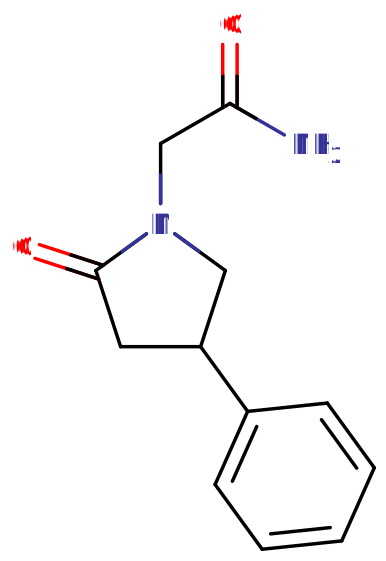

# 苯基吡拉西坦

[◀返回](index.md)

| **化学信息** | 苯基吡拉西坦（Phenylpiracetam）                                               |
| ------------ | ----------------------------------------------------------------------------- |
| 结构式       |                                               |
| 分子式       | C12H14N2O2                        |
| CAS 号       | 77472-70-9                                                                    |
| **化学命名** |                                                                               |
| 常用名称     | 苯基吡拉西坦、Phenylpiracetam、Phenotropil、Carphedon                         |
| 取代名称     | 4-Phenylpiracetam                                                             |
| 系统名称     | (R,S)-2-(2-Oxo-4-phenylpyrrolidin-1-yl)acetamide                              |
| **类别归属** |                                                                               |
| 精神活性分类 | _[益智药](../文档/药物分类/益智药.md) / [兴奋剂](../文档/药物分类/兴奋剂.md)_ |
| 化学分类     | _[拉西坦类物质](../文档/药物分类/拉西坦类物质.md)_                            |

| [给药途径](../文档/给药途径.md)          | ⇣ [口服](../文档/给药途径.md#口服)        |
| ---------------------------------------- | ----------------------------------------- |
| **剂量**                                 |                                           |
| [阈值](../文档/药物剂量分类.md#阈值)     | < 50 mg                                   |
| [轻微](../文档/药物剂量分类.md#轻微)     | 50 \~ 100 mg                              |
| [中等](../文档/药物剂量分类.md#中等)     | 100 \~ 200 mg                             |
| [强烈](../文档/药物剂量分类.md#强烈)     | 200 \~ 400 mg                             |
| [严重](../文档/药物剂量分类.md#严重)     | 400 mg +                                  |
| **时长**                                 |                                           |
| [总时长](../文档/药效时长.md#总时长)     | 2 \~ 3 小时（部分用户报告可持续整天）[^1] |
| [药效发作](../文档/药效时长.md#药效发作) | 30 \~ 60 分钟                             |
| [药效达峰](../文档/药效时长.md#药效达峰) | 1 小时                                    |

- !!! warning "警告"

        由于个体体重、耐受性、新陈代谢和个人敏感度的差异，请务必从低剂量开始。参见[负责任的用药部分](../文档/负责任的用药索引页.md)。

    !!! info "[免责声明](../关于本站/免责声明.md)"

        本站的[给药剂量](../文档/给药剂量.md)信息收集自用户和[相关资源](../文档/科学信息索引页.md)，仅供教育目的使用。这不是医疗建议，应与其他来源核实以确保准确性。

**苯基吡拉西坦**（亦称 **Phenotropil** 和 **Carphedon**）是一种属于[拉西坦](../文档/药物分类/拉西坦类物质.md)类药物的中枢神经系统[兴奋剂](../文档/药物分类/兴奋剂.md)和[益智药](../文档/药物分类/益智药.md)。[^2][^3] 虽然它是最早合成和记录的[吡拉西坦](吡拉西坦.md)衍生物之一，但对其在人类身上的特性和功效的研究是有限的。

苯基吡拉西坦在美国作为膳食补充剂通过在线供应商销售，很容易获得。通常报告的剂量约为 [Noopept](Noopept.md) 的 12 倍，这使得它效力较低，但提供了类似的益处。

苯基吡拉西坦的补充剂量通常在一天 100 \~ 300 毫克的范围内，[^4] 分为两到三个均匀分布的给药期（例如三次 100 mg 或 200 mg 的剂量）。

在鼠类种群中，苯基吡拉西坦已被证明可以防止[东莨菪碱](东莨菪碱.md)诱导的健忘症，这表明它可以通过保持足够的[乙酰胆碱](../文档/乙酰胆碱.md)水平作为主要机制，帮助从[谵妄剂](../文档/药物分类/谵妄剂.md)中毒和其他典型的认知受损状态中恢复。[^5]

许多人报告说，苯基吡拉西坦的效果（特别是刺激作用）比其他拉西坦类药物更明显。这可能是由于苯基吡拉西坦作为多巴胺再摄取抑制剂和去甲肾上腺素再摄取抑制剂的作用。[^6][^5]

## 化学

苯基吡拉西坦基于[吡拉西坦](吡拉西坦.md)的分子骨架，在吡咯烷酮核上附加了一个额外的苯基，尽管其立体位置与在[茴拉西坦](茴拉西坦.md)或[奈非西坦](奈非西坦.md)上观察到的取代苯基不同。由于吡咯烷酮环第四位的中心手性，它可以以 S 或 R 异构体形式存在；临床使用的形式是外消旋混合物。[^7]

## 药理学

苯基吡拉西坦被认为会增加海马细胞内的[乙酰胆碱](../文档/乙酰胆碱.md)释放。[^8] 由于乙酰胆碱参与记忆功能，这可能解释了其报告的[益智药](../文档/药物分类/益智药.md)效应。

苯基吡拉西坦似乎进行了一系列试验[^9][^8]，显示出对器质性原因导致的认知衰退患者的认知改善，其中一项研究指出青少年癫痫患者的认知有轻微改善。[^10]

## 主观效应

!!! info "[免责声明](../关于本站/免责声明.md)"

    _下列效应引用自 [**主观效应索引**](../药效/index.md) (**SEI**)，这是一个基于轶事用户报告和个人分析的开放研究文献。因此，应带着健康的怀疑态度来看待它们。_

    _同样值得注意的是，这些效应不一定会以可预测或可靠的方式发生，尽管较高的剂量更可能引发全方位的效应。同样，**不良反应** 随着剂量的增加变得越来越可能，可能包括 **成瘾、严重伤害或死亡** ☠。_

与其他益智药（如 [Noopept](Noopept.md)）的效应相比，该化合物可以被描述为主要侧重于认知专注，而不是认知刺激。

- ### **[躯体效应](../药效/躯体效应.md)** 
    - **[刺激](../药效/刺激.md '刺激')**：苯基吡拉西坦在常规剂量下表现出的刺激主要被认为是微妙的，类似于[咖啡因](咖啡因.md '咖啡因')，但在严重剂量下可能会令人不适地过度刺激。
    - **[心率增快](../药效/心率增快.md)**：这可能是多巴胺和去甲肾上腺素再摄取抑制的结果。
    - **[耐力增强](../药效/耐力增强.md)**：与其他[兴奋剂](../文档/药物分类/兴奋剂.md)（如[苯丙胺](苯丙胺.md)）相比，这种效应相对温和。
    - **[头痛](../药效/头痛.md)** ：在较高剂量下更为突出。多次重复给药可能会促进这种情况。
    - **[食欲抑制](../药效/食欲抑制.md)**

- ### **感官效应** 
    尽管这些效应并不普遍，但某些人在此化合物的影响下可能会体验到感官增强。

    - **[视觉锐度增强](../药效/视觉锐度增强.md)**
    - **[颜色增强](../药效/颜色增强.md)**
    - **[听觉增强](../药效/听觉增强.md)**
    - **[耐力增强](../药效/耐力增强.md)**
    - **[触觉增强](../药效/触觉增强.md)**

- ### **[认知效应](../药效/认知效应.md)** 
    就其认知效应而言，该化合物可被描述为具有刺激性。

    - **[分析能力增强](../药效/分析能力增强.md)**
    - **[清醒](../药效/清醒度.md)**
    - **[正念](../药效/正念.md)**
    - **[焦虑抑制](../药效/焦虑抑制.md)**
    - **[思维连通性](../药效/思维连通性.md)**
    - **[专注力增强](../药效/专注力强化.md)**
    - **[动机增强](../药效/动机增强.md)**
    - **[记忆增强](../药效/记忆增强.md)**
    - **[梦境增强](../药效/梦境增强.md)**
    - **[易怒](../药效/易怒.md)**
    - **[认知烦躁](../药效/认知烦躁.md)**：这种效应通常仅在极高剂量下发生。

- ### **药效残余** 
    - **[焦虑](../药效/焦虑.md)**
    - **[认知疲劳](../药效/认知疲劳.md)**
    - **[思维减缓](../药效/思维减缓.md)**
    - **[失眠](../药效/失眠.md)**

### 体验报告

目前我们的[报告索引](../报告/index.md)中没有关于该物质效果的体验报告。你可以在[本站 Github 仓库](https://github.com/SalviaSWC/FreeODwiki)提交你自己的体验报告。

其他的体验报告可以在这里找到：

- [Experience:100-350mg - Phenylpiracetam in daily life](https://psychonautwiki.org/wiki/Experience:100-350mg_-_Phenylpiracetam_in_daily_life)
- [Erowid Experience Vaults: Phenylpiracetam](https://www.erowid.org/experiences/subs/exp_Phenylpiracetam.shtml)

## 毒性和伤害潜力

几项研究表明，即使长时间服用高剂量，这种物质也是安全的，[^11] 尽管值得注意的是确切的中毒剂量尚不清楚。来自社区内尝试过苯基吡拉西坦的人的传闻证据表明，仅单独尝试低至中等剂量的这种药物并少量使用（但不能完全保证），似乎没有任何负面健康影响。

强烈建议在使用此药物时采取[伤害减少措施](../文档/负责任的用药索引页.md)。

### 致死剂量

苯基吡拉西坦的半数致死剂量 ([LD50](../文档/致死剂量.md)) 尚未正式公布，因为它具有低滥用潜力，并且在超过推荐剂量范围时并未已知有害。

### 耐受性和成瘾潜力

长期使用苯基吡拉西坦可被视为非成瘾性的，滥用潜力低。它似乎不会导致用户产生心理依赖，尽管这一事实尚未得到临床研究的证实。随着长期和重复使用，会对苯基吡拉西坦的许多效应产生耐受性。这导致用户必须服用越来越大的剂量才能达到相同的效果。之后，耐受性需要大约 3 \~ 7 天才能减少到一半，1 \~ 2 周才能恢复到基线（在没有进一步摄入的情况下）。苯基吡拉西坦可能与所有[拉西坦](../文档/药物分类/拉西坦类物质.md)[益智药](../文档/药物分类/益智药.md)表现出交叉耐受性，这意味着在服用苯基吡拉西坦后，某些益智药如[茴拉西坦](茴拉西坦.md)和[吡拉西坦](吡拉西坦.md)的效果可能会降低。

## 法律地位

苯基吡拉西坦作为[拉西坦](../文档/药物分类/拉西坦类物质.md)家族的一员，目前在大多数国家都可以合法买卖，但可能因地区而异。

- **英国**：根据 2016 年 5 月 26 日生效的《精神活性物质法》，生产、供应或进口该药物是非法的。[^12]

## 另见

- [负责任的用药](../文档/负责任的用药索引页.md)
- [普拉西坦](普拉西坦.md)
- [奥拉西坦](奥拉西坦.md)
- [益智药](../文档/药物分类/益智药.md)
- [兴奋剂](../文档/药物分类/兴奋剂.md)
- [吡拉西坦](吡拉西坦.md)
- [拉西坦](../文档/药物分类/拉西坦类物质.md)

## 外部链接

- [Phenylpiracetam (Wikipedia)](https://en.wikipedia.org/wiki/phenylpiracetam)
- [Phenylpiracetam (TiHKAL / Isomer Design)](https://isomerdesign.com/PiHKAL/explore.php?id=10856)
- [Phenylpiracetam (Examine)](https://examine.com/supplements/phenylpiracetam/)

## 参考文献

[^1]: [_My experience with phenylpiracetam - Brain Health_](https://www.longecity.org/forum/topic/15449-my-experience-with-phenylpiracetam/)

[^2]: Malykh, A. G., Sadaie, M. R. (12 February 2010). "Piracetam and piracetam-like drugs: from basic science to novel clinical applications to CNS disorders". _Drugs_. **70** (3): 287–312. [doi](http://en.wikipedia.org/wiki/Digital_object_identifier):[10.2165/11319230-000000000-00000](https://doi.org/10.2165%2F11319230-000000000-00000). [ISSN](http://en.wikipedia.org/wiki/International_Standard_Serial_Number) [1179-1950](https://www.worldcat.org/issn/1179-1950).

[^3]: Valzelli, L., Baiguerra, G., Giraud, O. (June 1986). "Difference in learning and retention by Albino Swiss mice. Part III. Effect of some brain stimulants". _Methods and Findings in Experimental and Clinical Pharmacology_. **8** (6): 337–341. [ISSN](http://en.wikipedia.org/wiki/International_Standard_Serial_Number) [0379-0355](https://www.worldcat.org/issn/0379-0355).

[^4]: Phenylpiracetam (Phenotropil): The Definitive Resource & Reviews | <http://www.nootropicsjournal.com/phenylpiracetam/>

[^5]: Firstova, Yu. Yu., Abaimov, D. A., Kapitsa, I. G., Voronina, T. A., Kovalev, G. I. (1 June 2011). ["The effects of scopolamine and the nootropic drug phenotropil on rat brain neurotransmitter receptors during testing of the conditioned passive avoidance task"](https://doi.org/10.1134/S1819712411020048). _Neurochemical Journal_. **5** (2): 115–125. [doi](http://en.wikipedia.org/wiki/Digital_object_identifier):[10.1134/S1819712411020048](https://doi.org/10.1134%2FS1819712411020048). [ISSN](http://en.wikipedia.org/wiki/International_Standard_Serial_Number) [1819-7132](https://www.worldcat.org/issn/1819-7132).

[^6]: [_Use of (r)-phenylpiracetam for the treatment of sleep disorders_](https://patents.google.com/patent/EP2891491A1/en)

[^7]: Zvejniece, L., Svalbe, B., Veinberg, G., Grinberga, S., Vorona, M., Kalvinsh, I., Dambrova, M. (November 2011). "Investigation into stereoselective pharmacological activity of phenotropil". _Basic & Clinical Pharmacology & Toxicology_. **109** (5): 407–412. [doi](http://en.wikipedia.org/wiki/Digital_object_identifier):[10.1111/j.1742-7843.2011.00742.x](https://doi.org/10.1111%2Fj.1742-7843.2011.00742.x). [ISSN](http://en.wikipedia.org/wiki/International_Standard_Serial_Number) [1742-7843](https://www.worldcat.org/issn/1742-7843).

[^8]: Savchenko, A. I., Zakharova, N. S., Stepanov, I. N. (2005). "[The phenotropil treatment of the consequences of brain organic lesions]". _Zhurnal Nevrologii I Psikhiatrii Imeni S.S. Korsakova_. **105** (12): 22–26. [ISSN](http://en.wikipedia.org/wiki/International_Standard_Serial_Number) [1997-7298](https://www.worldcat.org/issn/1997-7298).

[^9]: Gustov, A. A., Smirnov, A. A., Korshunova, I. A., Andrianova, E. V. (2006). "[Phenotropil in the treatment of vascular encephalopathy]". _Zhurnal Nevrologii I Psikhiatrii Imeni S.S. Korsakova_. **106** (3): 52–53. [ISSN](http://en.wikipedia.org/wiki/International_Standard_Serial_Number) [1997-7298](https://www.worldcat.org/issn/1997-7298).

[^10]: Lybzikova, G. N., Iaglova, Z. S., Kharlamova, I. S. (2008). "[The efficacy of phenotropil in the complex treatment of epilepsy]". _Zhurnal Nevrologii I Psikhiatrii Imeni S.S. Korsakova_. **108** (2): 69–70. [ISSN](http://en.wikipedia.org/wiki/International_Standard_Serial_Number) [1997-7298](https://www.worldcat.org/issn/1997-7298).

[^11]: Malykh, A. G., Sadaie, M. R. (1 February 2010). ["Piracetam and Piracetam-Like Drugs"](https://doi.org/10.2165/11319230-000000000-00000). _Drugs_. **70** (3): 287–312. [doi](http://en.wikipedia.org/wiki/Digital_object_identifier):[10.2165/11319230-000000000-00000](https://doi.org/10.2165%2F11319230-000000000-00000). [ISSN](http://en.wikipedia.org/wiki/International_Standard_Serial_Number) [1179-1950](https://www.worldcat.org/issn/1179-1950).

[^12]: [_Psychoactive Substances Act 2016_](https://www.legislation.gov.uk/ukpga/2016/2/contents/enacted)
