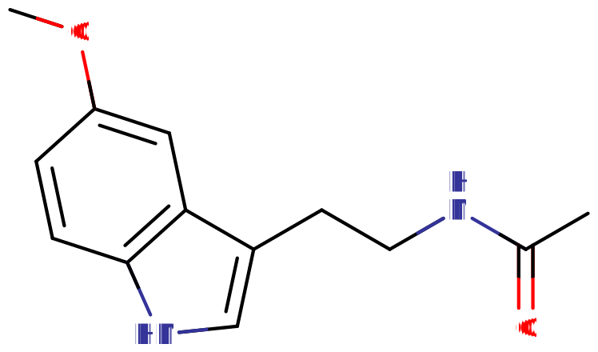

# 褪黑素

[◀返回](index.md)

!!! warning "长期使用褪黑素与心力衰竭有关"

    在一项为期 5 年的回顾研究中（n=130,828，平均年龄 55.7 岁），褪黑素使用者因心力衰竭住院（19.0% vs 6.6%）或死亡（4.6% vs 2.7%）的可能性是普通人的 2 \~ 4 倍。因果关系尚未得到证实，这些发现是在美国心脏协会上发表的（并非在同行评审的科学期刊上）。[^1]

| **化学信息** | 褪黑素（Melatonin）                                    |
| ------------ | ------------------------------------------------------ |
| 结构式       |                              |
| 分子式       | C13H16N2O2 |
| CAS 号       | 73-31-4                                                |
| **化学命名** |                                                        |
| 常用名称     | 褪黑素、松果体素、Melatonin（MT）                      |
| 取代名称     | N-乙酰-5-甲氧基色胺                                    |
| 系统名称     | N-[2-(5-Methoxy-1H-indol-3-yl)ethyl]acetamide          |
| **类别归属** |                                                        |
| 精神活性分类 | [促梦剂](../文档/药物分类/促梦剂.md)                   |
| 化学分类     | [色胺类物质](../文档/药物分类/色胺类物质.md)           |

| [**给药途径**](../文档/给药途径.md)      | 🔽 [口服](../文档/给药途径.md#口服) |
| ---------------------------------------- | ---------------------------------- |
| 生物利用度                               | 15%[^2]                            |
| **给药剂量**                             |                                    |
| [阈值](../文档/药物剂量分类.md#阈值)     | 0.25 mg                            |
| [轻微](../文档/药物剂量分类.md#轻微)     | 0.5 \~ 1 mg                        |
| [中等](../文档/药物剂量分类.md#中等)     | 1 \~ 3 mg                          |
| [强烈](../文档/药物剂量分类.md#强烈)     | 3 \~ 6 mg                          |
| [严重](../文档/药物剂量分类.md#严重)     | 6 mg +                             |
| **药效时长**                             |                                    |
| [总时长](../文档/药效时长.md#总时长)     | 3 \~ 6 小时                        |
| [药效发作](../文档/药效时长.md#药效发作) | 5 \~ 20 分钟                       |
| [药效上升](../文档/药效时长.md#药效上升) | 20 \~ 70 分钟                      |
| [药效达峰](../文档/药效时长.md#药效达峰) | 1 \~ 2 小时                        |
| [药效褪去](../文档/药效时长.md#药效褪去) | 2 \~ 3 小时                        |
| [药效残余](../文档/药效时长.md#药效残余) | 2 \~ 4 小时                        |

- !!! warning "警告"

        由于个体体重、耐受性、新陈代谢和个人敏感度的差异，请务必从低剂量开始。参见[负责任的用药部分](../文档/负责任的用药索引页.md)。

    !!! info "[免责声明](../关于本站/免责声明.md)"

        本站的[给药剂量](../文档/给药剂量.md)信息收集自用户和[相关资源](../文档/科学信息索引页.md)，仅供教育目的使用。这不是医疗建议，应与其他来源核实以确保准确性。

**N-乙酰-5-甲氧基色胺**（亦称 **褪黑素**[^3]）是[色胺类物质](../文档/药物分类/色胺类物质.md)中的一种激素。它存在于动物、植物、真菌和细菌中。在动物体内，它的功能是作为一种激素，预测每日黑暗的开始；[^4] 它在其他生物体中可能具有不同的功能。

褪黑素具有活性，可以通过将其放入口中并让其在 15 \~ 25 分钟内吸收来进行[舌下给药](../文档/给药途径.md#舌下)和[颊粘膜给药](../文档/给药途径.md#颊黏膜)。当[口服](../文档/给药途径.md#口服)时，其活性较低。

褪黑素通常用作治疗失眠的药物；然而，没有足够的科学证据证明其在该领域有任何益处。[^5] 在美国和加拿大的大多数药店中，它是作为非处方药出售的。在其他国家，可能需要处方或无法获得。

值得注意的是，购买褪黑素时，剂量范围可能在 3 \~ 10 毫克之间。虽然并不危险，但这个剂量范围远高于 0.25 毫克的有效剂量，并且可能会增加第二天的嗜睡情况。[^6]

## 化学

褪黑素由一个连接在吲哚环第三个碳原子上的单胺链组成。单胺链由连接在乙烷链上的胺基组成。这种单胺链存在于许多神经递质中，包括[组胺](../文档/组胺.md)、[多巴胺](../文档/多巴胺.md)、[肾上腺素](../文档/肾上腺素.md)和[去甲肾上腺素](../文档/去甲肾上腺素.md)。它也存在于许多精神活性物质中，例如[色胺类物质](../文档/药物分类/色胺类物质.md)和[苯乙胺类物质](../文档/药物分类/苯乙胺类物质.md)化学类别的成员。

褪黑素作为一种色胺，与[迷幻剂](../文档/药物分类/迷幻剂.md)物质具有许多相同的结构特性。然而，它缺乏相关的迷幻效果。[^7] 许多色胺在乙胺上键合了一个基团，而褪黑素有一个乙酰基。

当使用 Erlich 试剂时，褪黑素会发生反应，变成粉红/红色到紫色（使用 Natrol 褪黑素片测试）。

## 药理学

褪黑素是褪黑素受体 1（皮摩尔结合亲和力）和褪黑素受体 2（纳摩尔结合亲和力）的完全激动剂，两者都属于 G 蛋白偶联受体（GPCRs）类别。[^8] 褪黑素受体 1 和 2 都是 Gi/o 偶联 GPCRs，尽管褪黑素受体 1 也是 Gq 偶联的。[^8] 褪黑素还作为线粒体内的强效自由基清除剂，并通过褪黑素受体的信号转导促进抗氧化酶的表达，如超氧化物歧化酶、谷胱甘肽过氧化物酶、谷胱甘肽还原酶和过氧化氢酶。[^8]
褪黑素在肝脏中由细胞色素 P450 酶 CYP1A2 代谢为 6-羟基褪黑素。代谢物与硫酸或葡萄糖醛酸结合后通过尿液排出。5% 的褪黑素以原形药物通过尿液排出。[^9] 褪黑素与自由基反应形成的一些代谢物包括环状 3-羟基褪黑素、N1-乙酰-N2-甲酰-5-甲氧基犬尿胺 (AFMK) 和 N1-乙酰-5-甲氧基犬尿胺 (AMK)。[^8]

## 主观效应

!!! info "[免责声明](../关于本站/免责声明.md)"

    _下列效应引用自 [**主观效应索引**](../药效/index.md) (**SEI**)，这是一个基于轶事用户报告和个人分析的开放研究文献。因此，应带着健康的怀疑态度来看待它们。_

    _同样值得注意的是，这些效应不一定会以可预测或可靠的方式发生，尽管较高的剂量更可能引发全方位的效应。同样，**不良反应** 随着剂量的增加变得越来越可能，可能包括 **成瘾、严重伤害或死亡** ☠。_

- ### **[躯体效应](../药效/躯体效应.md)** 
    - **[镇静](../药效/镇静.md)**：褪黑素不会产生像[酒精](酒精.md)、[苯二氮卓类物质](../文档/药物分类/苯二氮卓类物质.md)或[唑吡坦](思诺思（酒石酸唑吡坦片）.md)等中枢神经抑制剂那样的镇静作用。
    - **[肌肉松弛](../药效/肌肉松弛.md)**[^10][^10]：与其他化合物（如[苯二氮卓类物质](../文档/药物分类/苯二氮卓类物质.md)）相比，这种效应非常轻微，仅在严重剂量下才会出现。
        - **[躯体欣快感](../药效/躯体欣快感.md)**：这种效应可能与[肌肉松弛](../药效/肌肉松弛.md)同时发生，并且仅当用户抵制睡眠冲动并在严重剂量下才会出现。
    - **[性欲减退](../药效/性欲减退.md)**：这种效应可能是由[镇静](../药效/镇静.md)引起的，或者是由于褪黑素可以抑制控制性功能的激素分泌。

- ### **[认知效应](../药效/认知效应.md)** 
    - **困倦**：关于其对用户身体能量水平的影响，褪黑素通常被认为能促进困倦。它经常作为助眠剂使用和销售，并模拟一个人的自然昼夜周期。
    - **焦虑抑制或焦虑**：尽管这种物质对大多数人来说能减少焦虑，但也可能在某些人身上引起焦虑。
    - **梦境增强**：褪黑素能有效增加梦的持续时间、发生率和生动性。人们通常会注意到，在服用褪黑素作为助眠剂后的第二天早上，他们的梦明显增加了。褪黑素有时用于增加清醒梦的机会。
    - **[分离效应](../药效/分离效应.md)**：如果用户摄入了大量剂量，人格解体可能会在药效上升期间出现并持续到第二天。
    - **易怒**：易怒仅在用户抵制睡眠冲动的高剂量下才会出现。

- ### **药效残余** 
    - **[头痛](../药效/头痛.md)**：一小部分人在摄入褪黑素后的第二天可能会感到头痛。[^11]
    - **困倦**

### 体验报告

目前我们的[报告索引](../报告/index.md)中没有关于该物质效果的体验报告。你可以在[本站 Github 仓库](https://github.com/SalviaSWC/FreeODwiki)提交你自己的体验报告。

其他的体验报告可以在这里找到：

- [Erowid Experience Vaults: Melatonin](https://erowid.org/experiences/subs/exp_Melatonin.shtml)

## 毒性和危害潜力

褪黑素是非成瘾性的，目前已知无害，且相对于剂量的毒性极低。与其他[色胺类物质](../文档/药物分类/色胺类物质.md)类似，急性褪黑素暴露相关的身体副作用相对较少。各种研究表明，在谨慎的背景下使用合理剂量，它不会产生负面的认知、精神或有毒的身体后果。

在短期（最长三个月）低剂量测试中，褪黑素似乎引起的副作用非常少。两项系统评价发现，在多项临床试验中没有发现褪黑素使用的不良反应，而对比试验发现，褪黑素和安慰剂的头痛、头晕、恶心和嗜睡等不良反应报告率大致相同。[^12][^13] 缓释褪黑素在长达 12 个月的长期使用中是安全的。[^14]

### 致死剂量

在任何环境中，人类从未达到 50% 参与者死亡的褪黑素中位致死剂量（[LD50](../文档/LD50.md)）。

### 依赖性和滥用潜力

褪黑素不具有成瘾性。然而，如果长期每晚使用该化合物，可能会产生轻微的生理依赖。这仅仅意味着，如果一个人在没有减量的情况下突然停止使用该物质，他们可能会在之后几天内难以入睡。

长期重复使用后，对褪黑素效应的耐受性会缓慢建立。在那之后，耐受性需要大约 7 天才能减半，14 天才能恢复到基线（在不再摄入的情况下）。褪黑素与没有其他已知的化合物存在交叉耐受，这意味着在使用褪黑素后，其他精神活性化合物的效果不会降低。

## 法律地位

- **中国大陆**：褪黑素于 2005 年被允许作为保健食品原料使用，2021 年被正式列入《保健食品原料目录》，明确每日推荐用量为 1 \~ 3 毫克，纯度需达 99.5%，但明确不适宜少年儿童、孕期及哺乳期女性，且特别提醒「驾驶、机械作业者操作前不可食用」。
- **澳大利亚**：褪黑素属于附表 4（仅限处方），除非包含在附表 3（仅限药剂师）中供人类使用：
    - 用于 55 岁或以上成人的原发性失眠（以睡眠质量差为特征）的短期单一治疗的含 2 毫克或更少褪黑素的缓释片剂，包装不超过 30 片。[^15]
- **加拿大**：褪黑素作为膳食补充剂可自由购买，在该国大多数药店和杂货店都能找到。[^16]
- **法国**：褪黑素为非处方药。
- **德国**：根据 Anlage 1 AMVV，褪黑素是处方药。[^17] 然而，它以特定形式作为膳食补充剂出售，通常剂量较低或作为复方制剂。[^18]
- **印度**：购买褪黑素作为膳食补充剂是合法的。
- **意大利**：购买褪黑素作为膳食补充剂是合法的。
- **爱尔兰**：褪黑素仅限处方药。[^19]
- **瑞典**：少量褪黑素为非处方药，但通常为处方药。[^20]
- **瑞士**：褪黑素被列为「Abgabekategorie B」药品，通常需要处方。[^21]
- **英国**：褪黑素在英国是许可的仅限处方药 (POM)。[^22] 在没有有效处方的情况下持有这种药物并不构成刑事犯罪。这种药物可以通过有效处方合法获得，或根据 1968 年药品法第 13 条的规定合法进口供个人使用。[^23]
- **美国**：褪黑素被列为非管制物质，持有和分发是合法的，并且作为膳食补充剂可自由购买。[^24]

## 另见

- [负责任的用药](../文档/负责任的用药索引页.md)
- [促梦剂](../文档/药物分类/促梦剂.md)
- [神经递质](../文档/神经递质再摄取抑制剂.md) (注：链接至相关类别)
- [激素](../文档/Hormone.md)
- [色胺类物质](../文档/药物分类/色胺类物质.md)

## 外部链接

- [Melatonin (Wikipedia)](https://en.wikipedia.org/wiki/Melatonin)
- [Melatonin as a medication and supplement (Wikipedia)](https://en.wikipedia.org/wiki/Melatonin_as_a_medication_and_supplement)
- [Melatonin (Erowid Vault)](https://erowid.org/smarts/melatonin/)
- [Melatonin (TiHKAL / Isomer Design)](http://isomerdesign.com/PiHKAL/read.php?domain=tk&id=35)
- [Melatonin (DrugBank)](https://go.drugbank.com/drugs/DB01065)
- [Melatonin (Drugs.com)](https://www.drugs.com/melatonin.html)
- [Melatonin (Examine)](https://examine.com/supplements/melatonin/)

## 引用文献

[^1]: [_Long-term use of melatonin supplements to support sleep may have negative health effects_](https://newsroom.heart.org/news/long-term-use-of-melatonin-supplements-to-support-sleep-may-have-negative-health-effects), American Heart Association, 2025, retrieved 11 November 2025 

[^2]: DeMuro, R. L., Nafziger, A. N., Blask, D. E., Menhinick, A. M., Bertino, J. S. (July 2000). ["The Absolute Bioavailability of Oral Melatonin"](http://doi.wiley.com/10.1177/00912700022009422). _The Journal of Clinical Pharmacology_. **40** (7): 781–784. [doi](http://en.wikipedia.org/wiki/Digital_object_identifier):[10.1177/00912700022009422](https://doi.org/10.1177%2F00912700022009422). [ISSN](http://en.wikipedia.org/wiki/International_Standard_Serial_Number) [0091-2700](https://www.worldcat.org/issn/0091-2700). 

[^3]: [_Sleepdex: Melatonin_](http://www.sleepdex.org/melatonin.htm) 

[^4]: Hardeland, R., Pandi-Perumal, S. R., Cardinali, D. P. (March 2006). "Melatonin". _The International Journal of Biochemistry & Cell Biology_. **38** (3): 313–316. [doi](http://en.wikipedia.org/wiki/Digital_object_identifier):[10.1016/j.biocel.2005.08.020](https://doi.org/10.1016%2Fj.biocel.2005.08.020). [ISSN](http://en.wikipedia.org/wiki/International_Standard_Serial_Number) [1357-2725](https://www.worldcat.org/issn/1357-2725). 

[^5]: Brasure, M., MacDonald, R., Fuchs, E., Olson, C. M., Carlyle, M., Diem, S., Koffel, E., Khawaja, I. S., Ouellette, J., Butler, M., Kane, R. L., Wilt, T. J. (2015). [_Management of Insomnia Disorder_](http://www.ncbi.nlm.nih.gov/books/NBK343503/). AHRQ Comparative Effectiveness Reviews. Agency for Healthcare Research and Quality (US). 

[^6]: Mundey, K., Benloucif, S., Harsanyi, K., Dubocovich, M. L., Zee, P. C. (October 2005). "Phase-dependent treatment of delayed sleep phase syndrome with melatonin". _Sleep_. **28** (10): 1271–1278. [doi](http://en.wikipedia.org/wiki/Digital_object_identifier):[10.1093/sleep/28.10.1271](https://doi.org/10.1093%2Fsleep%2F28.10.1271). [ISSN](http://en.wikipedia.org/wiki/International_Standard_Serial_Number) [0161-8105](https://www.worldcat.org/issn/0161-8105). 

[^7]: [_Erowid Online Books : “TIHKAL” - #35 MELATONIN_](https://erowid.org/library/books_online/tihkal/tihkal35.shtml) 

[^8]: JJockers, R., Delagrange, P., Dubocovich, M. L., Markus, R. P., Renault, N., Tosini, G., Cecon, E., Zlotos, D. P. (September 2016). "Update on melatonin receptors: IUPHAR Review 20". _British Journal of Pharmacology_. **173** (18): 2702–2725. [doi](http://en.wikipedia.org/wiki/Digital_object_identifier):[10.1111/bph.13536](https://doi.org/10.1111%2Fbph.13536). [ISSN](http://en.wikipedia.org/wiki/International_Standard_Serial_Number) [1476-5381](https://www.worldcat.org/issn/1476-5381). 

[^9]: Tordjman, S., Chokron, S., Delorme, R., Charrier, A., Bellissant, E., Jaafari, N., Fougerou, C. (April 2017). "Melatonin: Pharmacology, Functions and Therapeutic Benefits". _Current Neuropharmacology_. **15** (3): 434–443. [doi](http://en.wikipedia.org/wiki/Digital_object_identifier):[10.2174/1570159X14666161228122115](https://doi.org/10.2174%2F1570159X14666161228122115). [ISSN](http://en.wikipedia.org/wiki/International_Standard_Serial_Number) [1875-6190](https://www.worldcat.org/issn/1875-6190). 

[^10]: Pozo, M. J., Gomez-Pinilla, P. J., Camello-Almaraz, C., Martin-Cano, F. E., Pascua, P., Rol, M. A., Acuña-Castroviejo, D., Camello, P. J. (2010). "Melatonin, a potential therapeutic agent for smooth muscle-related pathological conditions and aging". _Current Medicinal Chemistry_. **17** (34): 4150–4165. [doi](http://en.wikipedia.org/wiki/Digital_object_identifier):[10.2174/092986710793348536](https://doi.org/10.2174%2F092986710793348536). [ISSN](http://en.wikipedia.org/wiki/International_Standard_Serial_Number) [1875-533X](https://www.worldcat.org/issn/1875-533X). 

[^11]: [_Melatonin (Melatonin Time Release) - Side Effects, Interactions, Uses, Dosage, Warnings_](https://www.everydayhealth.com/drugs/melatonin) 

[^12]: Buscemi, N., Vandermeer, B., Hooton, N., Pandya, R., Tjosvold, L., Hartling, L., Baker, G., Klassen, T. P., Vohra, S. (December 2005). ["The Efficacy and Safety of Exogenous Melatonin for Primary Sleep Disorders"](https://www.ncbi.nlm.nih.gov/pmc/articles/PMC1490287/). _Journal of General Internal Medicine_. **20** (12): 1151–1158. [doi](http://en.wikipedia.org/wiki/Digital_object_identifier):[10.1111/j.1525-1497.2005.0243.x](https://doi.org/10.1111%2Fj.1525-1497.2005.0243.x). [ISSN](http://en.wikipedia.org/wiki/International_Standard_Serial_Number) [0884-8734](https://www.worldcat.org/issn/0884-8734). 

[^13]: Buscemi, N., Vandermeer, B., Hooton, N., Pandya, R., Tjosvold, L., Hartling, L., Vohra, S., Klassen, T. P., Baker, G. (18 February 2006). ["Efficacy and safety of exogenous melatonin for secondary sleep disorders and sleep disorders accompanying sleep restriction: meta-analysis"](https://www.ncbi.nlm.nih.gov/pmc/articles/PMC1370968/). _BMJ : British Medical Journal_. **332** (7538): 385–393. [doi](http://en.wikipedia.org/wiki/Digital_object_identifier):[10.1136/bmj.38731.532766.F6](https://doi.org/10.1136%2Fbmj.38731.532766.F6). [ISSN](http://en.wikipedia.org/wiki/International_Standard_Serial_Number) [0959-8138](https://www.worldcat.org/issn/0959-8138). 

[^14]: Lyseng-Williamson, K. A. (November 2012). "Melatonin prolonged release: in the treatment of insomnia in patients aged ≥55 years". _Drugs & Aging_. **29** (11): 911–923. [doi](http://en.wikipedia.org/wiki/Digital_object_identifier):[10.1007/s40266-012-0018-z](https://doi.org/10.1007%2Fs40266-012-0018-z). [ISSN](http://en.wikipedia.org/wiki/International_Standard_Serial_Number) [1179-1969](https://www.worldcat.org/issn/1179-1969). 

[^15]: Health, [_Poisons Standard February 2022_](https://www.legislation.gov.au/Details/F2022L00074/) 

[^16]: <https://health-products.canada.ca/lnhpd-bdpsnh/info?licence=80015830>

[^17]: [_Anlage 1 AMVV - Einzelnorm_](https://www.gesetze-im-internet.de/amvv/anlage_1.html) 

[^18]: Moll, D. (2019), [_Melatonin in Nahrungsergänzungsmitteln_](https://www.deutsche-apotheker-zeitung.de/news/artikel/2019/10/22/melatonin-in-nahrungsergaenzungsmitteln) 

[^19]: <https://www.hpra.ie/homepage/medicines/medicines-information/find-a-medicine/results/item?pano=EU/1/07/392/001&t=Circadin>

[^20]: ”Receptfritt melatonin på apoteken”. _janusinfo.se_.

[^21]: <https://www.swissmedic.ch/swissmedic/de/home/services/listen_neu.html>

[^22]: <https://www.nhs.uk/medicines/melatonin/about-melatonin/>

[^23]: ["Medicines Act 1968 Section 13"](http://www.legislation.gov.uk/ukpga/1968/67/section/13). 

[^24]: <https://www.drugs.com/melatonin.html>
