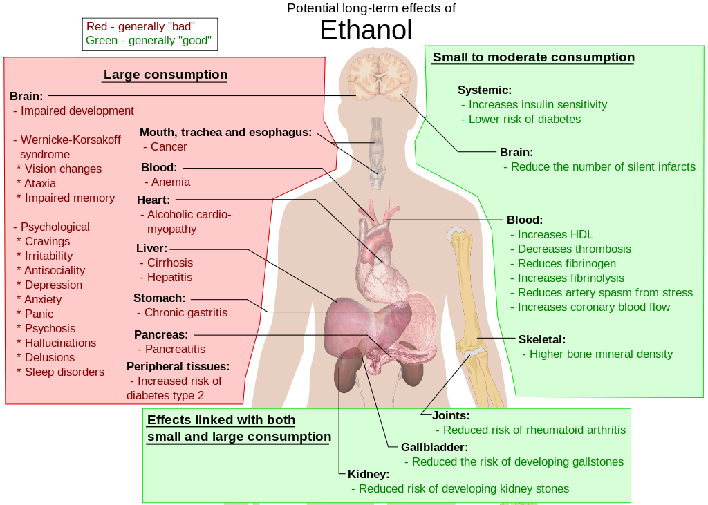

# 酒精

[◀返回](index.md)

??? info "B 站网友的锐评，一语道破天机！"

    

!!! danger "危险"

    **当酒精与其他[抑制剂](../文档/药物分类/抑制剂.md)（Depressants）如[阿片类药物](../文档/药物分类/阿片类药物.md)、[苯二氮卓类药物](../文档/药物分类/苯二氮卓类药物.md)、[巴比妥类药物](../文档/药物分类/巴比妥类药物.md)、[加巴喷丁类物质](../文档/药物分类/加巴喷丁类物质.md)、[噻吩二氮卓类物质](../文档/药物分类/噻吩二氮卓类物质.md)或其他 [GABA 类物质](../文档/GABA.md)联用时，可能会导致致命的[药物过量](../文档/药物过量.md)。**[^1]

    我们强烈不建议将这些物质混合使用，特别是在[中等](../文档/药物剂量分类.md)到[严重](../文档/药物剂量分类.md)剂量的情况下。

!!! warning "**酒精是 1 类致癌物**"

    大概这二十年来，世界卫生组织（WHO）下属的国际癌症研究机构（IARC）一直把酒精列为 1 类致癌物。[^2] 世卫组织强调说，「没有所谓的安全饮酒量是不影响健康的」。令人担忧的是，世卫组织还指出，在欧洲地区，几乎一半的酒精归因癌症都与饮酒有关，哪怕只是「轻微」或「适度」的饮酒也不例外。[^3]

| 化学信息     | 酒精（Alcohol）                                                                                                            |
| ------------ | -------------------------------------------------------------------------------------------------------------------------- |
| 结构式       |                                                                                                    |
| 分子式       | C2H5OH                                                                                               |
| CAS 号       | 64-17-5                                                                                                                    |
| **化学命名** |                                                                                                                            |
| 常用名称     | 酒精（Alcohol）、乙醇（Ethanol）、Booze、Liquor、[Moonshine](https://en.wikipedia.org/wiki/Moonshine)、Sauce、Juice、Bevvy |
| 取代名称     | Ethyl alcohol, EtOH                                                                                                        |
| 系统命名法   | Ethanol                                                                                                                    |
| **类别归属** |                                                                                                                            |
| 精神活性分类 | _[抑制剂](../文档/药物分类/抑制剂.md)_                                                                                     |
| 化学分类     | _Alcohol_                                                                                                                  |

| [**给药途径**](../文档/给药途径.md)      | ⇣ [口服](../文档/给药途径.md#口服) |
| ---------------------------------------- | ---------------------------------- |
| 生物利用度                               | 15%[^2]                            |
| **给药剂量**                             |                                    |
| [阈值](../文档/药物剂量分类.md#阈值)     | 10 g                               |
| [轻微](../文档/药物剂量分类.md#轻微)     | 10 \~ 20 g                         |
| [中等](../文档/药物剂量分类.md#中等)     | 20 \~ 30 g                         |
| [强烈](../文档/药物剂量分类.md#强烈)     | 30 \~ 40 g                         |
| [严重](../文档/药物剂量分类.md#严重)     | 40 + g                             |
| **药效时长**                             |                                    |
| [总时长](../文档/药效时长.md#总时长)     | 1.5 \~ 5 小时                      |
| [药效发作](../文档/药效时长.md#药效发作) | 2 \~ 5 分钟                        |
| [药效上升](../文档/药效时长.md#药效上升) | 15 \~ 45 分钟                      |
| [药效达峰](../文档/药效时长.md#药效达峰) | 30 \~ 90 分钟                      |
| [药效褪去](../文档/药效时长.md#药效褪去) | 45 \~ 120 分钟                     |
| [药效残余](../文档/药效时长.md#药效残余) | 6 \~ 48 小时                       |

| [相互作用](#相互作用) |             |
| --------------------- | ----------- |
| 兴奋剂                | ⚠️ 谨慎联用 |
| 大麻                  | ⚠️ 谨慎联用 |
| 苯丙胺类              | ⚠️ 谨慎联用 |
| αMT                   | ⚠️ 谨慎联用 |
| MDMA                  | ⚠️ 谨慎联用 |
| 一氧化二氮            | ⚠️ 谨慎联用 |
| SSRIs                 | ⚠️ 谨慎联用 |
| 可卡因                | 💔 联用危险 |
| MAOIs                 | 💔 联用危险 |
| PCP                   | 💔 联用危险 |
| ALDH2 抑制剂          | ⛔ 严禁联用 |
| 肝毒性药物            | ⛔ 严禁联用 |
| 抑制剂                | ⛔ 严禁联用 |
| 解离剂                | ⛔ 严禁联用 |
| 苯二氮卓类            | ⛔ 严禁联用 |
| 右美沙芬              | ⛔ 严禁联用 |
| GHB                   | ⛔ 严禁联用 |
| GBL                   | ⛔ 严禁联用 |
| 氯胺酮                | ⛔ 严禁联用 |
| MXE                   | ⛔ 严禁联用 |
| 阿片类                | ⛔ 严禁联用 |
| 曲马多                | ⛔ 严禁联用 |

**乙醇**（Ethanol，也就是大家常说的 **酒精**、**乙基氢氧化物**、**饮用酒** 或者简单地叫 **酒**）是醇类的一种[抑制剂](../文档/药物分类/抑制剂.md)物质。它是酒精饮料、烈酒和利口酒中的主要精神活性成分；这让它成为了全球第二大广泛使用的娱乐性物质（仅次于[咖啡因](咖啡因.md)）。被称为啤酒的酒精饮料是世界上继水和茶之后消费量最大的饮料。乙醇的主要作用是与大脑部分区域的 [GABA](../文档/GABA.md) [受体](../文档/受体.md)结合，但也因其对各种神经递质和受体位点的激活和/或相互作用而表现出「混杂」的药理活性。

乙醇只是几种[醇类](../文档/药物分类/醇类.md)中的一种；其他的醇类，比如甲醇和异丙醇，毒性要大得多。[^4] 轻微、短暂地接触异丙醇（它的毒性只是比乙醇稍大一点点）不太可能造成严重的伤害，但甲醇即使是很少的量也是致命的，哪怕只有 10–15 毫升（2–3 茶匙）这么少。不过，异丙醇和乙醇只是[酒精饮料中的精神活性醇类](../文档/酒精饮料中的精神活性醇类比较.md)及其类似物中的一小部分。与像乙醇这样的伯醇不同，叔醇不能被氧化成通常有毒的醛或羧酸代谢物。比如说，叔醇 [2M2B](2M2B.md) 的效力是乙醇的 20 倍，并且已经被用于娱乐用途了。

人类饮用含乙醇的酒精饮料的习惯早在有文字记载的历史之前就开始了。从新石器时代开始，从狩猎采集社会到民族国家，人类一直在生产和饮用酒精饮料。[^5] 在现代，饮酒是世界上最常用的合法娱乐性物质。[^6] 有超过 100 个国家制定了法律来监管它的生产、销售和消费。[^7]

[主观效应](../药效/index.md)包括[镇静](../药效/镇静.md)、[去抑制](../药效/去抑制.md)、[焦虑抑制](../药效/焦虑抑制.md)、[共情、情感和社交能力增强](../药效/共情、情感和社交能力增强.md)、[肌肉松弛](../药效/肌肉松弛.md)和[欣快感](../药效/认知欣快.md)。不过，这些效果的程度可能在一定程度上取决于生产方法和蒸馏程度。酒精饮料主要分为三类：啤酒、葡萄酒和烈酒（蒸馏饮料）。[^4]

尽管因为合法且广泛使用，有时会被认为是无害的，但乙醇实际上能对使用者造成严重的伤害和毒性。它被认为具有中等的滥用潜力，长期使用会导致耐受性增加、身体依赖和成瘾。此外，长期使用还与对大脑和其他器官的负面影响有关。当它与其他[抑制剂](../文档/药物分类/抑制剂.md)（例如[苯二氮卓类](../文档/药物分类/苯二氮卓类物质.md)、[阿片类](../文档/药物分类/阿片类药物.md)）混合使用时，还有导致致命呼吸抑制过量的巨大风险。因此，如果使用这种物质，强烈建议采取[伤害减少措施](../文档/负责任的用药索引页.md)。

## 用途

### 娱乐用途

「社交饮酒」，也通常被称为「负责任的饮酒」，指的是在社交场合随意饮酒，并不打算喝醉。好消息通常会由一群人喝几杯来庆祝。例如，可能会在庆祝婴儿出生时提供饮料。请人喝酒是一种善意的姿态。它可能表达感激之情，或者标志着争端的解决。

美国国家酒精滥用和酒精中毒研究所 (NIAAA) 将「酗酒」（binge drinking）定义为一种使人的血液酒精浓度 (BAC) 达到 0.08% 或以上的酒精消费模式。这通常发生在男性在约两小时内饮用五杯或更多美国标准饮料，或女性饮用四杯或更多饮料时。药物滥用和心理健康服务管理局 (SAMHSA) 对酗酒的定义略有不同，侧重于单次场合饮用的饮料数量。根据 SAMHSA 的说法，酗酒是指在过去一个月中至少有一天，男性在同一场合饮用五杯或更多饮料，或女性饮用四杯或更多饮料。[^8]

在有饮酒文化的国家，社会耻辱感可能会导致许多人不将酒精视为一种药物，因为它是社交活动的重要组成部分。在这些国家，许多年轻的狂饮者更喜欢称自己为 _享乐主义者_，而不是 _酗酒者_[^9] 或 _娱乐性药物使用者_。本科生通常将自己定位在「严重」或「反社会」饮酒者之外，[^10]或者不认为自己在醉酒时是「吸毒」了。然而，根据 _DSM-5_ 的新标准，美国约有 40% 的大学生[^11]可以被视为酗酒者，但大多数大学里的狂饮者和药物使用者并没有发展出终身问题。[^11] [^12]

2015 年，在成年美国人中，89% 的人在某个时候喝过酒精饮料，70% 的人在过去一年喝过，56% 的人在过去一个月喝过。[^13]

从 2000 年代开始，出现了一种不喜欢喝酒的新亚文化。[^14]

### 自我给药

酒精随处可见，如果不幸遇到了不与其发生冲突的物质引起的[恶性旅程](../文档/恶性旅程.md)，且手头没有像[苯二氮卓类](../文档/药物分类/苯二氮卓类物质.md)或[抗精神病药](../文档/抗精神病药.md)这样更合适的药物时，它可以作为抗焦虑药来平复心情。

酒精经常被用来[自我治疗](../文档/自我给药.md)精神障碍，但这往往会导致酒精依赖。[^15]

### 精神用途

在一些受神秘主义影响的宗教和流派中，可以发现适度饮酒的精神用途，包括印度教密宗派别 [Aghori](https://en.wikipedia.org/wiki/Aghori)，苏菲派 [Bektashi 教团](https://en.wikipedia.org/wiki/Bektashi_Order)和阿列维派 [Jem (Alevism)](<https://en.wikipedia.org/wiki/Cem_(Alevism)>) 仪式，[^16] [Rarámuri](https://en.wikipedia.org/wiki/Rar%C3%A1muri) 宗教，日本宗教[神道教](https://en.wikipedia.org/wiki/Shinto)，[^17] 新兴宗教运动 [泰勒玛](https://en.wikipedia.org/wiki/Thelema)，[金刚乘](https://en.wikipedia.org/wiki/Vajrayana)佛教，以及海地的[海地伏都教](https://en.wikipedia.org/wiki/Haitian_Vodou)信仰。

## 历史与文化

主条目：[酒精饮料的历史与文化](../文档/酒精饮料的历史与文化.md)

早在公元前 7000 年到 6650 年，中国北方就已经开始酿酒了。[^18] 啤酒可能早在公元前六世纪就在埃及用大麦酿造了。[^19] 老普林尼写到了罗马酿酒的*黄金时代*，即公元前二世纪，那时种植了葡萄园。_In vino veritas_ 是一句拉丁语短语，意思是「酒后吐真言」。

2018 年，全球酒精饮料行业规模超过了 1 万亿美元。

### 宗教

关于古代对酒精的崇拜，请参见[酒精饮料的历史与文化](../文档/酒精饮料的历史与文化.md#酒精与宗教)。

[酒精与宗教](https://en.wikipedia.org/wiki/Religion_and_alcohol)之间的关系在不同的文化、地理区域和宗教派别中表现出差异。一些宗教强调适度和负责任的使用，以此作为尊重生命这一神圣礼物的方式，而另一些宗教则完全禁止酒精，以此作为尊重生命这一神圣礼物的方式。此外，在同一个宗教传统中，许多信徒可能会以不同的方式解释和实践他们的信仰关于酒精的教义。因此，宗教信仰、虔诚程度、文化传统、家庭影响和同伴网络等多种因素共同影响着这种关系的动态。

精神背景下的酒精使用水平可以分为：

- **禁止**：一些宗教，包括伊斯兰教[^20]，禁止饮酒。
- **象征性使用**：在一些基督教派别中，圣餐酒是含酒精的，但是只喝一小口，不会提高血液酒精含量，而其他派别则使用不含酒精的葡萄酒。另见 [奠酒](https://en.wikipedia.org/wiki/Libation)。
- **不鼓励消费**：印度教没有所有印度教徒都遵循的中央权威，虽然宗教文本通常不鼓励使用或消费酒精。
- **精神性**：参见[精神用途](#Spiritual)部分。
- **娱乐用途**：一些宗教允许适度娱乐性地使用酒精来庆祝快乐。

基督教对酒精的看法各不相同。例如，在 19 世纪中叶，一些新教基督徒从允许适度使用酒精（有时称为*适度主义*）转变为认为在目前情况下不喝酒是最明智的（_禁酒主义_），或者禁止所有普通的酒精消费，因为这被认为是一种罪过（_禁止主义_）。[^21]

根据《以斯帖记》，在犹太节日普珥节期间，犹太人有义务喝酒（特别是犹太洁食葡萄酒），直到他们的判断能力受损。[^22] [^23] [^24] 然而，普珥节更多的是民族性质而非宗教性质。

## 禁忌症

患有胎儿酒精综合症的婴儿，显示出一些特征性的面部特征。

在美国，酒精属于 FDA 药物标签妊娠类别 **X**（_妊娠期禁忌_）。

乙醇被归类为[致畸剂](https://en.wikipedia.org/wiki/Teratology)[^25] [^26] -- 即已知会导致出生缺陷的物质；根据美国疾病控制与预防中心 (CDC) 的数据，不采取避孕措施的女性饮酒会增加胎儿酒精综合症的风险。CDC 目前建议育龄妇女如果怀孕、试图怀孕或性活跃且未采取避孕措施，应完全戒除酒精饮料。[^27]

## 化学

水果和花蜜中含有少量的[天然存在的](../文档/天然存在的.md)乙醇，但不足以引起中毒。动物，在极少数情况下还有人类，如果食用大量发酵水果（酵母发酵显著增加了酒精含量），可能会醉酒。然而，这并不是一种安全或推荐的摄入酒精的方式，而且所需的水果量可能是不切实际且不健康的。人类已经开发出发酵和蒸馏技术来制造乙醇浓度更高且可控的酒精饮料。

乙醇是醇类家族中第二简单的化合物。乙醇的结构由两个碳原子的链组成，称为乙烷，连接着一个羟基 (-OH) 官能团，形成一种醇。

酒精饮料含有乙醇，但也含有少量其他醇类，这些醇类作为具有不同效力和效果的精神活性药物，也为饮料的颜色、气味和风味做出了贡献。

卢卡斯试验是一种区分伯醇、仲醇和叔醇的测试方法。

### 饮料中发现的精神活性醇类

另见：[酒精饮料中的精神活性醇类比较](../文档/酒精饮料中的精神活性醇类比较.md)

[卢卡斯试验](https://en.wikipedia.org/wiki/Lucas%27_reagent)：乙醇呈阴性（左），叔丁醇呈阳性。

一般来说，含有显著酒精体积比 (ABV) 的饮料标签必须标明实际酒精强度（即「x% alc. by vol.」），这有助于防止人们在不知情的情况下酒后驾车或在没有意识到自己中毒程度的情况下从事其他危险行为。
术语「酒精」主要指伯醇[乙醇](乙醇.md)，这是受酒精法律（包括酒精垄断和酒精税）监管的国家中销售和消费的酒精饮料中的主要醇类。然而，此后又发现了其他醇类，包括在牙买加朗姆酒中发现的 [1-丙醇](../文档/1-丙醇.md)，据估计它在 40% ABV 的朗姆酒中贡献了 21% 的总酒精中毒效果。[^28] 一种名为[_叔_-戊醇](叔戊醇.md) (2M2B) 的叔醇已在啤酒中被发现（啤酒是继饮用水和茶之后总体上第三受欢迎的饮料[^29]）。_叔_-戊醇有时被用作娱乐性药物。[^30]

一些饮料，如朗姆酒、威士忌（特别是波旁威士忌）、未完全精馏的伏特加（例如 Siwucha）以及传统的艾尔啤酒和苹果酒，预计会含有非危险的芳香醇作为其风味特征的一部分。[^28] 欧洲立法要求某些蒸馏饮料（烈酒）中必须含有最低含量的杂醇，以赋予它们预期的独特风味。[^31]

[_叔_-戊醇](叔戊醇.md) (2M2B) 的球棍模型，它的醉酒效力是乙醇的 20 倍[^32]，并且像所有叔醇一样，不能代谢成有毒的醛类。[^33] [^34] [^35]

### 乙醇类似物

醇类是一类高度多样化的有机化合物，包含一个或多个与碳原子结合的羟基官能团 (-OH)。醇类根据连接到带有羟基官能团的碳原子上的碳原子数量分为伯醇、仲醇 (sec-, s-) 和叔醇 (tert-, t-)。

乙醇有多种结构类似物，其中许多具有类似的效果。

在酒精饮料行业中，同源物（congeners）是乙醇发酵过程中产生的物质。这些物质包括少量更强效的化学物质，例如偶尔需要的其他醇类，如 1-丙醇、2-甲基-1-丁醇 (2M1B)、2-甲基-1-丙醇 (2M1P) 和 3-甲基-1-丁醇 (3M1B)，但也包括从不需要的化合物，如丙酮、乙醛和二醇。同源物是蒸馏酒精饮料中大部分味道和香气的来源，也有助于非蒸馏饮料的味道。[^36]

甲醇（木醇）和异丙醇（外用酒精）有毒，不适合人类食用。[^4] 甲醇是毒性最大的醇；异丙醇的毒性介于乙醇和甲醇之间，约为乙醇的两倍。[^37] 一般来说，高级醇的毒性较小。[^37] 据报道，正丁醇产生的效果与乙醇相似，毒性相对较低（在一项大鼠研究中为乙醇的六分之一）。[^38] [^39] 然而，其蒸气会引起眼部刺激，吸入会导致肺水肿。[^37] 丙酮（propanone）是酮而不是醇，据报道会产生类似的毒性作用；它对角膜极具破坏性。[^37]

叔醇 [_叔_-戊醇](叔戊醇.md) (TAA)，也称为 2-甲基丁-2-醇 (2M2B)，曾被用作[催眠药](../文档/催眠药.md)和[麻醉剂](../文档/麻醉剂.md)，其他叔醇如甲基戊炔醇、乙氯维诺和氯醛醇也是如此。与乙醇等伯醇不同，这些叔醇不能被氧化成通常有毒的醛或羧酸代谢物，因此，这些化合物相对更安全。[^35] 此外，替代酒精产品不需要缴纳酒精税。然而，随着安全性更有利的新药如水合氯醛、副醛以及许多挥发性和吸入性麻醉剂（例如[乙醚](乙醚.md)和[异氟烷](异氟烷.md)）的出现，它们的使用已逐渐被淘汰。

## 药理学

低剂量的乙醇会引起[欣快感](../药效/认知欣快.md)、减轻焦虑、增加社交能力和热情，显著更高的剂量会导致酒精中毒（醉酒）、木僵、无意识、严重的运动控制丧失以及中枢神经系统功能的普遍抑制（抑制）。长期使用会导致酒精滥用、身体依赖或「酗酒」（这是一个相当宽泛的术语）。

酒精对人类有成瘾性，会导致酒精耐受（对药物的敏感性降低）、酒精戒断综合征（药物依赖）或与酗酒相关的健康问题。众所周知，它会对健康产生许多不利影响。当摄入足够量时，该药物已被判定具有[神经毒性](../药效/神经毒性.md)。[^40] [^41] 在高剂量或[药物过量](../文档/药物过量.md)的情况下，酒精可能会导致意识丧失，严重情况下甚至导致死亡。它是许多交通事故和因醉酒驾驶导致的车辆死亡的肇事因素。它还与社会上相当大比例的暴力犯罪有关。

过去，人们认为酒精是一种非特异性药理制剂，影响大脑中的许多神经递质系统。[^42] 虽然这种观点仍有一定道理，但为了更全面地了解其精确的药效学而对其分子药理学进行的进一步研究表明，酒精只有几个主要靶点，特别是通过（增强/促进）某些 GABA 受体。然而，其整体药理学特征和效果范围仍可被视为在某些系统中具有促进作用（如 GABA），而在其他系统中具有抑制作用。

这种对某些神经递质系统的增强作用列举如下，其中乙醇（酒精）已知具有以下功能：

- **GABAA 受体 [正向变构调节剂](../文档/正向变构调节剂.md)（主要是含 [δ 亚基](../文档/GABRD.md)的受体）**[^43] 与[苯二氮卓类](../文档/药物分类/苯二氮卓类物质.md)和巴比妥类药物类似，增强名为 [GABA](../文档/GABA.md) 的抑制系统会诱导神经以及更广泛的生理抑制。这增强了行为抑制中心，从而减缓了对来自感官的新信息的处理，抑制了各种类型的认知思维过程，并普遍诱导了正常躯体和认知功能的抑制。然而，该药物通常同时调节其他神经递质系统，特别是在适度剂量下，似乎可以在一定程度上；甚至足以抵消或至少减轻其中一些认知抑制，这使得它与其他几乎完全导致神经/生理抑制的 GABA 类药物相比相对独特，无论剂量如何，而酒精则表现出「平衡木」式的神经活动形式。
- **[5-HT3 受体](../文档/血清素.md) [激动剂](../文档/受体激动剂.md)**[^44]
- [甘氨酸受体](../文档/甘氨酸受体.md)
- **[烟碱乙酰胆碱受体](../文档/烟碱乙酰胆碱受体.md)**[^45]
- **[腺苷](../文档/腺苷.md)：**[^46]乙醇通过抑制支气管上皮细胞中的核苷转运系统来阻断腺苷摄取。乙醇抑制腺苷摄取导致细胞外腺苷积累增加，影响腺苷在上皮细胞表面的作用，这可能会改变气道稳态。

而被抑制/压制的神经递质包括：

- **[谷氨酸](../文档/谷氨酸.md)**[^47]：通过降低这种兴奋性神经递质的有效性，某些神经生理过程会进一步受到抑制。酒精通过与这些通路中接收细胞上的受体相互作用并阻止谷氨酸与 NMDA 受体结合来实现这一点，从而触发特定的电化学信号。
- **[二氢吡啶](../文档/二氢吡啶.md)**[^48]：这些直接影响的结果导致了一波涉及各种其他神经递质和神经肽系统的进一步间接（或次要）效应，从而似乎导致了在受酒精中毒影响的个体中观察到的特征性行为和症状效应。[^42] 然而值得注意的是，就这些过程如何直接导致酒精相当特定的主观效应体验，以及它们背后的确切潜在因果机制而言，除了研究人员通过对目前可用但仍然有限的药物药理数据进行各种解释而做出的纯粹推测之外，在很大程度上仍然未知。

上图显示了常见酒精饮料中的平均单位含量。这可以结合下面的图表来确定自己想要的剂量。

### 起效时间

起效时间取决于酒精饮料的类型：[^49]

- 伏特加/奎宁水：36 ± 10 分钟
- 葡萄酒：54 ± 14 分钟
- 啤酒：62 ± 23 分钟

此外，碳酸酒精饮料似乎比同体积的无气饮料起效更快。一种理论是气泡中的二氧化碳以某种方式加速了酒精流入肠道的速度。[^50]

## 类型

饮用酒精可以是以下形式：

- **酒精饮料**：酒精饮料通常被称为酒，会引起酒精中毒或「醉酒」的特征性影响。酒精饮料通常分为三类——啤酒、葡萄酒和烈酒——通常含有 3% 到 40% 的酒精体积比。此外，酒精饮料通常含有 3%–40% 的乙醇，但啤酒含有 0.07% 的 [2M2B](2M2B.md)，其效力是乙醇的 20 倍，因此贡献了 28% (0.07×20÷5) 的酒精中毒效果，牙买加朗姆酒含有 2.8% 的 1-丙醇，其效力是乙醇的 3 倍，因此贡献了 21% (2.8×3÷40) 的酒精中毒效果（见[表格](#Psychoactive_alcohols_found_in_drinks)）。
- **精馏烈酒**：精馏烈酒也被称为中性烈酒、精馏酒精。在美国，其未稀释形式含有至少 95% 的[酒精体积比](../文档/酒精体积比.md) (ABV)（190 美制[酒精度](../文档/酒精度.md)），或者在欧盟含有至少 96% ABV。[^51] 精馏烈酒的纯度实际限制为 97.2% ABV（质量分数为 95.6%）[^52] 除乙醇外的其他醇类作为溶剂生产用于工业用途（例如 [2M2B](2M2B.md) 和 1-丙醇），但已被用作新型药物（如果未变性），通常不受酒精税和法定饮酒年龄等酒精法律的约束。
- **危险醇类** 如甲醇（用于变性酒精和木醇）和异丙醇（许多种类的外用酒精）具有潜在的致命性。[^4]

## 制备

### 配方和制备方法

- [发酵水](../文档/水发酵术.md)
    - [Alcopop](../文档/Alcopop.md)

## 主观效应

!!! info "[免责声明](../关于本站/免责声明.md)"

    _下列效应引用自 [**主观效应索引**](../药效/index.md) (**SEI**)，这是一个基于轶事用户报告和个人分析的开放研究文献。因此，应带着健康的怀疑态度来看待它们。_

    _同样值得注意的是，这些效应不一定会以可预测或可靠的方式发生，尽管较高的剂量更可能引发全方位的效应。同样，**不良反应** 随着剂量的增加变得越来越可能，可能包括 **成瘾、严重伤害或死亡** ☠。_

- ### **[躯体效应](../药效/躯体效应.md)** 
    - **[神经毒性](../药效/神经毒性.md)**[^53] [^54]
    - **[镇静](../药效/镇静.md)** & **[刺激](../药效/刺激.md)**：这种效果表现为在中等剂量下精力和做某些活动的欲望增加，而在低剂量或高剂量下会导致使用者感到镇静和困倦
    - **[肌肉松弛](../药效/肌肉松弛.md)**
    - **[镇痛](../药效/镇痛.md)**
    - **[躯体欣快感](../药效/躯体欣快感.md)**
    - **[食欲增强](../药效/食欲增强.md)**
    - **[运动控制丧失](../药效/运动控制丧失.md)**
    - **[体味改变](../药效/体味改变.md)**：这种效果在所有剂量下都存在，剂量越高越明显。这是由于肝脏无法消除体内存在的所有酒精造成的。未被肝脏消除的酒精随后将通过肾脏、肺部和排汗（出汗）消除，后者会导致体味改变，以及[出汗增加](../药效/出汗增加.md)。[^55]
    - **[血压升高](../药效/血压升高.md)**
    - **[出汗增加](../药效/出汗增加.md)**
    - **[恶心](../药效/恶心.md)**
    - **[脱水](../药效/脱水.md)**
    - **[排尿困难](../药效/排尿困难.md)** & **[尿频](../药效/尿频.md)**
    - **[头晕](../药效/头晕.md)**
    - **[头痛](../药效/头痛.md)**
    - **[体温调节抑制](../药效/体温调节抑制.md)**
        - **[体温升高](../药效/体温升高.md)** _或_ **[体温降低](../药效/体温降低.md)**：一个常见的误解是酒精中毒可以降低体温过低的几率，而实际上，它实际上增加了体温过低的几率，部分原因是[体温调节抑制](../药效/体温调节抑制.md)。即使少量的酒精也会开始减慢有助于维持正常核心体温的机制。
    - **[呼吸抑制](../药效/呼吸抑制.md)**：这种效果在较重剂量下变得更加明显，并可能导致或促成意识丧失（「断片」），或者在极端情况下导致死亡。
    - **[皮肤潮红](../药效/皮肤潮红.md)**
    - **[触觉抑制](../药效/触觉抑制.md)**：这种效果通常不像[氯胺酮](氯胺酮.md)或[PCP](PCP.md)等物质那样明显，但仍可能以不同程度的强度表现出来。
    - **[暂时性勃起功能障碍](../药效/暂时性勃起功能障碍.md)**

- ### **[视觉效应](../药效/视觉效应.md)** 
    - **[视觉锐度抑制](../药效/视觉锐度抑制.md)**
    - **[复视](../药效/复视.md)**：这种效果随剂量增加而增加，可能使驾驶或操作机器变得不可能。
    - **[模式识别抑制](../药效/模式识别抑制.md)**
    - **[残影](../药效/残影.md)**：这种效果可能出现在较高剂量下。

- ### **[认知效应](../药效/认知效应.md)** 
    - **[分析能力抑制](../药效/分析能力抑制.md)**
    - **[焦虑抑制](../药效/焦虑抑制.md)**
    - **[去抑制](../药效/去抑制.md)**
    - **[认知欣快](../药效/认知欣快.md)**
    - **[强迫性补量](../药效/强迫性补量.md)**
    - **[创造力抑制](../药效/创造力抑制.md)**
    - **[清醒度错觉](../药效/妄想.md)**：即使有明显的相反证据，如严重的认知障碍和无法与他人充分交流，仍错误地认为自己非常清醒。
    - **[抑郁](../药效/抑郁.md)**
    - **[自我膨胀](../药效/自我膨胀.md)**
    - **[共情、情感和社交能力增强](../药效/共情、情感和社交能力增强.md)**
    - **[情绪强化](../药效/情绪强化.md)**
    - **[专注力抑制](../药效/专注力抑制.md)**
    - **[音乐欣赏能力增强](../药效/音乐欣赏能力增强.md)**
    - **[性欲增强](../药效/性欲增强.md)**
    - **[信息处理抑制](../药效/信息处理抑制.md)**
    - **[语言能力抑制](../药效/语言能力抑制.md)**
    - **[记忆抑制](../药效/记忆抑制.md)**
        - **[失忆](../药效/失忆.md)**
    - **[困倦](../药效/困倦.md)**：这种效果几乎只在低剂量或高剂量下体验到。小剂量的酒精会导致许多用户感到从轻微到极度疲倦，而中等剂量实际上会导致刺激和清醒的感觉。然而，在非常高的剂量下，个人失去意识的几率要大得多。
    - **[暗示性抑制](../药效/暗示性抑制.md)**
    - **[易怒](../药效/易怒.md)**
    - **[思维减速](../药效/思维减速.md)**
    - **[思维混乱](../药效/思维混乱.md)**

- ### **[听觉效应](../药效/听觉效应.md)** 

    **[听觉抑制](../药效/听觉锐度抑制.md)** _或_ **[听觉增强](../药效/听觉锐度增强.md)**：虽然酒精在技术上能够增强和抑制听觉刺激，但它通常会抑制它，尽管一些用户注意到在影响下声音看起来增强且明显更响亮。

- ### **药效残余** 

    在酒精中毒[药效褪去](../文档/药效时长.md)期间发生的影响通常与[药效达峰](../文档/药效时长.md)期间发生的影响相比感觉消极和不舒服。这通常被称为「下头」或「宿醉」，主要是由于[脱水](../药效/脱水.md)，部分原因是[利尿](../药效/尿频.md)。其影响通常包括：
    - **[焦虑](../药效/焦虑.md)**
    - **[震颤性谵妄](../药效/谵妄.md)**
    - **[食欲抑制](../药效/食欲抑制.md)**
    - **[认知疲劳](../药效/认知疲劳.md)** 和 **[躯体疲劳](../药效/躯体疲劳.md)**
    - **[脱水](../药效/脱水.md)**
    - **[恶心](../药效/恶心.md)**
    - **[头痛](../药效/头痛.md)**
    - **[信息处理抑制](../药效/信息处理抑制.md)**
    - **[睡眠瘫痪](../文档/睡眠瘫痪.md)**：一些用户在饮酒后经历睡眠瘫痪；通常与持续使用有关。
    - **[思维减速](../药效/思维减速.md)**

### 体验报告

目前我们的[报告索引](../报告/index.md)中没有关于该物质效果的体验报告。你可以在[本站 Github 仓库](https://github.com/SalviaSWC/FreeODwiki)提交你自己的体验报告。

其他的体验报告可以在这里找到：

- [Experience: A combination of diazepam and alcohol](https://psychonautwiki.org/wiki/Experience:_A_combination_of_diazepam_and_alcohol)
- [Erowid Experience Vaults: Alcohol Reports](https://www.erowid.org/experiences/subs/exp_Alcohol.shtml)

## 医疗用途

各种形式的醇类在医学中被用作防腐剂、消毒剂和解毒剂。[^56] 除了这些用途外，酒精没有其他被广泛接受的医疗用途，[^57] 乙醇的[治疗指数](../文档/治疗指数.md)只有 10:1。[^58]

涂在皮肤上，它用于在[针头注射](../文档/较安全的注射指南.md)前和手术前消毒皮肤。[^59]

当没有甲吡唑时，口服或静脉注射用于治疗甲醇或乙二醇中毒。[^56] 乙醇与其他醇类竞争乙醇脱氢酶，减少代谢成有毒的醛和羧酸衍生物，[^60] 并减少二醇在肾脏中结晶的更严重毒性作用之一。

## 毒性与危害潜力

|  |                                                                                                                          |                           |
| ----------------------------------------------------------------- | --------------------------------------------------------------------------------------------------------------------------------------------------------------- | --------------------------------------------------- |
| 乙醇可能造成的长期影响中最显著的部分                              | 2010 年一项研究的结果，根据药物危害专家的意见对药物造成的损害程度进行排名。当对自身和对他人的伤害加总时，酒精被认为是所有考虑的药物中危害最大的（得分为 72%）。 | 雷达图显示酒精的相对身体伤害、社会伤害和依赖性[^61] |

短期内明智地使用酒精极不可能对一个人的身体健康产生任何积极或消极的影响。然而，尽管酒精在大多数国家广泛使用且合法，但许多医学来源倾向于将任何程度的酒精中毒描述为一种中毒形式，因为大剂量乙醇对身体有破坏性影响。

酒精消费的长期影响范围从在心血管疾病发病率较高的工业化社会中低至中度酒精消费的心脏保护健康益处[^62] [^63]到慢性酒精滥用情况下的严重有害影响。[^64]

高水平的酒精消费与酗酒、营养不良、慢性胰腺炎、酒精性肝病和癌症的风险增加有关。此外，慢性酒精滥用还会导致中枢神经系统和周围神经系统受损。[^65] [^66] 长期使用酒精能够损害身体的几乎每一个器官和系统。[^67] 发育中的青少年大脑特别容易受到酒精毒性作用的影响。[^68] 此外，发育中的胎儿大脑也很脆弱，如果怀孕的母亲饮酒，可能会导致胎儿酒精综合症 (FAS)。

酒精饮料被国际癌症研究机构 (IARC) 列为 1 类致癌物（对人类致癌）。IARC 将酒精饮料消费列为女性乳腺癌、结直肠癌、喉癌、肝癌、食道癌、口腔癌和咽癌的原因；并且是胰腺癌的可能原因。[^69] 软饮料中的酒精比非碳酸饮料中的酒精吸收得更快。[^70]

### 建议的酒精饮料最大摄入量

根据世界卫生组织、世界心脏联合会和北欧营养学的说法，没有所谓的安全饮酒量是不影响健康的。[^71] [^72] [^73] [^74]

根据世卫组织的数据，世卫组织欧洲区域近一半的酒精归因癌症与酒精消费有关，甚至来自「轻微」或「适度」的饮酒——「每周少于 1.5 升葡萄酒或少于 3.5 升啤酒或少于 450 毫升烈酒」。[^3]

### 短期效应

葡萄酒、啤酒、蒸馏烈酒和其他酒精饮料含有乙醇，酒精消费会对使用者产生短期的心理和生理影响。人体内不同浓度的酒精会对人产生不同的影响。酒精的影响取决于个人喝了多少酒、葡萄酒、啤酒或烈酒中的酒精百分比以及消费发生的时间跨度、吃的食物量以及个人是否服用了其他处方药、非处方药或[街头毒品](../文档/街头毒品.md)，以及其他因素。

饮酒量足以导致血液酒精浓度 (BAC) 达到 0.03%-0.12% 通常会导致情绪的整体改善和可能的[欣快感](../药效/认知欣快.md)、自信心和社交能力的增加、焦虑减少、酒精潮红反应（面部发红）以及判断力和精细肌肉协调能力受损。BAC 为 0.09% 至 0.25% 会导致嗜睡、[镇静](../药效/镇静.md)、平衡问题和视力模糊。BAC 从 0.18% 到 0.30% 会导致深度混乱、言语受损（例如，口齿不清）、步履蹒跚、头晕和呕吐。BAC 从 0.25% 到 0.40% 会导致木僵、无意识、顺行性遗忘、呕吐（无意识时吸入呕吐物（肺吸入）可能导致死亡）和[呼吸抑制](../药效/呼吸抑制.md)（可能危及生命）。BAC 从 0.35% 到 0.80% 会导致[昏迷](../文档/昏迷.md)（无意识）、危及生命的呼吸抑制和可能致命的酒精中毒。与所有酒精饮料一样，酒后驾车、操作飞机或重型机械会增加事故风险；许多国家对酒后驾车有惩罚措施。

乙醇常被用于协助性侵犯或强奸。[^75] [^76] 它是最常用的约会强奸药物。[^77]

睡前或宿醉期间进行补液治疗可以缓解与脱水相关的症状，如口渴、头晕、口干和头痛。[^78] [^79] [^80] [^81] [^82] [^83]

#### 酒精中毒

##### 致死剂量

当血液酒精浓度达到 0.4% 时，乙醇消费可能导致死亡。0.5% 或更高的血液水平通常是致命的。即使低于 0.1% 的水平也会导致中毒，而在 0.3–0.4% 时通常会出现无意识。[^84]

强烈建议在使用这种物质时采取[伤害减少措施](../文档/负责任的用药索引页.md)。

### 长期效应

含酒精和不含酒精的红酒都可能促进心脏健康。[^85]

葡萄酒、啤酒和蒸馏烈酒的主要活性成分是酒精。少量饮酒（女性每天少于一杯，男性每天少于两杯）是否能降低患心脏病、中风、糖尿病和早逝的风险尚有争议。[^86] 然而，超过这个量的饮酒会增加患心脏病、[高血压](../药效/血压升高.md)、心房颤动和中风的风险。[^87] 年轻人的风险更大，因为酗酒可能导致暴力或事故。[^87] 每年约有 330 万人的死亡（占所有死亡人数的 5.9%）被认为是由于酒精造成的。[^13] 酗酒会使人的预期寿命减少约十年[^88]，并且酒精使用是美国早逝的第三大原因。[^87] 没有专业医学协会建议不喝酒的人应该开始喝葡萄酒。[^87] [^89]

大多数死于自杀的人都处于镇静催眠药物（如酒精或苯二氮卓类药物）的影响下，[^90] 其中 15% 到 61% 的案例存在酗酒问题。[^91] 酒精使用率较高和酒吧密度较大的国家通常自杀率也较高。[^92] 大约 2.2–3.4% 的曾经接受过酗酒治疗的人死于自杀。[^92] 企图自杀的酗酒者通常是男性、年龄较大，并且过去曾试图自杀。[^91] 在滥用酒精的青少年中，神经和心理功能障碍可能导致自杀风险增加。[^93]

酒精使用的另一个长期影响是，当与烟草产品一起使用时，酒精充当溶剂，使烟草中的有害化学物质进入消化道内壁的细胞。酒精会减慢这些细胞修复由烟草中的有害化学物质引起的 DNA 损伤的能力。酒精通过这个过程促成癌症。[^94]

虽然低质量的证据表明有心脏保护作用，但尚未完成关于酒精对患心脏病或中风风险影响的对照研究。过量饮酒会导致肝硬化和酗酒。[^95] 美国心脏协会「告诫人们不要开始饮酒……如果他们还不喝酒的话。请咨询医生关于适度饮酒的益处和风险。」[^96]

### 耐受性和成瘾潜力

长期使用该化合物可被视为极易上瘾，具有很高的滥用潜力，并且能够导致某些使用者产生心理依赖。当成瘾形成后，如果一个人突然停止使用，可能会出现渴望和[戒断反应](../文档/药物戒断反应.md)。

#### 酒精耐受性

随着长期和重复使用，会对酒精的许多影响产生耐受性。这导致使用者必须服用越来越大的剂量才能达到相同的效果。之后，大约需要 3 - 7 天耐受性才会减半，1 - 2 周才能恢复到基线（在不再进一步消费的情况下）。酒精与所有 [GABA类](../文档/GABA.md) [抑制剂](../文档/药物分类/抑制剂.md)表现出交叉耐受性，这意味着在饮酒后，所有[抑制剂](../文档/药物分类/抑制剂.md)的效果都会降低。

#### 酗酒

酗酒，也被称为酒精使用障碍 (AUD)，是一个广泛的术语，指任何导致精神或身体健康问题的饮酒行为。[^97] 它以前分为两种类型：酒精滥用和酒精依赖。[^98] [^99] 在医学背景下，当存在以下两个或更多条件时，即被认为存在酗酒：一个人在很长一段时间内大量饮酒，难以减少饮酒量，获取和饮用酒精占用了大量时间，强烈渴望酒精，使用导致无法履行责任，使用导致社会问题，使用导致健康问题，使用导致危险情况，停止使用时出现酒精戒断综合征\|戒断，以及使用产生了酒精耐受性。[^98] 危险情况包括酒后驾驶\|酒后驾车或进行不安全的性行为等。[^98] 酒精使用会影响身体的所有部位，但特别影响大脑、心脏、肝脏、胰腺和免疫系统。[^100] [^101] 这可能导致精神疾病、韦尼克-科萨科夫综合征、心律失常\|心律不齐、肝硬化\|肝衰竭，以及癌症风险增加等疾病。[^100] [^101] 怀孕期间饮酒会对婴儿造成伤害，导致胎儿酒精谱系障碍。[^102] 一般来说，女性比男性对酒精的有害身心影响更敏感。[^103]

_重度酒精使用_ 由不同的卫生组织以不同的方式定义。国家酒精滥用和酒精中毒研究所 (NIAAA) 提供了针对性别的重度饮酒指南。根据 NIAAA，男性单日饮用五杯或更多美国标准饮料，或一周内饮用 15 杯或更多饮料被视为重度饮酒者。对于女性，门槛较低，单日饮用四杯或更多，或每周饮用八杯或更多被归类为重度饮酒。相比之下，药物滥用和心理健康服务管理局 (SAMHSA) 对重度酒精使用的定义采取了不同的方法。SAMHSA 认为重度酒精使用是指在一个月内有五天或更多天进行酗酒行为。这个定义更侧重于过度饮酒发作的频率，而不是具体的饮料数量。[^8]

长期过量摄入酒精会导致广泛的神经精神或神经损伤、心血管疾病、肝病和恶性肿瘤。与酗酒相关的精神疾病包括重度抑郁症、心境恶劣、躁狂症、轻躁狂、恐慌症、恐惧症、广泛性焦虑症、人格障碍、精神分裂症、自杀、神经缺陷（例如，工作记忆、情绪、执行功能、视觉空间能力、步态和平衡受损）和脑损伤。酒精依赖与高血压、冠心病、缺血性中风以及呼吸系统、消化系统、肝脏、乳腺和卵巢的癌症有关。大量饮酒与肝病（如肝硬化）有关。[^104]

#### [戒断反应](<(../文档/药物戒断反应.md)>)

当身体依赖形成后，如果一个人突然停止使用，可能会出现戒断症状。戒断的严重程度可以从轻微的症状（如睡眠障碍和[焦虑](../药效/焦虑.md)）到严重和危及生命的症状（如谵妄、幻觉和自主神经不稳定）。

戒断通常在最后一次饮酒后 6 到 24 小时开始。[^105] [^106] 要被归类为酒精戒断综合征，患者必须表现出以下症状中的至少两种：手部震颤增加、失眠、恶心或呕吐、短暂性幻觉（听觉、视觉或触觉）、精神运动性激越、焦虑、强直-阵挛性癫痫发作和自主神经不稳定。[^107]

症状的严重程度由多种因素决定，其中最重要的是酒精摄入量、个人使用酒精的时间长度以及以前的酒精戒断史。[^107] 症状也被分组和分类：

- **酒精性幻觉症**：患者有短暂的视觉、听觉或触觉幻觉，但其他方面清醒。[^107]
- **戒断性癫痫发作**：癫痫发作发生在停止饮酒后 48 小时内，表现为单次全身强直-阵挛性癫痫发作或多次癫痫发作的短暂发作。[^108]
- **[震颤性谵妄](../药效/谵妄.md)**：高肾上腺素能状态、定向障碍、震颤、出汗、注意力/意识受损以及视觉和听觉幻觉[^107] 通常在停止饮酒后 24 到 72 小时发生。[震颤性谵妄](../药效/谵妄.md)是戒断的最严重形式，发生在 5 到 20% 经历解毒的患者和 1/3 经历戒断性癫痫发作的患者中。[^108]

##### 戒断症状与管理

酒精戒断的体征和症状主要发生在中枢神经系统。戒断的严重程度可以从轻微的症状（如睡眠障碍和焦虑）到严重和危及生命的症状（如[谵妄](../药效/谵妄.md)、[幻觉](../药效/幻觉状态.md)和自主神经不稳定）。

戒断通常在最后一次饮酒后 6 到 24 小时开始。[^105] 它可以持续长达一周。[^106] 要被归类为酒精戒断综合征，患者必须表现出以下症状中的至少两种：手部震颤增加、失眠、恶心或呕吐、短暂性幻觉（听觉、视觉或触觉）、精神运动性激越、焦虑、强直-阵挛性癫痫发作和自主神经不稳定。[^107]

症状的严重程度由多种因素决定，其中最重要的是酒精摄入程度、个人使用酒精的时间长度以及以前的酒精戒断史。[^107] 症状也被分组和分类：

- 酒精性幻觉症：患者有短暂的视觉、听觉或触觉幻觉，但其他方面清醒。[^107]
- 戒断性癫痫发作：癫痫发作发生在停止饮酒后 48 小时内，表现为单次全身强直-阵挛性癫痫发作或多次癫痫发作的短暂发作。[^108]
- 震颤性谵妄：高肾上腺素能状态、定向障碍、震颤、出汗、注意力/意识受损以及视觉和听觉幻觉。[^107] 这通常在停止饮酒后 24 到 72 小时发生。震颤性谵妄是戒断的最严重形式，发生在 5 到 20% 经历解毒的患者和 1/3 经历戒断性癫痫发作的患者中。[^108]

[苯二氮卓类药物](../文档/药物分类/苯二氮卓类物质.md)对于症状的管理以及预防癫痫发作是有效的。[^109] 对于症状严重的人，通常需要住院治疗。对于症状较轻的人，可以在家中治疗，每天由医疗保健提供者进行探访。[^105]

处于酒精戒断期的患者通常还会被给予硫胺素和叶酸。这些维生素本身并不是戒断的治疗方法。相反，长期饮酒往往会耗尽这些营养素，并导致额外的神经问题，如韦尼克脑病。[^105]

#### 抗成瘾药物

- 双硫仑样药物：双硫仑、碳酸钙、氰胺；参见 [维基百科页面](http://en.wikipedia.org/wiki/disulfiram-like_drug) 获取较完整的列表。这类药物通过抑制 ALDH2，导致乙醛积累，从而增加酒精的主观不适感。这种相同的机制也会增加酒精的身体伤害。
- [伊博格碱](伊博格碱.md) - Rezvani 在 1995 年报道了伊博格碱减少了三种「嗜酒」大鼠品系的酒精依赖。[^110]
- 纳曲酮 - 纳曲酮作为治疗酗酒的药物得到了最好的研究。纳曲酮已被证明可以减少饮酒的数量和频率。它似乎不会改变饮酒人数的百分比。其总体效益被描述为「适度」。辛克莱方法是一种使用阿片类拮抗剂（如纳曲酮）治疗酗酒的方法。该人仅在饮酒前一小时左右服用药物，以避免长期使用产生的副作用。阿片类拮抗剂阻断酒精的正向强化作用，并允许该人停止或减少饮酒。

### 相互作用

#### 危险的相互作用

乙醇可以增强其他[中枢神经系统](../文档/中枢神经系统.md) [抑制剂](../文档/药物分类/抑制剂.md)药物引起的镇静作用，如[巴比妥类](../文档/药物分类/巴比妥类物质.md)、[苯二氮卓类](../文档/药物分类/苯二氮卓类物质.md)、[阿片类](../文档/药物分类/阿片类药物.md)、[非苯二氮卓类](../文档/非苯二氮卓类.md)/[Z-drugs](../文档/Z-drugs.md)（如[唑吡坦](唑吡坦.md)和[佐匹克隆](佐匹克隆.md)）、[抗精神病药](../文档/抗精神病药.md)、镇静性[抗组胺药](../文档/抗组胺药.md)和某些[抗抑郁药](../文档/抗抑郁药.md)。[^84] 它在*体内*与[可卡因](可卡因.md)相互作用产生[古柯乙烯](../文档/古柯乙烯.md)，这是另一种精神活性物质。[^111] 乙醇增强了[哌甲酯](哌甲酯.md)的[生物利用度](../文档/生物利用度.md)（血浆[右哌甲酯](../文档/右哌甲酯.md)升高）。

[^112]

!!! warning "警告"

    _许多精神活性物质在单独使用时相对安全，但与某些其他物质联用可能会突然变得危险甚至危及生命。_

    _请务必进行独立研究（例如 [Google](https://www.google.com)、[DuckDuckGo](https://www.duckduckgo.com)、[PubMed](https://pubmed.ncbi.nlm.nih.gov/)），确保多种物质的组合是安全的。部分列出的相互作用来自 [TripSit](https://combo.tripsit.me)。_

- **抑制剂** (_[1,4-丁二醇](1,4-丁二醇.md), [2M2B](2M2B.md), 酒精, [苯二氮卓类](../文档/药物分类/苯二氮卓类物质.md), [巴比妥类](../文档/药物分类/巴比妥类物质.md), [GHB](GHB.md)/[GBL](GBL.md), [甲喹酮](甲喹酮.md), [阿片类](../文档/药物分类/阿片类药物.md)_) - 这种组合会增强彼此引起的[肌肉松弛](../药效/肌肉松弛.md)、[失忆](../药效/失忆.md)、[镇静](../药效/镇静.md)和[呼吸抑制](../药效/呼吸抑制.md)。在较高剂量下，它会导致突然、意外的意识丧失以及危险的呼吸抑制。在无意识时被自己的呕吐物窒息的风险也会增加。如果在意识丧失前发生[恶心](../药效/恶心.md)或呕吐，使用者应尝试以[恢复体位](../文档/恢复体位.md)入睡或让朋友将其移至该体位。
- **解离剂**：这种组合可能会不可预测地增强彼此可能引起的[失忆](../药效/失忆.md)、[镇静](../药效/镇静.md)、[运动控制丧失](../药效/运动控制丧失.md)和[妄想](../药效/妄想.md)。它还可能导致伴有危险程度的[呼吸抑制](../药效/呼吸抑制.md)的突然意识丧失。如果在意识丧失前发生[恶心](../药效/恶心.md)或呕吐，使用者应尝试以[恢复体位](../文档/恢复体位.md)入睡或让朋友将其移至该体位。
- **兴奋剂**：兴奋剂会掩盖抑制剂的[镇静](../药效/镇静.md)作用，这是大多数人用来衡量自己中毒程度的主要因素。一旦兴奋剂作用消退，抑制剂的作用将显著增加，导致加剧的[去抑制](../药效/去抑制.md)、[运动控制丧失](../药效/运动控制丧失.md)和危险的[断片状态](../药效/失忆.md)。如果不密切监测液体摄入量，这种组合也可能导致严重脱水。如果选择混合使用这些物质，应严格限制自己每小时只服用一定量，直到达到最大阈值。

- **大麻**：与[大麻](大麻.md)联用时，乙醇会增加血浆[四氢大麻酚](四氢大麻酚（THC）.md)水平，这表明乙醇可能会增加四氢大麻酚的吸收。[^113] 建议希望混合使用这两种物质的用户首先食用大麻，因为这可以减少出现恶心、头晕和复视的机会。
- **苯丙胺类**：在服用兴奋剂时饮酒是有风险的，因为酒精的镇静作用会降低，而这是身体用来衡量醉酒程度的。这通常导致过度饮酒，抑制力大大降低，肝损伤风险高，脱水增加。它们还会让你喝过通常会昏倒的临界点，从而增加风险。如果你决定这样做，你应该设定每小时喝多少的限制并坚持下去，记住你会感觉酒精和兴奋剂的效果都较小。缓释制剂可能会严重阻碍睡眠，进一步恶化宿醉。
- **αMT**：αMT 在大脑中具有广泛的作用机制，酒精也是如此，因此这种组合可能是不可预测的。
- **MDMA**：MDMA 和酒精都会导致脱水。请谨慎、适度并保持充足的水分来进行这种组合。超过少量的酒精会减弱 MDMA 的欣快感。
- **一氧化二氮**：两种物质都会增强对方引起的共济失调和镇静作用，在高剂量下可能导致意外的意识丧失。在无意识状态下，如果没有置于恢复体位，呕吐物吸入是一个风险。记忆断片是可能的。
- **SSRIs**：酒精可能会增强中枢神经系统活性药物的一些药理作用。联合使用可能会导致叠加的中枢神经系统抑制和/或判断力、思维和精神运动技能受损。
- **可卡因**：在服用兴奋剂时饮酒是有风险的，因为酒精的镇静作用会降低，而这是身体用来衡量醉酒程度的。这通常导致过度饮酒，抑制力大大降低，肝损伤风险高，脱水增加。它们还会让你喝过通常会昏倒的临界点，从而增加风险。如果你决定这样做，你应该设定每小时喝多少的限制并坚持下去，记住你会感觉酒精的效果较小。可卡因会被酒精稍微增强，因为会形成古柯乙烯。
- **MAOIs**：许多酒精饮料中发现的酪胺会与 MAOI 发生危险反应，导致血压升高。
- **PCP**：这种组合的细节尚不清楚，但 PCP 通常以不可预测的方式相互作用。
- **苯二氮卓类**：摄入乙醇可能会增强许多苯二氮卓类药物的中枢神经系统作用。这两种物质会强烈且不可预测地相互增强，非常迅速地导致无意识。在无意识状态下，如果没有置于恢复体位，呕吐物吸入是一个风险。断片和记忆丧失几乎是肯定的。
- **右美沙芬**：两种物质都会增强对方引起的共济失调和镇静作用，在高剂量下可能导致意外的意识丧失。将受影响的患者置于恢复体位，以防止因过量而吸入呕吐物。此外，中枢神经系统抑制会导致呼吸困难。避免在高于第一平台期的情况下使用。
- **GHB/GBL**：即使在极低剂量下，这种组合也会迅速导致记忆丧失、严重共济失调和无意识。在无意识状态下有很高的呕吐物吸入风险。
- **氯胺酮**：两种物质都会导致共济失调，并带来极高的呕吐和无意识风险。如果用户在受影响时失去意识，如果不置于恢复体位，会有严重的呕吐物吸入风险。
- **MXE**：这种组合有很高的记忆丧失、呕吐和严重共济失调的风险。
- **阿片类**：两种物质都会增强对方引起的共济失调和镇静作用，在高剂量下可能导致意外的意识丧失。将受影响的患者置于恢复体位，以防止因过量而吸入呕吐物。记忆断片是可能的。
- **曲马多**：严重的中枢神经系统抑制剂，癫痫发作风险。两种物质都会增强对方引起的共济失调和镇静作用，在高剂量下可能导致意外的意识丧失。将受影响的患者置于恢复体位，以防止因过量而吸入呕吐物。记忆断片是可能的。

非精神活性药物相互作用：

- **ALDH2 抑制剂**：许多药物是「双硫仑样」的：它们抑制 ALDH2，ALDH2 分解乙醛，这是酒精分解过程中的一种有毒中间体。结果是在饮酒时会产生非常不愉快且身体危险的反应，症状如呕吐、恶心和呼吸急促。[^114] [^115] [^116] 双硫仑，这类药物的一种，已被有意用作戒酒的厌恶辅助手段。其他具有类似活性的药物有：[^117]
    - **双硫仑样抗生素**：具有双硫仑样作用的抗生素列表在历史上被夸大了。有证据表明具有这种活性的抗生素包括头孢孟多、头孢美唑、头孢哌酮、头孢替安和头孢曲松。统一的特性是包含 MTT 或 MTDT 侧链。[^117] 拉氧头孢（moxalactam）具有相同的侧链，也应避免使用。这种侧链也可能独立于酒精抑制身体的维生素 K 系统。[^118]
    - 乙醛不仅具有急性毒性，而且对人类致癌。具有遗传性 ALDH2 缺乏症的酗酒者患上消化道癌症的几率更高。[^119]
- **肝毒性药物**：一些肝毒性药物，特别是酮康唑、灰黄霉素、异烟肼和吡嗪酰胺，在与酒精一起食用时会引起叠加的肝毒性。避免这种组合以减少肝损伤。[^117]
- 酒精会降低某些抗生素的疗效。慢性酗酒者分解多西环素的速度要快得多，需要增加给药频率。酒精会延迟红霉素的吸收，降低其 AUC。避免在服用这些药物时饮酒以保持其疗效。[^117]

##### 酒精诱导的剂量倾泻 (AIDD)

!!! danger "**酒精与缓释剂型药物联用可能是危险的**"

    这种剂量倾泻效应是指在同时摄入乙醇时，通过缓释剂型给药的药物意外快速释放大量药物。[^120] 这被认为是一个药学上的缺点，因为通过增加吸收和血清浓度超过药物的治疗窗口，导致药物引起的毒性的风险很高。防止这种相互作用的最好方法是避免同时摄入这两种物质，或使用特定的抗 AIDD 的控释制剂。

#### 疾病相互作用

酒精禁用于患有肝病、胃肠道溃疡、心脏或骨骼肌病、怀孕以及以前对乙醇成瘾的个体。[^121]

##### 胃肠道疾病

酒精会刺激胃液产生，即使没有食物存在，因此，饮酒会刺激通常旨在消化蛋白质分子的酸性分泌物。因此，过量的酸可能会伤害胃的内壁。胃内壁通常由粘膜层保护，防止胃基本上消化自己。然而，在患有消化性溃疡病 (PUD) 的患者中，这层粘膜层被破坏了。PUD 通常与细菌 _H. pylori_ 有关。_H. pylori_ 分泌一种毒素，削弱粘膜壁，结果导致酸和蛋白酶穿透削弱的屏障。因为酒精刺激胃分泌酸，患有 PUD 的人应避免空腹饮酒。饮酒会导致更多的酸释放，这将进一步损害已经削弱的胃壁。[^122] 这种疾病的并发症可能包括腹部烧灼痛、腹胀，严重情况下，出现黑便表明内部出血。[^123] 强烈建议经常饮酒的人减少摄入量，以防止 PUD 加重。[^123]

##### 类过敏反应

含乙醇的饮料可能会导致有哮喘病史的患者出现皮肤问题和支气管收缩。这些反应在摄入乙醇后 1 \~ 60 分钟内发生。[^124] ALDH2 缺乏会增加此类事件的可能性。[^125]

##### ALDH2 缺乏症

大约 50% 的东亚人有 ALDH2 酶的遗传缺陷，即使不摄入双硫仑样药物，也会导致有毒乙醛的积累。症状相似：呕吐、恶心和呼吸急促。[^125] 还会增加潮红，即所谓的「亚洲红」。[^124]

## 法律地位

酒精饮料在世界上大多数国家都是合法消费的。超过 100 个国家制定了法律来监管其生产、销售和消费。[^7] 特别是，这些法律通常规定了法定饮酒年龄，通常在 16 到 25 岁之间变化（有时取决于饮料的类型）。有些国家没有法定饮酒或购买年龄，但大多数将年龄设定为 18 岁。[^7]

## 标准单位

_标准单位_（Standard drink）的定义[在不同国家有所不同](https://en.wikipedia.org/wiki/Standard_drink#Definitions_in_various_countries)。然而，10 克乙醇的*标准单位*（用于 WHO AUDIT（酒精使用障碍识别测试）的问卷表格示例）已被比任何其他数量更多的国家采用。[^126] 10 克乙醇相当于 12.7 毫升。

### 剂量计算

计算所需数量的数学公式：所需的乙醇剂量（首先从克转换为毫升）除以饮料的乙醇浓度。例如，如果你想从酒精体积比为 5% 的酒精饮料中摄入 25 克（常见剂量）：

将 25 克乙醇转换为毫升：$25 \ g × 1.27 \ mL = 31.75$

$\frac{31.75 \ mL}{5\%} = \frac{31.75}{0.05} = 635 \ mL$

## 另见

- [醇类的替代用途](../文档/醇类的替代用途.md)
- [负责任的用药](../文档/负责任的用药索引页.md)
- [抑制剂](../文档/药物分类/抑制剂.md)
- [GABA](../文档/GABA.md)
- [苯二氮卓类](../文档/药物分类/苯二氮卓类物质.md)

## 外部链接

- [Alcohol (drug) (Wikipedia)](<https://en.wikipedia.org/wiki/Alcohol_(drug)>)
- [Alcohols (medicine) (Wikipedia)](<https://en.wikipedia.org/wiki/Alcohols_(medicine)>)
- [Alcoholic drink (Wikipedia)](https://en.wikipedia.org/wiki/Alcoholic_drink)
- [Moonshine (Wikipedia)](https://en.wikipedia.org/wiki/Moonshine)
- [Alcohol (Erowid Vault)](https://erowid.org/chemicals/alcohol/)
- [Ethanol (DrugBank)](https://go.drugbank.com/drugs/DB00898)
- [Ethanol (Drugs-Forum)](https://drugs-forum.com/wiki/Alcohol)

## 参考文献

[^1]: [_Risks of Combining Depressants - TripSit_](https://tripsit.me/combining-depressants/) 

[^2]: ["Agents Classified by the IARC Monographs, Volumes 1–111"](https://web.archive.org/web/20250713042758/https://monographs.iarc.who.int/list-of-classifications). Archived from [the original](https://monographs.iarc.who.int/list-of-classifications) on 2025-07-13 – via monographs.iarc.who.int. 

[^3]: ["No level of alcohol consumption is safe for our health"](https://www.who.int/europe/news/item/04-01-2023-no-level-of-alcohol-consumption-is-safe-for-our-health). World Health Organization. 4 January 2023. 

[^4]: Collins SE, Kirouac M (2013). "Alcohol Consumption". _Encyclopedia of Behavioral Medicine_. pp. 61–65. [doi](http://en.wikipedia.org/wiki/Digital_object_identifier):[10.1007/978-1-4419-1005-9_626](https://doi.org/10.1007%2F978-1-4419-1005-9_626). [ISBN](http://en.wikipedia.org/wiki/International_Standard_Book_Number) [978-1-4419-1004-2](http://en.wikipedia.org/wiki/Special:BookSources/978-1-4419-1004-2).

[^5]: Arnold, John P. (2005). _Origin and History of Beer and Brewing: From Prehistoric Times to the Beginning of Brewing Science and Technology_ (Reprint ed.). Cleveland, OH: BeerBooks. [ISBN](http://en.wikipedia.org/wiki/International_Standard_Book_Number) [0-9662084-1-2](http://en.wikipedia.org/wiki/Special:BookSources/0-9662084-1-2). 

[^6]: Elizabeth Fernandez (February 27, 2017). Timothy E. Corden, ed. ["Pediatric Ethanol Toxicity"](http://emedicine.medscape.com/article/1010220-overview). Medscape. Retrieved January 27, 2020. 

[^7]: ["Minimum Age Limits Worldwide"](https://web.archive.org/web/20130120062239/http://www.icap.org/Table/MinimumAgeLimitsWorldwide). ICAP. January 2010. Archived from [the original](http://icap.org/table/Worldwide) on January 20, 2013. Retrieved January 27, 2020. 

[^8]: ["Drinking Levels and Patterns Defined | National Institute on Alcohol Abuse and Alcoholism (NIAAA)"](https://www.niaaa.nih.gov/alcohol-health/overview-alcohol-consumption/moderate-binge-drinking). *www.niaaa.nih.gov*. 

[^9]: Szmigin, I.; Griffin, C.; Mistral, W.; Bengry-Howell, A.; Weale, L.; Hackley, C. (October 2008). "Re-framing):[10.1016/j.drugpo.2007.08.009](https://doi.org/10.1016%2Fj.drugpo.2007.08.009). [eISSN](http://en.wikipedia.org/wiki/International_Standard_Serial_Number#Electronic_ISSN) [1873-4758](https://www.worldcat.org/issn/1873-4758). [ISSN](http://en.wikipedia.org/wiki/International_Standard_Serial_Number) [0955-3959](https://www.worldcat.org/issn/0955-3959). [PMID](http://en.wikipedia.org/wiki/PubMed_Identifier) [17981452](https://www.ncbi.nlm.nih.gov/pubmed/17981452). 

[^10]: Guise, J. M.; Gill, J. S. (December 2007). "'Binge drinking? It's good, it's harmless fun': a discourse analysis of accounts of female undergraduate drinking in Scotland". _Health education research_. **22** (6): 895–906. [doi](http://en.wikipedia.org/wiki/Digital_object_identifier):[10.1093/her/cym034](https://doi.org/10.1093%2Fher%2Fcym034). [eISSN](http://en.wikipedia.org/wiki/International_Standard_Serial_Number#Electronic_ISSN) [1465-3648](https://www.worldcat.org/issn/1465-3648). [ISSN](http://en.wikipedia.org/wiki/International_Standard_Serial_Number) [0268-1153](https://www.worldcat.org/issn/0268-1153). [OCLC](http://en.wikipedia.org/wiki/OCLC) [12824066](https://www.worldcat.org/oclc/12824066). [PMID](http://en.wikipedia.org/wiki/PubMed_Identifier) [17675648](https://www.ncbi.nlm.nih.gov/pubmed/17675648). 

[^11]: Szalavitz, Maia (May 14, 2012). ["DSM-5 Could Categorize 40% of College Students as Alcoholics"](http://healthland.time.com/2012/05/14/dsm-5-could-mean-40-of-college-students-are-alcoholics/). Time.com. Retrieved October 14, 2013. 

[^12]: Sanderson, Megan (May 21, 2012). ["About 37 percent of college students could now be considered alcoholics"](http://dailyemerald.com/2012/05/22/redefining-alcoholic-what-this-means-for-students/). Daily Emerald. Retrieved October 14, 2013. 

[^13]: ["Alcohol Facts and Statistics"](http://www.niaaa.nih.gov/alcohol-health/overview-alcohol-consumption/alcohol-facts-and-statistics). National Institute on Alcohol Abuse and Alcoholism (NIAAA). March 2015. Retrieved May 9, 2015. 

[^14]: Oscar Quine (January 14, 2016). ["Generation Abstemious: More and more young people are shunning alcohol"](https://www.independent.co.uk/life-style/food-and-drink/features/generation-abstemious-more-and-more-young-people-are-shunning-alcohol-a6811186.html). _The Independent_. Retrieved January 13, 2017. 

[^15]: Crum, R. M.; La Flair, L.; Storr, C. L.; Green, K. M.; Stuart, E. A.; Alvanzo, A. A.; Lazareck, S.; Bolton, J. M.; Robinson, J.; Sareen, J.; Mojtabai, R. (2013). ["Reports of Drinking to Self-medicate Anxiety Symptoms: Longitudinal Assessment for Subgroups of Individuals with Alcohol Dependence"](https://www.ncbi.nlm.nih.gov/pmc/articles/PMC4154590). _Depression and Anxiety_. **30** (2): 174–183. [doi](http://en.wikipedia.org/wiki/Digital_object_identifier):[10.1002/da.22024](https://doi.org/10.1002%2Fda.22024). [eISSN](http://en.wikipedia.org/wiki/International_Standard_Serial_Number#Electronic_ISSN) [1520-6394](https://www.worldcat.org/issn/1520-6394). [ISSN](http://en.wikipedia.org/wiki/International_Standard_Serial_Number) [1091-4269](https://www.worldcat.org/issn/1091-4269). [OCLC](http://en.wikipedia.org/wiki/OCLC) [858833641](https://www.worldcat.org/oclc/858833641). [PMC](http://en.wikipedia.org/wiki/PubMed_Central) [4154590](https://www.ncbi.nlm.nih.gov/pmc/articles/PMC4154590). [PMID](http://en.wikipedia.org/wiki/PubMed_Identifier) [23280888](https://www.ncbi.nlm.nih.gov/pubmed/23280888). 

[^16]: Soileau M (August 2012). ["Spreading the _Sofra_: Sharing and Partaking in the Bektashi Ritual Meal"!](https://www.journals.uchicago.edu/doi/10.1086/665961). _History of Religions_. **52** (1): 1–30. [doi](http://en.wikipedia.org/wiki/Digital_object_identifier):[10.1086/665961](https://doi.org/10.1086%2F665961). [JSTOR](http://en.wikipedia.org/wiki/JSTOR) [10.1086/665961](https://www.jstor.org/stable/10.1086/665961). Retrieved June 5, 2021. 

[^17]: Bocking B (1997). _A popular dictionary of Shintō_ (Rev. ed.). Richmond, Surrey [U.K.]: Curzon Press. [ISBN](http://en.wikipedia.org/wiki/International_Standard_Book_Number) [0-7007-1051-5](http://en.wikipedia.org/wiki/Special:BookSources/0-7007-1051-5). [OCLC](http://en.wikipedia.org/wiki/OCLC) [264474222](https://www.worldcat.org/oclc/264474222). 

[^18]: McGovern, Patrick E.; Zhang, Juzhong; Tang, Jigen; Zhang, Zhiqing; Hall, Gretchen R.; Moreau, Robert A.; Nuñez,, Alberto; Butrym, Eric D.; Richards, Michael P.; Wang, Chen-shan; Cheng, Guangsheng; Zhao, Zhijun; Wang, Changsui (21 December 2004). ["Fermented beverages of pre- and proto-historic China"](https://www.ncbi.nlm.nih.gov/pmc/articles/PMC539767). _Proceedings of the National Academy of Sciences of the United States of America_. **101** (51): 17593–17598. [doi](http://en.wikipedia.org/wiki/Digital_object_identifier):[10.1073/pnas.0407921102](https://doi.org/10.1073%2Fpnas.0407921102). [eISSN](http://en.wikipedia.org/wiki/International_Standard_Serial_Number#Electronic_ISSN) [1091-6490](https://www.worldcat.org/issn/1091-6490). [ISSN](http://en.wikipedia.org/wiki/International_Standard_Serial_Number) [0027-8424](https://www.worldcat.org/issn/0027-8424). [OCLC](http://en.wikipedia.org/wiki/OCLC) [43473694](https://www.worldcat.org/oclc/43473694). [PMC](http://en.wikipedia.org/wiki/PubMed_Central) [539767](https://www.ncbi.nlm.nih.gov/pmc/articles/PMC539767). [PMID](http://en.wikipedia.org/wiki/PubMed_Identifier) [15590771](https://www.ncbi.nlm.nih.gov/pubmed/15590771). 

[^19]: Rosso, A. M. (2012). "Beer and wine in antiquity: beneficial remedy or punishment imposed by the Gods?". _Acta Med Hist Adriat_. **10** (2): 237–62. [eISSN](http://en.wikipedia.org/wiki/International_Standard_Serial_Number#Electronic_ISSN) [1334-6253](https://www.worldcat.org/issn/1334-6253). [ISSN](http://en.wikipedia.org/wiki/International_Standard_Serial_Number) [1334-4366](https://www.worldcat.org/issn/1334-4366). [OCLC](http://en.wikipedia.org/wiki/OCLC) [56792775](https://www.worldcat.org/oclc/56792775). [PMID](http://en.wikipedia.org/wiki/PubMed_Identifier) [23560753](https://www.ncbi.nlm.nih.gov/pubmed/23560753). 

[^20]: Ruthven M (1997). _Islam: a very short introduction_. New York: Oxford University Press. [ISBN](http://en.wikipedia.org/wiki/International_Standard_Book_Number) [978-0-19-154011-0](http://en.wikipedia.org/wiki/Special:BookSources/978-0-19-154011-0). [OCLC](http://en.wikipedia.org/wiki/OCLC) [43476241](https://www.worldcat.org/oclc/43476241). 

[^21]: Gentry K (2001). _God Gave Wine_. Oakdown. pp. 3ff. [ISBN](http://en.wikipedia.org/wiki/International_Standard_Book_Number) [0-9700326-6-8](http://en.wikipedia.org/wiki/Special:BookSources/0-9700326-6-8). 

[^22]: ["7b"](https://www.sefaria.org/Megillah.7b?lang=bi). _[Megillah (Talmud)](</w/index.php?title=Megillah_(Talmud)&action=edit&redlink=1>)\_. Rava said: A person is obligated to become intoxicated with wine on Purim until he is so intoxicated that he does not know how to distinguish between cursed is Haman and blessed is Mordecai. 

[^23]: Borras L, Khazaal Y, Khan R, Mohr S, Kaufmann YA, Zullino D, Huguelet P (December 2010). ["The relationship between addiction and religion and its possible implication for care"](https://www.ncbi.nlm.nih.gov/pmc/articles/PMC4137975). \_Substance Use & Misuse\_. **45** (14): 2357–2410. [doi](http://en.wikipedia.org/wiki/Digital_object_identifier):[10.3109/10826081003747611](https://doi.org/10.3109%2F10826081003747611). [PMC](http://en.wikipedia.org/wiki/PubMed_Central) [4137975](https://www.ncbi.nlm.nih.gov/pmc/articles/PMC4137975). [PMID](http://en.wikipedia.org/wiki/PubMed_Identifier) [21039108](https://www.ncbi.nlm.nih.gov/pubmed/21039108). 

[^24]: ["Drinking on Purim"](http://www.aish.com/h/pur/t/dt/Drinking-on_Purim.html). _aishcom_ (in English). 28 February 2015. 

[^25]: Popova S, Dozet D, Shield K, Rehm J, Burd L (September 2021). ["Alcohol's Impact on the Fetus"](https://www.ncbi.nlm.nih.gov/pmc/articles/PMC8541151). _Nutrients_. **13** (10): 3452. [doi](http://en.wikipedia.org/wiki/Digital_object_identifier):[10.3390/nu13103452](https://doi.org/10.3390%2Fnu13103452). [PMC](http://en.wikipedia.org/wiki/PubMed_Central) [8541151](https://www.ncbi.nlm.nih.gov/pmc/articles/PMC8541151). [PMID](http://en.wikipedia.org/wiki/PubMed_Identifier) [34684453](https://www.ncbi.nlm.nih.gov/pubmed/34684453). 

[^26]: Chung DD, Pinson MR, Bhenderu LS, Lai MS, Patel RA, Miranda RC (August 2021). ["Toxic and Teratogenic Effects of Prenatal Alcohol Exposure on Fetal Development, Adolescence, and Adulthood"](https://www.ncbi.nlm.nih.gov/pmc/articles/PMC8395909). _International Journal of Molecular Sciences_. **22** (16): 8785. [doi](http://en.wikipedia.org/wiki/Digital_object_identifier):[10.3390/ijms22168785](https://doi.org/10.3390%2Fijms22168785). [PMC](http://en.wikipedia.org/wiki/PubMed_Central) [8395909](https://www.ncbi.nlm.nih.gov/pmc/articles/PMC8395909). [PMID](http://en.wikipedia.org/wiki/PubMed_Identifier) [34445488](https://www.ncbi.nlm.nih.gov/pubmed/34445488). 

[^27]: ["More than 3 million US women at risk for alcohol-exposed pregnancy"](https://www.cdc.gov/media/releases/2016/p0202-alcohol-exposed-pregnancy.html). _Centers for Disease Control and Prevention_. 2 February 2016. Retrieved 3 March 2016. 'drinking _any_ alcohol at _any_ stage of pregnancy can cause a range of disabilities for their child,' said Coleen Boyle, Ph.D., director of CDC's National Center on Birth Defects and Developmental Disabilities. 

[^28]: Lalli Nykänen; Heikki Suomalainen (1983). _Aroma of Beer, Wine and Distilled Alcoholic Beverages_. Springer. [ISBN](http://en.wikipedia.org/wiki/International_Standard_Book_Number) [90-277-1553-X](http://en.wikipedia.org/wiki/Special:BookSources/90-277-1553-X). 

[^29]: Nelson, Max (2005). [_The Barbarian's Beverage: A History of Beer in Ancient Europe_](http://books.google.com/?id=6xul0O_SI1MC&pg=PA1&dq=most+consumed+beverage). Abingdon, Oxon: Routledge. p. 1. [ISBN](http://en.wikipedia.org/wiki/International_Standard_Book_Number) [0-415-31121-7](http://en.wikipedia.org/wiki/Special:BookSources/0-415-31121-7). Retrieved September 21, 2010. 

[^30]: ["2-Methyl-2-Butanol Reports"](https://www.erowid.org/experiences/subs/exp_2Methyl2Butanol.shtml). Erowid. Retrieved July 1, 2014. 

[^31]: Lachenmeier, D. W.; Haupt, S.; Schulz, K. (2007). "Defining maximum levels of higher alcohols in alcoholic beverages and surrogate alcohol products". _Regulatory Toxicology and Pharmacology_. **50** (3): 313–321. [doi](http://en.wikipedia.org/wiki/Digital_object_identifier):[10.1016/j.yrtph.2007.12.008](https://doi.org/10.1016%2Fj.yrtph.2007.12.008). [ISSN](http://en.wikipedia.org/wiki/International_Standard_Serial_Number) [0273-2300](https://www.worldcat.org/issn/0273-2300). [OCLC](http://en.wikipedia.org/wiki/OCLC) [485750423](https://www.worldcat.org/oclc/485750423). [PMID](http://en.wikipedia.org/wiki/PubMed_Identifier) [18295386](https://www.ncbi.nlm.nih.gov/pubmed/18295386). 

[^32]: Schaffarzick, Ralph W.; Brown, Beverly J. (1952). "The Anticonvulsant Activity and Toxicity of Methylparafynol (Dormison®) and Some Other Alcohols". _Science_. **116** (3024): 663–665. [doi](http://en.wikipedia.org/wiki/Digital_object_identifier):[10.1126/science.116.3024.663](https://doi.org/10.1126%2Fscience.116.3024.663). [eISSN](http://en.wikipedia.org/wiki/International_Standard_Serial_Number#Electronic_ISSN) [1095-9203](https://www.worldcat.org/issn/1095-9203). [ISSN](http://en.wikipedia.org/wiki/International_Standard_Serial_Number) [0036-8075](https://www.worldcat.org/issn/0036-8075). [OCLC](http://en.wikipedia.org/wiki/OCLC) [1644869](https://www.worldcat.org/oclc/1644869). [PMID](http://en.wikipedia.org/wiki/PubMed_Identifier) [13028241](https://www.ncbi.nlm.nih.gov/pubmed/13028241). 

[^33]: Hans Brandenberger; Robert A. A. Maes, eds. (1997). [_Analytical Toxicology for Clinical, Forensic and Pharmaceutical Chemists_](http://books.google.com/books?id=ZhYtynyC4kAC&pg=PA401#v=onepage&q&f=false). Berlin, DE: Walter de Gruyter. p. 401. [ISBN](http://en.wikipedia.org/wiki/International_Standard_Book_Number) [3-11-010731-7](http://en.wikipedia.org/wiki/Special:BookSources/3-11-010731-7). 

[^34]: Yandell, D. W.; Cottell, H. A.; Smith, D. T. (1888). ["Amylene hydrate, a new hypnotic"](http://books.google.com/books?id=Ra5YAAAAMAAJ&pg=PA88#v=onepage). _The American Practitioner and News_. Lousville KY: John P. Morton & Co. **5**: 88–89. 

[^35]: Carey, Francis (2000). ["Chapter 15: Alcohols, Diols and Thiols"](https://web.archive.org/web/20140419014501/http://www.mhhe.com/physsci/chemistry/carey/student/olc/ch15oxidationalcohols.html). _Organic Chemistry_ (4th ed.). [ISBN](http://en.wikipedia.org/wiki/International_Standard_Book_Number) [0072905018](http://en.wikipedia.org/wiki/Special:BookSources/0072905018). Archived from [the original](http://www.mhhe.com/physsci/chemistry/carey/student/olc/ch15oxidationalcohols.html) on April 19, 2014. Retrieved February 5, 2013. 

[^36]: John L. Ingraham (May 2010). ["Understanding Congeners in Wine: How does fusel oil form, and how important is it?"](https://winesvinesanalytics.com/features/article/74439/Understanding%20Congeners%20in%20Wine). _Wines & Vines_. Wine Communications Group. Retrieved April 20, 2011. 

[^37]: Richard B. Philp (September 15, 2015). [_Ecosystems and Human Health: Toxicology and Environmental Hazards_](https://books.google.com/books?id=rcuhCgAAQBAJ&pg=PA216) (Third ed.). Boca Raton, FL: CRC Press. pp. 216 ff. [ISBN](http://en.wikipedia.org/wiki/International_Standard_Book_Number) [978-1-4987-6008-9](http://en.wikipedia.org/wiki/Special:BookSources/978-1-4987-6008-9). 

[^38]: ["n-Butyl Alcohol"](https://web.archive.org/web/20060202095955/http://www.inchem.org/documents/sids/sids/71363.pdf) (PDF). UN Environment Knowledge Repository. September 14, 2001. CAS N°: 71-36-3. Archived from [the original](http://www.inchem.org/documents/sids/sids/71363.pdf) (PDF) on February 2, 2006. Retrieved January 27, 2020. 

[^39]: McCreery, M. J.; Hunt, W. A. (1978). "Physico-chemical correlates of alcohol intoxication". _Neuropharmacology_. **17** (7): 451–61. [doi](http://en.wikipedia.org/wiki/Digital_object_identifier):[10.1016/0028-3908(78)90050-3](https://doi.org/10.1016%2F0028-3908%2878%2990050-3). [eISSN](http://en.wikipedia.org/wiki/International_Standard_Serial_Number#Electronic_ISSN) [1873-7064](https://www.worldcat.org/issn/1873-7064). [ISSN](http://en.wikipedia.org/wiki/International_Standard_Serial_Number) [0028-3908](https://www.worldcat.org/issn/0028-3908). [OCLC](http://en.wikipedia.org/wiki/OCLC) [01796748](https://www.worldcat.org/oclc/01796748). [PMID](http://en.wikipedia.org/wiki/PubMed_Identifier) [567755](https://www.ncbi.nlm.nih.gov/pubmed/567755). 

[^40]: ["Chapter 2: Alcohol and the Brain: Neuroscience and Neurobehavior - The Neurotoxicity of Alcohol"](http://pubs.niaaa.nih.gov/publications/10report/chap02e.pdf) (PDF). _10th Special Report to the U.S. Congress on Alcohol and Health: Highlights from Current Research_. National Institute on Alcohol Abuse and Alcoholism. June 2000. p. 134. Retrieved October 21, 2014. The brain is a major target for the actions of alcohol, and heavy alcohol consumption has long been associated with brain damage. Studies clearly indicate that alcohol is neurotoxic, with direct effects on nerve cells. Chronic alcohol abusers are at additional risk for brain injury from related causes, such as poor nutrition, liver disease, and head trauma. 

[^41]: Brust, John C. M. (2010). ["Ethanol and Cognition: Indirect Effects, Neurotoxicity and Neuroprotection: A Review"](https://www.ncbi.nlm.nih.gov/pmc/articles/PMC2872345). _International Journal of Environmental Research and Public Health_. **7** (4): 1540–1557. [doi](http://en.wikipedia.org/wiki/Digital_object_identifier):[10.3390/ijerph7041540](https://doi.org/10.3390%2Fijerph7041540). [ISSN](http://en.wikipedia.org/wiki/International_Standard_Serial_Number) [1660-4601](https://www.worldcat.org/issn/1660-4601). [PMC](http://en.wikipedia.org/wiki/PubMed_Central) [2872345](https://www.ncbi.nlm.nih.gov/pmc/articles/PMC2872345). [PMID](http://en.wikipedia.org/wiki/PubMed_Identifier) [20617045](https://www.ncbi.nlm.nih.gov/pubmed/20617045). 

[^42]: Lawrence, A. J.; Beart, P. M.; Kalivas, P. W. (2008). ["Neuropharmacology of addiction—setting the scene"](https://www.ncbi.nlm.nih.gov/pmc/articles/PMC2442453). _British Journal of Pharmacology_. **154** (2). [doi](http://en.wikipedia.org/wiki/Digital_object_identifier):[10.1038/bjp.2008.131](https://doi.org/10.1038%2Fbjp.2008.131). [eISSN](http://en.wikipedia.org/wiki/International_Standard_Serial_Number#Electronic_ISSN) [1476-5381](https://www.worldcat.org/issn/1476-5381). [ISSN](http://en.wikipedia.org/wiki/International_Standard_Serial_Number) [0007-1188](https://www.worldcat.org/issn/0007-1188). [OCLC](http://en.wikipedia.org/wiki/OCLC) [01240522](https://www.worldcat.org/oclc/01240522). [PMC](http://en.wikipedia.org/wiki/PubMed_Central) [2442453](https://www.ncbi.nlm.nih.gov/pmc/articles/PMC2442453). [PMID](http://en.wikipedia.org/wiki/PubMed_Identifier) [18414384](https://www.ncbi.nlm.nih.gov/pubmed/18414384). 

[^43]: Mihic, S. J.; Ye, Q.; Wick, M. J.; Koltchine, V. V.; Krasowski, M. D.; Finn, S. E.; Mascia, M. P.; Valenzuela, C. F.; Hanson, K. K.; Greenblatt, E. P.; Harris, R. A.; Harrison, N. L. (September 25, 1997). "Sites of alcohol and volatile anaesthetic action on GABAA and glycine receptors". _Nature_. **389** (6649): 385–389. [doi](http://en.wikipedia.org/wiki/Digital_object_identifier):[10.1038/38738](https://doi.org/10.1038%2F38738). [eISSN](http://en.wikipedia.org/wiki/International_Standard_Serial_Number#Electronic_ISSN) [1476-4687](https://www.worldcat.org/issn/1476-4687). [ISSN](http://en.wikipedia.org/wiki/International_Standard_Serial_Number) [0028-0836](https://www.worldcat.org/issn/0028-0836). [OCLC](http://en.wikipedia.org/wiki/OCLC) [01586310](https://www.worldcat.org/oclc/01586310). [PMID](http://en.wikipedia.org/wiki/PubMed_Identifier) [9311780](https://www.ncbi.nlm.nih.gov/pubmed/9311780). 

[^44]: Lovinger, David M. (1999). "5-HT3 receptors and the neural actions of alcohols: an increasingly exciting topic". _Neurochemistry International_. **35** (2): 125–130. [doi](http://en.wikipedia.org/wiki/Digital_object_identifier):[10.1016/S0197-0186(99)00054-6](https://doi.org/10.1016%2FS0197-0186%2899%2900054-6). [eISSN](http://en.wikipedia.org/wiki/International_Standard_Serial_Number#Electronic_ISSN) [1872-9754](https://www.worldcat.org/issn/1872-9754). [ISSN](http://en.wikipedia.org/wiki/International_Standard_Serial_Number) [0197-0186](https://www.worldcat.org/issn/0197-0186). [OCLC](http://en.wikipedia.org/wiki/OCLC) [05937082](https://www.worldcat.org/oclc/05937082). 

[^45]: Narahashi, Toshio; Aistrup, Gary L.; Marszalec, William; Nagata, Keiichi (1999). "Neuronal nicotinic acetylcholine receptors: a new target site of ethanol". _Neurochemistry International_. **35** (2): 131–141. [doi](http://en.wikipedia.org/wiki/Digital_object_identifier):[10.1016/S0197-0186(99)00055-8](https://doi.org/10.1016%2FS0197-0186%2899%2900055-8). [eISSN](http://en.wikipedia.org/wiki/International_Standard_Serial_Number#Electronic_ISSN) [1872-9754](https://www.worldcat.org/issn/1872-9754). [ISSN](http://en.wikipedia.org/wiki/International_Standard_Serial_Number) [0197-0186](https://www.worldcat.org/issn/0197-0186). [OCLC](http://en.wikipedia.org/wiki/OCLC) [05937082](https://www.worldcat.org/oclc/05937082). [PMID](http://en.wikipedia.org/wiki/PubMed_Identifier) [10405997](https://www.ncbi.nlm.nih.gov/pubmed/10405997). 

[^46]: Allen-Gipson, D. S.; Jarrell, J. C.; Bailey, K. L.; Robinson, J. E.; Kharbanda, K. K.; Sisson, J. H.; Wyatt, T. A. (2009). ["Ethanol Blocks Adenosine Uptake via Inhibiting the Nucleoside Transport System in Bronchial Epithelial Cells"](https://www.ncbi.nlm.nih.gov/pmc/articles/PMC2940831). _Alcoholism: Clinical and Experimental Research_. **33** (5): 791–798. [doi](http://en.wikipedia.org/wiki/Digital_object_identifier):[10.1111/j.1530-0277.2009.00897.x](https://doi.org/10.1111%2Fj.1530-0277.2009.00897.x). [eISSN](http://en.wikipedia.org/wiki/International_Standard_Serial_Number#Electronic_ISSN) [1530-0277](https://www.worldcat.org/issn/1530-0277). [ISSN](http://en.wikipedia.org/wiki/International_Standard_Serial_Number) [0145-6008](https://www.worldcat.org/issn/0145-6008). [OCLC](http://en.wikipedia.org/wiki/OCLC) [02777940](https://www.worldcat.org/oclc/02777940). [PMC](http://en.wikipedia.org/wiki/PubMed_Central) [2940831](https://www.ncbi.nlm.nih.gov/pmc/articles/PMC2940831). [PMID](http://en.wikipedia.org/wiki/PubMed_Identifier) [19298329](https://www.ncbi.nlm.nih.gov/pubmed/19298329). 

[^47]: Hoffman PL, Rabe CS, Grant KA, Valverius P, Hudspith M, Tabakoff B. Ethanol and the NMDA receptor. Alcohol. 1990 May-Jun;7(3):229-31. [doi](http://en.wikipedia.org/wiki/Digital_object_identifier): 10.1016/0741-8329(90)90010-a. PMID: 2158789.

[^48]: Wang, X.; Wang, G.; Lemos, J. R.; Treistman, S. N. (1994). ["Ethanol directly modulates gating of a dihydropyridine-sensitive Ca2+ channel in neurohypophysial terminals"](https://www.ncbi.nlm.nih.gov/pmc/articles/PMC6577079/). _The Journal of Neuroscience_. **14** (9): 5453–5460. [doi](http://en.wikipedia.org/wiki/Digital_object_identifier):[10.1523/JNEUROSCI.14-09-05453.1994](https://doi.org/10.1523%2FJNEUROSCI.14-09-05453.1994). [eISSN](http://en.wikipedia.org/wiki/International_Standard_Serial_Number#Electronic_ISSN) [1529-2401](https://www.worldcat.org/issn/1529-2401). [ISSN](http://en.wikipedia.org/wiki/International_Standard_Serial_Number) [0270-6474](https://www.worldcat.org/issn/0270-6474). [OCLC](http://en.wikipedia.org/wiki/OCLC) [476317794](https://www.worldcat.org/oclc/476317794). [PMID](http://en.wikipedia.org/wiki/PubMed_Identifier) [7521910](https://www.ncbi.nlm.nih.gov/pubmed/7521910). PMC [6577079](https://www.ncbi.nlm.nih.gov/pmc/articles/PMC6577079/). 

[^49]: Mitchell MC, Jr; Teigen, EL; Ramchandani, VA (May 2014). ["Absorption and peak blood alcohol concentration after drinking beer, wine, or spirits"](https://www.ncbi.nlm.nih.gov/pmc/articles/PMC4112772). _Alcoholism, clinical and experimental research_. **38** (5): 1200–4. [doi](http://en.wikipedia.org/wiki/Digital_object_identifier):[10.1111/acer.12355](https://doi.org/10.1111%2Facer.12355). [PMC](http://en.wikipedia.org/wiki/PubMed_Central) [4112772](https://www.ncbi.nlm.nih.gov/pmc/articles/PMC4112772). [PMID](http://en.wikipedia.org/wiki/PubMed_Identifier) [24655007](https://www.ncbi.nlm.nih.gov/pubmed/24655007). 

[^50]: ["Champagne does get you drunk faster"](https://www.newscientist.com/article/dn1717-champagne-does-get-you-drunk-faster/). _New Scientist_. 

[^51]: ["Regulation (EC) No 110/2008 Of The European Parliament And Of The Council"](https://eur-lex.europa.eu/legal-content/EN/TXT/PDF/?uri=CELEX:32008R0110&from=EN). _Official Journal of the European Union_. EUR-Lex. February 13, 2008. Retrieved January 27, 2020. 

[^52]: Inge Russell, ed. (2003). [_Whisky: Technology, Production and Marketing_](https://books.google.hu/books?id=9P3lGgNahvgC&printsec=frontcover#v=onepage&q&f=false). Alcoholic Beverages Series. Graham Stewart; Charles Bamforth, series ed. London, UK: Academic Press. p. 180. [ISBN](http://en.wikipedia.org/wiki/International_Standard_Book_Number) [0-12-669202-5](http://en.wikipedia.org/wiki/Special:BookSources/0-12-669202-5). 

[^53]: Heaton MB, Mitchell JJ, Paiva M (April 2000). "Amelioration of ethanol-induced neurotoxicity in the neonatal rat central nervous system by antioxidant therapy". _Alcoholism: Clinical and Experimental Research_. **24** (4): 512–18. [doi](http://en.wikipedia.org/wiki/Digital_object_identifier):[10.1111/j.1530-0277.2000.tb02019.x](https://doi.org/10.1111%2Fj.1530-0277.2000.tb02019.x). [PMID](http://en.wikipedia.org/wiki/PubMed_Identifier) [10798588](https://www.ncbi.nlm.nih.gov/pubmed/10798588). 

[^54]: Brust JC (April 2010). ["Ethanol and cognition: indirect effects, neurotoxicity and neuroprotection: a review"](https://www.ncbi.nlm.nih.gov/pmc/articles/PMC2872345). _International Journal of Environmental Research and Public Health_. **7** (4): 1540–57. [doi](http://en.wikipedia.org/wiki/Digital_object_identifier):[10.3390/ijerph7041540](https://doi.org/10.3390%2Fijerph7041540). [PMC](http://en.wikipedia.org/wiki/PubMed_Central) [2872345](https://www.ncbi.nlm.nih.gov/pmc/articles/PMC2872345). [PMID](http://en.wikipedia.org/wiki/PubMed_Identifier) [20617045](https://www.ncbi.nlm.nih.gov/pubmed/20617045). 

[^55]: Witt, K.; Jochum, T.; Bär, K. J.; Voss, A. (2010). ["Application of an Electronic Nose to Diagnose Liver Cirrhosis from the Skin Surface"](https://books.google.fr/books?id=jf3otMX1KsoC&pg=PA150&lpg=PA150#v=onepage&q&f=false). In Dössel; Schlegel. _World Congress on Medical Physics and Biomedical Engineering, September 7 - 12, 2009, Munich, Germany_. IFMBE Proceedings. **25/8**. Springer. pp. 150–152. [doi](http://en.wikipedia.org/wiki/Digital_object_identifier):[10.1007/978-3-642-03887-7_41](https://doi.org/10.1007%2F978-3-642-03887-7_41). [ISBN](http://en.wikipedia.org/wiki/International_Standard_Book_Number) [978-3-642-03886-0](http://en.wikipedia.org/wiki/Special:BookSources/978-3-642-03886-0). 

[^56]: _British National Formulary: BNF 69_ (69 ed.). British Medical Association. 2015. pp. 42, 838. [ISBN](http://en.wikipedia.org/wiki/International_Standard_Book_Number) [9780857111562](http://en.wikipedia.org/wiki/Special:BookSources/9780857111562). 

[^57]: Pohorecky, L. A.; Brick, J. (1988). "Pharmacology of ethanol". _Pharmacol. Ther_. **36** (2-3): 335–427. [doi](http://en.wikipedia.org/wiki/Digital_object_identifier):[10.1016/0163-7258(88)90109-x](https://doi.org/10.1016%2F0163-7258%2888%2990109-x). [eISSN](http://en.wikipedia.org/wiki/International_Standard_Serial_Number#Electronic_ISSN) [1879-016X](https://www.worldcat.org/issn/1879-016X). [ISSN](http://en.wikipedia.org/wiki/International_Standard_Serial_Number) [0163-7258](https://www.worldcat.org/issn/0163-7258). [PMID](http://en.wikipedia.org/wiki/PubMed_Identifier) [3279433](https://www.ncbi.nlm.nih.gov/pubmed/3279433). 

[^58]: Becker, Daniel E. (2007). ["Drug Therapy in Dental Practice: General Principles: Part 2—Pharmacodynamic Considerations"](https://www.ncbi.nlm.nih.gov/pmc/articles/PMC1821133). _Anesth Prog_. **54** (1): 19–24. [doi](http://en.wikipedia.org/wiki/Digital_object_identifier):[10.2344/0003-3006(2007)54[19:DTIDPG]2.0.CO;2](https://doi.org/10.2344%2F0003-3006%282007%2954%5B19%3ADTIDPG%5D2.0.CO%3B2). [eISSN](http://en.wikipedia.org/wiki/International_Standard_Serial_Number#Electronic_ISSN) [1878-7177](https://www.worldcat.org/issn/1878-7177). [ISSN](http://en.wikipedia.org/wiki/International_Standard_Serial_Number) [0003-3006](https://www.worldcat.org/issn/0003-3006). [PMC](http://en.wikipedia.org/wiki/PubMed_Central) [1821133](https://www.ncbi.nlm.nih.gov/pmc/articles/PMC1821133). [PMID](http://en.wikipedia.org/wiki/PubMed_Identifier) [17352523](https://www.ncbi.nlm.nih.gov/pubmed/17352523). 

[^59]: [_WHO Model Formulary 2008_](http://apps.who.int/medicinedocs/documents/s16879e/s16879e.pdf) (PDF). World Health Organization. 2009. p. 321. [ISBN](http://en.wikipedia.org/wiki/International_Standard_Book_Number) [9789241547659](http://en.wikipedia.org/wiki/Special:BookSources/9789241547659). [Archived](https://web.archive.org/web/20161213060118/http://apps.who.int/medicinedocs/documents/s16879e/s16879e.pdf) (PDF) from the original on 13 December 2016. Retrieved 8 January 2017. 

[^60]: Barceloux D. G.; Bond G. R.; Krenzelok E. P.; Cooper H.; Vale J. A. (2002). "American Academy of Clinical Toxicology practice guidelines on the treatment of methanol poisoning". _J. Toxicol. Clin. Toxicol_. **40** (4): 415–46. [doi](http://en.wikipedia.org/wiki/Digital_object_identifier):[10.1081/CLT-120006745](https://doi.org/10.1081%2FCLT-120006745). [eISSN](http://en.wikipedia.org/wiki/International_Standard_Serial_Number#Electronic_ISSN) [1097-9875](https://www.worldcat.org/issn/1097-9875). [ISSN](http://en.wikipedia.org/wiki/International_Standard_Serial_Number) [0731-3810](https://www.worldcat.org/issn/0731-3810). [PMID](http://en.wikipedia.org/wiki/PubMed_Identifier) [12216995](https://www.ncbi.nlm.nih.gov/pubmed/12216995). 

[^61]: Nutt, David; King, Leslie A.; Saulsbury, William; Blakemore, Colin (2007). "Development of a rational scale to assess the harm of drugs of potential misuse". _The Lancet_. **369** (9566): 1047–1053. [doi](http://en.wikipedia.org/wiki/Digital_object_identifier):[10.1016/S0140-6736(07)60464-4](https://doi.org/10.1016%2FS0140-6736%2807%2960464-4). [eISSN](http://en.wikipedia.org/wiki/International_Standard_Serial_Number#Electronic_ISSN) [1474-547X](https://www.worldcat.org/issn/1474-547X). [ISSN](http://en.wikipedia.org/wiki/International_Standard_Serial_Number) [0140-6736](https://www.worldcat.org/issn/0140-6736). [OCLC](http://en.wikipedia.org/wiki/OCLC) [01755507](https://www.worldcat.org/oclc/01755507). [PMID](http://en.wikipedia.org/wiki/PubMed_Identifier) [17382831](https://www.ncbi.nlm.nih.gov/pubmed/17382831). 

[^62]: Ronksley, P. E.; Brien, S. E.; Turner, B. J.; Mukamal, K. J.; Ghali, W. A. (2011). ["Association of alcohol consumption with selected cardiovascular disease outcomes: a systematic review and meta-analysis"](https://www.ncbi.nlm.nih.gov/pmc/articles/PMC3043109). _The BMJ_. 342:d671. [doi](http://en.wikipedia.org/wiki/Digital_object_identifier):[10.1136/bmj.d671](https://doi.org/10.1136%2Fbmj.d671). [eISSN](http://en.wikipedia.org/wiki/International_Standard_Serial_Number#Electronic_ISSN) [1756-1833](https://www.worldcat.org/issn/1756-1833). [ISSN](http://en.wikipedia.org/wiki/International_Standard_Serial_Number) [0959-8138](https://www.worldcat.org/issn/0959-8138). [OCLC](http://en.wikipedia.org/wiki/OCLC) [3259564](https://www.worldcat.org/oclc/3259564). [PMC](http://en.wikipedia.org/wiki/PubMed_Central) [3043109](https://www.ncbi.nlm.nih.gov/pmc/articles/PMC3043109). [PMID](http://en.wikipedia.org/wiki/PubMed_Identifier) [21343207](https://www.ncbi.nlm.nih.gov/pubmed/21343207). 

[^63]: Tolstrup, Janne; Jensen, Majken K.; Anne, Tjønneland; Overvad, Kim; Mukamal, Kenneth J.; Grønbæk, Morten (2006). ["Prospective study of alcohol drinking patterns and coronary heart disease in women and men"](https://www.ncbi.nlm.nih.gov/pmc/articles/PMC1471902). _The BMJ_. **332** (7552): 1244–1248. [doi](http://en.wikipedia.org/wiki/Digital_object_identifier):[10.1136/bmj.38831.503113.7C](https://doi.org/10.1136%2Fbmj.38831.503113.7C). [eISSN](http://en.wikipedia.org/wiki/International_Standard_Serial_Number#Electronic_ISSN) [1756-1833](https://www.worldcat.org/issn/1756-1833). [ISSN](http://en.wikipedia.org/wiki/International_Standard_Serial_Number) [0959-8138](https://www.worldcat.org/issn/0959-8138). [OCLC](http://en.wikipedia.org/wiki/OCLC) [3259564](https://www.worldcat.org/oclc/3259564). [PMC](http://en.wikipedia.org/wiki/PubMed_Central) [1471902](https://www.ncbi.nlm.nih.gov/pmc/articles/PMC1471902). [PMID](http://en.wikipedia.org/wiki/PubMed_Identifier) [16672312](https://www.ncbi.nlm.nih.gov/pubmed/16672312). 

[^64]: ["Health Risks and Benefits of Alcohol Consumption"](https://pubs.niaaa.nih.gov/publications/arh24-1/05-11.pdf) (PDF). _Alcohol Research & Health_. National Institute on Alcohol Abuse and Alcoholism. **24** (1): 5–11. 2000. [ISSN](http://en.wikipedia.org/wiki/International_Standard_Serial_Number) [1535-7414](https://www.worldcat.org/issn/1535-7414). [OCLC](http://en.wikipedia.org/wiki/OCLC) [42453373](https://www.worldcat.org/oclc/42453373). [PMC](http://en.wikipedia.org/wiki/PubMed_Central) [671300](https://www.ncbi.nlm.nih.gov/pmc/articles/PMC671300). [PMID](http://en.wikipedia.org/wiki/PubMed_Identifier) [11199274](https://www.ncbi.nlm.nih.gov/pubmed/11199274). 

[^65]: Müller, D.; Koch, R. D.; von Specht, H.; Völker, W.; Münch, E. M. (1985). "Neurophysiologic findings in chronic alcohol abuse". _Psychiatr. Neurol. Med. Psychol. (Leipz)_. **37** (3): 129–132. [ISSN](http://en.wikipedia.org/wiki/International_Standard_Serial_Number) [0033-2739](https://www.worldcat.org/issn/0033-2739). [OCLC](http://en.wikipedia.org/wiki/OCLC) [01643487](https://www.worldcat.org/oclc/01643487). [PMID](http://en.wikipedia.org/wiki/PubMed_Identifier) [2988001](https://www.ncbi.nlm.nih.gov/pubmed/2988001). 

[^66]: Testino, G. (2008). "Alcoholic diseases in hepato-gastroenterology: a point of view". _Hepatogastroenterology_. **55** (82-83): 371–377. [ISSN](http://en.wikipedia.org/wiki/International_Standard_Serial_Number) [0172-6390](https://www.worldcat.org/issn/0172-6390). [OCLC](http://en.wikipedia.org/wiki/OCLC) [645110783](https://www.worldcat.org/oclc/645110783). [PMID](http://en.wikipedia.org/wiki/PubMed_Identifier) [18613369](https://www.ncbi.nlm.nih.gov/pubmed/18613369). 

[^67]: Woody Caan; Jackie de Belleroche (2002). _Drink, Drugs and Dependence: From Science to Clinical Practice_. London: Routledge. [ISBN](http://en.wikipedia.org/wiki/International_Standard_Book_Number) [9780415278911](http://en.wikipedia.org/wiki/Special:BookSources/9780415278911). 

[^68]: Guerri, Consuelo; Pascual, María (2010). "Mechanisms involved in the neurotoxic, cognitive, and neurobehavioral effects of alcohol consumption during adolescence". _Alcohol_. **44** (1): 15–26. [doi](http://en.wikipedia.org/wiki/Digital_object_identifier):[10.1016/j.alcohol.2009.10.003](https://doi.org/10.1016%2Fj.alcohol.2009.10.003). [eISSN](http://en.wikipedia.org/wiki/International_Standard_Serial_Number#Electronic_ISSN) [1873-6823](https://www.worldcat.org/issn/1873-6823). [ISSN](http://en.wikipedia.org/wiki/International_Standard_Serial_Number) [0741-8329](https://www.worldcat.org/issn/0741-8329). [PMID](http://en.wikipedia.org/wiki/PubMed_Identifier) [20113871](https://www.ncbi.nlm.nih.gov/pubmed/20113871). 

[^69]: Cogliano, V. J.; Baan, R.; Straif, K.; Grosse, Y.; Lauby-Secretan, B.; El Ghissassi, F.; Bouvard, V.; Benbrahim-Tallaa, L.; Guha, N.; Freeman, C.; Galichet, L.; Wild, C. P. (December 21, 2011). ["Preventable Exposures Associated With Human Cancers"](https://www.ncbi.nlm.nih.gov/pmc/articles/PMC3243677). _Journal of the National Cancer Institute_. **103** (24): 1827–39. [doi](http://en.wikipedia.org/wiki/Digital_object_identifier):[10.1093/jnci/djr483](https://doi.org/10.1093%2Fjnci%2Fdjr483). [eISSN](http://en.wikipedia.org/wiki/International_Standard_Serial_Number#Electronic_ISSN) [1460-2105](https://www.worldcat.org/issn/1460-2105). [ISSN](http://en.wikipedia.org/wiki/International_Standard_Serial_Number) [0027-8874](https://www.worldcat.org/issn/0027-8874). [OCLC](http://en.wikipedia.org/wiki/OCLC) [01064763](https://www.worldcat.org/oclc/01064763). [PMC](http://en.wikipedia.org/wiki/PubMed_Central) [3243677](https://www.ncbi.nlm.nih.gov/pmc/articles/PMC3243677). [PMID](http://en.wikipedia.org/wiki/PubMed_Identifier) [22158127](https://www.ncbi.nlm.nih.gov/pubmed/22158127). 

[^70]: Roberts, C.; Robinson, S.P. (2007). "Alcohol concentration and carbonation of drinks: The effect on blood alcohol levels". _Journal of Forensic and Legal Medicine_. **14** (7): 398–405. [doi](http://en.wikipedia.org/wiki/Digital_object_identifier):[10.1016/j.jflm.2006.12.010](https://doi.org/10.1016%2Fj.jflm.2006.12.010). [eISSN](http://en.wikipedia.org/wiki/International_Standard_Serial_Number#Electronic_ISSN) [1878-7487](https://www.worldcat.org/issn/1878-7487). [ISSN](http://en.wikipedia.org/wiki/International_Standard_Serial_Number) [1752-928X](https://www.worldcat.org/issn/1752-928X). [OCLC](http://en.wikipedia.org/wiki/OCLC) [612913525](https://www.worldcat.org/oclc/612913525). [PMID](http://en.wikipedia.org/wiki/PubMed_Identifier) [17720590](https://www.ncbi.nlm.nih.gov/pubmed/17720590). 

[^71]: <https://www.who.int/europe/news/item/04-01-2023-no-level-of-alcohol-consumption-is-safe-for-our-health>.

[^72]: Arora, Monika; ElSayed, Ahmed; Beger, Birgit; Naidoo, Pamela; Shilton, Trevor; Jain, Neha; Armstrong-Walenczak, Kelcey; Mwangi, Jeremiah; Wang, Yunshu; Eiselé, Jean-Luc; Pinto, Fausto J.; Champagne, Beatriz M. (2022-07-22). ["The Impact of Alcohol Consumption on Cardiovascular Health: Myths and Measures"](https://www.ncbi.nlm.nih.gov/pmc/articles/PMC9306675). _Global Heart_. **17** (1): 45. [doi](http://en.wikipedia.org/wiki/Digital_object_identifier):[10.5334/gh.1132](https://doi.org/10.5334%2Fgh.1132). [ISSN](http://en.wikipedia.org/wiki/International_Standard_Serial_Number) [2211-8179](https://www.worldcat.org/issn/2211-8179). [PMC](http://en.wikipedia.org/wiki/PubMed_Central) [9306675](https://www.ncbi.nlm.nih.gov/pmc/articles/PMC9306675). [PMID](http://en.wikipedia.org/wiki/PubMed_Identifier) [36051324](https://www.ncbi.nlm.nih.gov/pubmed/36051324). 

[^73]: Salamon, Maureen (1 May 2022). ["Want a healthier heart? Seriously consider skipping the drinks"](https://web.archive.org/web/20240531181810/https://www.health.harvard.edu/heart-health/want-a-healthier-heart-seriously-consider-skipping-the-drinks). _Harvard Health_ (in English). Archived from [the original](https://www.health.harvard.edu/heart-health/want-a-healthier-heart-seriously-consider-skipping-the-drinks) on 31 May 2024. Retrieved 31 May 2024. 

[^74]: ["Less meat, more plant-based: Here are the Nordic Nutrition Recommendations 2023"](https://web.archive.org/web/20230922192903/https://www.norden.org/en/news/less-meat-more-plant-based-here-are-nordic-nutrition-recommendations-2023). *www.norden.org*. Archived from [the original](https://www.norden.org/en/news/less-meat-more-plant-based-here-are-nordic-nutrition-recommendations-2023) on 22 September 2023. Retrieved 2023-09-25. 

[^75]: Hall, J. A.; Moore, C. B. (2008). "Drug facilitated sexual assault – A review". _Journal of Forensic and Legal Medicine_. **15** (5): 291–7. [doi](http://en.wikipedia.org/wiki/Digital_object_identifier):[10.1016/j.jflm.2007.12.005](https://doi.org/10.1016%2Fj.jflm.2007.12.005). [eISSN](http://en.wikipedia.org/wiki/International_Standard_Serial_Number#Electronic_ISSN) [1878-7487](https://www.worldcat.org/issn/1878-7487). [ISSN](http://en.wikipedia.org/wiki/International_Standard_Serial_Number) [1752-928X](https://www.worldcat.org/issn/1752-928X). [OCLC](http://en.wikipedia.org/wiki/OCLC) [612913525](https://www.worldcat.org/oclc/612913525). [PMID](http://en.wikipedia.org/wiki/PubMed_Identifier) [18511003](https://www.ncbi.nlm.nih.gov/pubmed/18511003). 

[^76]: Beynon, C. M.; McVeigh, C.; McVeigh, J.; Leavey, C.; Bellis, M. A. (2008). "The Involvement of Drugs and Alcohol in Drug-Facilitated Sexual Assault: A Systematic Review of the Evidence". _Trauma Violence Abuse_. **9** (3): 178–88. [doi](http://en.wikipedia.org/wiki/Digital_object_identifier):[10.1177/1524838008320221](https://doi.org/10.1177%2F1524838008320221). [PMID](http://en.wikipedia.org/wiki/PubMed_Identifier) [18541699](https://www.ncbi.nlm.nih.gov/pubmed/18541699). 

[^77]: Schwartz, R. H.; Milteer, R.; LeBeau, M. A. (2000). "Drug-facilitated sexual assault ('date rape')". _South. Med. J_. **93** (6): 558–61. [eISSN](http://en.wikipedia.org/wiki/International_Standard_Serial_Number#Electronic_ISSN) [1541-8243](https://www.worldcat.org/issn/1541-8243). [ISSN](http://en.wikipedia.org/wiki/International_Standard_Serial_Number) [0038-4348](https://www.worldcat.org/issn/0038-4348). [OCLC](http://en.wikipedia.org/wiki/OCLC) [01766196](https://www.worldcat.org/oclc/01766196). [PMID](http://en.wikipedia.org/wiki/PubMed_Identifier) [10881768](https://www.ncbi.nlm.nih.gov/pubmed/10881768). 

[^78]: Penning R, van Nuland M, Fliervoet LA, Olivier B, Verster JC (June 2010). "The pathology of alcohol hangover". _Current Drug Abuse Reviews_. **3** (2): 68–75. [doi](http://en.wikipedia.org/wiki/Digital_object_identifier):[10.2174/1874473711003020068](https://doi.org/10.2174%2F1874473711003020068). [PMID](http://en.wikipedia.org/wiki/PubMed_Identifier) [20712596](https://www.ncbi.nlm.nih.gov/pubmed/20712596). 

[^79]: Wiese JG, Shlipak MG, Browner WS (June 2000). "The alcohol hangover". _Annals of Internal Medicine_. **132** (11): 897–902. [doi](http://en.wikipedia.org/wiki/Digital_object_identifier):[10.7326/0003-4819-132-11-200006060-00008](https://doi.org/10.7326%2F0003-4819-132-11-200006060-00008). [PMID](http://en.wikipedia.org/wiki/PubMed_Identifier) [10836917](https://www.ncbi.nlm.nih.gov/pubmed/10836917). 

[^80]: Breene, Sophia (October 6, 2016). ["The best and worst foods to cure a hangover"](http://www.ajc.com/lifestyles/health/the-best-and-worst-foods-cure-hangover/zf1Qx0YQG02BLNZBXreh8O/). _The Atlanta Journal-Constitution_. Retrieved 30 July 2017. 

[^81]: ["A Few Too Many: Is there any hope for the hung over?"](https://www.newyorker.com/magazine/2008/05/26/a-few-too-many). _The New Yorker_. May 26, 2008. 

[^82]: Harding, Anne (December 21, 2010). ["10 Hangover Remedies: What Works?"](http://www.health.com/health/gallery/0,,20452426,00.html). _Health.com_. Retrieved July 30, 2017. 

[^83]: Howard, Jacqueline (March 17, 2017). ["What to eat to beat a hangover"](http://www.cnn.com/2017/03/16/health/hangover-cure-foods-explainer/index.html). CNN. Retrieved 30 July 2017. 

[^84]: Yost, David A. (December 2002). ["Acute care for alcohol intoxication: Be prepared to consider clinical dilemmas"](https://web.archive.org/web/20101214113109/http://my.lecom.edu/library/internetresources/journal%20articles/Acute%20Care%20for%20Alcohol%20Intoxication.pdf) (PDF). _Postgraduate Medicine_. **112** (6): 14–16, 21–22, 25–26. [eISSN](http://en.wikipedia.org/wiki/International_Standard_Serial_Number#Electronic_ISSN) [1941-9260](https://www.worldcat.org/issn/1941-9260). [ISSN](http://en.wikipedia.org/wiki/International_Standard_Serial_Number) [0032-5481](https://www.worldcat.org/issn/0032-5481). [OCLC](http://en.wikipedia.org/wiki/OCLC) [643598155](https://www.worldcat.org/oclc/643598155). [PMID](http://en.wikipedia.org/wiki/PubMed_Identifier) [12510444](https://www.ncbi.nlm.nih.gov/pubmed/12510444). Archived from [the original](http://my.lecom.edu/library/internetresources/journal%20articles/Acute%20Care%20for%20Alcohol%20Intoxication.pdf) (PDF) on December 14, 2010. Retrieved January 27, 2020. 

[^85]: Denise Mann (September 6, 2012). ["Non-Alcoholic Red Wine May Boost Heart Health"](http://www.webmd.com/hypertension-high-blood-pressure/news/20120906/nonalcoholic-red-wine-may-boost-heart-health). WebMD. Retrieved May 6, 2015. 

[^86]: Knott, Craig S.; Coombs, Ngaire; Stamatakis, Emmanuel (2015). ["All cause mortality and the case for age specific alcohol consumption guidelines: pooled analyses of up to 10 population based cohorts"](https://www.ncbi.nlm.nih.gov/pmc/articles/PMC4353285). _The BMJ_. 350:h384. [doi](http://en.wikipedia.org/wiki/Digital_object_identifier):[10.1136/bmj.h384](https://doi.org/10.1136%2Fbmj.h384). [eISSN](http://en.wikipedia.org/wiki/International_Standard_Serial_Number#Electronic_ISSN) [1756-1833](https://www.worldcat.org/issn/1756-1833). [ISSN](http://en.wikipedia.org/wiki/International_Standard_Serial_Number) [0959-8138](https://www.worldcat.org/issn/0959-8138). [OCLC](http://en.wikipedia.org/wiki/OCLC) [3259564](https://www.worldcat.org/oclc/3259564). [PMC](http://en.wikipedia.org/wiki/PubMed_Central) [4353285](https://www.ncbi.nlm.nih.gov/pmc/articles/PMC4353285). [PMID](http://en.wikipedia.org/wiki/PubMed_Identifier) [25670624](https://www.ncbi.nlm.nih.gov/pubmed/25670624). 

[^87]: O'Keefe, J. H.; Bhatti, S. K.; Bajwa, A.; DiNicolantonio, J. J.; Lavie, C. J. (March 2014). "Alcohol and Cardiovascular Health: The Dose Makes the Poison…or the Remedy". _Mayo Clinic Proceedings_. **89** (3): 382–93. [doi](http://en.wikipedia.org/wiki/Digital_object_identifier):[10.1016/j.mayocp.2013.11.005](https://doi.org/10.1016%2Fj.mayocp.2013.11.005). [eISSN](http://en.wikipedia.org/wiki/International_Standard_Serial_Number#Electronic_ISSN) [1942-5546](https://www.worldcat.org/issn/1942-5546). [ISSN](http://en.wikipedia.org/wiki/International_Standard_Serial_Number) [0025-6196](https://www.worldcat.org/issn/0025-6196). [OCLC](http://en.wikipedia.org/wiki/OCLC) [00822709](https://www.worldcat.org/oclc/00822709). [PMID](http://en.wikipedia.org/wiki/PubMed_Identifier) [24582196](https://www.ncbi.nlm.nih.gov/pubmed/24582196). 

[^88]: Schuckit, Marc A. (November 27, 2014). "Recognition and Management of Withdrawal Delirium (Delirium Tremens)". _The New England Journal of Medicine_. **371** (22): 2109–2113. [doi](http://en.wikipedia.org/wiki/Digital_object_identifier):[10.1056/NEJMra1407298](https://doi.org/10.1056%2FNEJMra1407298). [eISSN](http://en.wikipedia.org/wiki/International_Standard_Serial_Number#Electronic_ISSN) [1533-4406](https://www.worldcat.org/issn/1533-4406). [ISSN](http://en.wikipedia.org/wiki/International_Standard_Serial_Number) [0028-4793](https://www.worldcat.org/issn/0028-4793). [OCLC](http://en.wikipedia.org/wiki/OCLC) [231027780](https://www.worldcat.org/oclc/231027780). [PMID](http://en.wikipedia.org/wiki/PubMed_Identifier) [25427113](https://www.ncbi.nlm.nih.gov/pubmed/25427113). 

[^89]: Cite error: Invalid `<ref>` tag; no text was provided for refs named `HEARTORG`

[^90]: Youssef NA, Rich CL (2008). "Does acute treatment with sedatives/hypnotics for anxiety in depressed patients affect suicide risk? A literature review". _Annals of Clinical Psychiatry_. **20** (3): 157–169. [doi](http://en.wikipedia.org/wiki/Digital_object_identifier):[10.1080/10401230802177698](https://doi.org/10.1080%2F10401230802177698). [PMID](http://en.wikipedia.org/wiki/PubMed_Identifier) [18633742](https://www.ncbi.nlm.nih.gov/pubmed/18633742). 

[^91]: Vijayakumar L, Kumar MS, Vijayakumar V (May 2011). "Substance use and suicide". _Current Opinion in Psychiatry_. **24** (3): 197–202. [doi](http://en.wikipedia.org/wiki/Digital_object_identifier):[10.1097/YCO.0b013e3283459242](https://doi.org/10.1097%2FYCO.0b013e3283459242). [PMID](http://en.wikipedia.org/wiki/PubMed_Identifier) [21430536](https://www.ncbi.nlm.nih.gov/pubmed/21430536).

[^92]: Sher L (January 2006). "Alcohol consumption and suicide". _QJM_. **99** (1): 57–61. [doi](http://en.wikipedia.org/wiki/Digital_object_identifier):[10.1093/qjmed/hci146](https://doi.org/10.1093%2Fqjmed%2Fhci146). [PMID](http://en.wikipedia.org/wiki/PubMed_Identifier) [16287907](https://www.ncbi.nlm.nih.gov/pubmed/16287907). 

[^93]: Sher L (2007). "Functional magnetic resonance imaging in studies of the neurobiology of suicidal behavior in adolescents with alcohol use disorders". _International Journal of Adolescent Medicine and Health_. **19** (1): 11–18. [doi](http://en.wikipedia.org/wiki/Digital_object_identifier):[10.1515/ijamh.2007.19.1.11](https://doi.org/10.1515%2Fijamh.2007.19.1.11). [PMID](http://en.wikipedia.org/wiki/PubMed_Identifier) [17458319](https://www.ncbi.nlm.nih.gov/pubmed/17458319).

[^94]: ["Alcohol Use and Cancer"](http://www.cancer.org/cancer/cancercauses/dietandphysicalactivity/alcohol-use-and-cancer). _cancer.org_. American Cancer Society. Retrieved August 25, 2016. 

[^95]: ["General Information on Alcohol Use and Health"](https://www.cdc.gov/alcohol/quickstats/general_info.htm). Fact Sheets. Centers for Disease Control and Prevention (CDC). [Archived](https://web.archive.org/web/20101009105919/https://www.cdc.gov/alcohol/fact-sheets/alcohol-use.htm) from the original on October 9, 2010. Retrieved June 26, 2008. 

[^96]: ["Alcohol, Wine and Cardiovascular Disease"](https://web.archive.org/web/20080612142921/http://www.americanheart.org/presenter.jhtml?identifier=4422). American Heart Association. Archived from [the original](http://www.americanheart.org/presenter.jhtml?identifier=4422) on June 12, 2008. Retrieved June 26, 2008. 

[^97]: Littrell, Jill (2014). ["The Definition Of Alcoholism"](https://books.google.com/books?id=2k57AgAAQBAJ&pg=PA55). _Understanding and Treating Alcoholism_. Volume 1: An Empirically Based Clinician's Handbook for the Treatment of Alcoholism. Hoboken: Taylor and Francis. p. 55. [ISBN](http://en.wikipedia.org/wiki/International_Standard_Book_Number) [9781317783145](http://en.wikipedia.org/wiki/Special:BookSources/9781317783145). [Archived](https://web.archive.org/web/20170720112756/https://books.google.com/books?id=2k57AgAAQBAJ&pg=PA55) from the original on July 20, 2017. The World Health Organization defines alcoholism as any drinking which results in problems 

[^98]: ["Alcohol Use Disorder: A Comparison Between DSM–IV and DSM–5"](https://www.niaaa.nih.gov/publications/brochures-and-fact-sheets/alcohol-use-disorder-comparison-between-dsm). National Institute on Alcohol Abuse and Alcoholism (NIAAA). November 2013. [Archived](https://web.archive.org/web/20150518080640/http://pubs.niaaa.nih.gov/publications/dsmfactsheet/dsmfact.htm) from the original on May 18, 2015. Retrieved May 9, 2015. 

[^99]: Hasin, Deborah (December 2003). ["Classification of Alcohol Use Disorders"](http://pubs.niaaa.nih.gov/publications/arh27-1/5-17.htm). National Institute on Alcohol Abuse and Alcoholism (NIAAA). [Archived](https://web.archive.org/web/20150318014903/http://pubs.niaaa.nih.gov/publications/arh27-1/5-17.htm) from the original on March 18, 2015. Retrieved February 28, 2015. 

[^100]: _DSM-5: Diagnostic and statistical manual of mental disorders_ (Fifth ed.). Washington, D.C.: American Psychiatric Association. 2013. pp. 490–497. [ISBN](http://en.wikipedia.org/wiki/International_Standard_Book_Number) [9780890425541](http://en.wikipedia.org/wiki/Special:BookSources/9780890425541). [OCLC](http://en.wikipedia.org/wiki/OCLC) [830807378](https://www.worldcat.org/oclc/830807378). 

[^101]: ["Alcohol's Effects on the Body"](http://www.niaaa.nih.gov/alcohol-health/alcohols-effects-body). National Institute on Alcohol Abuse and Alcoholism (NIAAA). [Archived](https://web.archive.org/web/20150603230352/http://www.niaaa.nih.gov/alcohol-health/alcohols-effects-body) from the original on June 3, 2015. Retrieved May 9, 2015. 

[^102]: ["Fetal Alcohol Exposure"](http://www.niaaa.nih.gov/alcohol-health/fetal-alcohol-exposure). National Institute on Alcohol Abuse and Alcoholism (NIAAA). [Archived](https://web.archive.org/web/20150404182156/http://www.niaaa.nih.gov/alcohol-health/fetal-alcohol-exposure) from the original on April 4, 2015. Retrieved May 9, 2015. 

[^103]: [_Global status report on alcohol and health 2014_](http://www.who.int/substance_abuse/publications/global_alcohol_report/msb_gsr_2014_1.pdf?ua=1) (PDF). World Health Organization (WHO). 2014. p. 8. [ISBN](http://en.wikipedia.org/wiki/International_Standard_Book_Number) [9789240692763](http://en.wikipedia.org/wiki/Special:BookSources/9789240692763). [Archived](https://web.archive.org/web/20150413011848/http://www.who.int/substance_abuse/publications/global_alcohol_report/msb_gsr_2014_1.pdf?ua=1) (PDF) from the original on April 13, 2015. 

[^104]: Cargiulo, Thomas (2007). ["Understanding the health impact of alcohol dependence"](http://www.ajhp.org/content/64/5_Supplement_3/S5). _American Journal of Health-System Pharmacy_. **64** (5): S5–S11. [doi](http://en.wikipedia.org/wiki/Digital_object_identifier):[10.2146/ajhp060647](https://doi.org/10.2146%2Fajhp060647). [eISSN](http://en.wikipedia.org/wiki/International_Standard_Serial_Number#Electronic_ISSN) [1535-2900](https://www.worldcat.org/issn/1535-2900). [ISSN](http://en.wikipedia.org/wiki/International_Standard_Serial_Number) [1079-2082](https://www.worldcat.org/issn/1079-2082). [OCLC](http://en.wikipedia.org/wiki/OCLC) [41233599](https://www.worldcat.org/oclc/41233599). 

[^105]: Muncie, H. L. Jr.; Yasinian, Y.; Oge', L. (November 1, 2013). ["Outpatient Management of Alcohol Withdrawal Syndrome"](https://www.aafp.org/afp/2013/1101/p589.pdf) (PDF). _American Family Physician_. **88** (9): 589–955. [eISSN](http://en.wikipedia.org/wiki/International_Standard_Serial_Number#Electronic_ISSN) [1532-0650](https://www.worldcat.org/issn/1532-0650). [ISSN](http://en.wikipedia.org/wiki/International_Standard_Serial_Number) [0002-838X](https://www.worldcat.org/issn/0002-838X). [OCLC](http://en.wikipedia.org/wiki/OCLC) [01777828](https://www.worldcat.org/oclc/01777828). [PMID](http://en.wikipedia.org/wiki/PubMed_Identifier) [24364635](https://www.ncbi.nlm.nih.gov/pubmed/24364635). 

[^106]: McKeon, A.; Frye, M. A.; Delanty, N. (August 2008). "The alcohol withdrawal syndrome". _Journal of Neurology, Neurosurgery, and Psychiatry_. **79** (8): 854–862. [doi](http://en.wikipedia.org/wiki/Digital_object_identifier):[10.1136/jnnp.2007.128322](https://doi.org/10.1136%2Fjnnp.2007.128322). [eISSN](http://en.wikipedia.org/wiki/International_Standard_Serial_Number#Electronic_ISSN) [1468-330X](https://www.worldcat.org/issn/1468-330X). [ISSN](http://en.wikipedia.org/wiki/International_Standard_Serial_Number) [0022-3050](https://www.worldcat.org/issn/0022-3050). [PMID](http://en.wikipedia.org/wiki/PubMed_Identifier) [17986499](https://www.ncbi.nlm.nih.gov/pubmed/17986499). 

[^107]: Bayard M, McIntyre J, Hill KR, Woodside J (2004). "Alcohol withdrawal syndrome". _Am. Fam. Physician_. **69** (6): 1443–50. [PMID](http://en.wikipedia.org/wiki/PubMed_Identifier) [15053409](https://www.ncbi.nlm.nih.gov/pubmed/15053409).

[^108]: Manasco, A.; Chang, S.; Larriviere, J.; Hamm, L. L.; Glass, M. (November 2012). ["Alcohol Withdrawal"](http://www.aafp.org/afp/20040315/1443.html). Southern Medical Journal. **105** (11): 607–12. [doi](http://en.wikipedia.org/wiki/Digital_object_identifier):1[0.1097/smj.0b013e31826efb2d](https://doi.org/10.1097%2Fsmj.0b013e31826efb2d). [eISSN](http://en.wikipedia.org/wiki/International_Standard_Serial_Number#Electronic_ISSN) [1541-8243](https://www.worldcat.org/issn/1541-8243). [ISSN](http://en.wikipedia.org/wiki/International_Standard_Serial_Number) [0038-4348](https://www.worldcat.org/issn/0038-4348). [OCLC](http://en.wikipedia.org/wiki/OCLC) [01766196](https://www.worldcat.org/oclc/01766196). [PMID](http://en.wikipedia.org/wiki/PubMed_Identifier) [23128805](https://www.ncbi.nlm.nih.gov/pubmed/23128805).

[^109]: Amato, L.; Minozzi, S.; Vecchi, S.; Davoli, M. (2010). Amato, Laura, ed. "Benzodiazepines for alcohol withdrawal". Cochrane Database of Systematic Reviews. **3** (3): CD005063. [doi](http://en.wikipedia.org/wiki/Digital_object_identifier):[10.1002/14651858.CD005063.pub3](https://doi.org/10.1002%2F14651858.CD005063.pub3). [ISSN](http://en.wikipedia.org/wiki/International_Standard_Serial_Number) [1469-493X](https://www.worldcat.org/issn/1469-493X). [PMID](http://en.wikipedia.org/wiki/PubMed_Identifier) [20238336](https://www.ncbi.nlm.nih.gov/pubmed/20238336).

[^110]: Rezvani, A.; Overstreet, D.; Lee, Y. (1995). "Attenuation of alcohol intake by Ibogaine in three strains of alcohol-preferring rats". Pharmacology Biochemistry and Behavior. **52** (3): 615–20. [doi](http://en.wikipedia.org/wiki/Digital_object_identifier):[10.1016/0091-3057(95)00152-M](https://doi.org/10.1016%2F0091-3057%2895%2900152-M). [ISSN](http://en.wikipedia.org/wiki/International_Standard_Serial_Number) [0091-3057](https://www.worldcat.org/issn/0091-3057). [OCLC](http://en.wikipedia.org/wiki/OCLC) [848182005](https://www.worldcat.org/oclc/848182005). [PMID](http://en.wikipedia.org/wiki/PubMed_Identifier) [8545483](https://www.ncbi.nlm.nih.gov/pubmed/8545483).

[^111]: Laizure, S. C.; Mandrell, T.; Gades, N. M.; Parker, R. B. (2003). "Cocaethylene Metabolism and Interaction with Cocaine and Ethanol: Role of Carboxylesterases". Drug Metabolism and Disposition. **31** (1): 16–20. [doi](http://en.wikipedia.org/wiki/Digital_object_identifier):[10.1124/dmd.31.1.16](https://doi.org/10.1124%2Fdmd.31.1.16). [eISSN](http://en.wikipedia.org/wiki/International_Standard_Serial_Number#Electronic_ISSN) [1521-009X](https://www.worldcat.org/issn/1521-009X). [ISSN](http://en.wikipedia.org/wiki/International_Standard_Serial_Number) [0090-9556](https://www.worldcat.org/issn/0090-9556). [OCLC](http://en.wikipedia.org/wiki/OCLC) [01784380](https://www.worldcat.org/oclc/01784380). [PMID](http://en.wikipedia.org/wiki/PubMed_Identifier) [12485948](https://www.ncbi.nlm.nih.gov/pubmed/12485948).

[^112]: Sakalo, V. S.; Romanenko, A. M.; Klimenko, I. A.; Persidskiĭ, Yu. V. (1988). "Effects of chemotherapy on regional metastases of non-seminomatous tumors of the testis". Voprosy onkologii. **34** (10): 1219–24. [ISSN](http://en.wikipedia.org/wiki/International_Standard_Serial_Number) [0507-3758](https://www.worldcat.org/issn/0507-3758). [OCLC](http://en.wikipedia.org/wiki/OCLC) [5692988](https://www.worldcat.org/oclc/5692988). [PMID](http://en.wikipedia.org/wiki/PubMed_Identifier) [3188424](https://www.ncbi.nlm.nih.gov/pubmed/3188424).

[^113]: Lukas, Scott E.; Orozco, Sara (2001). "Ethanol increases plasma Δ9-tetrahydrocannabinol (THC) levels and subjective effects after marihuana smoking in human volunteers". Drug and Alcohol Dependence. **64** (2): 143–9. [doi](http://en.wikipedia.org/wiki/Digital_object_identifier):[10.1016/S0376-8716(01)00118-1](https://doi.org/10.1016%2FS0376-8716%2801%2900118-1). [ISSN](http://en.wikipedia.org/wiki/International_Standard_Serial_Number) [0376-8716](https://www.worldcat.org/issn/0376-8716). [PMID](http://en.wikipedia.org/wiki/PubMed_Identifier) [11543984](https://www.ncbi.nlm.nih.gov/pubmed/11543984).

[^114]: ["Antibiotics"](https://www.nhs.uk/conditions/Antibiotics-penicillins/Pages/Introduction.aspx). NHS Choices. National Health Service. June 5, 2014. [Archived](https://web.archive.org/web/20150118023314/http://www.nhs.uk/conditions/antibiotics-penicillins/pages/introduction.aspx) from the original on January 18, 2015. Retrieved January 17, 2015.

[^115]: ["Factsheet for experts"](https://web.archive.org/web/20141221183712/http://ecdc.europa.eu/en/eaad/antibiotics/Pages/factsExperts.aspx). European Centre for Disease Prevention and Control. Archived from [the original](http://ecdc.europa.eu/en/eaad/antibiotics/Pages/factsExperts.aspx) on December 21, 2014. Retrieved December 21, 2014.

[^116]: Elizabeth Fernandez (February 27, 2017). Timothy E. Corden, ed. ["Pediatric Ethanol Toxicity"](http://emedicine.medscape.com/article/1010220-overview). Medscape. Retrieved January 27, 2020.

[^117]: Mergenhagen, Kari A.; Wattengel, Bethany A.; Skelly, Megan K.; Clark, Collin M.; Russo, Thomas A. (21 February 2020). ["Fact versus Fiction: a Review of the Evidence behind Alcohol and Antibiotic Interactions"](https://www.ncbi.nlm.nih.gov/pmc/articles/PMC7038249). Antimicrobial Agents and Chemotherapy. **64** (3). [doi](http://en.wikipedia.org/wiki/Digital_object_identifier):[10.1128/aac.02167-19](https://doi.org/10.1128%2Faac.02167-19). PMC [7038249](https://www.ncbi.nlm.nih.gov/pmc/articles/PMC7038249).

[^118]: Shearer, M. J.; Bechtold, H.; Andrassy, K.; Koderisch, J.; McCarthy, P. T.; Trenk, D.; Jähnchen, E.; Ritz, E. (January 1988). "Mechanism of Cephalosporin-induced Hypoprothrombinemia: Relation to Cephalosporin Side Chain, Vitamin K Metabolism, and Vitamin K Status". The Journal of Clinical Pharmacology. **28** (1): 88–95. [doi](http://en.wikipedia.org/wiki/Digital_object_identifier):[10.1002/j.1552-4604.1988.tb03106.x](https://doi.org/10.1002%2Fj.1552-4604.1988.tb03106.x). [PMID](http://en.wikipedia.org/wiki/PubMed_Identifier) [3350995](https://www.ncbi.nlm.nih.gov/pubmed/3350995).

[^119]: Seitz HK, Meier P (2007). "The role of acetaldehyde in upper digestive tract cancer in alcoholics". Transl Res. **149** (6): 293–7. [doi](http://en.wikipedia.org/wiki/Digital_object_identifier):[10.1016/j.trsl.2006.12.002](https://doi.org/10.1016%2Fj.trsl.2006.12.002). [PMID](http://en.wikipedia.org/wiki/PubMed_Identifier) [17543846](https://www.ncbi.nlm.nih.gov/pubmed/17543846).

[^120]: D'Souza S, Mayock S, Salt A (December 2017). "A review of in vivo and in vitro aspects of alcohol-induced dose dumping". AAPS Open (in English). **3** (1). [doi](http://en.wikipedia.org/wiki/Digital_object_identifier):[10.1186/s41120-017-0014-9](https://doi.org/10.1186%2Fs41120-017-0014-9). [ISSN](http://en.wikipedia.org/wiki/International_Standard_Serial_Number) [2364-9534](https://www.worldcat.org/issn/2364-9534).

[^121]: Gordon, Michael. ["Chapter 12: Anxiolytics and Sedative-Hypnotics"](http://www.pharmacology2000.com/Central/sedhyp/Sedative5.htm). Medical Pharmacology Online. pharmacology2000.com. Retrieved January 27, 2020.

[^122]: Peters, Goldie L.; Rosselli, Jennifer L.; Kerr, Jessica L. (2010). ["Overview of Peptic Ulcer Disease"](https://www.uspharmacist.com/article/overview-of-peptic-ulcer-disease). U.S. Pharmacist. **35** (12): 29–43. [ISSN](http://en.wikipedia.org/wiki/International_Standard_Serial_Number) [0147-7633](https://www.worldcat.org/issn/0147-7633).

[^123]: ["What Is Peptic Ulcer Disease?"](http://www.webmd.com/digestive-disorders/digestive-diseases-peptic-ulcer-disease). WebMD. [Archived](https://web.archive.org/web/20130426045542/http://www.webmd.com/digestive-disorders/digestive-diseases-peptic-ulcer-disease) from the original on April 26, 2013. Retrieved April 27, 2013.

[^124]: Adams, K. E.; Rans, T. S. (December 2013). "Adverse reactions to alcohol and alcoholic beverages". Annals of Allergy, Asthma & Immunology. **111** (6): 439–45. [doi](http://en.wikipedia.org/wiki/Digital_object_identifier):[10.1016/j.anai.2013.09.016](https://doi.org/10.1016%2Fj.anai.2013.09.016). [eISSN](http://en.wikipedia.org/wiki/International_Standard_Serial_Number#Electronic_ISSN) [1534-4436](https://www.worldcat.org/issn/1534-4436). [ISSN](http://en.wikipedia.org/wiki/International_Standard_Serial_Number) [1081-1206](https://www.worldcat.org/issn/1081-1206). [PMID](http://en.wikipedia.org/wiki/PubMed_Identifier) [24267355](https://www.ncbi.nlm.nih.gov/pubmed/24267355).

[^125]: Linneberg A, Gonzalez-Quintela A, Vidal C, Jørgensen T, Fenger M, Hansen T, Pedersen O, Husemoen LL (Jan 2010). "Genetic determinants of both ethanol and acetaldehyde metabolism influence alcohol hypersensitivity and drinking behaviour among Scandinavians". Clinical and Experimental Allergy. **40** (1): 123–30. [doi](http://en.wikipedia.org/wiki/Digital_object_identifier):[10.1111/j.1365-2222.2009.03398.x](https://doi.org/10.1111%2Fj.1365-2222.2009.03398.x). [PMID](http://en.wikipedia.org/wiki/PubMed_Identifier) [20205700](https://www.ncbi.nlm.nih.gov/pubmed/20205700).

[^126]: Kalinowski, A.; Humphreys, K. (2016-04-13). "Governmental standard drink definitions and low‐risk alcohol consumption guidelines in 37 countries". Addiction (Abingdon, England). **111** (7): 1293–8. [doi](http://en.wikipedia.org/wiki/Digital_object_identifier):[10.1111/add.13341](https://doi.org/10.1111%2Fadd.13341). [PMID](http://en.wikipedia.org/wiki/PubMed_Identifier) [27073140](https://www.ncbi.nlm.nih.gov/pubmed/27073140).
